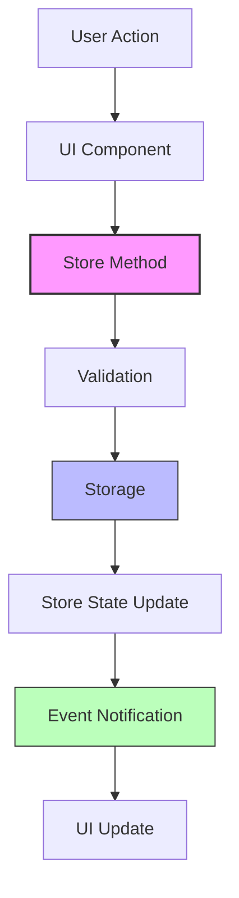

# Design Document

## Overview

This design rebuilds the IELTS exam system from the ground up using proper data structures and clear separation of concerns. The current system's 50+ modules and 2000+ line files will be replaced with a simple, predictable architecture based on Linus's principle: "Good programmers worry about data structures and their relationships."

**Critical Constraint**: The system must work in local file:// mode (users double-click index.html to run). This means:
- No ES6 modules (import/export) - use global variables and script tags
- No dynamic imports - all scripts loaded via `<script>` tags in HTML
- No fetch() for local files - use relative paths and direct file access
- localStorage works normally in file:// mode
- postMessage communication between windows works normally

The new architecture follows three core principles:
1. **Single Source of Truth**: Each data type has exactly one authoritative store
2. **Linear Data Flow**: Data flows in one direction: Input → Store → UI  
3. **Explicit Dependencies**: No hidden global state or circular dependencies
4. **File Protocol Compatibility**: All code works in file:// mode without a web server

## Architecture

### Core Structure (File Protocol Compatible)

```
js/
├── main.js              # Application entry point (< 100 lines)
├── stores/              # Data management (single source of truth)
│   ├── ExamStore.js     # Exam library management
│   ├── RecordStore.js   # Practice records management
│   └── AppStore.js      # Application state coordination
├── ui/                  # User interface components
│   ├── ExamBrowser.js   # Exam browsing interface
│   ├── RecordViewer.js  # Practice records display
│   └── SettingsPanel.js # System settings
└── utils/               # Pure utility functions
    ├── storage.js       # localStorage abstraction (keep existing)
    ├── validation.js    # Data validation
    └── events.js        # Simple event system

index.html               # Main entry point with all script tags
```

**Script Loading Order in index.html**:
```html
<!-- Utilities first -->
<script src="js/utils/storage.js"></script>
<script src="js/utils/validation.js"></script>
<script src="js/utils/events.js"></script>

<!-- Stores second -->
<script src="js/stores/ExamStore.js"></script>
<script src="js/stores/RecordStore.js"></script>
<script src="js/stores/AppStore.js"></script>

<!-- UI components third -->
<script src="js/ui/ExamBrowser.js"></script>
<script src="js/ui/RecordViewer.js"></script>
<script src="js/ui/SettingsPanel.js"></script>

<!-- Main application last -->
<script src="js/main.js"></script>
```

### Data Flow Architecture



## Components and Interfaces

### 1. Application Entry Point (main.js)

**Responsibility**: Coordinate system startup and provide global access point.

```javascript
// File protocol compatible - no ES6 modules, use global classes
class App {
    constructor() {
        // Ensure dependencies are loaded (classes defined globally)
        if (!window.ExamStore || !window.RecordStore || !window.AppStore) {
            throw new Error('Store classes not loaded. Check script order in HTML.');
        }
        
        this.stores = {
            exams: new window.ExamStore(),
            records: new window.RecordStore(),
            app: new window.AppStore()
        };
        this.ui = {};
    }
    
    async initialize() {
        try {
            // 1. Initialize stores (use existing storage system)
            await this.stores.exams.initialize();
            await this.stores.records.initialize();
            
            // 2. Initialize UI components
            this.ui.browser = new window.ExamBrowser(this.stores);
            this.ui.records = new window.RecordViewer(this.stores);
            this.ui.settings = new window.SettingsPanel(this.stores);
            
            // 3. Setup event routing
            this.setupEventRouting();
            
            console.log('[App] Initialization complete');
        } catch (error) {
            console.error('[App] Initialization failed:', error);
            // Show user-friendly error without hiding the real error
            this.showError('System failed to start: ' + error.message);
            throw error;
        }
    }
    
    showError(message) {
        // Use existing showMessage function if available
        if (window.showMessage) {
            window.showMessage(message, 'error');
        } else {
            alert(message);
        }
    }
}

// Single global variable - compatible with file:// protocol
window.App = new App();

// Auto-initialize when DOM is ready
document.addEventListener('DOMContentLoaded', async () => {
    try {
        await window.App.initialize();
    } catch (error) {
        console.error('[App] Failed to initialize:', error);
    }
});
```

### 2. Data Stores

#### ExamStore.js
**Responsibility**: Manage exam library data and operations.

```javascript
// Global class definition for file:// protocol compatibility
window.ExamStore = class ExamStore {
    constructor() {
        this.exams = [];
        this.categories = new Map(); // P1, P2, P3, P4
        this.observers = new Set();
        
        // Use existing storage system
        this.storage = window.storage;
        if (!this.storage) {
            throw new Error('Storage system not available. Check script loading order.');
        }
    }
    
    async initialize() {
        try {
            // Load from existing storage keys
            await this.loadExams();
            this.categorizeExams();
            console.log('[ExamStore] Initialized with', this.exams.length, 'exams');
        } catch (error) {
            console.error('[ExamStore] Initialization failed:', error);
            throw error;
        }
    }
    
    async loadExams() {
        // Use existing exam_index key and active configuration system
        const activeKey = await this.storage.get('active_exam_index_key', 'exam_index');
        const rawExams = await this.storage.get(activeKey, []);
        
        // Validate and normalize exam data
        this.exams = rawExams.filter(exam => exam && exam.id && exam.title);
        this.notify({ type: 'exams_loaded', exams: this.exams });
    }
    
    getExamsByCategory(category) {
        if (category === 'all') return this.exams;
        return this.exams.filter(exam => exam.category === category);
    }
    
    searchExams(query) {
        if (!query) return this.exams;
        const lowerQuery = query.toLowerCase();
        return this.exams.filter(exam => 
            exam.title.toLowerCase().includes(lowerQuery) ||
            exam.category.toLowerCase().includes(lowerQuery)
        );
    }
    
    categorizeExams() {
        this.categories.clear();
        this.exams.forEach(exam => {
            const category = exam.category || 'Unknown';
            if (!this.categories.has(category)) {
                this.categories.set(category, []);
            }
            this.categories.get(category).push(exam);
        });
    }
    
    // Simple observer pattern
    subscribe(callback) {
        this.observers.add(callback);
        return () => this.observers.delete(callback); // Return unsubscribe function
    }
    
    notify(event) {
        this.observers.forEach(callback => {
            try {
                callback(event);
            } catch (error) {
                console.error('[ExamStore] Observer error:', error);
            }
        });
    }
};
```

#### RecordStore.js
**Responsibility**: Manage practice records and statistics.

```javascript
// Global class definition for file:// protocol compatibility
window.RecordStore = class RecordStore {
    constructor() {
        this.records = [];
        this.stats = {
            totalPracticed: 0,
            averageScore: 0,
            studyTime: 0,
            streakDays: 0
        };
        this.observers = new Set();
        
        // Use existing storage system
        this.storage = window.storage;
        if (!this.storage) {
            throw new Error('Storage system not available. Check script loading order.');
        }
    }
    
    async initialize() {
        try {
            await this.loadRecords();
            this.calculateStats();
            console.log('[RecordStore] Initialized with', this.records.length, 'records');
        } catch (error) {
            console.error('[RecordStore] Initialization failed:', error);
            throw error;
        }
    }
    
    async loadRecords() {
        // Use existing practice_records key
        const rawRecords = await this.storage.get('practice_records', []);
        
        // Validate and normalize record data
        this.records = rawRecords.filter(record => 
            record && record.id && record.examId && record.date
        );
        
        this.notify({ type: 'records_loaded', records: this.records });
    }
    
    async saveRecord(record) {
        // Validate required fields
        if (!record.examId || !record.score) {
            throw new Error('Invalid record: missing examId or score');
        }
        
        // Add metadata
        const fullRecord = {
            id: record.id || 'record_' + Date.now(),
            examId: record.examId,
            date: record.date || new Date().toISOString(),
            duration: record.duration || 0,
            score: record.score,
            answers: record.answers || {},
            dataSource: record.dataSource || 'real',
            ...record
        };
        
        // Add to memory
        this.records.push(fullRecord);
        
        // Save to storage using existing key
        await this.storage.set('practice_records', this.records);
        
        // Update stats and notify
        this.calculateStats();
        this.notify({ type: 'record_saved', record: fullRecord });
        
        return fullRecord;
    }
    
    getRecords(filters = {}) {
        let filtered = [...this.records];
        
        if (filters.category) {
            // Need to cross-reference with exam data
            filtered = filtered.filter(record => {
                const exam = window.App?.stores?.exams?.exams?.find(e => e.id === record.examId);
                return exam && exam.category === filters.category;
            });
        }
        
        if (filters.type) {
            filtered = filtered.filter(record => {
                const exam = window.App?.stores?.exams?.exams?.find(e => e.id === record.examId);
                return exam && exam.type === filters.type;
            });
        }
        
        if (filters.dateFrom) {
            filtered = filtered.filter(record => new Date(record.date) >= new Date(filters.dateFrom));
        }
        
        return filtered.sort((a, b) => new Date(b.date) - new Date(a.date));
    }
    
    calculateStats() {
        const records = this.records;
        
        this.stats.totalPracticed = records.length;
        
        if (records.length > 0) {
            // Average score
            const totalScore = records.reduce((sum, record) => {
                const percentage = record.score?.percentage || record.percentage || 0;
                return sum + percentage;
            }, 0);
            this.stats.averageScore = Math.round(totalScore / records.length * 10) / 10;
            
            // Total study time
            this.stats.studyTime = records.reduce((sum, record) => sum + (record.duration || 0), 0);
            
            // Streak calculation
            this.stats.streakDays = this.calculateStreakDays(records);
        } else {
            this.stats.averageScore = 0;
            this.stats.studyTime = 0;
            this.stats.streakDays = 0;
        }
        
        this.notify({ type: 'stats_updated', stats: this.stats });
    }
    
    calculateStreakDays(records) {
        // Get unique practice dates
        const dates = [...new Set(records.map(r => new Date(r.date).toDateString()))]
            .sort((a, b) => new Date(b) - new Date(a));
        
        if (dates.length === 0) return 0;
        
        let streak = 0;
        const today = new Date();
        const yesterday = new Date(today);
        yesterday.setDate(today.getDate() - 1);
        
        // Check if practiced today or yesterday
        const latestDate = new Date(dates[0]);
        if (latestDate.toDateString() === today.toDateString() || 
            latestDate.toDateString() === yesterday.toDateString()) {
            
            streak = 1;
            
            // Count consecutive days
            for (let i = 0; i < dates.length - 1; i++) {
                const current = new Date(dates[i]);
                const next = new Date(dates[i + 1]);
                const diffDays = Math.ceil((current - next) / (1000 * 60 * 60 * 24));
                
                if (diffDays === 1) {
                    streak++;
                } else {
                    break;
                }
            }
        }
        
        return streak;
    }
    
    // Simple observer pattern
    subscribe(callback) {
        this.observers.add(callback);
        return () => this.observers.delete(callback);
    }
    
    notify(event) {
        this.observers.forEach(callback => {
            try {
                callback(event);
            } catch (error) {
                console.error('[RecordStore] Observer error:', error);
            }
        });
    }
};
```

#### AppStore.js
**Responsibility**: Coordinate between stores and manage application state.

```javascript
class AppStore {
    constructor() {
        this.currentView = 'overview';
        this.loading = false;
        this.errors = [];
        this.observers = new Set();
    }
    
    // Navigation
    setView(viewName) { /* Change current view */ }
    
    // Error handling
    addError(error) { /* Add error with context */ }
    clearErrors() { /* Clear error list */ }
    
    // Loading state
    setLoading(isLoading) { /* Update loading state */ }
}
```

### 3. User Interface Components

#### ExamBrowser.js
**Responsibility**: Display and interact with exam library.

```javascript
class ExamBrowser {
    constructor(stores) {
        this.stores = stores;
        this.element = document.getElementById('exam-browser');
        
        // Subscribe to store changes
        this.stores.exams.subscribe(this.render.bind(this));
    }
    
    render() {
        // Update UI based on store state
        const exams = this.stores.exams.getExamsByCategory(this.currentCategory);
        this.renderExamList(exams);
    }
    
    handleSearch(query) {
        const results = this.stores.exams.searchExams(query);
        this.renderExamList(results);
    }
    
    handleExamStart(examId) {
        // Open exam window and setup communication
        this.openExamWindow(examId);
    }
}
```

#### RecordViewer.js
**Responsibility**: Display practice records and statistics.

```javascript
class RecordViewer {
    constructor(stores) {
        this.stores = stores;
        this.element = document.getElementById('record-viewer');
        
        // Subscribe to store changes
        this.stores.records.subscribe(this.render.bind(this));
    }
    
    render() {
        this.renderStats(this.stores.records.stats);
        this.renderRecordList(this.stores.records.getRecords());
    }
    
    handleRecordComplete(recordData) {
        this.stores.records.saveRecord(recordData);
    }
}
```

## Data Models

### Exam Model
```javascript
{
    id: "p1-reading-001",
    title: "The History of Tea",
    category: "P1",           // P1, P2, P3, P4
    type: "reading",          // reading, listening
    path: "exams/p1/",
    filename: "tea-history.html",
    hasHtml: true,
    hasPdf: true,
    difficulty: "easy",       // easy, medium, hard
    topics: ["history", "culture"],
    createdAt: "2024-01-01T00:00:00Z"
}
```

### Practice Record Model
```javascript
{
    id: "record-001",
    examId: "p1-reading-001",
    startTime: "2024-01-01T10:00:00Z",
    endTime: "2024-01-01T10:20:00Z",
    duration: 1200,           // seconds
    score: {
        correct: 12,
        total: 15,
        percentage: 80
    },
    answers: {
        "q1": "A",
        "q2": "TRUE",
        "q3": "FALSE"
    },
    interactions: [
        {
            type: "answer_change",
            questionId: "q1",
            timestamp: 1704110400000,
            value: "A"
        }
    ],
    dataSource: "real"        // real, simulated
}
```

### Statistics Model
```javascript
{
    totalPracticed: 45,
    averageScore: 78.5,
    studyTime: 54000,         // total seconds
    streakDays: 7,
    categoryStats: {
        "P1": { count: 15, average: 85.2 },
        "P2": { count: 20, average: 75.8 },
        "P3": { count: 10, average: 68.4 }
    },
    lastUpdated: "2024-01-01T10:20:00Z"
}
```

## Error Handling

### Honest Error Reporting
Replace all `try/catch(_){}` blocks with explicit error handling:

```javascript
// Bad (current system)
try {
    await storage.set('data', value);
} catch(_) {}

// Good (new system)
try {
    await storage.set('data', value);
} catch(error) {
    this.stores.app.addError({
        message: 'Failed to save data',
        context: 'RecordStore.saveRecord',
        error: error,
        recoverable: true,
        userAction: 'Try saving again or export your data'
    });
    throw error; // Don't hide the error
}
```

### Error Recovery
Provide specific recovery instructions:

```javascript
class ErrorHandler {
    static handle(error, context) {
        const errorInfo = {
            message: error.message,
            context: context,
            timestamp: new Date().toISOString(),
            recoverable: ErrorHandler.isRecoverable(error),
            userMessage: ErrorHandler.getUserMessage(error, context),
            actions: ErrorHandler.getRecoveryActions(error, context)
        };
        
        // Log for developers
        console.error('[Error]', errorInfo);
        
        // Show to users
        window.App.stores.app.addError(errorInfo);
        
        return errorInfo;
    }
    
    static getUserMessage(error, context) {
        if (error.name === 'QuotaExceededError') {
            return 'Storage is full. Please export your data and clear old records.';
        }
        if (context.includes('network')) {
            return 'Network error. Check your connection and try again.';
        }
        return `Something went wrong: ${error.message}`;
    }
    
    static getRecoveryActions(error, context) {
        if (error.name === 'QuotaExceededError') {
            return ['Export data', 'Clear old records', 'Try again'];
        }
        if (context.includes('exam')) {
            return ['Refresh page', 'Try different exam', 'Report issue'];
        }
        return ['Refresh page', 'Try again'];
    }
}
```

## Testing Strategy

### Unit Testing
Each store and UI component will be testable in isolation:

```javascript
// ExamStore.test.js
describe('ExamStore', () => {
    let store;
    
    beforeEach(() => {
        store = new ExamStore();
    });
    
    test('should filter exams by category', () => {
        store.exams = [
            { id: '1', category: 'P1' },
            { id: '2', category: 'P2' }
        ];
        
        const p1Exams = store.getExamsByCategory('P1');
        expect(p1Exams).toHaveLength(1);
        expect(p1Exams[0].id).toBe('1');
    });
});
```

### Integration Testing
Test data flow between stores:

```javascript
// Integration.test.js
describe('Record Creation Flow', () => {
    test('should update statistics when record is saved', async () => {
        const recordStore = new RecordStore();
        const record = { score: { percentage: 85 } };
        
        await recordStore.saveRecord(record);
        
        expect(recordStore.stats.totalPracticed).toBe(1);
        expect(recordStore.stats.averageScore).toBe(85);
    });
});
```

### End-to-End Testing
Test complete user workflows:

```javascript
// E2E.test.js
describe('Practice Workflow', () => {
    test('should complete full practice session', async () => {
        // 1. Load exam library
        await window.App.stores.exams.loadExams();
        
        // 2. Start practice
        const exam = window.App.stores.exams.getExamsByCategory('P1')[0];
        window.App.ui.browser.handleExamStart(exam.id);
        
        // 3. Complete practice (simulated)
        const recordData = { examId: exam.id, score: { percentage: 80 } };
        window.App.ui.records.handleRecordComplete(recordData);
        
        // 4. Verify record saved
        const records = window.App.stores.records.getRecords();
        expect(records).toHaveLength(1);
        expect(records[0].examId).toBe(exam.id);
    });
});
```

## Migration Strategy

### Phase 1: Create New Architecture (Week 1)
1. Implement new stores (ExamStore, RecordStore, AppStore)
2. Create simple UI components
3. Set up data migration utilities
4. Implement error handling system

### Phase 2: Data Migration (Week 2)
1. Migrate existing localStorage data to new format
2. Validate data integrity
3. Create backup/restore functionality
4. Test with existing data

### Phase 3: UI Migration (Week 3)
1. Replace existing UI components one by one
2. Maintain feature parity
3. Add new error handling
4. Test all user workflows

### Phase 4: Cleanup (Week 4)
1. Remove old code files
2. Update documentation
3. Performance optimization
4. Final testing

### Data Migration Script
```javascript
class DataMigrator {
    static async migrate() {
        console.log('Starting data migration...');
        
        // Backup existing data
        const backup = await this.createBackup();
        
        try {
            // Migrate exam index
            await this.migrateExamIndex();
            
            // Migrate practice records
            await this.migratePracticeRecords();
            
            // Migrate user stats
            await this.migrateUserStats();
            
            console.log('Migration completed successfully');
        } catch (error) {
            console.error('Migration failed, restoring backup:', error);
            await this.restoreBackup(backup);
            throw error;
        }
    }
    
    static async migrateExamIndex() {
        const oldIndex = await storage.get('exam_index', []);
        const newExams = oldIndex.map(exam => ({
            id: exam.id,
            title: exam.title,
            category: exam.category,
            type: exam.type || 'reading',
            path: exam.path,
            filename: exam.filename,
            hasHtml: exam.hasHtml !== false,
            hasPdf: exam.hasPdf !== false,
            difficulty: this.inferDifficulty(exam.category),
            topics: this.extractTopics(exam.title),
            createdAt: new Date().toISOString()
        }));
        
        await storage.set('exams', newExams);
    }
}
```
##
 File Protocol Compatibility Requirements

### Critical Constraints for file:// Mode

1. **No ES6 Modules**: All code must use global variables and `<script>` tags
2. **Script Loading Order**: Dependencies must be loaded before dependents in HTML
3. **Relative Paths**: All paths relative to index.html location
4. **localStorage Works**: Normal localStorage functionality in file:// mode
5. **postMessage Works**: Cross-window communication works normally
6. **No Dynamic Imports**: All scripts loaded statically in HTML

### HTML Structure Requirements

```html
<!DOCTYPE html>
<html>
<head>
    <title>IELTS Practice System</title>
    <!-- Existing CSS -->
</head>
<body>
    <!-- Existing HTML structure -->
    
    <!-- Load scripts in dependency order -->
    <!-- 1. Utilities (no dependencies) -->
    <script src="js/utils/storage.js"></script>
    <script src="js/utils/validation.js"></script>
    <script src="js/utils/events.js"></script>
    
    <!-- 2. Stores (depend on utils) -->
    <script src="js/stores/ExamStore.js"></script>
    <script src="js/stores/RecordStore.js"></script>
    <script src="js/stores/AppStore.js"></script>
    
    <!-- 3. UI Components (depend on stores) -->
    <script src="js/ui/ExamBrowser.js"></script>
    <script src="js/ui/RecordViewer.js"></script>
    <script src="js/ui/SettingsPanel.js"></script>
    
    <!-- 4. Main app (depends on everything) -->
    <script src="js/main.js"></script>
</body>
</html>
```

### Data Compatibility

The new system will use existing localStorage keys to maintain compatibility:
- `exam_system_practice_records` - Practice records array
- `exam_system_exam_index` - Exam library index
- `exam_system_active_exam_index_key` - Active configuration key
- `exam_system_user_stats` - User statistics

### Migration Strategy (File Protocol Compatible)

#### Phase 1: Create New Architecture (Week 1)
1. Implement new stores (ExamStore, RecordStore, AppStore) as global classes
2. Create simple UI components that work with existing DOM structure  
3. Keep existing storage.js and localStorage keys for compatibility
4. Implement honest error handling system

#### Phase 2: Gradual Replacement (Week 2)
1. Replace existing functionality piece by piece
2. Maintain existing localStorage keys and data format
3. Test each component in file:// mode (double-click index.html)
4. Ensure postMessage communication still works for exam windows

#### Phase 3: UI Integration (Week 3)
1. Replace existing UI components while keeping same DOM structure
2. Maintain all existing features (search, filtering, statistics)
3. Keep existing CSS classes and styling
4. Test all user workflows in file:// mode

#### Phase 4: Cleanup and Optimization (Week 4)
1. Remove old code files gradually
2. Consolidate script tags in index.html
3. Performance testing in file:// mode
4. Final validation of all features

**Critical File Protocol Considerations**:
- All scripts must be loaded via `<script src="">` tags in HTML
- No dynamic imports or ES6 modules
- Relative paths must work from index.html location
- localStorage and postMessage work normally in file:// mode
- No fetch() for local files - use direct file paths