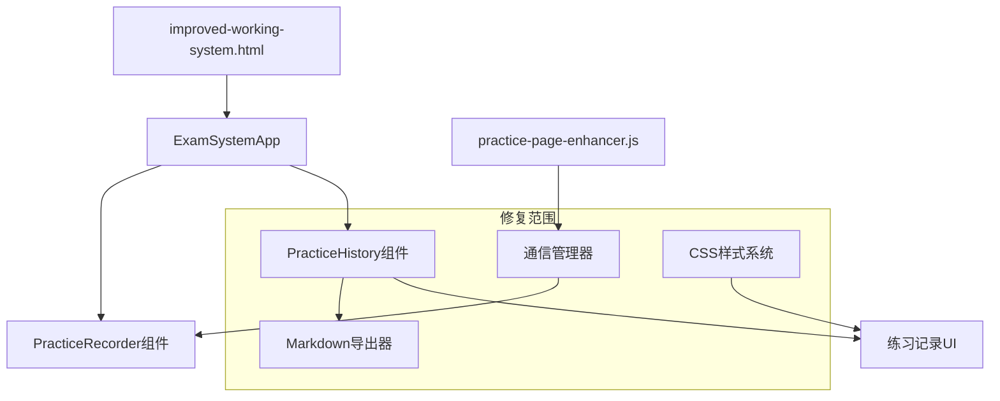

# IELTS系统修复设计文档

## 概述

本设计文档详细描述了IELTS考试系统修复的技术方案，包括练习记录交互优化、Markdown导出功能实现、通信错误修复和组件加载问题解决。设计遵循现有系统架构，确保向后兼容性和代码可维护性。

## 架构

### 系统组件关系



### 核心修复模块

1. **交互体验增强模块** - 优化练习记录标题的视觉反馈
2. **Markdown导出模块** - 实现标准格式的练习记录导出
3. **通信错误处理模块** - 修复跨窗口通信问题
4. **组件加载优化模块** - 解决组件初始化超时问题

## 组件和接口

### 1. 练习记录交互增强

#### 1.1 CSS样式增强
**文件**: `css/styles.css`

**新增样式类**:
```css
.record-title {
    cursor: pointer;
    transition: color 0.2s ease, text-decoration 0.2s ease;
    position: relative;
}

.record-title:hover {
    color: var(--primary-color);
    text-decoration: underline;
}

.record-title:hover::after {
    content: ' 👁️';
    opacity: 0.7;
    font-size: 0.8em;
    animation: fadeIn 0.2s ease;
}

@keyframes fadeIn {
    from { opacity: 0; }
    to { opacity: 0.7; }
}
```

#### 1.2 HTML结构确保
**文件**: `js/components/practiceHistory.js`

**修改方法**: `createRecordItem()`
- 确保标题元素具有正确的CSS类名
- 添加适当的数据属性用于事件处理

### 2. Markdown导出功能

#### 2.1 导出器接口设计
**文件**: `js/components/practiceHistory.js`

**新增方法**:
```javascript
class PracticeHistory {
    /**
     * 生成Markdown格式的练习记录
     * @param {Object} record - 练习记录对象
     * @returns {string} Markdown格式的文本
     */
    generateMarkdownExport(record) { }
    
    /**
     * 导出单个记录为Markdown文件
     * @param {string} recordId - 记录ID
     */
    exportRecordAsMarkdown(recordId) { }
    
    /**
     * 批量导出多个记录
     * @param {Array} recordIds - 记录ID数组
     */
    exportMultipleRecords(recordIds) { }
}
```

#### 2.2 Markdown格式规范
```markdown
## {category} {frequency} {examTitle} {score}

| 序号 | 正确答案 | 我的答案 | 对错 |
| --- | --- | --- | --- |
| Q1 | A | B | ❌ |
| Q2 | C | C | ✅ |
```

#### 2.3 数据兼容性处理
- 支持新格式数据（包含scoreInfo.details）
- 支持旧格式数据（仅包含answers对象）
- 优雅处理缺失的正确答案数据

### 3. 通信错误修复

#### 3.1 父窗口检测增强
**文件**: `js/practice-page-enhancer.js`

**修改方法**: `sendMessage()`
```javascript
sendMessage(type, data) {
    try {
        // 增强的父窗口检测
        if (!window.opener || window.opener.closed) {
            console.warn('[PracticeEnhancer] 父窗口不可用，尝试备用通信方式');
            this.handleCommunicationFallback(type, data);
            return false;
        }
        
        // 原有通信逻辑
        // ...
    } catch (error) {
        console.error('[PracticeEnhancer] 通信错误:', error);
        this.handleCommunicationError(error, type, data);
        return false;
    }
}
```

#### 3.2 备用通信机制
```javascript
/**
 * 处理通信回退机制
 */
handleCommunicationFallback(type, data) {
    // 使用localStorage作为备用通信方式
    const fallbackData = {
        type,
        data,
        timestamp: Date.now(),
        sessionId: this.sessionId
    };
    
    localStorage.setItem('practice_communication_fallback', JSON.stringify(fallbackData));
    
    // 触发存储事件通知主窗口
    window.dispatchEvent(new StorageEvent('storage', {
        key: 'practice_communication_fallback',
        newValue: JSON.stringify(fallbackData)
    }));
}
```

### 4. 组件加载优化

#### 4.1 组件加载超时处理
**文件**: `js/app.js`

**修改方法**: `waitForComponents()`
```javascript
async waitForComponents(requiredClasses, timeout = 10000) {
    const startTime = Date.now();
    const checkInterval = 100;
    
    while (Date.now() - startTime < timeout) {
        const allLoaded = requiredClasses.every(className => {
            const isLoaded = window[className] && typeof window[className] === 'function';
            if (!isLoaded) {
                console.debug(`等待组件加载: ${className}`);
            }
            return isLoaded;
        });
        
        if (allLoaded) {
            console.log('所有必需组件已加载');
            return true;
        }
        
        await new Promise(resolve => setTimeout(resolve, checkInterval));
    }
    
    // 详细的错误信息
    const missingClasses = requiredClasses.filter(className => 
        !window[className] || typeof window[className] !== 'function'
    );
    
    throw new Error(`组件加载超时。缺失组件: ${missingClasses.join(', ')}`);
}
```

#### 4.2 渐进式组件初始化
```javascript
async initializeComponents() {
    const coreComponents = ['PracticeRecorder', 'ExamScanner'];
    const optionalComponents = ['PracticeHistory', 'CommunicationTester'];
    
    try {
        // 首先加载核心组件
        await this.waitForComponents(coreComponents, 5000);
        this.initializeCoreComponents();
        
        // 然后加载可选组件
        try {
            await this.waitForComponents(optionalComponents, 3000);
            this.initializeOptionalComponents();
        } catch (error) {
            console.warn('部分可选组件加载失败，系统将以降级模式运行:', error);
        }
        
    } catch (error) {
        console.error('核心组件加载失败:', error);
        throw error;
    }
}
```

## 数据模型

### 练习记录数据结构
```javascript
{
    id: "string",           // 记录唯一标识
    examId: "string",       // 考试ID
    startTime: "timestamp", // 开始时间
    endTime: "timestamp",   // 结束时间
    duration: "number",     // 持续时间(毫秒)
    status: "completed|interrupted", // 状态
    accuracy: "number",     // 正确率(0-1)
    correctAnswers: "number", // 正确答案数
    totalQuestions: "number", // 总题目数
    answers: {              // 用户答案(旧格式)
        "questionId": "answer"
    },
    scoreInfo: {            // 评分信息(新格式)
        details: {
            "questionId": {
                userAnswer: "string",
                correctAnswer: "string",
                isCorrect: "boolean"
            }
        }
    },
    metadata: {             // 元数据
        examTitle: "string",
        category: "P1|P2|P3",
        frequency: "high|low"
    }
}
```

### 通信消息格式
```javascript
{
    type: "string",         // 消息类型
    data: "object",         // 消息数据
    timestamp: "number",    // 时间戳
    sessionId: "string"     // 会话ID
}
```

## 错误处理

### 1. 通信错误处理策略
- **主要通信方式**: window.postMessage
- **备用通信方式**: localStorage + StorageEvent
- **错误恢复**: 自动重试机制
- **用户反馈**: 友好的错误提示

### 2. 组件加载错误处理
- **超时检测**: 可配置的超时时间
- **渐进式加载**: 核心组件优先
- **降级模式**: 部分功能不可用时的备用方案
- **错误报告**: 详细的错误信息和调试数据

### 3. 数据兼容性错误处理
- **格式检测**: 自动识别新旧数据格式
- **数据转换**: 旧格式到新格式的转换
- **缺失数据**: 优雅处理缺失字段
- **数据验证**: 输入数据的完整性检查

## 测试策略

### 1. 单元测试
- CSS样式效果测试
- Markdown导出格式验证
- 通信功能模拟测试
- 数据转换逻辑测试

### 2. 集成测试
- 跨窗口通信完整流程
- 组件加载和初始化流程
- 用户交互完整路径
- 错误恢复机制验证

### 3. 用户体验测试
- 交互反馈及时性
- 错误提示友好性
- 功能可用性验证
- 性能影响评估

### 4. 兼容性测试
- 新旧数据格式兼容性
- 不同浏览器兼容性
- 组件依赖关系验证
- 降级模式功能验证

## 性能考虑

### 1. 渲染优化
- 虚拟滚动（如果记录数量很大）
- 防抖搜索输入
- 分页加载减少DOM节点

### 2. 内存管理
- 及时清理事件监听器
- 避免内存泄漏
- 合理的缓存策略

### 3. 网络优化
- 减少不必要的通信
- 批量处理消息
- 压缩导出文件

## 安全考虑

### 1. 数据安全
- 输入数据验证
- XSS防护
- 安全的文件下载

### 2. 通信安全
- 消息来源验证
- 数据完整性检查
- 防止恶意注入

## 部署和维护

### 1. 部署策略
- 向后兼容的渐进式部署
- 功能开关控制
- 回滚机制

### 2. 监控和日志
- 错误监控和报告
- 性能指标收集
- 用户行为分析

### 3. 维护计划
- 定期代码审查
- 性能优化
- 功能增强