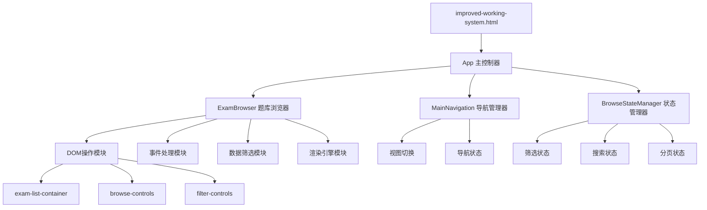
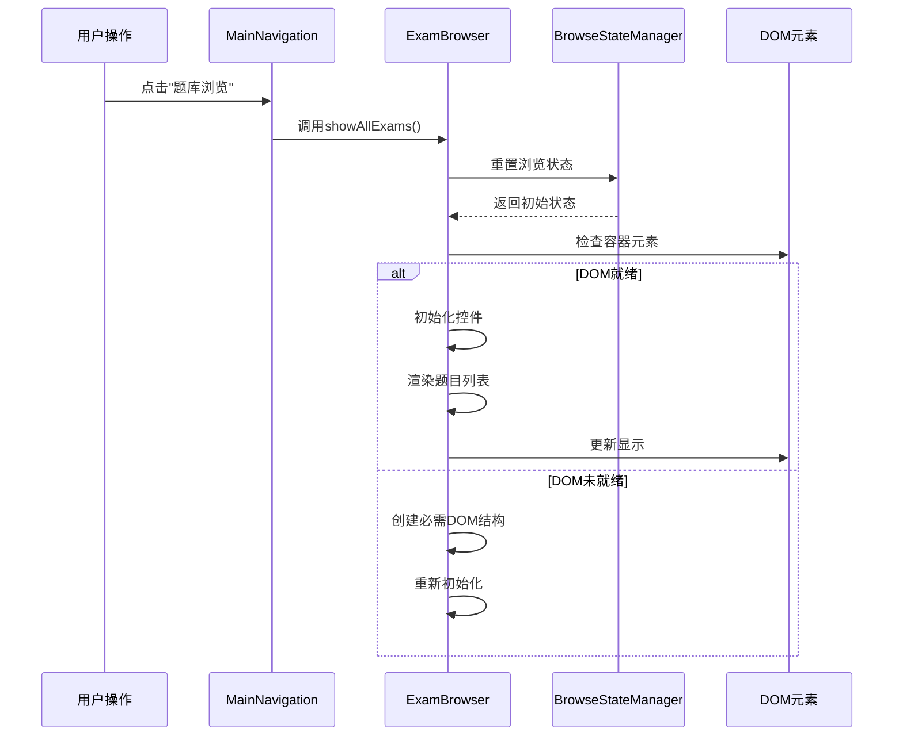
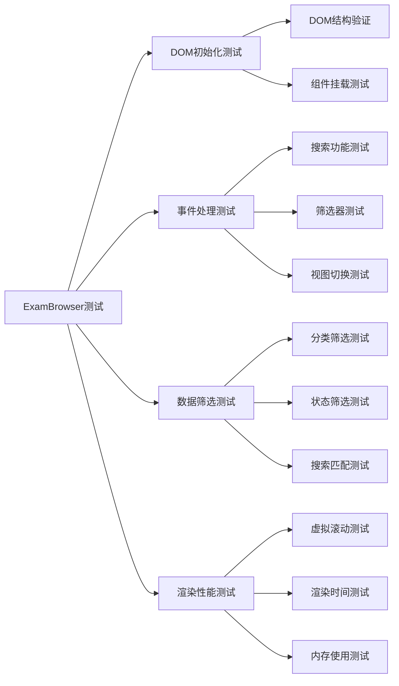

# IELTS题库浏览功能修复设计文档

## 概述

基于对IELTS系统文档和代码的深度分析，发现题库浏览功能存在多个关键问题需要修复。本设计针对当前系统架构，提供完整的修复方案，确保题库浏览功能的稳定性和用户体验。

## 问题分析

### 核心问题识别

1. **DOM结构不匹配**
   - ExamBrowser组件期望的DOM元素缺失
   - `exam-list` 与 `exam-list-container` 映射错误
   - 浏览器控件HTML结构未正确初始化

2. **组件初始化时机问题**
   - ExamBrowser组件加载顺序不当
   - 依赖的DOM元素未准备就绪时组件已初始化
   - 缺乏适当的组件就绪状态检查

3. **事件监听器冲突**
   - 新旧事件处理机制共存导致冲突
   - 重复的事件绑定导致功能异常
   - 搜索功能的防抖机制失效

4. **状态管理不一致**
   - 全局变量与组件内部状态同步问题
   - 筛选状态在组件间传递错误
   - 浏览历史状态丢失

## 架构设计

### 修复后的组件架构图



### 数据流设计



## 详细修复方案

### 1. DOM结构标准化

#### 现有问题
- `exam-list-container` 缺少内部结构
- 筛选控件未预先定义
- 搜索框位置不一致

#### 修复策略

```html
<!-- 标准化的DOM结构 -->
<div id="browse-view" class="view">
    <div class="browse-header">
        <button class="btn back-btn" onclick="showView('overview')">← 返回总览</button>
        <h2 id="browse-title">📚 题库浏览</h2>
    </div>
    
    <div class="browse-controls">
        <div class="search-section">
            <input type="text" id="exam-search-input" class="search-input" 
                   placeholder="搜索题目..." />
        </div>
        
        <div class="filter-section">
            <select id="frequency-filter" class="filter-select">
                <option value="all">全部频率</option>
                <option value="high">高频</option>
                <option value="low">次高频</option>
            </select>
            
            <select id="status-filter" class="filter-select">
                <option value="all">全部状态</option>
                <option value="completed">已完成</option>
                <option value="incomplete">未完成</option>
            </select>
            
            <select id="difficulty-filter" class="filter-select">
                <option value="all">全部难度</option>
                <option value="easy">简单</option>
                <option value="medium">中等</option>
                <option value="hard">困难</option>
            </select>
        </div>
        
        <div class="view-controls">
            <button class="view-btn active" data-view="grid">⊞</button>
            <button class="view-btn" data-view="list">☰</button>
        </div>
    </div>
    
    <div class="browse-stats">
        <span id="exam-count">0 个题目</span>
        <span id="filter-status"></span>
    </div>
    
    <div id="exam-list-container">
        <div id="exam-list" class="exam-grid">
            <!-- 题目内容将在此渲染 -->
        </div>
        
        <div class="loading-state" id="browse-loading" style="display:none;">
            <div class="spinner"></div>
            <p>正在加载题目列表...</p>
        </div>
        
        <div class="empty-state" id="browse-empty" style="display:none;">
            <div class="empty-icon">📝</div>
            <h3>暂无匹配题目</h3>
            <p>请尝试调整筛选条件</p>
        </div>
    </div>
</div>
```

### 2. ExamBrowser组件重构

#### 初始化流程优化

```javascript
class ExamBrowser {
    constructor() {
        this.initialized = false;
        this.domReady = false;
        this.retryCount = 0;
        this.maxRetries = 3;
        
        this.initialize();
    }

    async initialize() {
        try {
            // 等待DOM就绪
            await this.waitForDOM();
            
            // 创建必需的DOM结构
            this.ensureDOMStructure();
            
            // 初始化组件
            this.setupEventListeners();
            this.setupViewControls();
            this.setupSortControls();
            
            this.initialized = true;
            console.log('[ExamBrowser] 组件初始化完成');
            
        } catch (error) {
            console.error('[ExamBrowser] 初始化失败:', error);
            
            if (this.retryCount < this.maxRetries) {
                this.retryCount++;
                console.log(`[ExamBrowser] 重试初始化 (${this.retryCount}/${this.maxRetries})`);
                setTimeout(() => this.initialize(), 1000);
            } else {
                this.handleInitializationFailure(error);
            }
        }
    }

    async waitForDOM() {
        return new Promise((resolve, reject) => {
            const checkDOM = () => {
                const container = document.getElementById('exam-list-container');
                const browseView = document.getElementById('browse-view');
                
                if (container && browseView) {
                    this.domReady = true;
                    resolve();
                } else {
                    setTimeout(checkDOM, 100);
                }
            };
            
            checkDOM();
            
            // 超时处理
            setTimeout(() => {
                if (!this.domReady) {
                    reject(new Error('DOM元素加载超时'));
                }
            }, 5000);
        });
    }

    ensureDOMStructure() {
        const container = document.getElementById('exam-list-container');
        
        if (!container.querySelector('#exam-list')) {
            const examList = document.createElement('div');
            examList.id = 'exam-list';
            examList.className = 'exam-grid';
            container.appendChild(examList);
        }
        
        // 确保浏览控件存在
        if (!document.querySelector('.browse-controls')) {
            this.createBrowseControls();
        }
        
        // 确保状态显示区域存在
        if (!document.querySelector('.browse-stats')) {
            this.createBrowseStats();
        }
    }
}
```

### 3. 事件系统重构

#### 统一事件管理

```javascript
class EventManager {
    constructor() {
        this.listeners = new Map();
        this.initialized = false;
    }
    
    initialize() {
        if (this.initialized) return;
        
        // 清理旧的事件监听器
        this.cleanup();
        
        // 注册新的事件监听器
        this.registerGlobalListeners();
        this.registerSearchListeners();
        this.registerFilterListeners();
        this.registerViewListeners();
        
        this.initialized = true;
    }
    
    cleanup() {
        // 移除所有已注册的事件监听器
        this.listeners.forEach((listener, element) => {
            if (element && listener) {
                element.removeEventListener(listener.event, listener.handler);
            }
        });
        this.listeners.clear();
    }
    
    registerSearchListeners() {
        const searchInput = document.getElementById('exam-search-input');
        if (searchInput) {
            const handler = this.debounce((e) => {
                this.handleSearch(e.target.value);
            }, 300);
            
            searchInput.addEventListener('input', handler);
            this.listeners.set(searchInput, { event: 'input', handler });
        }
    }
    
    registerFilterListeners() {
        const filters = [
            'frequency-filter',
            'status-filter', 
            'difficulty-filter'
        ];
        
        filters.forEach(filterId => {
            const element = document.getElementById(filterId);
            if (element) {
                const handler = (e) => {
                    this.handleFilterChange(filterId, e.target.value);
                };
                
                element.addEventListener('change', handler);
                this.listeners.set(element, { event: 'change', handler });
            }
        });
    }
}
```

### 4. 状态管理系统

#### BrowseStateManager增强

```javascript
class BrowseStateManager {
    constructor() {
        this.state = {
            currentCategory: null,
            currentFrequency: null,
            viewMode: 'grid',
            sortBy: 'title',
            sortOrder: 'asc',
            filters: {
                frequency: 'all',
                status: 'all', 
                difficulty: 'all'
            },
            searchQuery: '',
            pagination: {
                page: 1,
                pageSize: 20,
                total: 0
            }
        };
        
        this.subscribers = [];
        this.history = [];
    }
    
    setState(newState) {
        // 保存历史状态
        this.history.push(JSON.parse(JSON.stringify(this.state)));
        if (this.history.length > 10) {
            this.history.shift();
        }
        
        // 更新状态
        this.state = { ...this.state, ...newState };
        
        // 通知订阅者
        this.notifySubscribers();
        
        // 持久化状态
        this.persistState();
    }
    
    subscribe(callback) {
        this.subscribers.push(callback);
        return () => {
            const index = this.subscribers.indexOf(callback);
            if (index > -1) {
                this.subscribers.splice(index, 1);
            }
        };
    }
    
    notifySubscribers() {
        this.subscribers.forEach(callback => {
            try {
                callback(this.state);
            } catch (error) {
                console.error('[BrowseStateManager] 订阅者回调错误:', error);
            }
        });
    }
}
```

## 渲染优化设计

### 虚拟滚动实现

```javascript
class VirtualScroller {
    constructor(container, items, renderer, options = {}) {
        this.container = container;
        this.items = items;
        this.renderer = renderer;
        this.itemHeight = options.itemHeight || 120;
        this.bufferSize = options.bufferSize || 5;
        this.containerHeight = options.containerHeight || 600;
        
        this.visibleStart = 0;
        this.visibleEnd = 0;
        this.renderedItems = new Map();
        
        this.initialize();
    }
    
    initialize() {
        this.setupScrollContainer();
        this.calculateVisibleRange();
        this.renderVisible();
        this.setupScrollListener();
    }
    
    calculateVisibleRange() {
        const scrollTop = this.container.scrollTop;
        const visibleItems = Math.ceil(this.containerHeight / this.itemHeight);
        
        this.visibleStart = Math.max(0, 
            Math.floor(scrollTop / this.itemHeight) - this.bufferSize
        );
        this.visibleEnd = Math.min(this.items.length - 1,
            this.visibleStart + visibleItems + (this.bufferSize * 2)
        );
    }
    
    renderVisible() {
        // 清理不可见的元素
        this.renderedItems.forEach((element, index) => {
            if (index < this.visibleStart || index > this.visibleEnd) {
                element.remove();
                this.renderedItems.delete(index);
            }
        });
        
        // 渲染可见的元素
        for (let i = this.visibleStart; i <= this.visibleEnd; i++) {
            if (!this.renderedItems.has(i)) {
                const element = this.renderer(this.items[i], i);
                element.style.position = 'absolute';
                element.style.top = `${i * this.itemHeight}px`;
                element.style.width = '100%';
                
                this.container.appendChild(element);
                this.renderedItems.set(i, element);
            }
        }
    }
}
```

## 性能监控与错误恢复

### 错误恢复机制

```javascript
class ExamBrowserRecovery {
    constructor(examBrowser) {
        this.examBrowser = examBrowser;
        this.errorCount = 0;
        this.maxErrors = 5;
        this.recoveryStrategies = [
            this.reInitializeDOM,
            this.reloadExamData,
            this.fallbackToBasicView,
            this.resetToDefault
        ];
    }
    
    handleError(error, context) {
        this.errorCount++;
        console.error(`[ExamBrowserRecovery] 错误 ${this.errorCount}:`, error);
        
        if (this.errorCount > this.maxErrors) {
            this.handleCriticalFailure();
            return;
        }
        
        // 尝试恢复策略
        const strategy = this.recoveryStrategies[Math.min(this.errorCount - 1, 
            this.recoveryStrategies.length - 1)];
        
        try {
            strategy.call(this, error, context);
        } catch (recoveryError) {
            console.error('[ExamBrowserRecovery] 恢复策略失败:', recoveryError);
            this.handleError(recoveryError, 'recovery');
        }
    }
    
    reInitializeDOM() {
        console.log('[Recovery] 重新初始化DOM结构');
        this.examBrowser.ensureDOMStructure();
        this.examBrowser.initialize();
    }
    
    reloadExamData() {
        console.log('[Recovery] 重新加载题目数据');
        window.loadLibrary();
        setTimeout(() => {
            this.examBrowser.refreshExamList();
        }, 1000);
    }
    
    fallbackToBasicView() {
        console.log('[Recovery] 启用基础视图模式');
        const container = document.getElementById('exam-list-container');
        if (container) {
            container.innerHTML = this.generateBasicFallbackHTML();
        }
    }
}
```

## 测试策略

### 单元测试覆盖



### 集成测试方案

1. **浏览器兼容性测试**
   - Chrome/Edge/Firefox/Safari
   - 移动端浏览器适配
   - 不同屏幕分辨率测试

2. **性能基准测试**
   - 大数据量加载测试（100+题目）
   - 搜索响应时间测试
   - 内存泄漏检测

3. **用户体验测试**
   - 操作流程完整性
   - 错误恢复有效性
   - 界面响应性测试