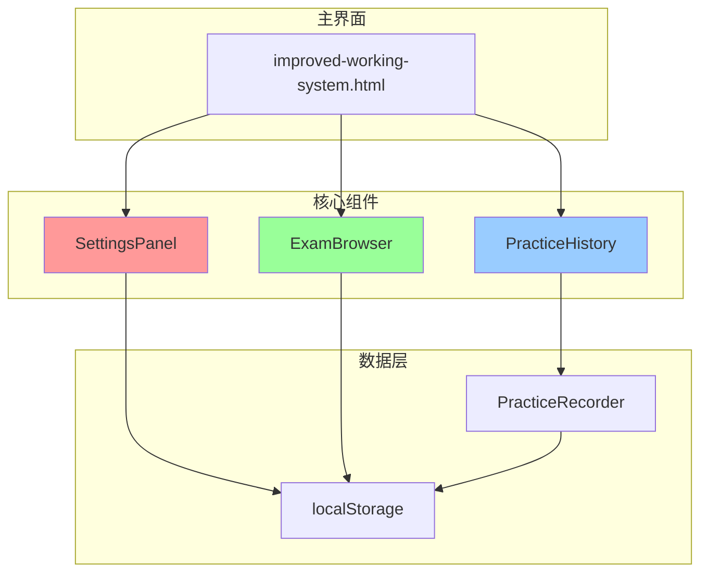
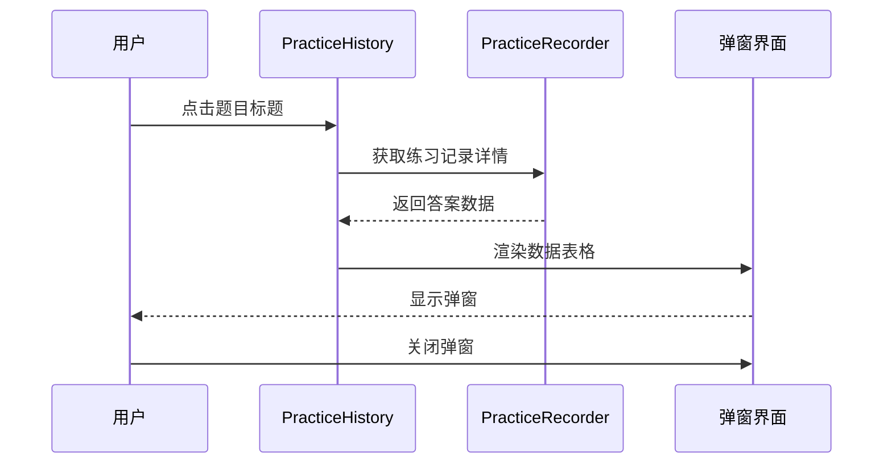
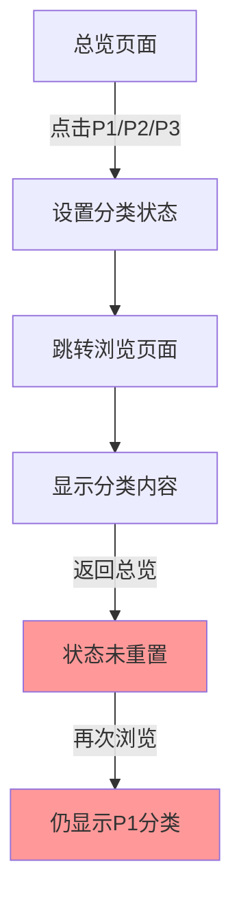
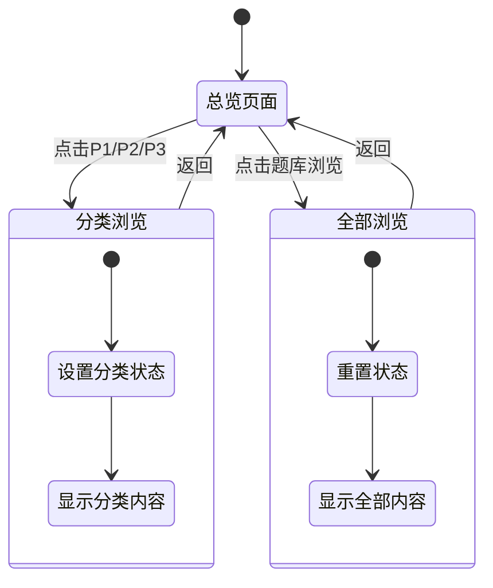
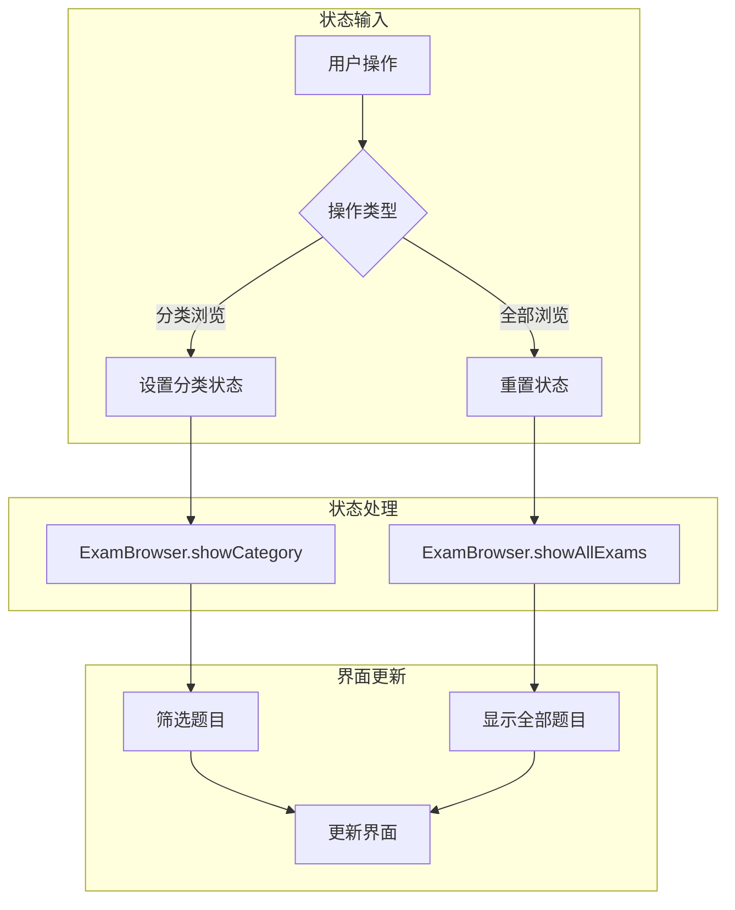

# IELTS系统设置界面优化设计文档

## 概述

本文档描述了对IELTS考试系统进行的三项关键功能优化：删除设置页面中的系统检测和用户体验检查按钮、为练习历史添加记录查看功能，以及修复题库浏览页面的状态管理问题。

## 技术架构

### 系统架构
基于前端单页应用(SPA)架构，使用JavaScript ES6+模块化设计：
- 主界面：`improved-working-system.html`
- 设置管理：`js/components/settingsPanel.js`
- 练习记录：`js/components/practiceHistory.js`
- 题库浏览：`js/components/examBrowser.js`
- 数据存储：浏览器localStorage

### 组件交互关系



## 功能设计

### 1. 设置界面系统管理优化

#### 当前问题
设置界面系统管理区域存在两个功能按钮需要删除：
- "🔧 系统检测" (`runSystemIntegrationTest()`)
- "👤 用户体验检查" (`runUserExperienceValidation()`)

#### 设计方案

**主要修改文件：**
- `improved-working-system.html` (行653-660) - 删除按钮
- `improved-working-system.html` (行1317-1380) - 删除 `runSystemIntegrationTest()` 函数
- `improved-working-system.html` (行2185-2285) - 删除 `runUserExperienceValidation()` 函数

**需要删除的按钮：**
```html
<button class="btn btn-info" onclick="runSystemIntegrationTest()">🔧 系统检测</button>
<button class="btn" onclick="runUserExperienceValidation()">👤 用户体验检查</button>
```

**需要删除的JavaScript文件：**
- `js/components/SystemIntegrationTester.js` - 系统集成测试器组件
- `js/components/UserExperienceValidator.js` - 用户体验验证器组件

**需要清理的脚本引用：**
```html
<!-- 删除这两行 -->
<script src="js/components/UserExperienceValidator.js"></script>
<script src="js/components/SystemIntegrationTester.js"></script>
```

**需要清理的验证引用：**
- `system-validation.js` 中对这两个组件的引用
- 性能优化器中的懒加载引用

**保留功能：**
- 清除缓存
- 重新加载题库  
- 性能报告
- 完整功能验证

#### 界面布局


#### 代码清理策略

**1. 文件级别清理：**
- 删除整个组件文件
- 清理脚本引用
- 移除相关函数

**2. 依赖清理：**
- 清理 `system-validation.js` 中的组件验证逻辑
- 移除性能优化器中的懒加载代码
- 清理错误处理中的相关逻辑

**3. 冗余代码优化：**
- 清理未使用的事件监听器
- 移除相关的CSS样式类
- 清理测试相关的辅助函数

### 2. 练习历史记录查看功能

#### 功能需求
在练习历史框中添加记录查看功能，点击练习历史中的题目标题时弹出该练习的详细数据表格。

#### 数据结构设计

**练习记录数据结构：**
```javascript
{
  id: "sessionId",
  examId: "examId", 
  startTime: "2024-01-01T00:00:00.000Z",
  answers: [
    {
      questionId: 1,
      userAnswer: "用户答案",
      correctAnswer: "正确答案", // 可能为空
      isCorrect: true/false
    }
  ],
  metadata: {
    examTitle: "题目标题",
    category: "P1/P2/P3"
  }
}
```

#### 表格设计

**表格表头结构：**
| 序号 | 正确答案 | 我的答案 | 对错 |
|------|----------|----------|------|
| 1    | Answer1  | MyAnswer1| ✓    |
| 2    | -        | MyAnswer2| ✗    |

**特殊处理：**
- 当原始数据中不含正确答案时，正确答案列显示为空("-")
- 对错列显示：✓(正确)、✗(错误)、-(无法判断)

#### 交互流程



#### 实现方案

**修改文件：**
- `js/components/practiceHistory.js`
- `improved-working-system.html` (练习历史显示部分)

**新增方法：**
```javascript
// 显示练习详情
showPracticeDetails(recordId) {
  // 获取记录数据
  // 生成表格HTML
  // 显示模态框
}

// 生成答案表格
generateAnswersTable(answersData) {
  // 表格结构生成
  // 数据映射处理
}
```

### 3. 题库浏览状态管理修复

#### 当前问题
题库浏览页面存在状态管理问题：
1. 首次从总览页面点击P1/P2/P3浏览题目正常
2. 返回总览后，再次打开题库浏览页面只显示P1内容
3. 无法正常展示全部题库内容

#### 问题分析

**根本原因：**
- `ExamBrowser` 组件的状态变量 `currentCategory` 未在适当时机重置
- 返回总览页面时没有清除浏览状态
- "题库浏览"按钮没有主动重置状态的逻辑

**状态管理流程问题：**


#### 解决方案

**核心修改点：**
1. 在 `ExamBrowser` 组件中添加状态重置方法
2. 修改 "题库浏览" 按钮逻辑确保显示全部内容  
3. 增强 `showView()` 函数的状态管理

**修改文件：**
- `js/components/examBrowser.js` - 添加状态重置逻辑
- `improved-working-system.html` - 修改按钮事件处理

**新增方法：**
```javascript
// ExamBrowser 组件中添加
resetBrowseState() {
  this.currentCategory = null;
  this.currentFrequency = null;
  this.filters.frequency = 'all';
}

// 显示全部题目
showAllExams() {
  this.resetBrowseState();
  this.refreshExamList();
  this.updateBrowseStats();
}
```

**状态管理优化：**
```javascript
// 修改题库浏览按钮逻辑
function showView(viewName) {
  // ... 现有逻辑 ...
  
  if (viewName === 'browse' && window.app?.components?.examBrowser) {
    // 确保显示全部题目
    window.app.components.examBrowser.showAllExams();
  }
}
```

#### 状态管理优化后的流程



## 数据流设计

### 练习记录数据流


### 浏览状态数据流



## 界面设计

### 练习详情弹窗界面

```
┌─────────────────────────────────────┐
│  练习详情 - [题目标题]        [×]   │
├─────────────────────────────────────┤
│ ┌─────┬──────────┬──────────┬─────┐ │
│ │序号 │ 正确答案 │ 我的答案 │对错 │ │
│ ├─────┼──────────┼──────────┼─────┤ │
│ │  1  │ Answer1  │MyAnswer1 │ ✓   │ │
│ │  2  │    -     │MyAnswer2 │ ✗   │ │
│ │  3  │ Answer3  │MyAnswer3 │ ✓   │ │
│ └─────┴──────────┴──────────┴─────┘ │
├─────────────────────────────────────┤
│ 统计：3题，正确率：66.7%            │
│                    [关闭]           │
└─────────────────────────────────────┘
```

### 设置页面系统管理区域

```
┌─────────────────────────────────────┐
│ 🔧 系统管理                         │
│ 系统工具和设置选项                  │
│                                     │
│ [🗑️ 清除缓存] [🔄 重新加载题库]    │
│ [📊 性能报告] [✅ 完整功能验证]     │
└─────────────────────────────────────┘
```

## 测试策略

### 功能测试用例

**设置界面测试：**
1. 验证系统检测按钮已删除
2. 验证用户体验检查按钮已删除  
3. 验证其他功能按钮正常工作
4. 验证清理后的文件不存在
5. 验证脚本引用已移除

**练习记录测试：**
1. 点击练习历史标题显示详情弹窗
2. 验证表格数据正确显示
3. 测试无正确答案时的显示处理
4. 验证弹窗关闭功能
5. 测试不同数据量级的性能

**题库浏览测试：**
1. 从总览点击分类浏览功能正常
2. 返回总览后状态正确重置
3. 再次点击题库浏览显示全部内容
4. 验证状态切换的一致性
5. 测试性能优化效果

**代码清理测试：**
1. 验证已删除的文件不存在
2. 检查引用错误不出现
3. 验证系统功能正常
4. 测试加载性能提升
5. 检查内存占用减少

### 兼容性测试

**浏览器兼容性：**
- Chrome 80+
- Firefox 75+
- Safari 13+
- Edge 80+

**数据兼容性：**
- 现有练习记录数据向后兼容
- localStorage数据结构保持一致
- 升级过程中数据不丢失

### 回归测试

**核心功能验证：**
1. 题库加载和显示
2. 练习记录保存和查看
3. 设置的正常操作
4. 数据导入导出
5. 性能监控和报告

## 性能考虑

### 代码清理优化

#### 删除文件清单

**主要组件文件：**
- `js/components/SystemIntegrationTester.js` (542行) - 系统集成测试器
- `js/components/UserExperienceValidator.js` (239行) - 用户体验验证器

**相关函数：**
- `improved-working-system.html` 中的 `runSystemIntegrationTest()` 函数 (64行)
- `improved-working-system.html` 中的 `runUserExperienceValidation()` 函数 (100行)
- `improved-working-system.html` 中的 `getUXStatusText()` 辅助函数

**脚本引用清理：**
```html
<!-- 在 improved-working-system.html 中删除 -->
<script src="js/components/UserExperienceValidator.js"></script>
<script src="js/components/SystemIntegrationTester.js"></script>
```

**验证逻辑清理：**
- `system-validation.js` 中的 `requiredComponents` 数组需要移除这两个组件
- 清理性能优化器中的懒加载逻辑

#### 清理效益

**文件大小减少：**
- SystemIntegrationTester.js: ~18KB
- UserExperienceValidator.js: ~8KB
- 相关函数代码: ~6KB
- **总计减少：~32KB**

**加载性能提升：**
- 减少HTTP请求数量：2个
- 减少JavaScript解析时间
- 降低内存占用

**维护性优化：**
- 减少代码复杂度
- 简化调试和测试
- 降低功能耦合度

### 数据处理优化
- 练习详情弹窗按需加载数据
- 大量记录时使用虚拟滚动
- 缓存频繁访问的记录数据

### 内存管理
- 及时清理弹窗DOM元素
- 避免事件监听器内存泄漏
- 优化数据结构减少内存占用

### 响应速度
- 状态切换响应时间 < 200ms
- 弹窗显示延迟 < 300ms
- 数据加载时间 < 500ms