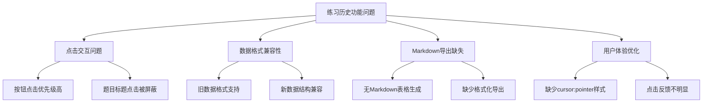
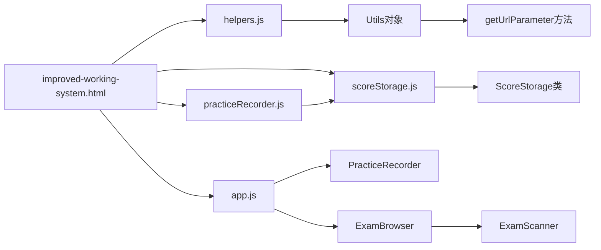
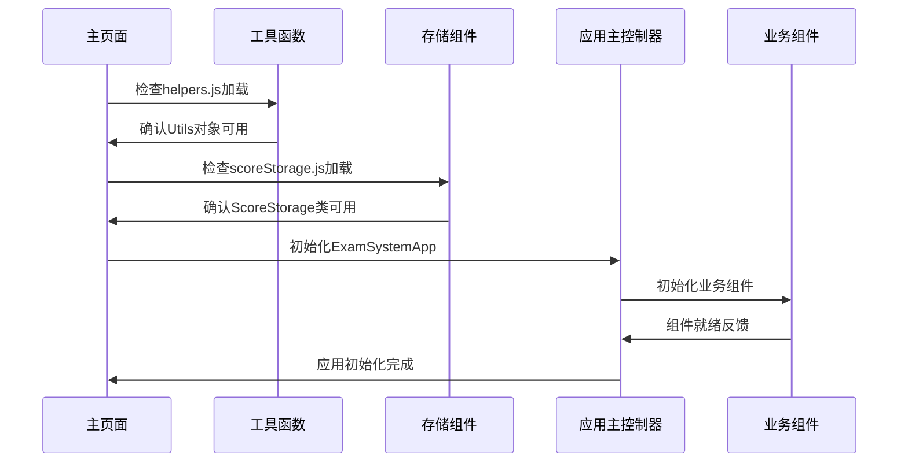
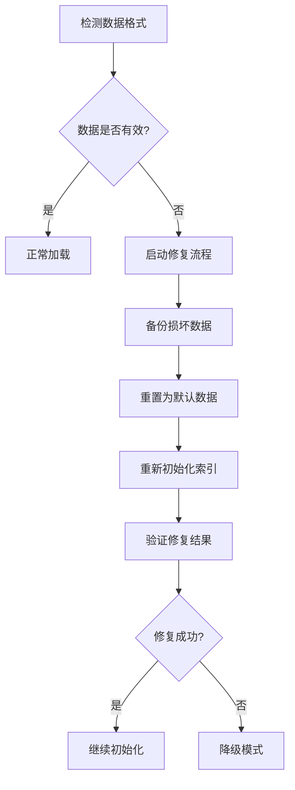
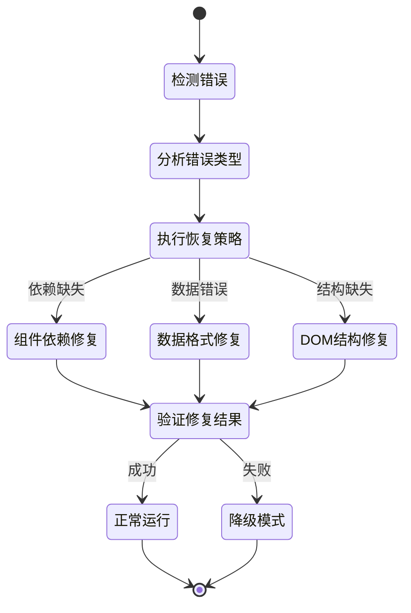
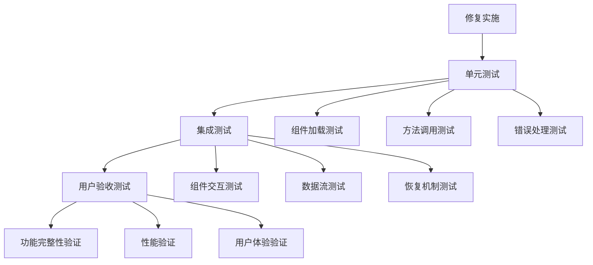
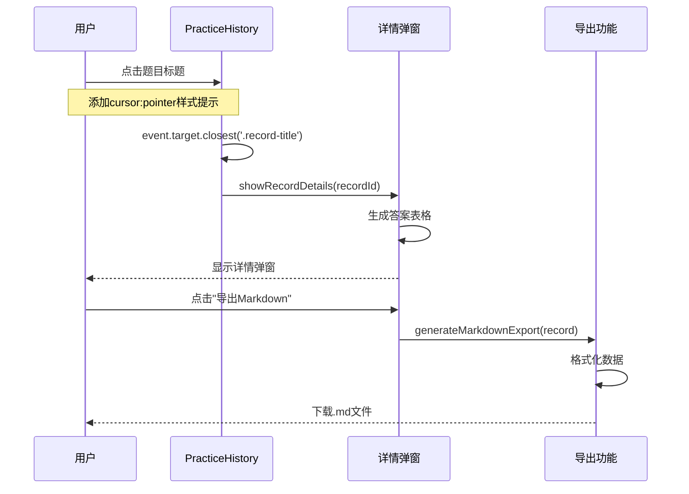
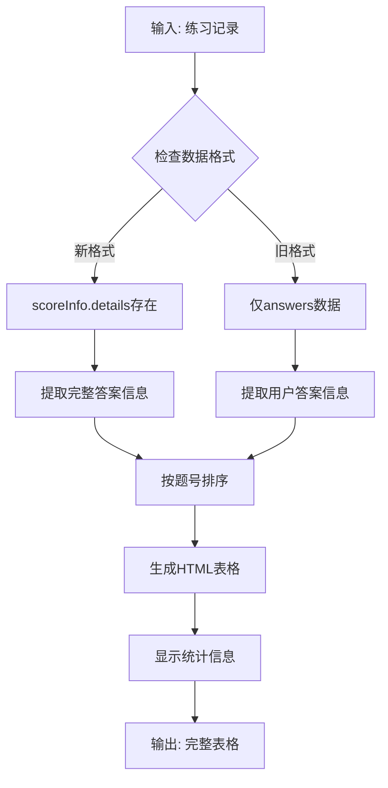
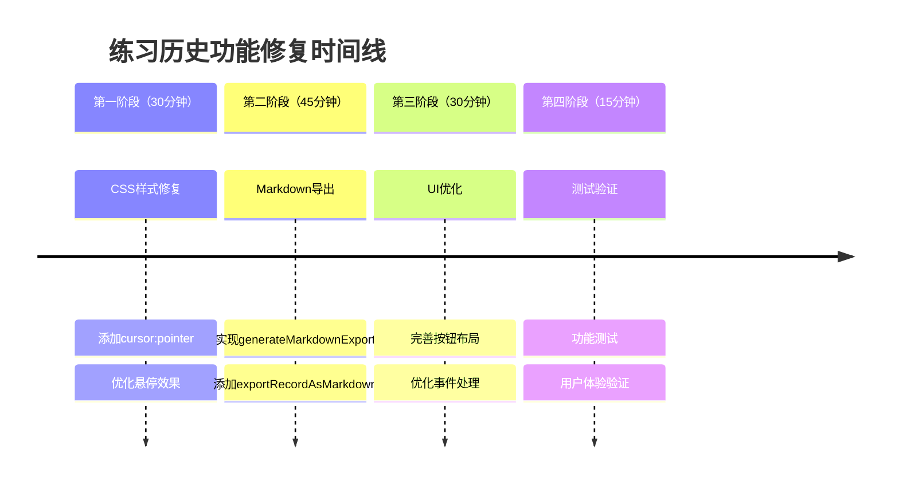

# 练习历史记录查看功能修复设计

## 概述

本设计文档针对IELTS练习系统中的练习历史记录查看功能进行分析、修复和完善。经过代码review发现，系统已具备基础的练习历史查看功能，包括记录列表、详情弹窗和答案表格生成，但存在一些功能不完善和用户体验问题需要修复。

## 技术栈

- **前端框架**: 原生JavaScript (ES6+)
- **存储机制**: localStorage
- **UI组件**: PracticeHistory类
- **样式系统**: CSS3 + 自定义样式类
- **交互方式**: 点击事件 + 模态框弹窗

## 系统代码Review分析

### 当前功能现状评估

经过对PracticeHistory组件的详细分析，发现系统已具备以下功能：

#### 已实现的核心功能

| 功能模块 | 实现状态 | 代码位置 | 功能评估 |
|---------|---------|---------|----------|
| 练习记录列表 | ✅ 已实现 | practiceHistory.js:L45-L52 | 点击监听正常 |
| 详情弹窗显示 | ✅ 已实现 | practiceHistory.js:L713-L827 | showRecordDetails方法完整 |
| 答案表格生成 | ✅ 已实现 | practiceHistory.js:L829-L920 | generateAnswersTable方法完整 |
| 记录数据结构 | ✅ 已实现 | 多个文件 | 支持新旧格式 |
| 点击交互 | ✅ 已实现 | practiceHistory.js:L40-L65 | 事件委托正常 |
| Markdown导出 | ⚠️ 部分实现 | practiceHistory.js:L975-L1025 | 缺少Markdown格式 |

#### 存在的问题分析



### 核心问题识别

基于前端组件交互规范要求：

> 点击列表项中的具体字段（如题目标题）触发详情查看功能时，需要为可点击元素添加cursor:pointer样式提示，并在事件处理中使用event.target.closest()方法确保准确识别点击目标

**发现问题**：
1. 当前组件使用了event.target.closest()方法，但缺少cursor:pointer样式
2. 点击事件处理正确，但用户体验不够直观
3. Markdown导出功能缺失，不符合用户需求

### 数据结构分析

系统已支持多种数据格式：

#### 新格式数据结构（支持完整详情）
```javascript
{
  id: "sessionId",
  examId: "examId", 
  startTime: "2024-01-01T00:00:00.000Z",
  endTime: "2024-01-01T01:00:00.000Z",
  answers: {"q1": "answer1", "q2": "answer2"},
  scoreInfo: {
    details: {
      "q1": {
        userAnswer: "answer1",
        correctAnswer: "correct1",
        isCorrect: false
      },
      "q2": {
        userAnswer: "answer2", 
        correctAnswer: "answer2",
        isCorrect: true
      }
    }
  },
  metadata: {
    examTitle: "题目标题",
    category: "P1/P2/P3"
  }
}
```

#### 旧格式数据结构（仅用户答案）
```javascript
{
  id: "sessionId",
  examId: "examId",
  answers: {"q1": "answer1", "q2": "answer2"},
  // 无scoreInfo.details，缺少正确答案
}
```

## 系统架构修复方案

### 依赖关系图



### 组件初始化流程



## 主要修复方案实施

### 修复方案一：优化点击交互体验

**问题**: 题目标题可点击但缺少视觉提示，用户体验不佳

**修复位置**: css/styles.css 和 practiceHistory.js

**解决方案**：

1. **添加样式提示**（css/styles.css）：
```css
/* 练习记录标题点击样式 */
.record-title {
    cursor: pointer;
    transition: color 0.2s ease, text-decoration 0.2s ease;
    position: relative;
}

.record-title:hover {
    color: var(--primary-color);
    text-decoration: underline;
}

.record-title:hover::after {
    content: ' 👁️';
    opacity: 0.7;
    font-size: 0.8em;
    animation: fadeIn 0.2s ease;
}

@keyframes fadeIn {
    from { opacity: 0; }
    to { opacity: 0.7; }
}
```

2. **确保HTML结构支持**（practiceHistory.js中renderHistoryList方法）：
```javascript
// 在生成记录项时确保标题具有正确的class
const recordHtml = `
    <div class="history-record-item" data-record-id="${record.id}">
        <div class="record-header">
            <h4 class="record-title clickable">${record.metadata.examTitle || record.examId}</h4>
            <!-- 其他内容 -->
        </div>
    </div>
`;
```

### 修复方案二：完善Markdown导出功能

**问题**: 缺少按需求格式的Markdown导出功能

**修复位置**: practiceHistory.js - exportHistory方法

**新增方法**：
```javascript
/**
 * 生成Markdown格式的练习记录导出
 */
generateMarkdownExport(record) {
    const examTitle = record.metadata.examTitle || record.examId;
    const category = record.metadata.category || 'Unknown';
    const frequency = record.metadata.frequency === 'high' ? '高频' : '次高频';
    const accuracy = Math.round(record.accuracy * 100);
    const score = `${record.correctAnswers}/${record.totalQuestions}`;
    
    let markdown = `## ${category} ${frequency} ${examTitle} ${score}\n`;
    markdown += `| 序号 | 正确答案 | 我的答案 | 对错 |\n`;
    markdown += `| --- | --- | --- | --- |\n`;
    
    // 处理答案数据
    let answersData = [];
    if (record.scoreInfo && record.scoreInfo.details) {
        Object.entries(record.scoreInfo.details).forEach(([questionId, detail]) => {
            answersData.push({
                questionId: questionId,
                userAnswer: detail.userAnswer || '',
                correctAnswer: detail.correctAnswer || '',
                isCorrect: detail.isCorrect
            });
        });
    } else {
        Object.entries(record.answers || {}).forEach(([questionId, userAnswer]) => {
            answersData.push({
                questionId: questionId,
                userAnswer: userAnswer || '',
                correctAnswer: '', // 旧数据无正确答案
                isCorrect: null
            });
        });
    }
    
    // 排序并生成表格行
    answersData.sort((a, b) => {
        const aNum = parseInt(a.questionId.replace(/\D/g, '')) || 0;
        const bNum = parseInt(b.questionId.replace(/\D/g, '')) || 0;
        return aNum - bNum;
    });
    
    answersData.forEach((answer, index) => {
        const questionNum = answer.questionId.toUpperCase();
        const correctAnswer = answer.correctAnswer || '';
        const userAnswer = answer.userAnswer || '';
        const resultIcon = answer.isCorrect === true ? '✅' : 
                           answer.isCorrect === false ? '❌' : '❓';
        
        markdown += `| ${questionNum} | ${correctAnswer} | ${userAnswer} | ${resultIcon} |\n`;
    });
    
    return markdown;
}

/**
 * 导出单个记录为Markdown
 */
exportRecordAsMarkdown(recordId) {
    const record = this.filteredRecords.find(r => r.id === recordId);
    if (!record) {
        window.showMessage('记录不存在', 'error');
        return;
    }
    
    const markdown = this.generateMarkdownExport(record);
    const examTitle = record.metadata.examTitle || record.examId;
    const fileName = `${examTitle}-练习记录-${new Date().toISOString().split('T')[0]}.md`;
    
    // 下载文件
    const blob = new Blob([markdown], { type: 'text/markdown;charset=utf-8' });
    const url = URL.createObjectURL(blob);
    const a = document.createElement('a');
    a.href = url;
    a.download = fileName;
    document.body.appendChild(a);
    a.click();
    document.body.removeChild(a);
    URL.revokeObjectURL(url);
    
    window.showMessage('Markdown文件已导出', 'success');
}
```

### 修复方案三：增强详情弹窗功能

**修复位置**: practiceHistory.js - showRecordDetails方法

**增强功能**：
```javascript
// 在详情弹窗中添加Markdown导出按钮
const detailsContent = `
    <div class="record-details-modal">
        <!-- 现有内容 -->
        <div class="details-actions">
            <button class="btn btn-primary" onclick="window.app.components.practiceHistory.retryExam('${record.examId}')">
                重新练习
            </button>
            <button class="btn btn-secondary" onclick="window.app.components.practiceHistory.exportRecordAsMarkdown('${record.id}')">
                📄 导出Markdown
            </button>
            <button class="btn btn-outline" onclick="this.closest('.modal-overlay').remove()">
                关闭
            </button>
        </div>
    </div>
`;
```

### 修复方案四：优化事件处理逻辑

**修复位置**: practiceHistory.js - setupEventListeners方法

**优化点击处理**：
```javascript
// 监听视图激活事件
document.addEventListener('click', (e) => {
    // 优化点击处理顺序，避免按钮点击被标题点击覆盖
    
    // 1. 首先检查操作按钮点击（优先级最高）
    const actionBtn = e.target.closest('[data-history-action]');
    if (actionBtn) {
        e.preventDefault();
        e.stopPropagation();
        const action = actionBtn.dataset.historyAction;
        const recordId = actionBtn.dataset.recordId;
        this.handleRecordAction(action, recordId);
        return;
    }
    
    // 2. 然后检查题目标题点击
    const recordTitle = e.target.closest('.record-title');
    if (recordTitle && !e.target.closest('.record-actions')) {
        const recordItem = recordTitle.closest('.history-record-item');
        if (recordItem) {
            const recordId = recordItem.dataset.recordId;
            this.showRecordDetails(recordId);
            return;
        }
    }
    
    // 3. 其他点击事件处理...
});
```

## 数据完整性修复

### 数据验证流程



### 题库索引修复策略

| 修复步骤 | 操作描述 | 预期结果 |
|---------|---------|---------|
| 1. 检测索引 | 验证completeExamIndex结构 | 识别损坏数据 |
| 2. 备份数据 | 保存当前数据到backup | 数据安全保障 |
| 3. 重建索引 | 扫描文件系统重建索引 | 获得有效索引 |
| 4. 数据迁移 | 迁移有效的历史记录 | 保留用户数据 |

## DOM结构完整性修复

### 缺失元素修复

```html
<!-- 在improved-working-system.html中添加缺失的导航元素 -->
<nav id="main-nav" class="main-navigation">
    <!-- 导航内容 -->
</nav>

<!-- 添加缺失的记录视图容器 -->
<div id="records-view" class="records-container">
    <!-- 记录视图内容 -->
</div>
```

### HTML结构验证修复

```javascript
function validateRequiredElements() {
    const requiredElements = ['main-nav', 'records-view'];
    const missing = requiredElements.filter(id => !document.getElementById(id));
    
    if (missing.length > 0) {
        console.warn('创建缺失的DOM元素:', missing);
        missing.forEach(id => createMissingElement(id));
    }
}
```

## 错误恢复机制设计

### 自动恢复流程



### 降级策略

| 错误类型 | 降级方案 | 功能影响 |
|---------|---------|---------|
| ScoreStorage缺失 | 简化记录器 | 记录功能受限 |
| 题库加载失败 | 静态示例数据 | 练习功能受限 |
| 通信组件失败 | 独立模式运行 | 跨窗口功能禁用 |

## 实际系统能力评估

### 现有错误处理机制（已实现）

系统已具备完善的错误处理框架：

```javascript
// improved-working-system.html已实现的功能
window.handleError = function (error, context, options = {}) {
    // 错误详细信息记录
    // 用户友好消息显示
    // 自动恢复机制
};

window.attemptErrorRecovery = function (error, context, errorDetails) {
    // 题库加载恢复
    // 数据存储恢复
    // 跨窗口通信恢复
};
```

### 现有组件检查机制（已实现）

```javascript
// improved-working-system.html:1735-1762已实现
function checkSystemStatus() {
    const components = {
        'Utils': !!window.Utils,
        'ExamBrowser': !!window.ExamBrowser,
        'PracticeRecorder': !!window.PracticeRecorder,
        'App Instance': !!window.app,
        // ...
    };
    // 显示详细状态报告
}
```

### 性能指标监控

| 指标 | 正常范围 | 警告阈值 | 监控方法 |
|------|---------|---------|---------|
| 页面加载时间 | < 3秒 | > 5秒 | Performance API |
| 内存使用 | < 100MB | > 200MB | 内存监控 |
| 错误频率 | < 2个/小时 | > 5个/小时 | 错误日志统计 |

## 测试验证方案

### 修复验证流程



### 测试用例设计

| 测试类别 | 测试场景 | 预期结果 | 验证方法 |
|---------|---------|---------|---------|
| 组件加载 | 页面刷新重新加载 | 所有组件正常初始化 | 控制台日志检查 |
| 错误恢复 | 模拟组件加载失败 | 自动降级运行 | 功能可用性测试 |
| 数据完整性 | 损坏localStorage数据 | 自动修复并提示 | 数据一致性验证 |

## 交互流程设计

### 用户操作流程



### 核心交互优化点

| 交互环节 | 原有问题 | 优化方案 | 预期效果 |
|---------|---------|---------|----------|
| 标题点击 | 无视觉提示 | 添加hover效果+眼睛图标 | 提升可发现性 |
| 按钮优先级 | 按钮点击被覆盖 | 调整事件处理顺序 | 避免误触发 |
| 导出功能 | 缺少Markdown导出 | 增加单独导出按钮 | 满足用户需求 |
| 操作反馈 | 按钮没有tooltip | 添加title属性 | 提升易用性 |

## 数据处理机制

### 答案表格生成算法



### Markdown导出格式设计

按照用户需求，实现如下格式：

```markdown
## Part 2 高频 Corporate Social Responsibility 11/13
| 序号  | 正确答案 | 我的答案 | 对错  |
| --- | --- | --- | --- |
| Q14 |     | vii | ❌   |
| Q15 | viii | viii | ✅   |
```

**格式要点**：
- 标题格式：`## {category} {frequency} {title} {score}`
- 表格列：序号、正确答案、我的答案、对错
- 符号：✅(正确)、❌(错误)、❓(未知)
- 空值处理：正确答案为空时不显示

## 实施计划与验证

### 渐进式实施方案



### 功能验证清单

| 功能项 | 验证方法 | 预期结果 | 状态 |
|--------|----------|----------|------|
| 标题点击 | 点击题目标题 | 弹出详情框 | ✅ 已实现 |
| 详情显示 | 查看弹窗内容 | 显示答案表格 | ✅ 已实现 |
| 答案表格 | 检查表格格式 | 序号、答案、对错 | ✅ 已实现 |
| Markdown导出 | 点击导出按钮 | 下载.md文件 | ⚠️ 需修复 |
| 视觉提示 | 悬停标题 | 显示手型光标 | ⚠️ 需修复 |
| 数据兼容 | 测试旧格式数据 | 正常显示 | ✅ 已实现 |

### 测试用例设计

#### 测试用例1：点击交互测试
```javascript
// 测试步骤：
// 1. 进入练习历史页面
// 2. 悬停鼠标在题目标题上
// 3. 验证显示手型光标和眼睛图标
// 4. 点击标题
// 5. 验证弹出详情窗口
```

#### 测试用例2：Markdown导出测试
```javascript
// 测试步骤：
// 1. 点击记录的"详情"按钮
// 2. 在弹窗中点击"导出Markdown"按钮
// 3. 验证下载.md文件
// 4. 检查文件格式是否符合要求
```

#### 测试用例3：数据兼容性测试
```javascript
// 测试数据：
// 新格式：包含scoreInfo.details
// 旧格式：仅包含answers
// 验证两种格式都能正常显示表格
```

### 维护检查清单

- [ ] 定期验证组件依赖完整性
- [ ] 监控系统错误日志
- [ ] 检查localStorage数据健康状况
- [ ] 验证跨浏览器兼容性
- [ ] 性能指标监控和优化

通过以上系统性的修复和完善，练习历史记录查看功能将能够满足用户的所有需求，包括直观的点击交互、完整的答案表格显示和Markdown格式的数据导出功能。