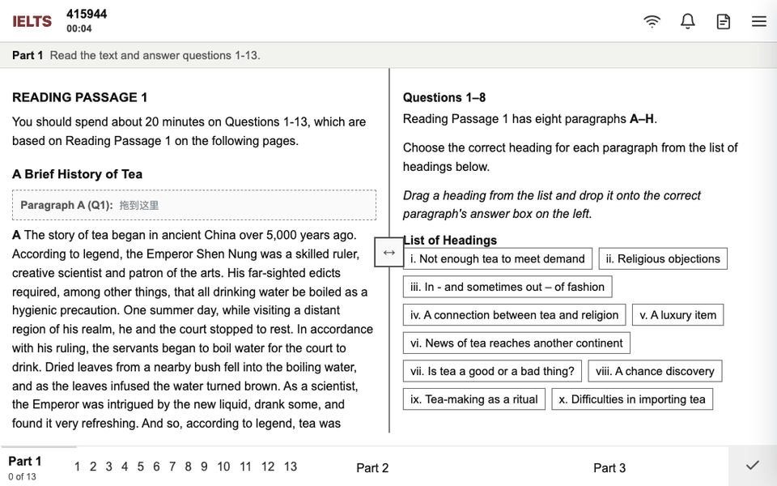

# IELTS Atlas / IELTS Practice

[English](README.md) | **简体中文**

[](https://deepwiki.com/sallowayma-git/IELTS-practice)

## 重要使用声明

本项目允许个人基于学习、研究和自用目的进行本地运行、私人部署或在个人控制的网页环境中使用。使用者可以将项目部署到自己的电脑、私人服务器、NAS 或个人网页空间，但应确保访问范围和传播范围可控。

请勿将包含题源、音频、PDF、解析、二次修改页面或打包产物的网站、镜像站、压缩包继续公开分发给更多人；请勿将本项目用于商业售卖、付费社群、引流推广、公开宣传或其他盈利行为。项目涉及的题源和部分素材存在第三方版权风险，机考网页形式的公开部署也可能触及相关从业者利益。大规模传播会显著增加被投诉、举报、删除仓库或关闭页面的风险，最终影响所有使用者。

为保证项目能够长期稳定存在，请遵循以下原则：**自行部署，个人使用，控制传播范围，不以项目或其题源牟利。**

代码授权以 [LICENSE](LICENSE) 为准。题源、文章、音频、PDF、图片和其他第三方内容版权归原权利人所有，仅建议用于个人学习与备考场景。

## 分支概览

本项目目前维护三个主要分支，分别面向不同使用场景和技术需求：

| 分支 | 说明 | 状态 | 完成度 | 技术特征 |
|------|------|------|--------|----------|
| [main](https://github.com/sallowayma-git/IELTS-practice/tree/main) | 静态网页版（当前分支），纯前端运行，兼容几乎所有设备 |  |  |  |
| [feature/multi-device-easy-deploy](https://github.com/sallowayma-git/IELTS-practice/tree/feature/multi-device-easy-deploy) | 自主部署服务器版，支持多设备数据同步，适合有一定软件基础的用户 |  |  |  |
| [IELTS-WRITING-FEAT](https://github.com/sallowayma-git/IELTS-practice/tree/IELTS-WRITING-FEAT) | AI native 协作客户端，融入写作评分、阅读教练、自进化等 AI 功能 |  |  |  |

| 关联仓库 | 说明 | 状态 | 技术特征 |
|:--------:|------|------|----------|
| [IELTS-&#8288;Project (IELTMPS)](https://github.com/k-undurkhaan-2/IELTS-Project) | 为独立web服务器开发的集成式解决方案，覆盖完整的后台、路由、数据库与安全基础设施 |  |  |

## 项目概述

IELTS Atlas 是一个面向雅思阅读练习，并支持可选本地听力扩展的纯前端练习系统。当前主入口为 `index.html`，应用运行依赖静态 HTML、CSS、JavaScript bundle 和本地题库资源，不需要后端服务。

系统提供题库浏览、阅读练习、可选听力练习、套题练习、练习记录、成绩统计、错题分析、数据备份、题库导入、词汇辅助、阅读背题和成就系统等功能。数据默认保存在浏览器本地存储中，支持在 `file://` 协议下直接运行，也支持部署到静态网页空间。

## 快速开始

**环境要求**：Chrome 或 Edge 最新稳定版；首次练习时允许弹窗（练习页在新窗口打开）。

**本地运行**：

1. 下载并解压完整项目，保持目录结构完整（不要只复制 `index.html`）。
2. 用浏览器打开 `index.html`。
3. 进入**题库浏览**，确认题库列表正常显示。
4. 点击练习时如被浏览器拦截弹窗，请允许后重试。

入口只有 `index.html`，旧文档中出现的其他入口页面均已失效。如果浏览器对 `file://` 限制较多，可在项目根目录启动静态服务器：

```bash
python -m http.server 8000   # 然后访问 http://localhost:8000/
```

**静态部署**：可将运行时文件部署到静态网页空间用于个人或小范围自用。部署必须保留完整目录层级，避免 bundle、题库、字体、图片、PDF、音频等资源 404。公开部署前请重新阅读顶部使用声明——可部署不等于可公开传播。

## 功能说明


### 学习总览

总览页根据本地练习记录汇总已练习题目、平均表现、学习时长、连续学习和分类进度，适合作为每日入口，决定继续刷题、复盘错题还是切换词汇辅助。

### 题库浏览

题库是系统核心入口，默认支持阅读资源，听力作为可选本地扩展接入。

- 按类型（全部/阅读/听力）和分类（P1、P2、P3）筛选；按标题、文件名或元数据搜索；支持排序、练习状态和进度回显。
- 在"设置 → 加载题库"中从文件夹导入自定义题库；支持题库配置切换和强制刷新索引。

默认阅读索引来自 `assets/generated/` 下的生成资产，不应手写维护；听力索引在导入自备资源时由浏览器侧扫描生成。

### 阅读练习

阅读练习使用统一阅读页运行，核心资产位于 `assets/generated/reading-exams/` 与 `assets/generated/reading-explanations/`：

- 从题库卡片打开练习，在统一页中答题、提交并查看结果。
- 内置解析、定位高亮和答案对比；完成后自动写入练习记录。
- 同一页面支持**阅读背题**模式，直接查看答案与解析。



若练习页能打开但成绩未保存，请检查弹窗权限、控制台错误和跨窗口通信（见常见问题）。

### 听力练习

听力通过听力索引和记录桥接模块接入。出于版权合规，公开仓库和普通发布包默认不包含听力音频、题源、PDF、完整 `ListeningPractice/` 目录或预生成听力索引。

本地启用听力时，自备资源并放置生成索引：

```text
assets/generated/listening-exams/manifest.js
assets/generated/listening-exams/listening-index.compat.js
```

支持导入自备听力资源、P1–P4 目录结构，并通过 `listening-record-bridge` 与阅读共用同一套记录和统计流程。公开包中缺少上述文件属于预期行为。需要将自备 `ListeningPractice/P1–P4` 打入个人自用包时，使用 `INCLUDE_LOCAL_LISTENING=1` 打包（见构建与发布）。

### 套题模式

套题模式将多个练习单元串成一个会话并聚合结果，适合模拟完整练习流程：

- 创建套题会话，按顺序打开题目并跟踪当前窗口和题目。
- 聚合各子题得分、耗时为一条套题记录；异常中断时尽量保留已完成部分。
- 自动清理套题子记录，避免历史列表重复。

该模式依赖更严格的窗口管理；弹窗被拦截或手动关闭窗口时，系统进入降级保存路径。

### 练习记录与统计

记录页用于查看、筛选、导出和管理历史记录，来源包括阅读、听力、套题和降级保存：

- 统计卡片（已练习、平均正确率、学习时长）、趋势分析、练习热力图、中高频进度和阅读错题雷达。
- 历史列表按全部/阅读/听力筛选，支持批量删除、Markdown 导出和单条详情查看。


练习记录是核心用户数据。清理缓存、切换浏览器、隐私模式或浏览器自动清理都可能影响持久性，建议定期在设置页导出或备份。

### 设置与数据管理

设置页集中系统维护、题库管理和数据管理：

- **系统**：清除全部本地数据（恢复首次启动，外部 JSON 备份保留）、加载题库、主题切换、题库配置切换、强制刷新题库。
- **数据**：创建备份并从备份列表恢复；导出/导入 JSON 数据用于迁移和长期保存；导入时进行基础完整性校验。

核心数据持久化在 IndexedDB；不可用时应用会明确报错，不会将练习记录静默降级。localStorage 仅用于旧数据迁移，sessionStorage 用于会话草稿。数据按浏览器、协议和域名隔离。

### 更多工具与主题

- **词汇练习**：内置词表与记忆调度。
- **阅读背题**：复用统一阅读页查看答案、解析和定位高亮。
- **成就系统**：根据练习和行为解锁徽章。
- 主界面为 HeroUI 风格，含动态背景和题库、记录、设置、工具等面板。主题仅影响视觉呈现，不改变记录、索引或存储格式；主题逻辑位于 `js/plugins/themes/` 和 `js/presentation/`。

## 使用指南

以下 GIF 均为项目实际运行画面。

### 开始单篇练习

1. 打开 `index.html`，进入**题库浏览**。
2. 用筛选或搜索定位题目，点击练习入口。
3. 在新窗口中完成并提交，结果出现在**练习记录**。

窗口未打开请允许弹窗；成绩未保存请查看控制台的资源或通信错误（见常见问题）。

### 使用套题模式

1. 在题库中选择套题练习，按顺序完成各题。
2. 会话自动聚合子题结果为一条套题记录，可在练习记录中查看。

避免多窗口并行操作同一套题，否则窗口跟踪和记录归并容易出问题。

### 查看与导出记录

1. 进入**练习记录**，按全部/阅读/听力筛选，点击单条查看详情。
2. 导出 Markdown 报告，或批量选择删除。删除前建议先导出或备份——能否恢复取决于可用备份。

### 导入自定义题库

1. 进入**系统设置 → 加载题库**，选择阅读或听力目录，按提示执行全量或增量导入。
2. 返回题库浏览检查列表；有多个配置时通过**题库配置切换**选择。

自定义题库目录应保持稳定，频繁移动文件或重命名目录会导致记录与题目索引无法匹配。

### 备份、恢复与迁移

1. **设置 → 创建备份**保存本地快照；**导出数据**生成可迁移文件；**导入数据**在新环境恢复。
2. 导入后检查练习记录、统计卡片和题库状态。

本地存储与浏览器、协议和域名绑定——`file://` 与 `http://localhost:8000/` 下的数据不一定共享。

## 项目结构

运行时文件：

```text
index.html
css/
js/bundles/
assets/
ReadingPractice/
```

主要源码目录：

```text
js/app/            应用入口、状态桥、题库浏览、练习会话和套题逻辑
js/core/           练习、记录、存储、词汇等核心能力
js/data/           repository 与数据源封装
js/runtime/        懒加载、启动屏、统一阅读页运行时
js/services/       题库发现与管理、统计、成就等服务
js/components/     设置、诊断、记录弹窗、题库状态等 UI 组件
js/presentation/   导航、主题、更多工具、首页交互
js/utils/          存储、答案匹配、导入导出、DOM 工具
js/plugins/        主题和扩展桥接
assets/generated/  生成后的阅读题库页面与解析；可选听力扩展索引
developer/         文档、测试与构建发布脚本
```

发布包只应包含运行所需文件，不应包含源码目录、开发文档、测试工具和 `node_modules/`。

## 构建与发布

`index.html` 加载预构建的 `js/bundles/*.bundle.js`。修改源码后必须重新构建，不要手动编辑 bundle：

```bash
node scripts/build-bundles.mjs
```

生成发布包（脚本会先重建 bundle，再打包运行时文件，解压后直接打开 `index.html` 使用）：

```bash
# Linux / Git Bash
bash developer/release.sh 0.6.2-fix
# Windows PowerShell
powershell -ExecutionPolicy Bypass -File developer/release.ps1 0.6.2-fix
```

输出位置：`dist/ielts-practice-{version}.zip`。

普通发布包默认排除本地 `ListeningPractice/` 目录和听力资产。需要打包自备听力资源时，先确认 `assets/generated/listening-exams/manifest.js` 与 `listening-index.compat.js` 存在，然后：

```bash
INCLUDE_LOCAL_LISTENING=1 bash developer/release.sh 0.6.2-fix
# PowerShell：先设置 $env:INCLUDE_LOCAL_LISTENING = "1" 再运行 release.ps1
```

脚本会按规则包含本地存在的 `ListeningPractice/P1` 至 `P4` 目录。

## 测试要求

功能或优化改动后，按顺序运行：

```bash
python developer/tests/ci/run_static_suite.py    # 生成 developer/tests/e2e/reports/static-ci-report.json
python developer/tests/e2e/full_reset_flow.py
python developer/tests/e2e/suite_practice_flow.py
```

修改运行时代码、题库索引、资源路径、练习记录、套题流程或发布脚本后必须运行上述测试。纯文档改动可不运行浏览器流程，但应检查引用的路径和命令真实存在。新增 QA、测试或验证脚本应放在 `developer/tests/` 下。

## 技术说明

- **启动流程**：`index.html` 加载核心 bundle（`runtime-entry`、`core-foundation`、`ui-shell`、`legacy-app`），初始化存储命名空间与应用实例，加载题库索引和记录，然后按需懒加载题库浏览、练习记录、套题、设置、更多工具等功能 bundle。
- **数据存储**：IndexedDB 保存全部核心持久化数据（记录、词汇、设置、题库配置、备份），提供事务与修订冲突检测；localStorage 仅做旧数据迁移；sessionStorage 存会话草稿。数据按浏览器、协议和域名隔离，迁移请使用导出/导入，不要直接复制浏览器内部存储。
- **练习通信**：练习窗口与主窗口通过 `postMessage` 通信。主窗口打开练习页并创建会话，练习页加载增强或桥接脚本，用户提交后主窗口标准化成绩并保存记录。相关 bundle：`practice-page-enhancer`、`listening-record-bridge`、`session`、`practice`。
- **题库资产**：阅读生成资产位于 `assets/generated/reading-exams/` 和 `assets/generated/reading-explanations/`，可选听力扩展位于 `assets/generated/listening-exams/`。公开仓库可能不包含听力资产；运行时题库数量以 manifest 和当前题库配置为准，文档不写固定题量。

## 常见问题

### 页面打开后样式异常或功能缺失

通常是目录不完整或资源路径错误。确认 `css/`、`js/bundles/`、`assets/`、`ReadingPractice/` 存在且相对路径不变，发布包解压完整。不要把 `index.html` 单独复制到其他目录运行。

### 点击练习后没有打开窗口

练习页需要新窗口或新标签。允许当前页面弹窗后重试，并打开开发者工具查看 Console 错误和练习资源 404。

### 练习完成后没有保存记录

常见原因：跨窗口通信被阻止、练习页资源加载失败、隐私模式限制存储、IndexedDB 被禁用或配额耗尽、协议或域名不同导致查看的是另一份数据。查看 Console 中 `postMessage`、storage 或加载错误；在设置页导出数据确认现状；换最新 Chrome 或 Edge 复测；或改用本地静态服务器。

### 题库列表为空

检查 `assets/generated/reading-exams/manifest.js` 与 `reading-practice-unified.html` 是否存在、`js/bundles/core-foundation.bundle.js` 是否正常加载、`assets/` 是否被误删或移动。自定义题库请在"系统设置 → 加载题库"重新导入。

### 听力题库不可见

公开仓库和普通发布包默认不含听力资源，属预期行为。本地启用需自备资源并放置 `assets/generated/listening-exams/` 下的两个索引文件（见听力练习）；需要随包分发 `ListeningPractice/P1–P4` 时使用 `INCLUDE_LOCAL_LISTENING=1` 打包。

### 数据丢失或统计清零

清理缓存、隐私模式或协议/域名变化都会导致本地数据不可见。使用与之前相同的浏览器、路径、协议和域名；在设置页查看备份列表并用导入功能恢复；长期保存请定期导出。

### `file://` 与本地服务器表现不一致

这是浏览器安全策略的正常差异。项目尽量兼容 `file://`，但部分浏览器会限制音频、PDF、新窗口、跨页面脚本或本地文件访问。先在 Chrome 或 Edge 下验证，再用本地静态服务器定位问题。

## 许可证与内容版权

代码许可证见 [LICENSE](LICENSE)。使用、修改和再分发代码时，应遵守许可证条款。

题源、文章、音频、PDF、图片和解析材料可能来自第三方或原始考试资料，版权归原权利人所有。本项目不授予这些内容的商业使用权或公开传播权。使用者应自行承担因复制、部署、传播或商业化使用相关内容产生的法律和平台风险。

## Star History

<a href="https://www.star-history.com/?repos=sallowayma-git%2Fielts-practice&type=date&logscale=&legend=top-left">
 <picture>
   <source media="(prefers-color-scheme: dark)" srcset="https://api.star-history.com/chart?repos=sallowayma-git/ielts-practice&type=date&theme=dark&legend=top-left" />
   <source media="(prefers-color-scheme: light)" srcset="https://api.star-history.com/chart?repos=sallowayma-git/ielts-practice&type=date&legend=top-left" />
   
 </picture>
</a>
