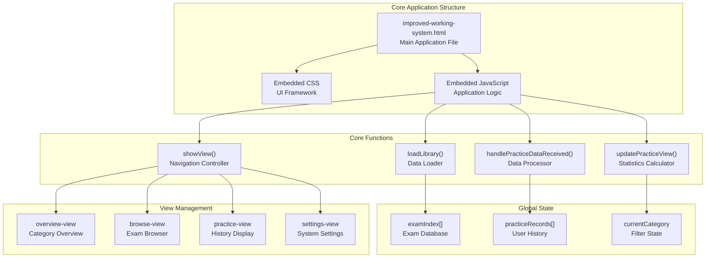
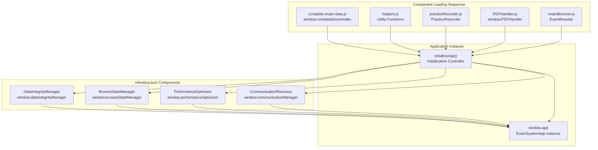
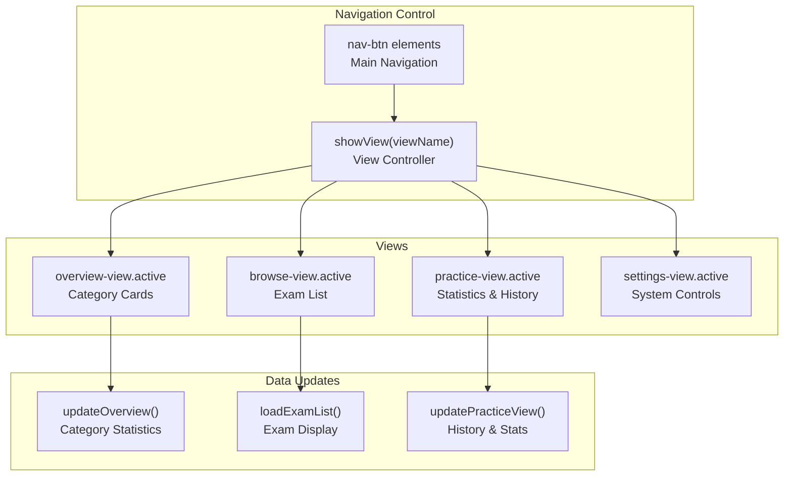
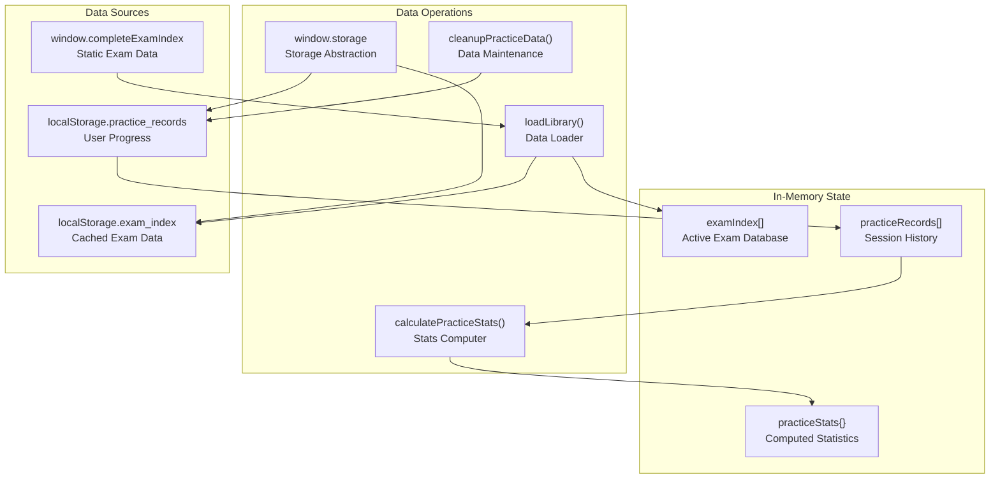
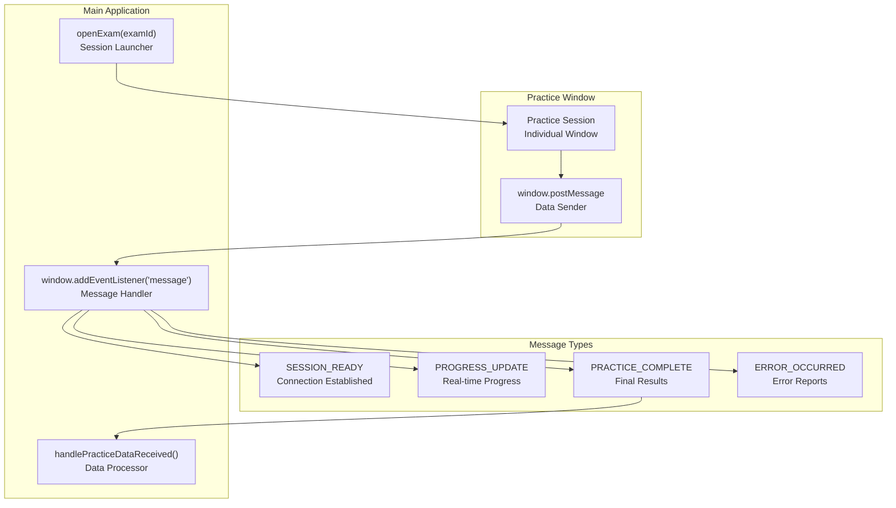
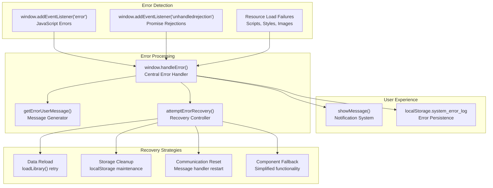

# Core Application

> **Relevant source files**
> * [improved-working-system.html](https://github.com/sallowayma-git/IELTS-practice/blob/db0f538c/improved-working-system.html)

The Core Application (`improved-working-system.html`) serves as the central coordinator and entry point for the entire IELTS Reading Practice System. This single-file web application orchestrates exam browsing, practice session management, data persistence, and system integration. It acts as the primary interface users interact with and coordinates communication between all system components.

For information about the individual system components that the Core Application coordinates, see [Infrastructure Components](/sallowayma-git/IELTS-practice/5-infrastructure-components). For details about the practice session system it manages, see [Practice Session System](/sallowayma-git/IELTS-practice/6-practice-session-system). For the exam data it loads and displays, see [Exam Data System](/sallowayma-git/IELTS-practice/3-exam-data-system).

## Application Architecture Overview

The Core Application follows a single-file architecture pattern, embedding all presentation, business logic, and coordination functionality within a single HTML document. This design provides simplified deployment while maintaining clear separation of concerns through modular JavaScript organization.



**Sources:** [improved-working-system.html L1-L3244](https://github.com/sallowayma-git/IELTS-practice/blob/db0f538c/improved-working-system.html#L1-L3244)

## Global App Entry and Modular Structure

The core application has been refactored to use a global App entry point defined in `js/app.js`. This centralizes initialization and provides a unified interface for the entire system.

### App Global Entry
- **Entry Point**: `window.App` (from `js/app.js`) serves as the singleton instance coordinating all subsystems.
- **Initialization**: Called via `App.init()` during application startup, which loads stores, UI components, and sets up event routing.
- **Key Responsibilities**:
  - Orchestrates data loading from `ExamStore` and `RecordStore`.
  - Manages UI rendering through `BaseComponent` hierarchy in `js/ui/`.
  - Routes events via `App.events` using an EventEmitter pattern for decoupled communication.

### Stores/UI Separation
The architecture now enforces clear separation of concerns:
- **Stores (js/stores/)**: Handle data management and state (e.g., `ExamStore` for exam data, `RecordStore` for practice history, `AppStore` for application-wide state). Stores provide reactive updates via subscriptions.
- **UI (js/ui/)**: Focuses on rendering and user interaction (e.g., `ExamBrowser`, `RecordViewer`). UI components are stateless and receive data from stores.
- **Utils (js/utils/)**: Shared helper functions (e.g., `helpers.js` for utilities like data validation and DOM manipulation).

This separation ensures data flows unidirectionally: Stores → UI, with events triggering updates via `App.events`.

### Event Routing
- **Event System**: `App.events` is an instance of EventEmitter, allowing components to emit and subscribe to events without direct coupling.
- **Routing Mechanism**: Events like `examLoaded`, `recordUpdated`, or `uiStateChanged` are emitted from stores/UI and routed globally.
- **Example Usage**:
  ```javascript
  // Emitting an event
  App.events.emit('examLoaded', { examId: '123' });

  // Subscribing to an event
  App.events.on('examLoaded', (data) => {
    // Update UI accordingly
  });
  ```
- **Benefits**: Decouples stores from UI, enables linear event flows, and supports file:// compatibility by avoiding dynamic dependencies.

**Sources:** [js/app.js](https://github.com/sallowayma-git/IELTS-practice/blob/main/js/app.js), [js/stores/AppStore.js](https://github.com/sallowayma-git/IELTS-practice/blob/main/js/stores/AppStore.js)

## Component Integration System

The Core Application dynamically loads and initializes multiple specialized components through a layered initialization process. Component availability is detected at runtime, with graceful degradation when components are unavailable.



The initialization process in `initializeApp()` attempts to create instances of each component class, with error handling for missing components:

| Component | Global Variable | Fallback Behavior |
| --- | --- | --- |
| `ExamSystemApp` | `window.app` | Simple mode with basic functionality |
| `DataIntegrityManager` | `window.dataIntegrityManager` | Manual data operations only |
| `PerformanceOptimizer` | `window.performanceOptimizer` | No caching or optimization |
| `CommunicationRecovery` | `window.communicationManager` | Basic message handling |
| `BrowseStateManager` | `window.browseStateManager` | No state persistence |

**Sources:** [improved-working-system.html L686-L709](https://github.com/sallowayma-git/IELTS-practice/blob/db0f538c/improved-working-system.html#L686-L709)
 [improved-working-system.html L870-L923](https://github.com/sallowayma-git/IELTS-practice/blob/db0f538c/improved-working-system.html#L870-L923)

## View Management System

The application implements a single-page application (SPA) pattern with four main views controlled by the `showView()` function. View state is managed through CSS class toggling and coordinated data updates.



Each view has specific initialization requirements:

* **Overview View**: Calculates category statistics from `examIndex` and displays practice recommendations
* **Browse View**: Loads filtered exam lists with search capability and pagination
* **Practice View**: Computes statistics from `practiceRecords` and displays history
* **Settings View**: Provides system management controls and diagnostic information

**Sources:** [improved-working-system.html L1117-L1156](https://github.com/sallowayma-git/IELTS-practice/blob/db0f538c/improved-working-system.html#L1117-L1156)
 [improved-working-system.html L2756-L2819](https://github.com/sallowayma-git/IELTS-practice/blob/db0f538c/improved-working-system.html#L2756-L2819)

## Data Coordination Layer

The Core Application manages three primary data stores and coordinates synchronization between localStorage and in-memory representations. All data operations include error handling and fallback mechanisms.



The `window.storage` object provides error-resilient localStorage operations with automatic cleanup:

| Operation | Function | Error Handling |
| --- | --- | --- |
| Data Read | `storage.get(key, defaultValue)` | Returns default on parse errors |
| Data Write | `storage.set(key, value)` | Quota cleanup and retry |
| Data Cleanup | `storage.cleanup()` | Removes records older than 30 days |

**Sources:** [improved-working-system.html L961-L1017](https://github.com/sallowayma-git/IELTS-practice/blob/db0f538c/improved-working-system.html#L961-L1017)
 [improved-working-system.html L1158-L1316](https://github.com/sallowayma-git/IELTS-practice/blob/db0f538c/improved-working-system.html#L1158-L1316)
 [improved-working-system.html L2306-L2389](https://github.com/sallowayma-git/IELTS-practice/blob/db0f538c/improved-working-system.html#L2306-L2389)

## Cross-Window Communication Protocol

The Core Application implements a sophisticated message-passing system for communicating with practice session windows. This system handles practice data collection, session monitoring, and error recovery.



The message handling system processes different event types and updates application state accordingly:

```python
// Message structure from practice pages
{
    source: 'practice_page',
    type: 'PRACTICE_COMPLETE',
    data: {
        sessionId: 'unique_session_id',
        examId: 'exam_identifier',
        answers: {},
        scoreInfo: {},
        duration: 1234567,
        // ... additional data
    }
}
```

**Sources:** [improved-working-system.html L2837-L2868](https://github.com/sallowayma-git/IELTS-practice/blob/db0f538c/improved-working-system.html#L2837-L2868)
 [improved-working-system.html L2928-L3169](https://github.com/sallowayma-git/IELTS-practice/blob/db0f538c/improved-working-system.html#L2928-L3169)

## Error Handling and Recovery Framework

The Core Application implements a comprehensive error handling system with automatic recovery strategies, user-friendly messaging, and detailed logging for debugging purposes.



The error handling system categorizes errors and provides context-specific recovery strategies:

| Error Context | Recovery Strategy | User Message |
| --- | --- | --- |
| 题库加载 (Library Load) | `loadLibrary()` retry | "题库数据加载失败，正在尝试重新加载" |
| 数据存储 (Data Storage) | Storage cleanup + retry | "存储空间不足，请清理浏览器数据" |
| 跨窗口通信 (Cross-window) | Communication reinit | "页面通信失败，正在重新建立连接" |
| 文件加载 (File Load) | Backup path attempts | "文件加载失败，正在尝试备用方案" |

**Sources:** [improved-working-system.html L712-L846](https://github.com/sallowayma-git/IELTS-practice/blob/db0f538c/improved-working-system.html#L712-L846)
 [improved-working-system.html L848-L958](https://github.com/sallowayma-git/IELTS-practice/blob/db0f538c/improved-working-system.html#L848-L958)

## file:// Constraints

Due to the limitations of the file:// protocol in web browsers, the application must adhere to specific constraints to ensure compatibility when running locally without a server.

### Script Loading Order
- Scripts must be loaded synchronously using `<script>` tags in a strict sequence to resolve dependencies.
- Order: utils/ → stores/ → ui/ → app.js → main initialization.
- Dynamic script loading (e.g., via `document.createElement('script')`) is avoided to prevent timing issues under file://.

### Global Variables
- All shared state and APIs are exposed via `window` globals (e.g., `window.App`, `window.stores`, `window.events`).
- No ES6 modules or import/export; everything is in the global scope to avoid module loader restrictions.

### No Dynamic Imports
- Static script inclusion only; dynamic imports like `import()` are not used as they may fail under file:// due to CORS-like restrictions.
- Fallback to conditional loading via error handlers if a script is missing.

### Storage and Communication Compatibility
- **localStorage**: Fully compatible; used for persistent data like exam indices and practice records. Includes quota management and error recovery.
- **postMessage**: Supported for cross-window communication between practice sessions and the main app. Messages are structured with `source`, `type`, and `data` fields.
- **Limitations**: No access to server-side APIs; all operations are client-side. File I/O is restricted, so exports use download blobs.

These constraints ensure the application runs seamlessly in local environments while maintaining full functionality.

**Sources:** [js/app.js](https://github.com/sallowayma-git/IELTS-practice/blob/main/js/app.js), Browser file:// protocol documentation