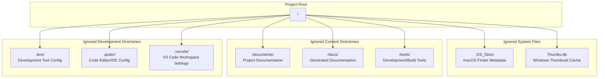
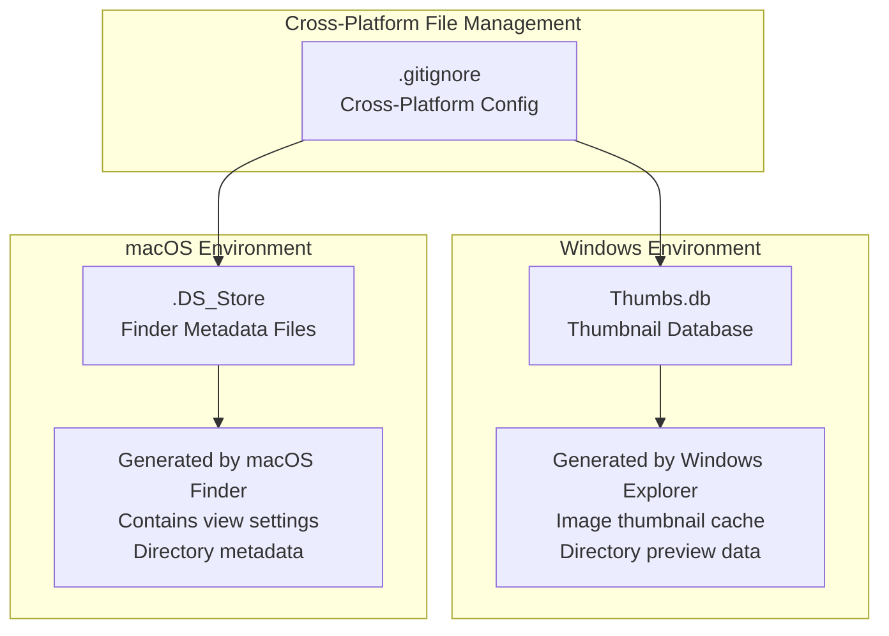
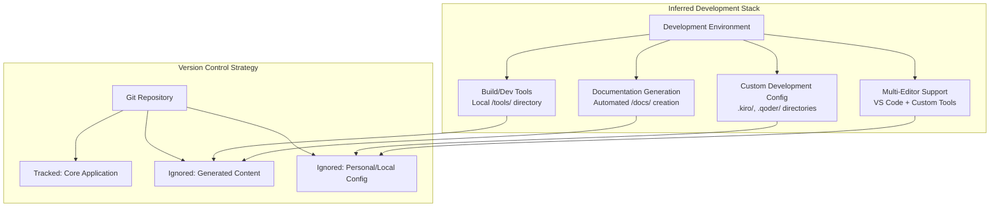
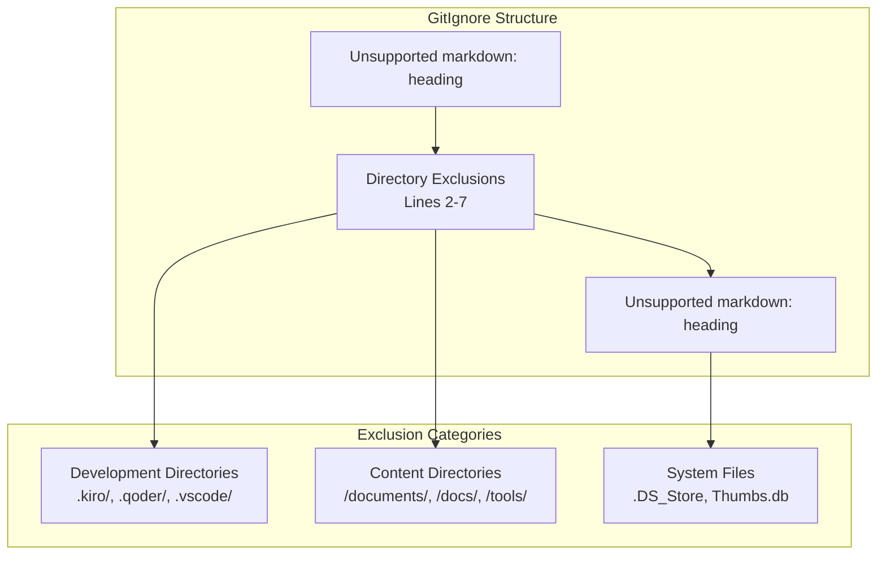

# Development Configuration

> **Relevant source files**
> * [.gitignore](https://github.com/sallowayma-git/IELTS-practice/blob/db0f538c/.gitignore)

## Purpose and Scope

This document covers the development environment setup, version control configuration, and project structure patterns for the IELTS Reading Practice System. It focuses on the configuration files that control what is tracked in version control and what the ignored directories reveal about the development toolchain and workflow.

For information about the core application architecture, see [Core Application](/sallowayma-git/IELTS-practice/2-core-application). For details about the practice session system components, see [Practice Session System](/sallowayma-git/IELTS-practice/6-practice-session-system).

## Version Control Configuration

The repository uses Git for version control with specific exclusions defined in the `.gitignore` file to maintain a clean development environment and avoid tracking generated or environment-specific files.

### Ignored Directory Structure

The `.gitignore` configuration reveals the development toolchain and organizational patterns used in this project:



**Git Ignore Configuration Overview**

Sources: [.gitignore L1-L11](https://github.com/sallowayma-git/IELTS-practice/blob/db0f538c/.gitignore#L1-L11)

### Development Tool Environment

The ignored directories indicate a multi-tool development environment:

| Directory | Purpose | Development Implication |
| --- | --- | --- |
| `.kiro/` | Development tool configuration | Custom or proprietary development tooling |
| `.qoder/` | Code editor/IDE configuration | Specialized coding environment setup |
| `.vscode/` | Visual Studio Code settings | VS Code workspace and extension configs |
| `/tools/` | Development and build tools | Local toolchain and automation scripts |

Sources: [.gitignore L2-L4](https://github.com/sallowayma-git/IELTS-practice/blob/db0f538c/.gitignore#L2-L4)

 [.gitignore L7](https://github.com/sallowayma-git/IELTS-practice/blob/db0f538c/.gitignore#L7-L7)

### Documentation and Content Management

The project separates different types of documentation and generated content:

```

```

**Documentation Exclusion Strategy**

Sources: [.gitignore L5-L6](https://github.com/sallowayma-git/IELTS-practice/blob/db0f538c/.gitignore#L5-L6)

## Cross-Platform Development Support

The `.gitignore` configuration includes platform-specific system files, indicating cross-platform development considerations:

### System File Exclusions

The repository is configured to handle development across multiple operating systems:



**Platform-Specific Exclusions**

| File Pattern | Operating System | Purpose |
| --- | --- | --- |
| `.DS_Store` | macOS | Finder view settings and metadata |
| `Thumbs.db` | Windows | Explorer thumbnail cache database |

Sources: [.gitignore L10-L11](https://github.com/sallowayma-git/IELTS-practice/blob/db0f538c/.gitignore#L10-L11)

## Development Environment Implications

Based on the `.gitignore` configuration, the development setup suggests:

### Tool Chain Architecture



**Development Workflow Structure**

Sources: [.gitignore L1-L11](https://github.com/sallowayma-git/IELTS-practice/blob/db0f538c/.gitignore#L1-L11)

## Configuration File Analysis

The `.gitignore` file structure and organization patterns:

### File Organization Pattern



**Configuration Organization**

The file uses Chinese comments (`# 忽略特定的文件夹`, `# 忽略可能的系统文件`) indicating potential international development team or Chinese language development environment.

Sources: [.gitignore L1](https://github.com/sallowayma-git/IELTS-practice/blob/db0f538c/.gitignore#L1-L1)

 [.gitignore L9](https://github.com/sallowayma-git/IELTS-practice/blob/db0f538c/.gitignore#L9-L9)

## Development Setup Recommendations

Based on the configuration analysis, the development environment should include:

| Component | Configuration | Purpose |
| --- | --- | --- |
| IDE Support | VS Code + Custom tools | Multi-editor development workflow |
| Documentation | Auto-generation to `/docs/` | Automated documentation pipeline |
| Build Tools | Local `/tools/` directory | Development automation and build scripts |
| Cross-Platform | File exclusion patterns | Support for macOS and Windows development |

This configuration supports a flexible development environment with multiple toolchains while maintaining a clean version control history by excluding generated content and personal configuration files.

Sources: [.gitignore L1-L11](https://github.com/sallowayma-git/IELTS-practice/blob/db0f538c/.gitignore#L1-L11)