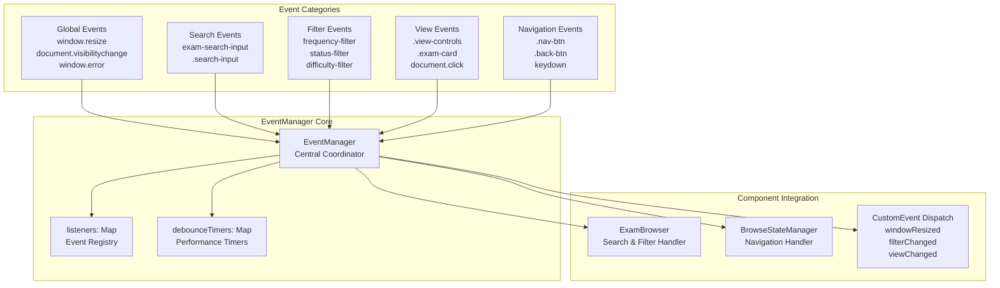
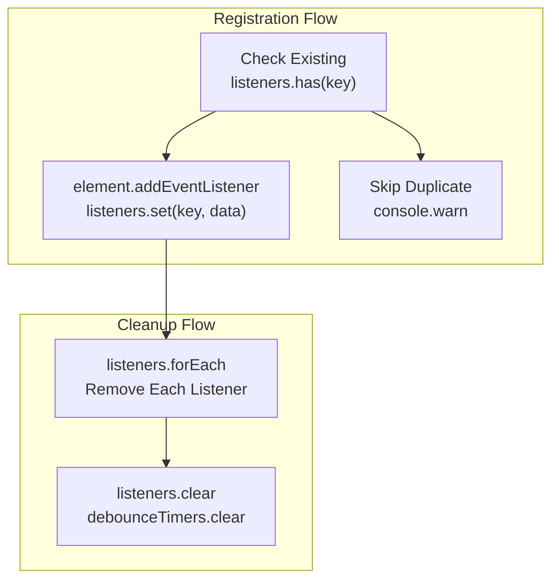
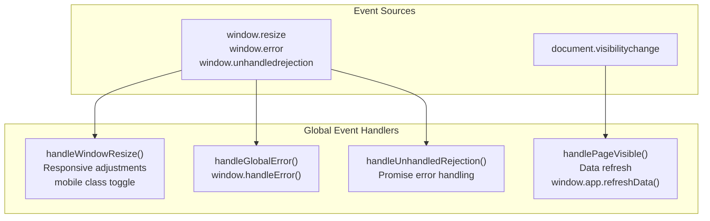
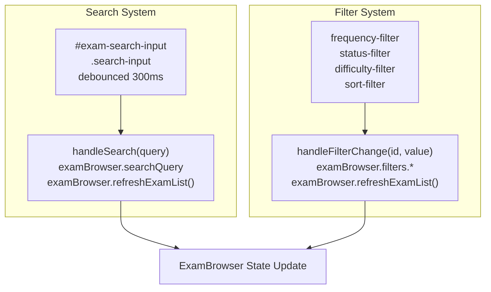
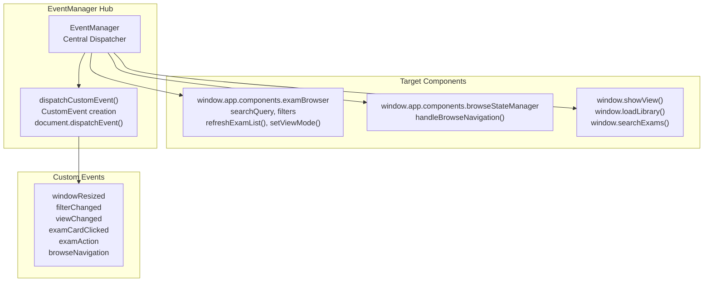
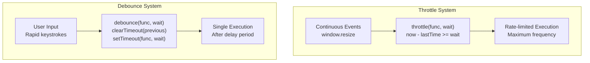
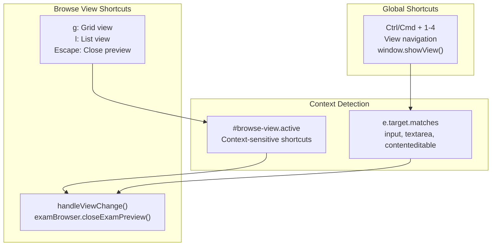
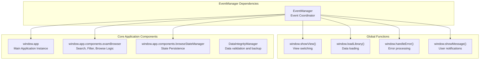

# Event Management System

> **Relevant source files**
> * [index.html](https://github.com/sallowayma-git/IELTS-practice/blob/db0f538c/index.html)
> * [js/components/BrowseStateManager.js](https://github.com/sallowayma-git/IELTS-practice/blob/db0f538c/js/components/BrowseStateManager.js)
> * [js/components/EventManager.js](https://github.com/sallowayma-git/IELTS-practice/blob/db0f538c/js/components/EventManager.js)
> * [js/components/ExamBrowserRecovery.js](https://github.com/sallowayma-git/IELTS-practice/blob/db0f538c/js/components/ExamBrowserRecovery.js)

The Event Management System provides centralized event handling for the IELTS practice application, preventing memory leaks and ensuring consistent event coordination across all components. This system manages DOM event listeners, custom event dispatching, and inter-component communication through a unified interface.

For error handling and recovery mechanisms, see [Error Recovery & Resilience](/sallowayma-git/IELTS-practice/5.2-error-recovery-and-resilience). For navigation state persistence, see [Browse State Management](/sallowayma-git/IELTS-practice/5.3-browse-state-management).

## Purpose and Architecture

The `EventManager` class serves as the central coordinator for all event-driven interactions in the application. It maintains a registry of event listeners, prevents duplicate bindings, and provides utility functions for performance optimization.

### Core Event Management Architecture

Sources: [js/components/EventManager.js L1-L40](https://github.com/sallowayma-git/IELTS-practice/blob/db0f538c/js/components/EventManager.js#L1-L40)

## Event Registration and Lifecycle Management

The system maintains strict control over event listener registration and cleanup to prevent memory leaks and duplicate handlers.

### Event Registration Process

| Method | Purpose | Parameters |
| --- | --- | --- |
| `addEventListener()` | Register new event listener | `element, event, handler, options` |
| `removeEventListener()` | Remove specific event listener | `element, event` |
| `cleanup()` | Remove all registered listeners | None |
| `generateListenerKey()` | Create unique identifier for listeners | `element, event` |

Sources: [js/components/EventManager.js L61-L112](https://github.com/sallowayma-git/IELTS-practice/blob/db0f538c/js/components/EventManager.js#L61-L112)

## Event Handler Categories

The EventManager organizes event handling into distinct categories, each targeting specific application functionality.

### Global System Events

The system monitors critical browser and application events:

Sources: [js/components/EventManager.js L117-L139](https://github.com/sallowayma-git/IELTS-practice/blob/db0f538c/js/components/EventManager.js#L117-L139)

 [js/components/EventManager.js L275-L317](https://github.com/sallowayma-git/IELTS-practice/blob/db0f538c/js/components/EventManager.js#L275-L317)

### Search and Filter Integration

The EventManager handles all search and filtering interactions with debounced input processing:

Sources: [js/components/EventManager.js L144-L186](https://github.com/sallowayma-git/IELTS-practice/blob/db0f538c/js/components/EventManager.js#L144-L186)

 [js/components/EventManager.js L319-L361](https://github.com/sallowayma-git/IELTS-practice/blob/db0f538c/js/components/EventManager.js#L319-L361)

## Component Communication Protocol

The EventManager facilitates communication between application components through both direct method calls and custom event dispatching.

### Inter-Component Message Flow

Sources: [js/components/EventManager.js L322-L431](https://github.com/sallowayma-git/IELTS-practice/blob/db0f538c/js/components/EventManager.js#L322-L431)

 [js/components/EventManager.js L480-L490](https://github.com/sallowayma-git/IELTS-practice/blob/db0f538c/js/components/EventManager.js#L480-L490)

## Performance Optimization Utilities

The EventManager includes built-in performance optimization through debouncing and throttling mechanisms.

### Debounce and Throttle Implementation

| Function | Use Case | Default Delay | Implementation |
| --- | --- | --- | --- |
| `debounce()` | Search input, filter changes | 300ms | Cancels previous timeout, creates new |
| `throttle()` | Window resize, scroll events | 250ms | Rate limits execution frequency |

Sources: [js/components/EventManager.js L494-L526](https://github.com/sallowayma-git/IELTS-practice/blob/db0f538c/js/components/EventManager.js#L494-L526)

## Keyboard Shortcuts and Navigation

The system provides comprehensive keyboard shortcut support for efficient navigation and control.

### Keyboard Shortcut Mapping

Sources: [js/components/EventManager.js L433-L475](https://github.com/sallowayma-git/IELTS-practice/blob/db0f538c/js/components/EventManager.js#L433-L475)

## System Integration Points

The EventManager integrates deeply with other system components, serving as the primary event coordination layer.

### Integration with Core Systems

Sources: [js/components/EventManager.js L294-L431](https://github.com/sallowayma-git/IELTS-practice/blob/db0f538c/js/components/EventManager.js#L294-L431)

The EventManager serves as the central nervous system of the IELTS practice application, coordinating all user interactions and system communications while maintaining performance and preventing memory leaks through careful lifecycle management.

Sources: [js/components/EventManager.js L1-L540](https://github.com/sallowayma-git/IELTS-practice/blob/db0f538c/js/components/EventManager.js#L1-L540)