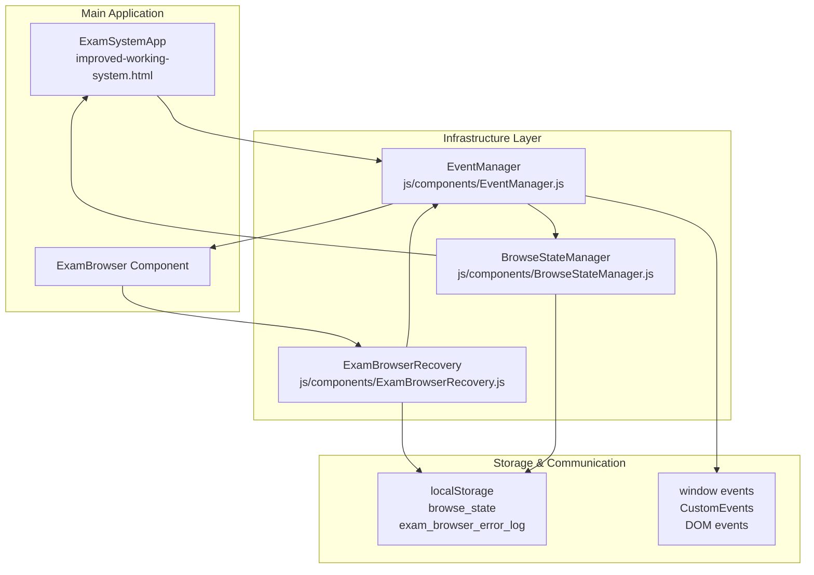
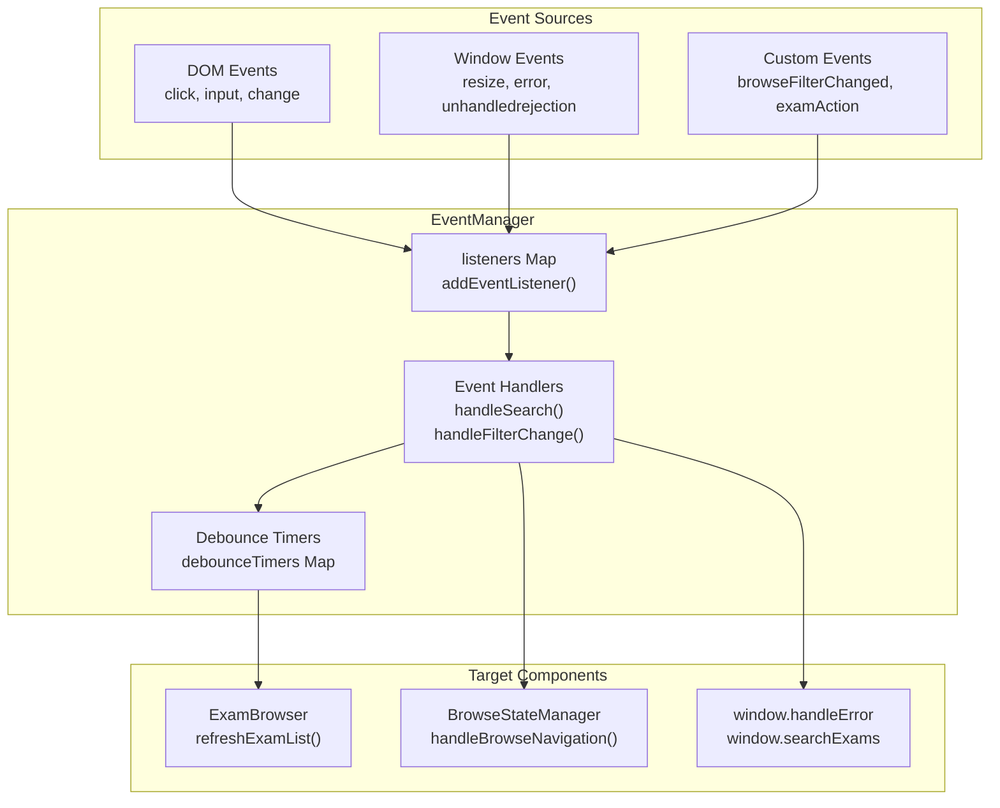
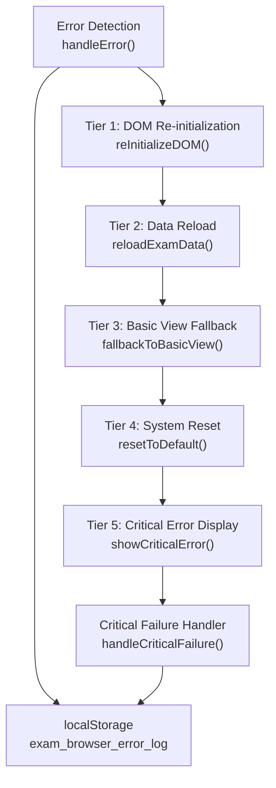
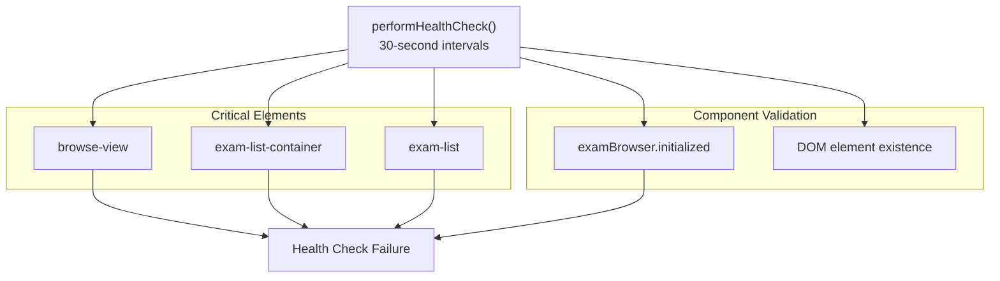
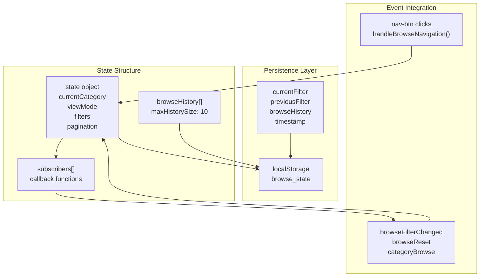
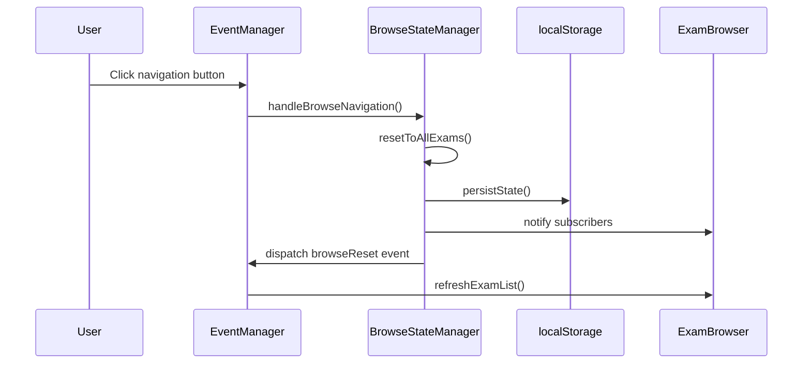
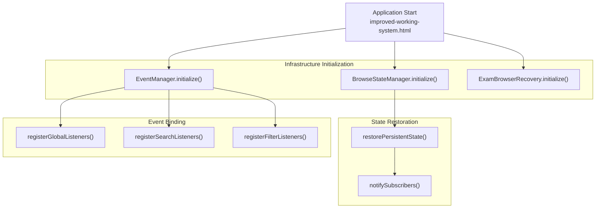
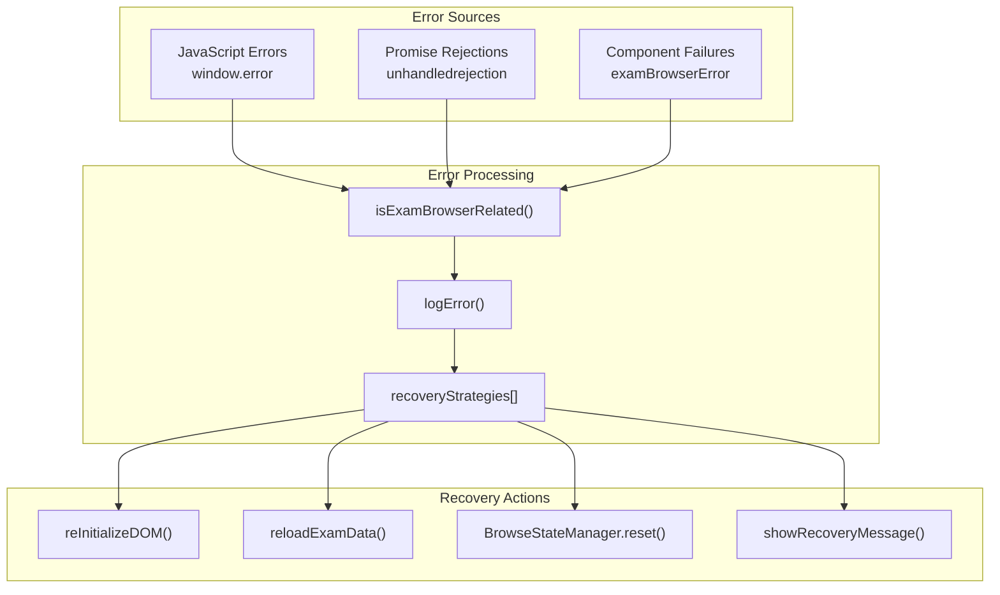

# Infrastructure Components

> **Relevant source files**
> * [index.html](https://github.com/sallowayma-git/IELTS-practice/blob/db0f538c/index.html)
> * [js/components/BrowseStateManager.js](https://github.com/sallowayma-git/IELTS-practice/blob/db0f538c/js/components/BrowseStateManager.js)
> * [js/components/EventManager.js](https://github.com/sallowayma-git/IELTS-practice/blob/db0f538c/js/components/EventManager.js)
> * [js/components/ExamBrowserRecovery.js](https://github.com/sallowayma-git/IELTS-practice/blob/db0f538c/js/components/ExamBrowserRecovery.js)

This document covers the supporting infrastructure systems that provide foundational services to the IELTS practice application. These components handle event coordination, error recovery, state management, and system resilience across the entire codebase.

For information about the main application controller, see [Core Application](/sallowayma-git/IELTS-practice/2-core-application). For details about individual practice session management, see [Practice Session System](/sallowayma-git/IELTS-practice/6-practice-session-system).

## Overview

The infrastructure layer consists of three primary components that work together to provide robust system operation:

| Component | File | Primary Responsibility |
| --- | --- | --- |
| `EventManager` | js/components/EventManager.js | Centralized event handling and coordination |
| `ExamBrowserRecovery` | js/components/ExamBrowserRecovery.js | Error detection, handling, and recovery |
| `BrowseStateManager` | js/components/BrowseStateManager.js | Navigation state persistence and management |

## New Architecture Components

The refactored infrastructure introduces dedicated stores for data management, a BaseComponent pattern for UI modularity, and an EventEmitter for decoupled event routing. These enhance separation of concerns and maintainability.

### Stores Responsibilities (js/stores/)
Stores serve as the single source of truth for application data, providing reactive APIs for loading, updating, and subscribing to changes. They integrate with `App.events` for notifications.

- **ExamStore (js/stores/ExamStore.js)**:
  - **Responsibilities**: Manages exam data loading, filtering, and caching. Loads from `complete-exam-data.js` and persists filtered views.
  - **Public API**:
    - `ExamStore.loadExams()`: Loads and indexes all exams, returns promise with exam array.
    - `ExamStore.filterExams(category, difficulty)`: Filters exams by criteria, emits `examsFiltered` event.
    - `ExamStore.subscribe(callback)`: Registers callback for data changes.
    - `ExamStore.getExam(examId)`: Retrieves specific exam details.

- **RecordStore (js/stores/RecordStore.js)**:
  - **Responsibilities**: Handles practice records storage, statistics computation, and history management. Syncs with localStorage.
  - **Public API**:
    - `RecordStore.saveRecord(record)`: Saves practice session data, emits `recordSaved` event.
    - `RecordStore.getStats()`: Computes aggregate statistics (e.g., average score, completion rate).
    - `RecordStore.getRecords(filter)`: Retrieves filtered history, supports date/range queries.
    - `RecordStore.subscribe(callback)`: Listens for record updates.

- **AppStore (js/stores/AppStore.js)**:
  - **Responsibilities**: Oversees global app state, including UI mode, settings, and cross-store coordination.
  - **Public API**:
    - `AppStore.init()`: Initializes all stores and sets up event subscriptions.
    - `AppStore.getState(key)`: Retrieves global state (e.g., current view, theme).
    - `AppStore.updateState(key, value)`: Updates and persists state changes.
    - `AppStore.subscribe(callback)`: Global state change listener.

Stores ensure unidirectional data flow: updates trigger events that UI components consume.

### BaseComponent Pattern (js/ui/)
The `BaseComponent` class in `js/ui/BaseComponent.js` provides a standardized lifecycle for UI elements, promoting reusability and easy attachment/detachment.

- **Pattern Overview**: Components extend `BaseComponent` for DOM manipulation, event binding, and rendering. Supports hierarchical composition.
- **Key Methods**:
  - `BaseComponent.attach(container)`: Mounts component to a DOM container, binds events.
  - `BaseComponent.detach()`: Removes from DOM, cleans up listeners to prevent leaks.
  - `BaseComponent.render(data)`: Updates internal state and re-renders based on store data.
- **Usage Example**:
  ```javascript
  class ExamList extends BaseComponent {
    render(exams) {
      // Generate HTML from exams data
      this.element.innerHTML = exams.map(exam => `<div>${exam.title}</div>`).join('');
    }
  }
  const list = new ExamList();
  list.attach(document.getElementById('exam-list'));
  ExamStore.subscribe((exams) => list.render(exams));
  ```
- **Benefits**: Ensures consistent lifecycle management, supports file:// by using global DOM APIs, integrates with events for reactive updates.

### EventEmitter (App.events)
- **Implementation**: `App.events` is a global EventEmitter instance (built on Node.js-style events, polyfilled for browser).
- **Responsibilities**: Routes events between stores, UI, and infrastructure without tight coupling. Supports emit, on, off, once.
- **Public API**:
  - `App.events.emit(event, data)`: Broadcasts event with payload.
  - `App.events.on(event, callback)`: Subscribes to event.
  - `App.events.off(event, callback)`: Unsubscribes.
  - `App.events.once(event, callback)`: One-time listener.
- **Integration**: Stores emit on changes (e.g., `App.events.emit('examsLoaded', exams)`); UI subscribes (e.g., `App.events.on('examsLoaded', renderExams)`).
- **file:// Compatibility**: Relies on global scope, no dynamic requires.

**Sources:** [js/stores/ExamStore.js](https://github.com/sallowayma-git/IELTS-practice/blob/main/js/stores/ExamStore.js), [js/ui/BaseComponent.js](https://github.com/sallowayma-git/IELTS-practice/blob/main/js/ui/BaseComponent.js), [js/app.js](https://github.com/sallowayma-git/IELTS-practice/blob/main/js/app.js)

## System Architecture



Sources: js/components/EventManager.js:1-540, js/components/ExamBrowserRecovery.js:1-340, js/components/BrowseStateManager.js:1-535

## Event Management System

The `EventManager` class provides centralized event handling to prevent memory leaks and coordinate system-wide interactions. It implements a publish-subscribe pattern with automatic cleanup and throttling capabilities.

### Event Registration and Coordination



The EventManager registers listeners for critical system events and coordinates responses across components:

* **Search Events**: Debounced input handling for exam search [js/components/EventManager.js L143-L163](https://github.com/sallowayma-git/IELTS-practice/blob/db0f538c/js/components/EventManager.js#L143-L163)
* **Filter Events**: Category and difficulty filter management [js/components/EventManager.js L165-L186](https://github.com/sallowayma-git/IELTS-practice/blob/db0f538c/js/components/EventManager.js#L165-L186)
* **Navigation Events**: View switching and keyboard shortcuts [js/components/EventManager.js L230-L270](https://github.com/sallowayma-git/IELTS-practice/blob/db0f538c/js/components/EventManager.js#L230-L270)
* **Global Errors**: Unhandled exceptions and Promise rejections [js/components/EventManager.js L130-L138](https://github.com/sallowayma-git/IELTS-practice/blob/db0f538c/js/components/EventManager.js#L130-L138)

Sources: js/components/EventManager.js:5-540

## Error Recovery and Resilience

The `ExamBrowserRecovery` class implements a multi-tier recovery system that automatically handles system failures and provides graceful degradation.

### Recovery Strategy Hierarchy



The recovery system maintains error statistics and automatically escalates through increasingly aggressive recovery strategies:

1. **DOM Re-initialization**: Rebuilds missing DOM structures [js/components/ExamBrowserRecovery.js L108-L134](https://github.com/sallowayma-git/IELTS-practice/blob/db0f538c/js/components/ExamBrowserRecovery.js#L108-L134)
2. **Data Reload**: Refreshes exam data and component state [js/components/ExamBrowserRecovery.js L139-L157](https://github.com/sallowayma-git/IELTS-practice/blob/db0f538c/js/components/ExamBrowserRecovery.js#L139-L157)
3. **Basic View Fallback**: Disables advanced features and shows minimal UI [js/components/ExamBrowserRecovery.js L162-L180](https://github.com/sallowayma-git/IELTS-practice/blob/db0f538c/js/components/ExamBrowserRecovery.js#L162-L180)
4. **System Reset**: Clears localStorage and offers page reload [js/components/ExamBrowserRecovery.js L185-L207](https://github.com/sallowayma-git/IELTS-practice/blob/db0f538c/js/components/ExamBrowserRecovery.js#L185-L207)
5. **Critical Error**: Shows user-friendly error message with diagnostics [js/components/ExamBrowserRecovery.js L212-L222](https://github.com/sallowayma-git/IELTS-practice/blob/db0f538c/js/components/ExamBrowserRecovery.js#L212-L222)

### Health Monitoring



Sources: js/components/ExamBrowserRecovery.js:1-340

## Browse State Management

The `BrowseStateManager` class handles navigation state persistence, filter management, and browsing history across the application lifecycle.

### State Architecture



The state management system provides:

* **State Persistence**: Automatic localStorage sync with restoration on page load [js/components/BrowseStateManager.js L191-L236](https://github.com/sallowayma-git/IELTS-practice/blob/db0f538c/js/components/BrowseStateManager.js#L191-L236)
* **History Tracking**: Maintains browsing history with rollback capability [js/components/BrowseStateManager.js L361-L399](https://github.com/sallowayma-git/IELTS-practice/blob/db0f538c/js/components/BrowseStateManager.js#L361-L399)
* **Filter Management**: Coordinates exam filtering across frequency, status, and difficulty [js/components/BrowseStateManager.js L95-L158](https://github.com/sallowayma-git/IELTS-practice/blob/db0f538c/js/components/BrowseStateManager.js#L95-L158)
* **Subscription System**: Notifies components of state changes [js/components/BrowseStateManager.js L162-L186](https://github.com/sallowayma-git/IELTS-practice/blob/db0f538c/js/components/BrowseStateManager.js#L162-L186)

### State Synchronization Flow



Sources: js/components/BrowseStateManager.js:1-535

## Component Integration Patterns

### Initialization and Coordination

The infrastructure components follow a specific initialization pattern that ensures proper dependency resolution:



### Error Handling Integration



Sources: js/components/EventManager.js:15-35, js/components/ExamBrowserRecovery.js:25-35, js/components/BrowseStateManager.js:40-52

## System Entry Points

The infrastructure components are accessed through the main application and provide services to all other system components:

| Entry Point | Component Access | Integration Pattern |
| --- | --- | --- |
| `index.html` | Landing page with system selection | Static entry point |
| `window.EventManager` | Global event coordination | Singleton instance |
| `window.ExamBrowserRecovery` | Error recovery services | Component-specific instances |
| `window.BrowseStateManager` | Navigation state management | Singleton with persistence |

Sources: index.html:1-415, js/components/EventManager.js:539-540, js/components/ExamBrowserRecovery.js:339-340, js/components/BrowseStateManager.js:534-535