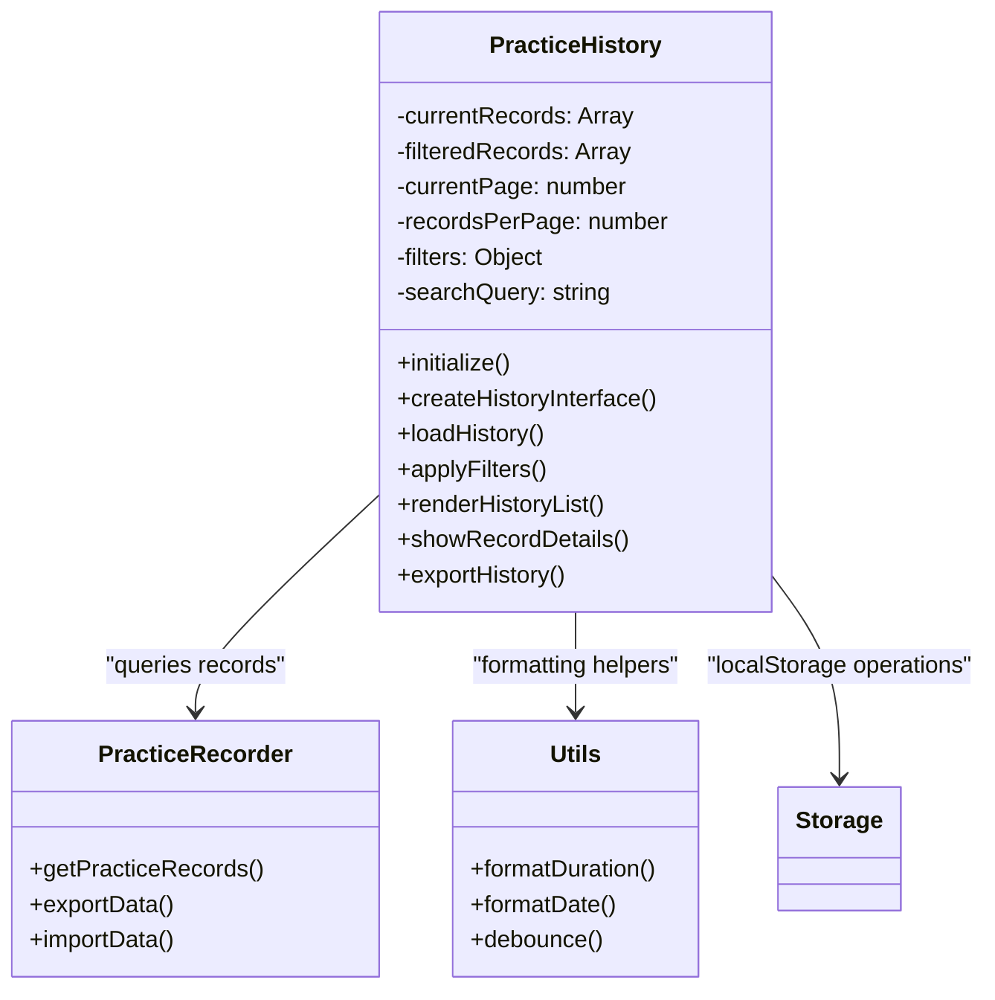
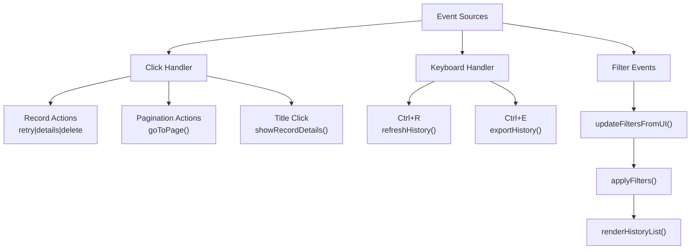
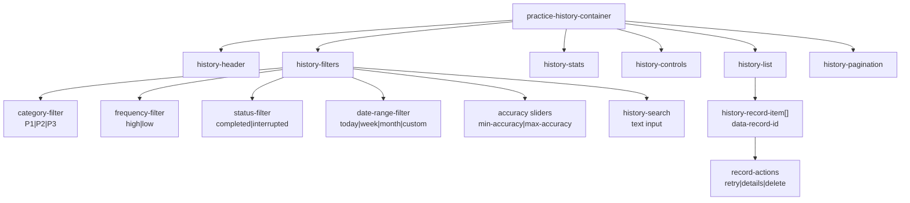
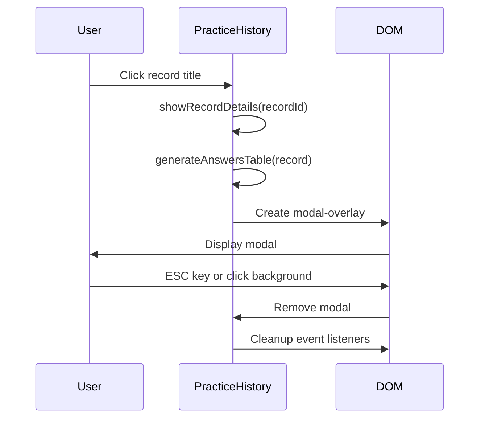
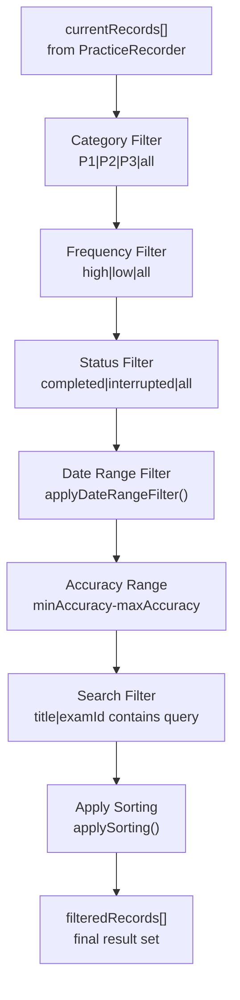
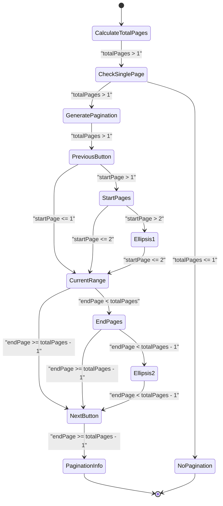
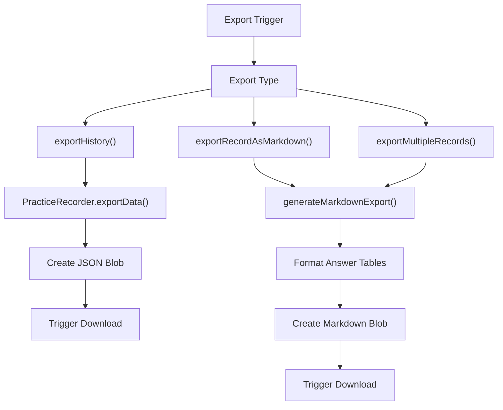
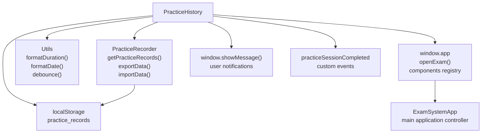

# Practice History Component

> **Relevant source files**
> * [css/styles.css](https://github.com/sallowayma-git/IELTS-practice/blob/db0f538c/css/styles.css)
> * [js/components/practiceHistory.js](https://github.com/sallowayma-git/IELTS-practice/blob/db0f538c/js/components/practiceHistory.js)

This document covers the `PracticeHistory` component, a comprehensive analytics and management interface for user practice session data. The component provides filtering, searching, pagination, detailed record viewing, and data import/export capabilities within the IELTS Reading Practice System.

For information about the underlying practice session recording mechanism, see [Practice Enhancement System](/sallowayma-git/IELTS-practice/6.3-practice-enhancement-system). For details about the styling framework used by this component, see [CSS Architecture & Theming](/sallowayma-git/IELTS-practice/4.1-css-architecture-and-theming).

## Component Architecture

The `PracticeHistory` class serves as the central controller for practice record analytics and management. It integrates with the broader application ecosystem through well-defined interfaces and manages its own UI state independently.

### Core Component Structure

The component initializes through the `initialize()` method at [js/components/practiceHistory.js L29-L33](https://github.com/sallowayma-git/IELTS-practice/blob/db0f538c/js/components/practiceHistory.js#L29-L33)

 which sets up event listeners and creates the main interface. The core data flow begins with `loadHistory()` at [js/components/practiceHistory.js L324-L344](https://github.com/sallowayma-git/IELTS-practice/blob/db0f538c/js/components/practiceHistory.js#L324-L344)

 retrieving records from the `PracticeRecorder` component.

**Sources:** [js/components/practiceHistory.js L1-L1366](https://github.com/sallowayma-git/IELTS-practice/blob/db0f538c/js/components/practiceHistory.js#L1-L1366)

 [css/styles.css L3077-L3135](https://github.com/sallowayma-git/IELTS-practice/blob/db0f538c/css/styles.css#L3077-L3135)

### Event Management System

The component implements a comprehensive event handling system at [js/components/practiceHistory.js L38-L96](https://github.com/sallowayma-git/IELTS-practice/blob/db0f538c/js/components/practiceHistory.js#L38-L96)

 Event delegation is used for dynamic content, with specific handlers for record interactions, pagination controls, and keyboard shortcuts.

**Sources:** [js/components/practiceHistory.js L38-L96](https://github.com/sallowayma-git/IELTS-practice/blob/db0f538c/js/components/practiceHistory.js#L38-L96)

 [js/components/practiceHistory.js L246-L302](https://github.com/sallowayma-git/IELTS-practice/blob/db0f538c/js/components/practiceHistory.js#L246-L302)

## User Interface System

The UI system creates a multi-faceted interface with filtering controls, statistics display, record listing, and pagination components. The interface is generated dynamically through the `createHistoryInterface()` method.

### Interface Component Structure

The main interface template is defined at [js/components/practiceHistory.js L105-L237](https://github.com/sallowayma-git/IELTS-practice/blob/db0f538c/js/components/practiceHistory.js#L105-L237)

 Each filter component has dedicated event handlers configured in `setupFilterEvents()` at [js/components/practiceHistory.js L246-L302](https://github.com/sallowayma-git/IELTS-practice/blob/db0f538c/js/components/practiceHistory.js#L246-L302)

**Sources:** [js/components/practiceHistory.js L105-L237](https://github.com/sallowayma-git/IELTS-practice/blob/db0f538c/js/components/practiceHistory.js#L105-L237)

 [js/components/practiceHistory.js L246-L302](https://github.com/sallowayma-git/IELTS-practice/blob/db0f538c/js/components/practiceHistory.js#L246-L302)

### Modal Dialog System

The component implements a flexible modal system for detailed record views and import dialogs. The `showModal()` method at [js/components/practiceHistory.js L1171-L1193](https://github.com/sallowayma-git/IELTS-practice/blob/db0f538c/js/components/practiceHistory.js#L1171-L1193)

 provides the foundation for all modal interactions.

Record details modals include comprehensive information display with answer analysis tables, generated by `generateAnswersTable()` at [js/components/practiceHistory.js L837-L931](https://github.com/sallowayma-git/IELTS-practice/blob/db0f538c/js/components/practiceHistory.js#L837-L931)

**Sources:** [js/components/practiceHistory.js L717-L832](https://github.com/sallowayma-git/IELTS-practice/blob/db0f538c/js/components/practiceHistory.js#L717-L832)

 [js/components/practiceHistory.js L837-L931](https://github.com/sallowayma-git/IELTS-practice/blob/db0f538c/js/components/practiceHistory.js#L837-L931)

 [js/components/practiceHistory.js L1171-L1193](https://github.com/sallowayma-git/IELTS-practice/blob/db0f538c/js/components/practiceHistory.js#L1171-L1193)

## Data Management & Analytics

The component provides sophisticated data filtering, sorting, and pagination capabilities. All operations work on the `filteredRecords` array, which is derived from `currentRecords` through the `applyFilters()` pipeline.

### Filter Processing Pipeline

The filtering pipeline is implemented in `applyFilters()` at [js/components/practiceHistory.js L356-L411](https://github.com/sallowayma-git/IELTS-practice/blob/db0f538c/js/components/practiceHistory.js#L356-L411)

 Each filter operates sequentially, with specialized handlers for date ranges at [js/components/practiceHistory.js L416-L458](https://github.com/sallowayma-git/IELTS-practice/blob/db0f538c/js/components/practiceHistory.js#L416-L458)

 and sorting at [js/components/practiceHistory.js L463-L495](https://github.com/sallowayma-git/IELTS-practice/blob/db0f538c/js/components/practiceHistory.js#L463-L495)

### Pagination System

Pagination is handled through the `renderPagination()` method at [js/components/practiceHistory.js L597-L666](https://github.com/sallowayma-git/IELTS-practice/blob/db0f538c/js/components/practiceHistory.js#L597-L666)

 which generates dynamic page controls based on the filtered record count and current page size settings.

**Sources:** [js/components/practiceHistory.js L356-L411](https://github.com/sallowayma-git/IELTS-practice/blob/db0f538c/js/components/practiceHistory.js#L356-L411)

 [js/components/practiceHistory.js L463-L495](https://github.com/sallowayma-git/IELTS-practice/blob/db0f538c/js/components/practiceHistory.js#L463-L495)

 [js/components/practiceHistory.js L597-L666](https://github.com/sallowayma-git/IELTS-practice/blob/db0f538c/js/components/practiceHistory.js#L597-L666)

## Import/Export System

The component provides comprehensive data portability through JSON and Markdown export formats, plus import capabilities with merge/replace options.

### Export Capabilities

The export system supports multiple formats through different methods:

* **JSON Export**: Full data export via `exportHistory()` at [js/components/practiceHistory.js L1020-L1047](https://github.com/sallowayma-git/IELTS-practice/blob/db0f538c/js/components/practiceHistory.js#L1020-L1047)
* **Markdown Export**: Individual record export via `exportRecordAsMarkdown()` at [js/components/practiceHistory.js L1286-L1314](https://github.com/sallowayma-git/IELTS-practice/blob/db0f538c/js/components/practiceHistory.js#L1286-L1314)
* **Batch Markdown Export**: Multiple records via `exportMultipleRecords()` at [js/components/practiceHistory.js L1320-L1355](https://github.com/sallowayma-git/IELTS-practice/blob/db0f538c/js/components/practiceHistory.js#L1320-L1355)

The Markdown export format generates structured tables with answer analysis, implemented in `generateMarkdownExport()` at [js/components/practiceHistory.js L1219-L1280](https://github.com/sallowayma-git/IELTS-practice/blob/db0f538c/js/components/practiceHistory.js#L1219-L1280)

### Import System

Import functionality is provided through `showImportDialog()` at [js/components/practiceHistory.js L1052-L1096](https://github.com/sallowayma-git/IELTS-practice/blob/db0f538c/js/components/practiceHistory.js#L1052-L1096)

 and `performImport()` at [js/components/practiceHistory.js L1101-L1133](https://github.com/sallowayma-git/IELTS-practice/blob/db0f538c/js/components/practiceHistory.js#L1101-L1133)

 supporting both merge and replace modes.

**Sources:** [js/components/practiceHistory.js L1020-L1047](https://github.com/sallowayma-git/IELTS-practice/blob/db0f538c/js/components/practiceHistory.js#L1020-L1047)

 [js/components/practiceHistory.js L1219-L1280](https://github.com/sallowayma-git/IELTS-practice/blob/db0f538c/js/components/practiceHistory.js#L1219-L1280)

 [js/components/practiceHistory.js L1052-L1133](https://github.com/sallowayma-git/IELTS-practice/blob/db0f538c/js/components/practiceHistory.js#L1052-L1133)

## Integration Points

The `PracticeHistory` component integrates with several other system components through well-defined interfaces.

### Component Dependencies

The component registers itself globally through `window.PracticeHistory = PracticeHistory` at [js/components/practiceHistory.js L1366](https://github.com/sallowayma-git/IELTS-practice/blob/db0f538c/js/components/practiceHistory.js#L1366-L1366)

 and integrates with the main application through the `window.app` namespace.

### CSS Integration

The component relies on extensive CSS classes defined in the styling system. Key style classes include:

* `.practice-history-container` - Main container styling
* `.history-record-item` - Individual record card styling at [css/styles.css L3103-L3117](https://github.com/sallowayma-git/IELTS-practice/blob/db0f538c/css/styles.css#L3103-L3117)
* `.modal-overlay` and `.modal` - Modal dialog system at [css/styles.css L1265-L1343](https://github.com/sallowayma-git/IELTS-practice/blob/db0f538c/css/styles.css#L1265-L1343)
* `.answers-table` - Answer analysis table styling at [css/styles.css L2948-L3076](https://github.com/sallowayma-git/IELTS-practice/blob/db0f538c/css/styles.css#L2948-L3076)

**Sources:** [js/components/practiceHistory.js L1366](https://github.com/sallowayma-git/IELTS-practice/blob/db0f538c/js/components/practiceHistory.js#L1366-L1366)

 [js/components/practiceHistory.js L324-L344](https://github.com/sallowayma-git/IELTS-practice/blob/db0f538c/js/components/practiceHistory.js#L324-L344)

 [css/styles.css L2885-L3135](https://github.com/sallowayma-git/IELTS-practice/blob/db0f538c/css/styles.css#L2885-L3135)