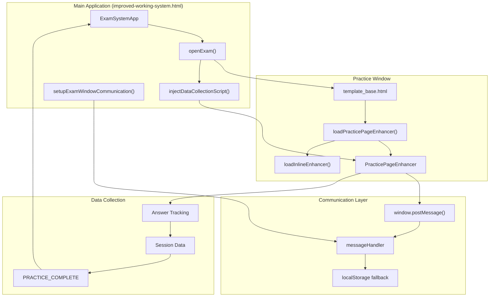
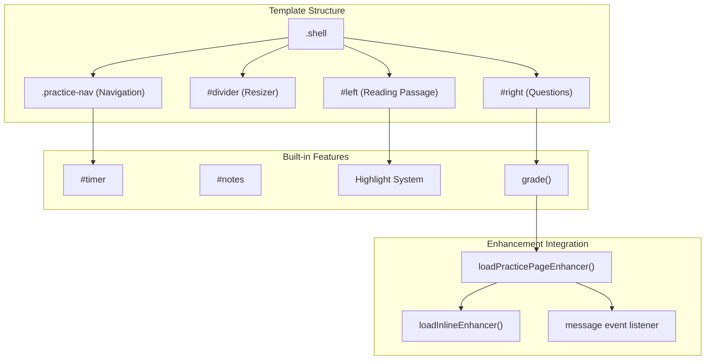
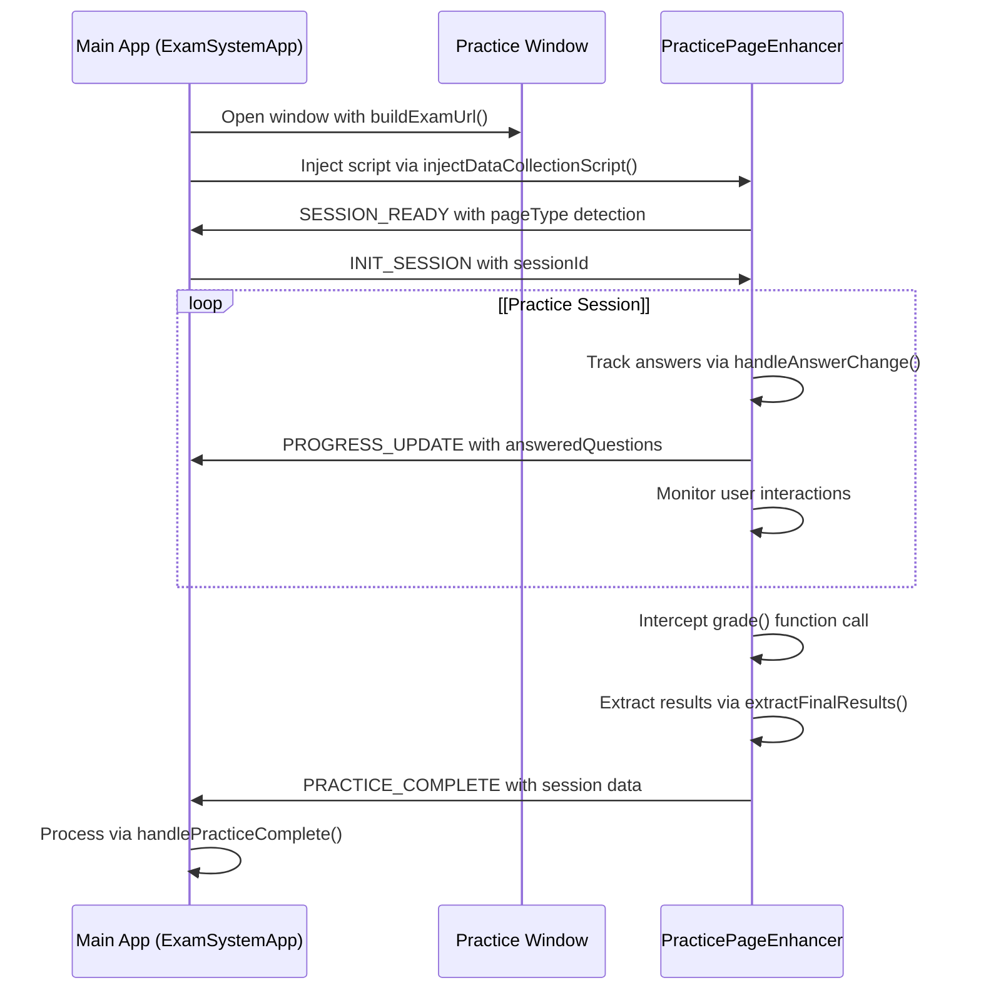
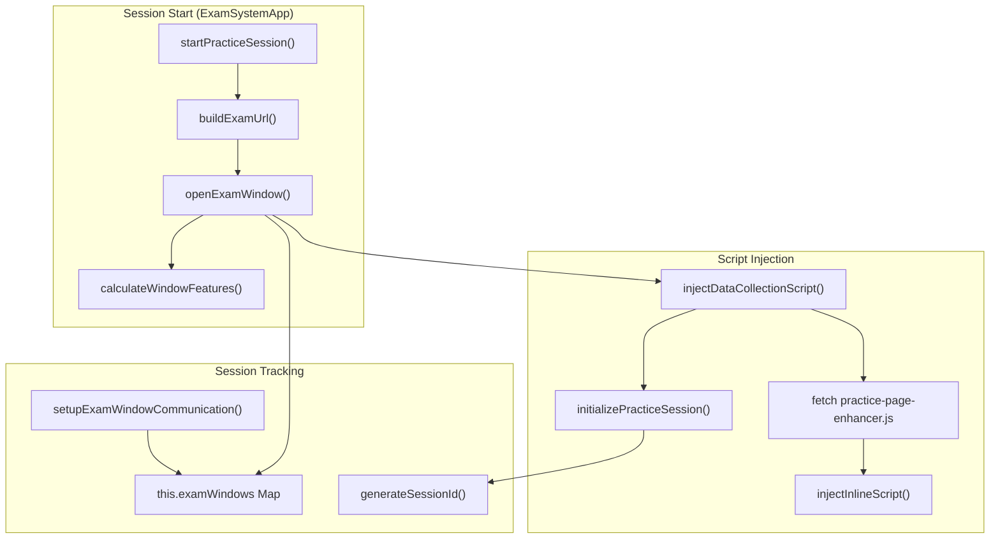
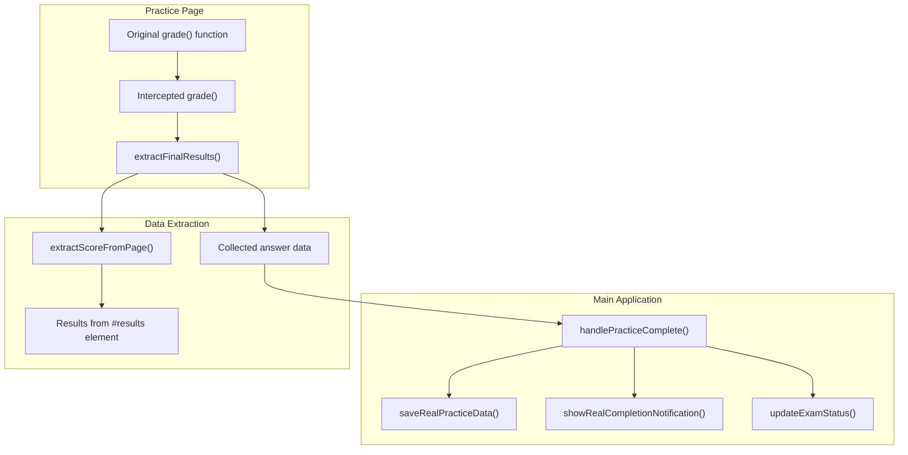
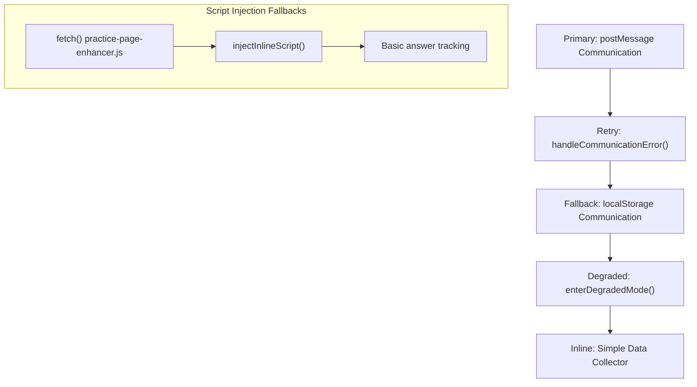

# Practice Session System

> **Relevant source files**
> * [js/app.js](https://github.com/sallowayma-git/IELTS-practice/blob/db0f538c/js/app.js)
> * [js/practice-page-enhancer.js](https://github.com/sallowayma-git/IELTS-practice/blob/db0f538c/js/practice-page-enhancer.js)
> * [templates/template_base.html](https://github.com/sallowayma-git/IELTS-practice/blob/db0f538c/templates/template_base.html)

This document explains how individual practice sessions work in the IELTS Reading Practice System, covering the complete flow from opening a practice page to collecting session results. The system manages the lifecycle of practice windows, handles bidirectional communication between the main application and practice pages, and provides enhanced functionality through script injection.

For information about the main application architecture, see [Core Application](/sallowayma-git/IELTS-practice/2-core-application). For details about the practice history and analytics, see [User Interface & Styling](/sallowayma-git/IELTS-practice/4-user-interface-and-styling).

## Practice Session Architecture

The Practice Session System operates through three main components working together: the practice page template, the enhancement system, and the session management in the main application.



**Sources:** [js/app.js L843-L875](https://github.com/sallowayma-git/IELTS-practice/blob/db0f538c/js/app.js#L843-L875)

 [templates/template_base.html L1216-L1358](https://github.com/sallowayma-git/IELTS-practice/blob/db0f538c/templates/template_base.html#L1216-L1358)

 [js/practice-page-enhancer.js L17-L64](https://github.com/sallowayma-git/IELTS-practice/blob/db0f538c/js/practice-page-enhancer.js#L17-L64)

## Template Base System

The `template_base.html` file serves as the foundation for all practice pages, providing a complete practice interface with built-in functionality.

### Core Template Components

The template includes several key systems:

| Component | Purpose | Key Elements |
| --- | --- | --- |
| Layout System | Two-pane interface with resizable divider | `.shell`, `#left`, `#right`, `#divider` |
| Navigation System | Question navigation and progress tracking | `.practice-nav`, `.q-item`, `#timer` |
| Answer Collection | Form elements with change tracking | `input[name^="q"]`, answer event listeners |
| Enhancement Loading | Script injection and fallback systems | `loadPracticePageEnhancer()`, `loadInlineEnhancer()` |



**Sources:** [templates/template_base.html L35-L575](https://github.com/sallowayma-git/IELTS-practice/blob/db0f538c/templates/template_base.html#L35-L575)

 [templates/template_base.html L1216-L1358](https://github.com/sallowayma-git/IELTS-practice/blob/db0f538c/templates/template_base.html#L1216-L1358)

## Session Communication Protocol

Communication between the main application and practice pages uses `window.postMessage()` with localStorage fallbacks for reliability.

### Message Types and Flow

The system defines specific message types for different phases of the practice session:



### Communication Error Handling

The system implements multiple fallback mechanisms:

| Mechanism | Trigger | Implementation |
| --- | --- | --- |
| Primary Communication | Normal operation | `window.postMessage()` |
| Retry Logic | Message send failure | `handleCommunicationError()` with exponential backoff |
| localStorage Fallback | Cross-origin issues | `handleCommunicationFallback()` |
| Degraded Mode | Multiple failures | `enterDegradedMode()` |

**Sources:** [js/practice-page-enhancer.js L88-L203](https://github.com/sallowayma-git/IELTS-practice/blob/db0f538c/js/practice-page-enhancer.js#L88-L203)

 [js/app.js L1221-L1284](https://github.com/sallowayma-git/IELTS-practice/blob/db0f538c/js/app.js#L1221-L1284)

## Enhancement and Data Collection

The `PracticePageEnhancer` class provides advanced functionality that gets injected into practice pages:

### Data Collection Architecture

```

```

### Answer Tracking Implementation

The enhancement system monitors all form interactions:

```python
// Event listeners from practice-page-enhancer.js
document.addEventListener('change', this.handleAnswerChange);
document.addEventListener('input', this.handleAnswerChange);
```

Answer data is structured as:

| Field | Type | Description |
| --- | --- | --- |
| `questionId` | string | Form element name (e.g., "q1", "q2") |
| `value` | string/null | Selected or entered answer |
| `timestamp` | number | When answer was recorded |
| `timeFromStart` | number | Milliseconds since session start |

**Sources:** [js/practice-page-enhancer.js L355-L414](https://github.com/sallowayma-git/IELTS-practice/blob/db0f538c/js/practice-page-enhancer.js#L355-L414)

 [js/practice-page-enhancer.js L490-L576](https://github.com/sallowayma-git/IELTS-practice/blob/db0f538c/js/practice-page-enhancer.js#L490-L576)

## Session Lifecycle Management

The main application manages the complete lifecycle of practice sessions through the `ExamSystemApp` class:

### Session Initialization Flow



### Session Data Structure

Active sessions are tracked in the `examWindows` Map with the following structure:

```yaml
examWindows: Map<examId, {
    window: Window,
    sessionId: string,
    startTime: number,
    status: 'active' | 'initialized' | 'completed',
    dataCollectorReady?: boolean,
    pageType?: string,
    lastProgress?: object
}>
```

**Sources:** [js/app.js L1477-L1519](https://github.com/sallowayma-git/IELTS-practice/blob/db0f538c/js/app.js#L1477-L1519)

 [js/app.js L950-L1038](https://github.com/sallowayma-git/IELTS-practice/blob/db0f538c/js/app.js#L950-L1038)

 [js/app.js L1191-L1216](https://github.com/sallowayma-git/IELTS-practice/blob/db0f538c/js/app.js#L1191-L1216)

## Session Completion and Data Processing

When a practice session completes, the system processes results through multiple handlers:

### Result Processing Pipeline



### Practice Record Structure

Completed sessions are stored as practice records with this structure:

| Field | Type | Description |
| --- | --- | --- |
| `id` | string | Unique record identifier |
| `examId` | string | Reference to exam in index |
| `sessionId` | string | Practice session identifier |
| `dataSource` | string | "real" for actual session data |
| `realData.scoreInfo` | object | Score details from page extraction |
| `realData.answers` | object | All collected answers |
| `realData.interactions` | array | User interaction history |
| `duration` | number | Session duration in seconds |
| `startTime` | string | ISO timestamp of session start |
| `endTime` | string | ISO timestamp of completion |

**Sources:** [js/practice-page-enhancer.js L460-L488](https://github.com/sallowayma-git/IELTS-practice/blob/db0f538c/js/practice-page-enhancer.js#L460-L488)

 [js/app.js L1598-L1635](https://github.com/sallowayma-git/IELTS-practice/blob/db0f538c/js/app.js#L1598-L1635)

 [js/app.js L1419-L1465](https://github.com/sallowayma-git/IELTS-practice/blob/db0f538c/js/app.js#L1419-L1465)

## Error Handling and Fallbacks

The Practice Session System includes comprehensive error handling at multiple levels:

### Fallback Hierarchy



### Error Recovery Mechanisms

The system implements several recovery strategies:

| Error Type | Detection | Recovery Action | Implementation |
| --- | --- | --- | --- |
| Script load failure | `fetch().catch()` | Inject inline script | `injectInlineScript()` |
| Communication failure | `postMessage` exception | Use localStorage | `handleCommunicationFallback()` |
| Window closed | `window.closed` check | Clean up session | `cleanupExamSession()` |
| Cross-origin issues | Message send failure | Show user notice | `showUserFriendlyError()` |

**Sources:** [js/practice-page-enhancer.js L157-L261](https://github.com/sallowayma-git/IELTS-practice/blob/db0f538c/js/practice-page-enhancer.js#L157-L261)

 [js/app.js L1043-L1113](https://github.com/sallowayma-git/IELTS-practice/blob/db0f538c/js/app.js#L1043-L1113)

 [js/app.js L1965-L1983](https://github.com/sallowayma-git/IELTS-practice/blob/db0f538c/js/app.js#L1965-L1983)