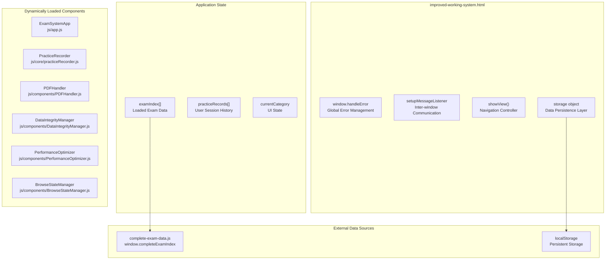
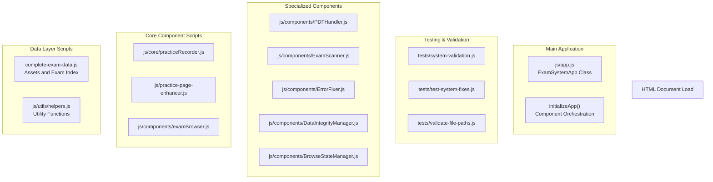
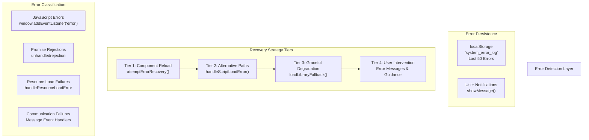
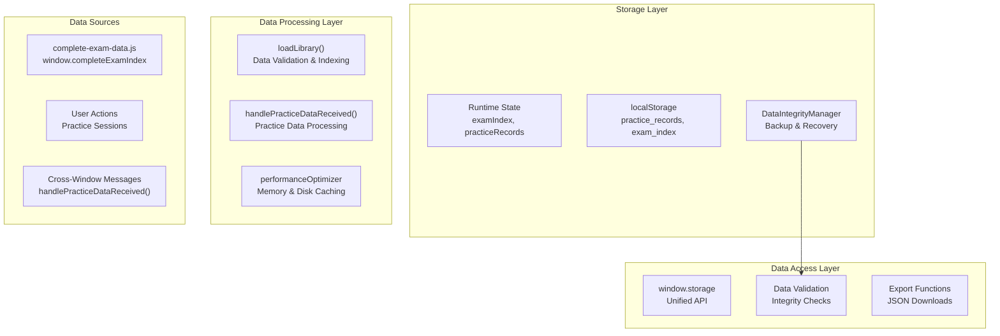
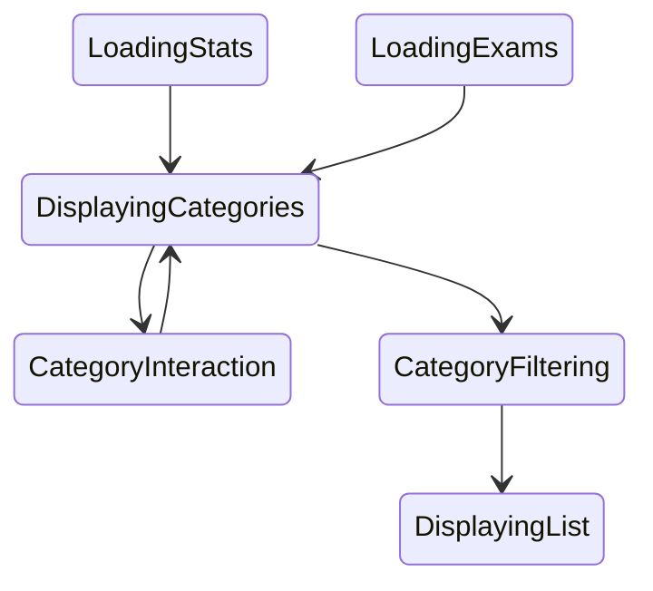
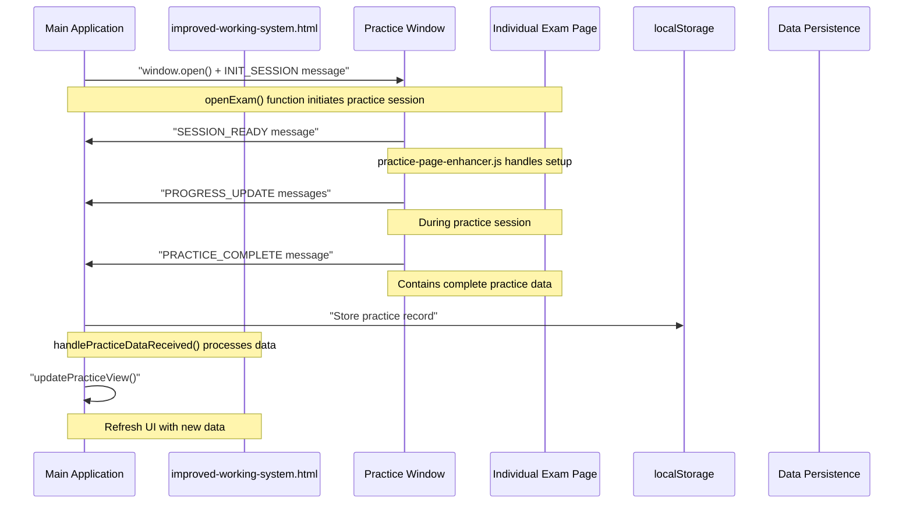
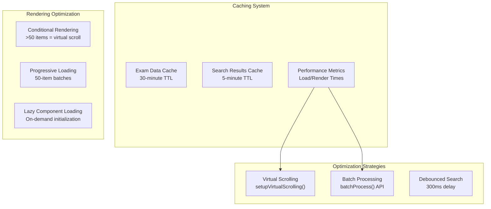

# System Architecture

> **Relevant source files**
> * [improved-working-system.html](https://github.com/sallowayma-git/IELTS-practice/blob/db0f538c/improved-working-system.html)

This document examines the internal architecture of the main application file (`improved-working-system.html`), which serves as the central orchestrator for the IELTS Reading Practice System. It details how the various internal components, modules, and subsystems work together within this single-file application to provide comprehensive exam management functionality.

For information about the broader multi-file system structure, see [Core Application](/sallowayma-git/IELTS-practice/2-core-application). For specific component implementations like error recovery and state management, see [Infrastructure Components](/sallowayma-git/IELTS-practice/5-infrastructure-components).

## Application Structure Overview

The system implements a **single-file hub architecture** where `improved-working-system.html` serves as both the user interface and the central coordinator that dynamically loads and orchestrates multiple specialized components.

### Core Architecture Diagram

**Sources:** [improved-working-system.html L686-L710](https://github.com/sallowayma-git/IELTS-practice/blob/db0f538c/improved-working-system.html#L686-L710)
 [improved-working-system.html L871-L922](https://github.com/sallowayma-git/IELTS-practice/blob/db0f538c/improved-working-system.html#L871-L922)
 [improved-working-system.html L1051-L1057](https://github.com/sallowayma-git/IELTS-practice/blob/db0f538c/improved-working-system.html#L1051-L1057)

## Component Loading and Initialization System

The application uses a **sequential script loading pattern** to ensure proper dependency resolution and initialization order.

### Script Loading Architecture

**Sources:** [improved-working-system.html L687-L710](https://github.com/sallowayma-git/IELTS-practice/blob/db0f538c/improved-working-system.html#L687-L710)
 [improved-working-system.html L871-L922](https://github.com/sallowayma-git/IELTS-practice/blob/db0f538c/improved-working-system.html#L871-L922)

## Error Handling and Recovery Architecture

The system implements a **multi-tier error handling strategy** with automatic recovery mechanisms and comprehensive logging.

### Error Management Flow

| Error Type | Handler Function | Recovery Strategy | User Notification |
| --- | --- | --- | --- |
| JavaScript Errors | `window.handleError` | `attemptErrorRecovery` | User-friendly messages |
| Resource Load Failures | `handleResourceLoadError` | Alternative path loading | Warning notifications |
| Promise Rejections | `unhandledrejection` listener | Context-specific recovery | Error messages |
| Communication Failures | Message event handlers | Reconnection attempts | Connection status |

The error handling system provides multiple recovery tiers:

**Sources:** [improved-working-system.html L712-L958](https://github.com/sallowayma-git/IELTS-practice/blob/db0f538c/improved-working-system.html#L712-L958)
 [improved-working-system.html L794-L846](https://github.com/sallowayma-git/IELTS-practice/blob/db0f538c/improved-working-system.html#L794-L846)

## Data Architecture and Storage System

The application implements a **layered data architecture** with caching, validation, and backup capabilities. The refactored architecture emphasizes a single source of truth through dedicated stores, unidirectional data flows, and compatibility with file:// environments.

### Data Flow Architecture

### Single Source of Truth (Stores)
- **Stores as Central Data Hub**: Data is managed exclusively through stores in `js/stores/` (e.g., `ExamStore` for exam metadata, `RecordStore` for user practice records, `AppStore` for global app state). This ensures a single source of truth, preventing data inconsistencies.
- **Reactive Updates**: Stores emit events on changes (e.g., `ExamStore.loadExams()` loads data and triggers `examLoaded` event), allowing UI components to subscribe without direct data access.
- **Benefits**: Eliminates duplicate state, simplifies debugging, and supports linear flows.

### Unidirectional Data Flow
- **Linear Flow Pattern**: Data flows strictly from stores to UI via events routed through `App.events` (EventEmitter). UI components do not mutate stores directly; instead, user actions emit events that stores process.
- **Flow Example**:
  1. User interacts with UI (e.g., filter exams).
  2. UI emits event via `App.events`.
  3. Store processes event (e.g., `ExamStore.filterExams()`).
  4. Store emits update event.
  5. UI subscribes and re-renders.
- **No Cycles**: This unidirectional pattern ensures predictable state management and easier testing.

### file:// Compatibility
- **Static Loading**: All scripts are loaded synchronously via `<script>` tags in HTML, ensuring dependencies resolve without network requests. Order: utils → stores → ui → app.js.
- **Global State Management**: State is exposed via `window` globals (e.g., `window.stores.ExamStore`, `window.App.events`) to avoid module systems incompatible with file://.
- **Storage/Communication**: Relies on localStorage for persistence and postMessage for cross-window ops, both fully supported. No dynamic imports or server calls; fallbacks handle missing files.

**Sources:** [improved-working-system.html L961-L1017](https://github.com/sallowayma-git/IELTS-practice/blob/db0f538c/improved-working-system.html#L961-L1017)
 [improved-working-system.html L1159-L1302](https://github.com/sallowayma-git/IELTS-practice/blob/db0f538c/improved-working-system.html#L1159-L1302)
 [improved-working-system.html L2928-L3169](https://github.com/sallowayma-git/IELTS-practice/blob/db0f538c/improved-working-system.html#L2928-L3169)
 [js/stores/ExamStore.js](https://github.com/sallowayma-git/IELTS-practice/blob/main/js/stores/ExamStore.js)

## View Management and Navigation System

The system uses a **single-page application (SPA) pattern** with dynamic view switching and state persistence.

### View Controller Architecture

The view management system maintains state through several key functions:

| Function | Purpose | State Management |
| --- | --- | --- |
| `showView()` | Primary navigation controller | Updates active view classes and navigation state |
| `updateOverview()` | Statistics and category display | Calculates exam counts by category |
| `loadExamList()` | Browse view data loading | Manages filtered exam display |
| `updatePracticeView()` | Practice history management | Calculates statistics and displays records |

**Sources:** [improved-working-system.html L1118-L1156](https://github.com/sallowayma-git/IELTS-practice/blob/db0f538c/improved-working-system.html#L1118-L1156)
 [improved-working-system.html L2756-L2819](https://github.com/sallowayma-git/IELTS-practice/blob/db0f538c/improved-working-system.html#L2756-L2819)
 [improved-working-system.html L2391-L2487](https://github.com/sallowayma-git/IELTS-practice/blob/db0f538c/improved-working-system.html#L2391-L2487)

## Inter-Window Communication System

The application implements a **message-based communication protocol** for coordination between the main application and practice session windows.

### Communication Protocol Architecture

The message handling system processes different message types:

| Message Type | Source | Handler | Purpose |
| --- | --- | --- | --- |
| `INIT_SESSION` | Main App | Practice Window | Initialize practice session with exam data |
| `SESSION_READY` | Practice Window | `setupMessageListener` | Confirm practice page is loaded |
| `PROGRESS_UPDATE` | Practice Window | Message listener | Track user progress during practice |
| `PRACTICE_COMPLETE` | Practice Window | `handlePracticeDataReceived` | Process final results and save record |

**Sources:** [improved-working-system.html L1647-L1712](https://github.com/sallowayma-git/IELTS-practice/blob/db0f538c/improved-working-system.html#L1647-L1712)
 [improved-working-system.html L2838-L2868](https://github.com/sallowayma-git/IELTS-practice/blob/db0f538c/improved-working-system.html#L2838-L2868)
 [improved-working-system.html L2928-L3169](https://github.com/sallowayma-git/IELTS-practice/blob/db0f538c/improved-working-system.html#L2928-L3169)

## Performance Optimization and Caching System

The system incorporates **performance optimization strategies** including virtual scrolling, data caching, and batch processing.

### Performance Management Architecture

Performance optimization is handled through several mechanisms:

* **Data Caching**: `performanceOptimizer.getCache()` and `performanceOptimizer.setCache()` for frequently accessed data
* **Virtual Scrolling**: Implemented when displaying more than 50 exam items to maintain smooth UI performance
* **Batch Processing**: Large datasets are processed in chunks with configurable delays to prevent UI blocking
* **Debounced Search**: Search operations are delayed by 300ms to reduce unnecessary processing

**Sources:** [improved-working-system.html L1406-L1465](https://github.com/sallowayma-git/IELTS-practice/blob/db0f538c/improved-working-system.html#L1406-L1465)
 [improved-working-system.html L1513-L1566](https://github.com/sallowayma-git/IELTS-practice/blob/db0f538c/improved-working-system.html#L1513-L1566)
 [improved-working-system.html L1596-L1643](https://github.com/sallowayma-git/IELTS-practice/blob/db0f538c/improved-working-system.html#L1596-L1643)