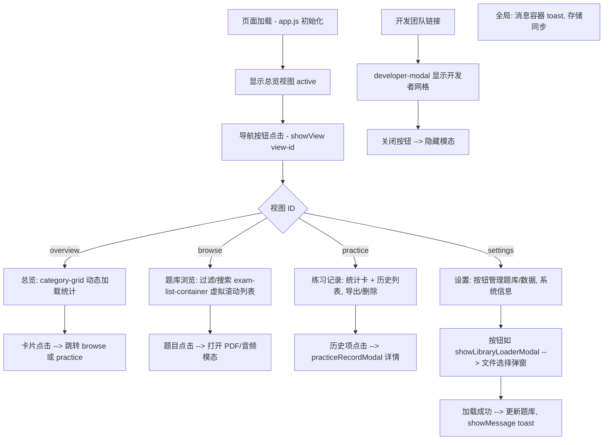

# 考试总览系统 - index.html 功能描述文档 (面向前端开发者)

## 文档目的
本文档详细描述 `index.html` 文件实现的 IELTS 练习管理平台网页功能。该平台是一个单页应用 (SPA)，通过 JavaScript 动态加载和切换视图，支持题库浏览、练习记录、数据管理和系统设置等功能。文档面向前端开发人员，帮助理解现有结构和需要集成的功能点，包括界面布局、按钮交互、弹窗模态、动态列表 (含虚拟滚动)、搜索过滤等。所有动态功能依赖加载的 JS 脚本 (如 app.js, main.js, utils 等)，开发者需集成这些脚本以实现完整交互。

文档基于 HTML 结构分析，推断 JS 实现 (脚本文件暗示功能，如 PDFHandler.js 处理 PDF 题库, markdownExporter.js 处理导出)。

## 整体结构概述
- **DOCTYPE 和 Head**: HTML5 标准, UTF-8 编码, viewport 响应式, 标题 "考试总览系统", favicon, 加载 main.css。
- **Body 主要元素**:
  - 隐藏文件输入: <input type="file" id="folder-picker" webkitdirectory> – 用于加载本地题库文件夹 (支持目录选择 API)。
  - 消息容器: 
 – 用于显示 toast 通知 (e.g., 成功/错误消息), 集成消息队列系统。
  - 容器 
:
    - Header: 标题 "📚 考试总览系统", 子标题链接触发开发团队弹窗。
    - 主导航 (nav.main-nav): 4 个按钮切换视图 (总览, 题库浏览, 练习记录, 设置), onclick="showView('view-id')", active 类管理高亮。
    - 4 个视图 div (class="view", id 如 "overview-view"), 默认总览 active。
  - 开发团队模态: 静态 HTML, 通过 JS 显示/隐藏。
  - 脚本加载: 多个 JS 文件 (complete-exam-data.js 题库数据, utils/storage.js 本地存储, core/practiceRecorder.js 记录管理, components/PDFHandler.js PDF 处理, utils/markdownExporter.js 导出, 等)。开发者需确保这些脚本顺序加载, 处理错误 (ErrorFixer.js)。

平台支持 147 题 (从系统信息推断, 阅读/听力类型), 数据持久化 (localStorage/IndexedDB), 异步操作 (asyncExportHandler.js)。

## 主界面描述
平台有 4 个主界面，通过导航按钮切换。视图使用 class="view active" 控制显示, JS 函数 showView() 处理切换动画和状态保存 (BrowseStateManager.js)。

### 1. 总览界面 (id="overview-view")
- **布局**: h2 "📊 学习总览", 
 – 动态生成分类卡片 (e.g., 阅读/听力统计卡, 进度条, 点击进入子浏览)。
- **按钮/输入**: 无静态按钮。动态卡片可能有 "开始练习" 或 "查看详情" 按钮 (JS 生成, onclick 跳转到题库或记录)。
- **功能**: 显示学习统计 (总题数, 完成率, 分类分布)。集成点: 使用 Chart.js 或 CSS 动画渲染卡片网格, 数据从 storage.js 加载, 支持响应式布局 (grid/flex)。

### 2. 题库浏览界面 (id="browse-view")
- **布局**: h2 "📚 题库浏览" (id="browse-title"), 类型过滤按钮组, 搜索框, 
 列表容器, 加载 spinner 
。
- **按钮/输入**:
  - 类型过滤: <button class="btn btn-sm" onclick="filterByType('all')">全部</button>, 阅读, 听力 – 切换 active 类, 过滤列表显示。
  - 搜索: <input type="text" class="search-input" placeholder="搜索题目..." onkeyup="searchExams(this.value)"> – 实时搜索题目标题/内容。
- **功能**: 加载题库 (从 complete-exam-data.js 和 listening-exam-data.js), 渲染列表 (HTML/PDF 题, 147 项)。支持分页或无限滚动。点击题目项打开详情 (可能新 tab 或模态, PDFHandler.js 处理 PDF 渲染/音频播放)。
- **动态元素**: exam-list-container – 动态生成卡片列表 (标题, 类型, 难度), 支持虚拟滚动 (PerformanceOptimizer.js 优化长列表, 使用 IntersectionObserver 懒加载项, 避免 DOM 过载)。

### 3. 练习记录界面 (id="practice-view")
- **布局**: h2 "📝 练习记录", 统计卡组 
, 练习历史部分 
。
- **统计卡**:
  - 已练习题目: 
0

  - 平均正确率: 
0%

  - 学习时长: 
0
 (分钟)
  - 连续天数: 
0

- **按钮/输入**:
  - 类型过滤: 全部, 阅读, 听力 (onclick="filterRecordsByType('type')")。
  - 操作按钮: 导出 Markdown <button class="btn btn-secondary" onclick="(window.markdownExporter|| (window.markdownExporter=new MarkdownExporter())).exportToMarkdown()">, 批量删除 <button class="btn btn-info" onclick="toggleBulkDelete()"> (切换复选模式), 清除记录 <button class="btn btn-warning" onclick="clearPracticeData()">。
- **功能**: 显示练习历史, 动态更新统计 (practiceRecorder.js 记录分数/时间)。历史列表初始为空 "暂无练习记录", 点击项打开详情模态 (practiceRecordModal.js, 显示答案/分数)。
- **动态元素**: 
 – 列表卡片 (日期, 类型, 分数, 时长), 支持排序/过滤, 虚拟滚动 (长历史优化, dataConsistencyManager.js 确保数据同步)。

### 4. 设置界面 (id="settings-view")
- **布局**: h2 "⚙️ 系统设置", 3 个部分 (系统管理, 数据管理, 系统信息), 背景卡片容器。
- **按钮/输入**:
  - 系统管理:
    - 清除缓存 <button class="btn btn-warning" onclick="clearCache()">
    - 加载题库 <button class="btn" onclick="showLibraryLoaderModal()"> (打开文件夹选择模态)
    - 题库配置切换 <button class="btn btn-info" onclick="showLibraryConfigListV2()">
    - 强制刷新 <button class="btn btn-warning" onclick="loadLibrary(true); showMessage('题库已强制刷新', 'success')">
  - 数据管理:
    - 创建备份 <button class="btn" onclick="createManualBackup()">
    - 备份列表 <button class="btn btn-secondary" onclick="showBackupList()">
    - 导出数据 <button class="btn btn-info" onclick="exportAllData()">
    - 导入数据 <button class="btn btn-warning" onclick="importData()">
  - 系统信息: 静态显示 (题库状态, 总数 147, HTML/PDF 题数, 最后更新), 动态更新 id 如 147。
  - 底部链接: "睡着过开发团队" onclick="showDeveloperTeam()"。
- **功能**: 管理题库/数据 (loadLibrary 从 assets/scripts/complete-exam-data.js 刷新), 备份 (localStorage 导出 JSON), 导入 (文件选择验证 IndexValidator.js)。

## 弹窗与模态
- **开发团队模态 (id="developer-modal")**: class="developer-modal", 内容 
 – h2, 描述, 开发者网格 (class="developer-grid", 多个 
 如 "julie", "Sallowaymmm") , 关闭按钮 onclick="hideDeveloperTeam()"。
  - 触发: Header 和 设置中的链接 onclick="showDeveloperTeam()"。
  - 集成点: 添加 overlay 背景, CSS 过渡 (fade/scale), ESC 键关闭, 移动端触摸支持。确保无障碍 (role="dialog", aria-label)。

- **其他 JS 驱动模态 (推断自脚本)**:
  - 加载题库模态 (showLibraryLoaderModal()): 使用 folder-picker 输入, 显示进度条, 处理 webkitdirectory API 异步加载文件夹 (HTML/PDF/音频文件), 错误处理 (CommunicationRecovery.js)。
  - 题库配置列表 (showLibraryConfigListV2()): 模态或下拉, 列出配置选项 (e.g., 学术/通用版), 切换 loadLibrary。
  - 备份列表 (showBackupList()): 模态显示备份项列表, 支持恢复/删除按钮。
  - 练习记录详情 (practiceRecordModal.js): 点击历史项打开, 显示详细分数/答案, 可能编辑功能。
  - 导入/导出确认: importData() 可能弹出文件选择 + 确认对话。
  - 集成点: 使用原生 dialog 或自定义 div + JS 显示/隐藏, 支持拖拽文件上传, 验证数据完整性 (DataIntegrityManager.js)。

## 动态元素详述
- **列表**:
  - exam-list-container: 动态渲染题库项 (卡片: 标题, 描述, 类型图标), 支持点击打开 (e.g., window.open PDF)。
  - practice-history-list: 历史项列表 (卡片: 日期, 分数, 按钮 "查看/删除"), 初始 placeholder, 批量模式添加复选框。
  - category-grid: 总览卡片网格 (4-6 卡, 统计 + 图标), 点击导航。
  - 集成: 使用 template literals 或 React/Vue 组件生成, 虚拟滚动 (virtual scrolling) – 对于 147+ 项, 实现固定高度容器 + 动态项渲染 (e.g., JS 库或自定义, 只渲染可见项, 节省内存)。

- **搜索**: search-input onkeyup 事件, searchExams(value) – 实时过滤列表 (debounce 300ms 避免频繁查询), 支持模糊匹配 (e.g., 题目关键词)。
  - 集成: 事件节流, 高亮匹配文本, 无结果显示 "无匹配题目"。

- **过滤**: filterByType/filterRecordsByType – 按钮组, 更新列表数据源, 隐藏/显示项, 切换 active 样式。
  - 集成: 状态管理 (e.g., global filter state in BrowseStateManager.js), 响应式更新 (MutationObserver 或 direct DOM manip)。

- **加载指示**: loading div with spinner + "正在加载题目列表...", show/hide 基于 fetch 状态 (async from JS 数据文件)。
  - 集成: CSS 动画 spinner, 错误 fallback (ComponentChecker.js 测试组件加载)。

- **其他动态**: 统计数字动画更新 (e.g., count-up 从 0 到值), 消息 toast (showMessage(type, text) – success/warning, 自动消失)。

## 面向前端开发者的集成点
- **虚拟滚动**: exam-list-container 和 practice-history-list 处理长列表 (147+ 项), 集成 IntersectionObserver API 或库 (e.g., virtual-scroller), 计算项高度, 只渲染 10-20 可见项, 滚动事件更新 offset。PerformanceOptimizer.js 可能已部分实现, 需优化 GPU 加速 (transform 而非 top)。

- **导出功能**: MarkdownExporter.exportToMarkdown() – 异步生成 Markdown (练习历史/答案), asyncExportHandler.js 处理大文件分块下载。集成: Blob URL 下载, 进度指示, 支持 ZIP 打包 (JSZip 库)。

- **存储与数据管理**: storage.js (localStorage/IndexedDB), practiceRecorder.js 记录练习 (分数, 时间, 答案)。集成: 加密敏感数据, 离线支持 (Service Worker), 同步 (CommunicationTester.js 测试网络)。

- **PDF/媒体处理**: PDFHandler.js 渲染 PDF 题 (pdf.js 集成), listening-exam-data.js 音频播放 (HTML5 Audio)。集成: 懒加载 PDF, 手势缩放, 注解工具 (答案高亮)。

- **性能与错误**: PerformanceOptimizer.js (debounce, lazy load), ErrorFixer.js (try-catch, fallback UI), DataIntegrityManager.js (CRC 检查备份)。集成: Web Vitals 监控, PWA 安装提示。

- **响应式与无障碍**: main.css 已响应式, 集成媒体查询, ARIA 标签 (e.g., role="button" for nav), 键盘导航 (tabindex)。

- **测试与调试**: ComponentChecker.js 验证加载, boot-fallbacks.js 降级模式。集成: Jest 测试交互, Lighthouse 审计性能。

## 界面导航流程图 (Mermaid)

## 结语
此文档覆盖 `index.html` 所有静态/动态功能, 开发者可基于此集成 JS 逻辑 (e.g., main.js 处理事件绑定)。建议添加单元测试覆盖交互, 监控用户反馈优化 UX (e.g., 移动端虚拟键盘搜索)。如果需要扩展 (e.g., 新视图), 修改 nav 并添加 div.view。

文档更新日期: 2025-09-16