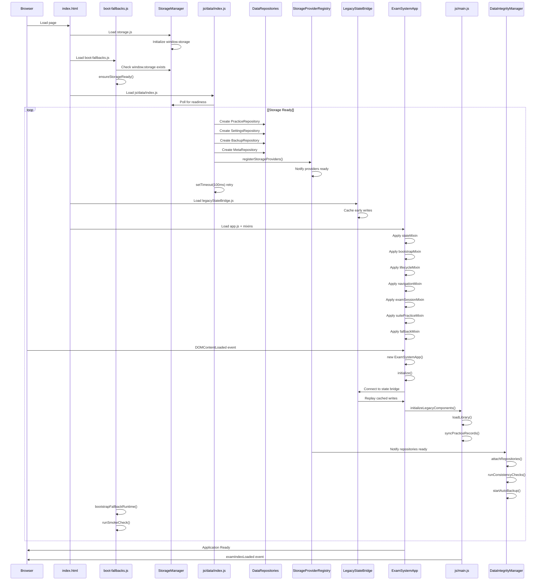
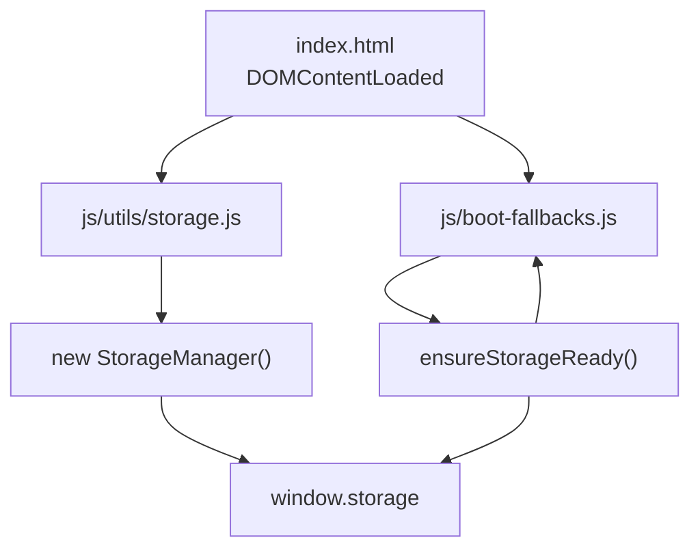
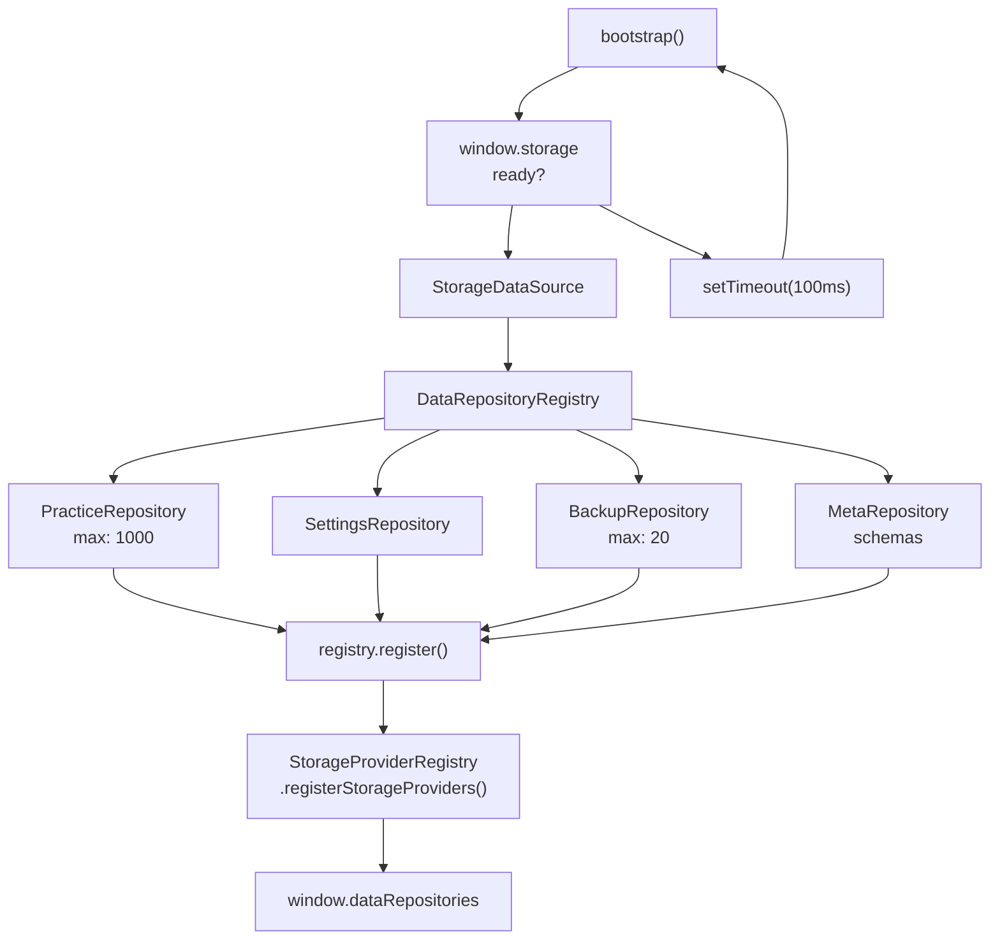
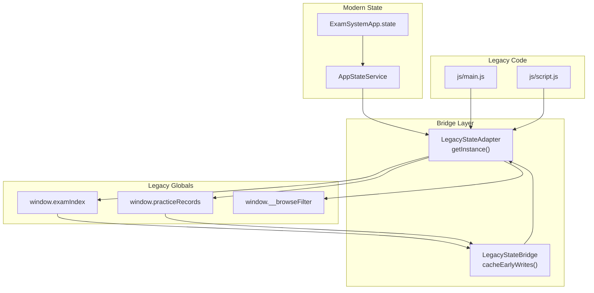
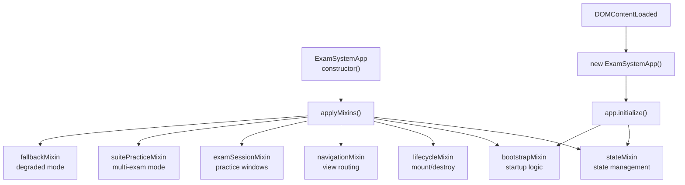
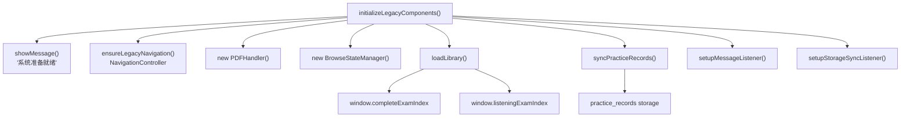
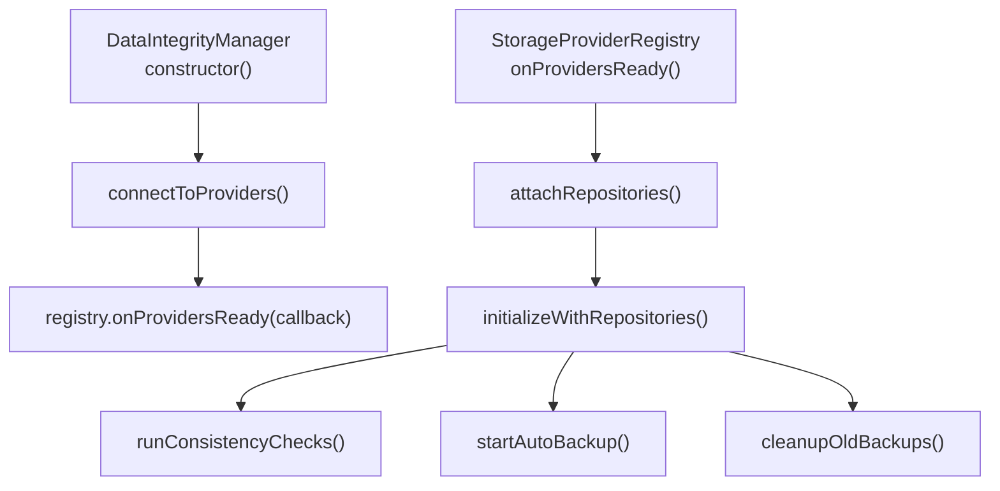
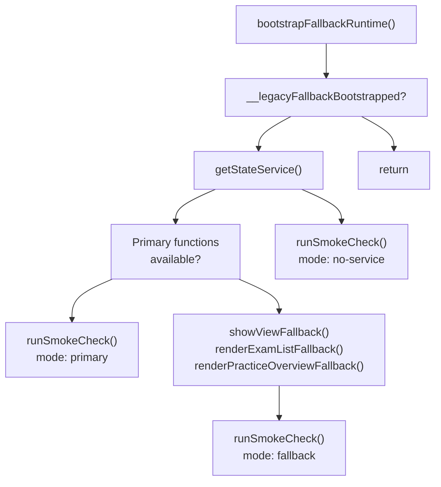
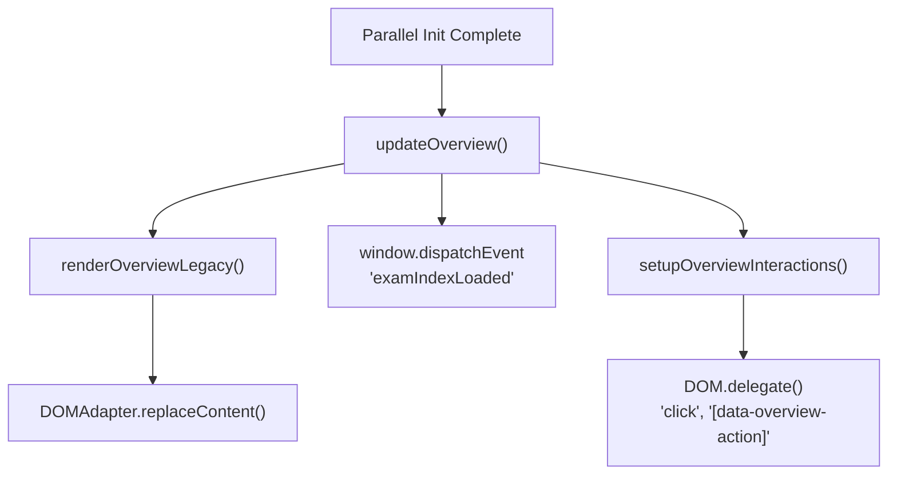
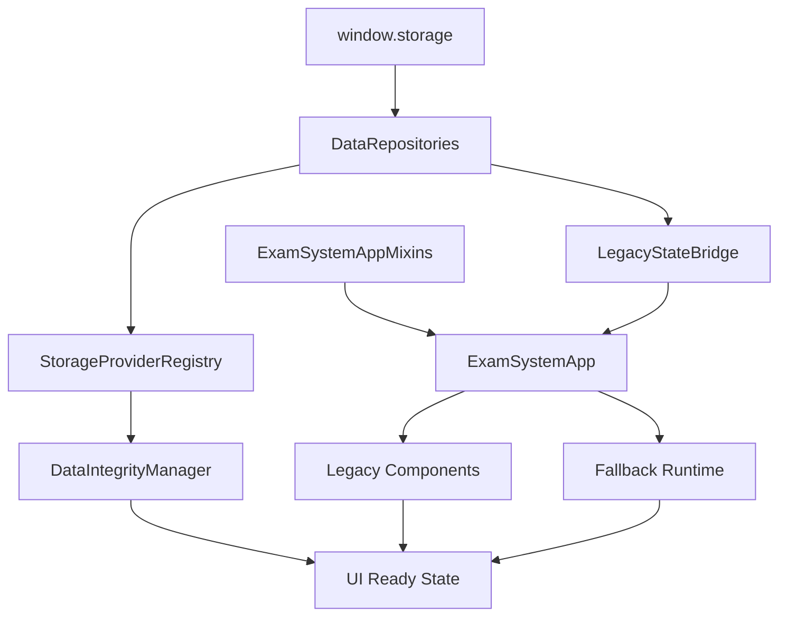

# Application Initialization & Bootstrap

> **Relevant source files**
> * [assets/developer wiki/hp-overview-usage-todo.md](https://github.com/sallowayma-git/IELTS-practice/blob/df0c9b8f/assets/developer wiki/hp-overview-usage-todo.md)
> * [css/main.css](https://github.com/sallowayma-git/IELTS-practice/blob/df0c9b8f/css/main.css)
> * [developer/docs/10-06 log.md](https://github.com/sallowayma-git/IELTS-practice/blob/df0c9b8f/developer/docs/10-06 log.md)
> * [developer/docs/optimization-task-tracker.md](https://github.com/sallowayma-git/IELTS-practice/blob/df0c9b8f/developer/docs/optimization-task-tracker.md)
> * [developer/tests/js/e2e/appE2ETest.js](https://github.com/sallowayma-git/IELTS-practice/blob/df0c9b8f/developer/tests/js/e2e/appE2ETest.js)
> * [index.html](https://github.com/sallowayma-git/IELTS-practice/blob/df0c9b8f/index.html)
> * [js/app.js](https://github.com/sallowayma-git/IELTS-practice/blob/df0c9b8f/js/app.js)
> * [js/components/DataIntegrityManager.js](https://github.com/sallowayma-git/IELTS-practice/blob/df0c9b8f/js/components/DataIntegrityManager.js)
> * [js/components/practiceHistoryEnhancer.js](https://github.com/sallowayma-git/IELTS-practice/blob/df0c9b8f/js/components/practiceHistoryEnhancer.js)
> * [js/core/goalManager.js](https://github.com/sallowayma-git/IELTS-practice/blob/df0c9b8f/js/core/goalManager.js)
> * [js/data/index.js](https://github.com/sallowayma-git/IELTS-practice/blob/df0c9b8f/js/data/index.js)
> * [js/main.js](https://github.com/sallowayma-git/IELTS-practice/blob/df0c9b8f/js/main.js)
> * [js/script.js](https://github.com/sallowayma-git/IELTS-practice/blob/df0c9b8f/js/script.js)
> * [js/utils/dom.js](https://github.com/sallowayma-git/IELTS-practice/blob/df0c9b8f/js/utils/dom.js)
> * [js/utils/simpleStorageWrapper.js](https://github.com/sallowayma-git/IELTS-practice/blob/df0c9b8f/js/utils/simpleStorageWrapper.js)
> * [js/views/legacyViewBundle.js](https://github.com/sallowayma-git/IELTS-practice/blob/df0c9b8f/js/views/legacyViewBundle.js)

## Purpose and Scope

This document describes the multi-phase initialization sequence that bootstraps the IELTS practice system from initial HTML load to a fully operational application state. It covers the loading order of scripts, storage provider setup, data repository initialization, legacy state bridging, and the parallel initialization of subsystems.

For information about the runtime state management after initialization, see [ExamSystemApp & State Management](/sallowayma-git/IELTS-practice/3.1-examsystemapp-and-state-management). For the view rendering system that depends on successful initialization, see [View Management & Navigation](/sallowayma-git/IELTS-practice/3.3-view-management-and-navigation).

---

## Initialization Phases

The application bootstrap occurs in six sequential phases, with some subsystems initializing in parallel during later phases:

| Phase | Name | Key Responsibility | Blocking |
| --- | --- | --- | --- |
| 1 | Foundation | Ensure global objects (`window.storage`) exist | Yes |
| 2 | Data Layer | Create repositories and storage data sources | Yes |
| 3 | Legacy Bridge | Setup state synchronization adapters | Yes |
| 4 | App Core | Initialize `ExamSystemApp` with mixins | Yes |
| 5 | Parallel Init | Load exam library, sync records, start integrity checks | No |
| 6 | UI Ready | Render initial view, setup event delegates | No |

**Sources:** [js/main.js L254-L323](https://github.com/sallowayma-git/IELTS-practice/blob/df0c9b8f/js/main.js#L254-L323)

 [js/app.js L86-L112](https://github.com/sallowayma-git/IELTS-practice/blob/df0c9b8f/js/app.js#L86-L112)

 [js/boot-fallbacks.js L1-L521](https://github.com/sallowayma-git/IELTS-practice/blob/df0c9b8f/js/boot-fallbacks.js#L1-L521)

---

## Bootstrap Sequence

The following diagram illustrates the complete initialization flow from HTML load to application ready state:



**Sources:** [index.html L298-L404](https://github.com/sallowayma-git/IELTS-practice/blob/df0c9b8f/index.html#L298-L404)

 [js/main.js L254-L323](https://github.com/sallowayma-git/IELTS-practice/blob/df0c9b8f/js/main.js#L254-L323)

 [js/app.js L86-L112](https://github.com/sallowayma-git/IELTS-practice/blob/df0c9b8f/js/app.js#L86-L112)

 [js/data/index.js L20-L118](https://github.com/sallowayma-git/IELTS-practice/blob/df0c9b8f/js/data/index.js#L20-L118)

 [js/boot-fallbacks.js L107-L148](https://github.com/sallowayma-git/IELTS-practice/blob/df0c9b8f/js/boot-fallbacks.js#L107-L148)

---

## Phase 1: Foundation Layer

### Global Object Initialization

The foundation phase ensures critical global objects exist before any subsystem attempts to use them. The `boot-fallbacks.js` script loads early and provides safety checks.

**Key Global Objects:**

* `window.storage` - StorageManager instance
* `window.ExamSystemAppMixins` - Container for mixin definitions
* `window.LegacyFallback` - Fallback runtime utilities



The `boot-fallbacks.js` script performs defensive checks to ensure `window.storage` is not `null` or `undefined`. If the storage manager fails to initialize, fallback behavior is triggered but the system continues loading.

**Sources:** [js/boot-fallbacks.js L1-L148](https://github.com/sallowayma-git/IELTS-practice/blob/df0c9b8f/js/boot-fallbacks.js#L1-L148)

 [js/utils/storage.js L1-L1298](https://github.com/sallowayma-git/IELTS-practice/blob/df0c9b8f/js/utils/storage.js#L1-L1298)

 [index.html L304-L349](https://github.com/sallowayma-git/IELTS-practice/blob/df0c9b8f/index.html#L304-L349)

---

## Phase 2: Data Repository Setup

### Repository Initialization Pattern

The data layer uses a polling-based initialization to handle unpredictable script load order. The `js/data/index.js` module repeatedly checks for `window.storage` availability before creating repositories.



**Retry Mechanism:**

The polling loop has no timeout. It continues checking every 100ms until `window.storage` becomes available. This approach avoids race conditions where repositories are created before the storage backend is ready.

[js/data/index.js L20-L29](https://github.com/sallowayma-git/IELTS-practice/blob/df0c9b8f/js/data/index.js#L20-L29)

**Repository Configuration:**

Each repository type has specific constraints:

* **PracticeRepository**: Enforces 1000 record maximum, automatic pruning
* **SettingsRepository**: Schema-free key-value store
* **BackupRepository**: Maintains 20 most recent backups
* **MetaRepository**: Schema-driven with per-key defaults and validators

[js/data/index.js L34-L87](https://github.com/sallowayma-git/IELTS-practice/blob/df0c9b8f/js/data/index.js#L34-L87)

**Sources:** [js/data/index.js L1-L118](https://github.com/sallowayma-git/IELTS-practice/blob/df0c9b8f/js/data/index.js#L1-L118)

 [js/data/repositories/practiceRepository.js L1-L200](https://github.com/sallowayma-git/IELTS-practice/blob/df0c9b8f/js/data/repositories/practiceRepository.js#L1-L200)

 [js/data/repositories/baseRepository.js L1-L100](https://github.com/sallowayma-git/IELTS-practice/blob/df0c9b8f/js/data/repositories/baseRepository.js#L1-L100)

---

## Phase 3: Legacy State Bridge

### Synchronization Adapter Layer

The legacy bridge system ensures bidirectional state synchronization between modern `ExamSystemApp` state and legacy global variables (`window.examIndex`, `window.practiceRecords`). This prevents dual-write conflicts during the transition period.



**Initialization Order Handling:**

The `LegacyStateBridge` caches writes that occur before `ExamSystemApp` initialization. Once the app connects, cached writes are replayed to synchronize state.

[js/core/legacyStateBridge.js L1-L240](https://github.com/sallowayma-git/IELTS-practice/blob/df0c9b8f/js/core/legacyStateBridge.js#L1-L240)

**Adapter Methods:**

| Method | Purpose | Direction |
| --- | --- | --- |
| `setExamIndexState()` | Update exam library | Legacy → State |
| `setPracticeRecordsState()` | Update practice history | Legacy → State |
| `setBrowseFilterState()` | Update filter state | Legacy → State |
| `getExamIndexState()` | Read exam library | State → Legacy |
| `getPracticeRecordsState()` | Read practice history | State → Legacy |

All legacy code paths (`js/main.js`, `js/script.js`, HP bridge) must use these adapter methods instead of direct global variable assignment.

**Sources:** [js/utils/legacyStateAdapter.js L1-L142](https://github.com/sallowayma-git/IELTS-practice/blob/df0c9b8f/js/utils/legacyStateAdapter.js#L1-L142)

 [js/core/legacyStateBridge.js L1-L240](https://github.com/sallowayma-git/IELTS-practice/blob/df0c9b8f/js/core/legacyStateBridge.js#L1-L240)

 [js/main.js L65-L194](https://github.com/sallowayma-git/IELTS-practice/blob/df0c9b8f/js/main.js#L65-L194)

---

## Phase 4: Application Core Initialization

### Mixin-Based Composition

The `ExamSystemApp` class uses a mixin-based architecture where functionality is composed from independent modules. All mixins are loaded before the main `app.js` script.



**Mixin Application:**

Mixins are applied to `ExamSystemApp.prototype` by the `applyMixins()` function, which merges method definitions from each mixin module.

[js/app.js L64-L81](https://github.com/sallowayma-git/IELTS-practice/blob/df0c9b8f/js/app.js#L64-L81)

**Loading Order in HTML:**

The script loading order in `index.html` is critical. Mixins must load before `app.js`:

```xml
<script src="js/app/stateMixin.js"></script>
<script src="js/app/bootstrapMixin.js"></script>
<script src="js/app/lifecycleMixin.js"></script>
<script src="js/app/navigationMixin.js"></script>
<script src="js/app/examSessionMixin.js"></script>
<script src="js/app/suitePracticeMixin.js"></script>
<script src="js/app/fallbackMixin.js"></script>
<script src="js/app.js"></script>
```

[index.html L397-L404](https://github.com/sallowayma-git/IELTS-practice/blob/df0c9b8f/index.html#L397-L404)

**Initialization Entry Point:**

The `DOMContentLoaded` event triggers app instantiation and initialization:

[js/app.js L86-L112](https://github.com/sallowayma-git/IELTS-practice/blob/df0c9b8f/js/app.js#L86-L112)

**Sources:** [js/app.js L1-L120](https://github.com/sallowayma-git/IELTS-practice/blob/df0c9b8f/js/app.js#L1-L120)

 [index.html L397-L404](https://github.com/sallowayma-git/IELTS-practice/blob/df0c9b8f/index.html#L397-L404)

 [js/app/stateMixin.js L1-L220](https://github.com/sallowayma-git/IELTS-practice/blob/df0c9b8f/js/app/stateMixin.js#L1-L220)

 [js/app/bootstrapMixin.js L1-L300](https://github.com/sallowayma-git/IELTS-practice/blob/df0c9b8f/js/app/bootstrapMixin.js#L1-L300)

---

## Phase 5: Parallel Subsystem Initialization

Once the application core is ready, three subsystems initialize in parallel without blocking each other:

### Subsystem A: Legacy Component Initialization

The `initializeLegacyComponents()` function in `js/main.js` performs several critical setup tasks:



**Library Loading Logic:**

The `loadLibrary()` function checks for cached exam data. If cache exists and is non-empty, it uses the cache. Otherwise, it rebuilds the index from global exam data arrays:

[js/main.js L552-L608](https://github.com/sallowayma-git/IELTS-practice/blob/df0c9b8f/js/main.js#L552-L608)

The function only writes to storage if both reading and listening exams are found, preventing empty index pollution.

**Practice Record Synchronization:**

The `syncPracticeRecords()` function loads practice records with defensive normalization:

[js/main.js L341-L443](https://github.com/sallowayma-git/IELTS-practice/blob/df0c9b8f/js/main.js#L341-L443)

It handles multiple data formats and computes missing fields (duration, accuracy, percentage) from available data.

**Sources:** [js/main.js L255-L323](https://github.com/sallowayma-git/IELTS-practice/blob/df0c9b8f/js/main.js#L255-L323)

 [js/main.js L341-L443](https://github.com/sallowayma-git/IELTS-practice/blob/df0c9b8f/js/main.js#L341-L443)

 [js/main.js L552-L608](https://github.com/sallowayma-git/IELTS-practice/blob/df0c9b8f/js/main.js#L552-L608)

### Subsystem B: Data Integrity Manager

The `DataIntegrityManager` connects to repositories through the registry notification system:



**Registry Injection Pattern:**

The manager receives repositories through the `StorageProviderRegistry` pub-sub mechanism, eliminating polling:

[js/components/DataIntegrityManager.js L25-L64](https://github.com/sallowayma-git/IELTS-practice/blob/df0c9b8f/js/components/DataIntegrityManager.js#L25-L64)

**Auto-Backup Configuration:**

Backups run every 10 minutes and maintain a maximum of 5 backups:

[js/components/DataIntegrityManager.js L7-L9](https://github.com/sallowayma-git/IELTS-practice/blob/df0c9b8f/js/components/DataIntegrityManager.js#L7-L9)

 [js/components/DataIntegrityManager.js L194-L224](https://github.com/sallowayma-git/IELTS-practice/blob/df0c9b8f/js/components/DataIntegrityManager.js#L194-L224)

**Sources:** [js/components/DataIntegrityManager.js L1-L120](https://github.com/sallowayma-git/IELTS-practice/blob/df0c9b8f/js/components/DataIntegrityManager.js#L1-L120)

 [js/core/storageProviderRegistry.js L1-L71](https://github.com/sallowayma-git/IELTS-practice/blob/df0c9b8f/js/core/storageProviderRegistry.js#L1-L71)

### Subsystem C: Fallback Runtime

The fallback runtime provides degraded-mode capabilities for environments where the primary app fails to initialize:



**Smoke Check Reporting:**

The fallback runtime performs smoke checks to verify system health and stores results in `window.__legacySmokeReport`:

[js/script.js L91-L105](https://github.com/sallowayma-git/IELTS-practice/blob/df0c9b8f/js/script.js#L91-L105)

**Fallback Rendering:**

If primary rendering functions are unavailable, the fallback provides minimal UI:

[js/script.js L30-L89](https://github.com/sallowayma-git/IELTS-practice/blob/df0c9b8f/js/script.js#L30-L89)

**Sources:** [js/script.js L1-L148](https://github.com/sallowayma-git/IELTS-practice/blob/df0c9b8f/js/script.js#L1-L148)

 [js/boot-fallbacks.js L107-L148](https://github.com/sallowayma-git/IELTS-practice/blob/df0c9b8f/js/boot-fallbacks.js#L107-L148)

---

## Phase 6: UI Ready State

### Post-Initialization Tasks

After parallel initialization completes, the application performs final setup:

1. **Update Overview View**: Render category cards and statistics
2. **Setup Event Delegates**: Activate `DOM.delegate()` listeners
3. **Dispatch Ready Event**: Fire `examIndexLoaded` custom event
4. **Enable Navigation**: Make all nav buttons interactive



**Event Delegation Setup:**

Overview interactions use a single delegated listener instead of individual button listeners:

[js/main.js L814-L876](https://github.com/sallowayma-git/IELTS-practice/blob/df0c9b8f/js/main.js#L814-L876)

**Ready Event:**

Components waiting for the exam library to load can listen for the `examIndexLoaded` event:

[js/main.js L609-L614](https://github.com/sallowayma-git/IELTS-practice/blob/df0c9b8f/js/main.js#L609-L614)

**Sources:** [js/main.js L609-L687](https://github.com/sallowayma-git/IELTS-practice/blob/df0c9b8f/js/main.js#L609-L687)

 [js/main.js L814-L876](https://github.com/sallowayma-git/IELTS-practice/blob/df0c9b8f/js/main.js#L814-L876)

---

## Error Handling and Fallbacks

### Initialization Failure Modes

The system provides multiple fallback paths for initialization failures:

| Failure Point | Detection | Fallback Behavior |
| --- | --- | --- |
| StorageManager unavailable | `boot-fallbacks.js` polling | In-memory state only, no persistence |
| Repository creation timeout | `js/data/index.js` retry loop | Continues retrying indefinitely |
| App initialization error | `DOMContentLoaded` try-catch | Display error message, attempt fallback render |
| Mixin load failure | `applyMixins()` check | Log warning, skip failed mixin |
| Exam library load error | `loadLibrary()` catch | Empty exam list, retry on manual refresh |

**App-Level Error Handler:**

The `DOMContentLoaded` listener in `app.js` wraps initialization in try-catch:

[js/app.js L86-L112](https://github.com/sallowayma-git/IELTS-practice/blob/df0c9b8f/js/app.js#L86-L112)

**Legacy Fallback Invocation:**

If the primary app fails, `boot-fallbacks.js` provides minimal functionality:

[js/boot-fallbacks.js L107-L148](https://github.com/sallowayma-git/IELTS-practice/blob/df0c9b8f/js/boot-fallbacks.js#L107-L148)

**Sources:** [js/app.js L86-L112](https://github.com/sallowayma-git/IELTS-practice/blob/df0c9b8f/js/app.js#L86-L112)

 [js/boot-fallbacks.js L107-L148](https://github.com/sallowayma-git/IELTS-practice/blob/df0c9b8f/js/boot-fallbacks.js#L107-L148)

 [js/main.js L552-L608](https://github.com/sallowayma-git/IELTS-practice/blob/df0c9b8f/js/main.js#L552-L608)

---

## Initialization Dependencies

The following dependency graph shows which components must initialize before others:



**Critical Path:**

The critical path for basic functionality is:
`StorageManager → DataRepositories → ExamSystemApp → Legacy Components → UI Ready`

The `DataIntegrityManager` and `Fallback Runtime` can initialize asynchronously without blocking the critical path.

**Sources:** [index.html L304-L404](https://github.com/sallowayma-git/IELTS-practice/blob/df0c9b8f/index.html#L304-L404)

 [js/data/index.js L20-L118](https://github.com/sallowayma-git/IELTS-practice/blob/df0c9b8f/js/data/index.js#L20-L118)

 [js/app.js L86-L112](https://github.com/sallowayma-git/IELTS-practice/blob/df0c9b8f/js/app.js#L86-L112)

 [js/main.js L255-L323](https://github.com/sallowayma-git/IELTS-practice/blob/df0c9b8f/js/main.js#L255-L323)

---

## Initialization Timing Metrics

Typical initialization times on a modern browser (based on E2E test observations):

| Phase | Duration | Notes |
| --- | --- | --- |
| StorageManager ready | 50-100ms | Depends on IndexedDB setup |
| Repository creation | 100-200ms | Includes polling retry cycles |
| App initialization | 50-150ms | Mixin application and state setup |
| Library loading (cached) | 10-50ms | Reading from localStorage |
| Library loading (rebuild) | 100-300ms | Processing exam index arrays |
| Practice record sync | 50-200ms | Depends on record count |
| Data integrity checks | 100-500ms | First-time consistency validation |
| **Total (cached)** | **360-1200ms** | Best case with warm cache |
| **Total (cold)** | **560-1700ms** | Worst case, full rebuild |

**Optimization Opportunities:**

* Eliminate polling loops in `js/data/index.js` by using registry notifications
* Defer non-critical components (DataIntegrityManager) to post-render phase
* Cache mixin composition results to avoid re-application

**Sources:** [developer/tests/js/e2e/appE2ETest.js L164-L184](https://github.com/sallowayma-git/IELTS-practice/blob/df0c9b8f/developer/tests/js/e2e/appE2ETest.js#L164-L184)

 [js/main.js L552-L608](https://github.com/sallowayma-git/IELTS-practice/blob/df0c9b8f/js/main.js#L552-L608)

---

## Testing and Verification

### E2E Initialization Tests

The E2E test suite verifies initialization correctness:

**Test: Application Initialization State**

* Verifies `window.app.isInitialized === true`
* Checks default active view is `overview-view`
* Confirms navigation button state matches view

[developer/tests/js/e2e/appE2ETest.js L260-L275](https://github.com/sallowayma-git/IELTS-practice/blob/df0c9b8f/developer/tests/js/e2e/appE2ETest.js#L260-L275)

**Test: Legacy Bridge Synchronization**

* Ensures `window.examIndex` matches `app.state.exam.index`
* Verifies `window.practiceRecords` matches `app.state.practice.records`

[developer/tests/js/e2e/appE2ETest.js L768-L816](https://github.com/sallowayma-git/IELTS-practice/blob/df0c9b8f/developer/tests/js/e2e/appE2ETest.js#L768-L816)

### Static Analysis Checks

The static analysis suite validates initialization contract:

**Structure Validation:**

* Parses `index.html` to extract script loading order
* Ensures mixin scripts load before `app.js`

**Method Contract Validation:**

* Checks `ExamSystemApp` has all mixin methods
* Validates method signatures match expected interface

[developer/tests/ci/run_static_suite.py L1-L200](https://github.com/sallowayma-git/IELTS-practice/blob/df0c9b8f/developer/tests/ci/run_static_suite.py#L1-L200)

**Sources:** [developer/tests/js/e2e/appE2ETest.js L260-L275](https://github.com/sallowayma-git/IELTS-practice/blob/df0c9b8f/developer/tests/js/e2e/appE2ETest.js#L260-L275)

 [developer/tests/js/e2e/appE2ETest.js L768-L816](https://github.com/sallowayma-git/IELTS-practice/blob/df0c9b8f/developer/tests/js/e2e/appE2ETest.js#L768-L816)

 [developer/tests/ci/run_static_suite.py L224-L244](https://github.com/sallowayma-git/IELTS-practice/blob/df0c9b8f/developer/tests/ci/run_static_suite.py#L224-L244)