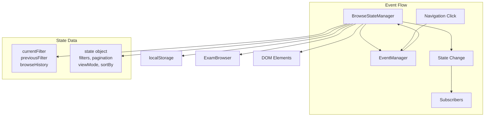
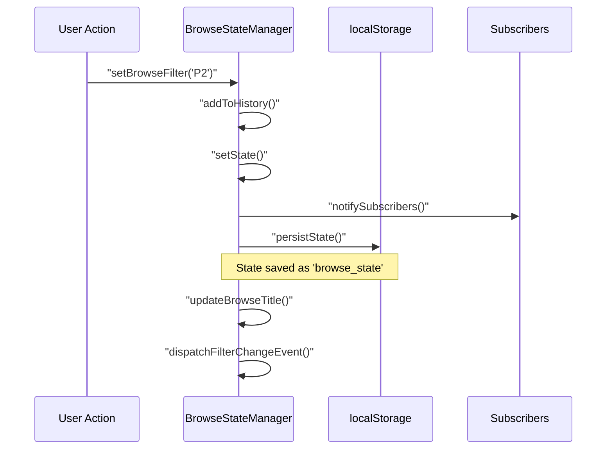
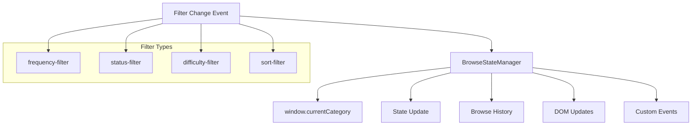
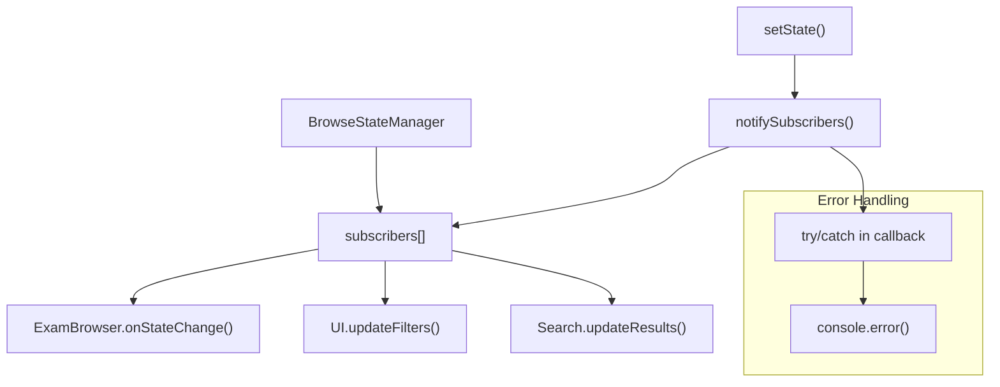
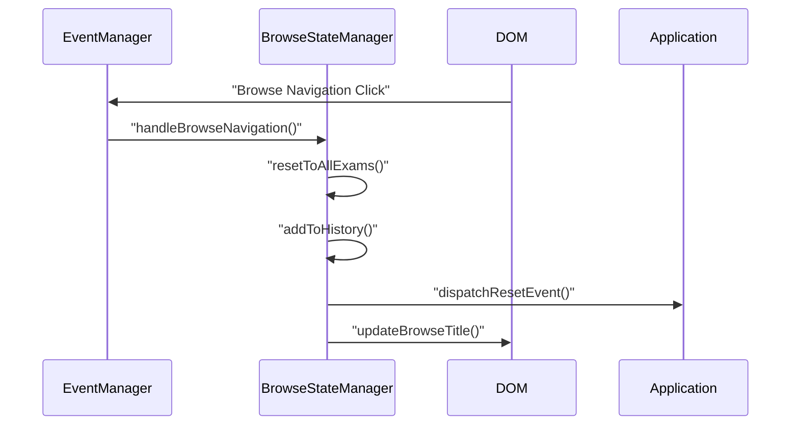
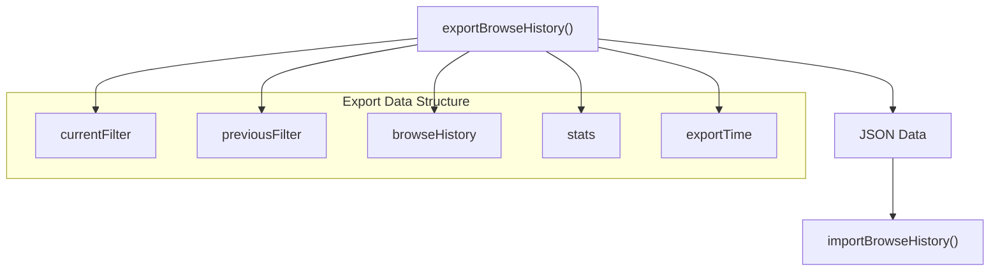

# Browse State Management

> **Relevant source files**
> * [index.html](https://github.com/sallowayma-git/IELTS-practice/blob/db0f538c/index.html)
> * [js/components/BrowseStateManager.js](https://github.com/sallowayma-git/IELTS-practice/blob/db0f538c/js/components/BrowseStateManager.js)
> * [js/components/EventManager.js](https://github.com/sallowayma-git/IELTS-practice/blob/db0f538c/js/components/EventManager.js)
> * [js/components/ExamBrowserRecovery.js](https://github.com/sallowayma-git/IELTS-practice/blob/db0f538c/js/components/ExamBrowserRecovery.js)

This page documents the `BrowseStateManager` component that handles navigation state, filter persistence, browsing history, and state synchronization across the IELTS practice application. This system ensures that user browsing preferences, search filters, and navigation context are maintained and can be restored across sessions.

For information about event coordination across the application, see [Event Management System](/sallowayma-git/IELTS-practice/5.1-event-management-system). For error recovery mechanisms, see [Error Recovery & Resilience](/sallowayma-git/IELTS-practice/5.2-error-recovery-and-resilience).

## Core Architecture

The Browse State Management system is implemented as a centralized state manager that coordinates with other application components through an event-driven architecture.

### Component Overview



**State Management Architecture**

Sources: [js/components/BrowseStateManager.js L1-L535](https://github.com/sallowayma-git/IELTS-practice/blob/db0f538c/js/components/BrowseStateManager.js#L1-L535)

### Core State Structure

The `BrowseStateManager` maintains a comprehensive state object that includes:

| State Property | Type | Description |
| --- | --- | --- |
| `currentCategory` | string/null | Active exam category filter |
| `currentFrequency` | string/null | Active frequency filter |
| `viewMode` | string | Display mode ('grid' or 'list') |
| `sortBy` | string | Sort criteria ('title', 'date', etc.) |
| `sortOrder` | string | Sort direction ('asc' or 'desc') |
| `filters` | object | Complex filter object with multiple criteria |
| `searchQuery` | string | Current search text |
| `pagination` | object | Page number, size, and total count |

Sources: [js/components/BrowseStateManager.js L12-L29](https://github.com/sallowayma-git/IELTS-practice/blob/db0f538c/js/components/BrowseStateManager.js#L12-L29)

## State Persistence System

The Browse State Manager implements a robust persistence mechanism that maintains user preferences across browser sessions.

### Persistence Flow Diagram



**State Persistence Sequence**

Sources: [js/components/BrowseStateManager.js L191-L206](https://github.com/sallowayma-git/IELTS-practice/blob/db0f538c/js/components/BrowseStateManager.js#L191-L206)

 [js/components/BrowseStateManager.js L136-L158](https://github.com/sallowayma-git/IELTS-practice/blob/db0f538c/js/components/BrowseStateManager.js#L136-L158)

### Data Structure in localStorage

The system persists state data in the `browse_state` localStorage key with the following structure:

```yaml
{
  currentFilter: "P2",
  previousFilter: "all", 
  state: {
    currentCategory: "P2",
    filters: { frequency: "all", status: "all", difficulty: "all" },
    viewMode: "grid",
    sortBy: "title",
    sortOrder: "asc",
    searchQuery: "",
    pagination: { page: 1, pageSize: 20, total: 0 }
  },
  browseHistory: [...],
  timestamp: 1703123456789
}
```

Sources: [js/components/BrowseStateManager.js L193-L201](https://github.com/sallowayma-git/IELTS-practice/blob/db0f538c/js/components/BrowseStateManager.js#L193-L201)

## Filter and Navigation Management

### Filter Management System



**Filter Management Flow**

Sources: [js/components/BrowseStateManager.js L96-L132](https://github.com/sallowayma-git/IELTS-practice/blob/db0f538c/js/components/BrowseStateManager.js#L96-L132)

### Navigation History Tracking

The system maintains a detailed history of user navigation actions:

| History Item Properties | Description |
| --- | --- |
| `action` | Type of action ('filter_change', 'navigate_to_browse', 'reset_to_all') |
| `from` | Previous filter state |
| `to` | New filter state |
| `timestamp` | When the action occurred |
| `previousState` | Complete previous state snapshot |
| `newState` | Complete new state snapshot |

Sources: [js/components/BrowseStateManager.js L361-L369](https://github.com/sallowayma-git/IELTS-practice/blob/db0f538c/js/components/BrowseStateManager.js#L361-L369)

 [js/components/BrowseStateManager.js L136-L148](https://github.com/sallowayma-git/IELTS-practice/blob/db0f538c/js/components/BrowseStateManager.js#L136-L148)

## Event Integration and Subscribers

### Subscription Pattern Implementation



**Subscriber Pattern Architecture**

Sources: [js/components/BrowseStateManager.js L162-L186](https://github.com/sallowayma-git/IELTS-practice/blob/db0f538c/js/components/BrowseStateManager.js#L162-L186)

### Integration with EventManager

The `BrowseStateManager` integrates closely with the `EventManager` component:



**EventManager Integration**

Sources: [js/components/EventManager.js L397-L406](https://github.com/sallowayma-git/IELTS-practice/blob/db0f538c/js/components/EventManager.js#L397-L406)

 [js/components/BrowseStateManager.js L80-L92](https://github.com/sallowayma-git/IELTS-practice/blob/db0f538c/js/components/BrowseStateManager.js#L80-L92)

## Recovery and Fallback Mechanisms

### State Recovery System

The `BrowseStateManager` includes several recovery mechanisms:

| Recovery Method | Trigger | Action |
| --- | --- | --- |
| `resetToDefaults()` | Parse error in `restorePersistentState()` | Reset to initial state values |
| `resetToAllExams()` | Navigation to browse view | Clear filters and show all exams |
| `restorePersistentState()` | Component initialization | Load saved state from localStorage |

Sources: [js/components/BrowseStateManager.js L241-L263](https://github.com/sallowayma-git/IELTS-practice/blob/db0f538c/js/components/BrowseStateManager.js#L241-L263)

 [js/components/BrowseStateManager.js L211-L236](https://github.com/sallowayma-git/IELTS-practice/blob/db0f538c/js/components/BrowseStateManager.js#L211-L236)

### Default State Configuration

```yaml
// Default state structure
{
  currentCategory: null,
  currentFrequency: null,
  viewMode: 'grid',
  sortBy: 'title', 
  sortOrder: 'asc',
  filters: {
    frequency: 'all',
    status: 'all', 
    difficulty: 'all'
  },
  searchQuery: '',
  pagination: {
    page: 1,
    pageSize: 20,
    total: 0
  }
}
```

Sources: [js/components/BrowseStateManager.js L245-L262](https://github.com/sallowayma-git/IELTS-practice/blob/db0f538c/js/components/BrowseStateManager.js#L245-L262)

## API and Public Methods

### Core State Management Methods

| Method | Parameters | Description |
| --- | --- | --- |
| `setBrowseFilter(filter)` | filter: string | Sets the current browse filter and updates state |
| `setState(newState)` | newState: object | Updates state and notifies subscribers |
| `getState()` | none | Returns current state copy |
| `resetToAllExams()` | none | Resets to show all exams |
| `subscribe(callback)` | callback: function | Adds subscriber, returns unsubscribe function |

Sources: [js/components/BrowseStateManager.js L96-L132](https://github.com/sallowayma-git/IELTS-practice/blob/db0f538c/js/components/BrowseStateManager.js#L96-L132)

 [js/components/BrowseStateManager.js L136-L158](https://github.com/sallowayma-git/IELTS-practice/blob/db0f538c/js/components/BrowseStateManager.js#L136-L158)

 [js/components/BrowseStateManager.js L162-L173](https://github.com/sallowayma-git/IELTS-practice/blob/db0f538c/js/components/BrowseStateManager.js#L162-L173)

### History and Navigation Methods

| Method | Parameters | Description |
| --- | --- | --- |
| `getBrowseHistory()` | none | Returns copy of browse history array |
| `canGoBack()` | none | Checks if previous state exists |
| `goBack()` | none | Returns to previous filter state |
| `clearBrowseHistory()` | none | Clears all history records |

Sources: [js/components/BrowseStateManager.js L395-L420](https://github.com/sallowayma-git/IELTS-practice/blob/db0f538c/js/components/BrowseStateManager.js#L395-L420)

### Data Export and Import



**Data Export/Import System**

Sources: [js/components/BrowseStateManager.js L499-L531](https://github.com/sallowayma-git/IELTS-practice/blob/db0f538c/js/components/BrowseStateManager.js#L499-L531)

The Browse State Management system provides comprehensive state persistence, navigation history tracking, and seamless integration with the broader IELTS practice application architecture through its event-driven design and robust recovery mechanisms.