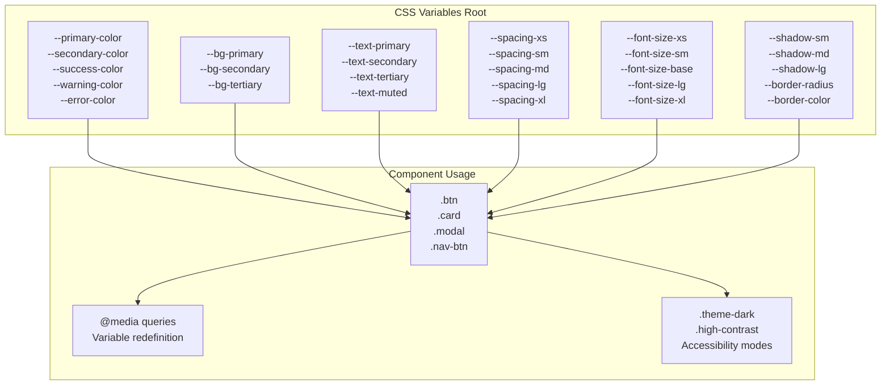
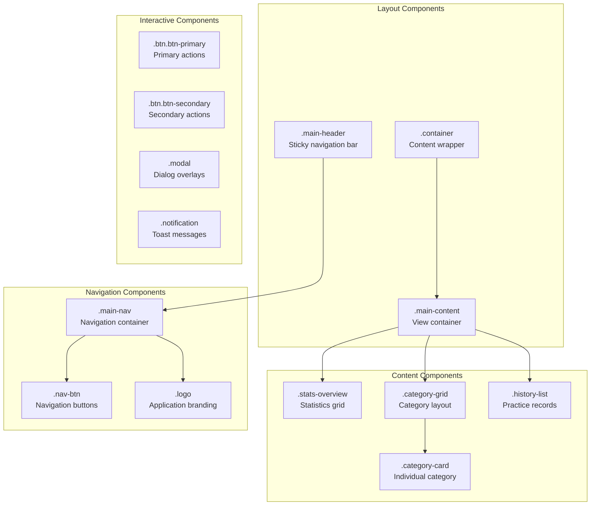
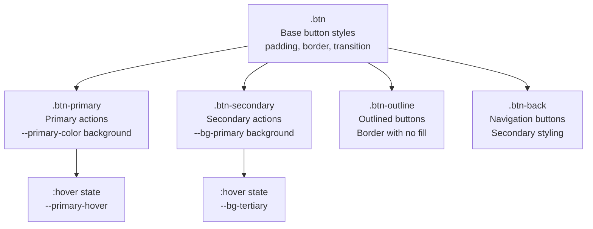
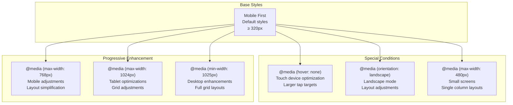
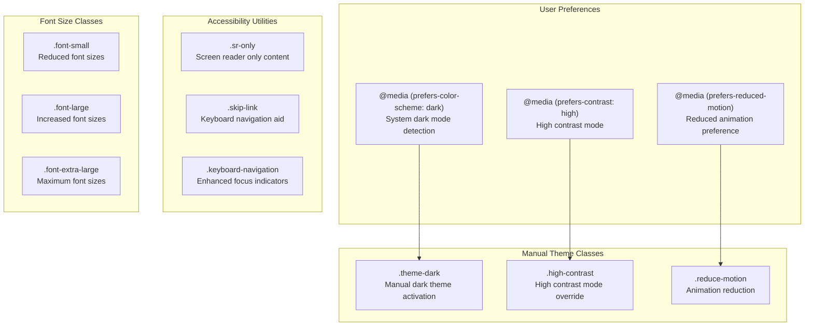
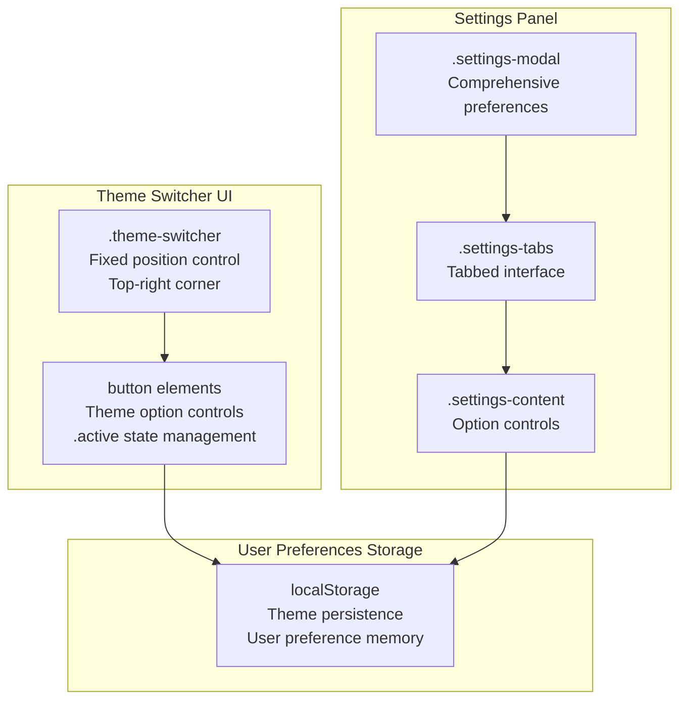

# CSS Architecture & Theming

> **Relevant source files**
> * [css/styles.css](https://github.com/sallowayma-git/IELTS-practice/blob/db0f538c/css/styles.css)
> * [js/components/practiceHistory.js](https://github.com/sallowayma-git/IELTS-practice/blob/db0f538c/js/components/practiceHistory.js)

This document covers the comprehensive CSS architecture and theming system used throughout the IELTS Reading Practice System. The CSS framework provides consistent styling, responsive design, theme switching, and accessibility features across all components.

For information about the practice history component's specific styling implementation, see [Practice History Component](/sallowayma-git/IELTS-practice/4.2-practice-history-component). For details about the overall UI structure and presentation layer, see [User Interface & Styling](/sallowayma-git/IELTS-practice/4-user-interface-and-styling).

## CSS Variable System

The foundation of the theming system is built on CSS custom properties (CSS variables) that provide consistent colors, spacing, typography, and other design tokens across the entire application.

### Design Token Architecture



Sources: [css/styles.css L2-L49](https://github.com/sallowayma-git/IELTS-practice/blob/db0f538c/css/styles.css#L2-L49)

The CSS variable system is defined in the `:root` selector and provides semantic color meanings, consistent spacing scales, and typography hierarchies. Variables use descriptive names that indicate their semantic purpose rather than their visual appearance.

### Color System

The color palette follows semantic naming conventions:

| Variable | Purpose | Light Theme | Dark Theme Override |
| --- | --- | --- | --- |
| `--primary-color` | Primary actions, links | #3b82f6 | Unchanged |
| `--bg-primary` | Main background | #ffffff | #1f2937 |
| `--text-primary` | Main text | #1f2937 | #f9fafb |
| `--success-color` | Success states | #10b981 | Unchanged |
| `--error-color` | Error states | #ef4444 | Unchanged |

Sources: [css/styles.css L3-L24](https://github.com/sallowayma-git/IELTS-practice/blob/db0f538c/css/styles.css#L3-L24)

 [css/styles.css L672-L682](https://github.com/sallowayma-git/IELTS-practice/blob/db0f538c/css/styles.css#L672-L682)

## Component Architecture

The CSS architecture follows a component-based approach where each UI element has dedicated styles that leverage the CSS variable system.

### Component Hierarchy



Sources: [css/styles.css L71-L140](https://github.com/sallowayma-git/IELTS-practice/blob/db0f538c/css/styles.css#L71-L140)

 [css/styles.css L241-L287](https://github.com/sallowayma-git/IELTS-practice/blob/db0f538c/css/styles.css#L241-L287)

### Button System

The button system provides consistent styling across different button types:



Sources: [css/styles.css L241-L287](https://github.com/sallowayma-git/IELTS-practice/blob/db0f538c/css/styles.css#L241-L287)

## Responsive Design System

The responsive design system uses a mobile-first approach with progressive enhancement through media queries targeting specific device categories and capabilities.

### Breakpoint Strategy



Sources: [css/styles.css L374-L638](https://github.com/sallowayma-git/IELTS-practice/blob/db0f538c/css/styles.css#L374-L638)

### Grid System Responsive Behavior

The grid layouts adapt based on screen size:

| Screen Size | Category Grid | Stats Overview | Navigation |
| --- | --- | --- | --- |
| Desktop (>1024px) | `repeat(auto-fit, minmax(320px, 1fr))` | 4 columns | Horizontal |
| Tablet (768-1024px) | `repeat(2, 1fr)` | 4 columns | Horizontal |
| Mobile (≤768px) | `1fr` | 2 columns | Vertical stack |
| Small Mobile (≤480px) | `1fr` | 1 column | Vertical stack |

Sources: [css/styles.css L392-L596](https://github.com/sallowayma-git/IELTS-practice/blob/db0f538c/css/styles.css#L392-L596)

## Theming and Accessibility

The theming system supports multiple accessibility modes and user preferences through CSS media queries and class-based overrides.

### Theme System Architecture



Sources: [css/styles.css L647-L826](https://github.com/sallowayma-git/IELTS-practice/blob/db0f538c/css/styles.css#L647-L826)

### Dark Theme Implementation

The dark theme overrides specific CSS variables while maintaining the same component structure:

```css
@media (prefers-color-scheme: dark) {
    :root {
        --bg-primary: #1f2937;
        --bg-secondary: #111827;
        --bg-tertiary: #374151;
        --text-primary: #f9fafb;
        --text-secondary: #d1d5db;
        --border-color: #374151;
    }
}
```

Sources: [css/styles.css L672-L682](https://github.com/sallowayma-git/IELTS-practice/blob/db0f538c/css/styles.css#L672-L682)

### Accessibility Features

The system includes comprehensive accessibility support:

| Feature | Implementation | Purpose |
| --- | --- | --- |
| Screen Reader Support | `.sr-only` class | Content for screen readers only |
| Skip Links | `.skip-link` class | Keyboard navigation shortcuts |
| Focus Indicators | Enhanced `:focus` styles | Visible keyboard navigation |
| High Contrast | `.high-contrast` overrides | Improved visibility |
| Reduced Motion | `.reduce-motion` overrides | Animation sensitivity |

Sources: [css/styles.css L780-L826](https://github.com/sallowayma-git/IELTS-practice/blob/db0f538c/css/styles.css#L780-L826)

## Theme Switching Infrastructure

The application includes a theme switcher component that allows users to manually control theming options.

### Theme Switcher Component



Sources: [css/styles.css L827-L861](https://github.com/sallowayma-git/IELTS-practice/blob/db0f538c/css/styles.css#L827-L861)

 [css/styles.css L863-L900](https://github.com/sallowayma-git/IELTS-practice/blob/db0f538c/css/styles.css#L863-L900)

### Settings Panel Layout

The settings panel provides comprehensive control over appearance and accessibility options:

* **Appearance Tab**: Theme selection, color preferences
* **Accessibility Tab**: Font size, motion reduction, high contrast
* **System Tab**: System information and diagnostics

Sources: [css/styles.css L1505-L1695](https://github.com/sallowayma-git/IELTS-practice/blob/db0f538c/css/styles.css#L1505-L1695)

The CSS architecture provides a robust foundation for the entire application's visual presentation, with careful attention to maintainability, accessibility, and user experience across all devices and user preferences.