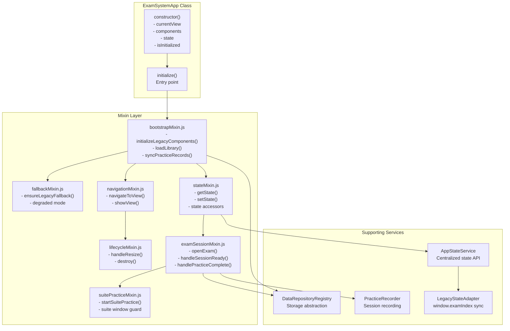
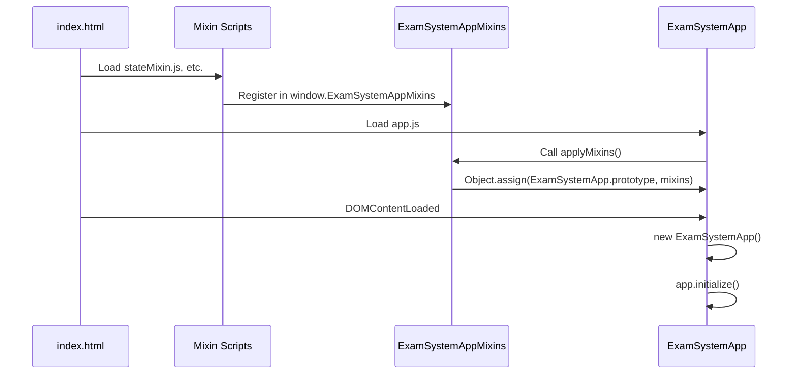
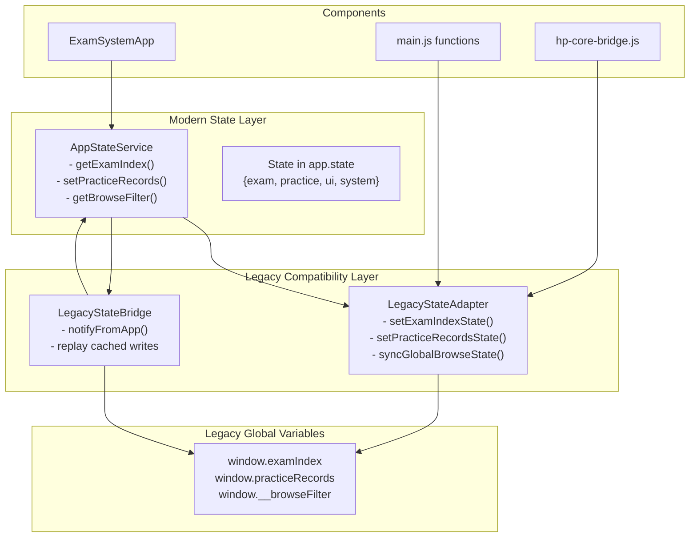
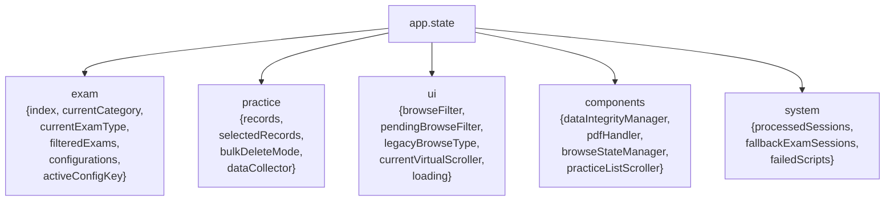
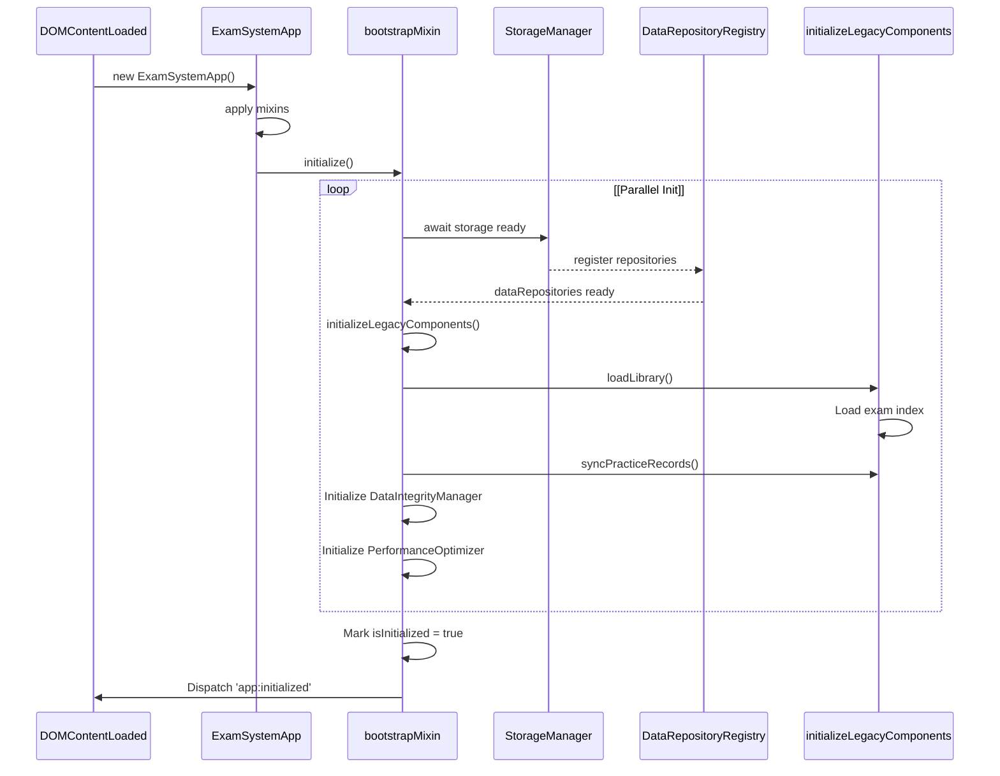
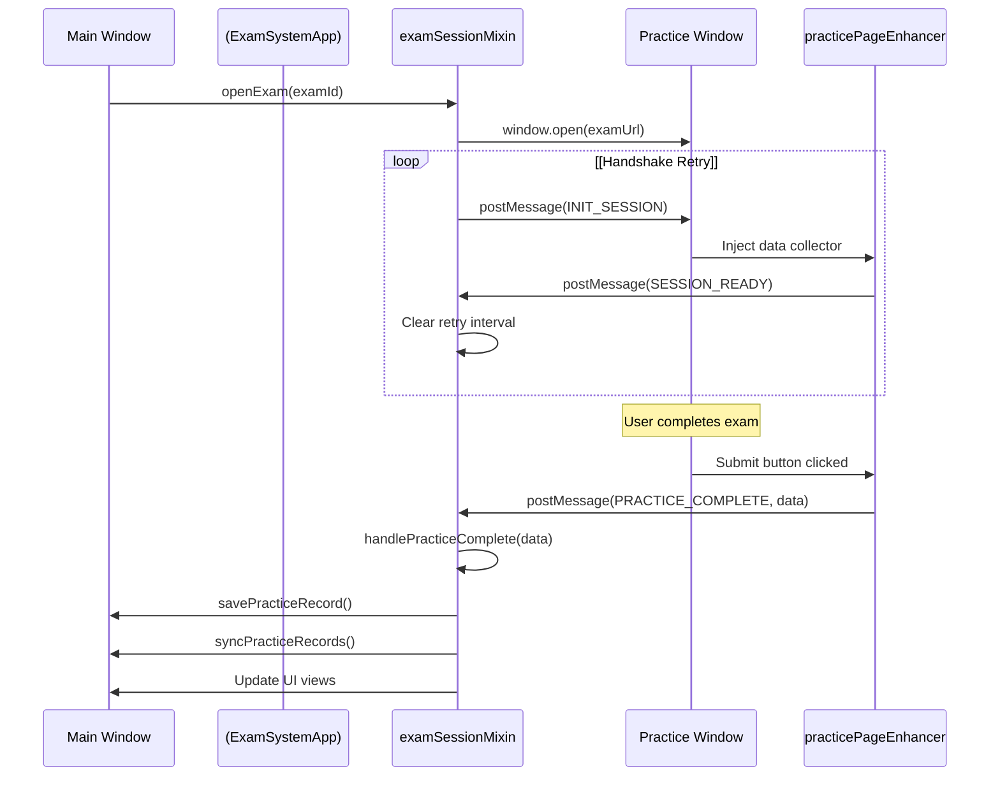
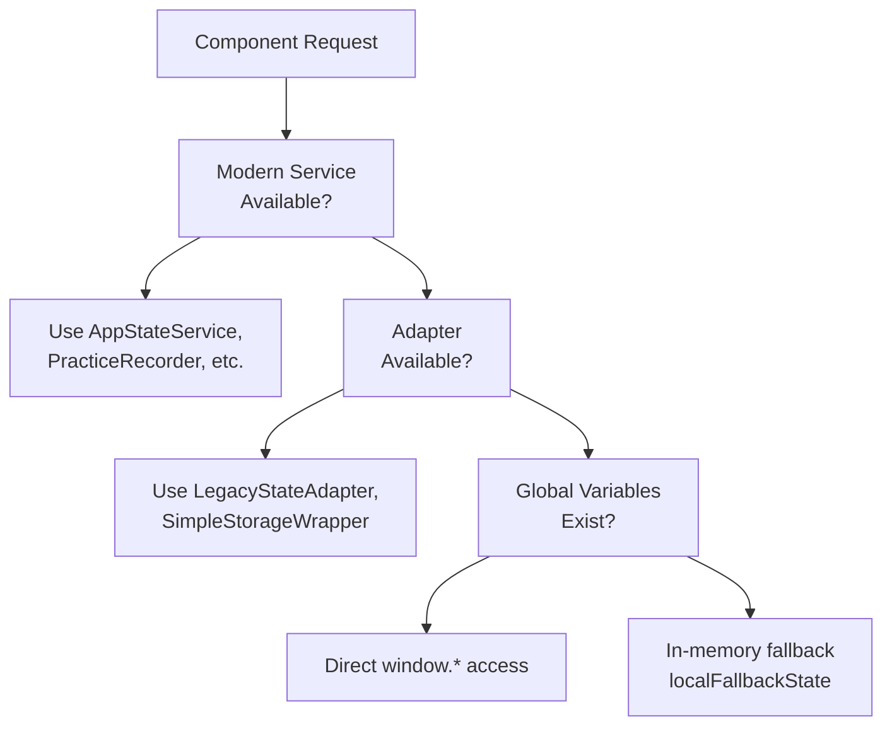

# Core Application Architecture

> **Relevant source files**
> * [css/main.css](https://github.com/sallowayma-git/IELTS-practice/blob/df0c9b8f/css/main.css)
> * [developer/docs/10-06 log.md](https://github.com/sallowayma-git/IELTS-practice/blob/df0c9b8f/developer/docs/10-06 log.md)
> * [developer/docs/optimization-task-tracker.md](https://github.com/sallowayma-git/IELTS-practice/blob/df0c9b8f/developer/docs/optimization-task-tracker.md)
> * [developer/tests/js/e2e/appE2ETest.js](https://github.com/sallowayma-git/IELTS-practice/blob/df0c9b8f/developer/tests/js/e2e/appE2ETest.js)
> * [index.html](https://github.com/sallowayma-git/IELTS-practice/blob/df0c9b8f/index.html)
> * [js/app.js](https://github.com/sallowayma-git/IELTS-practice/blob/df0c9b8f/js/app.js)
> * [js/components/practiceHistoryEnhancer.js](https://github.com/sallowayma-git/IELTS-practice/blob/df0c9b8f/js/components/practiceHistoryEnhancer.js)
> * [js/core/goalManager.js](https://github.com/sallowayma-git/IELTS-practice/blob/df0c9b8f/js/core/goalManager.js)
> * [js/main.js](https://github.com/sallowayma-git/IELTS-practice/blob/df0c9b8f/js/main.js)
> * [js/utils/dom.js](https://github.com/sallowayma-git/IELTS-practice/blob/df0c9b8f/js/utils/dom.js)

## Purpose and Scope

This document describes the architectural design of the IELTS Practice System's core application layer, including the central orchestrator (`ExamSystemApp`), composition patterns, state management, and view coordination.

For initialization details and bootstrap sequence, see [Application Initialization & Bootstrap](/sallowayma-git/IELTS-practice/3.2-application-initialization-and-bootstrap). For state persistence and data access patterns, see [Data Management System](/sallowayma-git/IELTS-practice/4-data-management-system). For UI rendering and navigation specifics, see [View Management & Navigation](/sallowayma-git/IELTS-practice/3.3-view-management-and-navigation).

**Sources:** [js/app.js L1-L120](https://github.com/sallowayma-git/IELTS-practice/blob/df0c9b8f/js/app.js#L1-L120)

 [js/main.js L1-L440](https://github.com/sallowayma-git/IELTS-practice/blob/df0c9b8f/js/main.js#L1-L440)

 [index.html L1-L408](https://github.com/sallowayma-git/IELTS-practice/blob/df0c9b8f/index.html#L1-L408)

---

## Application Structure Overview

The application follows a **mixin-based composition architecture** centered around `ExamSystemApp`, which delegates specific responsibilities to composable modules. This design enables progressive refactoring while maintaining backward compatibility with legacy code.

### Core Components

| Component | Location | Responsibility |
| --- | --- | --- |
| `ExamSystemApp` | [js/app.js L6-L62](https://github.com/sallowayma-git/IELTS-practice/blob/df0c9b8f/js/app.js#L6-L62) | Central orchestrator, owns application lifecycle |
| State Mixins | [js/app/stateMixin.js L1-L220](https://github.com/sallowayma-git/IELTS-practice/blob/df0c9b8f/js/app/stateMixin.js#L1-L220) | State accessors and mutations |
| Bootstrap Mixin | [js/app/bootstrapMixin.js L1-L400](https://github.com/sallowayma-git/IELTS-practice/blob/df0c9b8f/js/app/bootstrapMixin.js#L1-L400) | Initialization and component loading |
| Navigation Mixin | [js/app/navigationMixin.js L1-L220](https://github.com/sallowayma-git/IELTS-practice/blob/df0c9b8f/js/app/navigationMixin.js#L1-L220) | View routing and navigation |
| Exam Session Mixin | [js/app/examSessionMixin.js L1-L868](https://github.com/sallowayma-git/IELTS-practice/blob/df0c9b8f/js/app/examSessionMixin.js#L1-L868) | Cross-window exam session management |
| Suite Practice Mixin | [js/app/suitePracticeMixin.js](https://github.com/sallowayma-git/IELTS-practice/blob/df0c9b8f/js/app/suitePracticeMixin.js) | Multi-exam session orchestration |
| Fallback Mixin | [js/app/fallbackMixin.js](https://github.com/sallowayma-git/IELTS-practice/blob/df0c9b8f/js/app/fallbackMixin.js) | Legacy compatibility and degraded-mode handling |

**Sources:** [js/app.js L64-L81](https://github.com/sallowayma-git/IELTS-practice/blob/df0c9b8f/js/app.js#L64-L81)

 [index.html L397-L404](https://github.com/sallowayma-git/IELTS-practice/blob/df0c9b8f/index.html#L397-L404)

 [developer/docs/optimization-task-tracker.md L196-L252](https://github.com/sallowayma-git/IELTS-practice/blob/df0c9b8f/developer/docs/optimization-task-tracker.md#L196-L252)

---

## Application Class and Mixin Composition

The following diagram shows how `ExamSystemApp` is assembled from mixins and integrates with supporting services:



**Sources:** [js/app.js L6-L81](https://github.com/sallowayma-git/IELTS-practice/blob/df0c9b8f/js/app.js#L6-L81)

 [js/app/stateMixin.js](https://github.com/sallowayma-git/IELTS-practice/blob/df0c9b8f/js/app/stateMixin.js)

 [js/app/bootstrapMixin.js](https://github.com/sallowayma-git/IELTS-practice/blob/df0c9b8f/js/app/bootstrapMixin.js)

 [js/app/navigationMixin.js](https://github.com/sallowayma-git/IELTS-practice/blob/df0c9b8f/js/app/navigationMixin.js)

 [js/app/examSessionMixin.js](https://github.com/sallowayma-git/IELTS-practice/blob/df0c9b8f/js/app/examSessionMixin.js)

 [js/app/suitePracticeMixin.js](https://github.com/sallowayma-git/IELTS-practice/blob/df0c9b8f/js/app/suitePracticeMixin.js)

---

## Mixin Application Mechanism

Mixins are applied using `Object.assign` to copy methods onto `ExamSystemApp.prototype`:



The glue function `applyMixins` merges all registered mixins:

[js/app.js L64-L81](https://github.com/sallowayma-git/IELTS-practice/blob/df0c9b8f/js/app.js#L64-L81)

```javascript
function applyMixins() {
    const mixins = global.ExamSystemAppMixins || {};
    Object.assign(ExamSystemApp.prototype,
        mixins.state || {},
        mixins.bootstrap || {},
        mixins.lifecycle || {},
        mixins.navigation || {},
        mixins.examSession || {},
        mixins.suitePractice || {},
        mixins.fallback || {});
}
```

This enables legacy environments (no bundler) to compose functionality while maintaining clear module boundaries.

**Sources:** [js/app.js L64-L81](https://github.com/sallowayma-git/IELTS-practice/blob/df0c9b8f/js/app.js#L64-L81)

 [index.html L397-L404](https://github.com/sallowayma-git/IELTS-practice/blob/df0c9b8f/index.html#L397-L404)

 [developer/docs/optimization-task-tracker.md L196-L229](https://github.com/sallowayma-git/IELTS-practice/blob/df0c9b8f/developer/docs/optimization-task-tracker.md#L196-L229)

---

## State Management Architecture

The application maintains a **dual-layer state system** to bridge modern component-based design with legacy global variables:



### State Service Resolution

The `stateService` in [js/main.js L48-L59](https://github.com/sallowayma-git/IELTS-practice/blob/df0c9b8f/js/main.js#L48-L59)

 demonstrates the resolution logic:

```javascript
const stateService = (function resolveStateService() {
    if (window.appStateService && typeof window.appStateService.getExamIndex === 'function') {
        return window.appStateService;
    }
    if (window.AppStateService && typeof window.AppStateService.getInstance === 'function') {
        return window.AppStateService.getInstance({
            legacyAdapter: legacyStateAdapter,
            onBrowseFilterChange: syncGlobalBrowseState
        });
    }
    return null;
})();
```

When `stateService` is available, all state operations go through the unified API. When unavailable, legacy code falls back to direct global variable access with local in-memory state.

**Sources:** [js/app/state-service.js L1-L314](https://github.com/sallowayma-git/IELTS-practice/blob/df0c9b8f/js/app/state-service.js#L1-L314)

 [js/utils/legacyStateAdapter.js L1-L142](https://github.com/sallowayma-git/IELTS-practice/blob/df0c9b8f/js/utils/legacyStateAdapter.js#L1-L142)

 [js/core/legacyStateBridge.js L1-L240](https://github.com/sallowayma-git/IELTS-practice/blob/df0c9b8f/js/core/legacyStateBridge.js#L1-L240)

 [js/main.js L42-L193](https://github.com/sallowayma-git/IELTS-practice/blob/df0c9b8f/js/main.js#L42-L193)

---

## Application State Structure

The `ExamSystemApp.state` object consolidates all application state:



Mixins access this state through helper methods:

* `getState(path)` - Read nested state properties (e.g., `'exam.index'`)
* `setState(path, value)` - Update state and trigger side effects

**Sources:** [js/app.js L13-L56](https://github.com/sallowayma-git/IELTS-practice/blob/df0c9b8f/js/app.js#L13-L56)

 [js/app/stateMixin.js](https://github.com/sallowayma-git/IELTS-practice/blob/df0c9b8f/js/app/stateMixin.js)

---

## View Management System

Views are managed through a declarative navigation system that coordinates DOM visibility and URL state:

```mermaid
sequenceDiagram
  participant User
  participant Navigation Button
  participant navigationMixin
  participant DOM Tree
  participant Legacy showView()

  User->>Navigation Button: Click [data-view="browse"]
  Navigation Button->>navigationMixin: navigateToView('browse')
  navigationMixin->>navigationMixin: Check if view exists
  loop [Modern Navigation]
    navigationMixin->>DOM Tree: Hide .view.active
    navigationMixin->>DOM Tree: Show
    navigationMixin->>DOM Tree: Update .nav-btn.active
    navigationMixin->>navigationMixin: Update app.currentView
    navigationMixin->>Legacy showView(): showView('browse')
    Legacy showView()->>DOM Tree: Legacy visibility toggle
  end
  navigationMixin->>navigationMixin: Trigger 'viewChanged' event
```

### Navigation Registration

Navigation buttons are registered through `data-view` attributes:

[index.html L22-L27](https://github.com/sallowayma-git/IELTS-practice/blob/df0c9b8f/index.html#L22-L27)

```xml
<nav class="main-nav" data-nav-controller="legacy">
    <button class="nav-btn active" type="button" data-view="overview">📊 总览</button>
    <button class="nav-btn" type="button" data-view="browse">📚 题库浏览</button>
    <button class="nav-btn" type="button" data-view="practice">📝 练习记录</button>
    <button class="nav-btn" type="button" data-view="settings">⚙️ 设置</button>
</nav>
```

Event delegation in `NavigationController` (or fallback `ensureLegacyNavigation`) handles clicks:

[js/main.js L225-L252](https://github.com/sallowayma-git/IELTS-practice/blob/df0c9b8f/js/main.js#L225-L252)

**Sources:** [js/app/navigationMixin.js L1-L220](https://github.com/sallowayma-git/IELTS-practice/blob/df0c9b8f/js/app/navigationMixin.js#L1-L220)

 [js/main.js L225-L252](https://github.com/sallowayma-git/IELTS-practice/blob/df0c9b8f/js/main.js#L225-L252)

 [js/presentation/navigation-controller.js](https://github.com/sallowayma-git/IELTS-practice/blob/df0c9b8f/js/presentation/navigation-controller.js)

 [index.html L22-L27](https://github.com/sallowayma-git/IELTS-practice/blob/df0c9b8f/index.html#L22-L27)

---

## Component Lifecycle and Initialization

The initialization sequence coordinates multiple async systems with retry and fallback logic:



### Key Initialization Functions

| Function | Location | Responsibility |
| --- | --- | --- |
| `ExamSystemApp.initialize()` | [js/app/bootstrapMixin.js](https://github.com/sallowayma-git/IELTS-practice/blob/df0c9b8f/js/app/bootstrapMixin.js) | Entry point, orchestrates all init |
| `initializeLegacyComponents()` | [js/main.js L255-L323](https://github.com/sallowayma-git/IELTS-practice/blob/df0c9b8f/js/main.js#L255-L323) | Setup legacy UI components |
| `loadLibrary()` | [js/main.js L552-L608](https://github.com/sallowayma-git/IELTS-practice/blob/df0c9b8f/js/main.js#L552-L608) | Load exam index from cache or scripts |
| `syncPracticeRecords()` | [js/main.js L341-L443](https://github.com/sallowayma-git/IELTS-practice/blob/df0c9b8f/js/main.js#L341-L443) | Load practice history |
| `setupMessageListener()` | [js/main.js L445-L485](https://github.com/sallowayma-git/IELTS-practice/blob/df0c9b8f/js/main.js#L445-L485) | Register cross-window message handler |

The system uses polling with exponential backoff when dependencies aren't ready:

[js/data/index.js L15-L89](https://github.com/sallowayma-git/IELTS-practice/blob/df0c9b8f/js/data/index.js#L15-L89)

 - Polls for `window.storage` availability before creating repositories

**Sources:** [js/app/bootstrapMixin.js](https://github.com/sallowayma-git/IELTS-practice/blob/df0c9b8f/js/app/bootstrapMixin.js)

 [js/main.js L255-L608](https://github.com/sallowayma-git/IELTS-practice/blob/df0c9b8f/js/main.js#L255-L608)

 [js/data/index.js L15-L89](https://github.com/sallowayma-git/IELTS-practice/blob/df0c9b8f/js/data/index.js#L15-L89)

 [developer/tests/js/e2e/appE2ETest.js L164-L184](https://github.com/sallowayma-git/IELTS-practice/blob/df0c9b8f/developer/tests/js/e2e/appE2ETest.js#L164-L184)

---

## Cross-Window Communication Protocol

Practice sessions occur in child windows and communicate via `postMessage`:



### Message Types

| Message Type | Direction | Payload | Handler |
| --- | --- | --- | --- |
| `INIT_SESSION` | Main → Child | `{sessionId, examId, metadata}` | practicePageEnhancer |
| `SESSION_READY` | Child → Main | `{sessionId}` | [js/app/examSessionMixin.js L786-L826](https://github.com/sallowayma-git/IELTS-practice/blob/df0c9b8f/js/app/examSessionMixin.js#L786-L826) |
| `PRACTICE_COMPLETE` | Child → Main | `{answers, duration, score}` | [js/app/examSessionMixin.js L828-L868](https://github.com/sallowayma-git/IELTS-practice/blob/df0c9b8f/js/app/examSessionMixin.js#L828-L868) |

The handshake uses repeated `INIT_SESSION` messages (every 100ms) until `SESSION_READY` is received, handling race conditions when the child window loads slowly.

**Sources:** [js/app/examSessionMixin.js L1-L868](https://github.com/sallowayma-git/IELTS-practice/blob/df0c9b8f/js/app/examSessionMixin.js#L1-L868)

 [js/practice-page-enhancer.js L1-L1200](https://github.com/sallowayma-git/IELTS-practice/blob/df0c9b8f/js/practice-page-enhancer.js#L1-L1200)

 [js/main.js L445-L485](https://github.com/sallowayma-git/IELTS-practice/blob/df0c9b8f/js/main.js#L445-L485)

---

## DOM Manipulation and Event System

The application uses a **unified DOM utility layer** to avoid direct `innerHTML` and scattered `addEventListener` calls:

### DOM Builder Pattern

[js/utils/dom.js L87-L242](https://github.com/sallowayma-git/IELTS-practice/blob/df0c9b8f/js/utils/dom.js#L87-L242)

 provides:

* `DOMBuilder.create(tag, attributes, children)` - Construct elements without string templates
* `DOMBuilder.replaceContent(container, content)` - Safe innerHTML replacement
* `DOMBuilder.createFragment(items, factory)` - Batch DOM construction

Example from overview rendering:

```javascript
// Before (legacy innerHTML):
container.innerHTML = `<div class="card">${data}</div>`;

// After (DOM builder):
const card = DOM.create('div', { className: 'card' }, [contentNode]);
DOM.replaceContent(container, [card]);
```

### Event Delegation

[js/utils/dom.js L10-L82](https://github.com/sallowayma-git/IELTS-practice/blob/df0c9b8f/js/utils/dom.js#L10-L82)

 implements global event delegation:

```javascript
DOM.delegate('click', '.exam-item-action-btn', function(event) {
    const examId = this.dataset.examId;
    openExam(examId);
});
```

This replaces per-element `addEventListener` calls, reducing memory overhead and eliminating the need for manual cleanup.

**Sources:** [js/utils/dom.js L1-L448](https://github.com/sallowayma-git/IELTS-practice/blob/df0c9b8f/js/utils/dom.js#L1-L448)

 [developer/docs/10-06 L38-L215](https://github.com/sallowayma-git/IELTS-practice/blob/df0c9b8f/developer/docs/10-06 log.md#L38-L215)

---

## Fallback and Compatibility Layer

The application maintains **defensive fallback paths** for legacy code and degraded environments:

### Fallback Hierarchy



### State Access Fallback Example

[js/main.js L65-L79](https://github.com/sallowayma-git/IELTS-practice/blob/df0c9b8f/js/main.js#L65-L79)

 demonstrates the pattern:

```javascript
function getExamIndexState() {
    if (stateService) {
        return stateService.getExamIndex();
    }
    return Array.isArray(window.examIndex) ? window.examIndex : [];
}
```

All state access functions follow this pattern, allowing gradual migration from global variables to the centralized state service.

### Legacy Component Instantiation

[js/main.js L206-L223](https://github.com/sallowayma-git/IELTS-practice/blob/df0c9b8f/js/main.js#L206-L223)

 shows fallback creation:

```javascript
function ensureExamListView() {
    if (!examListViewInstance && window.LegacyExamListView) {
        examListViewInstance = new window.LegacyExamListView({
            domAdapter: window.DOMAdapter,
            containerId: 'exam-list-container'
        });
    }
    return examListViewInstance;
}
```

**Sources:** [js/main.js L42-L252](https://github.com/sallowayma-git/IELTS-practice/blob/df0c9b8f/js/main.js#L42-L252)

 [js/app/fallbackMixin.js](https://github.com/sallowayma-git/IELTS-practice/blob/df0c9b8f/js/app/fallbackMixin.js)

 [js/boot-fallbacks.js L1-L521](https://github.com/sallowayma-git/IELTS-practice/blob/df0c9b8f/js/boot-fallbacks.js#L1-L521)

---

## Component Registry and Dependency Injection

Components discover dependencies through registries rather than direct imports:

### Storage Provider Registry

[js/core/storageProviderRegistry.js L1-L71](https://github.com/sallowayma-git/IELTS-practice/blob/df0c9b8f/js/core/storageProviderRegistry.js#L1-L71)

 enables async dependency resolution:

```javascript
StorageProviderRegistry.register('repositories', dataRepositories);
StorageProviderRegistry.onProvidersReady((providers) => {
    const repos = providers.repositories;
    // Initialize component with repos
});
```

This solves initialization order problems where `DataIntegrityManager` needs repositories but can't block script load.

### Data Repository Registry

[js/data/repositories/dataRepositoryRegistry.js](https://github.com/sallowayma-git/IELTS-practice/blob/df0c9b8f/js/data/repositories/dataRepositoryRegistry.js)

 similarly allows repositories to register themselves:

```javascript
DataRepositoryRegistry.register('practice', practiceRepository);
const repo = DataRepositoryRegistry.get('practice');
```

Components poll or subscribe to registries instead of assuming synchronous global availability.

**Sources:** [js/core/storageProviderRegistry.js L1-L71](https://github.com/sallowayma-git/IELTS-practice/blob/df0c9b8f/js/core/storageProviderRegistry.js#L1-L71)

 [js/data/repositories/dataRepositoryRegistry.js](https://github.com/sallowayma-git/IELTS-practice/blob/df0c9b8f/js/data/repositories/dataRepositoryRegistry.js)

 [js/data/index.js L1-L120](https://github.com/sallowayma-git/IELTS-practice/blob/df0c9b8f/js/data/index.js#L1-L120)

 [developer/docs/optimization-task-tracker.md L68-L74](https://github.com/sallowayma-git/IELTS-practice/blob/df0c9b8f/developer/docs/optimization-task-tracker.md#L68-L74)

---

## Performance Optimization Patterns

The application employs several performance strategies:

### Virtual Scrolling

Large practice history lists use incremental rendering:

[js/main.js L1016-L1022](https://github.com/sallowayma-git/IELTS-practice/blob/df0c9b8f/js/main.js#L1016-L1022)

 - `VirtualScroller` renders only visible items

### Event Delegation

Global event listeners replace per-element handlers:

[js/main.js L814-L877](https://github.com/sallowayma-git/IELTS-practice/blob/df0c9b8f/js/main.js#L814-L877)

 - Overview interactions use single delegated listener

### DOM Fragment Batching

[js/utils/dom.js L152-L163](https://github.com/sallowayma-git/IELTS-practice/blob/df0c9b8f/js/utils/dom.js#L152-L163)

 batches DOM insertions:

```javascript
const fragment = this.createFragment(items, createElement);
container.appendChild(fragment); // Single reflow
```

### LRU Caching

[js/utils/performance.js](https://github.com/sallowayma-git/IELTS-practice/blob/df0c9b8f/js/utils/performance.js)

 provides cache management for expensive computations.

**Sources:** [js/utils/dom.js L1-L448](https://github.com/sallowayma-git/IELTS-practice/blob/df0c9b8f/js/utils/dom.js#L1-L448)

 [js/utils/performance.js](https://github.com/sallowayma-git/IELTS-practice/blob/df0c9b8f/js/utils/performance.js)

 [js/components/PerformanceOptimizer.js L1-L290](https://github.com/sallowayma-git/IELTS-practice/blob/df0c9b8f/js/components/PerformanceOptimizer.js#L1-L290)

 [developer/docs/10-06 L60-L75](https://github.com/sallowayma-git/IELTS-practice/blob/df0c9b8f/developer/docs/10-06 log.md#L60-L75)

---

## Error Handling and Recovery

The system implements multiple error recovery mechanisms:

### Practice Record Save Retry

[js/core/practiceRecorder.js L416-L705](https://github.com/sallowayma-git/IELTS-practice/blob/df0c9b8f/js/core/practiceRecorder.js#L416-L705)

 retries failed saves with exponential backoff:

```
Attempt 1 → Wait 1s → Attempt 2 → Wait 2s → Attempt 3 → Fallback to temp storage
```

### Data Integrity Checks

[js/components/DataIntegrityManager.js L1-L220](https://github.com/sallowayma-git/IELTS-practice/blob/df0c9b8f/js/components/DataIntegrityManager.js#L1-L220)

 runs consistency checks on startup:

* Validates record IDs
* Repairs missing fields
* Prunes corrupted entries

### Storage Quota Handling

When `QuotaExceededError` occurs, `DataBackupManager` automatically exports data as a downloadable file.

**Sources:** [js/core/practiceRecorder.js L416-L1004](https://github.com/sallowayma-git/IELTS-practice/blob/df0c9b8f/js/core/practiceRecorder.js#L416-L1004)

 [js/components/DataIntegrityManager.js L1-L220](https://github.com/sallowayma-git/IELTS-practice/blob/df0c9b8f/js/components/DataIntegrityManager.js#L1-L220)

 [js/utils/dataBackupManager.js L1-L92](https://github.com/sallowayma-git/IELTS-practice/blob/df0c9b8f/js/utils/dataBackupManager.js#L1-L92)

 [developer/docs/optimization-task-tracker.md L154-L171](https://github.com/sallowayma-git/IELTS-practice/blob/df0c9b8f/developer/docs/optimization-task-tracker.md#L154-L171)

---

## Testing and Validation

The architecture supports automated testing through:

### E2E Test Suite

[developer/tests/js/e2e/appE2ETest.js L1-L1500](https://github.com/sallowayma-git/IELTS-practice/blob/df0c9b8f/developer/tests/js/e2e/appE2ETest.js#L1-L1500)

 validates:

* Navigation flow
* State synchronization
* Practice submission message protocol
* Settings button operations

### Static Analysis

[developer/tests/ci/run_static_suite.py](https://github.com/sallowayma-git/IELTS-practice/blob/df0c9b8f/developer/tests/ci/run_static_suite.py)

 enforces:

* HTML structure consistency
* JavaScript function contracts
* Path resolution correctness
* Mixin method existence

### Test Isolation

Tests backup and restore state:

[developer/tests/js/e2e/appE2ETest.js L176-L200](https://github.com/sallowayma-git/IELTS-practice/blob/df0c9b8f/developer/tests/js/e2e/appE2ETest.js#L176-L200)

```
async setup() {
    this.originalPracticeRecords = await this.win.simpleStorageWrapper.getPracticeRecords();
}

async teardown() {
    await this.win.simpleStorageWrapper.savePracticeRecords(this.originalPracticeRecords);
}
```

**Sources:** [developer/tests/js/e2e/appE2ETest.js L1-L1500](https://github.com/sallowayma-git/IELTS-practice/blob/df0c9b8f/developer/tests/js/e2e/appE2ETest.js#L1-L1500)

 [developer/tests/ci/run_static_suite.py](https://github.com/sallowayma-git/IELTS-practice/blob/df0c9b8f/developer/tests/ci/run_static_suite.py)

 [developer/docs/optimization-task-tracker.md L196-L229](https://github.com/sallowayma-git/IELTS-practice/blob/df0c9b8f/developer/docs/optimization-task-tracker.md#L196-L229)