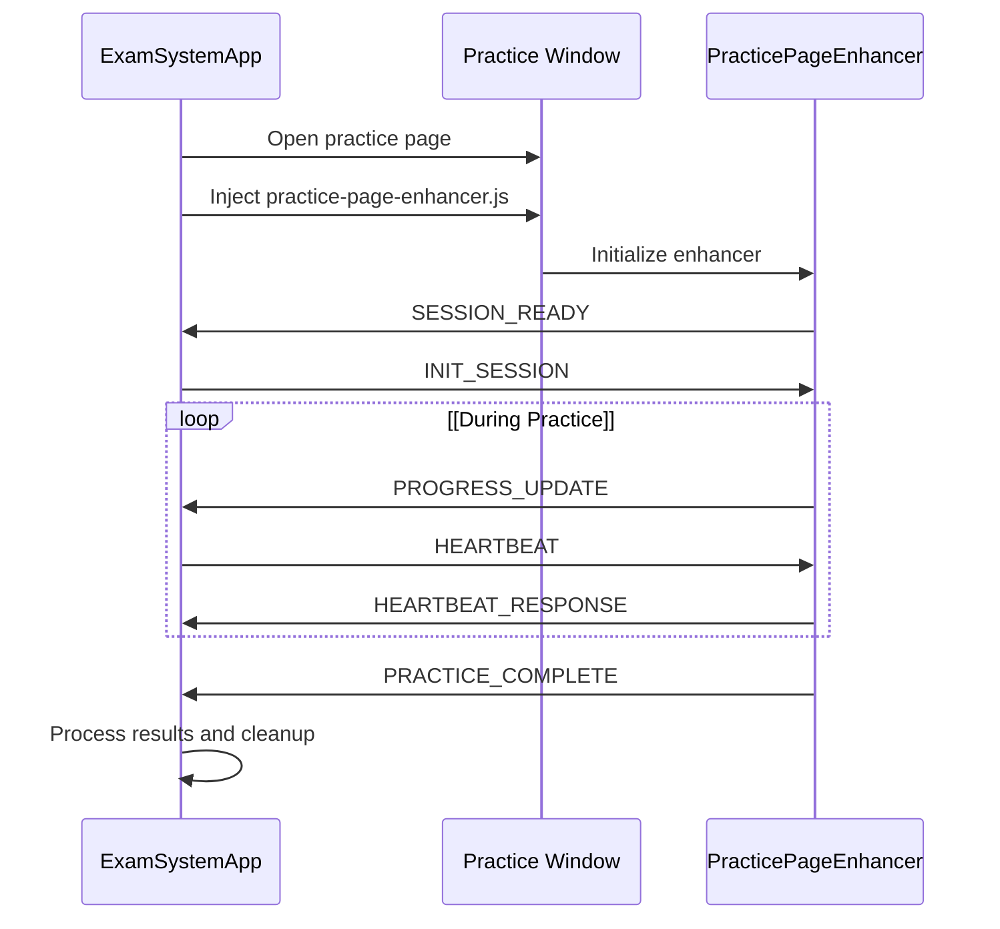
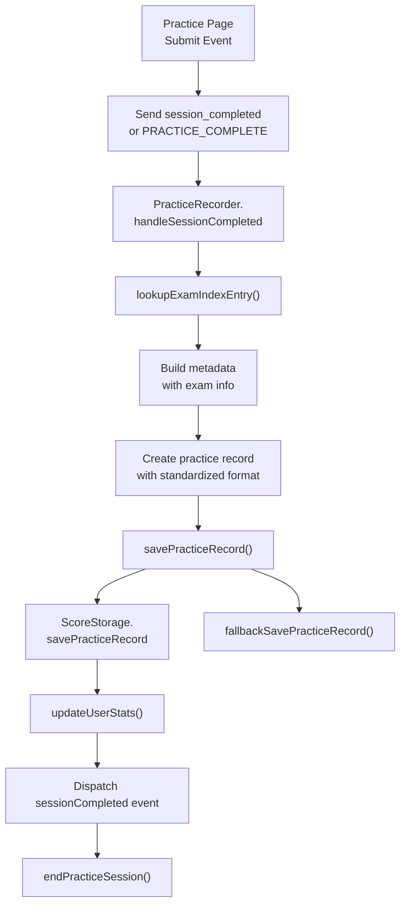
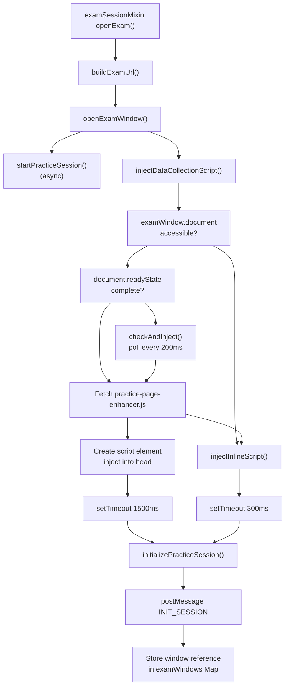
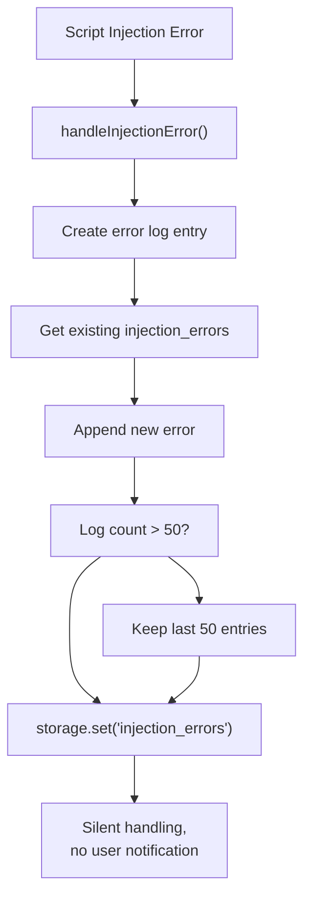
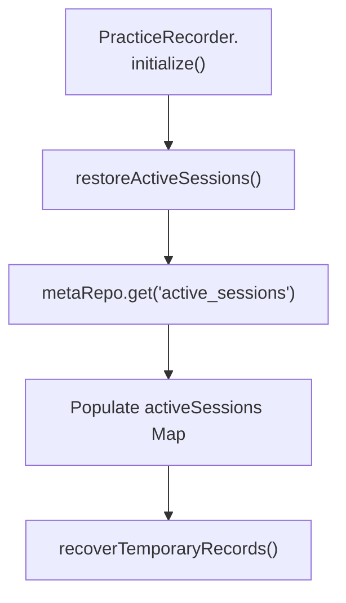
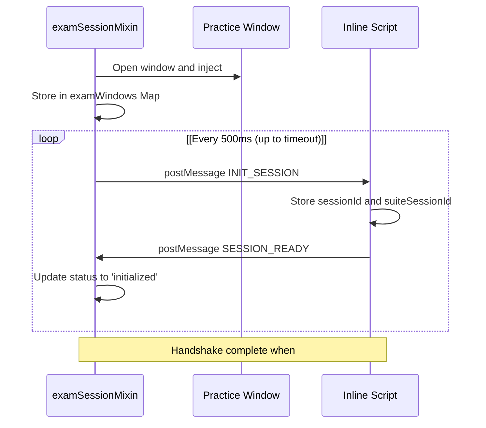
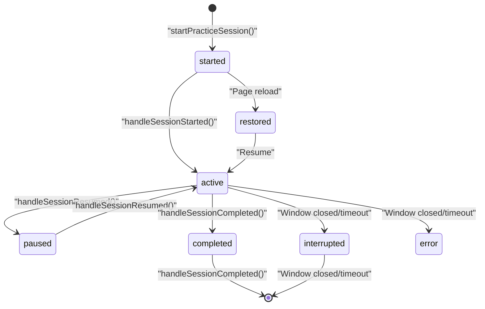

# Session Communication Protocol

> **Relevant source files**
> * [developer/tests/e2e/playwright_index_clickthrough.py](https://github.com/sallowayma-git/IELTS-practice/blob/df0c9b8f/developer/tests/e2e/playwright_index_clickthrough.py)
> * [developer/tests/js/e2e/indexSnapshot.js](https://github.com/sallowayma-git/IELTS-practice/blob/df0c9b8f/developer/tests/js/e2e/indexSnapshot.js)
> * [js/app/examSessionMixin.js](https://github.com/sallowayma-git/IELTS-practice/blob/df0c9b8f/js/app/examSessionMixin.js)
> * [js/app/lifecycleMixin.js](https://github.com/sallowayma-git/IELTS-practice/blob/df0c9b8f/js/app/lifecycleMixin.js)
> * [js/core/practiceRecorder.js](https://github.com/sallowayma-git/IELTS-practice/blob/df0c9b8f/js/core/practiceRecorder.js)
> * [js/core/scoreStorage.js](https://github.com/sallowayma-git/IELTS-practice/blob/df0c9b8f/js/core/scoreStorage.js)
> * [js/views/overviewView.js](https://github.com/sallowayma-git/IELTS-practice/blob/df0c9b8f/js/views/overviewView.js)

This document describes the message-passing system that enables communication between the main IELTS practice application and individual practice pages. The protocol handles session initialization, progress tracking, data collection, and result reporting across browser windows.

For information about the practice page template structure, see [Practice Page Template](/sallowayma-git/IELTS-practice/6.1-exam-index-and-metadata-structure). For details on how practice pages are enhanced with additional functionality, see [Practice Enhancement System](#6.3).

## Overview and Architecture

The Session Communication Protocol enables bidirectional communication between the main application window and practice session windows using the `window.postMessage` API with localStorage-based fallback mechanisms.

### Communication Flow Diagram



Sources: [js/practice-page-enhancer.js L88-L152](https://github.com/sallowayma-git/IELTS-practice/blob/df0c9b8f/js/practice-page-enhancer.js#L88-L152)

 [js/app.js L1221-L1284](https://github.com/sallowayma-git/IELTS-practice/blob/df0c9b8f/js/app.js#L1221-L1284)

### Core Components

| Component | Location | Purpose |
| --- | --- | --- |
| `practicePageEnhancer` | [js/practice-page-enhancer.js L1-L1200](https://github.com/sallowayma-git/IELTS-practice/blob/df0c9b8f/js/practice-page-enhancer.js#L1-L1200) | Client-side communication handler injected into practice pages |
| `PracticeRecorder.handleExamMessage` | [js/core/practiceRecorder.js L244-L288](https://github.com/sallowayma-git/IELTS-practice/blob/df0c9b8f/js/core/practiceRecorder.js#L244-L288) | Main application message handler receiving practice window events |
| `examSessionMixin.injectDataCollectionScript` | [js/app/examSessionMixin.js L203-L276](https://github.com/sallowayma-git/IELTS-practice/blob/df0c9b8f/js/app/examSessionMixin.js#L203-L276) | Script injection and session initialization logic |
| `examSessionMixin.initializePracticeSession` | [js/app/examSessionMixin.js L527-L600](https://github.com/sallowayma-git/IELTS-practice/blob/df0c9b8f/js/app/examSessionMixin.js#L527-L600) | Session handshake and window registration |

Sources: [js/practice-page-enhancer.js L1-L1200](https://github.com/sallowayma-git/IELTS-practice/blob/df0c9b8f/js/practice-page-enhancer.js#L1-L1200)

 [js/core/practiceRecorder.js L244-L288](https://github.com/sallowayma-git/IELTS-practice/blob/df0c9b8f/js/core/practiceRecorder.js#L244-L288)

 [js/app/examSessionMixin.js L203-L276](https://github.com/sallowayma-git/IELTS-practice/blob/df0c9b8f/js/app/examSessionMixin.js#L203-L276)

 [js/app/examSessionMixin.js L527-L600](https://github.com/sallowayma-git/IELTS-practice/blob/df0c9b8f/js/app/examSessionMixin.js#L527-L600)

## Message Protocol Specification

### Message Structure

All messages follow a consistent structure with type identification and data payload:

```yaml
{
    type: "MESSAGE_TYPE",
    data: {
        // Message-specific payload
        examId: "exam_identifier",
        sessionId: "session_timestamp_randomId"
    }
}
```

The main application processes these messages through `PracticeRecorder.handleExamMessage`, which validates the message type and delegates to specific handlers for each message category.

Sources: [js/core/practiceRecorder.js L261-L288](https://github.com/sallowayma-git/IELTS-practice/blob/df0c9b8f/js/core/practiceRecorder.js#L261-L288)

### Core Message Types

#### Session Initialization Messages

| Message Type | Direction | Purpose | Handler | Data Fields |
| --- | --- | --- | --- | --- |
| `INIT_SESSION` | Main → Practice | Initialize session with metadata | `handleInitSession` in inline script | `sessionId`, `examId`, `parentOrigin`, `timestamp`, `suiteSessionId?` |
| `SESSION_READY` | Practice → Main | Acknowledge session readiness | N/A (confirmation message) | `sessionId`, `examId`, `url`, `title` |

#### Session State Messages

| Message Type | Direction | Purpose | Handler | Data Fields |
| --- | --- | --- | --- | --- |
| `session_started` | Practice → Main | Notify session start | `PracticeRecorder.handleSessionStarted` | `examId`, `sessionId`, `metadata` |
| `session_progress` | Practice → Main | Report progress updates | `PracticeRecorder.handleSessionProgress` | `examId`, `progress`, `answers` |
| `session_paused` | Practice → Main | Signal session paused | `PracticeRecorder.handleSessionPaused` | `examId` |
| `session_resumed` | Practice → Main | Signal session resumed | `PracticeRecorder.handleSessionResumed` | `examId` |
| `session_error` | Practice → Main | Report session error | `PracticeRecorder.handleSessionError` | `examId`, `error` |

#### Practice Completion Messages

| Message Type | Direction | Purpose | Handler | Data Fields |
| --- | --- | --- | --- | --- |
| `session_completed` | Practice → Main | Submit final results | `PracticeRecorder.handleSessionCompleted` | `examId`, `results`, `endTime` |
| `PRACTICE_COMPLETE` | Practice → Main | Submit results (legacy/fallback) | Same as `session_completed` | `sessionId`, `examId`, `duration`, `answers`, `source` |

Sources: [js/core/practiceRecorder.js L261-L288](https://github.com/sallowayma-git/IELTS-practice/blob/df0c9b8f/js/core/practiceRecorder.js#L261-L288)

 [js/core/practiceRecorder.js L339-L360](https://github.com/sallowayma-git/IELTS-practice/blob/df0c9b8f/js/core/practiceRecorder.js#L339-L360)

 [js/core/practiceRecorder.js L363-L382](https://github.com/sallowayma-git/IELTS-practice/blob/df0c9b8f/js/core/practiceRecorder.js#L363-L382)

 [js/core/practiceRecorder.js L386-L442](https://github.com/sallowayma-git/IELTS-practice/blob/df0c9b8f/js/core/practiceRecorder.js#L386-L442)

 [js/app/examSessionMixin.js L401-L421](https://github.com/sallowayma-git/IELTS-practice/blob/df0c9b8f/js/app/examSessionMixin.js#L401-L421)

 [js/app/examSessionMixin.js L489-L497](https://github.com/sallowayma-git/IELTS-practice/blob/df0c9b8f/js/app/examSessionMixin.js#L489-L497)

### Practice Completion Protocol



The completion handler in `PracticeRecorder` performs comprehensive data enrichment:

| Data Field | Processing Step | Source Code |
| --- | --- | --- |
| `type` | Inferred from examId or metadata | [js/core/practiceRecorder.js L67-L90](https://github.com/sallowayma-git/IELTS-practice/blob/df0c9b8f/js/core/practiceRecorder.js#L67-L90) |
| `date` | Resolved from multiple candidate fields | [js/core/practiceRecorder.js L92-L101](https://github.com/sallowayma-git/IELTS-practice/blob/df0c9b8f/js/core/practiceRecorder.js#L92-L101) |
| `metadata` | Built with exam index lookup | [js/core/practiceRecorder.js L180-L195](https://github.com/sallowayma-git/IELTS-practice/blob/df0c9b8f/js/core/practiceRecorder.js#L180-L195) |
| `duration` | Calculated from start/end timestamps | [js/core/practiceRecorder.js L403-L404](https://github.com/sallowayma-git/IELTS-practice/blob/df0c9b8f/js/core/practiceRecorder.js#L403-L404) |
| `practiceRecord` | Complete standardized record | [js/core/practiceRecorder.js L406-L424](https://github.com/sallowayma-git/IELTS-practice/blob/df0c9b8f/js/core/practiceRecorder.js#L406-L424) |

The system performs a three-retry save with fallback to `PracticeRepository.overwrite()` if `ScoreStorage` is unavailable.

Sources: [js/core/practiceRecorder.js L386-L442](https://github.com/sallowayma-git/IELTS-practice/blob/df0c9b8f/js/core/practiceRecorder.js#L386-L442)

 [js/core/practiceRecorder.js L641-L677](https://github.com/sallowayma-git/IELTS-practice/blob/df0c9b8f/js/core/practiceRecorder.js#L641-L677)

 [js/core/practiceRecorder.js L682-L723](https://github.com/sallowayma-git/IELTS-practice/blob/df0c9b8f/js/core/practiceRecorder.js#L682-L723)

## Script Injection and Initialization

### Injection Process Flow



The injection system uses a **multi-tier strategy**:

1. **Primary Method**: Fetch `practice-page-enhancer.js` from server and inject into `document.head`
2. **Cross-Origin Fallback**: Inject 510-line inline script with minimal data collector
3. **Retry Logic**: Poll document readiness up to timeout if page not loaded

The inline fallback includes suite mode guards (`installSuiteGuards()`) to prevent window closure during multi-exam sessions.

Sources: [js/app/examSessionMixin.js L6-L94](https://github.com/sallowayma-git/IELTS-practice/blob/df0c9b8f/js/app/examSessionMixin.js#L6-L94)

 [js/app/examSessionMixin.js L203-L276](https://github.com/sallowayma-git/IELTS-practice/blob/df0c9b8f/js/app/examSessionMixin.js#L203-L276)

 [js/app/examSessionMixin.js L281-L522](https://github.com/sallowayma-git/IELTS-practice/blob/df0c9b8f/js/app/examSessionMixin.js#L281-L522)

### Cross-Origin Handling and Inline Script

When cross-origin restrictions prevent script injection, `injectInlineScript()` creates a self-contained communication system:

| Component | Inline Location | Functionality |
| --- | --- | --- |
| `state` object | [js/app/examSessionMixin.js L298-L310](https://github.com/sallowayma-git/IELTS-practice/blob/df0c9b8f/js/app/examSessionMixin.js#L298-L310) | Session state with suite guards |
| `sendMessage()` | [js/app/examSessionMixin.js L312-L321](https://github.com/sallowayma-git/IELTS-practice/blob/df0c9b8f/js/app/examSessionMixin.js#L312-L321) | postMessage wrapper with error handling |
| `installSuiteGuards()` | [js/app/examSessionMixin.js L335-L368](https://github.com/sallowayma-git/IELTS-practice/blob/df0c9b8f/js/app/examSessionMixin.js#L335-L368) | Override `window.close` and `window.open` |
| `handleInitSession()` | [js/app/examSessionMixin.js L401-L421](https://github.com/sallowayma-git/IELTS-practice/blob/df0c9b8f/js/app/examSessionMixin.js#L401-L421) | Process `INIT_SESSION` message |
| `practiceDataCollector` | [js/app/examSessionMixin.js L448-L498](https://github.com/sallowayma-git/IELTS-practice/blob/df0c9b8f/js/app/examSessionMixin.js#L448-L498) | Basic answer collection and submission |

The inline script includes **suite mode protection** that prevents accidental window closure during multi-exam sessions by:

* Capturing native `window.close` and `window.open` references
* Overriding them with guarded versions that send `SUITE_CLOSE_ATTEMPT` messages
* Responding to `SUITE_FORCE_CLOSE` by restoring native functions before closing

Sources: [js/app/examSessionMixin.js L281-L522](https://github.com/sallowayma-git/IELTS-practice/blob/df0c9b8f/js/app/examSessionMixin.js#L281-L522)

## Communication Reliability and Fallbacks

### Error Handling Strategy

The main application records injection errors for diagnostics:



Error log structure:

```yaml
{
    examId: examId,
    error: error.message,
    timestamp: Date.now(),
    type: 'script_injection_error'
}
```

The system does **not** display errors to users, allowing practice to continue with fallback communication methods.

Sources: [js/app/examSessionMixin.js L605-L626](https://github.com/sallowayma-git/IELTS-practice/blob/df0c9b8f/js/app/examSessionMixin.js#L605-L626)

### Active Session Persistence

`PracticeRecorder` maintains active sessions in storage for recovery after page reloads:

| Storage Key | Repository | Data Structure |
| --- | --- | --- |
| `active_sessions` | `MetaRepository` | `Array<SessionData>` |
| `temp_practice_records` | `MetaRepository` | `Array<PracticeRecord>` with `needsRecovery: true` |
| `interrupted_records` | `MetaRepository` | `Array<InterruptedRecord>` |

**Auto-save Mechanism**:

* **Interval**: Every 30 seconds (`autoSaveInterval = 30000`)
* **Trigger**: `startAutoSave()` sets interval timer
* **Handler**: `saveAllSessions()` calls `saveActiveSessions()`
* **Storage**: `metaRepo.set('active_sessions', sessionsArray)`

**Recovery Flow**:



Sessions are marked with `status: 'restored'` on reload and timeout after 30 minutes of inactivity.

Sources: [js/core/practiceRecorder.js L9-L10](https://github.com/sallowayma-git/IELTS-practice/blob/df0c9b8f/js/core/practiceRecorder.js#L9-L10)

 [js/core/practiceRecorder.js L200-L239](https://github.com/sallowayma-git/IELTS-practice/blob/df0c9b8f/js/core/practiceRecorder.js#L200-L239)

 [js/core/practiceRecorder.js L606-L636](https://github.com/sallowayma-git/IELTS-practice/blob/df0c9b8f/js/core/practiceRecorder.js#L606-L636)

 [js/core/practiceRecorder.js L878-L898](https://github.com/sallowayma-git/IELTS-practice/blob/df0c9b8f/js/core/practiceRecorder.js#L878-L898)

### Session Handshake Protocol

The initialization sequence ensures reliable session establishment through a repeated handshake:



The handshake is initiated in `initializePracticeSession()`:

| Field | Value | Purpose |
| --- | --- | --- |
| `sessionId` | `${examId}_${Date.now()}` | Unique session identifier |
| `examId` | Exam identifier | Link to exam index entry |
| `parentOrigin` | `window.location.origin` | Security origin validation |
| `timestamp` | `Date.now()` | Session initialization time |
| `suiteSessionId` | Suite session ID or `null` | Link to multi-exam session |

The message is sent via `examWindow.postMessage()` with origin `'*'` and the window reference is stored in `examWindows` Map with session metadata.

Sources: [js/app/examSessionMixin.js L527-L600](https://github.com/sallowayma-git/IELTS-practice/blob/df0c9b8f/js/app/examSessionMixin.js#L527-L600)

## Data Collection and Monitoring

### Answer Tracking (Inline Collector)

The inline collector in `injectInlineScript()` implements minimal answer tracking:

```typescript
setupBasicListeners: function() {
    document.addEventListener('change', function(event) {
        var target = event && event.target ? event.target : null;
        if (!target || !target.name) return;
        var tag = (target.tagName || '').toUpperCase();
        if (target.type === 'radio' || target.type === 'text' || 
            tag === 'INPUT' || tag === 'TEXTAREA' || tag === 'SELECT') {
            state.answers[target.name] = target.value;
        }
    }, true);
}
```

**Monitored Elements**:

* Radio buttons: `input[type="radio"]` - capture checked value
* Text inputs: `input[type="text"]` - capture current text
* Textareas: `textarea` - capture current content
* Select dropdowns: `select` - capture selected option

The answers are stored in `state.answers` object keyed by input `name` attribute and sent to the main application via `PRACTICE_COMPLETE` message.

Sources: [js/app/examSessionMixin.js L457-L467](https://github.com/sallowayma-git/IELTS-practice/blob/df0c9b8f/js/app/examSessionMixin.js#L457-L467)

### Result Submission (Inline Collector)

The inline collector submits results when submit buttons are clicked:

```javascript
setupSubmitListeners: function() {
    var buttons = Array.prototype.slice.call(
        document.querySelectorAll('button, input[type="submit"]')
    );
    if (!buttons.length) {
        var legacy = document.querySelector('button[onclick*="grade"]');
        if (legacy) buttons.push(legacy);
    }
    buttons.forEach(function(btn) {
        if (!btn || typeof btn.addEventListener !== 'function') return;
        btn.addEventListener('click', function() {
            setTimeout(function() {
                collector.sendResults();
            }, 200);
        }, false);
    });
}
```

The 200ms delay allows the page's `grade()` function to execute and populate result elements before data collection.

**Submission Data**:

```yaml
{
    type: 'PRACTICE_COMPLETE',
    data: {
        sessionId: state.sessionId,
        examId: state.examId,
        duration: Math.round((Date.now() - state.startTime) / 1000),
        answers: state.answers,
        source: 'inline_collector'
    }
}
```

Sources: [js/app/examSessionMixin.js L469-L488](https://github.com/sallowayma-git/IELTS-practice/blob/df0c9b8f/js/app/examSessionMixin.js#L469-L488)

 [js/app/examSessionMixin.js L489-L497](https://github.com/sallowayma-git/IELTS-practice/blob/df0c9b8f/js/app/examSessionMixin.js#L489-L497)

## Session Lifecycle Management

### Session States and Transitions

| State | Set By | Storage | Description |
| --- | --- | --- | --- |
| `started` | `startPracticeSession()` | `activeSessions` Map | Initial session creation |
| `active` | `handleSessionStarted()` | `activeSessions` Map | Practice page confirmed ready |
| `paused` | `handleSessionPaused()` | `activeSessions` Map | User paused practice |
| `completed` | `handleSessionCompleted()` | Removed from `activeSessions` | Results saved, session ended |
| `interrupted` | `endPracticeSession()` with `reason !== 'completed'` | Saved to `interrupted_records` | Window closed or timed out |
| `error` | `handleSessionError()` | `activeSessions` Map with error field | Communication or processing error |
| `restored` | `restoreActiveSessions()` | `activeSessions` Map | Recovered from storage after reload |

**State Transitions**:



**Timeout Monitoring**: `checkSessionActivity()` runs every 60 seconds and ends sessions with 30+ minutes of inactivity.

Sources: [js/core/practiceRecorder.js L293-L335](https://github.com/sallowayma-git/IELTS-practice/blob/df0c9b8f/js/core/practiceRecorder.js#L293-L335)

 [js/core/practiceRecorder.js L339-L360](https://github.com/sallowayma-git/IELTS-practice/blob/df0c9b8f/js/core/practiceRecorder.js#L339-L360)

 [js/core/practiceRecorder.js L386-L442](https://github.com/sallowayma-git/IELTS-practice/blob/df0c9b8f/js/core/practiceRecorder.js#L386-L442)

 [js/core/practiceRecorder.js L446-L506](https://github.com/sallowayma-git/IELTS-practice/blob/df0c9b8f/js/core/practiceRecorder.js#L446-L506)

 [js/core/practiceRecorder.js L511-L552](https://github.com/sallowayma-git/IELTS-practice/blob/df0c9b8f/js/core/practiceRecorder.js#L511-L552)

 [js/core/practiceRecorder.js L557-L601](https://github.com/sallowayma-git/IELTS-practice/blob/df0c9b8f/js/core/practiceRecorder.js#L557-L601)

### Cleanup and Resource Management

The main application maintains comprehensive session cleanup:

```javascript
cleanupExamSession(examId) {
    // Remove window references
    this.examWindows.delete(examId);
    
    // Remove message handlers
    window.removeEventListener('message', handler);
    
    // Clean active sessions storage
    const sessions = storage.get('active_sessions', []);
    const updated = sessions.filter(s => s.examId !== examId);
    storage.set('active_sessions', updated);
}
```

Sources: [js/app.js L1965-L1983](https://github.com/sallowayma-git/IELTS-practice/blob/df0c9b8f/js/app.js#L1965-L1983)

The enhancer also implements cleanup for communication resources and error tracking with limits on stored error records and message history.

Sources: [js/practice-page-enhancer.js L161-L176](https://github.com/sallowayma-git/IELTS-practice/blob/df0c9b8f/js/practice-page-enhancer.js#L161-L176)

 [js/practice-page-enhancer.js L805-L820](https://github.com/sallowayma-git/IELTS-practice/blob/df0c9b8f/js/practice-page-enhancer.js#L805-L820)