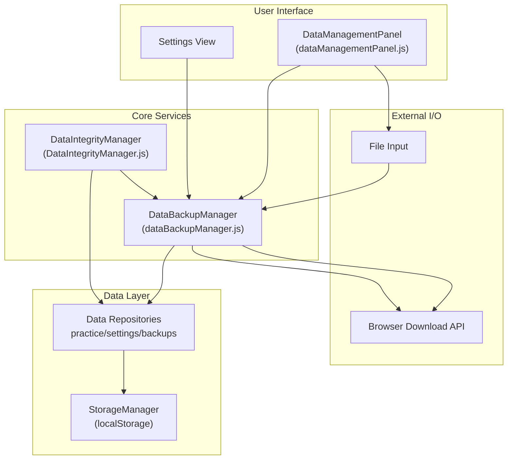
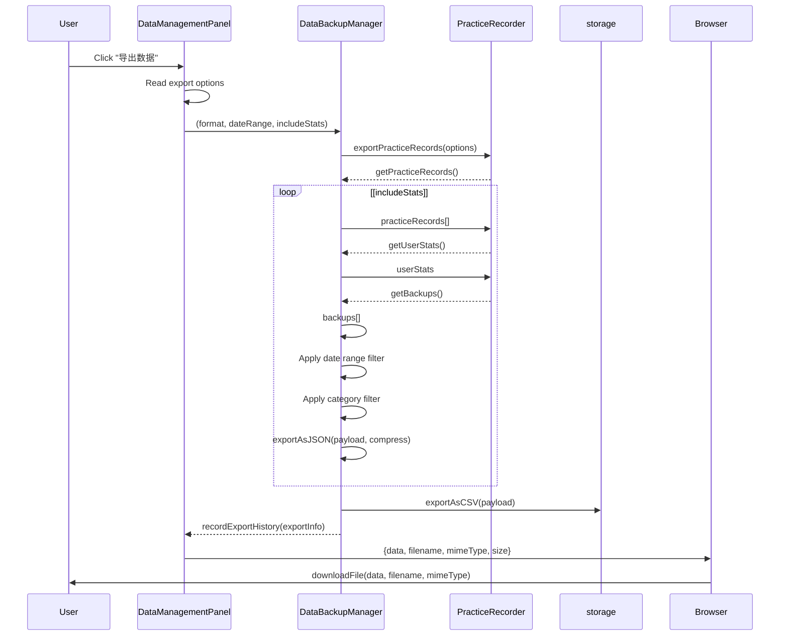
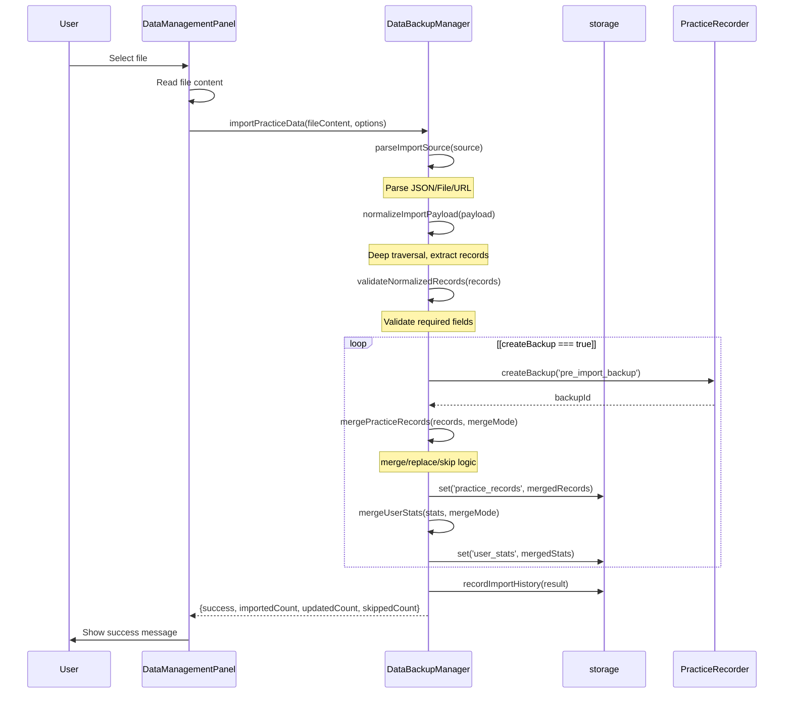
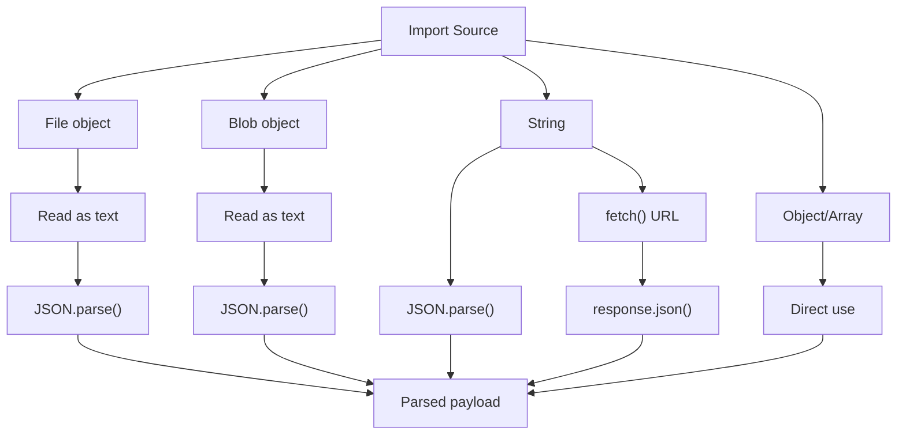
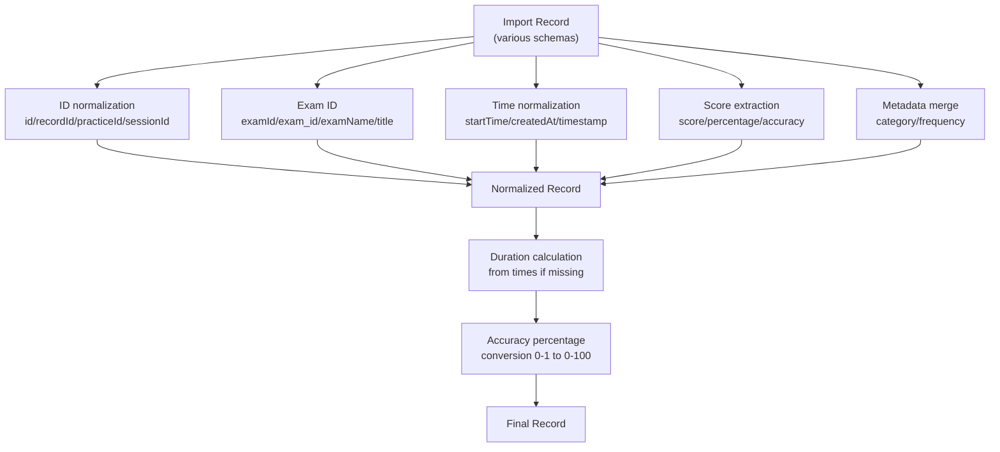
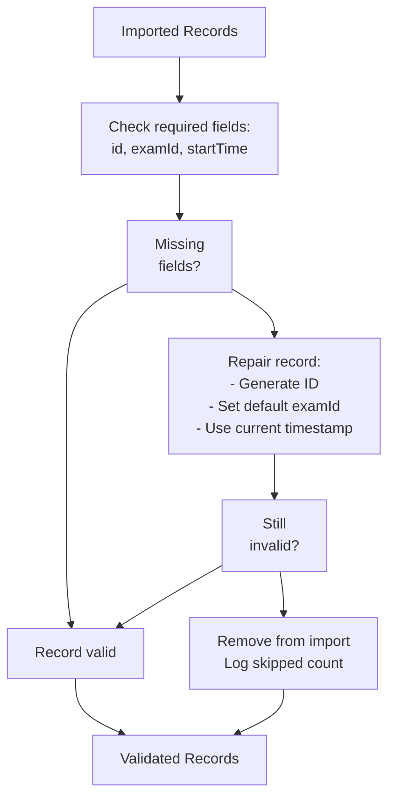
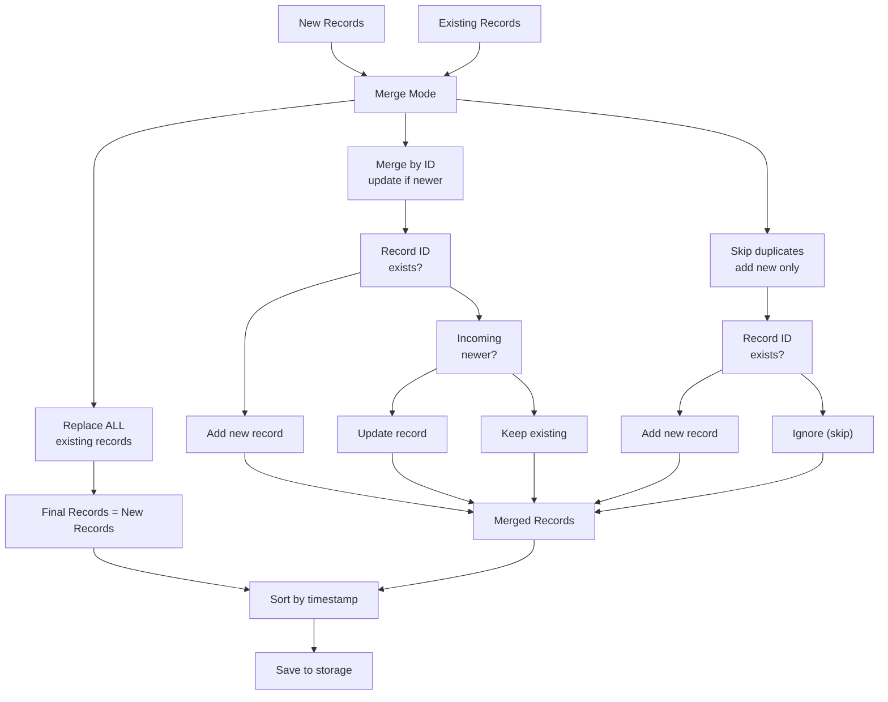
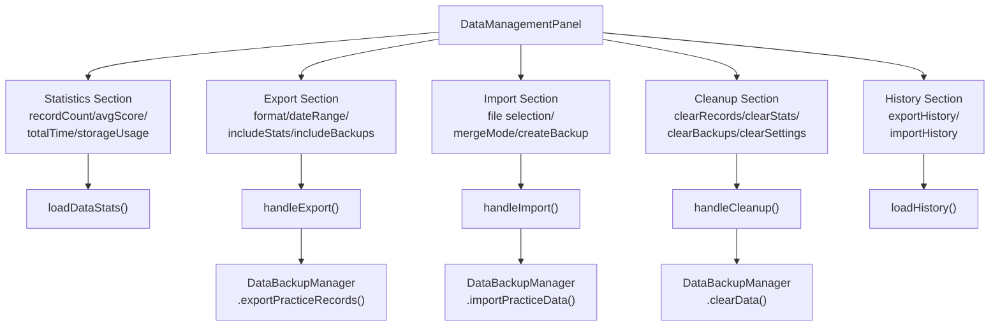
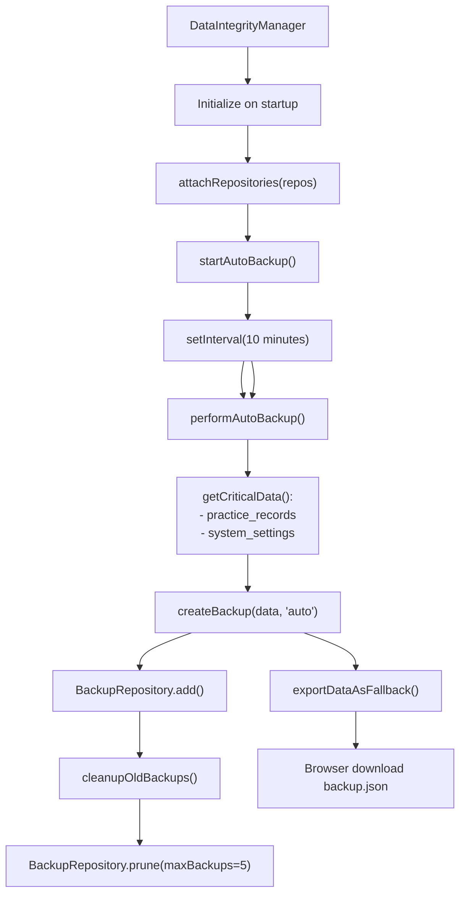
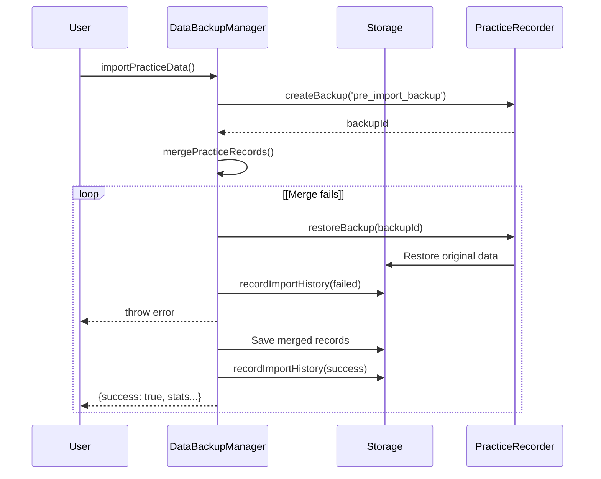

# Data Backup & Import/Export

> **Relevant source files**
> * [assets/developer wiki/hp-overview-usage-todo.md](https://github.com/sallowayma-git/IELTS-practice/blob/df0c9b8f/assets/developer wiki/hp-overview-usage-todo.md)
> * [js/components/DataIntegrityManager.js](https://github.com/sallowayma-git/IELTS-practice/blob/df0c9b8f/js/components/DataIntegrityManager.js)
> * [js/components/dataManagementPanel.js](https://github.com/sallowayma-git/IELTS-practice/blob/df0c9b8f/js/components/dataManagementPanel.js)
> * [js/data/index.js](https://github.com/sallowayma-git/IELTS-practice/blob/df0c9b8f/js/data/index.js)
> * [js/script.js](https://github.com/sallowayma-git/IELTS-practice/blob/df0c9b8f/js/script.js)
> * [js/utils/dataBackupManager.js](https://github.com/sallowayma-git/IELTS-practice/blob/df0c9b8f/js/utils/dataBackupManager.js)
> * [js/utils/helpers.js](https://github.com/sallowayma-git/IELTS-practice/blob/df0c9b8f/js/utils/helpers.js)
> * [js/utils/simpleStorageWrapper.js](https://github.com/sallowayma-git/IELTS-practice/blob/df0c9b8f/js/utils/simpleStorageWrapper.js)
> * [js/views/legacyViewBundle.js](https://github.com/sallowayma-git/IELTS-practice/blob/df0c9b8f/js/views/legacyViewBundle.js)

## Purpose and Scope

This document describes the data backup, export, and import subsystem that enables users to manage their practice records and settings data. The system provides both user-facing manual operations (export to JSON/CSV, import from files, manual backups) and automatic backup mechanisms.

For information about automatic data integrity management and consistency checks, see [Data Integrity & Quality Management](/sallowayma-git/IELTS-practice/4.3-data-integrity-and-quality-management). For the underlying repository architecture, see [Repository Architecture & Data Layer](/sallowayma-git/IELTS-practice/4.1-repository-architecture-and-data-layer).

---

## System Overview

The data backup and import/export system consists of three main components working together:



**Key responsibilities:**

* **DataBackupManager** ([js/utils/dataBackupManager.js L5-L1335](https://github.com/sallowayma-git/IELTS-practice/blob/df0c9b8f/js/utils/dataBackupManager.js#L5-L1335) ): User-facing export/import operations, format conversion (JSON/CSV), data normalization and validation
* **DataIntegrityManager** ([js/components/DataIntegrityManager.js L6-L325](https://github.com/sallowayma-git/IELTS-practice/blob/df0c9b8f/js/components/DataIntegrityManager.js#L6-L325) ): Automatic backups every 10 minutes, backup pruning, quota management
* **DataManagementPanel** ([js/components/dataManagementPanel.js L26-L848](https://github.com/sallowayma-git/IELTS-practice/blob/df0c9b8f/js/components/dataManagementPanel.js#L26-L848) ): User interface for all data management operations

**Sources:** js/utils/dataBackupManager.js:1-20, js/components/DataIntegrityManager.js:1-25, js/components/dataManagementPanel.js:1-40, Diagram 1 and 3 from high-level architecture

---

## DataBackupManager Architecture

### Class Structure

```

```

**Sources:** js/utils/dataBackupManager.js:5-30, js/components/DataIntegrityManager.js:6-23, js/components/dataManagementPanel.js:26-34

---

## Export Functionality

### Export Process Flow



**Sources:** js/utils/dataBackupManager.js:49-115, js/components/dataManagementPanel.js:439-473

### Export Options

The export system supports multiple options configured by the user:

| Option | Type | Default | Description |
| --- | --- | --- | --- |
| `format` | String | `'json'` | Export format: `'json'` or `'csv'` |
| `includeStats` | Boolean | `true` | Include user statistics |
| `includeBackups` | Boolean | `false` | Include backup data |
| `dateRange` | Object | `null` | Filter by date: `{startDate, endDate}` |
| `categories` | Array | `null` | Filter by categories |
| `compression` | Boolean | `false` | Enable gzip compression (requires pako) |

**Implementation:** [js/utils/dataBackupManager.js L49-L81](https://github.com/sallowayma-git/IELTS-practice/blob/df0c9b8f/js/utils/dataBackupManager.js#L49-L81)

### JSON Export Format

The JSON export produces a structured payload with metadata:

```javascript
{
  "exportInfo": {
    "timestamp": "2024-01-15T10:30:00.000Z",
    "version": "1.0.0",
    "format": "json",
    "recordCount": 150,
    "options": { /* export options */ }
  },
  "practiceRecords": [ /* array of practice records */ ],
  "userStats": { /* optional user statistics */ },
  "backups": [ /* optional backup data */ ]
}
```

**Implementation:** [js/utils/dataBackupManager.js L82-L115](https://github.com/sallowayma-git/IELTS-practice/blob/df0c9b8f/js/utils/dataBackupManager.js#L82-L115)

### CSV Export Format

The CSV export flattens practice records into a tabular format with headers:

| Column | Source Field |
| --- | --- |
| record_id | `record.id` |
| exam_id | `record.examId` |
| title | `record.title` |
| status | `record.status` |
| score | `record.score` |
| accuracy | `record.accuracy` |
| duration_seconds | `record.duration` |
| start_time | `record.startTime` |
| end_time | `record.endTime` |
| category | `record.metadata.category` |
| frequency | `record.metadata.frequency` |
| created_at | `record.createdAt` |

**Implementation:** [js/utils/dataBackupManager.js L130-L175](https://github.com/sallowayma-git/IELTS-practice/blob/df0c9b8f/js/utils/dataBackupManager.js#L130-L175)

**Sources:** js/utils/dataBackupManager.js:49-175

---

## Import Functionality

### Import Process Flow



**Sources:** js/utils/dataBackupManager.js:183-269, js/components/dataManagementPanel.js:506-586

### Import Options

| Option | Type | Default | Description |
| --- | --- | --- | --- |
| `mergeMode` | String | `'merge'` | `'merge'`, `'replace'`, or `'skip'` |
| `validateData` | Boolean | `true` | Validate and fix records before import |
| `createBackup` | Boolean | `true` | Create backup before importing |
| `preserveIds` | Boolean | `true` | Preserve original record IDs |

**Implementation:** [js/utils/dataBackupManager.js L183-L191](https://github.com/sallowayma-git/IELTS-practice/blob/df0c9b8f/js/utils/dataBackupManager.js#L183-L191)

### Source Parsing

The `parseImportSource` method accepts multiple input types:



**Implementation:** [js/utils/dataBackupManager.js L271-L314](https://github.com/sallowayma-git/IELTS-practice/blob/df0c9b8f/js/utils/dataBackupManager.js#L271-L314)

**Sources:** js/utils/dataBackupManager.js:271-314

### Payload Normalization

The normalization process handles various export formats through deep traversal:

#### Common Export Structures Recognized

```yaml
// Direct array
[{record1}, {record2}, ...]

// Top-level key
{ practice_records: [...] }

// Nested under data
{ data: { practice_records: [...] } }

// Nested with wrapper
{ data: { exam_system_practice_records: { data: [...] } } }

// Multiple sources
{
  data: { 
    practice_records: [...],
    exam_system_practice_records: { data: [...] }
  }
}
```

**Implementation:** [js/utils/dataBackupManager.js L316-L433](https://github.com/sallowayma-git/IELTS-practice/blob/df0c9b8f/js/utils/dataBackupManager.js#L316-L433)

The normalizer uses heuristics to identify practice records:

1. **Fast-path extraction** ([js/utils/dataBackupManager.js L327-L344](https://github.com/sallowayma-git/IELTS-practice/blob/df0c9b8f/js/utils/dataBackupManager.js#L327-L344) ): Tries common structures first
2. **Deep traversal** ([js/utils/dataBackupManager.js L372-L422](https://github.com/sallowayma-git/IELTS-practice/blob/df0c9b8f/js/utils/dataBackupManager.js#L372-L422) ): Recursively searches for record arrays
3. **Record detection** ([js/utils/dataBackupManager.js L704-L727](https://github.com/sallowayma-git/IELTS-practice/blob/df0c9b8f/js/utils/dataBackupManager.js#L704-L727) ): Identifies records by key patterns: * Identity signals: `id`, `examId`, `exam_id`, `title` * Time signals: `startTime`, `start_time`, `createdAt`, `timestamp` * Status signals: `status`, `realData`, `duration`
4. **Path validation** ([js/utils/dataBackupManager.js L435-L448](https://github.com/sallowayma-git/IELTS-practice/blob/df0c9b8f/js/utils/dataBackupManager.js#L435-L448) ): Ensures paths contain practice-related keywords

**Sources:** js/utils/dataBackupManager.js:316-448, js/utils/dataBackupManager.js:688-767

### Record Normalization

Each imported record is normalized to the system's schema:



The normalization logic ([js/utils/dataBackupManager.js L789-L893](https://github.com/sallowayma-git/IELTS-practice/blob/df0c9b8f/js/utils/dataBackupManager.js#L789-L893)

):

1. **ID extraction**: Tries multiple field names, generates fallback ID if missing
2. **Date normalization**: Converts various formats (ISO string, Unix timestamp, Date object) to ISO strings
3. **Duration calculation**: Derives from `startTime` and `endTime` if missing, or from `realData.interactions`
4. **Score normalization**: Converts 0-1 range to 0-100 percentages, clamps to valid range
5. **Metadata merging**: Preserves nested `metadata` and `realData` objects

**Sources:** js/utils/dataBackupManager.js:789-893

### Validation and Repair

The validation system ([js/utils/dataBackupManager.js L450-L506](https://github.com/sallowayma-git/IELTS-practice/blob/df0c9b8f/js/utils/dataBackupManager.js#L450-L506)

) ensures data integrity:



**Repair strategies:**

* Missing `id`: Generate `imported_{date}_{random}`
* Missing `examId`: Use `'imported_ielts'`
* Missing `startTime`: Use current timestamp
* Invalid dates: Replace with current timestamp
* Invalid `duration`/`score`: Set to 0

**Implementation:** [js/utils/dataBackupManager.js L450-L506](https://github.com/sallowayma-git/IELTS-practice/blob/df0c9b8f/js/utils/dataBackupManager.js#L450-L506)

**Sources:** js/utils/dataBackupManager.js:450-506

---

## Merge Strategies

### Merge Modes



**Implementation:** [js/utils/dataBackupManager.js L508-L578](https://github.com/sallowayma-git/IELTS-practice/blob/df0c9b8f/js/utils/dataBackupManager.js#L508-L578)

### Timestamp Comparison

When merging records with the same ID, the system compares timestamps to determine which is newer:

```
// Timestamp priority (first non-null wins):
1. record.updatedAt
2. record.createdAt
3. record.endTime
4. record.startTime
5. record.timestamp
6. record.date
```

**Implementation:** [js/utils/dataBackupManager.js L946-L971](https://github.com/sallowayma-git/IELTS-practice/blob/df0c9b8f/js/utils/dataBackupManager.js#L946-L971)

### Record Merging Details

When updating an existing record with a newer import, nested objects are merged:

```
merged = {
  ...existing,
  ...incoming,
  metadata: { ...existing.metadata, ...incoming.metadata },
  realData: { ...existing.realData, ...incoming.realData }
}
```

The merge also attempts to recalculate missing `duration` from timestamps or `realData.interactions` ([js/utils/dataBackupManager.js L619-L664](https://github.com/sallowayma-git/IELTS-practice/blob/df0c9b8f/js/utils/dataBackupManager.js#L619-L664)

).

**Sources:** js/utils/dataBackupManager.js:508-664

---

## User Interface Integration

### DataManagementPanel Component

The `DataManagementPanel` provides a comprehensive UI for all data operations:



**Implementation:** [js/components/dataManagementPanel.js L26-L848](https://github.com/sallowayma-git/IELTS-practice/blob/df0c9b8f/js/components/dataManagementPanel.js#L26-L848)

### User Workflow: Export

1. User clicks "导出数据" button ([js/components/dataManagementPanel.js L358](https://github.com/sallowayma-git/IELTS-practice/blob/df0c9b8f/js/components/dataManagementPanel.js#L358-L358) )
2. Panel reads export options: format (JSON/CSV), date range, include stats/backups ([js/components/dataManagementPanel.js L443-L458](https://github.com/sallowayma-git/IELTS-practice/blob/df0c9b8f/js/components/dataManagementPanel.js#L443-L458) )
3. Shows progress overlay: "准备导出数据..." ([js/components/dataManagementPanel.js L441](https://github.com/sallowayma-git/IELTS-practice/blob/df0c9b8f/js/components/dataManagementPanel.js#L441-L441) )
4. Calls `backupManager.exportPracticeRecords(options)` ([js/components/dataManagementPanel.js L460](https://github.com/sallowayma-git/IELTS-practice/blob/df0c9b8f/js/components/dataManagementPanel.js#L460-L460) )
5. Downloads file via browser download API ([js/components/dataManagementPanel.js L463](https://github.com/sallowayma-git/IELTS-practice/blob/df0c9b8f/js/components/dataManagementPanel.js#L463-L463) )
6. Updates export history display ([js/components/dataManagementPanel.js L467](https://github.com/sallowayma-git/IELTS-practice/blob/df0c9b8f/js/components/dataManagementPanel.js#L467-L467) )

**Sources:** js/components/dataManagementPanel.js:439-473

### User Workflow: Import

1. User selects file via file input ([js/components/dataManagementPanel.js L478-L501](https://github.com/sallowayma-git/IELTS-practice/blob/df0c9b8f/js/components/dataManagementPanel.js#L478-L501) )
2. File content is read asynchronously ([js/components/dataManagementPanel.js L489-L500](https://github.com/sallowayma-git/IELTS-practice/blob/df0c9b8f/js/components/dataManagementPanel.js#L489-L500) )
3. User configures import mode (merge/replace/skip) and backup option ([js/components/dataManagementPanel.js L192-L202](https://github.com/sallowayma-git/IELTS-practice/blob/df0c9b8f/js/components/dataManagementPanel.js#L192-L202) )
4. User clicks "导入数据" button ([js/components/dataManagementPanel.js L364](https://github.com/sallowayma-git/IELTS-practice/blob/df0c9b8f/js/components/dataManagementPanel.js#L364-L364) )
5. Panel shows progress: "读取文件..." → "验证数据格式..." → "导入数据..." ([js/components/dataManagementPanel.js L521-L558](https://github.com/sallowayma-git/IELTS-practice/blob/df0c9b8f/js/components/dataManagementPanel.js#L521-L558) )
6. Calls `backupManager.importPracticeData(fileContent, options)` ([js/components/dataManagementPanel.js L560](https://github.com/sallowayma-git/IELTS-practice/blob/df0c9b8f/js/components/dataManagementPanel.js#L560-L560) )
7. Shows success message with import statistics ([js/components/dataManagementPanel.js L567-L570](https://github.com/sallowayma-git/IELTS-practice/blob/df0c9b8f/js/components/dataManagementPanel.js#L567-L570) )
8. Refreshes data stats and history ([js/components/dataManagementPanel.js L571-L572](https://github.com/sallowayma-git/IELTS-practice/blob/df0c9b8f/js/components/dataManagementPanel.js#L571-L572) )

**Sources:** js/components/dataManagementPanel.js:478-586

---

## Automatic Backup Integration

### DataIntegrityManager Coordination

The `DataIntegrityManager` handles automatic backups independently of user-initiated operations:



**Implementation:** [js/components/DataIntegrityManager.js L194-L224](https://github.com/sallowayma-git/IELTS-practice/blob/df0c9b8f/js/components/DataIntegrityManager.js#L194-L224)

### Backup Storage Structure

Backups are stored in the `BackupRepository` with metadata:

```yaml
{
  id: "backup_1705316400000_abc123def",
  timestamp: "2024-01-15T10:00:00.000Z",
  data: {
    practice_records: [...],
    system_settings: {...}
  },
  version: "1.0.0",
  type: "auto" | "manual" | "pre_import_backup",
  size: 52341
}
```

**Sources:** js/components/DataIntegrityManager.js:107-136, js/utils/dataBackupManager.js:1002-1032

### Quota Exceeded Handling

When storage quota is exceeded during backup creation:

1. `QuotaExceededError` is caught ([js/components/DataIntegrityManager.js L132](https://github.com/sallowayma-git/IELTS-practice/blob/df0c9b8f/js/components/DataIntegrityManager.js#L132-L132) )
2. System calls `exportDataAsFallback(data)` ([js/components/DataIntegrityManager.js L133](https://github.com/sallowayma-git/IELTS-practice/blob/df0c9b8f/js/components/DataIntegrityManager.js#L133-L133) )
3. Creates a JSON blob with metadata ([js/components/DataIntegrityManager.js L141-L146](https://github.com/sallowayma-git/IELTS-practice/blob/df0c9b8f/js/components/DataIntegrityManager.js#L141-L146) )
4. Triggers browser download: `ielts-data-backup-quota-{date}.json` ([js/components/DataIntegrityManager.js L147-L156](https://github.com/sallowayma-git/IELTS-practice/blob/df0c9b8f/js/components/DataIntegrityManager.js#L147-L156) )
5. User is notified via console log ([js/components/DataIntegrityManager.js L156](https://github.com/sallowayma-git/IELTS-practice/blob/df0c9b8f/js/components/DataIntegrityManager.js#L156-L156) )

**Implementation:** [js/components/DataIntegrityManager.js L139-L160](https://github.com/sallowayma-git/IELTS-practice/blob/df0c9b8f/js/components/DataIntegrityManager.js#L139-L160)

**Sources:** js/components/DataIntegrityManager.js:6-224, js/utils/dataBackupManager.js:1002-1068

---

## Data Format Reference

### Practice Record Schema

The normalized practice record schema used throughout the system:

| Field | Type | Required | Description |
| --- | --- | --- | --- |
| `id` | String | Yes | Unique record identifier |
| `examId` | String | Yes | Exam identifier |
| `title` | String | Yes | Display title |
| `status` | String | No | Record status (default: 'completed') |
| `startTime` | String (ISO) | Yes | Practice start timestamp |
| `endTime` | String (ISO) | No | Practice end timestamp |
| `createdAt` | String (ISO) | No | Record creation timestamp |
| `updatedAt` | String (ISO) | No | Last update timestamp |
| `duration` | Number | No | Duration in seconds |
| `score` | Number | No | Score (0-100) |
| `accuracy` | Number | No | Accuracy percentage (0-100) |
| `totalQuestions` | Number | No | Total questions count |
| `correctAnswers` | Number | No | Correct answers count |
| `percentage` | Number | No | Legacy percentage field |
| `metadata` | Object | No | Additional metadata (category, frequency) |
| `realData` | Object | No | Detailed practice data (interactions, answers) |

**Sources:** js/utils/dataBackupManager.js:789-893

### User Stats Schema

```yaml
{
  totalPractices: 0,
  totalTimeSpent: 0,
  averageScore: 0,
  categoryStats: {},
  questionTypeStats: {},
  streakDays: 0,
  lastPracticeDate: null,
  achievements: [],
  createdAt: "ISO timestamp",
  updatedAt: "ISO timestamp"
}
```

**Sources:** js/data/index.js:4-18

---

## Error Handling and Recovery

### Import Error Recovery

The import process includes comprehensive error recovery:



**Implementation:** [js/utils/dataBackupManager.js L226-L251](https://github.com/sallowayma-git/IELTS-practice/blob/df0c9b8f/js/utils/dataBackupManager.js#L226-L251)

### Validation Fallbacks

The validation system attempts to repair invalid records before skipping them:

1. **Generate missing IDs**: `imported_{date}_{random}` ([js/utils/dataBackupManager.js L462](https://github.com/sallowayma-git/IELTS-practice/blob/df0c9b8f/js/utils/dataBackupManager.js#L462-L462) )
2. **Set default examId**: `'imported_ielts'` ([js/utils/dataBackupManager.js L465](https://github.com/sallowayma-git/IELTS-practice/blob/df0c9b8f/js/utils/dataBackupManager.js#L465-L465) )
3. **Use current timestamp** for invalid dates ([js/utils/dataBackupManager.js L467-L476](https://github.com/sallowayma-git/IELTS-practice/blob/df0c9b8f/js/utils/dataBackupManager.js#L467-L476) )
4. **Set numeric defaults** for invalid scores/durations ([js/utils/dataBackupManager.js L477-L482](https://github.com/sallowayma-git/IELTS-practice/blob/df0c9b8f/js/utils/dataBackupManager.js#L477-L482) )
5. **Skip only if still invalid** after repair attempts ([js/utils/dataBackupManager.js L485-L495](https://github.com/sallowayma-git/IELTS-practice/blob/df0c9b8f/js/utils/dataBackupManager.js#L485-L495) )

**Sources:** js/utils/dataBackupManager.js:450-506, js/utils/dataBackupManager.js:226-251

---

## Performance Considerations

### Large File Handling

The panel includes file size checks to prevent browser freezing:

```
if (file.size > 5 * 1024 * 1024) {
    this.showMessage('文件过大 (>5MB)，请分批导入或使用小文件测试。');
    return;
}
```

**Implementation:** [js/components/dataManagementPanel.js L517-L520](https://github.com/sallowayma-git/IELTS-practice/blob/df0c9b8f/js/components/dataManagementPanel.js#L517-L520)

### Batch Processing

For CSV exports, records are processed in a single pass with array operations ([js/utils/dataBackupManager.js L130-L175](https://github.com/sallowayma-git/IELTS-practice/blob/df0c9b8f/js/utils/dataBackupManager.js#L130-L175)

).

For imports, the deep traversal uses a visited WeakSet to prevent infinite loops on circular references ([js/utils/dataBackupManager.js L324-L380](https://github.com/sallowayma-git/IELTS-practice/blob/df0c9b8f/js/utils/dataBackupManager.js#L324-L380)

).

### Storage Optimization

* **Deduplication**: Records with duplicate IDs are automatically merged based on timestamp priority ([js/utils/dataBackupManager.js L666-L686](https://github.com/sallowayma-git/IELTS-practice/blob/df0c9b8f/js/utils/dataBackupManager.js#L666-L686) )
* **Backup pruning**: Old backups are automatically deleted when maxBackups limit is reached ([js/components/DataIntegrityManager.js L95-L105](https://github.com/sallowayma-git/IELTS-practice/blob/df0c9b8f/js/components/DataIntegrityManager.js#L95-L105) )
* **Quota monitoring**: Automatic fallback to browser download when storage quota exceeded ([js/components/DataIntegrityManager.js L132-L136](https://github.com/sallowayma-git/IELTS-practice/blob/df0c9b8f/js/components/DataIntegrityManager.js#L132-L136) )

**Sources:** js/utils/dataBackupManager.js:666-686, js/components/DataIntegrityManager.js:95-136, js/components/dataManagementPanel.js:517-520