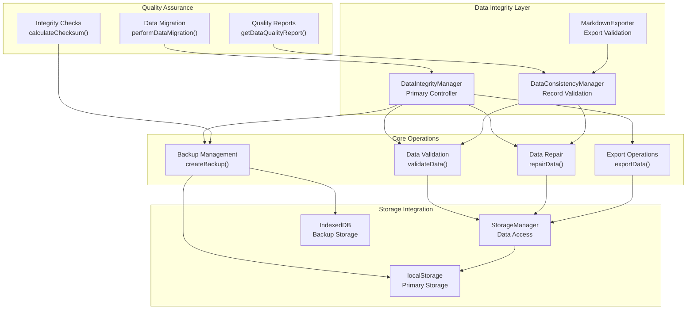
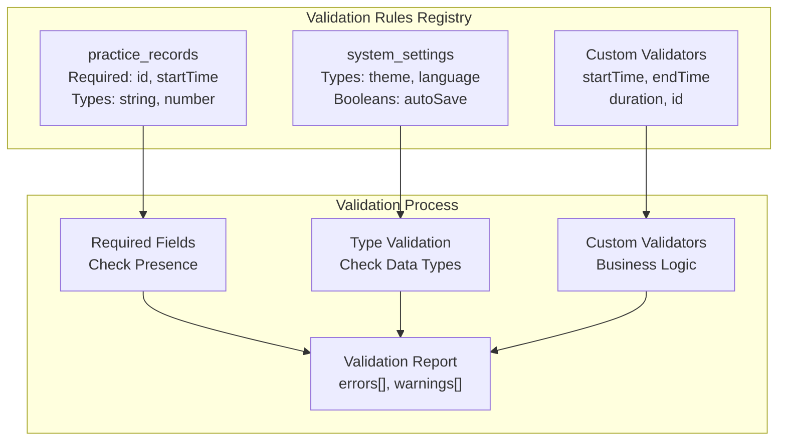
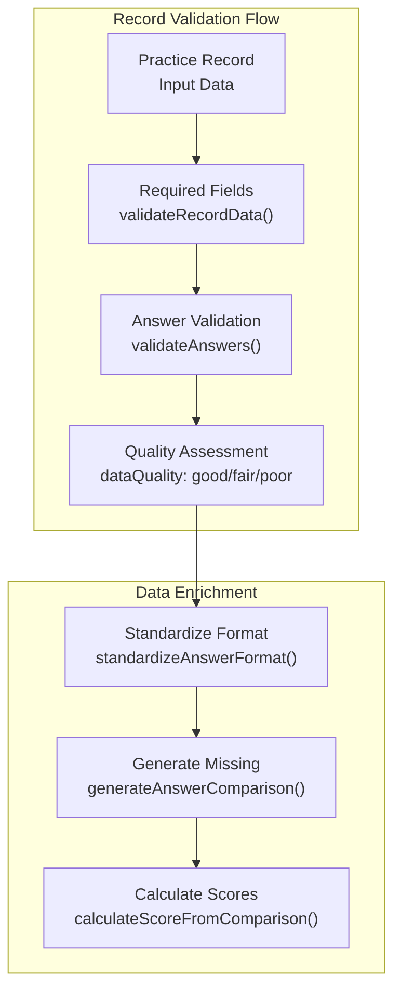
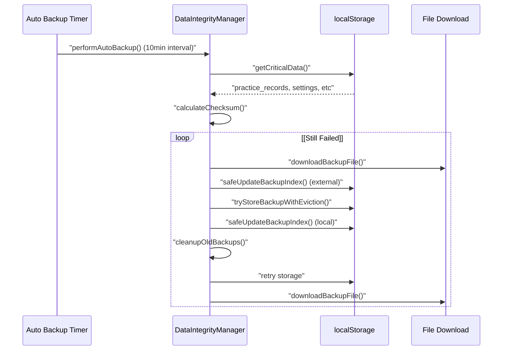
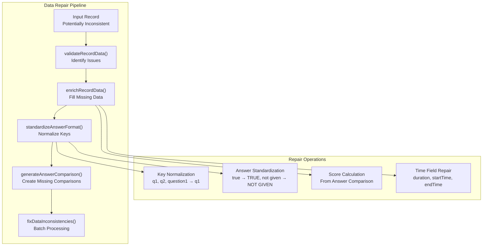
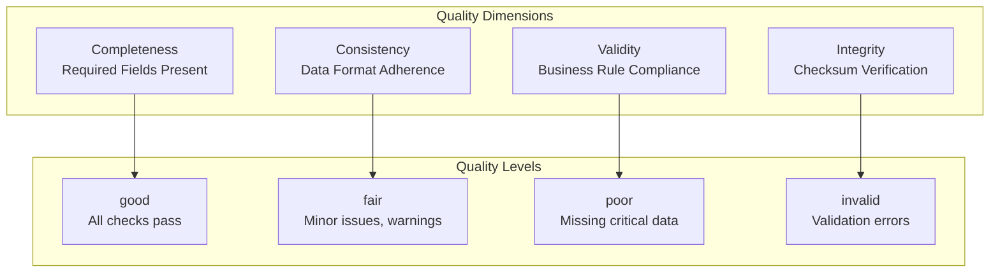
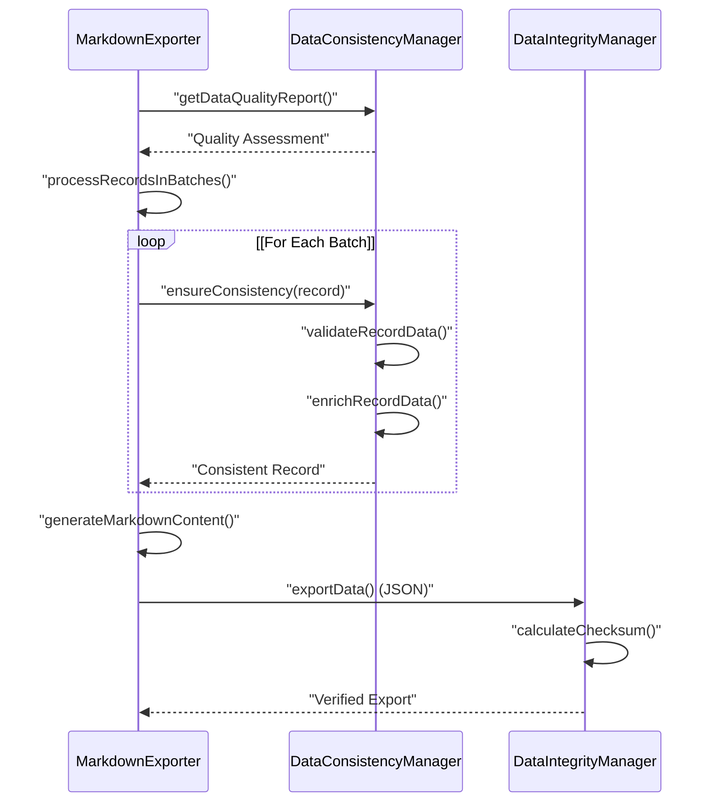
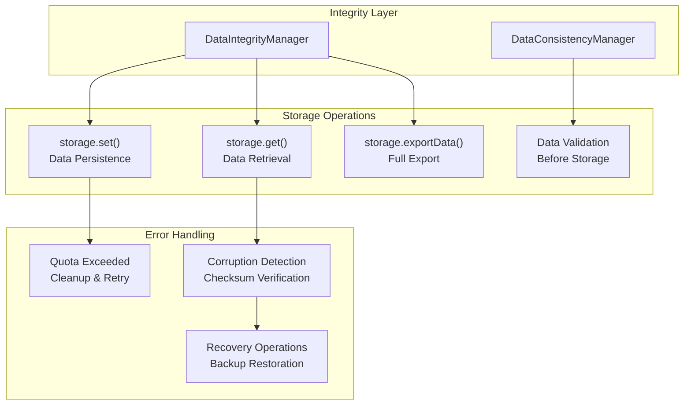

# Data Integrity & Quality Management

> **Relevant source files**
> * [assets/developer wiki/hp-overview-usage-todo.md](https://github.com/sallowayma-git/IELTS-practice/blob/df0c9b8f/assets/developer wiki/hp-overview-usage-todo.md)
> * [js/components/DataIntegrityManager.js](https://github.com/sallowayma-git/IELTS-practice/blob/df0c9b8f/js/components/DataIntegrityManager.js)
> * [js/components/dataManagementPanel.js](https://github.com/sallowayma-git/IELTS-practice/blob/df0c9b8f/js/components/dataManagementPanel.js)
> * [js/data/index.js](https://github.com/sallowayma-git/IELTS-practice/blob/df0c9b8f/js/data/index.js)
> * [js/script.js](https://github.com/sallowayma-git/IELTS-practice/blob/df0c9b8f/js/script.js)
> * [js/utils/dataBackupManager.js](https://github.com/sallowayma-git/IELTS-practice/blob/df0c9b8f/js/utils/dataBackupManager.js)
> * [js/utils/helpers.js](https://github.com/sallowayma-git/IELTS-practice/blob/df0c9b8f/js/utils/helpers.js)
> * [js/utils/simpleStorageWrapper.js](https://github.com/sallowayma-git/IELTS-practice/blob/df0c9b8f/js/utils/simpleStorageWrapper.js)
> * [js/views/legacyViewBundle.js](https://github.com/sallowayma-git/IELTS-practice/blob/df0c9b8f/js/views/legacyViewBundle.js)

This document covers the comprehensive data integrity and quality management system that ensures the reliability, consistency, and recoverability of practice session data in the IELTS system. The system provides automated validation, backup creation, data repair mechanisms, and quality assurance reporting.

For information about the underlying storage persistence mechanisms, see [Storage Manager & Persistence](/sallowayma-git/IELTS-practice/4.1-repository-architecture-and-data-layer). For details about data import/export operations, see [Data Backup & Import/Export](/sallowayma-git/IELTS-practice/4.2-data-backup-and-importexport).

## System Overview

The data integrity system operates through three primary components that work together to maintain data quality and system reliability:

**Sources:** [js/components/DataIntegrityManager.js L1-L918](https://github.com/sallowayma-git/IELTS-practice/blob/df0c9b8f/js/components/DataIntegrityManager.js#L1-L918)

 [js/utils/dataConsistencyManager.js L1-L417](https://github.com/sallowayma-git/IELTS-practice/blob/df0c9b8f/js/utils/dataConsistencyManager.js#L1-L417)

 [js/utils/markdownExporter.js L1-L834](https://github.com/sallowayma-git/IELTS-practice/blob/df0c9b8f/js/utils/markdownExporter.js#L1-L834)

## Data Validation System

The validation system implements a comprehensive rule-based approach to ensure data integrity across different record types:

### Validation Rules Architecture

The `DataIntegrityManager` registers default validation rules during initialization through `registerDefaultValidationRules()`:

* **Practice Records**: Require `id` and `startTime`, validate date formats and numeric constraints
* **System Settings**: Enforce proper theme strings and boolean flags
* **Custom Validators**: Implement business logic for timestamps and durations

**Sources:** [js/components/DataIntegrityManager.js L28-L60](https://github.com/sallowayma-git/IELTS-practice/blob/df0c9b8f/js/components/DataIntegrityManager.js#L28-L60)

 [js/components/DataIntegrityManager.js L411-L465](https://github.com/sallowayma-git/IELTS-practice/blob/df0c9b8f/js/components/DataIntegrityManager.js#L411-L465)

### Record Consistency Validation

The `DataConsistencyManager` provides specialized validation for practice records:

The validation process checks for required fields (`id`, `startTime`, `answers`), validates answer key formats, and assesses overall data quality based on completeness and consistency.

**Sources:** [js/utils/dataConsistencyManager.js L17-L71](https://github.com/sallowayma-git/IELTS-practice/blob/df0c9b8f/js/utils/dataConsistencyManager.js#L17-L71)

 [js/utils/dataConsistencyManager.js L221-L261](https://github.com/sallowayma-git/IELTS-practice/blob/df0c9b8f/js/utils/dataConsistencyManager.js#L221-L261)

## Backup and Recovery System

The backup system provides automated data protection with configurable intervals and quota management:

### Backup Lifecycle Management

The system maintains up to 5 backups by default (`maxBackups`) and automatically handles storage quota exceeded errors through progressive cleanup and fallback to file downloads.

**Sources:** [js/components/DataIntegrityManager.js L91-L215](https://github.com/sallowayma-git/IELTS-practice/blob/df0c9b8f/js/components/DataIntegrityManager.js#L91-L215)

 [js/components/DataIntegrityManager.js L263-L294](https://github.com/sallowayma-git/IELTS-practice/blob/df0c9b8f/js/components/DataIntegrityManager.js#L263-L294)

### Backup Index Management

The backup index tracks both local storage and external file backups:

| Field | Type | Description |
| --- | --- | --- |
| `id` | string | Unique backup identifier |
| `timestamp` | string | ISO datetime of creation |
| `type` | string | `auto`, `manual`, `pre_restore`, `pre_migration` |
| `location` | string | `localStorage` or `download` |
| `size` | number | Backup data size in bytes |
| `checksum` | string | Data integrity hash |

**Sources:** [js/components/DataIntegrityManager.js L237-L261](https://github.com/sallowayma-git/IELTS-practice/blob/df0c9b8f/js/components/DataIntegrityManager.js#L237-L261)

 [js/components/DataIntegrityManager.js L353-L360](https://github.com/sallowayma-git/IELTS-practice/blob/df0c9b8f/js/components/DataIntegrityManager.js#L353-L360)

## Data Repair Mechanisms

The system implements automatic data repair for common consistency issues:

### Repair Process Flow

The repair system handles several common data inconsistencies:

* **Key Format Standardization**: Converts `question1` to `q1`, numeric keys to `q{number}`
* **Answer Value Normalization**: Standardizes boolean and common IELTS answer formats
* **Missing Field Population**: Generates `answerComparison` from user and correct answers
* **Score Reconciliation**: Ensures consistency between different score representations

**Sources:** [js/utils/dataConsistencyManager.js L76-L183](https://github.com/sallowayma-git/IELTS-practice/blob/df0c9b8f/js/utils/dataConsistencyManager.js#L76-L183)

 [js/utils/dataConsistencyManager.js L188-L216](https://github.com/sallowayma-git/IELTS-practice/blob/df0c9b8f/js/utils/dataConsistencyManager.js#L188-L216)

 [js/utils/dataConsistencyManager.js L331-L348](https://github.com/sallowayma-git/IELTS-practice/blob/df0c9b8f/js/utils/dataConsistencyManager.js#L331-L348)

## Quality Management and Reporting

The system provides comprehensive quality assessment and reporting capabilities:

### Quality Assessment Metrics

The `getDataQualityReport()` function provides detailed metrics:

| Metric | Description |
| --- | --- |
| `totalRecords` | Total number of practice records |
| `validRecords` | Records passing validation |
| `recordsWithCorrectAnswers` | Records with answer keys |
| `recordsWithComparison` | Records with comparison data |
| `averageAnswerCount` | Mean answers per record |
| `qualityDistribution` | Count by quality level |

**Sources:** [js/utils/dataConsistencyManager.js L368-L413](https://github.com/sallowayma-git/IELTS-practice/blob/df0c9b8f/js/utils/dataConsistencyManager.js#L368-L413)

 [js/components/DataIntegrityManager.js L893-L908](https://github.com/sallowayma-git/IELTS-practice/blob/df0c9b8f/js/components/DataIntegrityManager.js#L893-L908)

## Export Data Integrity

The export system ensures data consistency during markdown and JSON export operations:

### Export Validation Pipeline

The export process includes:

* **Pre-export Validation**: Quality assessment and batch repair
* **Data Consistency Enforcement**: Answer comparison generation and score reconciliation
* **Progress Tracking**: Non-blocking batch processing with UI updates
* **Integrity Verification**: Checksum calculation for exported data

**Sources:** [js/utils/markdownExporter.js L126-L215](https://github.com/sallowayma-git/IELTS-practice/blob/df0c9b8f/js/utils/markdownExporter.js#L126-L215)

 [js/utils/markdownExporter.js L220-L246](https://github.com/sallowayma-git/IELTS-practice/blob/df0c9b8f/js/utils/markdownExporter.js#L220-L246)

 [js/components/DataIntegrityManager.js L533-L622](https://github.com/sallowayma-git/IELTS-practice/blob/df0c9b8f/js/components/DataIntegrityManager.js#L533-L622)

## Integration with Storage System

The data integrity components integrate closely with the storage layer:

### Storage Integration Points

The integration ensures that all storage operations are validated and that data corruption is detected early through checksum verification and structural validation.

**Sources:** [js/components/DataIntegrityManager.js L106-L127](https://github.com/sallowayma-git/IELTS-practice/blob/df0c9b8f/js/components/DataIntegrityManager.js#L106-L127)

 [js/components/DataIntegrityManager.js L950-L1039](https://github.com/sallowayma-git/IELTS-practice/blob/df0c9b8f/js/components/DataIntegrityManager.js#L950-L1039)

 [js/utils/dataConsistencyManager.js L353-L363](https://github.com/sallowayma-git/IELTS-practice/blob/df0c9b8f/js/utils/dataConsistencyManager.js#L353-L363)