# Data Management System

> **Relevant source files**
> * [assets/developer wiki/hp-overview-usage-todo.md](https://github.com/sallowayma-git/IELTS-practice/blob/df0c9b8f/assets/developer wiki/hp-overview-usage-todo.md)
> * [js/components/DataIntegrityManager.js](https://github.com/sallowayma-git/IELTS-practice/blob/df0c9b8f/js/components/DataIntegrityManager.js)
> * [js/components/dataManagementPanel.js](https://github.com/sallowayma-git/IELTS-practice/blob/df0c9b8f/js/components/dataManagementPanel.js)
> * [js/data/index.js](https://github.com/sallowayma-git/IELTS-practice/blob/df0c9b8f/js/data/index.js)
> * [js/script.js](https://github.com/sallowayma-git/IELTS-practice/blob/df0c9b8f/js/script.js)
> * [js/utils/dataBackupManager.js](https://github.com/sallowayma-git/IELTS-practice/blob/df0c9b8f/js/utils/dataBackupManager.js)
> * [js/utils/helpers.js](https://github.com/sallowayma-git/IELTS-practice/blob/df0c9b8f/js/utils/helpers.js)
> * [js/utils/simpleStorageWrapper.js](https://github.com/sallowayma-git/IELTS-practice/blob/df0c9b8f/js/utils/simpleStorageWrapper.js)
> * [js/views/legacyViewBundle.js](https://github.com/sallowayma-git/IELTS-practice/blob/df0c9b8f/js/views/legacyViewBundle.js)

The data management system provides a three-tier architecture for data persistence, backup, and integrity validation. The system consists of: (1) a repository layer abstracting storage operations, (2) backup and import/export managers for data portability, and (3) integrity managers for automatic backups and consistency checks. Legacy compatibility bridges ensure backward compatibility with global variables.

Related pages: [Repository Architecture & Data Layer](/sallowayma-git/IELTS-practice/4.1-repository-architecture-and-data-layer), [Data Backup & Import/Export](/sallowayma-git/IELTS-practice/4.2-data-backup-and-importexport), [Data Integrity & Quality Management](/sallowayma-git/IELTS-practice/4.3-data-integrity-and-quality-management), [Legacy Compatibility & State Bridges](/sallowayma-git/IELTS-practice/4.4-legacy-compatibility-and-state-bridges)

## Architecture Overview

The data management system implements a repository pattern with specialized managers for different data operations. The architecture separates concerns between storage, validation, backup, and user-facing operations.

### Three-Tier Data Architecture

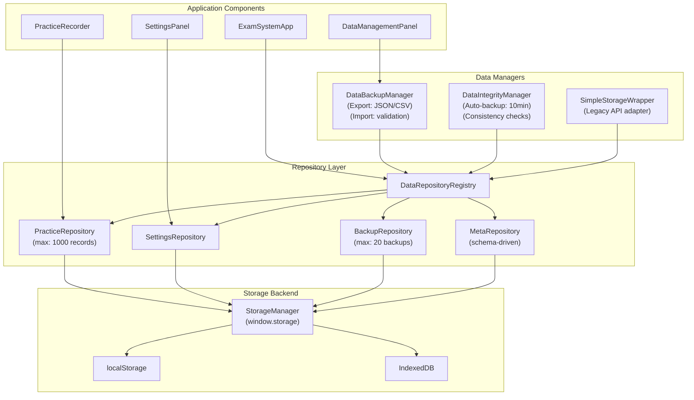

**Sources:** [js/data/index.js L20-L118](https://github.com/sallowayma-git/IELTS-practice/blob/df0c9b8f/js/data/index.js#L20-L118)

 [js/utils/dataBackupManager.js L5-L29](https://github.com/sallowayma-git/IELTS-practice/blob/df0c9b8f/js/utils/dataBackupManager.js#L5-L29)

 [js/components/DataIntegrityManager.js L6-L23](https://github.com/sallowayma-git/IELTS-practice/blob/df0c9b8f/js/components/DataIntegrityManager.js#L6-L23)

 [js/utils/simpleStorageWrapper.js L2-L64](https://github.com/sallowayma-git/IELTS-practice/blob/df0c9b8f/js/utils/simpleStorageWrapper.js#L2-L64)

### Core Data Types

The system manages four primary data types through specialized repositories:

| Repository | Storage Key | Max Records | Purpose | Validation |
| --- | --- | --- | --- | --- |
| `PracticeRepository` | `practice_records` | 1000 | User practice session history | Required: id, startTime |
| `SettingsRepository` | `user_settings` | N/A | User preferences and configuration | Type-based validation |
| `BackupRepository` | `backup_*` | 20 | System state snapshots | Auto-pruning |
| `MetaRepository` | Various keys | N/A | Schema-driven metadata storage | Per-key validators |

**Sources:** [js/data/index.js L34-L82](https://github.com/sallowayma-git/IELTS-practice/blob/df0c9b8f/js/data/index.js#L34-L82)

 [js/components/DataIntegrityManager.js L162-L192](https://github.com/sallowayma-git/IELTS-practice/blob/df0c9b8f/js/components/DataIntegrityManager.js#L162-L192)

</old_str>
<new_str>

## Repository Initialization and Bootstrap

The data layer initializes through a multi-phase bootstrap process that ensures storage availability before creating repositories.

### Bootstrap Flow

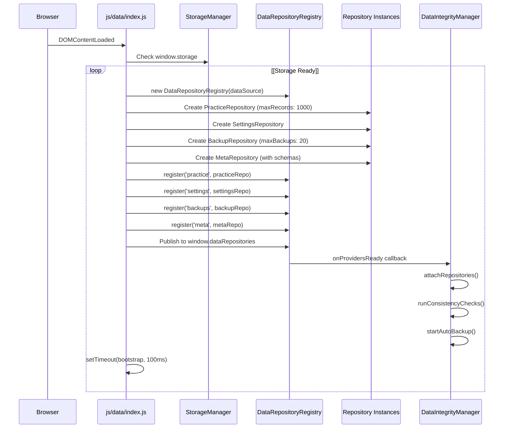

**Sources:** [js/data/index.js L20-L118](https://github.com/sallowayma-git/IELTS-practice/blob/df0c9b8f/js/data/index.js#L20-L118)

 [js/components/DataIntegrityManager.js L25-L87](https://github.com/sallowayma-git/IELTS-practice/blob/df0c9b8f/js/components/DataIntegrityManager.js#L25-L87)

### Repository Schema Configuration

The `MetaRepository` uses schema-driven storage with per-key validation rules defined at initialization:

```javascript
// Example schema from js/data/index.js:37-82
const metaRepo = new ExamData.MetaRepository(dataSource, {
    user_stats: {
        defaultValue: createDefaultUserStats,
        validators: [(value) => (value && typeof value === 'object' && !Array.isArray(value)) || 'user_stats must be object']
    },
    active_sessions: {
        defaultValue: () => [],
        validators: [(value) => Array.isArray(value) || 'active_sessions must be array']
    },
    exam_index: {
        defaultValue: () => [],
        validators: [(value) => Array.isArray(value) || 'exam_index must be array']
    }
});
```

**Sources:** [js/data/index.js L37-L82](https://github.com/sallowayma-git/IELTS-practice/blob/df0c9b8f/js/data/index.js#L37-L82)

## Data Backup and Export System

The `DataBackupManager` class provides comprehensive export, import, and backup functionality with support for JSON and CSV formats. It handles data normalization, validation, and merge strategies.

### Export Capabilities

The system supports flexible export options with filtering and format selection:

| Export Option | Type | Purpose | Default |
| --- | --- | --- | --- |
| `format` | `'json' \| 'csv'` | Output format | `'json'` |
| `includeStats` | `boolean` | Include user statistics | `true` |
| `includeBackups` | `boolean` | Include backup data | `false` |
| `dateRange` | `{startDate, endDate}` | Filter by date range | `null` |
| `categories` | `string[]` | Filter by exam categories | `null` |

**Sources:** [js/utils/dataBackupManager.js L49-L115](https://github.com/sallowayma-git/IELTS-practice/blob/df0c9b8f/js/utils/dataBackupManager.js#L49-L115)

### Export Process Flow

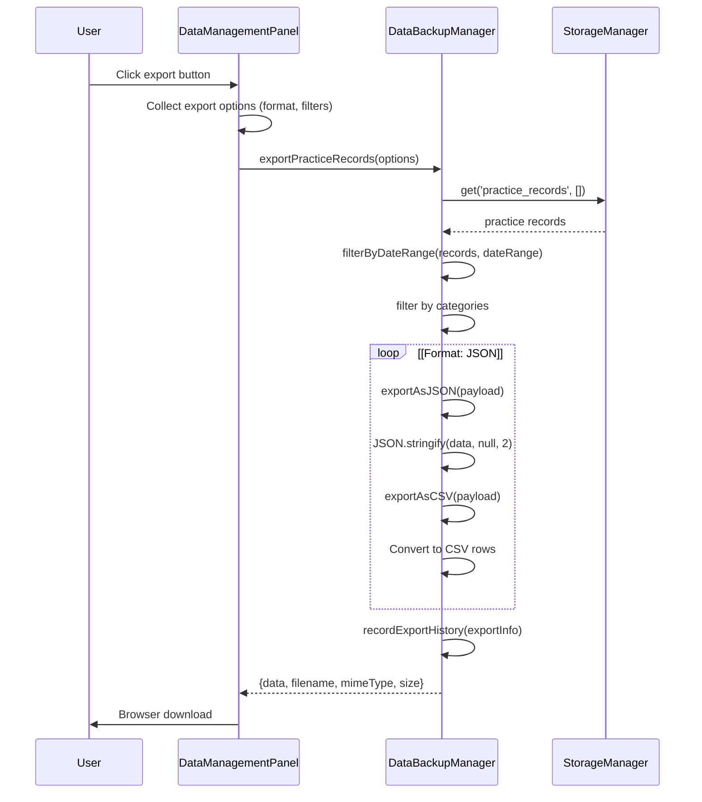

**Sources:** [js/utils/dataBackupManager.js L49-L175](https://github.com/sallowayma-git/IELTS-practice/blob/df0c9b8f/js/utils/dataBackupManager.js#L49-L175)

 [js/components/dataManagementPanel.js L439-L473](https://github.com/sallowayma-git/IELTS-practice/blob/df0c9b8f/js/components/dataManagementPanel.js#L439-L473)

### Import and Data Merging

The import system uses a sophisticated parsing and normalization pipeline that handles multiple data formats and structures.

#### Import Source Parsing

The `parseImportSource` method accepts multiple input types:

| Input Type | Handling | Notes |
| --- | --- | --- |
| `File` | Read as text, parse JSON | Via FileReader API |
| `Blob` | Read as text, parse JSON | Converted to text first |
| `string` (JSON) | Direct JSON.parse | Detected by `startsWith('{')` or `'<FileRef file-url="https://github.com/sallowayma-git/IELTS-practice/blob/df0c9b8f/'` |

#### Normalization Pipeline

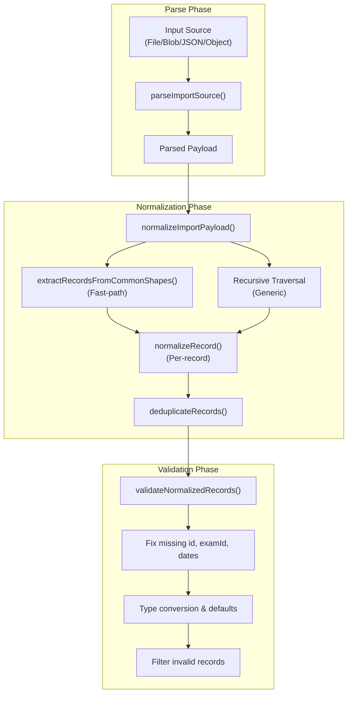

**Sources:** [js/utils/dataBackupManager.js L271-L314](https://github.com/sallowayma-git/IELTS-practice/blob/df0c9b8f/js/utils/dataBackupManager.js#L271-L314)

 [js/utils/dataBackupManager.js L316-L433](https://github.com/sallowayma-git/IELTS-practice/blob/df0c9b8f/js/utils/dataBackupManager.js#L316-L433)

 [js/utils/dataBackupManager.js L789-L893](https://github.com/sallowayma-git/IELTS-practice/blob/df0c9b8f/js/utils/dataBackupManager.js#L789-L893)

 [js/utils/dataBackupManager.js L450-L506](https://github.com/sallowayma-git/IELTS-practice/blob/df0c9b8f/js/utils/dataBackupManager.js#L450-L506)

#### Merge Strategies

The import system supports three merge modes when handling duplicate records:

```mermaid
sequenceDiagram
  participant Import Process
  participant mergePracticeRecords()
  participant StorageManager

  Import Process->>mergePracticeRecords(): mergePracticeRecords(newRecords, mergeMode)
  mergePracticeRecords()->>StorageManager: get('practice_records', [])
  StorageManager-->>mergePracticeRecords(): existing records
  mergePracticeRecords()->>mergePracticeRecords(): Build indexMap by record ID
  loop [incoming timestamp >= existing]
    mergePracticeRecords()->>StorageManager: set('practice_records', newRecords)
    mergePracticeRecords()->>mergePracticeRecords(): Check if ID exists in indexMap
    mergePracticeRecords()->>mergePracticeRecords(): Compare timestamps
    mergePracticeRecords()->>mergePracticeRecords(): mergeRecordDetails() and update
    note over mergePracticeRecords(): updatedCount++
    note over mergePracticeRecords(): skippedCount++
    mergePracticeRecords()->>mergePracticeRecords(): Add to mergedRecords
    note over mergePracticeRecords(): importedCount++
    mergePracticeRecords()->>mergePracticeRecords(): Sort by timestamp
    mergePracticeRecords()->>StorageManager: set('practice_records', mergedRecords)
    note over mergePracticeRecords(): skippedCount++
    mergePracticeRecords()->>mergePracticeRecords(): Add to mergedRecords
    note over mergePracticeRecords(): importedCount++
    mergePracticeRecords()->>StorageManager: set('practice_records', mergedRecords)
  end
  mergePracticeRecords()-->>Import Process: {importedCount, updatedCount, skippedCount, finalCount}
```

**Sources:** [js/utils/dataBackupManager.js L508-L578](https://github.com/sallowayma-git/IELTS-practice/blob/df0c9b8f/js/utils/dataBackupManager.js#L508-L578)

 [js/utils/dataBackupManager.js L619-L664](https://github.com/sallowayma-git/IELTS-practice/blob/df0c9b8f/js/utils/dataBackupManager.js#L619-L664)

### Record Normalization Details

The `normalizeRecord` method performs comprehensive field mapping and type coercion to handle various input formats:

**Field Mapping Strategy:**

```javascript
// ID resolution priority (from js/utils/dataBackupManager.js:789-806)
const sourceId = record.id ?? record.recordId ?? record.practiceId ?? 
                 record.sessionId ?? record.timestamp ?? record.uuid;

// Exam ID resolution
const examId = record.examId ?? record.exam_id ?? record.examID ?? 
               record.examName ?? record.title ?? record.name;

// Date field resolution with multiple fallbacks
const startTimeRaw = record.startTime ?? record.start_time ?? 
                     record.startedAt ?? record.createdAt ?? 
                     record.timestamp ?? record.date;

// Duration extraction from multiple possible locations
const candidates = [
    record.duration, 
    record.realData?.duration,
    record.durationSeconds,
    record.scoreInfo?.duration,
    // ... multiple other sources
];
```

**Sources:** [js/utils/dataBackupManager.js L789-L893](https://github.com/sallowayma-git/IELTS-practice/blob/df0c9b8f/js/utils/dataBackupManager.js#L789-L893)

 [js/utils/dataBackupManager.js L946-L971](https://github.com/sallowayma-git/IELTS-practice/blob/df0c9b8f/js/utils/dataBackupManager.js#L946-L971)

## Data Integrity Management

The `DataIntegrityManager` class provides automatic backup creation, consistency validation, and quota handling. It initializes alongside the repository layer and runs periodic maintenance tasks.

### Initialization and Repository Attachment

```mermaid
sequenceDiagram
  participant DataIntegrityManager
  participant constructor
  participant StorageProviderRegistry
  participant Repository Layer
  participant initializeWithRepositories()

  DataIntegrityManager->>DataIntegrityManager: registerDefaultValidationRules()
  DataIntegrityManager->>StorageProviderRegistry: onProvidersReady(callback)
  loop [Repositories already ready]
    StorageProviderRegistry->>DataIntegrityManager: Invoke callback immediately
    DataIntegrityManager->>initializeWithRepositories(): attachRepositories(repositories)
    note over StorageProviderRegistry: Wait for repositories
    StorageProviderRegistry->>DataIntegrityManager: Invoke callback when ready
    DataIntegrityManager->>initializeWithRepositories(): attachRepositories(repositories)
  end
  initializeWithRepositories()->>Repository Layer: runConsistencyChecks()
  Repository Layer-->>initializeWithRepositories(): consistencyReport
  initializeWithRepositories()->>initializeWithRepositories(): startAutoBackup() (every 10min)
  initializeWithRepositories()->>initializeWithRepositories(): cleanupOldBackups()
  note over initializeWithRepositories(): isInitialized = true
```

**Sources:** [js/components/DataIntegrityManager.js L6-L87](https://github.com/sallowayma-git/IELTS-practice/blob/df0c9b8f/js/components/DataIntegrityManager.js#L6-L87)

### Automatic Backup System

The system performs automatic backups every 10 minutes and maintains up to 5 backup snapshots:

| Configuration | Value | Purpose |
| --- | --- | --- |
| `backupInterval` | 600000ms (10 min) | Frequency of auto-backups |
| `maxBackups` | 5 | Maximum backup retention |
| `dataVersion` | '1.0.0' | Backup format version |

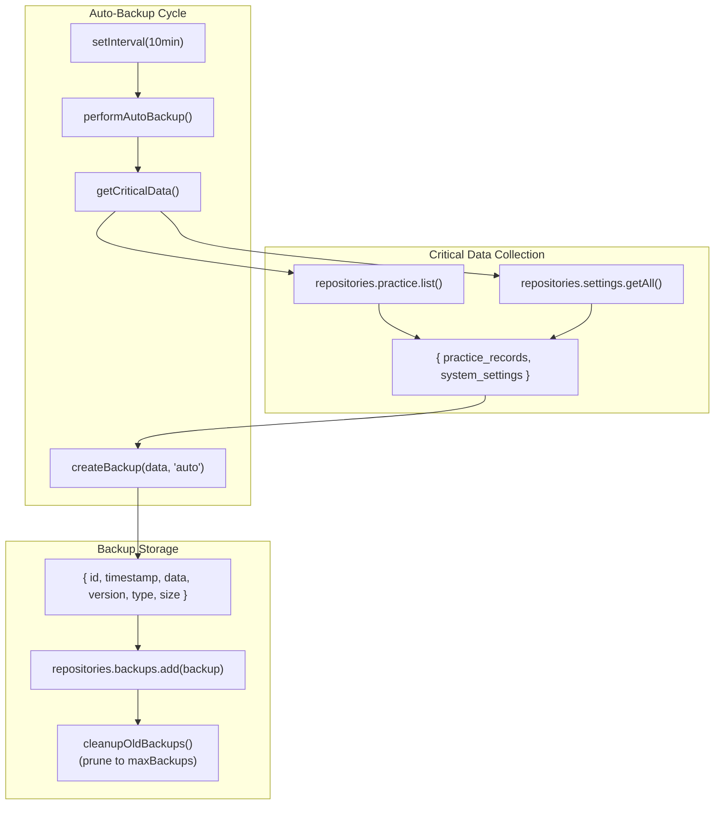

**Sources:** [js/components/DataIntegrityManager.js L194-L224](https://github.com/sallowayma-git/IELTS-practice/blob/df0c9b8f/js/components/DataIntegrityManager.js#L194-L224)

 [js/components/DataIntegrityManager.js L107-L137](https://github.com/sallowayma-git/IELTS-practice/blob/df0c9b8f/js/components/DataIntegrityManager.js#L107-L137)

 [js/components/DataIntegrityManager.js L290-L324](https://github.com/sallowayma-git/IELTS-practice/blob/df0c9b8f/js/components/DataIntegrityManager.js#L290-L324)

### Quota Exceeded Handling

When storage quota is exceeded during backup creation, the system automatically exports data as a downloadable file:

```mermaid
sequenceDiagram
  participant createBackup()
  participant BackupRepository
  participant exportDataAsFallback()
  participant Browser Download

  createBackup()->>BackupRepository: backups.add(backupObj)
  BackupRepository-->>createBackup(): QuotaExceededError
  createBackup()->>exportDataAsFallback(): exportDataAsFallback(data)
  exportDataAsFallback()->>exportDataAsFallback(): Create export object with metadata
  exportDataAsFallback()->>exportDataAsFallback(): new Blob([JSON.stringify(exportObj)])
  exportDataAsFallback()->>exportDataAsFallback(): URL.createObjectURL(blob)
  exportDataAsFallback()->>Browser Download: <a>.click() download
  note over Browser Download: File: ielts-data-backup-quota-YYYY-MM-DD.json
  exportDataAsFallback()->>exportDataAsFallback(): URL.revokeObjectURL(url)
```

**Sources:** [js/components/DataIntegrityManager.js L107-L160](https://github.com/sallowayma-git/IELTS-practice/blob/df0c9b8f/js/components/DataIntegrityManager.js#L107-L160)

### Validation Rules

The `DataIntegrityManager` registers default validation rules for critical data types:

```javascript
// From js/components/DataIntegrityManager.js:162-192
this.validationRules.set('practice_records', {
    required: ['id', 'startTime'],
    types: {
        id: 'string',
        startTime: 'string',
        endTime: 'string',
        duration: 'number',
        examId: 'string'
    },
    validators: {
        startTime: (value) => !isNaN(new Date(value).getTime()),
        duration: (value) => typeof value === 'number' && value >= 0,
        id: (value) => typeof value === 'string' && value.length > 0
    }
});

this.validationRules.set('system_settings', {
    types: {
        theme: 'string',
        language: 'string',
        autoSave: 'boolean',
        notifications: 'boolean'
    }
});
```

**Sources:** [js/components/DataIntegrityManager.js L162-L192](https://github.com/sallowayma-git/IELTS-practice/blob/df0c9b8f/js/components/DataIntegrityManager.js#L162-L192)

## Legacy Compatibility Layer

The system provides backward compatibility with global variables through adapter and bridge classes. This allows incremental refactoring without breaking existing code.

### Legacy State Synchronization

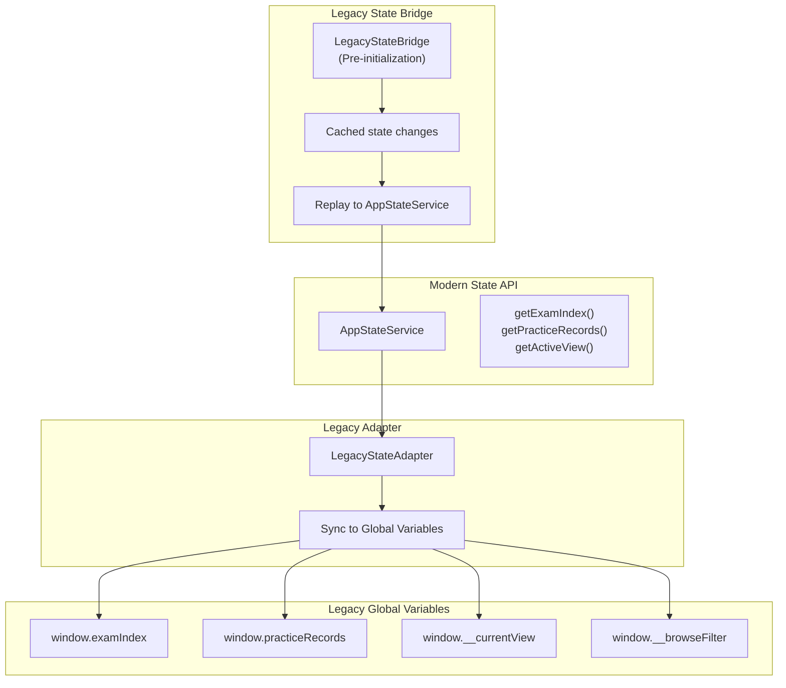

**Sources:** Based on diagram 3 from the high-level architecture overview

### Legacy Fallback Runtime

The `LegacyFallback` system (in `js/script.js`) provides degraded-mode rendering when modern components fail to initialize:

```mermaid
sequenceDiagram
  participant Browser
  participant bootstrapFallbackRuntime()
  participant AppStateService
  participant Legacy Rendering
  participant DOM

  Browser->>bootstrapFallbackRuntime(): DOMContentLoaded
  bootstrapFallbackRuntime()->>AppStateService: getStateService()
  loop [Modern functions exist]
    AppStateService-->>bootstrapFallbackRuntime(): Service instance
    bootstrapFallbackRuntime()->>bootstrapFallbackRuntime(): Check for loadExamList, updatePracticeView
    note over bootstrapFallbackRuntime(): runSmokeCheck('primary-runtime')
    bootstrapFallbackRuntime()-->>Browser: Use modern runtime
    note over bootstrapFallbackRuntime(): runSmokeCheck('fallback-runtime')
    bootstrapFallbackRuntime()->>Legacy Rendering: showViewFallback('overview')
    bootstrapFallbackRuntime()->>Legacy Rendering: renderExamListFallback(exams)
    bootstrapFallbackRuntime()->>Legacy Rendering: renderPracticeOverviewFallback(records)
    Legacy Rendering->>DOM: Render degraded UI
    note over bootstrapFallbackRuntime(): runSmokeCheck('no-service')
    bootstrapFallbackRuntime()-->>Browser: Exit early
  end
```

**Sources:** [js/script.js L107-L148](https://github.com/sallowayma-git/IELTS-practice/blob/df0c9b8f/js/script.js#L107-L148)

### Simple Storage Wrapper

The `SimpleStorageWrapper` provides a legacy-compatible API wrapper around the repository layer:

```python
// From js/utils/simpleStorageWrapper.js:2-37
class SimpleStorageWrapper {
    constructor(repositories) { this.repos = repositories; }
    
    // Practice record methods
    async getPracticeRecords() { return await this.repos.practice.list(); }
    async savePracticeRecords(records) { await this.repos.practice.overwrite(records); }
    async addPracticeRecord(record) { await this.repos.practice.upsert(record); }
    async delete(id) { return await this.repos.practice.removeById(id); }
    
    // Settings methods
    async getUserSettings() { return await this.repos.settings.getAll(); }
    async setUserSetting(key, value) { await this.repos.settings.set(key, value); }
    
    // Backup methods
    async getBackups() { return await this.repos.backups.list(); }
    async addBackup(backup) { await this.repos.backups.add(backup); }
    
    // Meta storage
    async get(key, defaultValue) { return await this.repos.meta.get(key, defaultValue); }
    async set(key, value) { await this.repos.meta.set(key, value); }
}
```

The wrapper automatically connects to repositories when they become available via the `StorageProviderRegistry`.

**Sources:** [js/utils/simpleStorageWrapper.js L2-L64](https://github.com/sallowayma-git/IELTS-practice/blob/df0c9b8f/js/utils/simpleStorageWrapper.js#L2-L64)

## Error Handling and Recovery

### Storage Error Management

The system implements multi-tier error handling for storage operations:

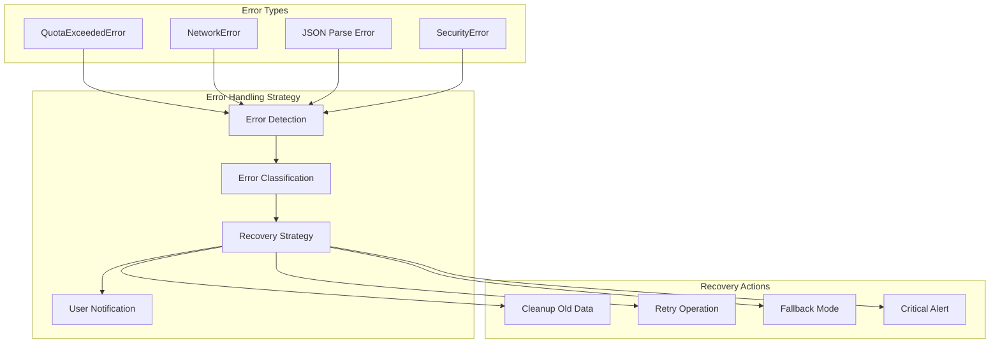

**Sources:** [improved-working-system.html L982-L998](https://github.com/sallowayma-git/IELTS-practice/blob/df0c9b8f/improved-working-system.html#L982-L998)

 [improved-working-system.html L1000-L1016](https://github.com/sallowayma-git/IELTS-practice/blob/df0c9b8f/improved-working-system.html#L1000-L1016)

### Quota Management

The storage system implements intelligent quota management:

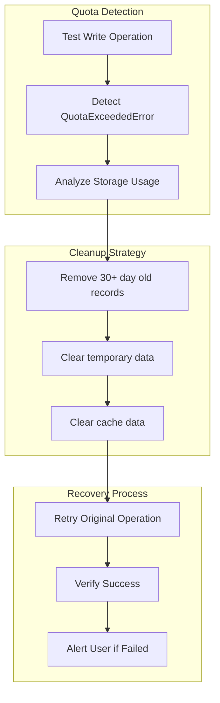

**Sources:** [improved-working-system.html L1002-L1012](https://github.com/sallowayma-git/IELTS-practice/blob/df0c9b8f/improved-working-system.html#L1002-L1012)

## Performance Optimization

### Caching Strategy

The application implements sophisticated caching through the `PerformanceOptimizer` class:

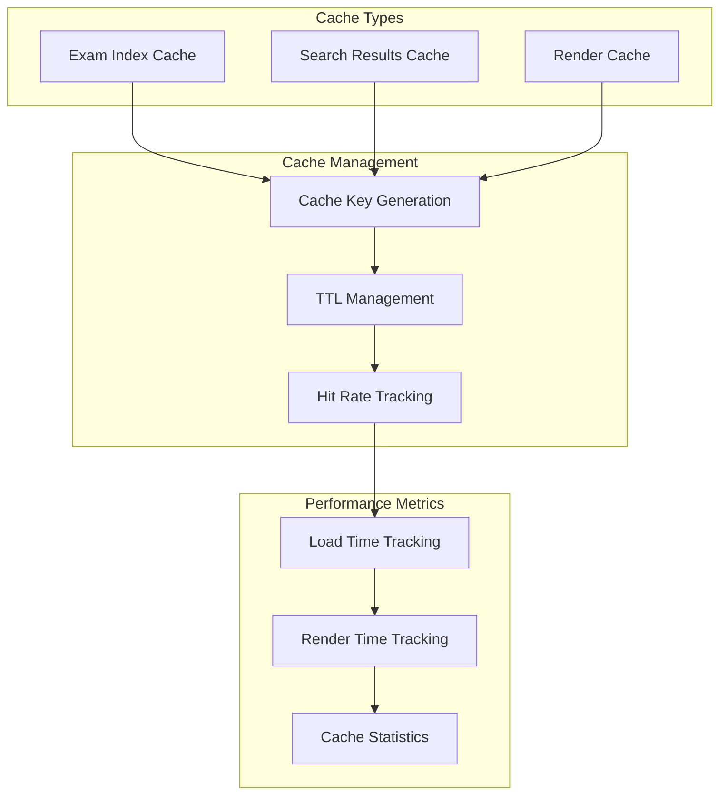

**Sources:** [improved-working-system.html L1162-L1172](https://github.com/sallowayma-git/IELTS-practice/blob/df0c9b8f/improved-working-system.html#L1162-L1172)

 [improved-working-system.html L1432-L1441](https://github.com/sallowayma-git/IELTS-practice/blob/df0c9b8f/improved-working-system.html#L1432-L1441)

### Data Loading Optimization

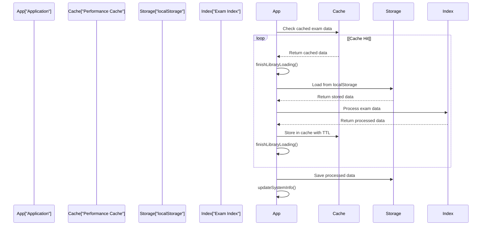

**Sources:** [improved-working-system.html L1159-L1232](https://github.com/sallowayma-git/IELTS-practice/blob/df0c9b8f/improved-working-system.html#L1159-L1232)

 [improved-working-system.html L1236-L1276](https://github.com/sallowayma-git/IELTS-practice/blob/df0c9b8f/improved-working-system.html#L1236-L1276)

## Data Import and Export

### Export Functionality

The system provides comprehensive data export capabilities:

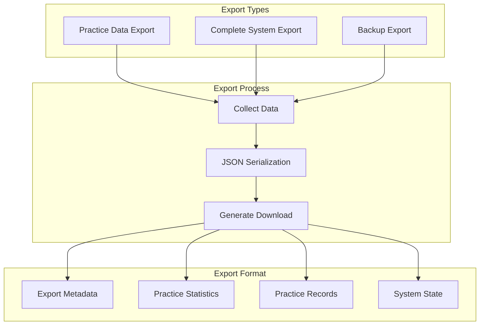

**Sources:** [improved-working-system.html L2489-L2513](https://github.com/sallowayma-git/IELTS-practice/blob/df0c9b8f/improved-working-system.html#L2489-L2513)

 [improved-working-system.html L2027-L2041](https://github.com/sallowayma-git/IELTS-practice/blob/df0c9b8f/improved-working-system.html#L2027-L2041)

### Import and Validation

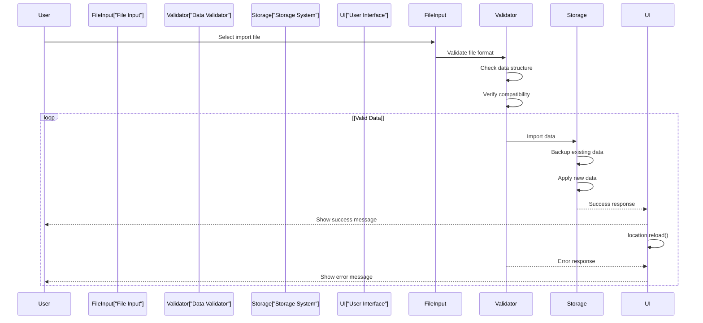

**Sources:** [improved-working-system.html L2044-L2077](https://github.com/sallowayma-git/IELTS-practice/blob/df0c9b8f/improved-working-system.html#L2044-L2077)