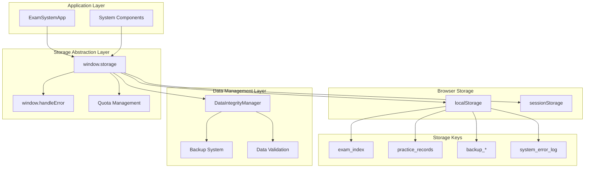
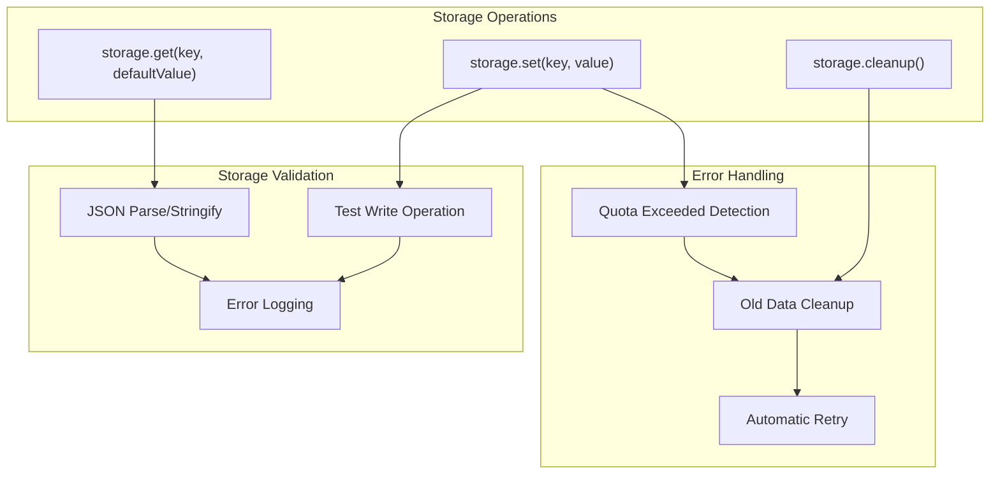
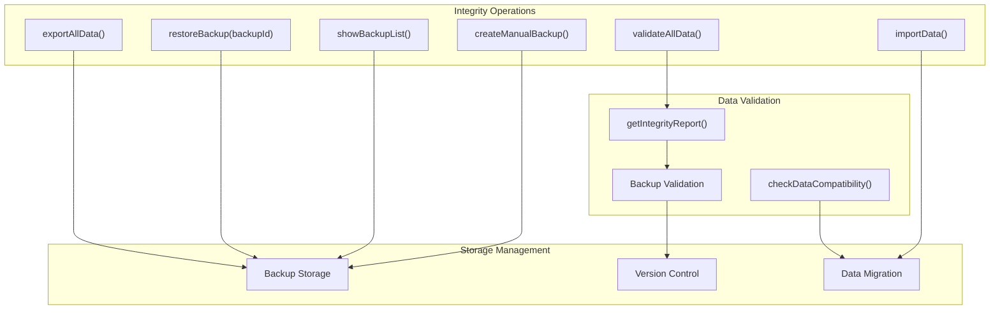
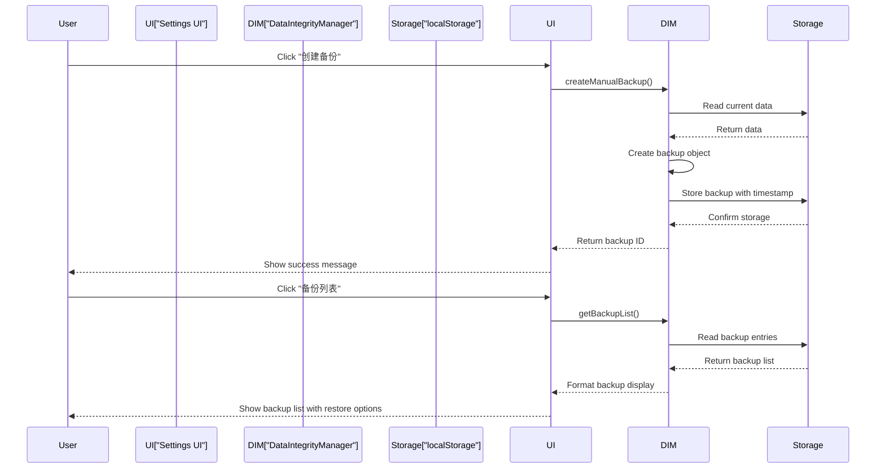
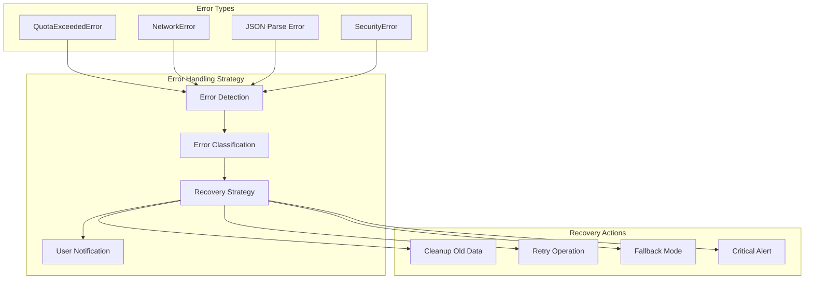
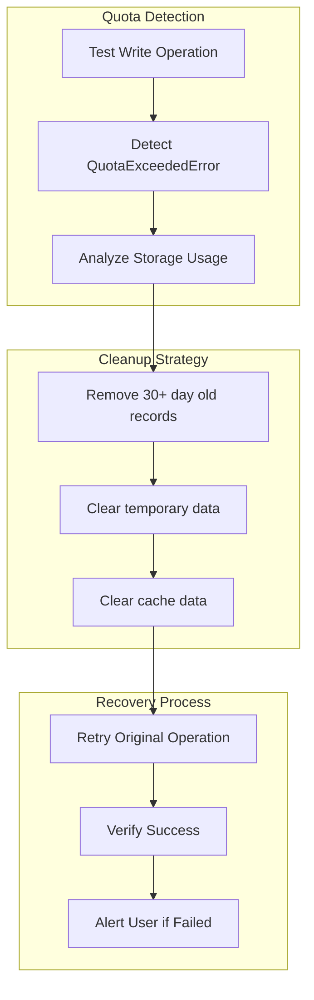
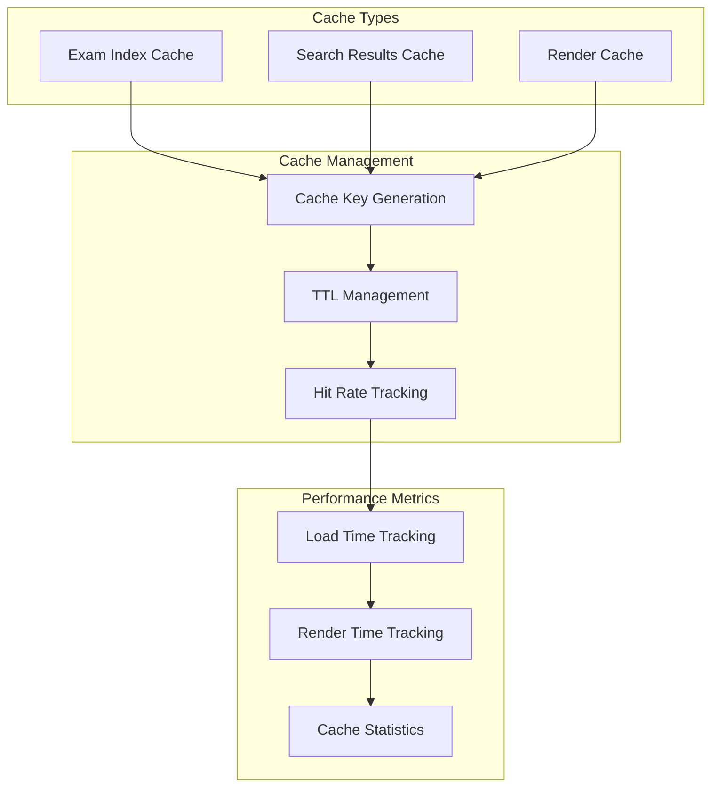
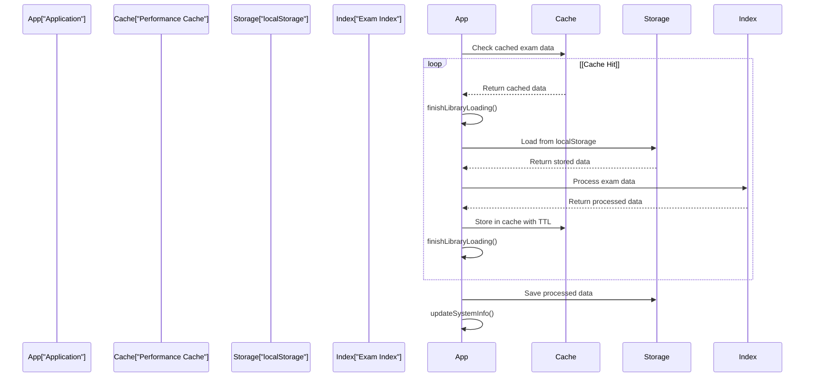
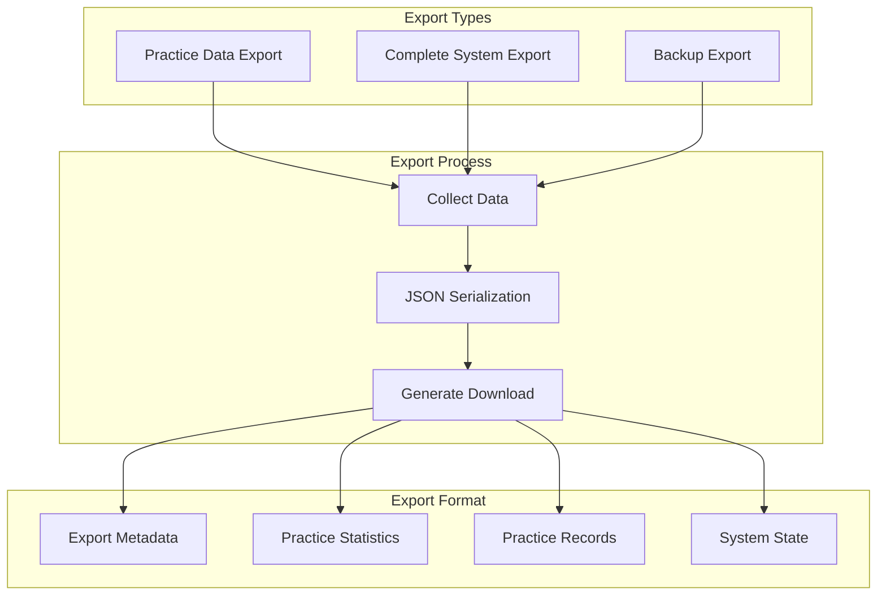
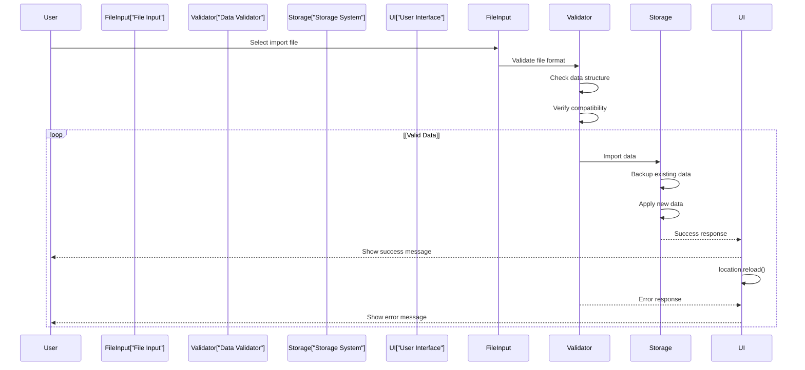

# Data Storage & Integrity

> **Relevant source files**
> * [improved-working-system.html](https://github.com/sallowayma-git/IELTS-practice/blob/db0f538c/improved-working-system.html)

This document covers the data persistence, backup, validation, and integrity management systems within the core IELTS practice application. It details how user practice data, exam indices, and system state are stored, protected, and maintained across browser sessions.

For information about the broader system architecture, see [System Architecture](/sallowayma-git/IELTS-practice/2.1-system-architecture). For details about the practice session data flow, see [Session Communication Protocol](/sallowayma-git/IELTS-practice/6.2-session-communication-protocol).

## Storage Architecture

The application implements a layered storage architecture built on top of browser `localStorage` with comprehensive error handling, quota management, and data integrity features.

### Core Storage Components



**Sources:** [improved-working-system.html L961-L1017](https://github.com/sallowayma-git/IELTS-practice/blob/db0f538c/improved-working-system.html#L961-L1017)

 [improved-working-system.html L2897-L2912](https://github.com/sallowayma-git/IELTS-practice/blob/db0f538c/improved-working-system.html#L2897-L2912)

### Storage Wrapper Implementation

The `window.storage` object provides a safe abstraction over `localStorage` with comprehensive error handling:



**Sources:** [improved-working-system.html L961-L1017](https://github.com/sallowayma-git/IELTS-practice/blob/db0f538c/improved-working-system.html#L961-L1017)

## Data Types and Schema

### Primary Data Entities

| Storage Key | Data Type | Purpose | Retention |
| --- | --- | --- | --- |
| `exam_index` | Array | Complete exam database cache | Indefinite |
| `practice_records` | Array | User practice session history | 30 days default |
| `backup_*` | BackupEntry | System state snapshots | Varies by type |
| `system_error_log` | Array | System error tracking | 50 entries max |
| `exam_browser_error_log` | Array | Browser-specific errors | Varies |

### Practice Record Schema

```css
#mermaid-ppbeodqdtb{font-family:ui-sans-serif,-apple-system,system-ui,Segoe UI,Helvetica;font-size:16px;fill:#333;}@keyframes edge-animation-frame{from{stroke-dashoffset:0;}}@keyframes dash{to{stroke-dashoffset:0;}}#mermaid-ppbeodqdtb .edge-animation-slow{stroke-dasharray:9,5!important;stroke-dashoffset:900;animation:dash 50s linear infinite;stroke-linecap:round;}#mermaid-ppbeodqdtb .edge-animation-fast{stroke-dasharray:9,5!important;stroke-dashoffset:900;animation:dash 20s linear infinite;stroke-linecap:round;}#mermaid-ppbeodqdtb .error-icon{fill:#dddddd;}#mermaid-ppbeodqdtb .error-text{fill:#222222;stroke:#222222;}#mermaid-ppbeodqdtb .edge-thickness-normal{stroke-width:1px;}#mermaid-ppbeodqdtb .edge-thickness-thick{stroke-width:3.5px;}#mermaid-ppbeodqdtb .edge-pattern-solid{stroke-dasharray:0;}#mermaid-ppbeodqdtb .edge-thickness-invisible{stroke-width:0;fill:none;}#mermaid-ppbeodqdtb .edge-pattern-dashed{stroke-dasharray:3;}#mermaid-ppbeodqdtb .edge-pattern-dotted{stroke-dasharray:2;}#mermaid-ppbeodqdtb .marker{fill:#999;stroke:#999;}#mermaid-ppbeodqdtb .marker.cross{stroke:#999;}#mermaid-ppbeodqdtb svg{font-family:ui-sans-serif,-apple-system,system-ui,Segoe UI,Helvetica;font-size:16px;}#mermaid-ppbeodqdtb p{margin:0;}#mermaid-ppbeodqdtb .entityBox{fill:#ffffff;stroke:#dddddd;}#mermaid-ppbeodqdtb .relationshipLabelBox{fill:#dddddd;opacity:0.7;background-color:#dddddd;}#mermaid-ppbeodqdtb .relationshipLabelBox rect{opacity:0.5;}#mermaid-ppbeodqdtb .labelBkg{background-color:rgba(221, 221, 221, 0.5);}#mermaid-ppbeodqdtb .edgeLabel .label{fill:#dddddd;font-size:14px;}#mermaid-ppbeodqdtb .label{font-family:ui-sans-serif,-apple-system,system-ui,Segoe UI,Helvetica;color:#333;}#mermaid-ppbeodqdtb .edge-pattern-dashed{stroke-dasharray:8,8;}#mermaid-ppbeodqdtb .node rect,#mermaid-ppbeodqdtb .node circle,#mermaid-ppbeodqdtb .node ellipse,#mermaid-ppbeodqdtb .node polygon{fill:#ffffff;stroke:#dddddd;stroke-width:1px;}#mermaid-ppbeodqdtb .relationshipLine{stroke:#999;stroke-width:1;fill:none;}#mermaid-ppbeodqdtb .marker{fill:none!important;stroke:#999!important;stroke-width:1;}#mermaid-ppbeodqdtb :root{--mermaid-font-family:"trebuchet ms",verdana,arial,sans-serif;}containsPracticeRecordstringidUnique identifierstringexamIdReference to examstringtitleExam titlestringcategoryP1, P2, or P3stringfrequencyhigh or lowstringdataSourcereal or simulatedbooleanisRealDataData authenticity flagdatetimestartTimeSession startdatetimeendTimeSession enddatetimedateRecord creationnumberscoreQuestions correctnumbertotalQuestionsTotal questionsnumberaccuracyAccuracy percentagenumberpercentageScore percentagenumberdurationDuration in secondsobjectrealDataDetailed session dataRealDatastringsessionIdSession identifierobjectanswersUser answersarrayinteractionsUser interactionsobjectscoreInfoScore calculation detailsstringpageTypePage type identifierstringurlPractice page URLstringsourceData extraction source
```

**Sources:** [improved-working-system.html L3107-L3140](https://github.com/sallowayma-git/IELTS-practice/blob/db0f538c/improved-working-system.html#L3107-L3140)

 [improved-working-system.html L2928-L2953](https://github.com/sallowayma-git/IELTS-practice/blob/db0f538c/improved-working-system.html#L2928-L2953)

## Data Integrity Management

### DataIntegrityManager Integration

The application integrates with a `DataIntegrityManager` class that provides comprehensive data protection:



**Sources:** [improved-working-system.html L2929-L2077](https://github.com/sallowayma-git/IELTS-practice/blob/db0f538c/improved-working-system.html#L2929-L2077)

 [improved-working-system.html L2080-L2148](https://github.com/sallowayma-git/IELTS-practice/blob/db0f538c/improved-working-system.html#L2080-L2148)

### Backup System Architecture



**Sources:** [improved-working-system.html L1929-L1944](https://github.com/sallowayma-git/IELTS-practice/blob/db0f538c/improved-working-system.html#L1929-L1944)

 [improved-working-system.html L1947-L1999](https://github.com/sallowayma-git/IELTS-practice/blob/db0f538c/improved-working-system.html#L1947-L1999)

## Error Handling and Recovery

### Storage Error Management

The system implements multi-tier error handling for storage operations:



**Sources:** [improved-working-system.html L982-L998](https://github.com/sallowayma-git/IELTS-practice/blob/db0f538c/improved-working-system.html#L982-L998)

 [improved-working-system.html L1000-L1016](https://github.com/sallowayma-git/IELTS-practice/blob/db0f538c/improved-working-system.html#L1000-L1016)

### Quota Management

The storage system implements intelligent quota management:



**Sources:** [improved-working-system.html L1002-L1012](https://github.com/sallowayma-git/IELTS-practice/blob/db0f538c/improved-working-system.html#L1002-L1012)

## Performance Optimization

### Caching Strategy

The application implements sophisticated caching through the `PerformanceOptimizer` class:



**Sources:** [improved-working-system.html L1162-L1172](https://github.com/sallowayma-git/IELTS-practice/blob/db0f538c/improved-working-system.html#L1162-L1172)

 [improved-working-system.html L1432-L1441](https://github.com/sallowayma-git/IELTS-practice/blob/db0f538c/improved-working-system.html#L1432-L1441)

### Data Loading Optimization



**Sources:** [improved-working-system.html L1159-L1232](https://github.com/sallowayma-git/IELTS-practice/blob/db0f538c/improved-working-system.html#L1159-L1232)

 [improved-working-system.html L1236-L1276](https://github.com/sallowayma-git/IELTS-practice/blob/db0f538c/improved-working-system.html#L1236-L1276)

## Data Import and Export

### Export Functionality

The system provides comprehensive data export capabilities:



**Sources:** [improved-working-system.html L2489-L2513](https://github.com/sallowayma-git/IELTS-practice/blob/db0f538c/improved-working-system.html#L2489-L2513)

 [improved-working-system.html L2027-L2041](https://github.com/sallowayma-git/IELTS-practice/blob/db0f538c/improved-working-system.html#L2027-L2041)

### Import and Validation



**Sources:** [improved-working-system.html L2044-L2077](https://github.com/sallowayma-git/IELTS-practice/blob/db0f538c/improved-working-system.html#L2044-L2077)