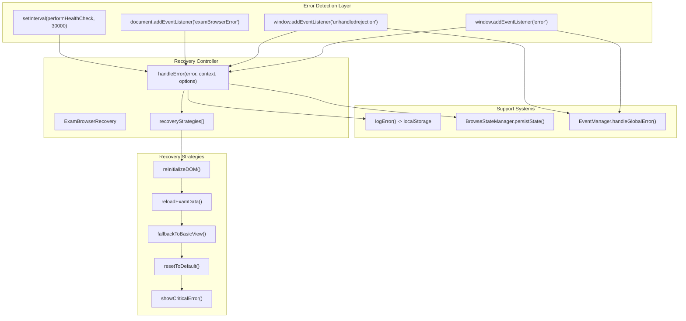
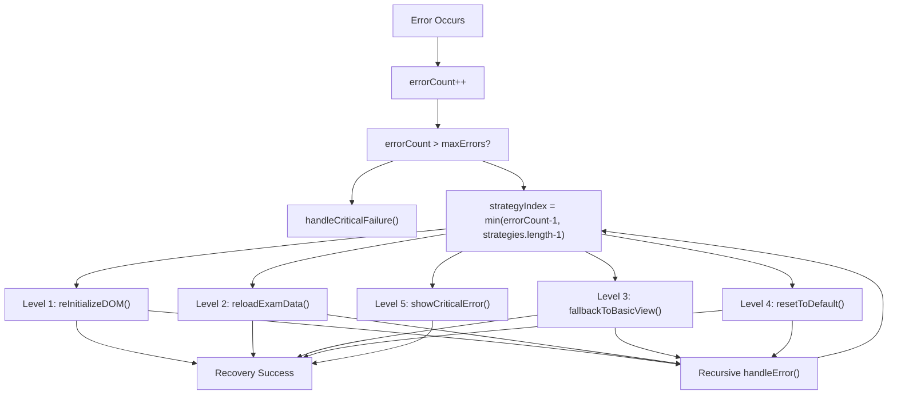
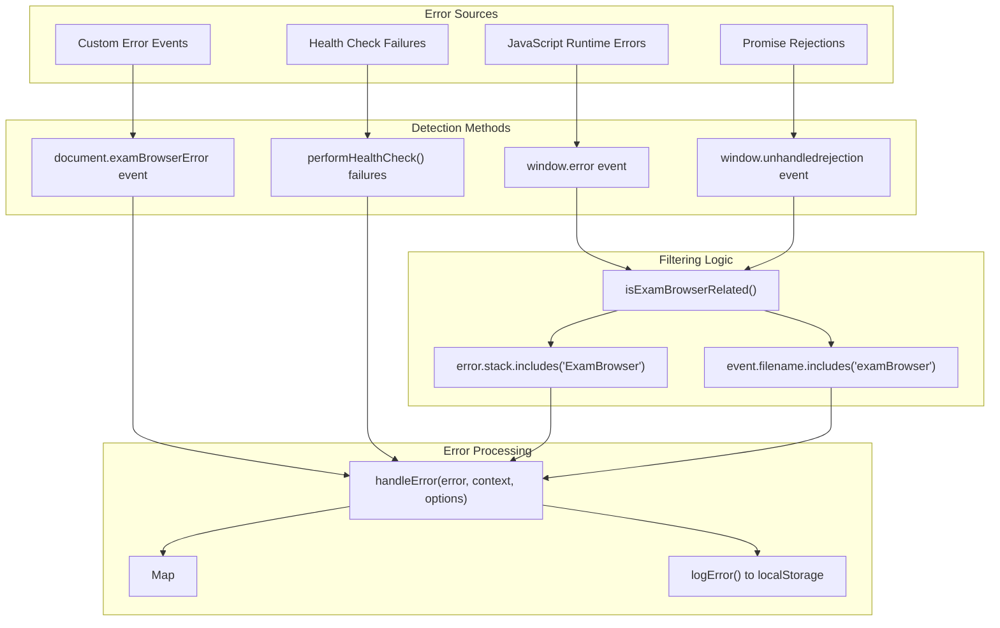
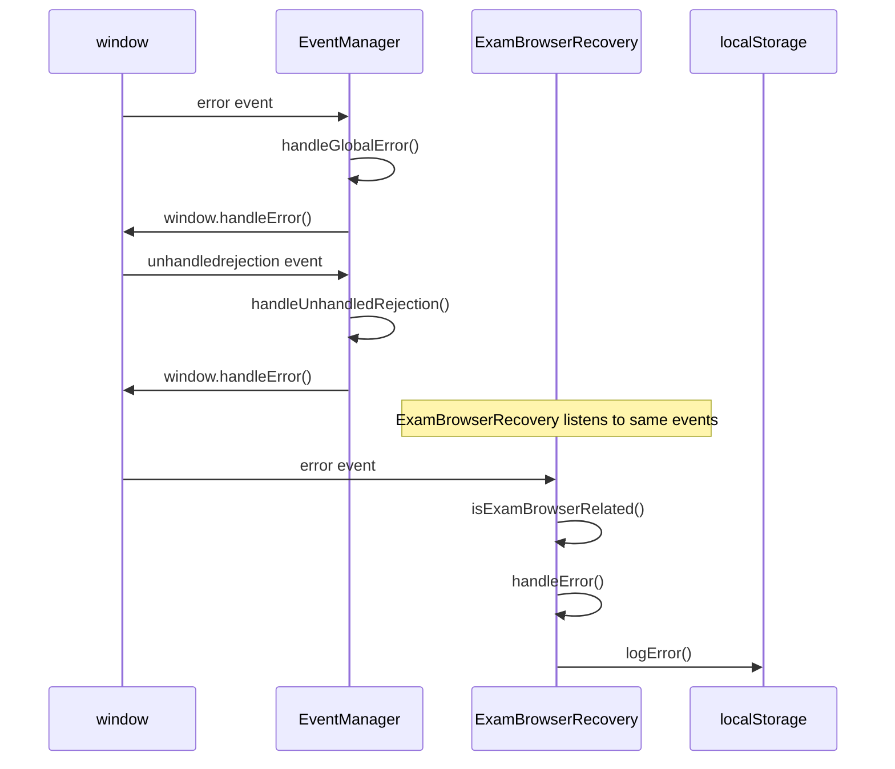
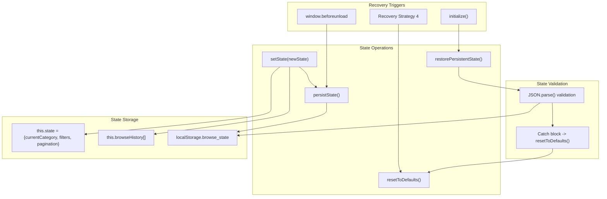
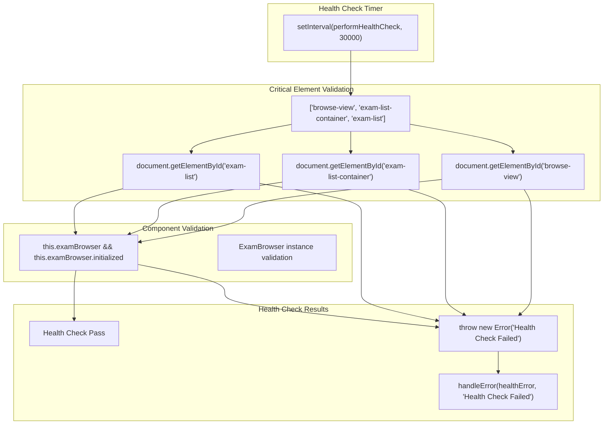
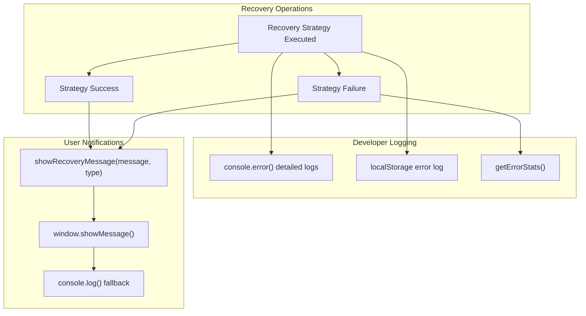

# Error Recovery & Resilience

> **Relevant source files**
> * [index.html](https://github.com/sallowayma-git/IELTS-practice/blob/db0f538c/index.html)
> * [js/components/BrowseStateManager.js](https://github.com/sallowayma-git/IELTS-practice/blob/db0f538c/js/components/BrowseStateManager.js)
> * [js/components/EventManager.js](https://github.com/sallowayma-git/IELTS-practice/blob/db0f538c/js/components/EventManager.js)
> * [js/components/ExamBrowserRecovery.js](https://github.com/sallowayma-git/IELTS-practice/blob/db0f538c/js/components/ExamBrowserRecovery.js)

This document describes the comprehensive error recovery and resilience system that ensures the IELTS practice application remains functional even when encountering errors. The system provides multi-tier recovery strategies, persistent error logging, health monitoring, and graceful degradation mechanisms to maintain user experience during failures.

For event coordination and communication patterns, see [Event Management System](/sallowayma-git/IELTS-practice/5.1-event-management-system). For state management across the application, see [Browse State Management](/sallowayma-git/IELTS-practice/5.3-browse-state-management).

## Recovery Architecture Overview

The error recovery system implements a layered approach with automatic escalation through multiple recovery strategies when failures occur.



**Sources:** [js/components/ExamBrowserRecovery.js L1-L34](https://github.com/sallowayma-git/IELTS-practice/blob/db0f538c/js/components/ExamBrowserRecovery.js#L1-L34)

 [js/components/EventManager.js L130-L139](https://github.com/sallowayma-git/IELTS-practice/blob/db0f538c/js/components/EventManager.js#L130-L139)

## Multi-Tier Recovery System

The `ExamBrowserRecovery` class implements a five-tier escalation strategy where each failure triggers the next recovery level.

### Recovery Strategy Implementation



**Sources:** [js/components/ExamBrowserRecovery.js L88-L104](https://github.com/sallowayma-git/IELTS-practice/blob/db0f538c/js/components/ExamBrowserRecovery.js#L88-L104)

 [js/components/ExamBrowserRecovery.js L10-L16](https://github.com/sallowayma-git/IELTS-practice/blob/db0f538c/js/components/ExamBrowserRecovery.js#L10-L16)

### Recovery Strategy Details

| Level | Method | Action | Fallback Behavior |
| --- | --- | --- | --- |
| 1 | `reInitializeDOM` | Re-initialize DOM structure and components | Calls `examBrowser.ensureDOMStructure()` |
| 2 | `reloadExamData` | Reload exam data and refresh lists | Calls `window.loadLibrary()` |
| 3 | `fallbackToBasicView` | Enable basic view with limited features | Generates `generateBasicFallbackHTML()` |
| 4 | `resetToDefault` | Reset to default state, clear localStorage | Prompts user for page reload |
| 5 | `showCriticalError` | Display critical error page | Shows `generateCriticalErrorHTML()` |

**Sources:** [js/components/ExamBrowserRecovery.js L105-L184](https://github.com/sallowayma-git/IELTS-practice/blob/db0f538c/js/components/ExamBrowserRecovery.js#L105-L184)

## Error Detection and Handling

The system captures errors from multiple sources and routes them through the recovery mechanism.

### Error Detection Matrix



**Sources:** [js/components/ExamBrowserRecovery.js L38-L61](https://github.com/sallowayma-git/IELTS-practice/blob/db0f538c/js/components/ExamBrowserRecovery.js#L38-L61)

 [js/components/ExamBrowserRecovery.js L62-L87](https://github.com/sallowayma-git/IELTS-practice/blob/db0f538c/js/components/ExamBrowserRecovery.js#L62-L87)

### EventManager Integration

The `EventManager` provides global error coordination and forwards relevant errors to the recovery system.



**Sources:** [js/components/EventManager.js L303-L317](https://github.com/sallowayma-git/IELTS-practice/blob/db0f538c/js/components/EventManager.js#L303-L317)

 [js/components/ExamBrowserRecovery.js L41-L57](https://github.com/sallowayma-git/IELTS-practice/blob/db0f538c/js/components/ExamBrowserRecovery.js#L41-L57)

## State Persistence and Recovery

The `BrowseStateManager` ensures application state persists through errors and recovers gracefully.

### State Management Architecture



**Sources:** [js/components/BrowseStateManager.js L191-L236](https://github.com/sallowayma-git/IELTS-practice/blob/db0f538c/js/components/BrowseStateManager.js#L191-L236)

 [js/components/ExamBrowserRecovery.js L164-L184](https://github.com/sallowayma-git/IELTS-practice/blob/db0f538c/js/components/ExamBrowserRecovery.js#L164-L184)

## Health Monitoring

The system implements periodic health checks to proactively detect issues before they cause user-visible failures.

### Health Check Components



**Sources:** [js/components/ExamBrowserRecovery.js L247-L271](https://github.com/sallowayma-git/IELTS-practice/blob/db0f538c/js/components/ExamBrowserRecovery.js#L247-L271)

## Error Logging and Analysis

The system maintains persistent error logs for debugging and system analysis.

### Error Log Structure

```css
#mermaid-vkmxlqowfvq{font-family:ui-sans-serif,-apple-system,system-ui,Segoe UI,Helvetica;font-size:16px;fill:#333;}@keyframes edge-animation-frame{from{stroke-dashoffset:0;}}@keyframes dash{to{stroke-dashoffset:0;}}#mermaid-vkmxlqowfvq .edge-animation-slow{stroke-dasharray:9,5!important;stroke-dashoffset:900;animation:dash 50s linear infinite;stroke-linecap:round;}#mermaid-vkmxlqowfvq .edge-animation-fast{stroke-dasharray:9,5!important;stroke-dashoffset:900;animation:dash 20s linear infinite;stroke-linecap:round;}#mermaid-vkmxlqowfvq .error-icon{fill:#dddddd;}#mermaid-vkmxlqowfvq .error-text{fill:#222222;stroke:#222222;}#mermaid-vkmxlqowfvq .edge-thickness-normal{stroke-width:1px;}#mermaid-vkmxlqowfvq .edge-thickness-thick{stroke-width:3.5px;}#mermaid-vkmxlqowfvq .edge-pattern-solid{stroke-dasharray:0;}#mermaid-vkmxlqowfvq .edge-thickness-invisible{stroke-width:0;fill:none;}#mermaid-vkmxlqowfvq .edge-pattern-dashed{stroke-dasharray:3;}#mermaid-vkmxlqowfvq .edge-pattern-dotted{stroke-dasharray:2;}#mermaid-vkmxlqowfvq .marker{fill:#999;stroke:#999;}#mermaid-vkmxlqowfvq .marker.cross{stroke:#999;}#mermaid-vkmxlqowfvq svg{font-family:ui-sans-serif,-apple-system,system-ui,Segoe UI,Helvetica;font-size:16px;}#mermaid-vkmxlqowfvq p{margin:0;}#mermaid-vkmxlqowfvq .entityBox{fill:#ffffff;stroke:#dddddd;}#mermaid-vkmxlqowfvq .relationshipLabelBox{fill:#dddddd;opacity:0.7;background-color:#dddddd;}#mermaid-vkmxlqowfvq .relationshipLabelBox rect{opacity:0.5;}#mermaid-vkmxlqowfvq .labelBkg{background-color:rgba(221, 221, 221, 0.5);}#mermaid-vkmxlqowfvq .edgeLabel .label{fill:#dddddd;font-size:14px;}#mermaid-vkmxlqowfvq .label{font-family:ui-sans-serif,-apple-system,system-ui,Segoe UI,Helvetica;color:#333;}#mermaid-vkmxlqowfvq .edge-pattern-dashed{stroke-dasharray:8,8;}#mermaid-vkmxlqowfvq .node rect,#mermaid-vkmxlqowfvq .node circle,#mermaid-vkmxlqowfvq .node ellipse,#mermaid-vkmxlqowfvq .node polygon{fill:#ffffff;stroke:#dddddd;stroke-width:1px;}#mermaid-vkmxlqowfvq .relationshipLine{stroke:#999;stroke-width:1;fill:none;}#mermaid-vkmxlqowfvq .marker{fill:none!important;stroke:#999!important;stroke-width:1;}#mermaid-vkmxlqowfvq :root{--mermaid-font-family:"trebuchet ms",verdana,arial,sans-serif;}stored_inexported_toERROR_LOGstringidtimestamp + randomstringtimestampISO stringobjecterrorname, message, stackstringcontexterror contextobjectoptionsadditional optionsstringuserAgentbrowser infostringurlcurrent URLobjectviewportwidth, heightLOCALSTORAGEstringkeyexam_browser_error_logarrayvalueERROR_LOG[] max 50 itemsEXPORT_FILEstringfilenameexam_browser_errors_YYYY-MM-DD.jsonstringcontentJSON array of ERROR_LOG
```

**Sources:** [js/components/ExamBrowserRecovery.js L272-L310](https://github.com/sallowayma-git/IELTS-practice/blob/db0f538c/js/components/ExamBrowserRecovery.js#L272-L310)

 [js/components/ExamBrowserRecovery.js L327-L349](https://github.com/sallowayma-git/IELTS-practice/blob/db0f538c/js/components/ExamBrowserRecovery.js#L327-L349)

### Error Analysis Features

| Feature | Method | Purpose | Storage |
| --- | --- | --- | --- |
| Error Counting | `this.errorCount++` | Track total errors per session | Memory |
| Error Classification | `this.errorTypes.set(errorType, count)` | Categorize error types | Memory |
| Persistent Logging | `logError()` | Store detailed error information | `localStorage` |
| Log Rotation | Splice array to 50 items | Prevent storage overflow | `localStorage` |
| Export Capability | `exportErrorLog()` | Download error logs as JSON | File download |

**Sources:** [js/components/ExamBrowserRecovery.js L78-L87](https://github.com/sallowayma-git/IELTS-practice/blob/db0f538c/js/components/ExamBrowserRecovery.js#L78-L87)

 [js/components/ExamBrowserRecovery.js L350-L368](https://github.com/sallowayma-git/IELTS-practice/blob/db0f538c/js/components/ExamBrowserRecovery.js#L350-L368)

## Recovery Message System

The system provides user-friendly notifications during recovery operations while maintaining detailed logging for developers.



**Sources:** [js/components/ExamBrowserRecovery.js L369-L374](https://github.com/sallowayma-git/IELTS-practice/blob/db0f538c/js/components/ExamBrowserRecovery.js#L369-L374)

 [js/components/ExamBrowserRecovery.js L375-L385](https://github.com/sallowayma-git/IELTS-practice/blob/db0f538c/js/components/ExamBrowserRecovery.js#L375-L385)

The error recovery and resilience system ensures the IELTS practice application remains functional through comprehensive error detection, multi-tier recovery strategies, persistent state management, proactive health monitoring, and detailed error logging. This layered approach provides both immediate recovery capabilities and long-term system reliability analysis.