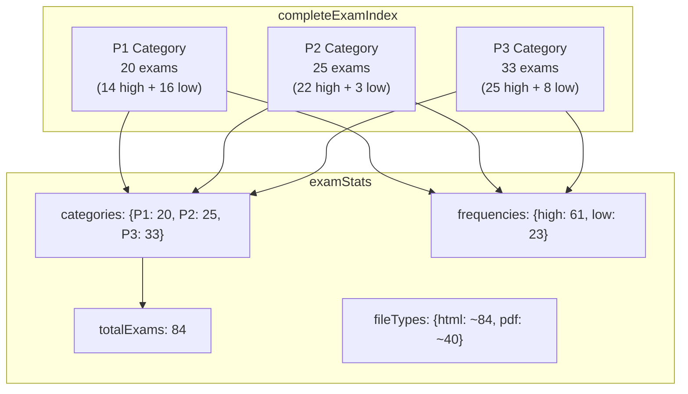
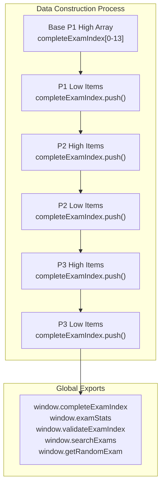
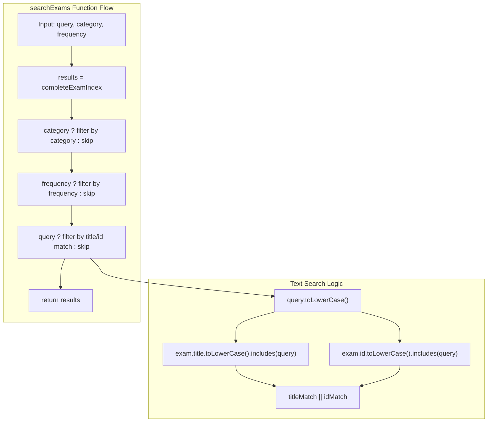
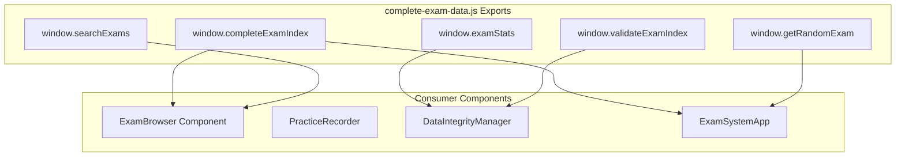

# Exam Data System

> **Relevant source files**
> * [assets/scripts/complete-exam-data.js](https://github.com/sallowayma-git/IELTS-practice/blob/db0f538c/assets/scripts/complete-exam-data.js)

## Purpose and Scope

The Exam Data System provides a comprehensive, centrally-managed question bank for IELTS reading practice. This system maintains a structured collection of 84 exams organized by difficulty categories (P1, P2, P3) and frequency ratings (high, low), serving as the primary data source for the entire IELTS practice application.

For information about how this data integrates with the core application's browsing and practice functionality, see [Core Application](/sallowayma-git/IELTS-practice/2-core-application). For details on the user interface components that display this data, see [User Interface & Styling](/sallowayma-git/IELTS-practice/4-user-interface-and-styling).

## Data Architecture and Organization

The exam data system is implemented as a single JavaScript module that exports a comprehensive index of all available exams along with utility functions for data access and validation.

### Core Data Structure

The `completeExamIndex` array contains exam objects with the following schema:

| Property | Type | Purpose | Example |
| --- | --- | --- | --- |
| `id` | string | Unique identifier | `"p1-high-01"` |
| `title` | string | Exam title (bilingual) | `"A Brief History of Tea 茶叶简史"` |
| `category` | string | Difficulty level | `"P1"`, `"P2"`, `"P3"` |
| `frequency` | string | Practice frequency | `"high"`, `"low"` |
| `path` | string | File system path | `"P1（12+8）/1.高频(网页由窦立盛老师制作)/1.A Brief History of Tea 茶叶简史/"` |
| `filename` | string | HTML file name | `"P1 - A Brief History of Tea【高】.html"` |
| `hasHtml` | boolean | HTML availability | `true`/`false` |
| `hasPdf` | boolean | PDF availability | `true`/`false` |
| `pdfFilename` | string | PDF file name | `"P1 - A Brief History of Tea【高】.pdf"` |
| `isNewlyDiscovered` | boolean | Recently added flag | `true`/`false` |
| `discoveryDate` | string | ISO date of discovery | `"2025-01-27T00:00:00.000Z"` |

### Exam Data Distribution



**Sources:** [assets/scripts/complete-exam-data.js L4-L970](https://github.com/sallowayma-git/IELTS-practice/blob/db0f538c/assets/scripts/complete-exam-data.js#L4-L970)

 [assets/scripts/complete-exam-data.js L971-L988](https://github.com/sallowayma-git/IELTS-practice/blob/db0f538c/assets/scripts/complete-exam-data.js#L971-L988)

### Data Loading and Initialization



**Sources:** [assets/scripts/complete-exam-data.js L4-L164](https://github.com/sallowayma-git/IELTS-practice/blob/db0f538c/assets/scripts/complete-exam-data.js#L4-L164)

 [assets/scripts/complete-exam-data.js L166-L354](https://github.com/sallowayma-git/IELTS-practice/blob/db0f538c/assets/scripts/complete-exam-data.js#L166-L354)

 [assets/scripts/complete-exam-data.js L356-L968](https://github.com/sallowayma-git/IELTS-practice/blob/db0f538c/assets/scripts/complete-exam-data.js#L356-L968)

 [assets/scripts/complete-exam-data.js L1066-L1070](https://github.com/sallowayma-git/IELTS-practice/blob/db0f538c/assets/scripts/complete-exam-data.js#L1066-L1070)

## Categorization System

### Three-Tier Difficulty Structure

The exam categorization follows IELTS reading passage conventions:

* **P1 (Passage 1)**: Introductory level, factual content, straightforward language
* **P2 (Passage 2)**: Intermediate level, work-related or general academic topics
* **P3 (Passage 3)**: Advanced level, complex academic and abstract concepts

### Frequency-Based Classification

Each exam is tagged with a frequency indicator based on appearance rates in actual IELTS tests:

* **High Frequency**: Questions that appear more commonly in real exams
* **Low Frequency**: Less common but still relevant practice questions

| Category | High Frequency | Low Frequency | Total |
| --- | --- | --- | --- |
| P1 | 14 | 16 | 30 |
| P2 | 22 | 3 | 25 |
| P3 | 25 | 8 | 33 |
| **Total** | **61** | **23** | **84** |

**Sources:** [assets/scripts/complete-exam-data.js L971-L988](https://github.com/sallowayma-git/IELTS-practice/blob/db0f538c/assets/scripts/complete-exam-data.js#L971-L988)

## Search and Filtering System

### Core Search Functions

The system provides several utility functions for exam discovery and filtering:

#### searchExams(query, category, frequency)

Performs multi-criteria filtering with text search capabilities:

```
// Filter by category only
searchExams('', 'P1', null)

// Text search across all exams  
searchExams('tea', null, null)

// Combined filtering
searchExams('', 'P2', 'high')
```

#### getRandomExam(category, frequency)

Returns a randomly selected exam matching the specified criteria:

```
// Random high-frequency P3 exam
getRandomExam('P3', 'high')

// Any random exam
getRandomExam()
```

### Search Implementation



**Sources:** [assets/scripts/complete-exam-data.js L1034-L1063](https://github.com/sallowayma-git/IELTS-practice/blob/db0f538c/assets/scripts/complete-exam-data.js#L1034-L1063)

## Data Validation and Integrity

### Comprehensive Validation System

The `validateExamIndex()` function performs multi-level data integrity checks:

#### Required Field Validation

Ensures all exam entries contain essential properties:

* `id`, `title`, `category`, `frequency`, `path`, `filename`

#### Unique ID Enforcement

Prevents duplicate exam identifiers in the dataset

#### Category and Frequency Constraints

Validates that all entries use approved category values (`P1`, `P2`, `P3`) and frequency values (`high`, `low`)

#### File Type Consistency

Warns when file availability flags don't match filename properties

### Validation Workflow

```mermaid
flowchart TD

RequiredFields["Check required fields"]
Start["validateExamIndex()"]
InitArrays["errors = []<br>warnings = []"]
Loop["forEach exam in completeExamIndex"]
UniqueId["Check ID uniqueness"]
CategoryValid["Validate category values"]
FrequencyValid["Validate frequency values"]
FileConsistency["Check file consistency"]
Result["return {errors, warnings, isValid}"]

subgraph subGraph1 ["validateExamIndex Process"]
    Start
    InitArrays
    Loop
    Result
    Start --> InitArrays
    InitArrays --> Loop
    Loop --> RequiredFields
    FileConsistency --> Result

subgraph subGraph0 ["Validation Checks"]
    RequiredFields
    UniqueId
    CategoryValid
    FrequencyValid
    FileConsistency
    RequiredFields --> UniqueId
    UniqueId --> CategoryValid
    CategoryValid --> FrequencyValid
    FrequencyValid --> FileConsistency
end
end
```



**Sources:** [assets/scripts/complete-exam-data.js L990-L1031](https://github.com/sallowayma-git/IELTS-practice/blob/db0f538c/assets/scripts/complete-exam-data.js#L990-L1031)

### Data Statistics and Monitoring

The `examStats` object provides real-time metrics about the exam collection:

```yaml
{
    totalExams: 84,
    categories: { P1: 30, P2: 25, P3: 33 },
    frequencies: { high: 61, low: 23 },
    fileTypes: { html: 84, pdf: ~40 },
    lastUpdated: '2025-08-28T00:00:00.000Z',
    version: 'v2.2'
}
```

**Sources:** [assets/scripts/complete-exam-data.js L971-L988](https://github.com/sallowayma-git/IELTS-practice/blob/db0f538c/assets/scripts/complete-exam-data.js#L971-L988)

## Integration with Core System

### Global Namespace Exports

The exam data system exposes its functionality through the global `window` object, making it available to all other system components:



### File System Integration

The exam data maintains direct references to the underlying file system structure, enabling the core application to locate and load practice materials:

* **Path Resolution**: Each exam's `path` property maps to actual directory structure
* **File Loading**: `filename` and `pdfFilename` enable direct resource access
* **Format Support**: Boolean flags (`hasHtml`, `hasPdf`) guide content delivery

**Sources:** [assets/scripts/complete-exam-data.js L1066-L1070](https://github.com/sallowayma-git/IELTS-practice/blob/db0f538c/assets/scripts/complete-exam-data.js#L1066-L1070)

## Version Control and Updates

### Discovery Tracking System

The system tracks newly discovered exams with dedicated properties:

* `isNewlyDiscovered`: Boolean flag for recent additions
* `discoveryDate`: ISO timestamp of when exam was found

This enables the application to highlight new content and maintain update histories for users.

### Version Management

The `examStats.version` field tracks data schema versions, while `examStats.lastUpdated` provides temporal reference points for data freshness validation.

**Sources:** [assets/scripts/complete-exam-data.js L148-L149](https://github.com/sallowayma-git/IELTS-practice/blob/db0f538c/assets/scripts/complete-exam-data.js#L148-L149)

 [assets/scripts/complete-exam-data.js L161-L162](https://github.com/sallowayma-git/IELTS-practice/blob/db0f538c/assets/scripts/complete-exam-data.js#L161-L162)

 [assets/scripts/complete-exam-data.js L986-L987](https://github.com/sallowayma-git/IELTS-practice/blob/db0f538c/assets/scripts/complete-exam-data.js#L986-L987)