# Exam Index & Metadata Structure

> **Relevant source files**
> * [.gitignore](https://github.com/sallowayma-git/IELTS-practice/blob/df0c9b8f/.gitignore)
> * [assets/scripts/complete-exam-data.js](https://github.com/sallowayma-git/IELTS-practice/blob/df0c9b8f/assets/scripts/complete-exam-data.js)
> * [assets/scripts/listening-exam-data.js](https://github.com/sallowayma-git/IELTS-practice/blob/df0c9b8f/assets/scripts/listening-exam-data.js)
> * [developer/tests/e2e/fixtures/index.html](https://github.com/sallowayma-git/IELTS-practice/blob/df0c9b8f/developer/tests/e2e/fixtures/index.html)
> * [developer/tests/e2e/path_compatibility_playwright.py](https://github.com/sallowayma-git/IELTS-practice/blob/df0c9b8f/developer/tests/e2e/path_compatibility_playwright.py)

This document describes the exam content index system, which catalogs all available IELTS practice exams and their metadata. The system maintains two separate index files: one for reading exams and one for listening exams, both exposed as global JavaScript arrays with structured metadata.

For information about how these paths are resolved to actual file URLs, see [Path Resolution & Resource Management](/sallowayma-git/IELTS-practice/6.2-path-resolution-and-resource-management). For information about how exams are loaded during practice sessions, see [Practice Session System](/sallowayma-git/IELTS-practice/5-practice-session-system).

---

## System Overview

The exam index system provides a centralized registry of all available practice materials. The application loads these indexes during initialization and uses them to populate the browse view, enable search/filter functionality, and resolve resource paths during practice sessions.

**Key Components:**

```mermaid
flowchart TD

COMPLETE["complete-exam-data.js<br>window.completeExamIndex"]
LISTENING["listening-exam-data.js<br>window.listeningExamIndex"]
ARRAY["Array of Exam Objects"]
PATHROOT["pathRoot Property<br>Base Path Configuration"]
CORE["Core Fields:<br>id, title, category"]
RESOURCES["Resource Fields:<br>path, filename, hasHtml, hasPdf"]
SPECIFIC["Type-Specific Fields:<br>frequency, mp3Filename"]
BROWSE["Browse View<br>Exam List Display"]
FILTER["Filter System<br>Category & Search"]
SESSION["Exam Session Manager<br>Resource Resolution"]
HISTORY["Practice History<br>Exam Title Lookup"]

COMPLETE --> ARRAY
LISTENING --> ARRAY
COMPLETE --> PATHROOT
ARRAY --> CORE
ARRAY --> RESOURCES
ARRAY --> SPECIFIC
CORE --> BROWSE
RESOURCES --> SESSION
SPECIFIC --> FILTER

subgraph subGraph3 ["Application Consumers"]
    BROWSE
    FILTER
    SESSION
    HISTORY
    BROWSE --> FILTER
    FILTER --> SESSION
    SESSION --> HISTORY
end

subgraph subGraph2 ["Metadata Fields"]
    CORE
    RESOURCES
    SPECIFIC
end

subgraph subGraph1 ["Index Structure"]
    ARRAY
    PATHROOT
end

subgraph subGraph0 ["Exam Index Files"]
    COMPLETE
    LISTENING
end
```



**Sources:** [assets/scripts/complete-exam-data.js L1-L946](https://github.com/sallowayma-git/IELTS-practice/blob/df0c9b8f/assets/scripts/complete-exam-data.js#L1-L946)

 [assets/scripts/listening-exam-data.js L1-L2100](https://github.com/sallowayma-git/IELTS-practice/blob/df0c9b8f/assets/scripts/listening-exam-data.js#L1-L2100)

---

## Reading Exam Index Structure

The reading exam index is defined in `complete-exam-data.js` and exposed as `window.completeExamIndex`. It contains 81 IELTS reading passages organized by difficulty level (P1, P2, P3) and frequency rating.

### Data Structure


### Example Entry

```yaml
{
    id: 'p1-high-01',
    title: 'A Brief History of Tea 茶叶简史',
    category: 'P1',
    frequency: 'high',
    path: '1. P1 - A Brief History of Tea 茶叶简史【高】/',
    filename: '1. P1 - A Brief History of Tea 茶叶简史【高】.html',
    hasHtml: true,
    hasPdf: true,
    pdfFilename: '1. P1 - A Brief History of Tea 茶叶简史【高】.pdf'
}
```

### Content Distribution

| Category | Frequency | Count | Description |
| --- | --- | --- | --- |
| P1 | High | 12 | Easiest reading passages, high probability |
| P1 | Medium | 8 | Easiest reading passages, medium probability |
| P2 | High | 22 | Intermediate passages, high probability |
| P2 | Medium | 6 | Intermediate passages, medium probability |
| P3 | High | 20 | Most difficult passages, high probability |
| P3 | Medium | 15 | Most difficult passages, medium probability |
| **Total** |  | **83** |  |

**Note:** Entry `p2-high-22` (ID 121) has `hasHtml: false`, indicating PDF-only availability.

**Sources:** [assets/scripts/complete-exam-data.js L5-L941](https://github.com/sallowayma-git/IELTS-practice/blob/df0c9b8f/assets/scripts/complete-exam-data.js#L5-L941)

---

## Listening Exam Index Structure

The listening exam index is defined in `listening-exam-data.js` and exposed as `window.listeningExamIndex`. It contains listening practice materials organized by IELTS listening part (P3, P4).

### Data Structure


### Example Entry

```yaml
{
    id: 'listening-p3-01',
    type: 'listening',
    title: 'Julia and Bob\'s science project is due',
    category: 'P3',
    path: 'ListeningPractice/P3/1. PART3 Julia and Bob\'s science project is due/',
    filename: '1. PART3 Julia and Bob\'s science project is due.html',
    hasHtml: true,
    hasPdf: true,
    pdfFilename: 'PART3 Julia and Bob\'s science project is due.pdf',
    mp3Filename: 'audio.mp3'
}
```

### Content Distribution

| Category | Count | Description |
| --- | --- | --- |
| P3 | 60 | IELTS Listening Part 3 (academic discussions) |
| P4 | 53 | IELTS Listening Part 4 (academic lectures) |
| **Total** | **113** |  |

**Key Differences from Reading Index:**

* Includes `type: 'listening'` field for type identification
* Includes `mp3Filename` field for audio resources
* No `frequency` field (not applicable to listening materials)
* All entries use `ListeningPractice/` path prefix

**Sources:** [assets/scripts/listening-exam-data.js L4-L2100](https://github.com/sallowayma-git/IELTS-practice/blob/df0c9b8f/assets/scripts/listening-exam-data.js#L4-L2100)

---

## Metadata Field Reference

### Common Fields (Both Index Types)

| Field | Type | Required | Description |
| --- | --- | --- | --- |
| `id` | string | Yes | Unique identifier for the exam |
| `title` | string | Yes | Display title (may include Chinese/special chars) |
| `category` | string | Yes | Difficulty/part level (P1/P2/P3 for reading, P3/P4 for listening) |
| `path` | string | Yes | Relative directory path from `pathRoot` |
| `filename` | string | Yes | HTML practice file name (may be empty string if `hasHtml: false`) |
| `hasHtml` | boolean | Yes | Whether HTML practice version exists |
| `hasPdf` | boolean | Yes | Whether PDF reference version exists |
| `pdfFilename` | string | Yes | PDF file name |

### Reading-Specific Fields

| Field | Type | Required | Description |
| --- | --- | --- | --- |
| `frequency` | string | Yes | Exam probability: `'high'` or `'medium'` |

### Listening-Specific Fields

| Field | Type | Required | Description |
| --- | --- | --- | --- |
| `type` | string | Yes | Always `'listening'` for type identification |
| `mp3Filename` | string | Yes | Audio file name (typically `'audio.mp3'`) |

### ID Naming Conventions


**Sources:** [assets/scripts/complete-exam-data.js L8-L138](https://github.com/sallowayma-git/IELTS-practice/blob/df0c9b8f/assets/scripts/complete-exam-data.js#L8-L138)

 [assets/scripts/listening-exam-data.js L6-L17](https://github.com/sallowayma-git/IELTS-practice/blob/df0c9b8f/assets/scripts/listening-exam-data.js#L6-L17)

---

## Path Root Configuration

The `pathRoot` property on `window.completeExamIndex` defines base directory paths for both exam types. This configuration is used by the path resolution system to construct complete file URLs.

```yaml
window.completeExamIndex.pathRoot = {
    reading: '睡着过项目组(9.4)[134篇]/3. 所有文章(9.4)[134篇]/',
    listening: 'ListeningPractice/'
};
```

### Path Construction Example


**Example Resolution:**

For reading exam `p1-high-01`:

```
pathRoot.reading + exam.path + exam.filename
= '睡着过项目组(9.4)[134篇]/3. 所有文章(9.4)[134篇]/'
  + '1. P1 - A Brief History of Tea 茶叶简史【高】/'
  + '1. P1 - A Brief History of Tea 茶叶简史【高】.html'
```

For listening exam `listening-p3-01`:

```
pathRoot.listening + exam.path + exam.filename
= 'ListeningPractice/'
  + 'ListeningPractice/P3/1. PART3 Julia and Bob\'s science project is due/'
  + '1. PART3 Julia and Bob\'s science project is due.html'
```

**Note:** The listening exam `path` field includes the `ListeningPractice/` prefix redundantly, while reading exam paths are relative to `pathRoot.reading`.

**Sources:** [assets/scripts/complete-exam-data.js L942-L946](https://github.com/sallowayma-git/IELTS-practice/blob/df0c9b8f/assets/scripts/complete-exam-data.js#L942-L946)

---

## Non-ASCII Path Handling

The exam index system uses paths containing Chinese characters, parentheses, and square brackets. This requires special handling for URL encoding and file system compatibility.

### Path Characteristics


### Path Compatibility Testing

The codebase includes dedicated E2E tests to verify non-ASCII path handling:

**Test Structure:**

```markdown
developer/tests/e2e/fixtures/
├── index.html                                          # Test entry point
└── 睡着过项目组(9.4)[134篇]/
    ├── 2. 高频次高频文章[83篇]/
    │   └── placeholder.html
    └── 3. 所有文章(9.4)[134篇]/
        └── placeholder.html
```

**Test Verification:**

1. Serves fixtures directory via local HTTP server
2. Navigates to Chinese-path URLs using Playwright
3. Verifies correct page loading and URL encoding
4. Captures screenshots for visual confirmation

The test ensures that:

* URLs with Chinese characters are properly encoded
* Parentheses `()` and brackets `[]` are preserved
* HTTP servers correctly decode and serve files
* Browser navigation handles these paths seamlessly

**Sources:** [developer/tests/e2e/path_compatibility_playwright.py L33-L76](https://github.com/sallowayma-git/IELTS-practice/blob/df0c9b8f/developer/tests/e2e/path_compatibility_playwright.py#L33-L76)

 [developer/tests/e2e/fixtures/index.html L34-L43](https://github.com/sallowayma-git/IELTS-practice/blob/df0c9b8f/developer/tests/e2e/fixtures/index.html#L34-L43)

 [.gitignore L23-L25](https://github.com/sallowayma-git/IELTS-practice/blob/df0c9b8f/.gitignore#L23-L25)

---

## Application Data Flow

```mermaid
flowchart TD

HTML["index.html"]
SCRIPT1[""]
SCRIPT2[""]
GLOBAL1["window.completeExamIndex<br>Array + pathRoot"]
GLOBAL2["window.listeningExamIndex<br>Array"]
APP["ExamSystemApp<br>loadLibrary()"]
BROWSE["Browse View<br>renderExamList()"]
FILTER["Filter System<br>filterByCategory()"]
SEARCH["Search Function<br>searchByTitle()"]
SESSION["Exam Session<br>openExam()"]
MERGE["Merge Reading + Listening"]
SORT["Sort by Category"]
LOOKUP["Lookup by ID"]
RESOLVE["Resolve Full Paths"]

SCRIPT1 --> GLOBAL1
SCRIPT2 --> GLOBAL2
GLOBAL1 --> APP
GLOBAL2 --> APP
APP --> MERGE
MERGE --> BROWSE
FILTER --> SORT
SEARCH --> LOOKUP
LOOKUP --> SESSION
SESSION --> RESOLVE

subgraph subGraph3 ["Data Operations"]
    MERGE
    SORT
    LOOKUP
    RESOLVE
end

subgraph subGraph2 ["Application Components"]
    APP
    BROWSE
    FILTER
    SEARCH
    SESSION
    BROWSE --> FILTER
    BROWSE --> SEARCH
end

subgraph subGraph1 ["Global Scope"]
    GLOBAL1
    GLOBAL2
end

subgraph subGraph0 ["Initialization Phase"]
    HTML
    SCRIPT1
    SCRIPT2
    HTML --> SCRIPT1
    HTML --> SCRIPT2
end
```

### Exam Library Loading

The `ExamSystemApp` loads and processes the exam indexes during initialization:

```javascript
// Conceptual flow - see js/main.js for actual implementation
loadLibrary() {
    const reading = window.completeExamIndex || [];
    const listening = window.listeningExamIndex || [];
    
    this.examLibrary = [...reading, ...listening];
    this.examLibrary.forEach(exam => {
        // Index by ID for fast lookup
        this.examMap[exam.id] = exam;
    });
}
```

### Common Data Access Patterns

| Operation | Description | Used By |
| --- | --- | --- |
| **Filter by category** | `exams.filter(e => e.category === 'P1')` | Browse view category tabs |
| **Filter by frequency** | `exams.filter(e => e.frequency === 'high')` | Priority practice selection |
| **Search by title** | `exams.filter(e => e.title.includes(query))` | Browse view search box |
| **Lookup by ID** | `examMap[examId]` | Practice history, session manager |
| **Resolve full path** | `pathRoot[type] + exam.path + exam.filename` | Resource loading during practice |

### Browse View Integration

The browse view consumes the exam index to display filterable exam lists:


The browse view uses metadata fields for:

* **Filtering:** `category` for tab selection, `frequency` for priority filtering
* **Display:** `title` for card headers, `id` for click handlers
* **Sorting:** Custom sort based on `category` and frequency order
* **Counting:** Result count badges per category

**Sources:** [assets/scripts/complete-exam-data.js L942-L946](https://github.com/sallowayma-git/IELTS-practice/blob/df0c9b8f/assets/scripts/complete-exam-data.js#L942-L946)

---

## Metadata Validation

The static analysis CI suite validates exam index integrity to catch common errors:

### Validation Checks


**Validation Rules:**

1. **`pathRoot` existence:** Both index files must have `pathRoot` metadata
2. **Required fields:** All entries must have `id`, `title`, `category`, `path`, `filename`
3. **Boolean consistency:** `hasHtml: false` should correlate with empty `filename`
4. **PDF consistency:** `hasPdf: true` requires non-empty `pdfFilename`
5. **Category validity:** Must be one of `P1`, `P2`, `P3`, `P4`
6. **Frequency validity:** (Reading only) Must be `high` or `medium`
7. **MP3 requirement:** (Listening only) Must have `mp3Filename` field

**Sources:** [developer/tests/ci/run_static_suite.py](https://github.com/sallowayma-git/IELTS-practice/blob/df0c9b8f/developer/tests/ci/run_static_suite.py)

 (referenced in overview documentation)

---

## Summary

The exam index system provides a structured, maintainable approach to cataloging IELTS practice materials:

**Key Design Principles:**

1. **Separation of Concerns:** Reading and listening exams in separate files with type-specific fields
2. **Global Accessibility:** Simple `window` object access for legacy compatibility
3. **Non-ASCII Support:** Full support for Chinese characters in paths and titles
4. **Resource Flexibility:** Boolean flags indicate which resource types are available
5. **Path Configuration:** Centralized `pathRoot` enables easy path structure changes
6. **Validation:** CI checks ensure data integrity and consistency

**Integration Points:**

* **Browse View:** Uses metadata for display, filtering, and search
* **Exam Sessions:** Uses IDs and paths for resource resolution
* **Practice History:** Uses IDs for exam title lookups
* **Path Resolution:** Uses `pathRoot` and `path` fields for URL construction (see [6.2](/sallowayma-git/IELTS-practice/6.2-path-resolution-and-resource-management))

The index structure balances simplicity (plain arrays and objects) with functionality (rich metadata), enabling both straightforward data access and sophisticated filtering/search capabilities.

**Sources:** [assets/scripts/complete-exam-data.js L1-L946](https://github.com/sallowayma-git/IELTS-practice/blob/df0c9b8f/assets/scripts/complete-exam-data.js#L1-L946)

 [assets/scripts/listening-exam-data.js L1-L2100](https://github.com/sallowayma-git/IELTS-practice/blob/df0c9b8f/assets/scripts/listening-exam-data.js#L1-L2100)