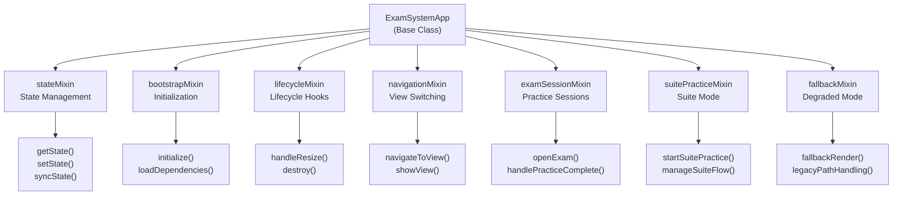
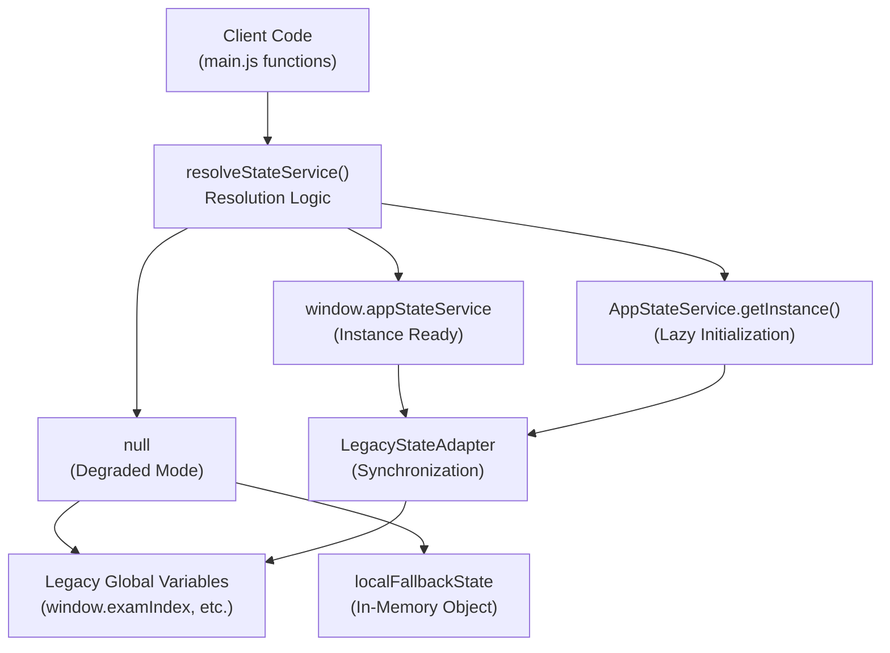
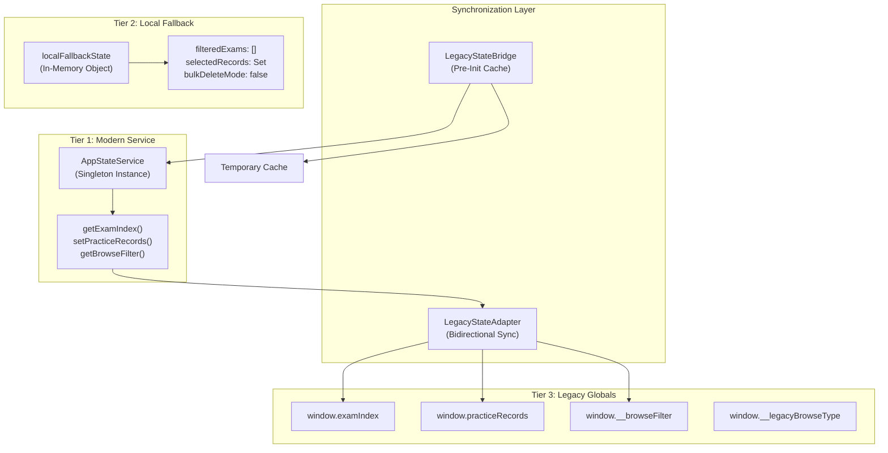
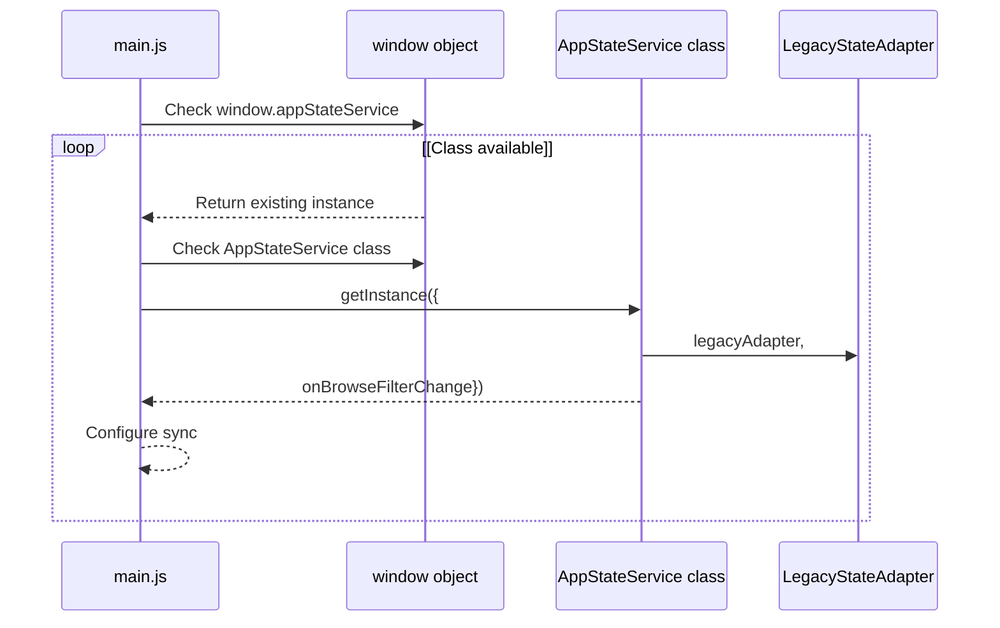
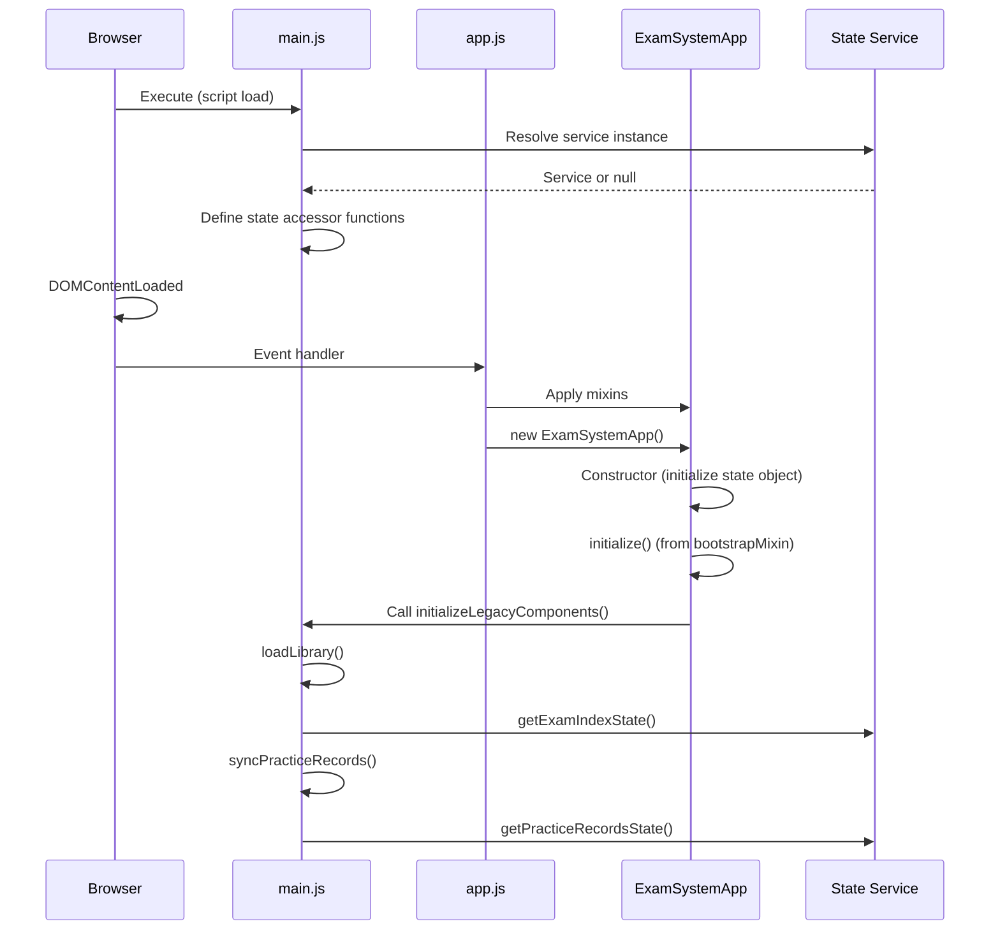
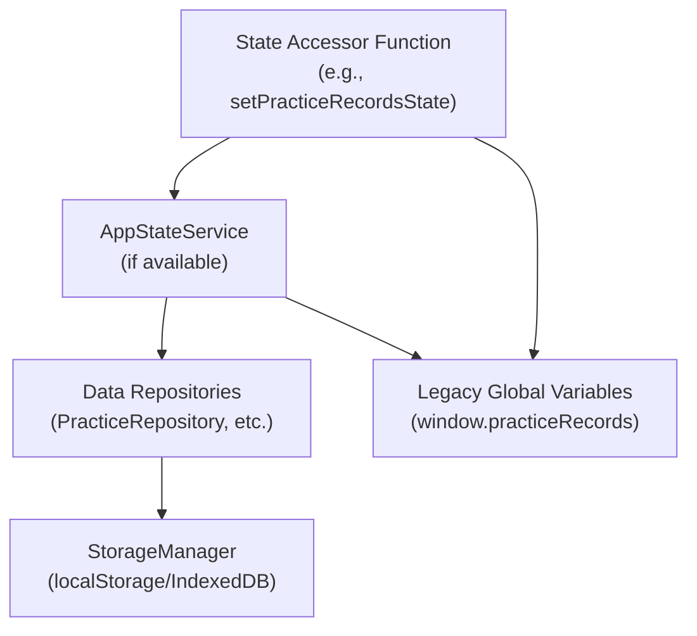
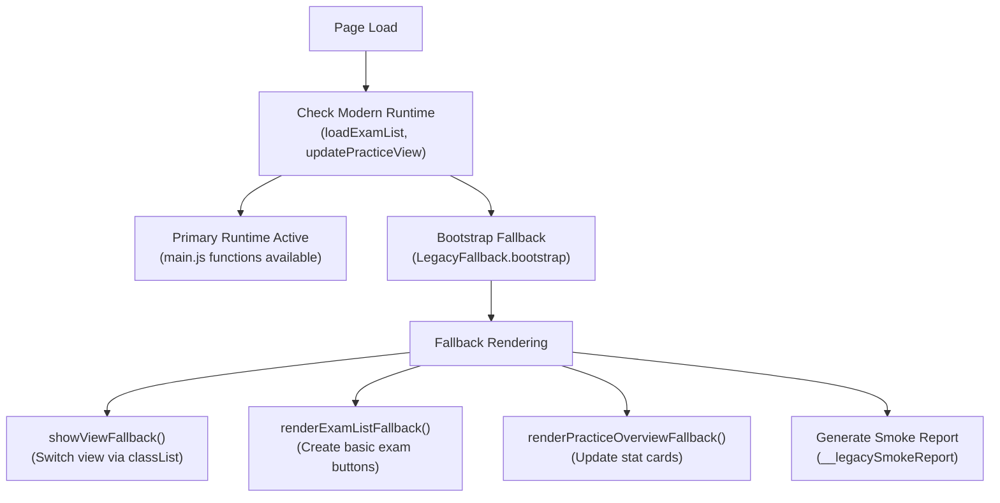

# ExamSystemApp & State Management

> **Relevant source files**
> * [assets/developer wiki/hp-overview-usage-todo.md](https://github.com/sallowayma-git/IELTS-practice/blob/df0c9b8f/assets/developer wiki/hp-overview-usage-todo.md)
> * [css/main.css](https://github.com/sallowayma-git/IELTS-practice/blob/df0c9b8f/css/main.css)
> * [index.html](https://github.com/sallowayma-git/IELTS-practice/blob/df0c9b8f/index.html)
> * [js/app.js](https://github.com/sallowayma-git/IELTS-practice/blob/df0c9b8f/js/app.js)
> * [js/components/DataIntegrityManager.js](https://github.com/sallowayma-git/IELTS-practice/blob/df0c9b8f/js/components/DataIntegrityManager.js)
> * [js/data/index.js](https://github.com/sallowayma-git/IELTS-practice/blob/df0c9b8f/js/data/index.js)
> * [js/main.js](https://github.com/sallowayma-git/IELTS-practice/blob/df0c9b8f/js/main.js)
> * [js/script.js](https://github.com/sallowayma-git/IELTS-practice/blob/df0c9b8f/js/script.js)
> * [js/utils/simpleStorageWrapper.js](https://github.com/sallowayma-git/IELTS-practice/blob/df0c9b8f/js/utils/simpleStorageWrapper.js)
> * [js/views/legacyViewBundle.js](https://github.com/sallowayma-git/IELTS-practice/blob/df0c9b8f/js/views/legacyViewBundle.js)

## Purpose and Scope

This document covers the `ExamSystemApp` class, which serves as the central orchestrator of the application, and the state management architecture that provides unified access to application data. The state system bridges modern service-based state management with legacy global variable patterns to enable progressive refactoring.

For information about application initialization and bootstrap sequence, see [3.2](/sallowayma-git/IELTS-practice/3.2-application-initialization-and-bootstrap). For details on view rendering and navigation, see [3.3](/sallowayma-git/IELTS-practice/3.3-view-management-and-navigation). For mixin architecture, see [3.4](/sallowayma-git/IELTS-practice/3.4-mixins-and-component-architecture).

---

## ExamSystemApp Class

The `ExamSystemApp` class is the primary application controller that coordinates all major subsystems.

### Class Structure

The application maintains a hierarchical internal state object organized into logical domains:

| State Domain | Purpose | Key Properties |
| --- | --- | --- |
| `exam` | Exam metadata and configuration | `index`, `currentCategory`, `currentExamType`, `filteredExams`, `configurations`, `activeConfigKey` |
| `practice` | Practice session management | `records`, `selectedRecords`, `bulkDeleteMode`, `dataCollector` |
| `ui` | User interface state | `browseFilter`, `pendingBrowseFilter`, `legacyBrowseType`, `currentVirtualScroller`, `loading` |
| `components` | Component instances | `dataIntegrityManager`, `pdfHandler`, `browseStateManager`, `practiceListScroller` |
| `system` | System-level tracking | `processedSessions`, `fallbackExamSessions`, `failedScripts` |

**Sources:** [js/app.js L6-L62](https://github.com/sallowayma-git/IELTS-practice/blob/df0c9b8f/js/app.js#L6-L62)

### Mixin-Based Composition

The `ExamSystemApp` class uses a mixin pattern to modularly compose functionality. Mixins are applied after class definition:



The application function that applies mixins is globally accessible and re-applicable:

**Sources:** [js/app.js L64-L81](https://github.com/sallowayma-git/IELTS-practice/blob/df0c9b8f/js/app.js#L64-L81)

 [index.html L397-L404](https://github.com/sallowayma-git/IELTS-practice/blob/df0c9b8f/index.html#L397-L404)

---

## State Management Architecture

The application uses a dual-layer state management system that supports both modern service-based architecture and legacy global variable patterns.

### State Service Resolution

State access is mediated through a resolution function that attempts multiple strategies:



**Sources:** [js/main.js L48-L59](https://github.com/sallowayma-git/IELTS-practice/blob/df0c9b8f/js/main.js#L48-L59)

### State Accessor Functions

The `main.js` file provides standardized accessor functions for all state domains. These functions abstract the underlying storage mechanism:

| Function Pattern | Example | Behavior |
| --- | --- | --- |
| `get*State()` | `getExamIndexState()` | Returns current state, trying service first, then fallback |
| `set*State()` | `setExamIndexState(list)` | Updates state via service or fallback, returns normalized value |
| `add*State()` | `addSelectedRecordState(id)` | Adds to collection state |
| `remove*State()` | `removeSelectedRecordState(id)` | Removes from collection state |
| `clear*State()` | `clearSelectedRecordsState()` | Resets collection state |

#### Exam Index State

```javascript
// Retrieval with automatic fallback
function getExamIndexState() {
    if (stateService) {
        return stateService.getExamIndex();
    }
    return Array.isArray(window.examIndex) ? window.examIndex : [];
}

// Update with normalization
function setExamIndexState(list) {
    if (stateService) {
        return stateService.setExamIndex(list);
    }
    const normalized = Array.isArray(list) ? list : [];
    try { window.examIndex = normalized; } catch (_) {}
    return normalized;
}
```

**Sources:** [js/main.js L65-L79](https://github.com/sallowayma-git/IELTS-practice/blob/df0c9b8f/js/main.js#L65-L79)

#### Practice Records State

```javascript
function getPracticeRecordsState() {
    if (stateService) {
        return stateService.getPracticeRecords();
    }
    return Array.isArray(window.practiceRecords) ? window.practiceRecords : [];
}

function setPracticeRecordsState(records) {
    if (stateService) {
        return stateService.setPracticeRecords(records);
    }
    const normalized = Array.isArray(records) ? records : [];
    try { window.practiceRecords = normalized; } catch (_) {}
    return normalized;
}
```

**Sources:** [js/main.js L81-L95](https://github.com/sallowayma-git/IELTS-practice/blob/df0c9b8f/js/main.js#L81-L95)

#### Browse Filter State

```typescript
function getBrowseFilterState() {
    if (stateService) {
        return stateService.getBrowseFilter();
    }
    const category = typeof window.__browseFilter?.category === 'string' 
        ? window.__browseFilter.category : 'all';
    const type = typeof window.__browseFilter?.type === 'string' 
        ? window.__browseFilter.type : 'all';
    return { category, type };
}

function setBrowseFilterState(category = 'all', type = 'all') {
    const normalized = {
        category: typeof category === 'string' ? category : 'all',
        type: typeof type === 'string' ? type : 'all'
    };
    if (stateService) {
        return stateService.setBrowseFilter(normalized);
    }
    syncGlobalBrowseState(normalized.category, normalized.type);
    return normalized;
}
```

**Sources:** [js/main.js L112-L131](https://github.com/sallowayma-git/IELTS-practice/blob/df0c9b8f/js/main.js#L112-L131)

#### Bulk Delete Mode State

```javascript
function getBulkDeleteModeState() {
    if (stateService) {
        return stateService.getBulkDeleteMode();
    }
    return !!localFallbackState.bulkDeleteMode;
}

function setBulkDeleteModeState(value) {
    if (stateService) {
        return stateService.setBulkDeleteMode(value);
    }
    localFallbackState.bulkDeleteMode = !!value;
    return localFallbackState.bulkDeleteMode;
}
```

**Sources:** [js/main.js L141-L154](https://github.com/sallowayma-git/IELTS-practice/blob/df0c9b8f/js/main.js#L141-L154)

#### Selected Records State (Set-Based)

```javascript
function getSelectedRecordsState() {
    if (stateService) {
        return stateService.getSelectedRecords();
    }
    return new Set(localFallbackState.selectedRecords);
}

function addSelectedRecordState(id) {
    if (stateService) {
        return stateService.addSelectedRecord(id);
    }
    if (id != null) {
        localFallbackState.selectedRecords.add(String(id));
    }
    return getSelectedRecordsState();
}
```

**Sources:** [js/main.js L160-L175](https://github.com/sallowayma-git/IELTS-practice/blob/df0c9b8f/js/main.js#L160-L175)

---

## Legacy Compatibility Layer

The state management system includes multiple compatibility mechanisms to support progressive refactoring from global variables to service-based architecture.

### Three-Tier Fallback System



**Sources:** [js/main.js L42-L59](https://github.com/sallowayma-git/IELTS-practice/blob/df0c9b8f/js/main.js#L42-L59)

 Diagram 3 from high-level architecture

### Local Fallback State

When the state service is unavailable, the system uses an in-memory fallback object:

```javascript
const localFallbackState = {
    filteredExams: [],
    selectedRecords: new Set(),
    bulkDeleteMode: false
};
```

This provides basic functionality without persistence, ensuring the application can render even if storage systems fail.

**Sources:** [js/main.js L42-L46](https://github.com/sallowayma-git/IELTS-practice/blob/df0c9b8f/js/main.js#L42-L46)

### Global Variable Synchronization

The `syncGlobalBrowseState` function ensures legacy components can read state changes:

```javascript
function syncGlobalBrowseState(category, type) {
    const browseDescriptor = Object.getOwnPropertyDescriptor(window, '__browseFilter');
    if (!browseDescriptor || typeof browseDescriptor.set !== 'function') {
        try {
            window.__browseFilter = { category, type };
        } catch (_) {}
    }

    const legacyTypeDescriptor = Object.getOwnPropertyDescriptor(window, '__legacyBrowseType');
    if (!legacyTypeDescriptor || typeof legacyTypeDescriptor.set !== 'function') {
        try { window.__legacyBrowseType = type; } catch (_) {}
    }
}
```

This function checks for property descriptors to avoid overwriting if a setter has been installed by `AppStateService` or `LegacyStateAdapter`.

**Sources:** [js/main.js L28-L40](https://github.com/sallowayma-git/IELTS-practice/blob/df0c9b8f/js/main.js#L28-L40)

### LegacyStateAdapter Integration

The state service is configured with a legacy adapter instance during resolution:

```javascript
const stateService = (function resolveStateService() {
    if (window.appStateService && typeof window.appStateService.getExamIndex === 'function') {
        return window.appStateService;
    }
    if (window.AppStateService && typeof window.AppStateService.getInstance === 'function') {
        return window.AppStateService.getInstance({
            legacyAdapter: legacyStateAdapter,
            onBrowseFilterChange: syncGlobalBrowseState
        });
    }
    return null;
})();
```

The adapter ensures that writes to the service are automatically synchronized to legacy global variables, maintaining backward compatibility.

**Sources:** [js/main.js L48-L59](https://github.com/sallowayma-git/IELTS-practice/blob/df0c9b8f/js/main.js#L48-L59)

 [js/main.js L4](https://github.com/sallowayma-git/IELTS-practice/blob/df0c9b8f/js/main.js#L4-L4)

---

## State Service Initialization

### Service Creation Strategies

The application attempts multiple strategies to obtain a state service instance:



**Sources:** [js/main.js L48-L59](https://github.com/sallowayma-git/IELTS-practice/blob/df0c9b8f/js/main.js#L48-L59)

### Initialization Timing

The state service is resolved immediately when `main.js` loads, before the DOM is ready:

1. **Script Load Phase**: `main.js` executes top-level code, attempting to resolve state service
2. **DOMContentLoaded Phase**: `app.js` initializes `ExamSystemApp` instance
3. **Component Initialization Phase**: Mixins and components access state through resolved service

Initial browse filter is loaded during script evaluation:

```javascript
const initialBrowseFilter = stateService
    ? stateService.getBrowseFilter()
    : (legacyStateAdapter ? legacyStateAdapter.getBrowseFilter() : { category: 'all', type: 'all' });
```

**Sources:** [js/main.js L61-L63](https://github.com/sallowayma-git/IELTS-practice/blob/df0c9b8f/js/main.js#L61-L63)

 [js/app.js L86-L92](https://github.com/sallowayma-git/IELTS-practice/blob/df0c9b8f/js/app.js#L86-L92)

---

## Application Lifecycle and State

### Initialization Sequence

The application follows a phased initialization that establishes state management infrastructure:



**Sources:** [js/app.js L86-L92](https://github.com/sallowayma-git/IELTS-practice/blob/df0c9b8f/js/app.js#L86-L92)

 [js/main.js L255-L323](https://github.com/sallowayma-git/IELTS-practice/blob/df0c9b8f/js/main.js#L255-L323)

### Component Registration

The `ExamSystemApp` maintains references to key component instances in its state:

```yaml
// In ExamSystemApp constructor
this.state = {
    // ...
    components: {
        dataIntegrityManager: null,
        pdfHandler: null,
        browseStateManager: null,
        practiceListScroller: null
    }
};
```

These are populated during the initialization phase in `main.js`:

```javascript
function initializeLegacyComponents() {
    // ...
    if (window.PDFHandler) {
        pdfHandler = new PDFHandler();
    }
    if (window.BrowseStateManager) {
        browseStateManager = new BrowseStateManager();
    }
    if (window.DataIntegrityManager) {
        window.dataIntegrityManager = new DataIntegrityManager();
    }
    // ...
}
```

**Sources:** [js/app.js L42-L56](https://github.com/sallowayma-git/IELTS-practice/blob/df0c9b8f/js/app.js#L42-L56)

 [js/main.js L271-L292](https://github.com/sallowayma-git/IELTS-practice/blob/df0c9b8f/js/main.js#L271-L292)

---

## State Persistence and Synchronization

### Storage Integration

The state service integrates with the data repository layer for persistence. State changes trigger repository operations:



**Sources:** [js/main.js L81-L95](https://github.com/sallowayma-git/IELTS-practice/blob/df0c9b8f/js/main.js#L81-L95)

 Diagram 3 from high-level architecture

### Cross-Tab Synchronization

The application listens for storage synchronization events to update state when other tabs make changes:

```javascript
function setupStorageSyncListener() {
    window.addEventListener('storage-sync', (event) => {
        console.log('[System] 收到存储同步事件，正在更新练习记录...', event.detail);
        syncPracticeRecords();
    });
}
```

**Sources:** [js/main.js L487-L495](https://github.com/sallowayma-git/IELTS-practice/blob/df0c9b8f/js/main.js#L487-L495)

### Practice Record Synchronization

The `syncPracticeRecords` function demonstrates the complete state synchronization flow:

```javascript
async function syncPracticeRecords() {
    console.log('[System] 正在从存储中同步练习记录...');
    let records = [];
    try {
        // Prefer normalized records from ScoreStorage via PracticeRecorder
        const pr = window.app && window.app.components && window.app.components.practiceRecorder;
        if (pr && typeof pr.getPracticeRecords === 'function') {
            const maybePromise = pr.getPracticeRecords();
            const res = (typeof maybePromise?.then === 'function') ? await maybePromise : maybePromise;
            records = Array.isArray(res) ? res : [];
        } else {
            // Fallback: read raw storage and normalize
            const raw = await storage.get('practice_records', []) || [];
            records = Array.isArray(raw) ? raw : [];
            // ... extensive normalization logic ...
        }
    } catch (e) {
        console.warn('[System] 同步记录时发生错误，使用存储原始数据:', e);
        const raw = await storage.get('practice_records', []);
        records = Array.isArray(raw) ? raw : [];
    }

    // Update global state
    setPracticeRecordsState(records);
    
    console.log(`[System] ${records.length} 条练习记录已加载到内存。`);
    updatePracticeView();
}
```

This function demonstrates:

* Component-based data access (via `practiceRecorder`)
* Fallback to direct storage access
* Data normalization and validation
* State update via accessor function
* UI refresh trigger

**Sources:** [js/main.js L341-L443](https://github.com/sallowayma-git/IELTS-practice/blob/df0c9b8f/js/main.js#L341-L443)

---

## State Management Patterns

### Getter/Setter Pairs

All state domains follow a consistent getter/setter pattern:

| Pattern | Purpose | Example |
| --- | --- | --- |
| Getter only | Read-only computed state | `getCurrentCategory()` returns `getBrowseFilterState().category` |
| Getter + Setter | Mutable state with validation | `getBrowseFilterState()` / `setBrowseFilterState(category, type)` |
| Collection operations | Set-based state | `addSelectedRecordState()`, `removeSelectedRecordState()`, `clearSelectedRecordsState()` |
| Normalization | Defensive type coercion | All setters normalize inputs (arrays, strings, booleans) |

**Sources:** [js/main.js L133-L193](https://github.com/sallowayma-git/IELTS-practice/blob/df0c9b8f/js/main.js#L133-L193)

### Defensive Programming

State accessors use defensive patterns to handle missing or invalid data:

```typescript
function getExamIndexState() {
    if (stateService) {
        return stateService.getExamIndex();
    }
    // Fallback with type check
    return Array.isArray(window.examIndex) ? window.examIndex : [];
}

function setExamIndexState(list) {
    if (stateService) {
        return stateService.setExamIndex(list);
    }
    // Normalize to array
    const normalized = Array.isArray(list) ? list : [];
    // Try-catch for strict mode errors
    try { window.examIndex = normalized; } catch (_) {}
    return normalized;
}
```

Key defensive techniques:

* Type checking before use (`Array.isArray()`, `typeof`)
* Default values for missing data
* Try-catch blocks for global variable writes (strict mode compatibility)
* Normalization before persistence

**Sources:** [js/main.js L65-L79](https://github.com/sallowayma-git/IELTS-practice/blob/df0c9b8f/js/main.js#L65-L79)

---

## Legacy Fallback Runtime

The application includes a comprehensive fallback system for degraded operation when modern components fail to load.

### Fallback Bootstrap

The `js/script.js` file provides a complete fallback runtime:



**Sources:** [js/script.js L1-L149](https://github.com/sallowayma-git/IELTS-practice/blob/df0c9b8f/js/script.js#L1-L149)

### Smoke Check Reporting

The fallback system generates diagnostic reports:

```javascript
function runSmokeCheck(mode, service) {
    const result = {
        mode,
        timestamp: new Date().toISOString(),
        hasService: !!service,
        hasMessageCenter: typeof global.getMessageCenter === 'function',
        examCount: service ? service.getExamIndex().length : 
                   (Array.isArray(global.examIndex) ? global.examIndex.length : 0),
        recordCount: service ? service.getPracticeRecords().length : 
                     (Array.isArray(global.practiceRecords) ? global.practiceRecords.length : 0)
    };
    global.__legacySmokeReport = result;
    console.log('[LegacySmoke]', result);
    return result;
}
```

This report is accessible via `window.__legacySmokeReport` for debugging and contains:

* **mode**: `'primary-runtime'`, `'fallback-runtime'`, or `'no-service'`
* **hasService**: Whether state service is available
* **examCount** / **recordCount**: Current data counts

**Sources:** [js/script.js L91-L105](https://github.com/sallowayma-git/IELTS-practice/blob/df0c9b8f/js/script.js#L91-L105)

---

## State-Driven UI Updates

### View Update Functions

State changes trigger UI updates through specific update functions:

```javascript
// Exam library loaded
function loadLibrary(forceReload = false) {
    // ... load and cache logic ...
    const updatedIndex = setExamIndexState([...readingExams, ...listeningExams]);
    await storage.set(activeConfigKey, updatedIndex);
    finishLibraryLoading(startTime);
}

function finishLibraryLoading(startTime) {
    const loadTime = performance.now() - startTime;
    updateOverview(); // UI update
    window.dispatchEvent(new CustomEvent('examIndexLoaded')); // Event for components
}
```

**Sources:** [js/main.js L552-L614](https://github.com/sallowayma-git/IELTS-practice/blob/df0c9b8f/js/main.js#L552-L614)

### Practice View Update

```javascript
function updatePracticeView() {
    const records = getPracticeRecordsState(); // Read from state
    const currentType = getCurrentExamType();
    
    // Update statistics
    updatePracticeStats(records);
    
    // Filter and render list
    const filtered = filterPracticeRecords(records, currentType);
    renderPracticeHistory(filtered);
}
```

This pattern separates:

1. **State access** (via accessor functions)
2. **Data transformation** (filtering, sorting)
3. **View rendering** (DOM manipulation)

**Sources:** [js/main.js L1145-L1233](https://github.com/sallowayma-git/IELTS-practice/blob/df0c9b8f/js/main.js#L1145-L1233)

 (inferred from pattern in codebase)

---

## Summary

The state management system in the IELTS Practice System demonstrates a sophisticated architectural pattern:

**Key Characteristics:**

* **Dual-layer architecture**: Modern service + legacy fallback
* **Progressive refactoring support**: New code uses services, old code uses globals
* **Defensive programming**: Extensive type checking and normalization
* **Modular composition**: Mixins extend `ExamSystemApp` without inheritance
* **Graceful degradation**: Three-tier fallback (service → local → globals)

**Core Components:**

* `ExamSystemApp` class with hierarchical internal state
* `AppStateService` singleton with legacy adapter
* State accessor functions in `main.js`
* `LegacyStateAdapter` for bidirectional synchronization
* `LegacyStateBridge` for pre-initialization caching
* Fallback runtime for degraded operation

This architecture enables incremental modernization while maintaining full backward compatibility with legacy components.