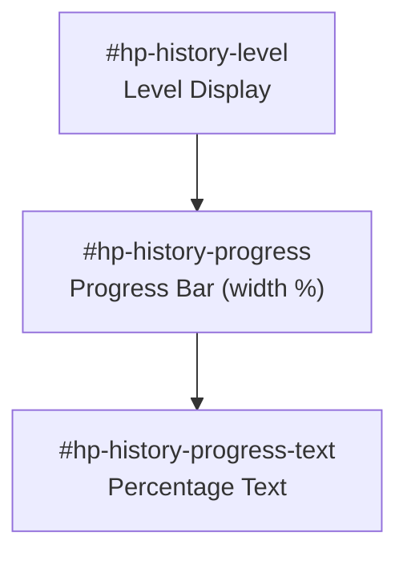
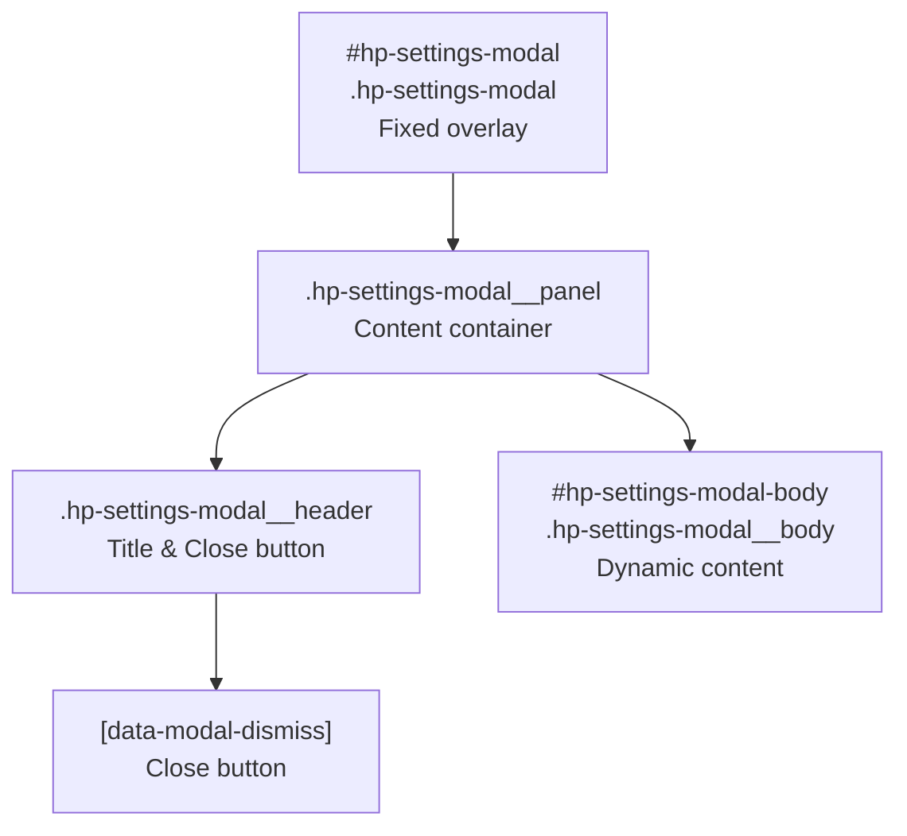
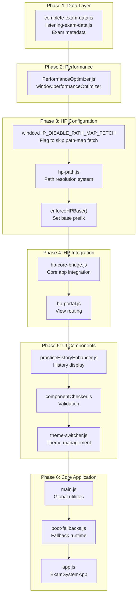
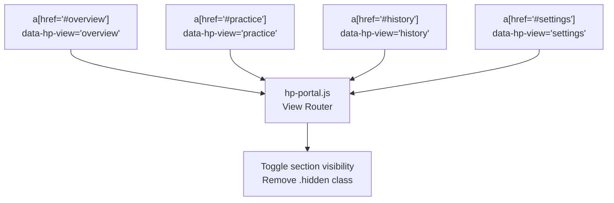
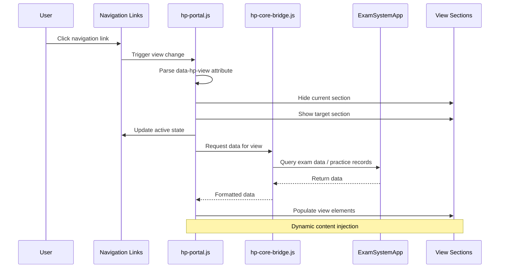
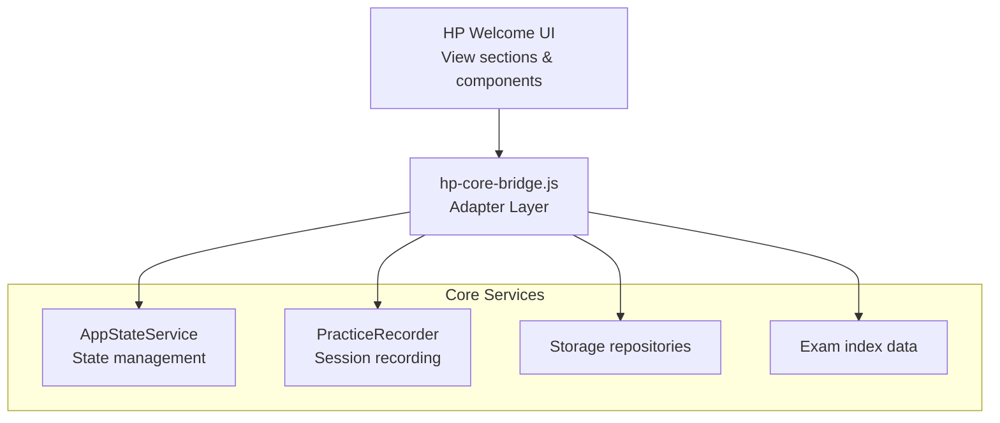

# HP Welcome Interface & Views

> **Relevant source files**
> * [.superdesign/design_iterations/HP/Welcome.html](https://github.com/sallowayma-git/IELTS-practice/blob/df0c9b8f/.superdesign/design_iterations/HP/Welcome.html)

**Purpose**: This document describes the Harry Potter themed welcome interface (`HP/Welcome.html`), its view architecture, UI components, and integration with the core application. This page serves as the primary entry point for the HP theme portal, providing a complete redesigned user experience with magical aesthetics.

For information about the HP plugin architecture and core bridge system, see [HP Core Bridge & Plugin Architecture](/sallowayma-git/IELTS-practice/8.2-hp-core-bridge-and-plugin-architecture). For HP-specific extensions and utilities, see [HP Path System & Extensions](/sallowayma-git/IELTS-practice/8.3-hp-path-system-and-extensions). For general theme system architecture, see [Theme System & Visual Design](/sallowayma-git/IELTS-practice/7-theme-system-and-visual-design).

---

## File Structure and Organization

The HP welcome interface is a standalone HTML file located at [.superdesign/design_iterations/HP/Welcome.html L1-L657](https://github.com/sallowayma-git/IELTS-practice/blob/df0c9b8f/.superdesign/design_iterations/HP/Welcome.html#L1-L657)

 that provides a complete application shell with its own styling, views, and integration points.

### Document Structure

```mermaid
flowchart TD

HTML["HP/Welcome.html<br>Complete Portal Shell"]
META["Meta Tags<br>Viewport & Charset"]
TAILWIND["Tailwind CDN<br>Utility Framework"]
FONTS["Google Fonts<br>Cinzel, Lora, Newsreader"]
ICONS["Material Icons"]
TW_CONFIG["Tailwind Config<br>Custom Colors & Animations"]
CUSTOM_CSS["Custom CSS<br>HP-specific Styles"]
HEADER["Header<br>Navigation & Logo"]
MAIN["#hp-portal-root<br>Main Container"]
FOOTER["Footer<br>Copyright"]
OVERVIEW["#overview<br>Statistics & Quick Actions"]
PRACTICE["#practice<br>Question Bank Browser"]
HISTORY["#history<br>Practice Records & Charts"]
SETTINGS["#settings<br>System Configuration"]
SETTINGS_MODAL["#hp-settings-modal<br>Settings Overlay"]
THEME_TEMPLATE["#hp-theme-modal-template<br>Theme Switcher"]
DATA_SCRIPTS["Exam Data Files<br>complete-exam-data.js<br>listening-exam-data.js"]
PERF_OPT["PerformanceOptimizer"]
HP_SCRIPTS["HP Plugin Scripts<br>hp-path.js<br>hp-core-bridge.js<br>hp-portal.js"]
CORE_SCRIPTS["Core App Scripts<br>main.js, app.js<br>boot-fallbacks.js"]

HTML --> META
HTML --> TAILWIND
HTML --> FONTS
HTML --> ICONS
HTML --> TW_CONFIG
HTML --> CUSTOM_CSS
HTML --> HEADER
HTML --> MAIN
HTML --> FOOTER
MAIN --> OVERVIEW
MAIN --> PRACTICE
MAIN --> HISTORY
MAIN --> SETTINGS
HTML --> SETTINGS_MODAL
HTML --> THEME_TEMPLATE
HTML --> DATA_SCRIPTS
HTML --> PERF_OPT
HTML --> HP_SCRIPTS
HTML --> CORE_SCRIPTS

subgraph subGraph4 ["Script Loading"]
    DATA_SCRIPTS
    PERF_OPT
    HP_SCRIPTS
    CORE_SCRIPTS
end

subgraph subGraph3 ["Modals & Templates"]
    SETTINGS_MODAL
    THEME_TEMPLATE
end

subgraph subGraph2 ["View Sections"]
    OVERVIEW
    PRACTICE
    HISTORY
    SETTINGS
end

subgraph subGraph1 ["Body Structure"]
    HEADER
    MAIN
    FOOTER
end

subgraph subGraph0 ["Head Section"]
    META
    TAILWIND
    FONTS
    ICONS
    TW_CONFIG
    CUSTOM_CSS
end
```



**Sources**: [.superdesign/design_iterations/HP/Welcome.html L1-L657](https://github.com/sallowayma-git/IELTS-practice/blob/df0c9b8f/.superdesign/design_iterations/HP/Welcome.html#L1-L657)

---

## Theme Configuration and Styling

### Tailwind Configuration

The HP theme uses custom Tailwind configuration to define magical color schemes and animations [.superdesign/design_iterations/HP/Welcome.html L11-L41](https://github.com/sallowayma-git/IELTS-practice/blob/df0c9b8f/.superdesign/design_iterations/HP/Welcome.html#L11-L41)

:

| Property | Value | Purpose |
| --- | --- | --- |
| `colors.primary` | `#7F0909` | Primary red/burgundy accent |
| `colors.hp-burgundy` | `#39282b` | Dark burgundy backgrounds |
| `colors.hp-gold` | `#ecb22e` | Gold accents for highlights |
| `colors.hp-ink` | `#181112` | Deep black/ink color |
| `fontFamily.display` | `Cinzel, serif` | Display font for headers |
| `fontFamily.hp` | `Newsreader, Noto Sans, serif` | Body text font |
| `animation.mistReveal` | `1.4s ease-out` | Reveal animation for content |
| `animation.fadeInSlow` | `1.2s ease-out` | Slow fade-in animation |

### Custom CSS Classes

The HP theme defines numerous custom CSS classes for specialized components [.superdesign/design_iterations/HP/Welcome.html L43-L386](https://github.com/sallowayma-git/IELTS-practice/blob/df0c9b8f/.superdesign/design_iterations/HP/Welcome.html#L43-L386)

:

**Navigation System**:

* `.hp-nav-link`: Navigation link styling with hover effects and active state indicators [.superdesign/design_iterations/HP/Welcome.html L49-L80](https://github.com/sallowayma-git/IELTS-practice/blob/df0c9b8f/.superdesign/design_iterations/HP/Welcome.html#L49-L80)
* `.hp-nav-active`: Active navigation state with gradient underline

**Card Components**:

* `.hp-section-card`: Main section card with border, backdrop, and shadow [.superdesign/design_iterations/HP/Welcome.html L81-L86](https://github.com/sallowayma-git/IELTS-practice/blob/df0c9b8f/.superdesign/design_iterations/HP/Welcome.html#L81-L86)
* `.hp-practice-card`: Practice exam card with gradient background [.superdesign/design_iterations/HP/Welcome.html L166-L199](https://github.com/sallowayma-git/IELTS-practice/blob/df0c9b8f/.superdesign/design_iterations/HP/Welcome.html#L166-L199)
* `#hp-quick-cards article`: Quick action cards with minimum height constraint [.superdesign/design_iterations/HP/Welcome.html L94-L143](https://github.com/sallowayma-git/IELTS-practice/blob/df0c9b8f/.superdesign/design_iterations/HP/Welcome.html#L94-L143)

**Settings Modal**:

* `.hp-settings-modal`: Full-screen overlay modal [.superdesign/design_iterations/HP/Welcome.html L294-L306](https://github.com/sallowayma-git/IELTS-practice/blob/df0c9b8f/.superdesign/design_iterations/HP/Welcome.html#L294-L306)
* `.hp-settings-modal__panel`: Modal content panel with max-height and scroll [.superdesign/design_iterations/HP/Welcome.html L307-L317](https://github.com/sallowayma-git/IELTS-practice/blob/df0c9b8f/.superdesign/design_iterations/HP/Welcome.html#L307-L317)

**Sources**: [.superdesign/design_iterations/HP/Welcome.html L11-L386](https://github.com/sallowayma-git/IELTS-practice/blob/df0c9b8f/.superdesign/design_iterations/HP/Welcome.html#L11-L386)

---

## View Sections Architecture

The HP portal implements four primary view sections, each hidden by default and activated through navigation.

```mermaid
flowchart TD

NAV_SYSTEM["Navigation System<br>.hp-nav-link elements"]
OVERVIEW_VIEW["#overview<br>data-view-section='overview'<br>Default Visible"]
PRACTICE_VIEW["#practice<br>data-view-section='practice'<br>Hidden by default"]
HISTORY_VIEW["#history<br>data-view-section='history'<br>Hidden by default"]
SETTINGS_VIEW["#settings<br>data-view-section='settings'<br>Hidden by default"]
HERO["Hero Section<br>Welcome Text"]
STATS_GRID["Statistics Grid<br>4 Stat Cards"]
QUICK_ACTIONS["#hp-quick-cards<br>Dynamic Action Cards"]
PRACTICE_FILTERS["Filter Tabs<br>All/Reading/Listening"]
SEARCH_INPUT["#hp-practice-search<br>Search Input"]
PRACTICE_LIST["#hp-practice-list<br>Practice Cards Grid"]
PRACTICE_EMPTY["#hp-practice-empty<br>Empty State"]
HISTORY_HEADER["Level & Progress Bar"]
HISTORY_TABLE["#hp-history-table<br>Practice Records"]
HISTORY_CHART["#hp-history-chart<br>Canvas Chart"]
HISTORY_EMPTY["#hp-history-empty<br>Empty State"]
SETTINGS_STATUS["#hp-settings-status<br>Status Display"]
SETTINGS_BUTTONS["Action Buttons<br>data-settings-action"]
THEME_SWITCHER["Theme Modal Trigger"]

NAV_SYSTEM --> OVERVIEW_VIEW
NAV_SYSTEM --> PRACTICE_VIEW
NAV_SYSTEM --> HISTORY_VIEW
NAV_SYSTEM --> SETTINGS_VIEW
OVERVIEW_VIEW --> HERO
OVERVIEW_VIEW --> STATS_GRID
OVERVIEW_VIEW --> QUICK_ACTIONS
PRACTICE_VIEW --> PRACTICE_FILTERS
PRACTICE_VIEW --> SEARCH_INPUT
PRACTICE_VIEW --> PRACTICE_LIST
PRACTICE_VIEW --> PRACTICE_EMPTY
HISTORY_VIEW --> HISTORY_HEADER
HISTORY_VIEW --> HISTORY_TABLE
HISTORY_VIEW --> HISTORY_CHART
HISTORY_VIEW --> HISTORY_EMPTY
SETTINGS_VIEW --> SETTINGS_STATUS
SETTINGS_VIEW --> SETTINGS_BUTTONS
SETTINGS_VIEW --> THEME_SWITCHER

subgraph subGraph4 ["Settings Components"]
    SETTINGS_STATUS
    SETTINGS_BUTTONS
    THEME_SWITCHER
end

subgraph subGraph3 ["History Components"]
    HISTORY_HEADER
    HISTORY_TABLE
    HISTORY_CHART
    HISTORY_EMPTY
end

subgraph subGraph2 ["Practice Components"]
    PRACTICE_FILTERS
    SEARCH_INPUT
    PRACTICE_LIST
    PRACTICE_EMPTY
end

subgraph subGraph1 ["Overview Components"]
    HERO
    STATS_GRID
    QUICK_ACTIONS
end

subgraph subGraph0 ["View Sections"]
    OVERVIEW_VIEW
    PRACTICE_VIEW
    HISTORY_VIEW
    SETTINGS_VIEW
end
```



**Sources**: [.superdesign/design_iterations/HP/Welcome.html L414-L548](https://github.com/sallowayma-git/IELTS-practice/blob/df0c9b8f/.superdesign/design_iterations/HP/Welcome.html#L414-L548)

---

## Overview Section

The Overview section displays user statistics and provides quick access to recent or recommended exams.

### Statistics Display

Four statistical cards show key metrics [.superdesign/design_iterations/HP/Welcome.html L422-L439](https://github.com/sallowayma-git/IELTS-practice/blob/df0c9b8f/.superdesign/design_iterations/HP/Welcome.html#L422-L439)

:

| Element ID | Label | Initial Value |
| --- | --- | --- |
| `#hp-stat-total-exams` | 题库总量 (Total Exams) | 0 |
| `#hp-stat-completed` | 完成练习 (Completed) | 0 |
| `#hp-stat-average` | 平均正确率 (Average Accuracy) | 0% |
| `#hp-stat-days` | 坚持天数 (Practice Days) | 0 |

An update timestamp is displayed at `#hp-stat-updated` [.superdesign/design_iterations/HP/Welcome.html L440](https://github.com/sallowayma-git/IELTS-practice/blob/df0c9b8f/.superdesign/design_iterations/HP/Welcome.html#L440-L440)

### Quick Actions Grid

The `#hp-quick-cards` container dynamically populates with exam cards [.superdesign/design_iterations/HP/Welcome.html L446](https://github.com/sallowayma-git/IELTS-practice/blob/df0c9b8f/.superdesign/design_iterations/HP/Welcome.html#L446-L446)

 Each card includes:

* Title (`h3`)
* Metadata (`.hp-card-meta`)
* Action buttons (`.hp-card-actions`): * Practice button (`data-action="practice"`) * PDF button (`data-action="pdf"`)

**Sources**: [.superdesign/design_iterations/HP/Welcome.html L415-L448](https://github.com/sallowayma-git/IELTS-practice/blob/df0c9b8f/.superdesign/design_iterations/HP/Welcome.html#L415-L448)

---

## Practice Section (Question Bank)

The Practice section provides filtering, searching, and browsing of available exams.

### Filter System

Three filter buttons toggle between exam types [.superdesign/design_iterations/HP/Welcome.html L458-L460](https://github.com/sallowayma-git/IELTS-practice/blob/df0c9b8f/.superdesign/design_iterations/HP/Welcome.html#L458-L460)

:

* `data-practice-type="all"`: Show all exams
* `data-practice-type="reading"`: Show only reading exams
* `data-practice-type="listening"`: Show only listening exams

### Search Input

The `#hp-practice-search` input field allows text-based filtering [.superdesign/design_iterations/HP/Welcome.html L464](https://github.com/sallowayma-git/IELTS-practice/blob/df0c9b8f/.superdesign/design_iterations/HP/Welcome.html#L464-L464)

 with placeholder text "搜索题目或分类" (Search by title or category).

### Practice List Container

The `#hp-practice-list` container has three rendering modes controlled by `data-mode` attribute [.superdesign/design_iterations/HP/Welcome.html L468](https://github.com/sallowayma-git/IELTS-practice/blob/df0c9b8f/.superdesign/design_iterations/HP/Welcome.html#L468-L468)

:

| Mode | Description |
| --- | --- |
| `static` | Grid layout with all cards rendered |
| `virtual` | Virtual scrolling mode (block display) |
| `empty` | No results state |

Each `.hp-practice-card` includes [.superdesign/design_iterations/HP/Welcome.html L166-L199](https://github.com/sallowayma-git/IELTS-practice/blob/df0c9b8f/.superdesign/design_iterations/HP/Welcome.html#L166-L199)

:

* Title (`h4`)
* Footer with action buttons: * Practice button * PDF button (`data-action="pdf"`)

**Sources**: [.superdesign/design_iterations/HP/Welcome.html L450-L472](https://github.com/sallowayma-git/IELTS-practice/blob/df0c9b8f/.superdesign/design_iterations/HP/Welcome.html#L450-L472)

---

## History Section

The History section displays practice records, achievements, and performance trends.

### Progress Tracking



The header shows a user level system with a progress bar [.superdesign/design_iterations/HP/Welcome.html L481-L485](https://github.com/sallowayma-git/IELTS-practice/blob/df0c9b8f/.superdesign/design_iterations/HP/Welcome.html#L481-L485)

### Practice Records Table

The `#hp-history-table` displays practice history with columns [.superdesign/design_iterations/HP/Welcome.html L492-L503](https://github.com/sallowayma-git/IELTS-practice/blob/df0c9b8f/.superdesign/design_iterations/HP/Welcome.html#L492-L503)

:

| Column | Description |
| --- | --- |
| 试卷 | Exam title |
| 类型 | Type (Reading/Listening) |
| 得分 | Score |
| 耗时 | Duration |
| 完成时间 | Completion timestamp |

The table toggles with `#hp-history-empty` for the empty state [.superdesign/design_iterations/HP/Welcome.html L490](https://github.com/sallowayma-git/IELTS-practice/blob/df0c9b8f/.superdesign/design_iterations/HP/Welcome.html#L490-L490)

### Score Trend Chart

A canvas element `#hp-history-chart` displays score trends [.superdesign/design_iterations/HP/Welcome.html L512](https://github.com/sallowayma-git/IELTS-practice/blob/df0c9b8f/.superdesign/design_iterations/HP/Welcome.html#L512-L512)

 It includes an empty state overlay `#hp-history-chart-empty` that displays when no data is available [.superdesign/design_iterations/HP/Welcome.html L513](https://github.com/sallowayma-git/IELTS-practice/blob/df0c9b8f/.superdesign/design_iterations/HP/Welcome.html#L513-L513)

**Sources**: [.superdesign/design_iterations/HP/Welcome.html L474-L516](https://github.com/sallowayma-git/IELTS-practice/blob/df0c9b8f/.superdesign/design_iterations/HP/Welcome.html#L474-L516)

---

## Settings Section

The Settings section provides system management and configuration options.

### Status Display

The `#hp-settings-status` element shows the current system state [.superdesign/design_iterations/HP/Welcome.html L527](https://github.com/sallowayma-git/IELTS-practice/blob/df0c9b8f/.superdesign/design_iterations/HP/Welcome.html#L527-L527)

 with initial text "加载中…" (Loading...).

### Action Buttons

Settings buttons use `data-settings-action` attributes for action identification [.superdesign/design_iterations/HP/Welcome.html L532-L545](https://github.com/sallowayma-git/IELTS-practice/blob/df0c9b8f/.superdesign/design_iterations/HP/Welcome.html#L532-L545)

:

| Action | Label | Purpose |
| --- | --- | --- |
| `load-library` | 📦 加载题库 | Load exam library |
| `clear-cache` | 🧹 清理缓存 | Clear cache |
| `config-list` | 🗂 题库配置 | Library configuration |
| `force-refresh` | 🔄 强制刷新 | Force refresh |
| `backup-create` | 💾 创建备份 | Create backup |
| `backup-list` | 📚 备份列表 | List backups |
| `export` | 📤 导出数据 | Export data |
| `import` | 📥 导入数据 | Import data |
| `theme-modal` | ✨ 主题切换 | Theme switcher |

**Sources**: [.superdesign/design_iterations/HP/Welcome.html L518-L547](https://github.com/sallowayma-git/IELTS-practice/blob/df0c9b8f/.superdesign/design_iterations/HP/Welcome.html#L518-L547)

---

## Settings Modal and Theme Switcher

### Modal Structure

The settings modal uses a full-screen overlay pattern [.superdesign/design_iterations/HP/Welcome.html L591-L601](https://github.com/sallowayma-git/IELTS-practice/blob/df0c9b8f/.superdesign/design_iterations/HP/Welcome.html#L591-L601)

:



### Theme Switcher Template

The `#hp-theme-modal-template` defines theme options [.superdesign/design_iterations/HP/Welcome.html L549-L590](https://github.com/sallowayma-git/IELTS-practice/blob/df0c9b8f/.superdesign/design_iterations/HP/Welcome.html#L549-L590)

:

| Theme | Label | Action Type | Target/Arg |
| --- | --- | --- | --- |
| Academic | 📚 Academic | `portal` | `../ielts_academic_functional_2.html` |
| Bloom | 🍂 Bloom | `portal` | `../../../index.html` |
| Blue | 🔵 Blue | `apply` | `blue` |
| Melody | 🎀 Melody | `portal` | `../my_melody_ielts_1.html` |
| Potter | 🧙 Potter | `portal` | `../HarryPoter.html` |

Each theme option button includes:

* `data-theme-action`: Either `portal` (navigate) or `apply` (CSS change)
* `data-theme-target`: Target HTML file for portal navigation
* `data-theme-arg`: Argument for apply action
* `data-theme-label`: Theme identifier

**Sources**: [.superdesign/design_iterations/HP/Welcome.html L549-L601](https://github.com/sallowayma-git/IELTS-practice/blob/df0c9b8f/.superdesign/design_iterations/HP/Welcome.html#L549-L601)

---

## Script Loading and Integration

The HP welcome interface loads scripts in a specific order to ensure proper initialization.

### Load Sequence



### Key Integration Points

**Path Resolution Configuration** [.superdesign/design_iterations/HP/Welcome.html L624-L646](https://github.com/sallowayma-git/IELTS-practice/blob/df0c9b8f/.superdesign/design_iterations/HP/Welcome.html#L624-L646)

:

* Sets `window.__HP_DISABLE_PATH_MAP_FETCH__ = true` to skip external path-map fetch
* Calls `enforceHPBase()` to set base prefix to `../../..`
* Ensures `window.hpPath.setBasePrefix()` is called with correct value

**Theme Persistence** [.superdesign/design_iterations/HP/Welcome.html L611-L615](https://github.com/sallowayma-git/IELTS-practice/blob/df0c9b8f/.superdesign/design_iterations/HP/Welcome.html#L611-L615)

:

* Reads `localStorage.getItem('hp.theme')` on page load
* Applies dark mode if stored theme is `dark` or prefers-color-scheme matches
* Adds `dark` class to `document.documentElement`

**PerformanceOptimizer Initialization** [.superdesign/design_iterations/HP/Welcome.html L621-L622](https://github.com/sallowayma-git/IELTS-practice/blob/df0c9b8f/.superdesign/design_iterations/HP/Welcome.html#L621-L622)

:

* Creates global `window.performanceOptimizer` instance
* Uses fallback pattern to avoid overwriting existing instance

**Sources**: [.superdesign/design_iterations/HP/Welcome.html L610-L656](https://github.com/sallowayma-git/IELTS-practice/blob/df0c9b8f/.superdesign/design_iterations/HP/Welcome.html#L610-L656)

---

## Navigation System

### Header Navigation

The header navigation uses hash-based routing with `data-hp-view` attributes [.superdesign/design_iterations/HP/Welcome.html L398-L401](https://github.com/sallowayma-git/IELTS-practice/blob/df0c9b8f/.superdesign/design_iterations/HP/Welcome.html#L398-L401)

:



### Active State Management

Navigation links use CSS classes for active state [.superdesign/design_iterations/HP/Welcome.html L75-L79](https://github.com/sallowayma-git/IELTS-practice/blob/df0c9b8f/.superdesign/design_iterations/HP/Welcome.html#L75-L79)

:

* `.hp-nav-link`: Base styling for navigation links
* `.hp-nav-active`: Active state with gradient underline effect

The `hp-portal.js` script (see [HP Core Bridge & Plugin Architecture](/sallowayma-git/IELTS-practice/8.2-hp-core-bridge-and-plugin-architecture)) manages:

* Click event handling on navigation links
* Adding/removing `hp-nav-active` class
* Showing/hiding view sections
* Hash history management

**Sources**: [.superdesign/design_iterations/HP/Welcome.html L391-L412](https://github.com/sallowayma-git/IELTS-practice/blob/df0c9b8f/.superdesign/design_iterations/HP/Welcome.html#L391-L412)

---

## Responsive Design

The HP theme uses Tailwind's responsive utilities for adaptive layouts.

### Breakpoint Usage

| Component | Mobile | Tablet (md:) | Desktop (xl:) |
| --- | --- | --- | --- |
| Navigation | Hidden | `flex` with gap-8 | Same |
| Stats Grid | 1 column | 2 columns | 4 columns |
| Quick Cards | 1 column | 2 columns | 4 columns |
| Practice List | 1 column | 2 columns | 3 columns |
| Settings Grid | 1 column | 2 columns | Same |

### Grid Configurations

**Statistics Grid** [.superdesign/design_iterations/HP/Welcome.html L422](https://github.com/sallowayma-git/IELTS-practice/blob/df0c9b8f/.superdesign/design_iterations/HP/Welcome.html#L422-L422)

:

```
grid-cols-1 md:grid-cols-2 xl:grid-cols-4
```

**Practice List** [.superdesign/design_iterations/HP/Welcome.html L468](https://github.com/sallowayma-git/IELTS-practice/blob/df0c9b8f/.superdesign/design_iterations/HP/Welcome.html#L468-L468)

:

```
grid-cols-1 sm:grid-cols-2 xl:grid-cols-3
```

**Sources**: [.superdesign/design_iterations/HP/Welcome.html L389-L657](https://github.com/sallowayma-git/IELTS-practice/blob/df0c9b8f/.superdesign/design_iterations/HP/Welcome.html#L389-L657)

---

## Data Flow and Updates

### View Population Workflow



### Statistics Update Flow

Statistics in the Overview section are updated through [.superdesign/design_iterations/HP/Welcome.html L425-L437](https://github.com/sallowayma-git/IELTS-practice/blob/df0c9b8f/.superdesign/design_iterations/HP/Welcome.html#L425-L437)

:

1. **Total Exams**: Populated from `window.examIndex` or exam data arrays
2. **Completed**: Counted from practice records in storage
3. **Average Accuracy**: Calculated from score data
4. **Practice Days**: Computed from unique practice dates

The update timestamp `#hp-stat-updated` displays the last data refresh time [.superdesign/design_iterations/HP/Welcome.html L440](https://github.com/sallowayma-git/IELTS-practice/blob/df0c9b8f/.superdesign/design_iterations/HP/Welcome.html#L440-L440)

**Sources**: [.superdesign/design_iterations/HP/Welcome.html L415-L657](https://github.com/sallowayma-git/IELTS-practice/blob/df0c9b8f/.superdesign/design_iterations/HP/Welcome.html#L415-L657)

 inferred from integration with hp-portal.js and hp-core-bridge.js

---

## Accessibility Features

### ARIA Attributes

The modal system includes proper ARIA labeling [.superdesign/design_iterations/HP/Welcome.html L591-L597](https://github.com/sallowayma-git/IELTS-practice/blob/df0c9b8f/.superdesign/design_iterations/HP/Welcome.html#L591-L597)

:

| Attribute | Value | Element |
| --- | --- | --- |
| `aria-hidden` | `true` (when closed) | `#hp-settings-modal` |
| `role` | `dialog` | `.hp-settings-modal__panel` |
| `aria-modal` | `true` | `.hp-settings-modal__panel` |
| `aria-labelledby` | `hp-settings-modal-title` | `.hp-settings-modal__panel` |
| `aria-label` | "关闭设置弹窗" | Close button |

### Semantic HTML

The theme uses semantic HTML elements:

* `<header>` for site header [.superdesign/design_iterations/HP/Welcome.html L391](https://github.com/sallowayma-git/IELTS-practice/blob/df0c9b8f/.superdesign/design_iterations/HP/Welcome.html#L391-L391)
* `<nav>` for navigation [.superdesign/design_iterations/HP/Welcome.html L397](https://github.com/sallowayma-git/IELTS-practice/blob/df0c9b8f/.superdesign/design_iterations/HP/Welcome.html#L397-L397)
* `<main>` for main content [.superdesign/design_iterations/HP/Welcome.html L414](https://github.com/sallowayma-git/IELTS-practice/blob/df0c9b8f/.superdesign/design_iterations/HP/Welcome.html#L414-L414)
* `<section>` for view sections [.superdesign/design_iterations/HP/Welcome.html L415-L548](https://github.com/sallowayma-git/IELTS-practice/blob/df0c9b8f/.superdesign/design_iterations/HP/Welcome.html#L415-L548)
* `<footer>` for site footer [.superdesign/design_iterations/HP/Welcome.html L604](https://github.com/sallowayma-git/IELTS-practice/blob/df0c9b8f/.superdesign/design_iterations/HP/Welcome.html#L604-L604)
* `<article>` for quick action cards [.superdesign/design_iterations/HP/Welcome.html L94](https://github.com/sallowayma-git/IELTS-practice/blob/df0c9b8f/.superdesign/design_iterations/HP/Welcome.html#L94-L94)

**Sources**: [.superdesign/design_iterations/HP/Welcome.html L388-L606](https://github.com/sallowayma-git/IELTS-practice/blob/df0c9b8f/.superdesign/design_iterations/HP/Welcome.html#L388-L606)

---

## Integration with Core Application

### Data Dependencies

The HP Welcome interface relies on global objects initialized by core scripts:

| Global Object | Source | Purpose |
| --- | --- | --- |
| `window.examIndex` | complete-exam-data.js | Exam metadata |
| `window.listeningExamIndex` | listening-exam-data.js | Listening exam metadata |
| `window.performanceOptimizer` | PerformanceOptimizer.js | Performance monitoring |
| `window.hpPath` | hp-path.js | Path resolution |
| `window.ExamSystemApp` | app.js | Core application class |
| `window.storage` | boot-fallbacks.js | Storage abstraction |

### Bridge Pattern

The `hp-core-bridge.js` script acts as an adapter between the HP theme and core functionality:



The bridge provides:

* View population methods
* Event handler wiring
* Data transformation for HP-specific display
* Integration with practice session workflow

**Sources**: [.superdesign/design_iterations/HP/Welcome.html L617-L656](https://github.com/sallowayma-git/IELTS-practice/blob/df0c9b8f/.superdesign/design_iterations/HP/Welcome.html#L617-L656)

 inferred from script loading order and integration patterns