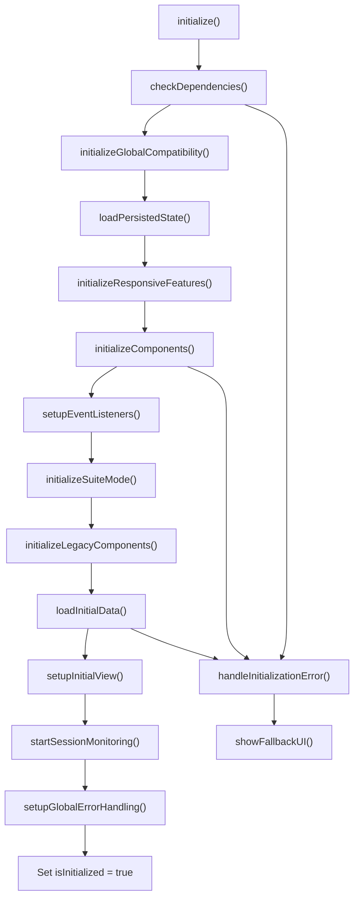
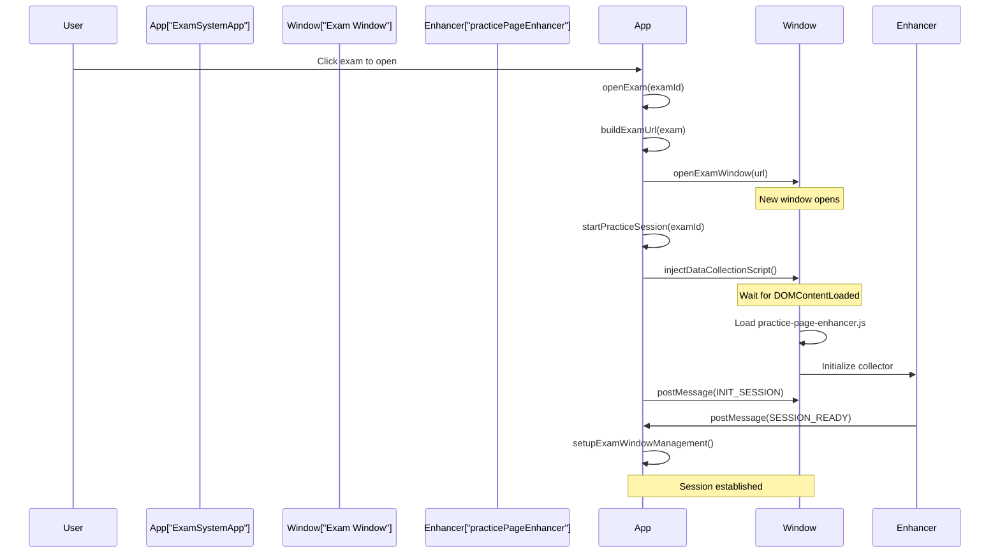
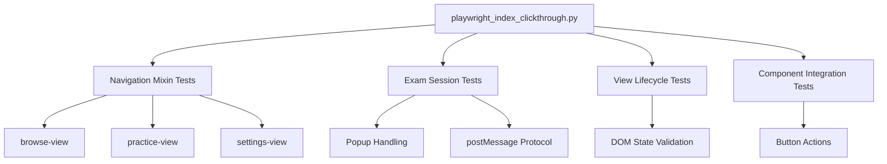
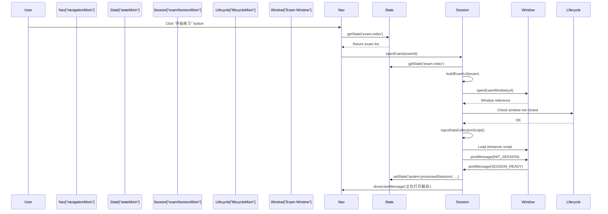

# Mixins & Component Architecture

> **Relevant source files**
> * [css/main.css](https://github.com/sallowayma-git/IELTS-practice/blob/df0c9b8f/css/main.css)
> * [developer/tests/e2e/playwright_index_clickthrough.py](https://github.com/sallowayma-git/IELTS-practice/blob/df0c9b8f/developer/tests/e2e/playwright_index_clickthrough.py)
> * [developer/tests/js/e2e/indexSnapshot.js](https://github.com/sallowayma-git/IELTS-practice/blob/df0c9b8f/developer/tests/js/e2e/indexSnapshot.js)
> * [index.html](https://github.com/sallowayma-git/IELTS-practice/blob/df0c9b8f/index.html)
> * [js/app.js](https://github.com/sallowayma-git/IELTS-practice/blob/df0c9b8f/js/app.js)
> * [js/app/examSessionMixin.js](https://github.com/sallowayma-git/IELTS-practice/blob/df0c9b8f/js/app/examSessionMixin.js)
> * [js/app/lifecycleMixin.js](https://github.com/sallowayma-git/IELTS-practice/blob/df0c9b8f/js/app/lifecycleMixin.js)
> * [js/main.js](https://github.com/sallowayma-git/IELTS-practice/blob/df0c9b8f/js/main.js)
> * [js/views/overviewView.js](https://github.com/sallowayma-git/IELTS-practice/blob/df0c9b8f/js/views/overviewView.js)

## Purpose and Scope

This document describes the mixin-based composition pattern used to structure `ExamSystemApp` and the component lifecycle management system. The mixin architecture provides modular functionality by composing behavior from multiple sources rather than using classical inheritance.

For application initialization flow, see [Application Initialization & Bootstrap](/sallowayma-git/IELTS-practice/3.2-application-initialization-and-bootstrap). For state management details, see [ExamSystemApp & State Management](/sallowayma-git/IELTS-practice/3.1-examsystemapp-and-state-management). For view rendering, see [View Management & Navigation](/sallowayma-git/IELTS-practice/3.3-view-management-and-navigation).

---

## Overview of the Mixin Pattern

The application uses a **mixin composition pattern** where the base `ExamSystemApp` class is extended with multiple mixins that provide specific capabilities. Each mixin is a plain object containing methods that are copied onto `ExamSystemApp.prototype`, allowing the class to inherit behavior from multiple sources.

This design enables:

* **Separation of concerns**: Each mixin handles a specific domain (state, navigation, lifecycle, etc.)
* **Code organization**: Related functionality is grouped into cohesive modules
* **Testability**: Individual mixins can be tested independently
* **Progressive enhancement**: Mixins can be loaded conditionally

**Sources:** [js/app.js L1-L121](https://github.com/sallowayma-git/IELTS-practice/blob/df0c9b8f/js/app.js#L1-L121)

---

## Base ExamSystemApp Class

The `ExamSystemApp` class serves as the foundation that mixins extend. The base class defines:

### Core Properties

| Property | Type | Purpose |
| --- | --- | --- |
| `currentView` | `string` | Currently active view name (default: `'overview'`) |
| `components` | `Object` | Registry of component instances |
| `isInitialized` | `boolean` | Initialization status flag |
| `state` | `Object` | Centralized application state |

### State Structure

The `state` object is organized into five top-level namespaces:

```

```

**Sources:** [js/app.js L6-L62](https://github.com/sallowayma-git/IELTS-practice/blob/df0c9b8f/js/app.js#L6-L62)

---

## Mixin Application Mechanism

### Registration and Application

Mixins are applied through a two-phase process:

1. **Registration**: Each mixin file creates an object and registers it under `window.ExamSystemAppMixins`
2. **Application**: The `applyMixins()` function copies mixin methods onto `ExamSystemApp.prototype`

```

```

The application logic in [js/app.js L64-L81](https://github.com/sallowayma-git/IELTS-practice/blob/df0c9b8f/js/app.js#L64-L81)

:

```

```

### Load Order

Mixins are loaded in `index.html` in this sequence:

1. `js/app/stateMixin.js`
2. `js/app/bootstrapMixin.js`
3. `js/app/lifecycleMixin.js`
4. `js/app/navigationMixin.js`
5. `js/app/examSessionMixin.js`
6. `js/app/suitePracticeMixin.js`
7. `js/app/fallbackMixin.js`
8. `js/app.js` (applies all mixins)

**Sources:** [js/app.js L64-L81](https://github.com/sallowayma-git/IELTS-practice/blob/df0c9b8f/js/app.js#L64-L81)

 [index.html L397-L404](https://github.com/sallowayma-git/IELTS-practice/blob/df0c9b8f/index.html#L397-L404)

---

## Individual Mixins

### State Mixin (stateMixin)

**Purpose**: Provides methods for reading and writing application state.

**Key Methods**:

* `getState(path)`: Retrieves value from state using dot notation (e.g., `'exam.index'`)
* `setState(path, value)`: Updates state value and triggers subscribers
* `subscribeToState(path, callback)`: Registers state change listeners
* `persistState(key, storageKey)`: Saves state to localStorage
* `loadPersistedState()`: Restores state from storage

**State Access Pattern**:

```

```

**Sources:** [js/app.js L67](https://github.com/sallowayma-git/IELTS-practice/blob/df0c9b8f/js/app.js#L67-L67)

---

### Bootstrap Mixin (bootstrapMixin)

**Purpose**: Handles dependency checking, component initialization, and system bootstrap.

**Key Methods**:

* `checkDependencies()`: Verifies required global objects and libraries
* `initializeComponents()`: Creates and configures component instances
* `initializeGlobalCompatibility()`: Sets up legacy global variable synchronization
* `showFallbackUI(canRecover)`: Displays degraded mode UI when initialization fails

**Component Initialization Example**:

```

```

**Sources:** [js/app.js L68](https://github.com/sallowayma-git/IELTS-practice/blob/df0c9b8f/js/app.js#L68-L68)

 [js/main.js L255-L323](https://github.com/sallowayma-git/IELTS-practice/blob/df0c9b8f/js/main.js#L255-L323)

---

### Lifecycle Mixin (lifecycleMixin)

**Purpose**: Manages application lifecycle from initialization to destruction.

**Key Methods**:

| Method | Purpose |
| --- | --- |
| `initialize()` | Main initialization sequence |
| `loadInitialData()` | Loads exam index and practice records |
| `setupEventListeners()` | Binds global event handlers |
| `initializeResponsiveFeatures()` | Sets up responsive managers |
| `handleResize()` | Adjusts layout for screen size changes |
| `destroy()` | Cleanup and state persistence |

**Initialization Sequence**:



The `initialize()` method coordinates all bootstrap steps with progress messages:

```

```

**Error Handling**: The mixin provides `setupGlobalErrorHandling()` which captures unhandled promise rejections and JavaScript errors, maintaining an error log limited to 100 entries.

**Sources:** [js/app/lifecycleMixin.js L1-L607](https://github.com/sallowayma-git/IELTS-practice/blob/df0c9b8f/js/app/lifecycleMixin.js#L1-L607)

---

### Navigation Mixin (navigationMixin)

**Purpose**: Manages view transitions and navigation state.

**Key Methods**:

* `navigateToView(viewName)`: Switches active view
* `showView(viewName)`: Updates DOM to show target view
* `hideAllViews()`: Hides all view containers
* `updateNavigationState(viewName)`: Updates nav button active states
* `onViewActivated(viewName)`: Hook for view-specific initialization

**View Lifecycle**:

```

```

**Sources:** [js/app.js L70](https://github.com/sallowayma-git/IELTS-practice/blob/df0c9b8f/js/app.js#L70-L70)

 [js/main.js L1149-L1211](https://github.com/sallowayma-git/IELTS-practice/blob/df0c9b8f/js/main.js#L1149-L1211)

---

### Exam Session Mixin (examSessionMixin)

**Purpose**: Handles opening practice windows, script injection, and cross-window communication.

**Key Methods**:

| Method | Purpose |
| --- | --- |
| `openExam(examId, options)` | Opens exam in new window/tab |
| `buildExamUrl(exam)` | Constructs exam file path |
| `openExamWindow(examUrl, exam, options)` | Creates window with features |
| `calculateWindowFeatures()` | Determines window size/position |
| `injectDataCollectionScript(examWindow, examId)` | Injects enhancer script |
| `injectInlineScript(examWindow, examId)` | Fallback inline injection |
| `initializePracticeSession(examWindow, examId)` | Sends INIT_SESSION message |
| `setupExamWindowManagement(examWindow, examId)` | Registers window for monitoring |

**Exam Opening Flow**:



**Window Features Calculation**: The mixin calculates window dimensions as 80% of screen size and centers it:

```

```

**Inline Script Injection**: When external script loading fails, `injectInlineScript()` embeds a complete data collector directly into the exam page as inline JavaScript. This fallback creates a minimal `practiceDataCollector` object with answer tracking and suite mode guards.

**Sources:** [js/app/examSessionMixin.js L1-L868](https://github.com/sallowayma-git/IELTS-practice/blob/df0c9b8f/js/app/examSessionMixin.js#L1-L868)

---

### Suite Practice Mixin (suitePracticeMixin)

**Purpose**: Coordinates multi-exam practice sessions where multiple exams open sequentially in the same window.

**Key Methods**:

* `initializeSuiteMode()`: Sets up suite session tracking
* `startSuitePractice()`: Begins a suite session
* `navigateToNextExam(suiteSessionId)`: Advances to next exam in suite
* `handleSuiteComplete(suiteSessionId)`: Finalizes suite session
* `installSuiteWindowGuards(examWindow, suiteSessionId)`: Prevents premature window closure

**Suite Session Structure**:

```

```

**Window Guards**: Suite mode overrides `window.close()` and `window.open()` in the practice window to prevent accidental exits, sending `SUITE_CLOSE_ATTEMPT` messages to the main app instead.

**Sources:** [js/app.js L72](https://github.com/sallowayma-git/IELTS-practice/blob/df0c9b8f/js/app.js#L72-L72)

---

### Fallback Mixin (fallbackMixin)

**Purpose**: Provides degraded functionality when primary systems fail.

**Key Methods**:

* `ensureFallbackSession(examId, examWindow)`: Creates session record for tracking
* `savePracticeRecordFallback(examId, realData)`: Saves practice data without PracticeRecorder
* `handleFallbackMessage(event)`: Processes messages from practice windows
* `cleanupFallbackSession(sessionId)`: Removes session from tracking map

**Fallback Session Tracking**: Uses `Map<sessionId, sessionInfo>` stored in `this.state.system.fallbackExamSessions` to track practice sessions when the main recorder is unavailable.

**Sources:** [js/app.js L74](https://github.com/sallowayma-git/IELTS-practice/blob/df0c9b8f/js/app.js#L74-L74)

 [js/main.js L445-L550](https://github.com/sallowayma-git/IELTS-practice/blob/df0c9b8f/js/main.js#L445-L550)

---

## Component Management

### Component Registry

The `this.components` object serves as a dependency injection container. Components are stored by name and initialized during bootstrap:

```

```

### Component Initialization Order

Components with dependencies are initialized after their dependencies:

1. **Storage layer**: `window.storage` (initialized before app)
2. **Data repositories**: `window.dataRepositories` (initialized before app)
3. **ScoreStorage**: Depends on storage
4. **PracticeRecorder**: Depends on ScoreStorage
5. **DataIntegrityManager**: Depends on repositories
6. **UI components**: SettingsPanel, ThemeManager, etc.

### Component Access

Components are accessed via the `components` object:

```

```

**Sources:** [js/app.js L42-L48](https://github.com/sallowayma-git/IELTS-practice/blob/df0c9b8f/js/app.js#L42-L48)

 [js/app/lifecycleMixin.js L26-L30](https://github.com/sallowayma-git/IELTS-practice/blob/df0c9b8f/js/app/lifecycleMixin.js#L26-L30)

---

## Mixin Method Contracts

### State Mixin Contract

All state-related methods must:

* Use dot notation for paths (e.g., `'practice.records'`)
* Return undefined for non-existent paths
* Trigger subscribers on setState calls
* Handle nested objects and primitive values

### Lifecycle Mixin Contract

Lifecycle methods must:

* Show loading indicators during async operations
* Call `showUserMessage()` for user-facing feedback
* Handle errors gracefully without crashing
* Update `isInitialized` flag appropriately

### Session Mixin Contract

Session management methods must:

* Track window references in `examWindows` Map
* Send INIT_SESSION messages via postMessage
* Handle window.closed checks before operations
* Clean up sessions on window close

**Sources:** [js/app/examSessionMixin.js L1-L868](https://github.com/sallowayma-git/IELTS-practice/blob/df0c9b8f/js/app/examSessionMixin.js#L1-L868)

 [js/app/lifecycleMixin.js L1-L607](https://github.com/sallowayma-git/IELTS-practice/blob/df0c9b8f/js/app/lifecycleMixin.js#L1-L607)

---

## Testing and Validation

### E2E Test Coverage

The Playwright test suite validates mixin functionality:



Test files verify:

* Navigation transitions between views
* Exam window opening and messaging
* Component initialization and availability
* State synchronization across views

**Sources:** [developer/tests/e2e/playwright_index_clickthrough.py L1-L289](https://github.com/sallowayma-git/IELTS-practice/blob/df0c9b8f/developer/tests/e2e/playwright_index_clickthrough.py#L1-L289)

---

## Mixin Coordination Example

### Complete Exam Opening Flow

This example shows how multiple mixins coordinate to open an exam:



The flow demonstrates:

1. **navigationMixin**: Handles user interaction
2. **stateMixin**: Provides exam data
3. **examSessionMixin**: Opens window and injects scripts
4. **lifecycleMixin**: Validates component health
5. **stateMixin**: Updates session tracking state

**Sources:** [js/app/examSessionMixin.js L6-L94](https://github.com/sallowayma-git/IELTS-practice/blob/df0c9b8f/js/app/examSessionMixin.js#L6-L94)

 [js/app/lifecycleMixin.js L300-L358](https://github.com/sallowayma-git/IELTS-practice/blob/df0c9b8f/js/app/lifecycleMixin.js#L300-L358)

---

## Migration from Inline Code

The mixin architecture replaced monolithic inline code in the original `improved-working-system.html`. Benefits of the migration:

| Aspect | Before (Inline) | After (Mixins) |
| --- | --- | --- |
| **Organization** | 3000+ lines in one file | ~200-400 lines per mixin file |
| **Testability** | Difficult to unit test | Each mixin independently testable |
| **Debugging** | Hard to trace execution | Clear method ownership |
| **Code Reuse** | Copy-paste duplication | Shared mixin methods |
| **Maintenance** | Merge conflicts common | Changes isolated to specific mixins |

The comment in [js/main.js L1-L2](https://github.com/sallowayma-git/IELTS-practice/blob/df0c9b8f/js/main.js#L1-L2)

 references this history:

```

```

**Sources:** [js/main.js L1-L2](https://github.com/sallowayma-git/IELTS-practice/blob/df0c9b8f/js/main.js#L1-L2)

 [js/app.js L1-L121](https://github.com/sallowayma-git/IELTS-practice/blob/df0c9b8f/js/app.js#L1-L121)

---

## Summary

The mixin architecture provides:

1. **Modular composition**: Each mixin handles a distinct concern
2. **Flexible extension**: New capabilities added without modifying base class
3. **Progressive enhancement**: Mixins can be loaded conditionally
4. **Clear contracts**: Well-defined interfaces between mixins
5. **Centralized state**: All mixins share unified state object
6. **Component lifecycle**: Coordinated initialization and cleanup

Key mixin files:

* [js/app/stateMixin.js](https://github.com/sallowayma-git/IELTS-practice/blob/df0c9b8f/js/app/stateMixin.js) : State management
* [js/app/bootstrapMixin.js](https://github.com/sallowayma-git/IELTS-practice/blob/df0c9b8f/js/app/bootstrapMixin.js) : Component initialization
* [js/app/lifecycleMixin.js](https://github.com/sallowayma-git/IELTS-practice/blob/df0c9b8f/js/app/lifecycleMixin.js) : Application lifecycle
* [js/app/navigationMixin.js](https://github.com/sallowayma-git/IELTS-practice/blob/df0c9b8f/js/app/navigationMixin.js) : View transitions
* [js/app/examSessionMixin.js](https://github.com/sallowayma-git/IELTS-practice/blob/df0c9b8f/js/app/examSessionMixin.js) : Practice window management
* [js/app/suitePracticeMixin.js](https://github.com/sallowayma-git/IELTS-practice/blob/df0c9b8f/js/app/suitePracticeMixin.js) : Multi-exam sessions
* [js/app/fallbackMixin.js](https://github.com/sallowayma-git/IELTS-practice/blob/df0c9b8f/js/app/fallbackMixin.js) : Degraded mode support

**Sources:** [js/app.js L1-L121](https://github.com/sallowayma-git/IELTS-practice/blob/df0c9b8f/js/app.js#L1-L121)

 [js/app/lifecycleMixin.js L1-L607](https://github.com/sallowayma-git/IELTS-practice/blob/df0c9b8f/js/app/lifecycleMixin.js#L1-L607)

 [js/app/examSessionMixin.js L1-L868](https://github.com/sallowayma-git/IELTS-practice/blob/df0c9b8f/js/app/examSessionMixin.js#L1-L868)

 [index.html L397-L404](https://github.com/sallowayma-git/IELTS-practice/blob/df0c9b8f/index.html#L397-L404)