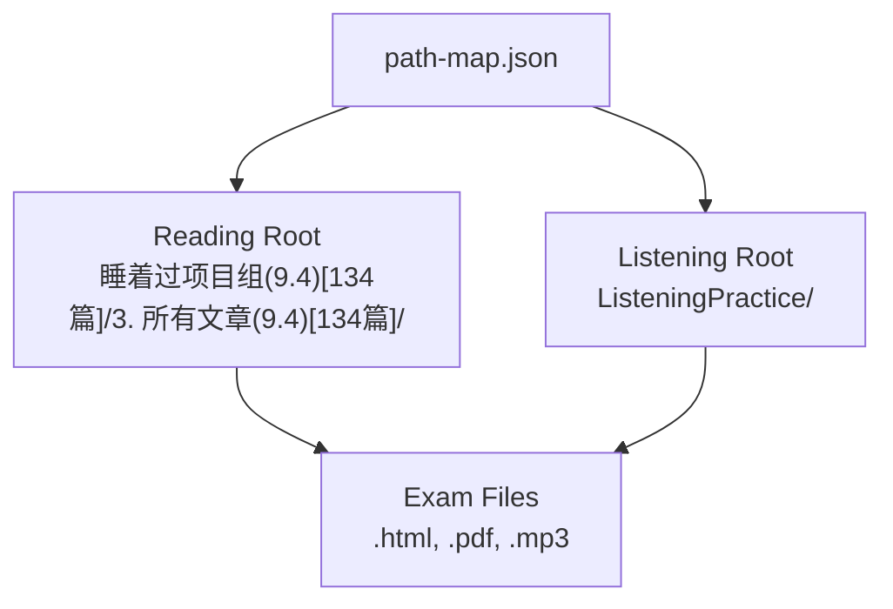
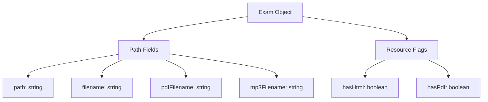
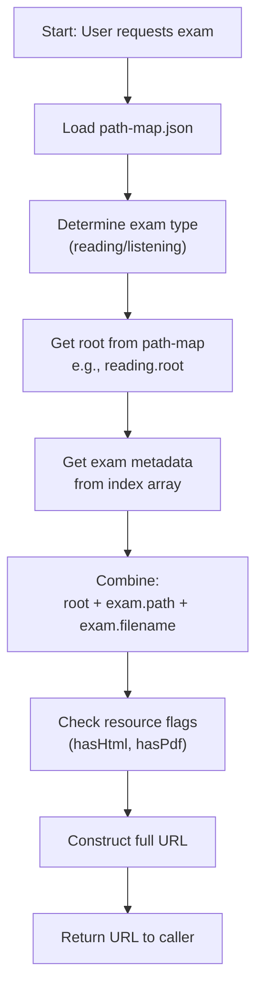
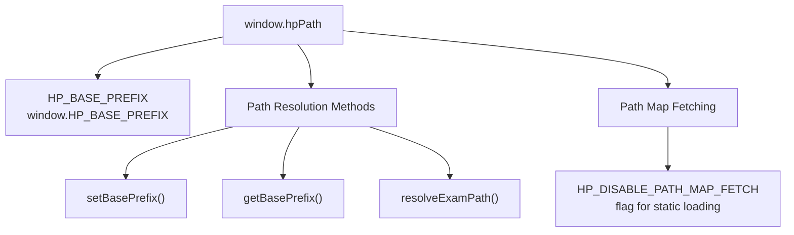
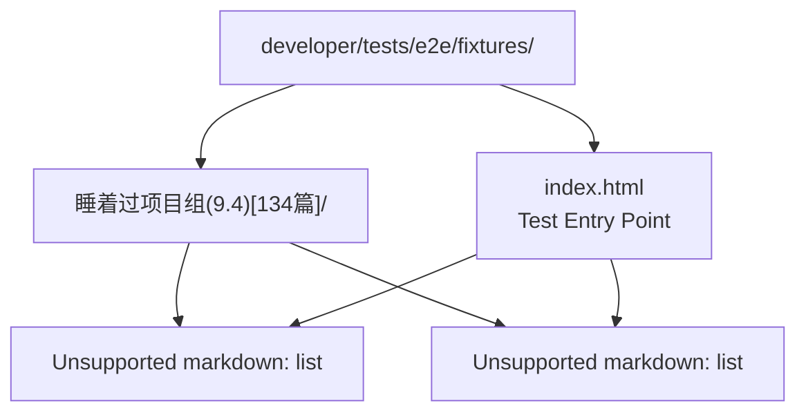
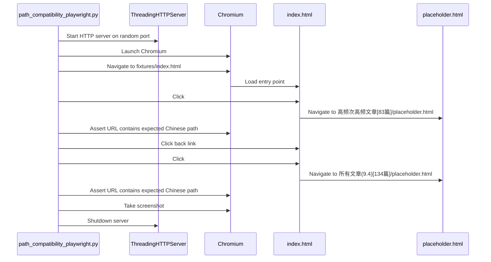
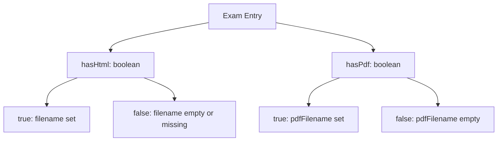

# Path Resolution & Resource Management

> **Relevant source files**
> * [.gitignore](https://github.com/sallowayma-git/IELTS-practice/blob/df0c9b8f/.gitignore)
> * [.superdesign/design_iterations/HP/Welcome.html](https://github.com/sallowayma-git/IELTS-practice/blob/df0c9b8f/.superdesign/design_iterations/HP/Welcome.html)
> * [assets/data/path-map.json](https://github.com/sallowayma-git/IELTS-practice/blob/df0c9b8f/assets/data/path-map.json)
> * [assets/scripts/complete-exam-data.js](https://github.com/sallowayma-git/IELTS-practice/blob/df0c9b8f/assets/scripts/complete-exam-data.js)
> * [assets/scripts/listening-exam-data.js](https://github.com/sallowayma-git/IELTS-practice/blob/df0c9b8f/assets/scripts/listening-exam-data.js)
> * [developer/tests/e2e/fixtures/index.html](https://github.com/sallowayma-git/IELTS-practice/blob/df0c9b8f/developer/tests/e2e/fixtures/index.html)
> * [developer/tests/e2e/path_compatibility_playwright.py](https://github.com/sallowayma-git/IELTS-practice/blob/df0c9b8f/developer/tests/e2e/path_compatibility_playwright.py)

## Purpose and Scope

This document describes the path resolution and resource management system used to locate and load exam content files. The system handles diverse file structures including non-ASCII paths (Chinese characters, special symbols), provides configurable root directories via `path-map.json`, and supports multiple resource types (HTML, PDF, MP3).

For information about exam metadata structure and indexing, see [Exam Index & Metadata Structure](/sallowayma-git/IELTS-practice/6.1-exam-index-and-metadata-structure). For HP theme-specific path handling, the HP plugin system is documented in [HP Path System & Extensions](/sallowayma-git/IELTS-practice/8.3-hp-path-system-and-extensions).

---

## Path Mapping Architecture

The system uses a centralized configuration file to define root directories for different exam types, enabling flexible file organization without hardcoded paths throughout the codebase.

### Path Configuration File

The `path-map.json` file defines root paths for exam resources:

[assets/data/path-map.json L1-L16](https://github.com/sallowayma-git/IELTS-practice/blob/df0c9b8f/assets/data/path-map.json#L1-L16)

**Structure:**

* `reading.root`: Base directory for reading exam content
* `listening.root`: Base directory for listening exam content
* `exceptions`: Reserved for special-case path overrides
* `version`: Configuration schema version
* `lastUpdated`: ISO 8601 timestamp of last modification

The reading root uses non-ASCII characters (Chinese: `睡着过项目组`) demonstrating the system's Unicode path support.



**Sources:** [assets/data/path-map.json L1-L16](https://github.com/sallowayma-git/IELTS-practice/blob/df0c9b8f/assets/data/path-map.json#L1-L16)

---

## Exam Path Metadata

Each exam entry in the index arrays contains path information that combines with the root to form complete resource URLs.

### Exam Object Structure

Exam objects store relative paths and resource filenames:



**Example from Complete Exam Index:**

[assets/scripts/complete-exam-data.js L7-L17](https://github.com/sallowayma-git/IELTS-practice/blob/df0c9b8f/assets/scripts/complete-exam-data.js#L7-L17)

**Example from Listening Exam Index:**

[assets/scripts/listening-exam-data.js L6-L17](https://github.com/sallowayma-git/IELTS-practice/blob/df0c9b8f/assets/scripts/listening-exam-data.js#L6-L17)

### Path Components

| Field | Description | Example |
| --- | --- | --- |
| `path` | Relative directory path from root | `1. P1 - A Brief History of Tea 茶叶简史【高】/` |
| `filename` | HTML practice file name | `1. P1 - A Brief History of Tea 茶叶简史【高】.html` |
| `pdfFilename` | PDF answer key file name | `1. P1 - A Brief History of Tea 茶叶简史【高】.pdf` |
| `mp3Filename` | Audio file name (listening only) | `audio.mp3` |

**Sources:** [assets/scripts/complete-exam-data.js L7-L17](https://github.com/sallowayma-git/IELTS-practice/blob/df0c9b8f/assets/scripts/complete-exam-data.js#L7-L17)

 [assets/scripts/listening-exam-data.js L6-L17](https://github.com/sallowayma-git/IELTS-practice/blob/df0c9b8f/assets/scripts/listening-exam-data.js#L6-L17)

---

## Resource URL Construction

The system constructs full URLs by combining root paths from `path-map.json` with exam-specific path metadata.

### URL Construction Flow



### Example URL Construction

**Reading Exam:**

```yaml
Root:     睡着过项目组(9.4)[134篇]/3. 所有文章(9.4)[134篇]/
Path:     1. P1 - A Brief History of Tea 茶叶简史【高】/
Filename: 1. P1 - A Brief History of Tea 茶叶简史【高】.html
Result:   睡着过项目组(9.4)[134篇]/3. 所有文章(9.4)[134篇]/1. P1 - A Brief History of Tea 茶叶简史【高】/1. P1 - A Brief History of Tea 茶叶简史【高】.html
```

**Listening Exam:**

```yaml
Root:     ListeningPractice/
Path:     P3/1. PART3 Julia and Bob's science project is due/
Filename: 1. PART3 Julia and Bob's science project is due.html
Result:   ListeningPractice/P3/1. PART3 Julia and Bob's science project is due/1. PART3 Julia and Bob's science project is due.html
```

**Sources:** [assets/data/path-map.json L1-L16](https://github.com/sallowayma-git/IELTS-practice/blob/df0c9b8f/assets/data/path-map.json#L1-L16)

 [assets/scripts/complete-exam-data.js L7-L17](https://github.com/sallowayma-git/IELTS-practice/blob/df0c9b8f/assets/scripts/complete-exam-data.js#L7-L17)

 [assets/scripts/listening-exam-data.js L6-L17](https://github.com/sallowayma-git/IELTS-practice/blob/df0c9b8f/assets/scripts/listening-exam-data.js#L6-L17)

---

## HP Path System

The Harry Potter theme implements a specialized path resolution module (`hp-path.js`) that adapts the core path system for the HP plugin architecture.

### HP Path Components



### HP Base Prefix Configuration

The HP theme enforces a base prefix to correctly resolve resources from the theme's location:

[.superdesign/design_iterations/HP/Welcome.html L623-L646](https://github.com/sallowayma-git/IELTS-practice/blob/df0c9b8f/.superdesign/design_iterations/HP/Welcome.html#L623-L646)

**Key Logic:**

* Default base prefix: `../../..` (navigate from HP directory to repo root)
* Checks for fixture paths and overrides if needed
* Falls back to `window.HP_BASE_PREFIX` if `hpPath` object unavailable
* `__HP_DISABLE_PATH_MAP_FETCH__` flag prevents redundant path-map.json fetching

### HP Path Resolution Methods

| Method | Purpose | Example |
| --- | --- | --- |
| `setBasePrefix(prefix)` | Set base path prefix | `hpPath.setBasePrefix('../../..')` |
| `getBasePrefix()` | Get current base prefix | Returns `'../../..'` |
| `resolveExamPath(exam)` | Construct full path for exam | Combines base + root + exam path |

**Sources:** [.superdesign/design_iterations/HP/Welcome.html L623-L646](https://github.com/sallowayma-git/IELTS-practice/blob/df0c9b8f/.superdesign/design_iterations/HP/Welcome.html#L623-L646)

---

## Non-ASCII Path Handling

The system supports Unicode paths including Chinese characters, parentheses, and square brackets in directory names.

### Non-ASCII Path Examples

The reading exam root demonstrates complex Unicode path handling:

```
睡着过项目组(9.4)[134篇]/3. 所有文章(9.4)[134篇]/
```

**Character Types:**

* Chinese characters: `睡着过项目组`, `所有文章`, `篇`
* ASCII numbers: `9.4`, `134`, `3`
* Special symbols: `()`, `[]`, `.`

### Git Ignore Configuration

The `.gitignore` file specifically handles non-ASCII directories while allowing test fixtures:

[.gitignore L8-L25](https://github.com/sallowayma-git/IELTS-practice/blob/df0c9b8f/.gitignore#L8-L25)

**Strategy:**

* Ignore production directories with Chinese names
* Use wildcard patterns for flexible matching
* Explicitly allow test fixture directories using `!` negation
* Escape special characters in fixture paths (`\[`, `\]`)

**Sources:** [.gitignore L8-L25](https://github.com/sallowayma-git/IELTS-practice/blob/df0c9b8f/.gitignore#L8-L25)

 [assets/data/path-map.json L1-L16](https://github.com/sallowayma-git/IELTS-practice/blob/df0c9b8f/assets/data/path-map.json#L1-L16)

---

## Path Compatibility Testing

Dedicated test infrastructure validates non-ASCII path handling across browsers and HTTP servers.

### Test Fixtures Structure



### Test Entry Point

[developer/tests/e2e/fixtures/index.html L30-L45](https://github.com/sallowayma-git/IELTS-practice/blob/df0c9b8f/developer/tests/e2e/fixtures/index.html#L30-L45)

**Test Links:**

* `#high-frequency-link`: Tests access to `2. 高频次高频文章[83篇]/`
* `#all-articles-link`: Tests access to `3. 所有文章(9.4)[134篇]/`

### Playwright Test Implementation

The Playwright test validates end-to-end path resolution:

[developer/tests/e2e/path_compatibility_playwright.py L33-L76](https://github.com/sallowayma-git/IELTS-practice/blob/df0c9b8f/developer/tests/e2e/path_compatibility_playwright.py#L33-L76)

**Test Flow:**



### Silent Request Handler

Custom HTTP handler suppresses logs for cleaner test output:

[developer/tests/e2e/path_compatibility_playwright.py L12-L14](https://github.com/sallowayma-git/IELTS-practice/blob/df0c9b8f/developer/tests/e2e/path_compatibility_playwright.py#L12-L14)

### URL Validation Logic

[developer/tests/e2e/path_compatibility_playwright.py L54-L69](https://github.com/sallowayma-git/IELTS-practice/blob/df0c9b8f/developer/tests/e2e/path_compatibility_playwright.py#L54-L69)

**Validation Strategy:**

* Use `unquote()` to decode percent-encoded URLs
* Check for exact substring matches of expected paths
* Raise `AssertionError` with detailed message on mismatch
* Capture full-page screenshot for visual verification

**Sources:** [developer/tests/e2e/fixtures/index.html L1-L47](https://github.com/sallowayma-git/IELTS-practice/blob/df0c9b8f/developer/tests/e2e/fixtures/index.html#L1-L47)

 [developer/tests/e2e/path_compatibility_playwright.py L1-L85](https://github.com/sallowayma-git/IELTS-practice/blob/df0c9b8f/developer/tests/e2e/path_compatibility_playwright.py#L1-L85)

---

## Resource Type Detection

The system uses boolean flags to indicate available resources for each exam.

### Resource Flag Pattern



### Resource Flag Examples

**Complete Exam (all resources):**
[assets/scripts/complete-exam-data.js L7-L17](https://github.com/sallowayma-git/IELTS-practice/blob/df0c9b8f/assets/scripts/complete-exam-data.js#L7-L17)

**PDF-only Exam:**
[assets/scripts/complete-exam-data.js L463-L472](https://github.com/sallowayma-git/IELTS-practice/blob/df0c9b8f/assets/scripts/complete-exam-data.js#L463-L472)

**Flag Usage:**

* UI can conditionally show "Practice" vs "PDF Only" buttons
* Practice recorder skips HTML loading if `hasHtml: false`
* PDF download functionality checks `hasPdf` before constructing PDF URL

**Sources:** [assets/scripts/complete-exam-data.js L7-L17](https://github.com/sallowayma-git/IELTS-practice/blob/df0c9b8f/assets/scripts/complete-exam-data.js#L7-L17)

 [assets/scripts/complete-exam-data.js L463-L472](https://github.com/sallowayma-git/IELTS-practice/blob/df0c9b8f/assets/scripts/complete-exam-data.js#L463-L472)

---

## Path Resolution Best Practices

### Configuration Principles

1. **Centralized Roots**: Store root paths in `path-map.json`, not hardcoded in JavaScript
2. **Relative Paths**: Exam objects store relative paths from roots for portability
3. **Unicode Safety**: Use UTF-8 encoding consistently across files and servers
4. **Explicit Flags**: Use `hasHtml`/`hasPdf` flags rather than null checks on filenames
5. **Escape Handling**: Let browser handle URL encoding; don't manually percent-encode

### Testing Requirements

1. **HTTP Server Testing**: Always test non-ASCII paths via HTTP, not `file://` protocol
2. **Browser Compatibility**: Test across Chromium, Firefox, Safari for Unicode path support
3. **Server Configuration**: Ensure HTTP servers send correct `Content-Type` and charset headers
4. **Screenshot Verification**: Capture visual proof of successful navigation

### HP Plugin Integration

1. **Base Prefix**: Always set `HP_BASE_PREFIX` before loading HP modules
2. **Static Loading**: Use `__HP_DISABLE_PATH_MAP_FETCH__` to prevent duplicate path-map.json fetches
3. **Fallback Chain**: Implement `hpPath.setBasePrefix()` → `window.HP_BASE_PREFIX` → default fallback

**Sources:** [assets/data/path-map.json L1-L16](https://github.com/sallowayma-git/IELTS-practice/blob/df0c9b8f/assets/data/path-map.json#L1-L16)

 [.superdesign/design_iterations/HP/Welcome.html L623-L646](https://github.com/sallowayma-git/IELTS-practice/blob/df0c9b8f/.superdesign/design_iterations/HP/Welcome.html#L623-L646)

 [developer/tests/e2e/path_compatibility_playwright.py L1-L85](https://github.com/sallowayma-git/IELTS-practice/blob/df0c9b8f/developer/tests/e2e/path_compatibility_playwright.py#L1-L85)