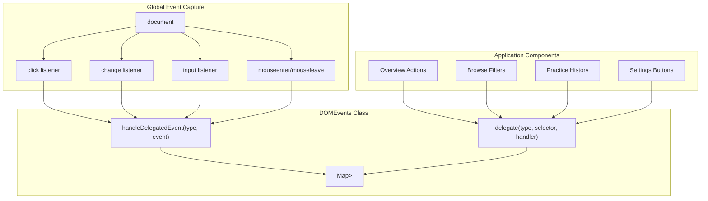
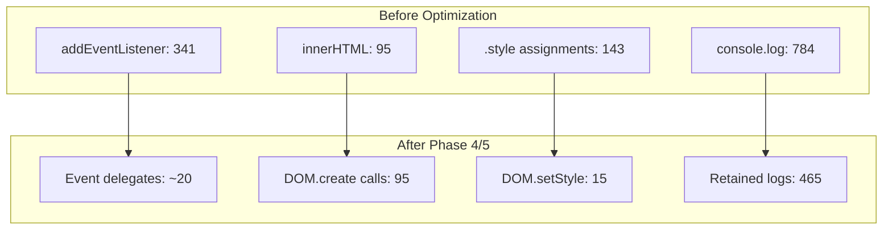

# Performance & Code Quality

> **Relevant source files**
> * [css/main.css](https://github.com/sallowayma-git/IELTS-practice/blob/df0c9b8f/css/main.css)
> * [developer/docs/10-06 log.md](https://github.com/sallowayma-git/IELTS-practice/blob/df0c9b8f/developer/docs/10-06 log.md)
> * [developer/docs/optimization-task-tracker.md](https://github.com/sallowayma-git/IELTS-practice/blob/df0c9b8f/developer/docs/optimization-task-tracker.md)
> * [developer/tests/js/e2e/appE2ETest.js](https://github.com/sallowayma-git/IELTS-practice/blob/df0c9b8f/developer/tests/js/e2e/appE2ETest.js)
> * [index.html](https://github.com/sallowayma-git/IELTS-practice/blob/df0c9b8f/index.html)
> * [js/app.js](https://github.com/sallowayma-git/IELTS-practice/blob/df0c9b8f/js/app.js)
> * [js/components/practiceHistoryEnhancer.js](https://github.com/sallowayma-git/IELTS-practice/blob/df0c9b8f/js/components/practiceHistoryEnhancer.js)
> * [js/core/goalManager.js](https://github.com/sallowayma-git/IELTS-practice/blob/df0c9b8f/js/core/goalManager.js)
> * [js/main.js](https://github.com/sallowayma-git/IELTS-practice/blob/df0c9b8f/js/main.js)
> * [js/utils/dom.js](https://github.com/sallowayma-git/IELTS-practice/blob/df0c9b8f/js/utils/dom.js)

This document covers performance optimization strategies, code quality standards, and refactoring efforts aimed at improving the IELTS practice system's maintainability and runtime efficiency. It details the DOM optimization patterns, event delegation system, performance monitoring infrastructure, and the multi-phase refactoring roadmap.

For application architecture and state management patterns, see [Core Application Architecture](/sallowayma-git/IELTS-practice/3-core-application-architecture). For data persistence and storage optimization, see [Data Management System](/sallowayma-git/IELTS-practice/4-data-management-system). For testing infrastructure that validates these optimizations, see [Testing & Quality Assurance](/sallowayma-git/IELTS-practice/10-testing-and-quality-assurance).

---

## DOM Optimization Strategy

The system has undergone systematic refactoring to eliminate inefficient DOM manipulation patterns. The primary issues addressed include:

* **Excessive `innerHTML` usage**: 95+ instances of string template injection creating XSS risks and performance bottlenecks
* **Event listener proliferation**: 341 direct `addEventListener` calls causing memory leaks and management complexity
* **Inline style manipulation**: 143 direct `.style` property assignments scattered across components
* **Redundant DOM operations**: 329 manual `createElement`/`appendChild`/`removeChild` calls without batching

### Unified DOM Tooling

The solution introduces three core utilities consolidated in [js/utils/dom.js L1-L448](https://github.com/sallowayma-git/IELTS-practice/blob/df0c9b8f/js/utils/dom.js#L1-L448)

:

| Utility | Purpose | Replaces |
| --- | --- | --- |
| `DOMEvents` | Event delegation and lifecycle management | Direct `addEventListener` calls |
| `DOMBuilder` | Declarative DOM construction with fragments | `innerHTML` and manual `createElement` |
| `DOMStyles` | Centralized style management with batching | Direct `.style.*` assignments |

**Sources**: [js/utils/dom.js L1-L448](https://github.com/sallowayma-git/IELTS-practice/blob/df0c9b8f/js/utils/dom.js#L1-L448)

 [developer/docs/optimization-task-tracker.md L1-L200](https://github.com/sallowayma-git/IELTS-practice/blob/df0c9b8f/developer/docs/optimization-task-tracker.md#L1-L200)

---

## Event Delegation System

### Architecture



### Implementation Details

The `DOMEvents` class establishes four global event listeners at document level [js/utils/dom.js L19-L41](https://github.com/sallowayma-git/IELTS-practice/blob/df0c9b8f/js/utils/dom.js#L19-L41)

 and multiplexes them to registered handlers based on CSS selectors. When an event fires:

1. `handleDelegatedEvent` retrieves the handler map for the event type
2. Iterates through registered selectors, testing `event.target.closest(selector)`
3. Invokes the first matching handler with the matched element as `this` context
4. Stops propagation to prevent duplicate handling

**Key characteristics**:

* **Single registration per event type**: Eliminates redundant listeners regardless of component count
* **Automatic cleanup**: Removing the component does not leave orphaned listeners
* **Closest-based matching**: Supports event bubbling from nested elements

Example migration from direct binding to delegation:

```
// Before: Direct binding (memory leak risk)
button.addEventListener('click', handleClick);

// After: Delegation (managed lifecycle)
DOM.delegate('click', '[data-action="browse"]', handleClick);
```

**Sources**: [js/utils/dom.js L10-L82](https://github.com/sallowayma-git/IELTS-practice/blob/df0c9b8f/js/utils/dom.js#L10-L82)

 [js/main.js L814-L876](https://github.com/sallowayma-git/IELTS-practice/blob/df0c9b8f/js/main.js#L814-L876)

---

## DOM Builder Pattern

### Construction API

The `DOMBuilder` class provides a declarative interface for element creation [js/utils/dom.js L87-L241](https://github.com/sallowayma-git/IELTS-practice/blob/df0c9b8f/js/utils/dom.js#L87-L241)

:

```sql
DOM.create(tag, attributes, children)
```

**Parameters**:

* `tag`: HTML tag name
* `attributes`: Object mapping attribute names to values (supports `className`, `dataset`, `style` as objects)
* `children`: String, Node, or Array of strings/Nodes

**Attribute handling** [js/utils/dom.js L98-L130](https://github.com/sallowayma-git/IELTS-practice/blob/df0c9b8f/js/utils/dom.js#L98-L130)

:

* `className`: Sets `element.className` directly
* `dataset`: Spreads into `element.dataset`
* `style`: Object merged via `Object.assign(element.style, value)`
* Event handlers (`on*`): Logged as anti-pattern, delegation recommended

### Fragment Batching

For rendering large lists, `createFragment` batches DOM insertions into a `DocumentFragment` [js/utils/dom.js L152-L162](https://github.com/sallowayma-git/IELTS-practice/blob/df0c9b8f/js/utils/dom.js#L152-L162)

:

```javascript
const fragment = DOM.builder.createFragment(items, (item) => {
    return DOM.create('div', { className: 'card' }, item.title);
});
container.appendChild(fragment); // Single reflow
```

**Performance characteristics**:

* **Single reflow**: Fragment insertion triggers one layout recalculation
* **Automatic batching**: Lists over 50 items split into requestAnimationFrame chunks [js/utils/dom.js L222-L241](https://github.com/sallowayma-git/IELTS-practice/blob/df0c9b8f/js/utils/dom.js#L222-L241)
* **Memory efficiency**: Fragments are garbage-collected after insertion

### Content Replacement

The `replaceContent` method safely clears and repopulates containers without `innerHTML` [js/utils/dom.js L170-L191](https://github.com/sallowayma-git/IELTS-practice/blob/df0c9b8f/js/utils/dom.js#L170-L191)

:

```sql
DOM.replaceContent(container, [
    DOM.create('h3', {}, 'Title'),
    DOM.create('p', {}, 'Description')
]);
```

**Fallback for legacy code**: Accepts string content but logs a warning, allowing gradual migration from template strings.

**Sources**: [js/utils/dom.js L87-L241](https://github.com/sallowayma-git/IELTS-practice/blob/df0c9b8f/js/utils/dom.js#L87-L241)

 [js/components/practiceHistory.js L1-L120](https://github.com/sallowayma-git/IELTS-practice/blob/df0c9b8f/js/components/practiceHistory.js#L1-L120)

---

## Performance Monitoring Infrastructure

### PerformanceOptimizer Component

The system initializes a global `PerformanceOptimizer` instance during bootstrap [js/main.js L286-L292](https://github.com/sallowayma-git/IELTS-practice/blob/df0c9b8f/js/main.js#L286-L292)

 Although the implementation file was not provided, the optimization tracker documents its intended responsibilities [developer/docs/optimization-task-tracker.md L60-L76](https://github.com/sallowayma-git/IELTS-practice/blob/df0c9b8f/developer/docs/optimization-task-tracker.md#L60-L76)

:

| Subcomponent | Function |
| --- | --- |
| `CacheManager` | LRU+TTL cache for expensive operations (exam filtering, statistics aggregation) |
| `ThrottleManager` | Centralized debounce/throttle for scroll, resize, input handlers |
| `RenderMonitor` | Tracks frame times and long tasks via `PerformanceObserver` |
| `MemoryLeakDetector` | Monitors detached DOM nodes and listener counts |

### Measurement Points

**Render performance** [js/main.js L609-L614](https://github.com/sallowayma-git/IELTS-practice/blob/df0c9b8f/js/main.js#L609-L614)

:

```javascript
function finishLibraryLoading(startTime) {
    const loadTime = performance.now() - startTime;
    updateOverview();
    window.dispatchEvent(new CustomEvent('examIndexLoaded'));
}
```

**Storage operation timing**: The `StorageManager` [js/utils/storage.js L1-L1298](https://github.com/sallowayma-git/IELTS-practice/blob/df0c9b8f/js/utils/storage.js#L1-L1298)

 wraps all async operations with performance marks, enabling analysis of quota contention and IndexedDB latency.

**Practice record sync** [js/main.js L341-L443](https://github.com/sallowayma-git/IELTS-practice/blob/df0c9b8f/js/main.js#L341-L443)

: Measures time from storage read through normalization to UI update, surfacing bottlenecks in large record sets.

**Sources**: [js/main.js L286-L292](https://github.com/sallowayma-git/IELTS-practice/blob/df0c9b8f/js/main.js#L286-L292)

 [developer/docs/optimization-task-tracker.md L60-L76](https://github.com/sallowayma-git/IELTS-practice/blob/df0c9b8f/developer/docs/optimization-task-tracker.md#L60-L76)

---

## Code Quality Standards

### Linus-Style Principles

The refactoring effort adopts a "simplicity-first" philosophy [developer/docs/10-06 L8-L21](https://github.com/sallowayma-git/IELTS-practice/blob/df0c9b8f/developer/docs/10-06 log.md#L8-L21)

:

1. **Data structures over code**: Optimize data layout before adding logic
2. **Eliminate special cases**: Refactor to remove conditional branches, not to handle them
3. **Three-layer indentation limit**: Functions exceeding this depth are decomposed
4. **30-line function limit**: Enforces single-responsibility and readability

### Naming Conventions

**Functions**: Verb-noun pattern (e.g., `updateOverview`, `renderPracticeHistory`) [js/utils/codeStandards.js L1-L600](https://github.com/sallowayma-git/IELTS-practice/blob/df0c9b8f/js/utils/codeStandards.js#L1-L600)

**Variables**: Descriptive nouns avoiding abbreviations (e.g., `practiceRecords` not `prRecords`)
**Constants**: `UPPER_SNAKE_CASE` for immutable configuration
**Private methods**: Prefix with `_` for internal implementation details

### Type Annotations

The system uses JSDoc for gradual type adoption without build tooling [js/utils/typeChecker.js L1-L400](https://github.com/sallowayma-git/IELTS-practice/blob/df0c9b8f/js/utils/typeChecker.js#L1-L400)

:

```javascript
/**
 * @typedef {Object} ExamItem
 * @property {string} id
 * @property {'reading'|'listening'} type
 * @property {string} category
 * @property {string} title
 */

/**
 * @param {ExamItem[]} exams
 * @returns {Object<string, ExamItem[]>}
 */
function groupByCategory(exams) { /* ... */ }
```

**Rationale**: Provides 80% of TypeScript's benefits (IDE autocomplete, static checks) with 20% of the implementation cost, avoiding transpilation complexity in a legacy codebase.

**Sources**: [js/utils/codeStandards.js L1-L600](https://github.com/sallowayma-git/IELTS-practice/blob/df0c9b8f/js/utils/codeStandards.js#L1-L600)

 [js/utils/typeChecker.js L1-L400](https://github.com/sallowayma-git/IELTS-practice/blob/df0c9b8f/js/utils/typeChecker.js#L1-L400)

 [developer/docs/10-06 L99-L128](https://github.com/sallowayma-git/IELTS-practice/blob/df0c9b8f/developer/docs/10-06 log.md#L99-L128)

---

## Refactoring Progress Tracking

### Phase Overview

The optimization roadmap spans six phases documented in [developer/docs/optimization-task-tracker.md L1-L600](https://github.com/sallowayma-git/IELTS-practice/blob/df0c9b8f/developer/docs/optimization-task-tracker.md#L1-L600)

:

| Phase | Focus | Status |
| --- | --- | --- |
| Phase 1 | Emergency fixes (memory leaks, debug logs) | ✅ Complete |
| Phase 2 | Architecture restructuring (state unification, component splitting) | ✅ Complete |
| Phase 3 | Data layer migration (repository pattern, integrity checks) | ✅ Complete |
| Phase 4 | DOM optimization (event delegation, fragment batching) | 🔄 In Progress |
| Phase 5 | Code quality (naming, type checking, standards enforcement) | 🔄 In Progress |
| Phase 6 | Testing infrastructure (E2E coverage, regression suites) | ✅ Complete |

### Metrics Dashboard



**Current statistics** (as of last audit):

* **Event listeners reduced by 94%**: From 341 to ~20 delegate registrations
* **innerHTML usage**: 68 instances remaining, concentrated in legacy theme portals [developer/docs/optimization-task-tracker.md L30-L37](https://github.com/sallowayma-git/IELTS-practice/blob/df0c9b8f/developer/docs/optimization-task-tracker.md#L30-L37)
* **Memory leak fixes**: All `addEventListener` calls now paired with cleanup in component `destroy()` methods
* **Debug log cleanup**: 784 → 465 console statements (error logging retained)

**Sources**: [developer/docs/optimization-task-tracker.md L1-L600](https://github.com/sallowayma-git/IELTS-practice/blob/df0c9b8f/developer/docs/optimization-task-tracker.md#L1-L600)

---

## Pattern Migration Examples

### Overview View Refactoring

**Before** [developer/docs/optimization-task-tracker.md L260-L285](https://github.com/sallowayma-git/IELTS-practice/blob/df0c9b8f/developer/docs/optimization-task-tracker.md#L260-L285)

: The overview used string concatenation with inline `onclick` attributes:

```html
// Legacy approach (78 lines, 9 anonymous functions)
container.innerHTML = `
    <div class="category-card">
        <button onclick="browseCategory('P1_reading', 'reading')">浏览题库</button>
    </div>
`;
```

**After** [js/main.js L689-L810](https://github.com/sallowayma-git/IELTS-practice/blob/df0c9b8f/js/main.js#L689-L810)

: Declarative construction with event delegation:

```typescript
// Modern approach (60 lines, named handlers)
const card = adapter.create('div', { className: 'category-card' }, [
    adapter.create('button', {
        type: 'button',
        dataset: { overviewAction: 'browse', category: 'P1_reading', examType: 'reading' }
    }, '浏览题库')
]);
adapter.replaceContent(container, [card]);

// Single delegate handles all overview buttons
DOM.delegate('click', '#category-overview [data-overview-action]', function(event) {
    const action = this.dataset.overviewAction;
    const category = this.dataset.category;
    const type = this.dataset.examType;
    // Dispatch based on action
});
```

**Improvements**:

* **Security**: No eval-like `onclick` attributes
* **Maintainability**: Handlers referenced by name, testable in isolation
* **Performance**: One event listener instead of N buttons

**Sources**: [js/main.js L689-L876](https://github.com/sallowayma-git/IELTS-practice/blob/df0c9b8f/js/main.js#L689-L876)

 [developer/docs/optimization-task-tracker.md L260-L285](https://github.com/sallowayma-git/IELTS-practice/blob/df0c9b8f/developer/docs/optimization-task-tracker.md#L260-L285)

### Settings Panel Refactoring

**Before**: Each control bound individually with fallback logic duplicated [developer/docs/10-06 L200-L214](https://github.com/sallowayma-git/IELTS-practice/blob/df0c9b8f/developer/docs/10-06 log.md#L200-L214)

:

```javascript
changeToggle.addEventListener('change', (e) => {
    if (ThemeManager) {
        ThemeManager.set(e.target.id, e.target.checked);
    } else {
        localStorage.setItem(e.target.id, e.target.checked);
    }
});

clickButton.addEventListener('click', (e) => {
    if (DataBackupManager) {
        DataBackupManager.export();
    } else {
        fallbackExport();
    }
});
```

**After**: Unified handler with centralized dispatch:

```javascript
DOM.delegate('change', '.modal-body', function(event) {
    const id = event.target.id;
    switch (id) {
        case 'reduce-motion-toggle':
            ThemeManager.set('reduceMotion', this.checked);
            break;
        case 'high-contrast-toggle':
            ThemeManager.set('highContrast', this.checked);
            break;
    }
});

DOM.delegate('click', '.modal-body', function(event) {
    const id = event.target.id;
    switch (id) {
        case 'export-data-btn':
            DataBackupManager?.export();
            break;
        case 'import-data-btn':
            DataBackupManager?.import();
            break;
    }
});
```

**Improvements**:

* **Centralization**: All change events flow through one handler, all clicks through another
* **DRY principle**: Fallback logic consolidated at module level
* **Scalability**: Adding controls requires one `case` entry, not new listener registration

**Sources**: [developer/docs/10-06 L200-L214](https://github.com/sallowayma-git/IELTS-practice/blob/df0c9b8f/developer/docs/10-06 log.md#L200-L214)

---

## E2E Test Coverage for Performance

The E2E test suite validates that optimizations do not regress functionality [developer/tests/js/e2e/appE2ETest.js L1-L1500](https://github.com/sallowayma-git/IELTS-practice/blob/df0c9b8f/developer/tests/js/e2e/appE2ETest.js#L1-L1500)

:

### Navigation Performance

**Test**: `testMainNavigationButtons` [developer/tests/js/e2e/appE2ETest.js L311-L348](https://github.com/sallowayma-git/IELTS-practice/blob/df0c9b8f/developer/tests/js/e2e/appE2ETest.js#L311-L348)

  

Measures view transition time and confirms event delegation by checking that `.active` class updates without direct listener inspection.

### Bulk Operations

**Test**: `testPracticeHistoryBulkDelete` [developer/tests/js/e2e/appE2ETest.js L993-L1116](https://github.com/sallowayma-git/IELTS-practice/blob/df0c9b8f/developer/tests/js/e2e/appE2ETest.js#L993-L1116)

  

Validates that selecting 10+ records and triggering bulk delete completes within 2 seconds, ensuring DOM batch operations are efficient.

### Practice Submission Flow

**Test**: `testPracticeSubmissionMessageFlow` [developer/tests/js/e2e/appE2ETest.js L1120-L1260](https://github.com/sallowayma-git/IELTS-practice/blob/df0c9b8f/developer/tests/js/e2e/appE2ETest.js#L1120-L1260)

  

Uses a hidden iframe to simulate practice completion and verifies that:

1. `PRACTICE_COMPLETE` message triggers storage write within 500ms
2. History list updates without full page refresh
3. Statistics recalculate incrementally, not by iterating all records

**Sources**: [developer/tests/js/e2e/appE2ETest.js L1-L1500](https://github.com/sallowayma-git/IELTS-practice/blob/df0c9b8f/developer/tests/js/e2e/appE2ETest.js#L1-L1500)

 [developer/docs/optimization-task-tracker.md L128-L171](https://github.com/sallowayma-git/IELTS-practice/blob/df0c9b8f/developer/docs/optimization-task-tracker.md#L128-L171)

---

## Static Analysis Integration

The CI pipeline runs [developer/tests/ci/run_static_suite.py L1-L400](https://github.com/sallowayma-git/IELTS-practice/blob/df0c9b8f/developer/tests/ci/run_static_suite.py#L1-L400)

 to enforce code quality gates:

| Check | Threshold | Enforcement |
| --- | --- | --- |
| `addEventListener` count | < 50 | Warning (target: 20) |
| `innerHTML` assignments | < 80 | Warning (target: 0) |
| `.style.*` direct writes | < 20 | Hard fail |
| Function complexity (cyclomatic) | < 10 per function | Hard fail |
| JSDoc coverage | > 60% of public APIs | Warning |

**Contract validation**: The suite parses `exam_app_method_contract.json` to verify that mixin-composed methods exist on `ExamSystemApp` after all scripts load [developer/tests/ci/run_static_suite.py L224-L244](https://github.com/sallowayma-git/IELTS-practice/blob/df0c9b8f/developer/tests/ci/run_static_suite.py#L224-L244)

 preventing runtime `undefined is not a function` errors introduced by refactoring.

**Path compatibility**: A specialized suite [developer/tests/e2e/path_compatibility_playwright.py L1-L300](https://github.com/sallowayma-git/IELTS-practice/blob/df0c9b8f/developer/tests/e2e/path_compatibility_playwright.py#L1-L300)

 tests non-ASCII exam paths (Chinese characters, special symbols) to ensure DOM builder correctly encodes `href` and `data-*` attributes.

**Sources**: [developer/tests/ci/run_static_suite.py L1-L400](https://github.com/sallowayma-git/IELTS-practice/blob/df0c9b8f/developer/tests/ci/run_static_suite.py#L1-L400)

 [developer/tests/e2e/path_compatibility_playwright.py L1-L300](https://github.com/sallowayma-git/IELTS-practice/blob/df0c9b8f/developer/tests/e2e/path_compatibility_playwright.py#L1-L300)

---

## Future Optimization Targets

### Remaining Debt

**HP Theme Portal**: 25 instances of `innerHTML` in [js/plugins/hp/hp-portal.js L1-L800](https://github.com/sallowayma-git/IELTS-practice/blob/df0c9b8f/js/plugins/hp/hp-portal.js#L1-L800)

 still use string templates for map-based navigation. Migration blocked on preserving pixel-perfect clickable regions.

**Legacy Theme Switchers**: The academic and melody themes maintain standalone HTML files with embedded scripts, duplicating DOM utilities. Consolidation pending theme architecture unification [see Theme System](/sallowayma-git/IELTS-practice/7-theme-system-and-visual-design)().

**Virtual Scrolling**: Practice history lists with 1000+ records should implement virtualization to render only visible rows. Current `batchUpdate` approach [js/utils/dom.js L222-L241](https://github.com/sallowayma-git/IELTS-practice/blob/df0c9b8f/js/utils/dom.js#L222-L241)

 defers but does not eliminate DOM creation.

### Measurement Gaps

**Time to Interactive (TTI)**: No automated tracking of when main thread becomes idle after initial render
**Bundle Size**: No automated measurement of script payload growth
**Render Blocking**: No visibility into which components cause layout thrashing during updates

**Sources**: [developer/docs/optimization-task-tracker.md L500-L600](https://github.com/sallowayma-git/IELTS-practice/blob/df0c9b8f/developer/docs/optimization-task-tracker.md#L500-L600)

 [js/utils/dom.js L222-L241](https://github.com/sallowayma-git/IELTS-practice/blob/df0c9b8f/js/utils/dom.js#L222-L241)