# Practice Enhancement System

> **Relevant source files**
> * [js/app.js](https://github.com/sallowayma-git/IELTS-practice/blob/db0f538c/js/app.js)
> * [js/practice-page-enhancer.js](https://github.com/sallowayma-git/IELTS-practice/blob/db0f538c/js/practice-page-enhancer.js)

This document covers the Practice Enhancement System, which is responsible for enhancing individual practice pages with additional functionality including answer capture, progress tracking, and integration with the main application. This system bridges the gap between standalone practice pages and the centralized IELTS practice management system.

For information about the communication protocol between practice pages and the main application, see [Session Communication Protocol](/sallowayma-git/IELTS-practice/6.2-session-communication-protocol). For details about the practice page template structure, see [Practice Page Template](/sallowayma-git/IELTS-practice/6.1-practice-page-template).

## Architecture Overview

The Practice Enhancement System operates through a sophisticated script injection and enhancement mechanism that augments practice pages with data collection and communication capabilities.

### Core System Components

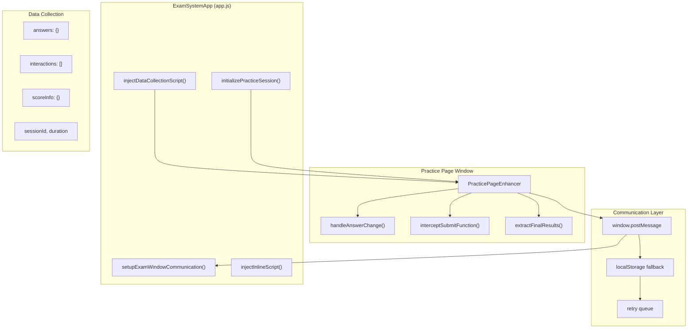

Sources: [js/app.js L950-L1038](https://github.com/sallowayma-git/IELTS-practice/blob/db0f538c/js/app.js#L950-L1038)

 [js/practice-page-enhancer.js L17-L34](https://github.com/sallowayma-git/IELTS-practice/blob/db0f538c/js/practice-page-enhancer.js#L17-L34)

 [js/practice-page-enhancer.js L724-L761](https://github.com/sallowayma-git/IELTS-practice/blob/db0f538c/js/practice-page-enhancer.js#L724-L761)

### Enhancement Lifecycle

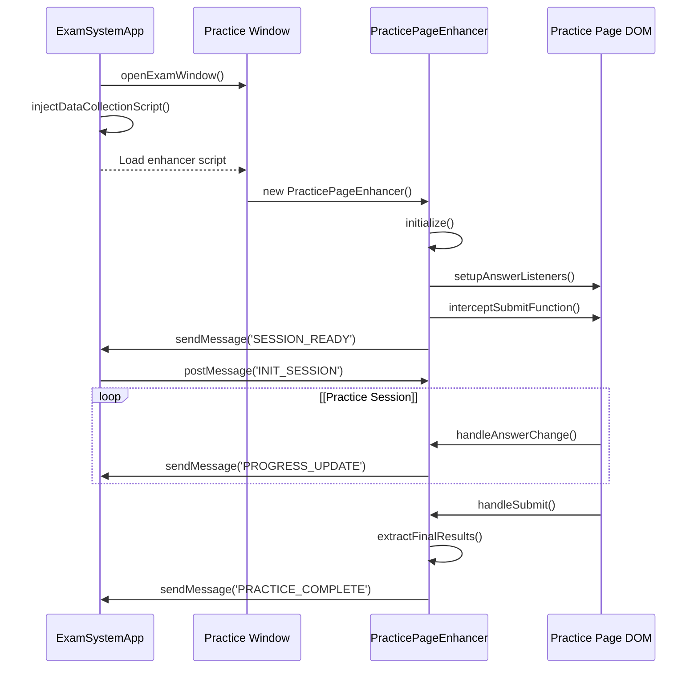

Sources: [js/app.js L951-L1038](https://github.com/sallowayma-git/IELTS-practice/blob/db0f538c/js/app.js#L951-L1038)

 [js/practice-page-enhancer.js L39-L64](https://github.com/sallowayma-git/IELTS-practice/blob/db0f538c/js/practice-page-enhancer.js#L39-L64)

 [js/practice-page-enhancer.js L902-L918](https://github.com/sallowayma-git/IELTS-practice/blob/db0f538c/js/practice-page-enhancer.js#L902-L918)

## Script Injection Process

The practice enhancement system begins with the injection of the enhancement script into practice page windows. This process handles various scenarios including cross-origin restrictions and script loading failures.

### Injection Strategy

The system employs a multi-tiered injection approach:

| Method | Priority | Use Case | Implementation |
| --- | --- | --- | --- |
| File Injection | Primary | Same-origin pages | `fetch('./js/practice-page-enhancer.js')` |
| Inline Script | Fallback | Script loading failure | Embedded data collector |
| Communication Fallback | Last Resort | Cross-origin restrictions | localStorage events |

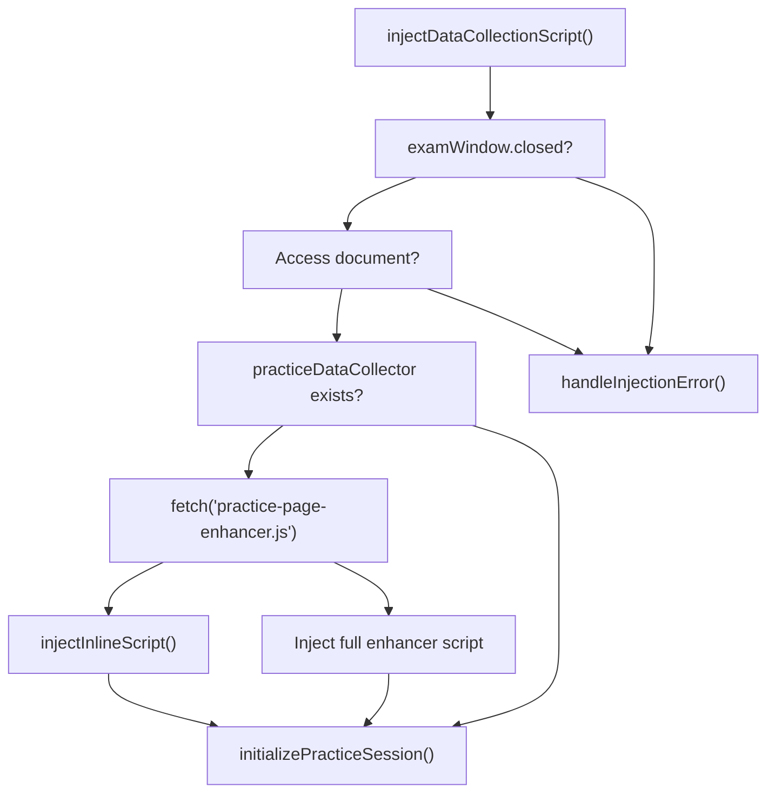

Sources: [js/app.js L951-L1038](https://github.com/sallowayma-git/IELTS-practice/blob/db0f538c/js/app.js#L951-L1038)

 [js/app.js L1043-L1113](https://github.com/sallowayma-git/IELTS-practice/blob/db0f538c/js/app.js#L1043-L1113)

 [js/app.js L1164-L1186](https://github.com/sallowayma-git/IELTS-practice/blob/db0f538c/js/app.js#L1164-L1186)

### Cross-Origin Handling

The system gracefully handles cross-origin restrictions that prevent script injection:

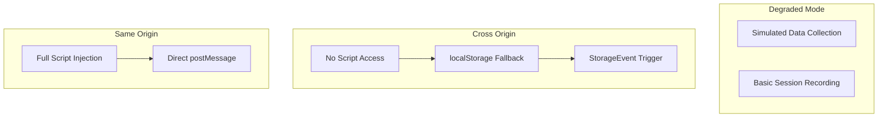

Sources: [js/practice-page-enhancer.js L264-L308](https://github.com/sallowayma-git/IELTS-practice/blob/db0f538c/js/practice-page-enhancer.js#L264-L308)

 [js/practice-page-enhancer.js L206-L216](https://github.com/sallowayma-git/IELTS-practice/blob/db0f538c/js/practice-page-enhancer.js#L206-L216)

 [js/app.js L1164-L1186](https://github.com/sallowayma-git/IELTS-practice/blob/db0f538c/js/app.js#L1164-L1186)

## Practice Page Enhancement Functionality

The `PracticePageEnhancer` class provides comprehensive enhancement capabilities for practice pages, transforming them from standalone pages into integrated components of the larger system.

### Core Enhancement Features

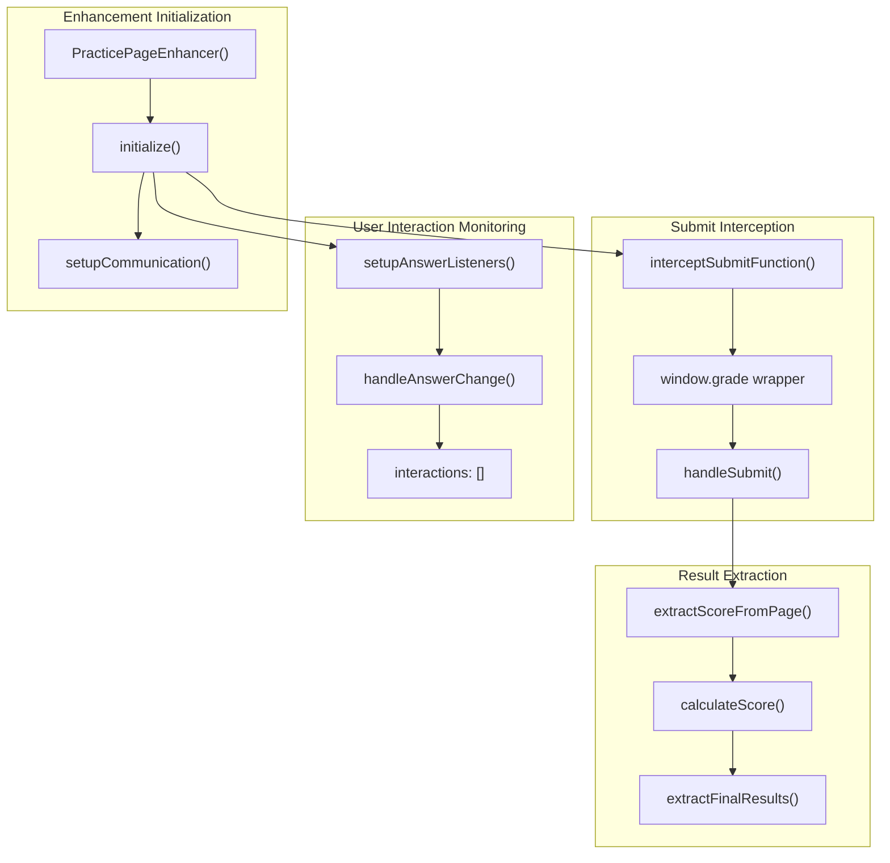

Sources: [js/practice-page-enhancer.js L17-L34](https://github.com/sallowayma-git/IELTS-practice/blob/db0f538c/js/practice-page-enhancer.js#L17-L34)

 [js/practice-page-enhancer.js L39-L64](https://github.com/sallowayma-git/IELTS-practice/blob/db0f538c/js/practice-page-enhancer.js#L39-L64)

 [js/practice-page-enhancer.js L354-L370](https://github.com/sallowayma-git/IELTS-practice/blob/db0f538c/js/practice-page-enhancer.js#L354-L370)

### Answer Collection Mechanism

The system monitors all form interactions to capture user responses:

| Input Type | Detection Method | Value Extraction | Storage Format |
| --- | --- | --- | --- |
| Text Input | `input[name^="q"]` | `element.value` | `{questionId: value}` |
| Radio Button | `input[type="radio"]` | `element.checked ? element.value : null` | `{questionId: selectedValue}` |
| Checkbox | `input[type="checkbox"]` | `element.checked ? element.value : null` | `{questionId: checkedValue}` |

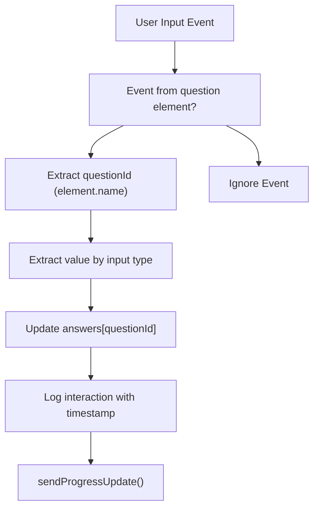

Sources: [js/practice-page-enhancer.js L354-L414](https://github.com/sallowayma-git/IELTS-practice/blob/db0f538c/js/practice-page-enhancer.js#L354-L414)

 [js/practice-page-enhancer.js L374-L414](https://github.com/sallowayma-git/IELTS-practice/blob/db0f538c/js/practice-page-enhancer.js#L374-L414)

### Submit Function Interception

The system intercepts the practice page's grading function to capture completion data:

```mermaid
sequenceDiagram
  participant User
  participant Page DOM
  participant Original grade()
  participant PracticePageEnhancer
  participant Main App

  User->>Page DOM: Click Submit Button
  Page DOM->>PracticePageEnhancer: Intercepted grade() call
  PracticePageEnhancer->>Original grade(): Execute original grading
  Original grade()->>Page DOM: Display results
  note over PracticePageEnhancer: Wait 800ms for results to display
  PracticePageEnhancer->>PracticePageEnhancer: extractFinalResults()
  PracticePageEnhancer->>Main App: sendMessage('PRACTICE_COMPLETE')
```

Sources: [js/practice-page-enhancer.js L418-L458](https://github.com/sallowayma-git/IELTS-practice/blob/db0f538c/js/practice-page-enhancer.js#L418-L458)

 [js/practice-page-enhancer.js L462-L488](https://github.com/sallowayma-git/IELTS-practice/blob/db0f538c/js/practice-page-enhancer.js#L462-L488)

## Communication Protocol

The enhanced practice pages communicate with the main application through a robust messaging system that includes retry mechanisms and fallback options.

### Message Types and Data Flow

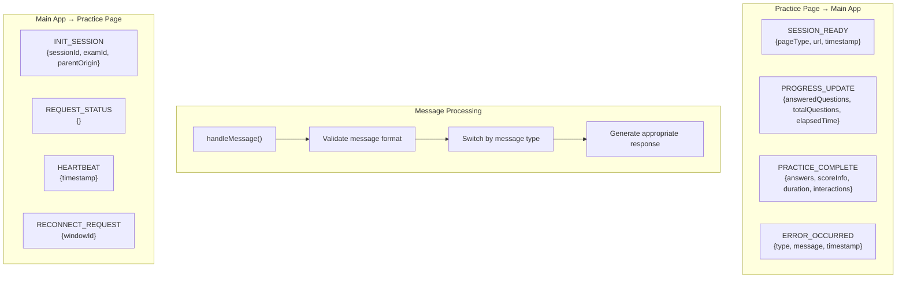

Sources: [js/practice-page-enhancer.js L88-L128](https://github.com/sallowayma-git/IELTS-practice/blob/db0f538c/js/practice-page-enhancer.js#L88-L128)

 [js/practice-page-enhancer.js L721-L761](https://github.com/sallowayma-git/IELTS-practice/blob/db0f538c/js/practice-page-enhancer.js#L721-L761)

 [js/app.js L1221-L1285](https://github.com/sallowayma-git/IELTS-practice/blob/db0f538c/js/app.js#L1221-L1285)

### Resilient Communication System

The system implements multiple layers of communication reliability:

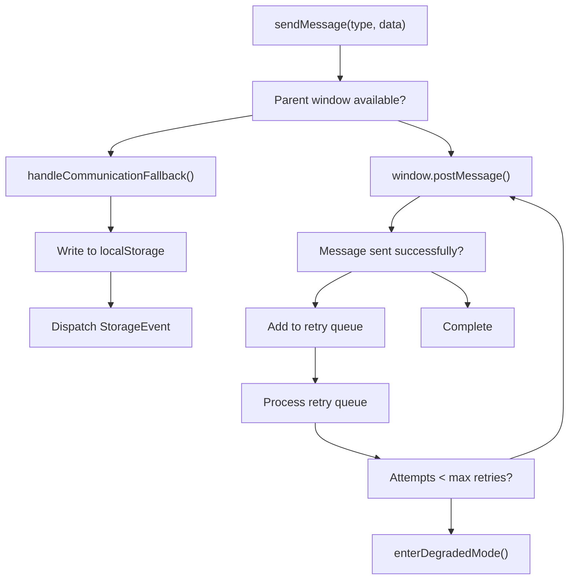

Sources: [js/practice-page-enhancer.js L724-L761](https://github.com/sallowayma-git/IELTS-practice/blob/db0f538c/js/practice-page-enhancer.js#L724-L761)

 [js/practice-page-enhancer.js L264-L308](https://github.com/sallowayma-git/IELTS-practice/blob/db0f538c/js/practice-page-enhancer.js#L264-L308)

 [js/practice-page-enhancer.js L842-L898](https://github.com/sallowayma-git/IELTS-practice/blob/db0f538c/js/practice-page-enhancer.js#L842-L898)

## Data Collection and Extraction

The system collects comprehensive data about practice sessions, including user interactions, performance metrics, and completion results.

### Score Extraction Strategy

The system employs multiple strategies to extract scoring information from completed practices:

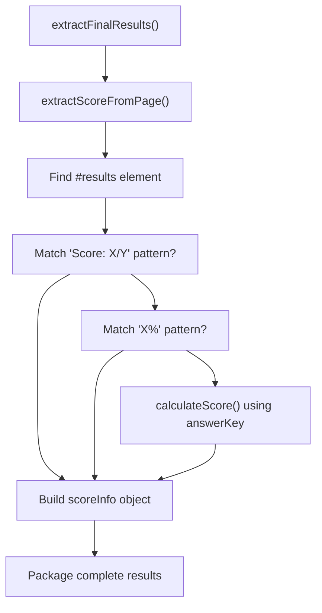

Sources: [js/practice-page-enhancer.js L490-L522](https://github.com/sallowayma-git/IELTS-practice/blob/db0f538c/js/practice-page-enhancer.js#L490-L522)

 [js/practice-page-enhancer.js L525-L576](https://github.com/sallowayma-git/IELTS-practice/blob/db0f538c/js/practice-page-enhancer.js#L525-L576)

 [js/practice-page-enhancer.js L580-L626](https://github.com/sallowayma-git/IELTS-practice/blob/db0f538c/js/practice-page-enhancer.js#L580-L626)

### Data Structure Schema

The system collects data in a comprehensive structured format:

| Data Category | Fields | Source | Purpose |
| --- | --- | --- | --- |
| Session Info | `sessionId`, `startTime`, `endTime`, `duration` | Enhancer timing | Session tracking |
| Answers | `questionId: value` mappings | DOM monitoring | Response capture |
| Interactions | Timestamped user actions | Event logging | Behavioral analysis |
| Score Info | `correct`, `total`, `accuracy`, `percentage` | Page extraction/calculation | Performance metrics |
| Metadata | `pageType`, `url`, `source` | Environment detection | Context information |

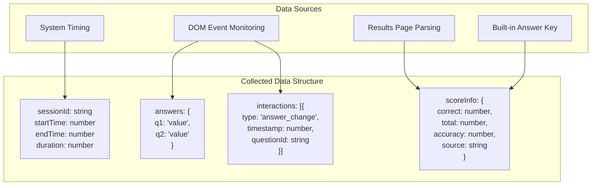

Sources: [js/practice-page-enhancer.js L490-L522](https://github.com/sallowayma-git/IELTS-practice/blob/db0f538c/js/practice-page-enhancer.js#L490-L522)

 [js/practice-page-enhancer.js L644-L687](https://github.com/sallowayma-git/IELTS-practice/blob/db0f538c/js/practice-page-enhancer.js#L644-L687)

 [js/app.js L1419-L1465](https://github.com/sallowayma-git/IELTS-practice/blob/db0f538c/js/app.js#L1419-L1465)

## Error Handling and Resilience

The Practice Enhancement System implements comprehensive error handling and recovery mechanisms to ensure reliable operation across various scenarios.

### Multi-Tier Error Recovery

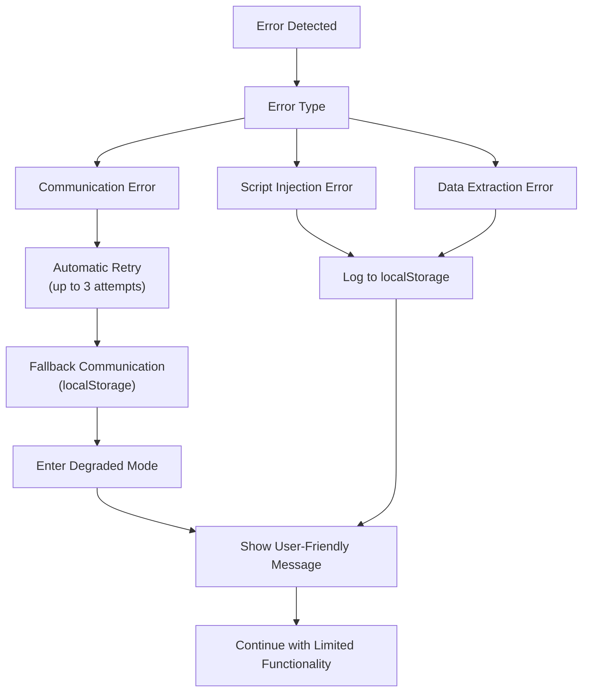

Sources: [js/practice-page-enhancer.js L157-L202](https://github.com/sallowayma-git/IELTS-practice/blob/db0f538c/js/practice-page-enhancer.js#L157-L202)

 [js/practice-page-enhancer.js L206-L261](https://github.com/sallowayma-git/IELTS-practice/blob/db0f538c/js/practice-page-enhancer.js#L206-L261)

 [js/app.js L1164-L1186](https://github.com/sallowayma-git/IELTS-practice/blob/db0f538c/js/app.js#L1164-L1186)

### Degraded Mode Operations

When the full enhancement system fails, the system gracefully degrades while maintaining core functionality:

| Full Mode Feature | Degraded Mode Equivalent | Implementation |
| --- | --- | --- |
| Real-time progress tracking | Basic session timing | `startTime` recording only |
| Detailed answer capture | Simplified change detection | Limited to `change` events |
| Advanced score extraction | Basic result parsing | Pattern matching only |
| Retry-based communication | One-shot localStorage fallback | Single attempt communication |

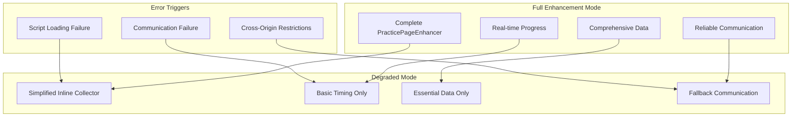

Sources: [js/practice-page-enhancer.js L206-L261](https://github.com/sallowayma-git/IELTS-practice/blob/db0f538c/js/practice-page-enhancer.js#L206-L261)

 [js/app.js L1043-L1113](https://github.com/sallowayma-git/IELTS-practice/blob/db0f538c/js/app.js#L1043-L1113)

 [js/app.js L1290-L1336](https://github.com/sallowayma-git/IELTS-practice/blob/db0f538c/js/app.js#L1290-L1336)