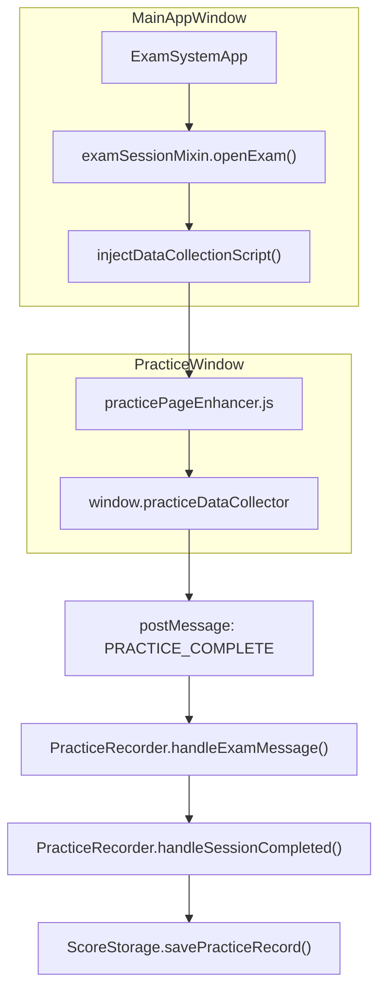
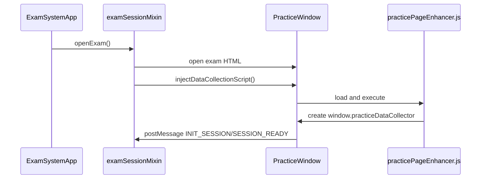
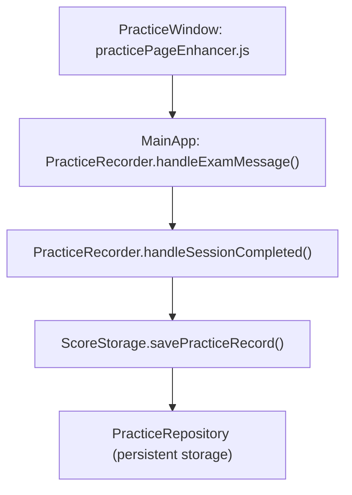

# Practice Page Enhancement & Data Collection

> **Relevant source files**
> * [developer/tests/e2e/playwright_index_clickthrough.py](https://github.com/sallowayma-git/IELTS-practice/blob/df0c9b8f/developer/tests/e2e/playwright_index_clickthrough.py)
> * [developer/tests/js/e2e/indexSnapshot.js](https://github.com/sallowayma-git/IELTS-practice/blob/df0c9b8f/developer/tests/js/e2e/indexSnapshot.js)
> * [js/app/examSessionMixin.js](https://github.com/sallowayma-git/IELTS-practice/blob/df0c9b8f/js/app/examSessionMixin.js)
> * [js/app/lifecycleMixin.js](https://github.com/sallowayma-git/IELTS-practice/blob/df0c9b8f/js/app/lifecycleMixin.js)
> * [js/core/practiceRecorder.js](https://github.com/sallowayma-git/IELTS-practice/blob/df0c9b8f/js/core/practiceRecorder.js)
> * [js/core/scoreStorage.js](https://github.com/sallowayma-git/IELTS-practice/blob/df0c9b8f/js/core/scoreStorage.js)
> * [js/views/overviewView.js](https://github.com/sallowayma-git/IELTS-practice/blob/df0c9b8f/js/views/overviewView.js)

## Purpose and Scope

This document describes the mechanisms for enhancing practice pages and collecting user answer data in the IELTS Practice System. It covers the injection of the `practicePageEnhancer` script, the collection and normalization of answers and interaction data, and the integration of this data into the main application's session and record management.

* For details on how practice sessions are managed and persisted, see [Practice Recorder & Score Storage](/sallowayma-git/IELTS-practice/5.1-practice-recorder-and-score-storage).
* For the cross-window communication protocol (e.g., `postMessage` message types), see [Cross-Window Communication Protocol](/sallowayma-git/IELTS-practice/5.3-cross-window-communication-protocol).
* For suite/multi-exam session handling, see [Suite Practice Mode](/sallowayma-git/IELTS-practice/5.4-suite-practice-mode).

---

## System Overview

The practice page enhancement and data collection system is responsible for:

* Injecting a data collection script into the exam/practice window.
* Capturing user answers, timing, and interaction events.
* Sending collected data back to the main application window for validation and storage.
* Supporting both modern and legacy exam HTML formats.

This system is a critical bridge between the user interface (where answers are entered) and the backend data management (where results are stored and analyzed).

---

### Diagram: Practice Page Enhancement Flow



**Sources:**
[js/app/examSessionMixin.js L6-L276](https://github.com/sallowayma-git/IELTS-practice/blob/df0c9b8f/js/app/examSessionMixin.js#L6-L276)

[js/practice-page-enhancer.js](https://github.com/sallowayma-git/IELTS-practice/blob/df0c9b8f/js/practice-page-enhancer.js)

[js/core/practiceRecorder.js L244-L442](https://github.com/sallowayma-git/IELTS-practice/blob/df0c9b8f/js/core/practiceRecorder.js#L244-L442)

[js/core/scoreStorage.js L321-L363](https://github.com/sallowayma-git/IELTS-practice/blob/df0c9b8f/js/core/scoreStorage.js#L321-L363)

---

## Script Injection and Enhancement

### Injection Process

When a user starts a practice session, the main application opens the exam HTML in a new window and injects the data collection script. This is handled by the `injectDataCollectionScript(examWindow, examId)` method in `examSessionMixin`.

* The script is loaded from `js/practice-page-enhancer.js` and injected into the practice window's DOM.
* If cross-origin restrictions prevent injection, a fallback inline script is used.
* The script sets up a global `window.practiceDataCollector` object in the practice window.

**Key Code Entities:**

| Function / Class | File | Role |
| --- | --- | --- |
| `injectDataCollectionScript` | js/app/examSessionMixin.js | Injects the enhancer script into the practice window |
| `practicePageEnhancer.js` | js/practice-page-enhancer.js | Implements answer collection and event hooks |
| `window.practiceDataCollector` | (injected) | Exposes answer collection API in the practice window |

**Sources:**
[js/app/examSessionMixin.js L203-L276](https://github.com/sallowayma-git/IELTS-practice/blob/df0c9b8f/js/app/examSessionMixin.js#L203-L276)

[js/practice-page-enhancer.js](https://github.com/sallowayma-git/IELTS-practice/blob/df0c9b8f/js/practice-page-enhancer.js)

---

### Diagram: Script Injection and Collector Initialization



**Sources:**
[js/app/examSessionMixin.js L6-L276](https://github.com/sallowayma-git/IELTS-practice/blob/df0c9b8f/js/app/examSessionMixin.js#L6-L276)

[js/practice-page-enhancer.js](https://github.com/sallowayma-git/IELTS-practice/blob/df0c9b8f/js/practice-page-enhancer.js)

---

## Data Collection and Answer Tracking

### Collector Responsibilities

The injected script (`practicePageEnhancer.js`) is responsible for:

* Listening to input events (e.g., `change` on form fields) to capture answers.
* Tracking timing information (e.g., when the session started, time spent per question).
* Hooking into submit buttons to detect when the user completes the exam.
* Aggregating all collected data into a structured object.
* Sending a `PRACTICE_COMPLETE` message to the main window via `postMessage`.

**Collector API (injected):**

| Property / Method | Description |
| --- | --- |
| `sessionId` | Unique session identifier |
| `examId` | Exam identifier |
| `answers` | Collected answers (name-value pairs) |
| `startTime` | Session start timestamp |
| `initialize()` | Sets up event listeners for answer tracking |
| `sendResults()` | Sends collected data to the main window |

**Sources:**
[js/practice-page-enhancer.js](https://github.com/sallowayma-git/IELTS-practice/blob/df0c9b8f/js/practice-page-enhancer.js)

[js/app/examSessionMixin.js L281-L522](https://github.com/sallowayma-git/IELTS-practice/blob/df0c9b8f/js/app/examSessionMixin.js#L281-L522)

---

### Data Structure Collected

The data sent back to the main window typically includes:

* `sessionId`: Unique session identifier.
* `examId`: The exam being practiced.
* `duration`: Time spent in seconds.
* `answers`: Object or array of user answers.
* `source`: Indicates the collector type (e.g., `'inline_collector'`).

This data is sent in a `PRACTICE_COMPLETE` message via `postMessage`.

**Example Data Payload:**

```json
{
  "type": "PRACTICE_COMPLETE",
  "data": {
    "sessionId": "reading_20240601_123456",
    "examId": "reading_20240601",
    "duration": 1200,
    "answers": {
      "q1": "A",
      "q2": "B",
      "q3": "C"
    },
    "source": "inline_collector"
  }
}
```

**Sources:**
[js/practice-page-enhancer.js](https://github.com/sallowayma-git/IELTS-practice/blob/df0c9b8f/js/practice-page-enhancer.js)

[js/app/examSessionMixin.js L291-L510](https://github.com/sallowayma-git/IELTS-practice/blob/df0c9b8f/js/app/examSessionMixin.js#L291-L510)

---

## Data Reception and Normalization

### Handling Collected Data

The main application window listens for messages from the practice window. When a `PRACTICE_COMPLETE` message is received:

* `PracticeRecorder.handleExamMessage(event)` dispatches to `handleSessionCompleted(data)`.
* The session is finalized, and a practice record is constructed.
* Data is normalized and validated before being persisted.

**Key Code Entities:**

| Function / Class | File | Role |
| --- | --- | --- |
| `handleExamMessage` | js/core/practiceRecorder.js | Dispatches incoming messages from practice window |
| `handleSessionCompleted` | js/core/practiceRecorder.js | Finalizes session and prepares record for storage |
| `savePracticeRecord` | js/core/practiceRecorder.js / js/core/scoreStorage.js | Persists the normalized record |

**Sources:**
[js/core/practiceRecorder.js L244-L442](https://github.com/sallowayma-git/IELTS-practice/blob/df0c9b8f/js/core/practiceRecorder.js#L244-L442)

[js/core/scoreStorage.js L321-L363](https://github.com/sallowayma-git/IELTS-practice/blob/df0c9b8f/js/core/scoreStorage.js#L321-L363)

---

### Diagram: Data Flow from Practice Window to Storage



**Sources:**
[js/practice-page-enhancer.js](https://github.com/sallowayma-git/IELTS-practice/blob/df0c9b8f/js/practice-page-enhancer.js)

[js/core/practiceRecorder.js L244-L442](https://github.com/sallowayma-git/IELTS-practice/blob/df0c9b8f/js/core/practiceRecorder.js#L244-L442)

[js/core/scoreStorage.js L321-L363](https://github.com/sallowayma-git/IELTS-practice/blob/df0c9b8f/js/core/scoreStorage.js#L321-L363)

---

## Data Normalization and Storage

### Record Normalization

Before storage, the collected data is normalized to ensure consistency:

* Timestamps are converted to ISO strings.
* Answer arrays are standardized (questionId, answer, correct, timeSpent, etc.).
* Metadata (exam title, category, type) is inferred or filled in.
* Numeric fields (score, accuracy, duration) are validated and clamped.

This normalization is handled by `ScoreStorage.standardizeRecord()` and related methods.

**Key Normalization Steps:**

| Step | Method | File |
| --- | --- | --- |
| Infer practice type | `inferPracticeType` | js/core/scoreStorage.js |
| Resolve record date | `resolveRecordDate` | js/core/scoreStorage.js |
| Standardize answers | `standardizeAnswers` | js/core/scoreStorage.js |
| Validate record | `validateRecord` | js/core/scoreStorage.js |

**Sources:**
[js/core/scoreStorage.js L368-L462](https://github.com/sallowayma-git/IELTS-practice/blob/df0c9b8f/js/core/scoreStorage.js#L368-L462)

---

### Table: Practice Record Fields

| Field | Type | Description |
| --- | --- | --- |
| `id` | string | Unique record identifier |
| `examId` | string | Exam identifier |
| `sessionId` | string | Session identifier |
| `type` | string | Practice type (reading/listening) |
| `startTime` | string | ISO timestamp of session start |
| `endTime` | string | ISO timestamp of session end |
| `duration` | number | Duration in seconds |
| `date` | string | ISO date (YYYY-MM-DD) |
| `status` | string | 'completed', 'interrupted', etc. |
| `score` | number | Score (raw or normalized) |
| `totalQuestions` | number | Total number of questions |
| `correctAnswers` | number | Number of correct answers |
| `accuracy` | number | Accuracy (0.0 - 1.0) |
| `answers` | array | Array of answer objects |
| `questionTypePerformance` | object | Per-type performance stats |
| `metadata` | object | Exam and session metadata |
| `createdAt` | string | Record creation timestamp |
| `updatedAt` | string | Last update timestamp |

**Sources:**
[js/core/scoreStorage.js L368-L413](https://github.com/sallowayma-git/IELTS-practice/blob/df0c9b8f/js/core/scoreStorage.js#L368-L413)

---

## Error Handling and Fallbacks

### Robustness Features

* If the main storage mechanism (`ScoreStorage`) fails, the system falls back to saving records directly in the `PracticeRepository`.
* If all storage fails (e.g., quota exceeded), records are saved to temporary storage for later recovery.
* All critical operations are retried up to three times with exponential backoff.

**Key Fallback Methods:**

| Method | File | Description |
| --- | --- | --- |
| `fallbackSavePracticeRecord` | js/core/practiceRecorder.js | Fallback to direct repository save |
| `saveToTemporaryStorage` | js/core/practiceRecorder.js | Save to temp storage if all else fails |

**Sources:**
[js/core/practiceRecorder.js L682-L898](https://github.com/sallowayma-git/IELTS-practice/blob/df0c9b8f/js/core/practiceRecorder.js#L682-L898)

---

## Testing and Quality Assurance

### Automated Testing

End-to-end (E2E) tests using Playwright verify:

* That the script injection and data collection work across all supported browsers.
* That answer data is correctly collected, sent, and stored.
* That the UI updates as expected after practice completion.

**Relevant Test Scripts:**

| Test File | Description |
| --- | --- |
| `playwright_index_clickthrough.py` | Simulates user navigation, practice, and verifies data collection |
| `indexSnapshot.js` | Provides a static HTML snapshot for offline E2E testing |

**Sources:**
[developer/tests/e2e/playwright_index_clickthrough.py](https://github.com/sallowayma-git/IELTS-practice/blob/df0c9b8f/developer/tests/e2e/playwright_index_clickthrough.py)

[developer/tests/js/e2e/indexSnapshot.js](https://github.com/sallowayma-git/IELTS-practice/blob/df0c9b8f/developer/tests/js/e2e/indexSnapshot.js)

---

## Summary Table: Key Code Entities

| Entity | File | Description |
| --- | --- | --- |
| `injectDataCollectionScript` | js/app/examSessionMixin.js | Injects the enhancer script |
| `practicePageEnhancer.js` | js/practice-page-enhancer.js | Implements answer collection |
| `window.practiceDataCollector` | (injected) | Exposes answer API in practice window |
| `handleExamMessage` | js/core/practiceRecorder.js | Handles messages from practice window |
| `handleSessionCompleted` | js/core/practiceRecorder.js | Finalizes and stores session data |
| `savePracticeRecord` | js/core/scoreStorage.js | Persists normalized record |
| `fallbackSavePracticeRecord` | js/core/practiceRecorder.js | Fallback storage logic |

**Sources:**
[js/app/examSessionMixin.js L203-L276](https://github.com/sallowayma-git/IELTS-practice/blob/df0c9b8f/js/app/examSessionMixin.js#L203-L276)

[js/practice-page-enhancer.js](https://github.com/sallowayma-git/IELTS-practice/blob/df0c9b8f/js/practice-page-enhancer.js)

[js/core/practiceRecorder.js L244-L723](https://github.com/sallowayma-git/IELTS-practice/blob/df0c9b8f/js/core/practiceRecorder.js#L244-L723)

[js/core/scoreStorage.js L321-L413](https://github.com/sallowayma-git/IELTS-practice/blob/df0c9b8f/js/core/scoreStorage.js#L321-L413)

---

## See Also

* [Practice Recorder & Score Storage](/sallowayma-git/IELTS-practice/5.1-practice-recorder-and-score-storage): For details on session management and record persistence.
* [Cross-Window Communication Protocol](/sallowayma-git/IELTS-practice/5.3-cross-window-communication-protocol): For message types and handshake details.
* [Suite Practice Mode](/sallowayma-git/IELTS-practice/5.4-suite-practice-mode): For multi-exam session handling and window guards.

---