# Practice Page Template

> **Relevant source files**
> * [templates/template_base.html](https://github.com/sallowayma-git/IELTS-practice/blob/db0f538c/templates/template_base.html)

This document covers the base HTML template system that provides the foundation for individual IELTS practice sessions. The `template_base.html` file serves as a self-contained, full-featured practice environment that handles reading passages, questions, answer collection, and session management.

For information about how practice pages communicate with the main application, see [Session Communication Protocol](/sallowayma-git/IELTS-practice/6.2-session-communication-protocol). For details about the session enhancement system, see [Practice Enhancement System](/sallowayma-git/IELTS-practice/6.3-practice-enhancement-system).

## Template Architecture

The practice page template is designed as a standalone HTML document that can function independently while integrating with the broader IELTS practice system. It combines layout, styling, interactive features, and communication protocols into a single file.

**Sources:** [templates/template_base.html L1-L1363](https://github.com/sallowayma-git/IELTS-practice/blob/db0f538c/templates/template_base.html#L1-L1363)

## Layout System

The template implements a sophisticated two-pane layout with responsive design capabilities and user-customizable sizing.

### Pane Structure

| Component | CSS Selector | Flex Properties | Purpose |
| --- | --- | --- | --- |
| Container | `.shell` | `display: flex` | Main layout container |
| Left Pane | `#left` | `flex: 0 0 50%` | Reading passage display |
| Divider | `#divider` | `flex: 0 0 8px` | Resizable splitter |
| Right Pane | `#right` | `flex: 1 1 auto` | Questions and answers |

The drag-to-resize functionality is implemented through mouse and touch event handlers that dynamically adjust the flex properties of the panes.

**Sources:** [templates/template_base.html L35-L66](https://github.com/sallowayma-git/IELTS-practice/blob/db0f538c/templates/template_base.html#L35-L66)

 [templates/template_base.html L877-L907](https://github.com/sallowayma-git/IELTS-practice/blob/db0f538c/templates/template_base.html#L877-L907)

### Responsive Design

The template includes comprehensive responsive design patterns that adapt to different screen sizes:

* Mobile layouts stack panes vertically: [templates/template_base.html L276-L311](https://github.com/sallowayma-git/IELTS-practice/blob/db0f538c/templates/template_base.html#L276-L311)
* Touch-friendly controls with adjusted sizing
* Adaptive navigation elements and button spacing

## Interactive Features

### Question Navigation System

The bottom navigation bar provides quick access to all questions with visual status indicators:

**Sources:** [templates/template_base.html L554-L575](https://github.com/sallowayma-git/IELTS-practice/blob/db0f538c/templates/template_base.html#L554-L575)

 [templates/template_base.html L1118-L1139](https://github.com/sallowayma-git/IELTS-practice/blob/db0f538c/templates/template_base.html#L1118-L1139)

### Timer Functionality

The practice timer provides session timing with pause/resume capabilities:

| Function | Purpose | Implementation |
| --- | --- | --- |
| `startTimer()` | Initialize timer interval | Sets 1-second interval updates |
| `toggleTimer()` | Pause/resume functionality | Toggles `timerRunning` state |
| `updateTimer()` | Display time formatting | Formats seconds to MM:SS |

**Sources:** [templates/template_base.html L833-L866](https://github.com/sallowayma-git/IELTS-practice/blob/db0f538c/templates/template_base.html#L833-L866)

### Text Highlighting System

The template includes a sophisticated text selection and highlighting system:

**Sources:** [templates/template_base.html L909-L1116](https://github.com/sallowayma-git/IELTS-practice/blob/db0f538c/templates/template_base.html#L909-L1116)

## Styling and Theme System

### CSS Architecture

The template uses a CSS custom properties system for consistent theming:

| CSS Variable | Light Mode | Dark Mode | Usage |
| --- | --- | --- | --- |
| `--bg` | `#f6f7fb` | `#0f172a` | Background color |
| `--panel` | `#fff` | `#1e293b` | Panel backgrounds |
| `--line` | `#e5e7eb` | `#334155` | Border colors |
| `--accent` | `#3b82f6` | `#3b82f6` | Accent color |
| `--muted` | `#6b7280` | `#94a3b8` | Muted text |

**Sources:** [templates/template_base.html L9-L16](https://github.com/sallowayma-git/IELTS-practice/blob/db0f538c/templates/template_base.html#L9-L16)

 [templates/template_base.html L186-L274](https://github.com/sallowayma-git/IELTS-practice/blob/db0f538c/templates/template_base.html#L186-L274)

### Theme Switching

The `toggleTheme()` function manages dark mode state persistence:

```mermaid
flowchart TD

ThemeButton[".theme-toggle<br>🌙/☀️ Button"]
ToggleFunction["toggleTheme()<br>Class Toggle"]
LocalStorage["localStorage<br>'darkMode' key"]
BodyClass["body.dark<br>CSS Class"]
Variables["CSS Custom Properties<br>--bg, --panel, --line"]
DarkRules["body.dark Selectors<br>Override Values"]
ComponentStyles["Component Styling<br>Buttons, Inputs, etc."]

BodyClass --> Variables

subgraph subGraph1 ["CSS Effects"]
    Variables
    DarkRules
    ComponentStyles
    Variables --> DarkRules
    DarkRules --> ComponentStyles
end

subgraph subGraph0 ["Theme System"]
    ThemeButton
    ToggleFunction
    LocalStorage
    BodyClass
    ThemeButton --> ToggleFunction
    ToggleFunction --> LocalStorage
    ToggleFunction --> BodyClass
end
```

**Sources:** [templates/template_base.html L868-L875](https://github.com/sallowayma-git/IELTS-practice/blob/db0f538c/templates/template_base.html#L868-L875)

 [templates/template_base.html L1204-L1208](https://github.com/sallowayma-git/IELTS-practice/blob/db0f538c/templates/template_base.html#L1204-L1208)

## Answer Collection and Scoring

### Input Handling

The template manages two types of question inputs:

1. **Radio button questions** (True/False/Not Given): [templates/template_base.html L657-L711](https://github.com/sallowayma-git/IELTS-practice/blob/db0f538c/templates/template_base.html#L657-L711)
2. **Text input questions** (Fill-in-the-blank): [templates/template_base.html L724-L753](https://github.com/sallowayma-git/IELTS-practice/blob/db0f538c/templates/template_base.html#L724-L753)

### Scoring System

The `grade()` function implements comprehensive answer validation:

**Sources:** [templates/template_base.html L1141-L1197](https://github.com/sallowayma-git/IELTS-practice/blob/db0f538c/templates/template_base.html#L1141-L1197)

## Communication Integration

### Practice Page Enhancer Integration

The template includes both external script loading and inline fallback for practice page enhancement:

### Inline Enhancer System

The fallback inline enhancer provides core communication functionality:

| Function | Purpose | Implementation |
| --- | --- | --- |
| `initialize()` | Setup communication | Message listeners and DOM monitoring |
| `setupCommunication()` | Parent window detection | Window.opener or window.parent |
| `setupAnswerListeners()` | Answer tracking | Input change monitoring |
| `interceptSubmit()` | Grade function override | Submission detection and data capture |
| `handleSubmit()` | Results transmission | PostMessage to parent window |

**Sources:** [templates/template_base.html L1216-L1358](https://github.com/sallowayma-git/IELTS-practice/blob/db0f538c/templates/template_base.html#L1216-L1358)

### Message Protocol

The template implements a structured message protocol for parent-child communication:

* **INIT_SESSION**: Initialization from parent
* **SESSION_READY**: Template ready confirmation
* **PRACTICE_COMPLETE**: Final results transmission

**Sources:** [templates/template_base.html L1244-L1253](https://github.com/sallowayma-git/IELTS-practice/blob/db0f538c/templates/template_base.html#L1244-L1253)

 [templates/template_base.html L1301-L1313](https://github.com/sallowayma-git/IELTS-practice/blob/db0f538c/templates/template_base.html#L1301-L1313)