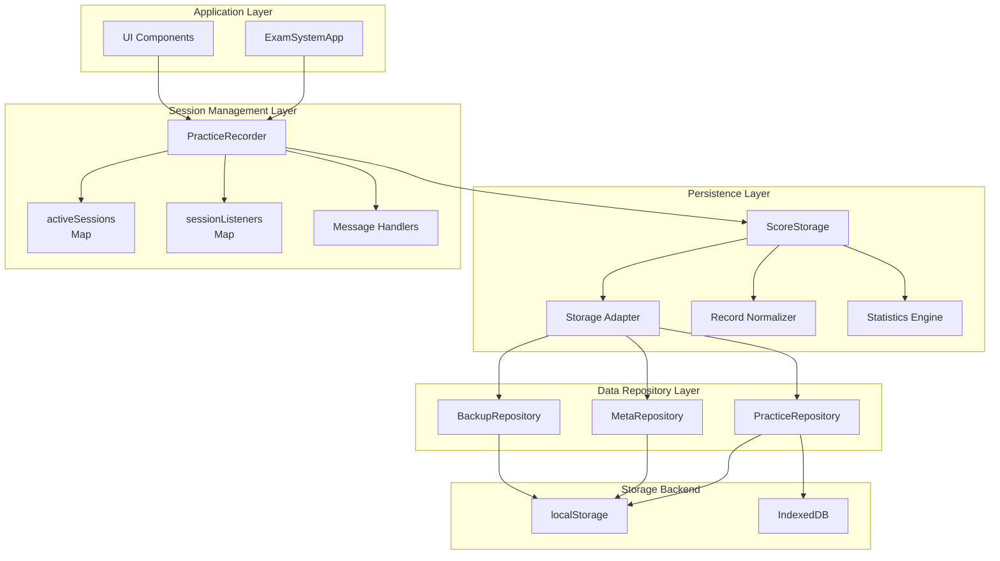
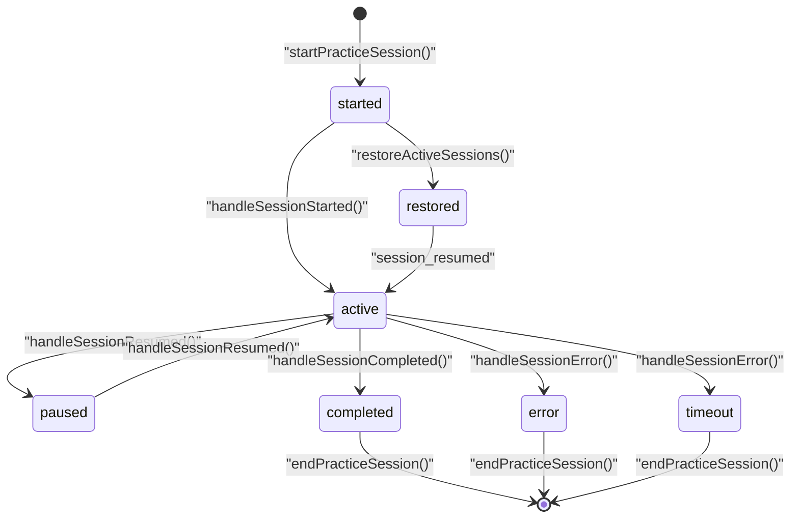
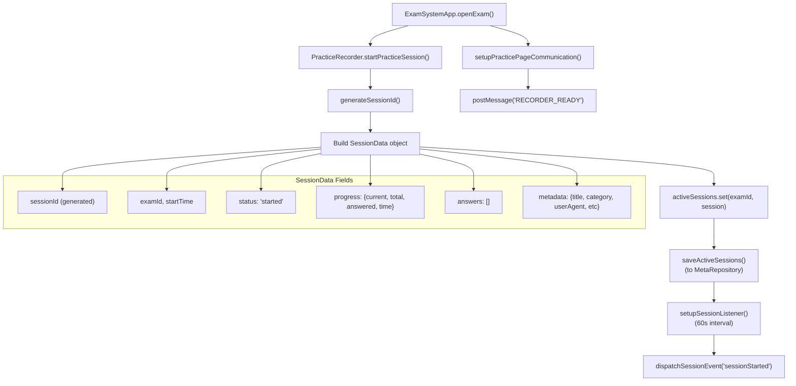
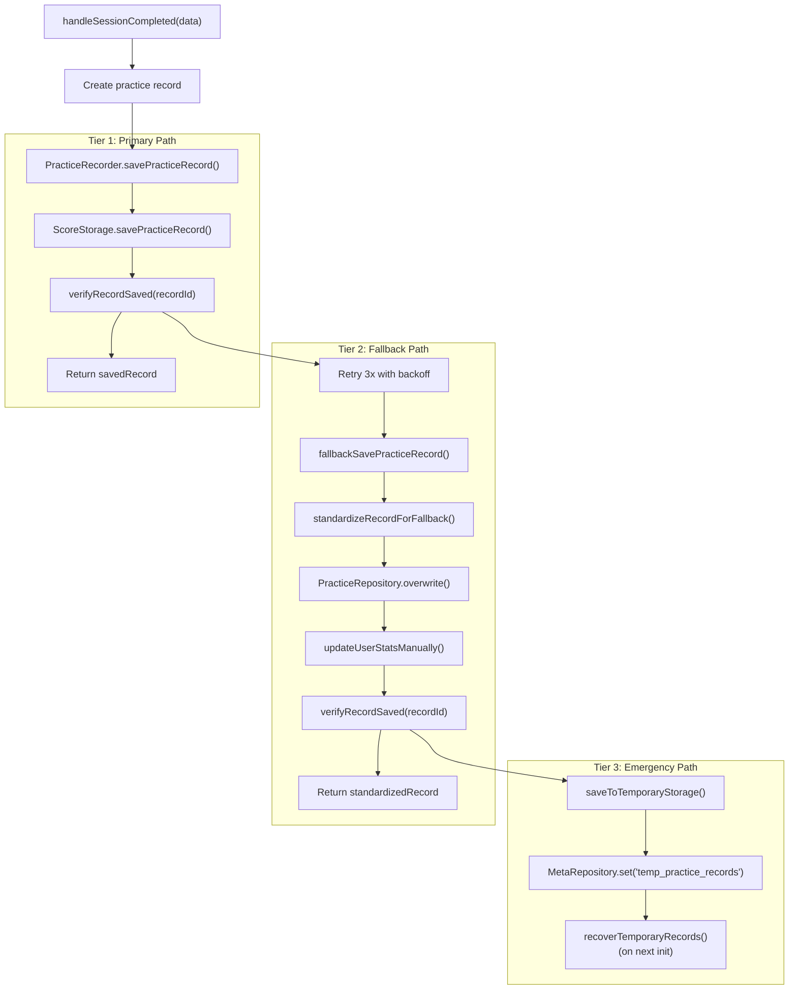
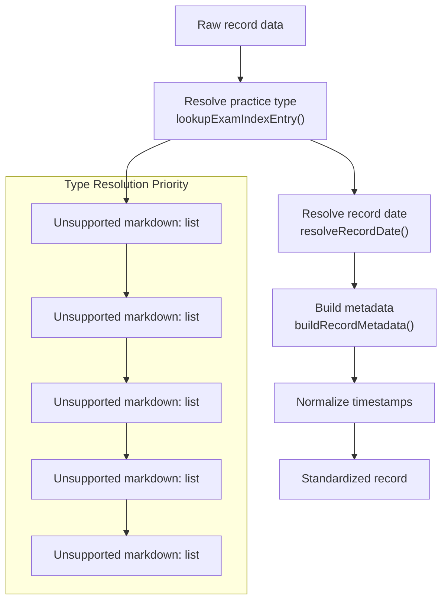
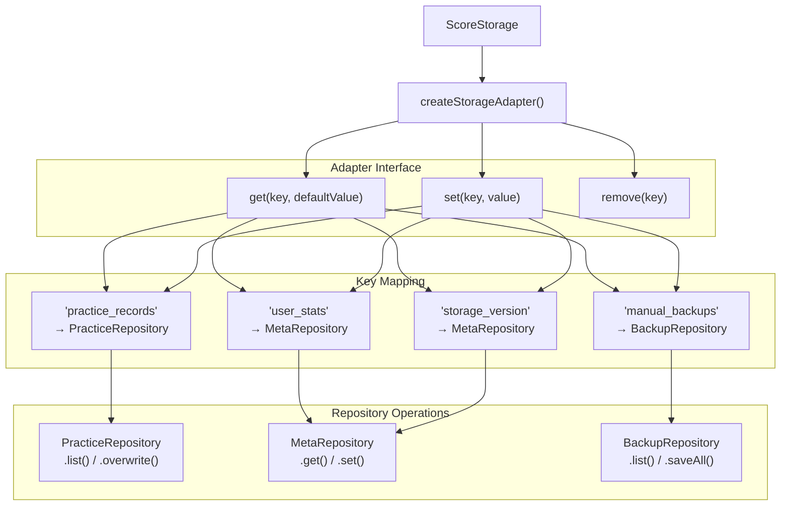
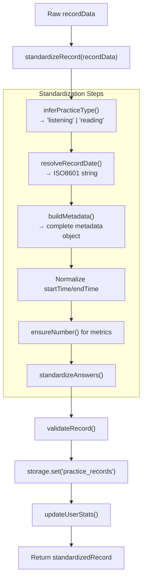
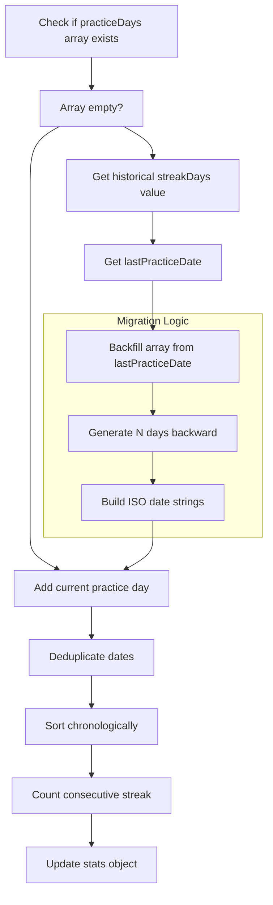
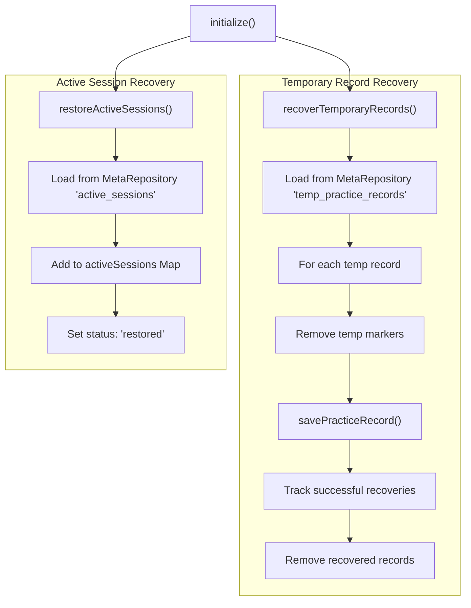

# Practice Recorder & Score Storage

> **Relevant source files**
> * [js/core/practiceRecorder.js](https://github.com/sallowayma-git/IELTS-practice/blob/df0c9b8f/js/core/practiceRecorder.js)
> * [js/core/scoreStorage.js](https://github.com/sallowayma-git/IELTS-practice/blob/df0c9b8f/js/core/scoreStorage.js)

## Purpose and Scope

The practice recording system consists of two complementary classes that manage the complete practice session lifecycle and data persistence:

* **`PracticeRecorder`**: Manages active practice sessions, coordinates cross-window communication, handles session state transitions, and implements automatic recovery mechanisms.
* **`ScoreStorage`**: Provides standardized data persistence, record normalization, user statistics aggregation, and backup/restore functionality.

Together, these classes form the core of the practice data management system, with `PracticeRecorder` orchestrating session workflows and `ScoreStorage` ensuring data integrity and persistence. The system employs multi-tiered storage strategies with automatic fallback mechanisms to guarantee data safety under various failure conditions.

For information about the practice page enhancement and data collection mechanisms that interact with practice sessions, see [Practice Page Enhancement & Data Collection](/sallowayma-git/IELTS-practice/5.2-practice-page-enhancement-and-data-collection). For details about the underlying cross-window communication protocols, see [Cross-Window Communication Protocol](/sallowayma-git/IELTS-practice/5.3-cross-window-communication-protocol). For broader data management and storage systems, see [Data Management System](/sallowayma-git/IELTS-practice/4-data-management-system).

Sources: [js/core/practiceRecorder.js L1-L27](https://github.com/sallowayma-git/IELTS-practice/blob/df0c9b8f/js/core/practiceRecorder.js#L1-L27)

 [js/core/scoreStorage.js L1-L24](https://github.com/sallowayma-git/IELTS-practice/blob/df0c9b8f/js/core/scoreStorage.js#L1-L24)

## Class Relationship and Architecture

The system architecture separates concerns between session orchestration (`PracticeRecorder`) and data persistence (`ScoreStorage`), with clearly defined integration points.

### High-Level Component Relationship



**Key Integration Points:**

* `PracticeRecorder` instantiates `ScoreStorage` during construction and delegates all persistence operations to it
* `ScoreStorage` uses repository-based storage abstraction via `createStorageAdapter()`
* Both classes access `window.dataRepositories` for repository instances
* `PracticeRecorder` implements multi-retry logic that falls back to direct repository access if `ScoreStorage` fails

Sources: [js/core/practiceRecorder.js L5-L27](https://github.com/sallowayma-git/IELTS-practice/blob/df0c9b8f/js/core/practiceRecorder.js#L5-L27)

 [js/core/scoreStorage.js L5-L24](https://github.com/sallowayma-git/IELTS-practice/blob/df0c9b8f/js/core/scoreStorage.js#L5-L24)

 [js/core/scoreStorage.js L117-L184](https://github.com/sallowayma-git/IELTS-practice/blob/df0c9b8f/js/core/scoreStorage.js#L117-L184)

### Key Data Structures

The system manages multiple data structures across different lifecycle stages and storage layers:

#### PracticeRecorder Data Structures

| Data Structure | Type | Purpose | Persistence |
| --- | --- | --- | --- |
| `activeSessions` | `Map<examId, SessionData>` | Track in-progress practice sessions | `MetaRepository` key: `active_sessions` |
| `sessionListeners` | `Map<examId, IntervalId>` | Session health monitoring timers | Memory only (not persisted) |
| `practiceTypeCache` | `Map<examId, ExamEntry>` | Cache exam metadata for type resolution | Memory only |
| `autoSaveTimer` | `IntervalId` | Periodic session state persistence (30s) | Memory only |

**SessionData Structure:**

```

```

#### ScoreStorage Data Structures

| Data Structure | Repository Key | Purpose | Max Size |
| --- | --- | --- | --- |
| Practice Records | `practice_records` | Completed practice sessions | 1000 records |
| User Statistics | `user_stats` (meta) | Aggregated performance metrics | Single object |
| Storage Version | `storage_version` (meta) | Data schema version tracking | Single value |
| Manual Backups | `manual_backups` | User-initiated data backups | 20 backups |
| Temporary Records | `temp_practice_records` (meta) | Failed save recovery queue | 50 records |

**Practice Record Structure (Standardized):**

```

```

Sources: [js/core/practiceRecorder.js L5-L27](https://github.com/sallowayma-git/IELTS-practice/blob/df0c9b8f/js/core/practiceRecorder.js#L5-L27)

 [js/core/practiceRecorder.js L293-L335](https://github.com/sallowayma-git/IELTS-practice/blob/df0c9b8f/js/core/practiceRecorder.js#L293-L335)

 [js/core/scoreStorage.js L5-L24](https://github.com/sallowayma-git/IELTS-practice/blob/df0c9b8f/js/core/scoreStorage.js#L5-L24)

 [js/core/scoreStorage.js L368-L413](https://github.com/sallowayma-git/IELTS-practice/blob/df0c9b8f/js/core/scoreStorage.js#L368-L413)

## PracticeRecorder: Session Lifecycle Management

The `PracticeRecorder` class orchestrates the complete practice session lifecycle, from initialization through completion, with comprehensive state tracking and automatic recovery.

### Session State Machine



**State Descriptions:**

| State | Description | Triggers | Next States |
| --- | --- | --- | --- |
| `started` | Session created, awaiting confirmation | `startPracticeSession()` | `active`, `restored` |
| `active` | Practice in progress, receiving updates | `handleSessionStarted()` | `paused`, `completed`, `error`, `timeout` |
| `paused` | User temporarily stopped | `handleSessionPaused()` | `active` |
| `restored` | Recovered from storage on init | `restoreActiveSessions()` | `active` |
| `completed` | Session finished successfully | `handleSessionCompleted()` | Terminal |
| `error` | Unrecoverable error occurred | `handleSessionError()` | Terminal |
| `timeout` | 30min inactivity detected | `checkSessionActivity()` | Terminal |

Sources: [js/core/practiceRecorder.js L293-L335](https://github.com/sallowayma-git/IELTS-practice/blob/df0c9b8f/js/core/practiceRecorder.js#L293-L335)

 [js/core/practiceRecorder.js L340-L360](https://github.com/sallowayma-git/IELTS-practice/blob/df0c9b8f/js/core/practiceRecorder.js#L340-L360)

 [js/core/practiceRecorder.js L365-L383](https://github.com/sallowayma-git/IELTS-practice/blob/df0c9b8f/js/core/practiceRecorder.js#L365-L383)

 [js/core/practiceRecorder.js L387-L442](https://github.com/sallowayma-git/IELTS-practice/blob/df0c9b8f/js/core/practiceRecorder.js#L387-L442)

 [js/core/practiceRecorder.js L447-L506](https://github.com/sallowayma-git/IELTS-practice/blob/df0c9b8f/js/core/practiceRecorder.js#L447-L506)

 [js/core/practiceRecorder.js L511-L553](https://github.com/sallowayma-git/IELTS-practice/blob/df0c9b8f/js/core/practiceRecorder.js#L511-L553)

 [js/core/practiceRecorder.js L579-L593](https://github.com/sallowayma-git/IELTS-practice/blob/df0c9b8f/js/core/practiceRecorder.js#L579-L593)

### Session Initialization and Communication Setup

The `startPracticeSession()` method creates a session and prepares for cross-window communication:



**Key Methods:**

* `startPracticeSession(examId, examData)`: Creates session, stores state, sets up monitoring
* `setupPracticePageCommunication(examWindow, sessionId)`: Establishes message channel with practice window
* `generateSessionId()`: Creates unique identifier: `session_${timestamp}_${random}`
* `setupSessionListener(examId)`: Creates 60-second interval timer for activity checks
* `saveActiveSessions()`: Persists all active sessions to `MetaRepository` key `active_sessions`

Sources: [js/core/practiceRecorder.js L293-L335](https://github.com/sallowayma-git/IELTS-practice/blob/df0c9b8f/js/core/practiceRecorder.js#L293-L335)

 [js/core/practiceRecorder.js L1128-L1130](https://github.com/sallowayma-git/IELTS-practice/blob/df0c9b8f/js/core/practiceRecorder.js#L1128-L1130)

 [js/core/practiceRecorder.js L557-L574](https://github.com/sallowayma-git/IELTS-practice/blob/df0c9b8f/js/core/practiceRecorder.js#L557-L574)

 [js/core/practiceRecorder.js L633-L636](https://github.com/sallowayma-git/IELTS-practice/blob/df0c9b8f/js/core/practiceRecorder.js#L633-L636)

 [js/core/practiceRecorder.js L1475-L1492](https://github.com/sallowayma-git/IELTS-practice/blob/df0c9b8f/js/core/practiceRecorder.js#L1475-L1492)

### Auto-Save and Session Monitoring

The `PracticeRecorder` implements multiple monitoring and persistence mechanisms to prevent data loss:

#### Automatic Persistence

| Mechanism | Interval/Trigger | Method | Purpose |
| --- | --- | --- | --- |
| Auto-save timer | 30 seconds | `startAutoSave()` → `saveAllSessions()` | Periodic state persistence |
| Session listeners | 60 seconds per session | `setupSessionListener()` → `checkSessionActivity()` | Detect stale sessions |
| beforeunload event | Page close/navigation | `saveAllSessions()` | Final state save |
| visibilitychange event | Tab becomes visible | `checkSessionStatus()` | Resume monitoring |

#### Session Timeout Detection

The `checkSessionActivity()` method monitors for inactive sessions:

```

```

**Timeout Behavior:**

* Sessions with no `lastActivity` updates for 30 minutes are automatically terminated
* Interrupted records are saved with reason: `'timeout'`
* Session listeners and active session entries are cleaned up

Sources: [js/core/practiceRecorder.js L9-L10](https://github.com/sallowayma-git/IELTS-practice/blob/df0c9b8f/js/core/practiceRecorder.js#L9-L10)

 [js/core/practiceRecorder.js L606-L617](https://github.com/sallowayma-git/IELTS-practice/blob/df0c9b8f/js/core/practiceRecorder.js#L606-L617)

 [js/core/practiceRecorder.js L557-L574](https://github.com/sallowayma-git/IELTS-practice/blob/df0c9b8f/js/core/practiceRecorder.js#L557-L574)

 [js/core/practiceRecorder.js L579-L593](https://github.com/sallowayma-git/IELTS-practice/blob/df0c9b8f/js/core/practiceRecorder.js#L579-L593)

 [js/core/practiceRecorder.js L621-L629](https://github.com/sallowayma-git/IELTS-practice/blob/df0c9b8f/js/core/practiceRecorder.js#L621-L629)

 [js/core/practiceRecorder.js L244-L256](https://github.com/sallowayma-git/IELTS-practice/blob/df0c9b8f/js/core/practiceRecorder.js#L244-L256)

## Data Persistence Strategy

The system employs a sophisticated multi-tiered storage strategy coordinated between `PracticeRecorder` and `ScoreStorage` to ensure data integrity under various failure conditions.

### Three-Tier Storage Hierarchy



**Tier Characteristics:**

| Tier | Method | Verification | Statistics Update | Retry Logic |
|---|---|---|---|
| Primary | `ScoreStorage.savePracticeRecord()` | Query record from repository | Automatic via ScoreStorage | 3 attempts with 100ms backoff |
| Fallback | `fallbackSavePracticeRecord()` | Query record from repository | Manual via `updateUserStatsManually()` | Single attempt |
| Emergency | `saveToTemporaryStorage()` | None | Deferred until recovery | None |

**Critical Error Detection:**

The `isCriticalError()` method identifies errors requiring immediate fallback:

* `QuotaExceededError`: Storage quota exhausted
* `localStorage not available`: Storage system unavailable
* `Storage quota exceeded`: Capacity limit reached

When critical errors occur, the system skips retries and immediately falls back to the next tier.

Sources: [js/core/practiceRecorder.js L387-L442](https://github.com/sallowayma-git/IELTS-practice/blob/df0c9b8f/js/core/practiceRecorder.js#L387-L442)

 [js/core/practiceRecorder.js L641-L677](https://github.com/sallowayma-git/IELTS-practice/blob/df0c9b8f/js/core/practiceRecorder.js#L641-L677)

 [js/core/practiceRecorder.js L682-L723](https://github.com/sallowayma-git/IELTS-practice/blob/df0c9b8f/js/core/practiceRecorder.js#L682-L723)

 [js/core/practiceRecorder.js L879-L898](https://github.com/sallowayma-git/IELTS-practice/blob/df0c9b8f/js/core/practiceRecorder.js#L879-L898)

 [js/core/practiceRecorder.js L817-L827](https://github.com/sallowayma-git/IELTS-practice/blob/df0c9b8f/js/core/practiceRecorder.js#L817-L827)

 [js/core/practiceRecorder.js L1497-L1541](https://github.com/sallowayma-git/IELTS-practice/blob/df0c9b8f/js/core/practiceRecorder.js#L1497-L1541)

### Record Standardization

Both `PracticeRecorder` and `ScoreStorage` implement record standardization to ensure consistent data format, but with different purposes and timing.

#### PracticeRecorder: Fallback Standardization

The `standardizeRecordForFallback()` method normalizes records when the primary storage path fails:



**Key Methods Used:**

* `normalizePracticeType(rawType)`: Converts variations to `'listening'` or `'reading'`
* `lookupExamIndexEntry(examId)`: Searches exam indices with caching
* `resolvePracticeType(session, examEntry)`: Multi-source type determination
* `resolveRecordDate(session, fallbackEndTime)`: Extracts valid date from multiple fields
* `buildRecordMetadata(session, examEntry, type)`: Constructs complete metadata object

**Fallback Markers:**

```

```

Sources: [js/core/practiceRecorder.js L728-L798](https://github.com/sallowayma-git/IELTS-practice/blob/df0c9b8f/js/core/practiceRecorder.js#L728-L798)

 [js/core/practiceRecorder.js L29-L90](https://github.com/sallowayma-git/IELTS-practice/blob/df0c9b8f/js/core/practiceRecorder.js#L29-L90)

 [js/core/practiceRecorder.js L92-L101](https://github.com/sallowayma-git/IELTS-practice/blob/df0c9b8f/js/core/practiceRecorder.js#L92-L101)

 [js/core/practiceRecorder.js L180-L195](https://github.com/sallowayma-git/IELTS-practice/blob/df0c9b8f/js/core/practiceRecorder.js#L180-L195)

## ScoreStorage: Data Persistence and Normalization

The `ScoreStorage` class provides the primary data persistence layer with comprehensive record normalization, statistics management, and backup functionality.

### Storage Adapter Architecture

`ScoreStorage` uses a repository-based storage adapter to abstract persistence operations:



**Storage Key Constants:**

```

```

**Adapter Benefits:**

* Decouples ScoreStorage from specific repository implementations
* Provides synchronous-looking async API
* Handles repository routing based on key
* Enables easy testing and mocking

Sources: [js/core/scoreStorage.js L12-L24](https://github.com/sallowayma-git/IELTS-practice/blob/df0c9b8f/js/core/scoreStorage.js#L12-L24)

 [js/core/scoreStorage.js L117-L184](https://github.com/sallowayma-git/IELTS-practice/blob/df0c9b8f/js/core/scoreStorage.js#L117-L184)

### Record Standardization Pipeline

The `savePracticeRecord()` method processes raw records through a standardization pipeline:



**Type Inference Priority:**

1. `recordData.type`
2. `metadata.type` or `metadata.examType`
3. `examId` contains "listening"
4. Default: `'reading'`

**Date Resolution Priority:**

1. `metadata.date`
2. `recordData.date`
3. `recordData.endTime`
4. `recordData.completedAt`
5. `recordData.startTime`
6. `recordData.timestamp`
7. Current timestamp

**Validation Rules:**

* Required fields: `id`, `examId`, `startTime`, `endTime`
* Valid ISO8601 date formats
* `accuracy` in range [0, 1]
* `duration` ≥ 0

Sources: [js/core/scoreStorage.js L320-L363](https://github.com/sallowayma-git/IELTS-practice/blob/df0c9b8f/js/core/scoreStorage.js#L320-L363)

 [js/core/scoreStorage.js L368-L413](https://github.com/sallowayma-git/IELTS-practice/blob/df0c9b8f/js/core/scoreStorage.js#L368-L413)

 [js/core/scoreStorage.js L418-L430](https://github.com/sallowayma-git/IELTS-practice/blob/df0c9b8f/js/core/scoreStorage.js#L418-L430)

 [js/core/scoreStorage.js L435-L461](https://github.com/sallowayma-git/IELTS-practice/blob/df0c9b8f/js/core/scoreStorage.js#L435-L461)

 [js/core/scoreStorage.js L26-L99](https://github.com/sallowayma-git/IELTS-practice/blob/df0c9b8f/js/core/scoreStorage.js#L26-L99)

### Record Normalization for Display

The `normalizeRecordFields()` method ensures UI-friendly data format by filling missing fields from multiple sources:

**Normalization Rules:**

| Field | Fallback Chain | Default |
| --- | --- | --- |
| `metadata.examTitle` | `metadata.examTitle` → `title` → `examTitle` → `examId` | `''` |
| `metadata.category` | `metadata.category` → `category` | `''` |
| `startTime` | `startTime` → `realData.startTime` → `date` | - |
| `endTime` | `endTime` → `realData.endTime` → computed from duration | - |
| `duration` | `duration` → `realData.duration` → `timeSpent` → computed | `0` |
| `correctAnswers` | `correctAnswers` → `score` → `scoreInfo.correct` | - |
| `totalQuestions` | `totalQuestions` → `scoreInfo.total` → `answers.length` | - |
| `accuracy` | `accuracy` → `scoreInfo.accuracy` → computed | `0` |

**Purpose:**

* Handles records from multiple data collection sources
* Ensures backward compatibility with old record formats
* Fills missing fields for UI display
* Does not modify stored records, only returned data

Sources: [js/core/scoreStorage.js L734-L858](https://github.com/sallowayma-git/IELTS-practice/blob/df0c9b8f/js/core/scoreStorage.js#L734-L858)

## User Statistics Management

Both classes participate in maintaining aggregated user statistics, with `ScoreStorage` providing the primary implementation and `PracticeRecorder` offering a manual fallback.

### Statistics Structure and Updates

```mermaid
flowchart TD

RECORD["New practice record saved"]
GET["Get current stats"]
BASE["Update totalPractices, totalTimeSpent, averageScore"]
CAT["updateCategoryStats()"]
QT["updateQuestionTypeStats()"]
STREAK["updateStreakDays()"]
ACH["checkAchievements()"]
SAVE["Save updated stats"]
DAYS["Extract practiceDays array"]
MIGRATE["Migrate from old streakDays if needed"]
SORT["Sort days chronologically"]
COUNT["Count consecutive days"]

RECORD --> GET
STREAK --> DAYS

subgraph subGraph1 ["Streak Calculation"]
    DAYS
    MIGRATE
    SORT
    COUNT
    DAYS --> MIGRATE
    MIGRATE --> SORT
    SORT --> COUNT
end

subgraph ScoreStorage.updateUserStats() ["ScoreStorage.updateUserStats()"]
    GET
    BASE
    CAT
    QT
    STREAK
    ACH
    SAVE
    GET --> BASE
    BASE --> CAT
    CAT --> QT
    QT --> STREAK
    STREAK --> ACH
    ACH --> SAVE
end
```

**Default User Statistics Structure:**

```

```

**Achievement Detection:**

| Achievement ID | Criteria | Description |
| --- | --- | --- |
| `first-practice` | `totalPractices === 1` | First practice completed |
| `week-streak` | `streakDays >= 7` | 7 consecutive practice days |
| `month-streak` | `streakDays >= 30` | 30 consecutive practice days |
| `high-scorer` | `accuracy >= 0.9` | 90%+ accuracy on a practice |
| `{category}-master` | `practices >= 10 && avgScore >= 0.8` | Category mastery |

Sources: [js/core/scoreStorage.js L296-L316](https://github.com/sallowayma-git/IELTS-practice/blob/df0c9b8f/js/core/scoreStorage.js#L296-L316)

 [js/core/scoreStorage.js L466-L500](https://github.com/sallowayma-git/IELTS-practice/blob/df0c9b8f/js/core/scoreStorage.js#L466-L500)

 [js/core/scoreStorage.js L505-L530](https://github.com/sallowayma-git/IELTS-practice/blob/df0c9b8f/js/core/scoreStorage.js#L505-L530)

 [js/core/scoreStorage.js L535-L565](https://github.com/sallowayma-git/IELTS-practice/blob/df0c9b8f/js/core/scoreStorage.js#L535-L565)

 [js/core/scoreStorage.js L570-L629](https://github.com/sallowayma-git/IELTS-practice/blob/df0c9b8f/js/core/scoreStorage.js#L570-L629)

 [js/core/scoreStorage.js L634-L669](https://github.com/sallowayma-git/IELTS-practice/blob/df0c9b8f/js/core/scoreStorage.js#L634-L669)

### Streak Days Migration

The `updateStreakDays()` method handles migration from legacy single-number `streakDays` to array-based `practiceDays`:



**Migration Example:**

```

```

Sources: [js/core/scoreStorage.js L570-L629](https://github.com/sallowayma-git/IELTS-practice/blob/df0c9b8f/js/core/scoreStorage.js#L570-L629)

 [js/core/practiceRecorder.js L134-L178](https://github.com/sallowayma-git/IELTS-practice/blob/df0c9b8f/js/core/practiceRecorder.js#L134-L178)

## Data Backup and Recovery

Both classes provide backup functionality with different scopes: `ScoreStorage` handles practice records and statistics, while `PracticeRecorder` delegates to `ScoreStorage` and adds session recovery.

### ScoreStorage Backup System

```mermaid
flowchart TD

EXPORT["exportData(format)"]
JSON["JSON stringify"]
CSV["convertToCSV()"]
IMPORT["importData(data, options)"]
MERGE["Merge or Replace mode"]
RB["restoreBackup(backupId)"]
FIND["Find backup by ID"]
EXTRACT["Extract data"]
RESTORE["Restore to repositories"]
CB["createBackup(backupName)"]
GATHER["Gather practiceRecords, userStats, storageVersion"]
BUILD["Build backup object"]
LOAD["Load existing backups"]
ADD["Add to backups array"]
PRUNE["Keep max 20 backups"]
SAVE["Save to BackupRepository"]

subgraph Import/Export ["Import/Export"]
    EXPORT
    JSON
    CSV
    IMPORT
    MERGE
    EXPORT --> JSON
    EXPORT --> CSV
    IMPORT --> MERGE
end

subgraph subGraph1 ["Backup Restoration"]
    RB
    FIND
    EXTRACT
    RESTORE
    RB --> FIND
    FIND --> EXTRACT
    EXTRACT --> RESTORE
end

subgraph subGraph0 ["Manual Backup Creation"]
    CB
    GATHER
    BUILD
    LOAD
    ADD
    PRUNE
    SAVE
    CB --> GATHER
    GATHER --> BUILD
    BUILD --> LOAD
    LOAD --> ADD
    ADD --> PRUNE
    PRUNE --> SAVE
end
```



**Backup Object Structure:**

```

```

**Import Modes:**

| Mode | Option | Behavior |
| --- | --- | --- |
| Merge | `{ merge: true }` | Add new records, keep existing ones, recalculate stats |
| Replace | `{ merge: false }` | Replace all records and stats with imported data |

Sources: [js/core/scoreStorage.js L863-L898](https://github.com/sallowayma-git/IELTS-practice/blob/df0c9b8f/js/core/scoreStorage.js#L863-L898)

 [js/core/scoreStorage.js L903-L926](https://github.com/sallowayma-git/IELTS-practice/blob/df0c9b8f/js/core/scoreStorage.js#L903-L926)

 [js/core/scoreStorage.js L931-L942](https://github.com/sallowayma-git/IELTS-practice/blob/df0c9b8f/js/core/scoreStorage.js#L931-L942)

 [js/core/scoreStorage.js L947-L1048](https://github.com/sallowayma-git/IELTS-practice/blob/df0c9b8f/js/core/scoreStorage.js#L947-L1048)

### PracticeRecorder Session Recovery



**Recovery Scenarios:**

| Scenario | Storage Location | Recovery Method | Outcome |
| --- | --- | --- | --- |
| Browser crash | `active_sessions` (MetaRepository) | `restoreActiveSessions()` | Sessions marked as 'restored', can resume |
| Failed save | `temp_practice_records` (MetaRepository) | `recoverTemporaryRecords()` | Retry save, remove temp markers |
| Page reload | Both | Both methods called during init | All data restored |

**Temporary Record Structure:**

```

```

Sources: [js/core/practiceRecorder.js L200-L221](https://github.com/sallowayma-git/IELTS-practice/blob/df0c9b8f/js/core/practiceRecorder.js#L200-L221)

 [js/core/practiceRecorder.js L226-L239](https://github.com/sallowayma-git/IELTS-practice/blob/df0c9b8f/js/core/practiceRecorder.js#L226-L239)

 [js/core/practiceRecorder.js L1497-L1541](https://github.com/sallowayma-git/IELTS-practice/blob/df0c9b8f/js/core/practiceRecorder.js#L1497-L1541)

 [js/core/practiceRecorder.js L879-L898](https://github.com/sallowayma-git/IELTS-practice/blob/df0c9b8f/js/core/practiceRecorder.js#L879-L898)

### Event System Integration

The recorder dispatches custom events for system-wide coordination:

| Event Type | Trigger | Data Payload |
| --- | --- | --- |
| `practicesessionStarted` | Session initialization | `{examId, sessionData}` |
| `practicesessionProgress` | Progress updates | `{examId, progress}` |
| `practicesessionCompleted` | Session completion | `{examId, practiceRecord}` |
| `practicesessionError` | Error conditions | `{examId, error}` |
| `practicesessionEnded` | Session termination | `{examId, reason}` |
| `practicerealDataProcessed` | Real data processing | `{examId, practiceRecord, dataSource}` |

Sources: [js/core/practiceRecorder.js L917-L923](https://github.com/sallowayma-git/IELTS-practice/blob/df0c9b8f/js/core/practiceRecorder.js#L917-L923)

 [js/core/practiceRecorder.js L149-L151](https://github.com/sallowayma-git/IELTS-practice/blob/df0c9b8f/js/core/practiceRecorder.js#L149-L151)

 [js/core/practiceRecorder.js L244-L246](https://github.com/sallowayma-git/IELTS-practice/blob/df0c9b8f/js/core/practiceRecorder.js#L244-L246)

### Cross-Window Communication Setup

The `setupPracticePageCommunication()` method establishes bidirectional communication with practice windows:

```

```

Sources: [js/core/practiceRecorder.js L1256-L1274](https://github.com/sallowayma-git/IELTS-practice/blob/df0c9b8f/js/core/practiceRecorder.js#L1256-L1274)

 [js/core/practiceRecorder.js L66-L78](https://github.com/sallowayma-git/IELTS-practice/blob/df0c9b8f/js/core/practiceRecorder.js#L66-L78)

 [js/core/practiceRecorder.js L82-L108](https://github.com/sallowayma-git/IELTS-practice/blob/df0c9b8f/js/core/practiceRecorder.js#L82-L108)