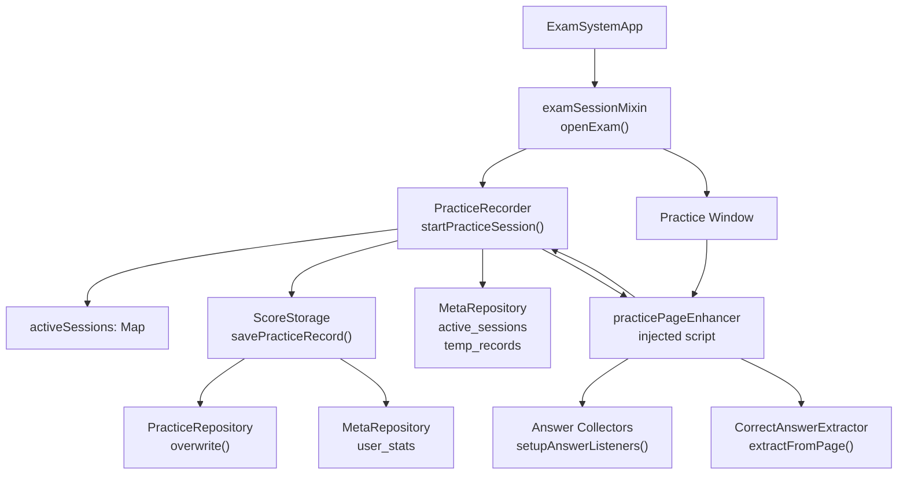
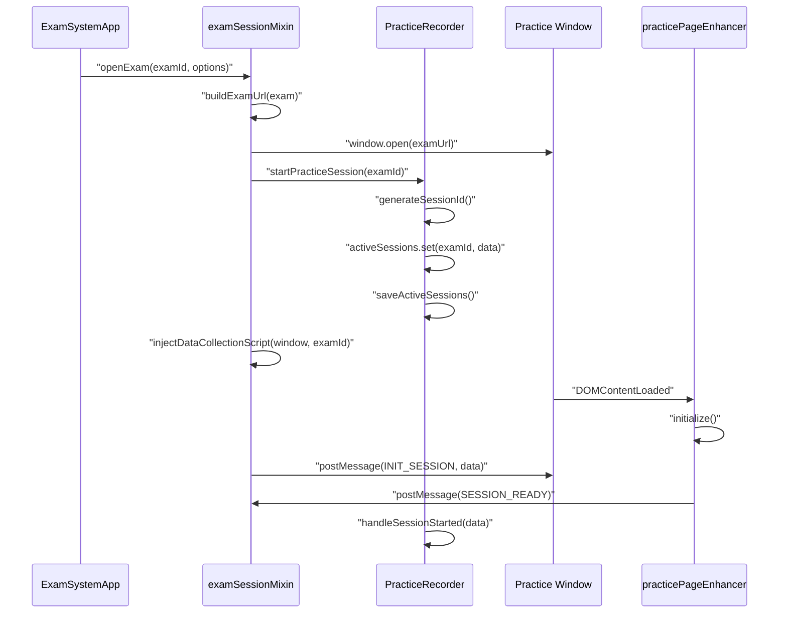
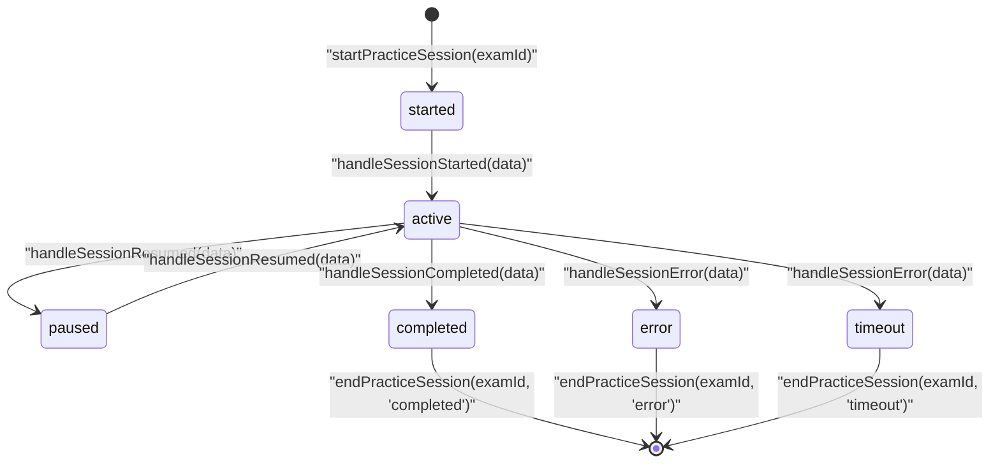
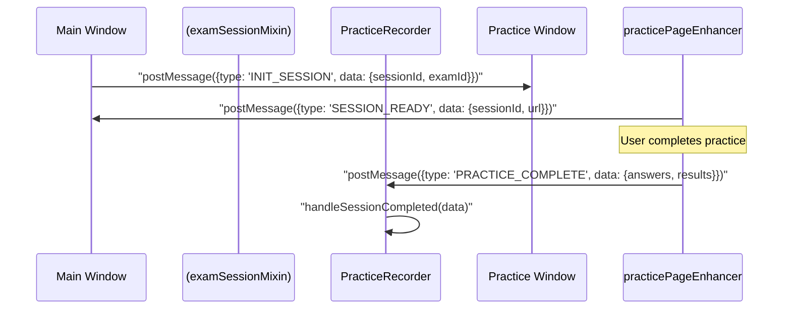
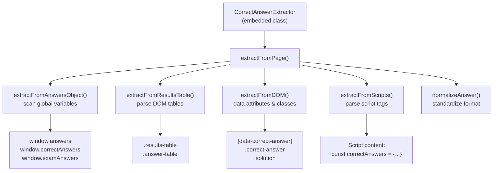
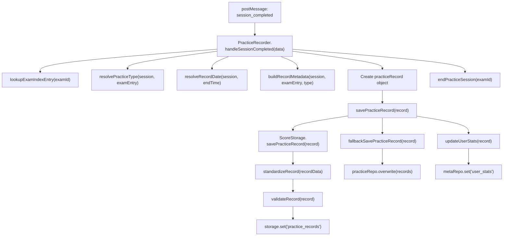
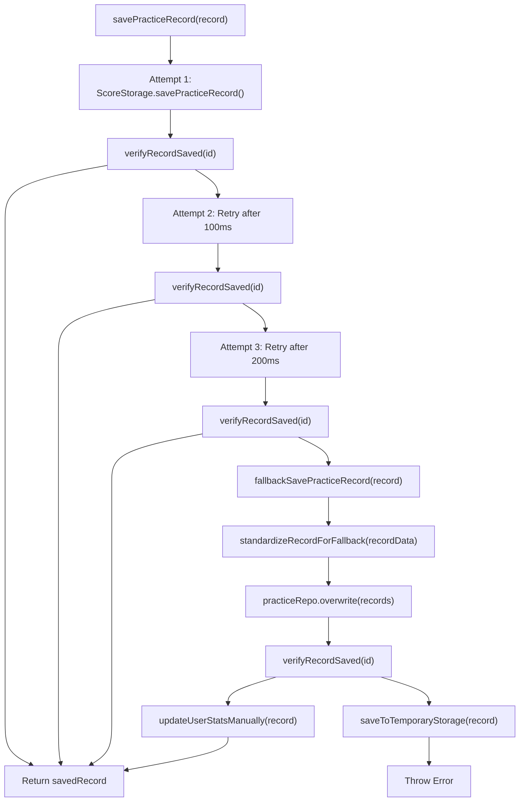
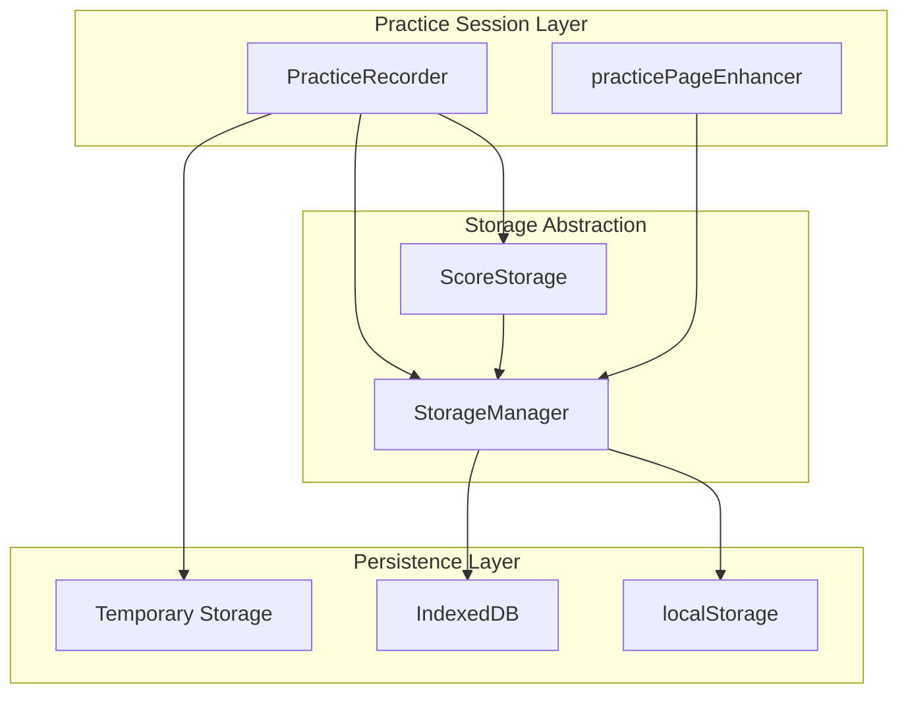

# Practice Session System

> **Relevant source files**
> * [developer/tests/e2e/playwright_index_clickthrough.py](https://github.com/sallowayma-git/IELTS-practice/blob/df0c9b8f/developer/tests/e2e/playwright_index_clickthrough.py)
> * [developer/tests/js/e2e/indexSnapshot.js](https://github.com/sallowayma-git/IELTS-practice/blob/df0c9b8f/developer/tests/js/e2e/indexSnapshot.js)
> * [js/app/examSessionMixin.js](https://github.com/sallowayma-git/IELTS-practice/blob/df0c9b8f/js/app/examSessionMixin.js)
> * [js/app/lifecycleMixin.js](https://github.com/sallowayma-git/IELTS-practice/blob/df0c9b8f/js/app/lifecycleMixin.js)
> * [js/core/practiceRecorder.js](https://github.com/sallowayma-git/IELTS-practice/blob/df0c9b8f/js/core/practiceRecorder.js)
> * [js/core/scoreStorage.js](https://github.com/sallowayma-git/IELTS-practice/blob/df0c9b8f/js/core/scoreStorage.js)
> * [js/views/overviewView.js](https://github.com/sallowayma-git/IELTS-practice/blob/df0c9b8f/js/views/overviewView.js)

The Practice Session System manages the complete lifecycle of IELTS practice sessions from initialization through completion and data persistence. The system coordinates cross-window communication between the main application and practice pages, collects user answers and interaction data, and processes results for storage.

This page covers the core session management classes (`PracticeRecorder`, `ScoreStorage`), the practice page enhancement script, and the cross-window communication protocol. For underlying data storage mechanisms, see [Data Management System](/sallowayma-git/IELTS-practice/4-data-management-system). For exam content structure, see [Exam Content & Data System](/sallowayma-git/IELTS-practice/6-exam-content-and-data-system).

## Architecture Overview

The system uses a distributed architecture with session management in the main window and data collection in practice windows. Session state persists in `localStorage` even if practice windows close unexpectedly.

### Component Structure

**Core Classes and Files**

| Component | File | Purpose |
| --- | --- | --- |
| `PracticeRecorder` | [js/core/practiceRecorder.js L5-L1500](https://github.com/sallowayma-git/IELTS-practice/blob/df0c9b8f/js/core/practiceRecorder.js#L5-L1500) | Session lifecycle management, message handling |
| `ScoreStorage` | [js/core/scoreStorage.js L5-L950](https://github.com/sallowayma-git/IELTS-practice/blob/df0c9b8f/js/core/scoreStorage.js#L5-L950) | Record standardization, statistics updates, persistence |
| `examSessionMixin` | [js/app/examSessionMixin.js L1-L868](https://github.com/sallowayma-git/IELTS-practice/blob/df0c9b8f/js/app/examSessionMixin.js#L1-L868) | Window opening, script injection, session initialization |
| `practicePageEnhancer` | js/practice-page-enhancer.js | Answer collection, user interaction tracking |

Sources: [js/core/practiceRecorder.js L5-L27](https://github.com/sallowayma-git/IELTS-practice/blob/df0c9b8f/js/core/practiceRecorder.js#L5-L27)

 [js/core/scoreStorage.js L5-L24](https://github.com/sallowayma-git/IELTS-practice/blob/df0c9b8f/js/core/scoreStorage.js#L5-L24)

 [js/app/examSessionMixin.js L1-L94](https://github.com/sallowayma-git/IELTS-practice/blob/df0c9b8f/js/app/examSessionMixin.js#L1-L94)

## Session Lifecycle

`PracticeRecorder` manages session state through initialization, active monitoring, and completion processing.

### Initialization Flow

**Session Data Structure**

The `activeSessions` Map stores session objects with the following fields (created in [js/core/practiceRecorder.js L293-L335](https://github.com/sallowayma-git/IELTS-practice/blob/df0c9b8f/js/core/practiceRecorder.js#L293-L335)

):

| Field | Type | Purpose |
| --- | --- | --- |
| `sessionId` | string | Generated via `generateSessionId()`: `session_${Date.now()}_${random}` |
| `examId` | string | Exam identifier from exam index |
| `startTime` | ISO string | Timestamp when `startPracticeSession()` called |
| `lastActivity` | ISO string | Updated on progress messages, used for timeout detection |
| `status` | enum | `started` → `active` → `completed`/`paused`/`error`/`timeout` |
| `progress` | object | `{currentQuestion, totalQuestions, answeredQuestions, timeSpent}` |
| `answers` | array | User answers collected during session |
| `metadata` | object | `{examTitle, category, frequency, userAgent, screenResolution, timezone}` |

Sources: [js/core/practiceRecorder.js L293-L335](https://github.com/sallowayma-git/IELTS-practice/blob/df0c9b8f/js/core/practiceRecorder.js#L293-L335)

 [js/app/examSessionMixin.js L6-L94](https://github.com/sallowayma-git/IELTS-practice/blob/df0c9b8f/js/app/examSessionMixin.js#L6-L94)

### State Transitions

Session state is managed through message handlers that update the `activeSessions` Map and persist to storage:

**Monitoring and Persistence**

The system implements automatic session management features (from [js/core/practiceRecorder.js L9-L27](https://github.com/sallowayma-git/IELTS-practice/blob/df0c9b8f/js/core/practiceRecorder.js#L9-L27)

):

| Feature | Implementation | Configuration |
| --- | --- | --- |
| Auto-save | `autoSaveTimer` interval calls `saveAllSessions()` | Every 30 seconds ([js/core/practiceRecorder.js L9-L10](https://github.com/sallowayma-git/IELTS-practice/blob/df0c9b8f/js/core/practiceRecorder.js#L9-L10)   ) |
| Timeout detection | `setupSessionListener()` checks `lastActivity` | 30 minutes inactivity ([js/core/practiceRecorder.js L557-L592](https://github.com/sallowayma-git/IELTS-practice/blob/df0c9b8f/js/core/practiceRecorder.js#L557-L592)   ) |
| Session restoration | `restoreActiveSessions()` loads from `MetaRepository` | On `initialize()` ([js/core/practiceRecorder.js L223-L239](https://github.com/sallowayma-git/IELTS-practice/blob/df0c9b8f/js/core/practiceRecorder.js#L223-L239)   ) |
| Interrupted records | `saveInterruptedRecord()` captures partial sessions | On timeout/error ([js/core/practiceRecorder.js L901-L912](https://github.com/sallowayma-git/IELTS-practice/blob/df0c9b8f/js/core/practiceRecorder.js#L901-L912)   ) |

Sources: [js/core/practiceRecorder.js L9-L27](https://github.com/sallowayma-git/IELTS-practice/blob/df0c9b8f/js/core/practiceRecorder.js#L9-L27)

 [js/core/practiceRecorder.js L223-L239](https://github.com/sallowayma-git/IELTS-practice/blob/df0c9b8f/js/core/practiceRecorder.js#L223-L239)

 [js/core/practiceRecorder.js L557-L592](https://github.com/sallowayma-git/IELTS-practice/blob/df0c9b8f/js/core/practiceRecorder.js#L557-L592)

 [js/core/practiceRecorder.js L606-L628](https://github.com/sallowayma-git/IELTS-practice/blob/df0c9b8f/js/core/practiceRecorder.js#L606-L628)

## Cross-Window Communication

The system uses `window.postMessage()` for bidirectional communication between the main application and practice windows.

### Message Flow

**Message Protocol**

All messages use the structure `{type: string, data: object}`. The `PracticeRecorder.handleExamMessage()` method routes incoming messages based on the `type` field ([js/core/practiceRecorder.js L258-L288](https://github.com/sallowayma-git/IELTS-practice/blob/df0c9b8f/js/core/practiceRecorder.js#L258-L288)

):

| Message Type | Direction | Handler Method | Data Payload |
| --- | --- | --- | --- |
| `INIT_SESSION` | Main → Practice | N/A (handled by enhancer) | `{sessionId, examId, parentOrigin, timestamp}` |
| `SESSION_READY` | Practice → Main | N/A (confirmation only) | `{sessionId, examId, url, title}` |
| `session_started` | Practice → Main | `handleSessionStarted()` | `{examId, sessionId, metadata}` |
| `session_progress` | Practice → Main | `handleSessionProgress()` | `{examId, progress, answers}` |
| `session_completed` | Practice → Main | `handleSessionCompleted()` | `{examId, results, endTime}` |
| `session_paused` | Practice → Main | `handleSessionPaused()` | `{examId}` |
| `session_resumed` | Practice → Main | `handleSessionResumed()` | `{examId}` |
| `session_error` | Practice → Main | `handleSessionError()` | `{examId, error}` |

### Script Injection

The main application injects the data collection script into practice windows using `examSessionMixin.injectDataCollectionScript()` ([js/app/examSessionMixin.js L203-L276](https://github.com/sallowayma-git/IELTS-practice/blob/df0c9b8f/js/app/examSessionMixin.js#L203-L276)

):

1. Wait for practice window to load (checks `document.readyState`)
2. Fetch `js/practice-page-enhancer.js` content
3. Create `<script>` element with fetched content
4. Append to practice window's `<head>`
5. Send `INIT_SESSION` message after 1500ms delay
6. Fallback to `injectInlineScript()` if fetch fails ([js/app/examSessionMixin.js L281-L522](https://github.com/sallowayma-git/IELTS-practice/blob/df0c9b8f/js/app/examSessionMixin.js#L281-L522) )

Sources: [js/core/practiceRecorder.js L258-L288](https://github.com/sallowayma-git/IELTS-practice/blob/df0c9b8f/js/core/practiceRecorder.js#L258-L288)

 [js/app/examSessionMixin.js L203-L276](https://github.com/sallowayma-git/IELTS-practice/blob/df0c9b8f/js/app/examSessionMixin.js#L203-L276)

 [js/app/examSessionMixin.js L281-L522](https://github.com/sallowayma-git/IELTS-practice/blob/df0c9b8f/js/app/examSessionMixin.js#L281-L522)

 [js/app/examSessionMixin.js L527-L600](https://github.com/sallowayma-git/IELTS-practice/blob/df0c9b8f/js/app/examSessionMixin.js#L527-L600)

## Answer Collection

The `practicePageEnhancer` script collects user answers using event listeners and DOM queries. The script is injected by `examSessionMixin` and runs in the practice window context.

### Collection Strategy

The enhancer uses multiple collection methods to handle different question formats:

| Collection Method | Target Elements | Event Triggers |
| --- | --- | --- |
| Form inputs | `input[type="text"]`, `input[type="radio"]`, `textarea` | `change`, `input` |
| Select dropdowns | `select` elements | `change` |
| Drag-drop zones | `[data-dropzone]`, `.dropzone` | `drop` |
| Matching exercises | `[data-match]`, `.match-item` | `click` |
| Ordering exercises | `[data-order]`, `.sortable-item` | `dragend` |

The `collectAllAnswers()` method aggregates answers from all sources and stores them in the `answers` object. This object is sent to the main window via `postMessage` when the user completes the practice.

### Answer Extraction Pattern

**Extraction Sources**

The `CorrectAnswerExtractor` class (embedded in `practicePageEnhancer`) checks multiple sources in order:

1. **Global variables**: `window.answers`, `window.correctAnswers`, `window.examAnswers`
2. **Results tables**: DOM elements with classes `.results-table`, `.answer-table`, `.correct-answers-table`
3. **Data attributes**: Elements with `data-correct-answer`, `data-answer`, `data-solution`
4. **Script tags**: Parses JavaScript for patterns like `const correctAnswers = {...}`

The `normalizeAnswer()` method standardizes formats:

* TRUE/FALSE → boolean values
* A/B/C/D → uppercase letters
* Text answers → trimmed, lowercase for comparison

Sources: Referenced in system design (script not in provided files but referenced in [js/app/examSessionMixin.js L236](https://github.com/sallowayma-git/IELTS-practice/blob/df0c9b8f/js/app/examSessionMixin.js#L236-L236)

)

## Record Processing and Storage

When a session completes, `PracticeRecorder.handleSessionCompleted()` processes the session data and creates a structured practice record.

### Completion Flow

**Record Structure**

The `practiceRecord` object created in `handleSessionCompleted()` ([js/core/practiceRecorder.js L387-L442](https://github.com/sallowayma-git/IELTS-practice/blob/df0c9b8f/js/core/practiceRecorder.js#L387-L442)

):

| Field | Source | Type |
| --- | --- | --- |
| `id` | `record_${sessionId}` | string |
| `examId` | Session data | string |
| `sessionId` | Session data | string |
| `startTime` | Session `startTime` | ISO string |
| `endTime` | Message `endTime` or `new Date()` | ISO string |
| `duration` | `(endTime - startTime) / 1000` | number (seconds) |
| `status` | `'completed'` | string |
| `type` | `resolvePracticeType()` result | `'reading'` or `'listening'` |
| `date` | `resolveRecordDate()` result | ISO string |
| `score` | `results.score` | number |
| `totalQuestions` | `results.totalQuestions` | number |
| `correctAnswers` | `results.correctAnswers` | number |
| `accuracy` | `results.accuracy` | number (0-1) |
| `answers` | `results.answers` or session `answers` | array |
| `questionTypePerformance` | `results.questionTypePerformance` | object |
| `metadata` | `buildRecordMetadata()` result | object |
| `createdAt` | `endTime` | ISO string |

Sources: [js/core/practiceRecorder.js L387-L442](https://github.com/sallowayma-git/IELTS-practice/blob/df0c9b8f/js/core/practiceRecorder.js#L387-L442)

 [js/core/practiceRecorder.js L180-L195](https://github.com/sallowayma-git/IELTS-practice/blob/df0c9b8f/js/core/practiceRecorder.js#L180-L195)

### Save Strategy and Error Handling

`PracticeRecorder.savePracticeRecord()` implements a multi-tier save strategy with verification ([js/core/practiceRecorder.js L641-L677](https://github.com/sallowayma-git/IELTS-practice/blob/df0c9b8f/js/core/practiceRecorder.js#L641-L677)

):

**Fallback Implementation Details**

The `fallbackSavePracticeRecord()` method ([js/core/practiceRecorder.js L682-L723](https://github.com/sallowayma-git/IELTS-practice/blob/df0c9b8f/js/core/practiceRecorder.js#L682-L723)

):

1. Calls `standardizeRecordForFallback()` to ensure record format compatibility
2. Retrieves existing records via `practiceRepo.list()`
3. Checks for duplicate IDs and updates existing record if found
4. Adds new record to beginning of array (maintains newest-first order)
5. Trims array to 1000 records maximum
6. Calls `practiceRepo.overwrite(records)` to persist
7. Verifies save with `verifyRecordSaved()`
8. Updates user stats manually if ScoreStorage is unavailable

If all save attempts fail, the record is saved to temporary storage via `metaRepo.set('temp_practice_records')` for later recovery.

Sources: [js/core/practiceRecorder.js L641-L723](https://github.com/sallowayma-git/IELTS-practice/blob/df0c9b8f/js/core/practiceRecorder.js#L641-L723)

 [js/core/practiceRecorder.js L728-L798](https://github.com/sallowayma-git/IELTS-practice/blob/df0c9b8f/js/core/practiceRecorder.js#L728-L798)

 [js/core/practiceRecorder.js L879-L898](https://github.com/sallowayma-git/IELTS-practice/blob/df0c9b8f/js/core/practiceRecorder.js#L879-L898)

## Integration with Storage System

The Practice Session System integrates closely with the broader data management architecture while maintaining operational independence.

### Storage Interface

**Data Flow and Consistency**

Sources: [js/core/practiceRecorder.js L12-L18](https://github.com/sallowayma-git/IELTS-practice/blob/df0c9b8f/js/core/practiceRecorder.js#L12-L18)

 [js/practice-page-enhancer.js L306-L334](https://github.com/sallowayma-git/IELTS-practice/blob/df0c9b8f/js/practice-page-enhancer.js#L306-L334)

The system maintains data consistency through:

* **Shared Namespace**: Both components use `exam_system` storage namespace
* **Transactional Saves**: Practice records are saved atomically with verification
* **Statistics Updates**: User statistics are automatically updated with each completed session
* **Backup Integration**: Practice records are included in system-wide backup operations

The practice session system serves as a critical data collection and processing layer, ensuring reliable capture of user practice data while maintaining system resilience through comprehensive error handling and recovery mechanisms.

Sources: [js/core/practiceRecorder.js L1-L1500](https://github.com/sallowayma-git/IELTS-practice/blob/df0c9b8f/js/core/practiceRecorder.js#L1-L1500)

 [js/practice-page-enhancer.js L1-L1400](https://github.com/sallowayma-git/IELTS-practice/blob/df0c9b8f/js/practice-page-enhancer.js#L1-L1400)