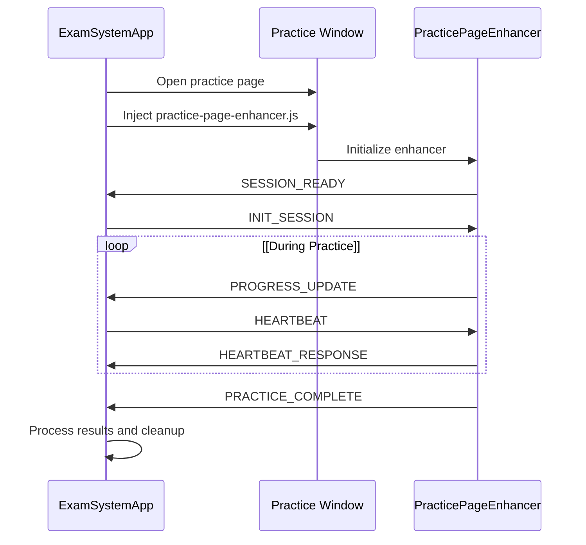
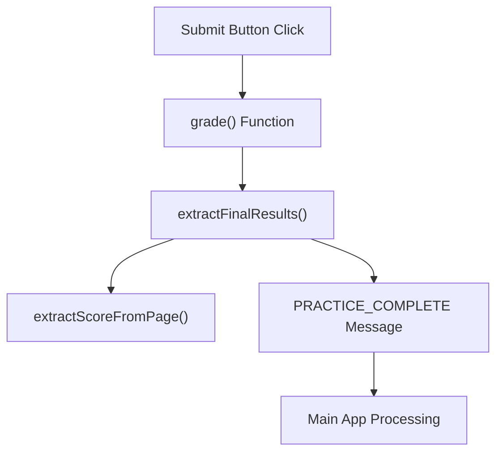
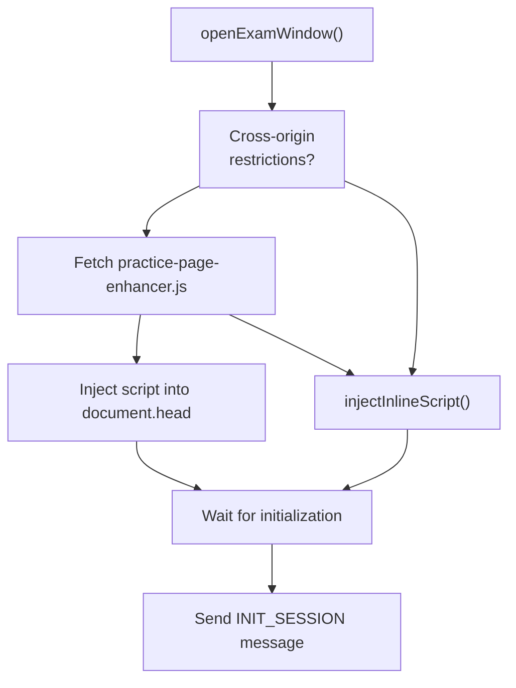
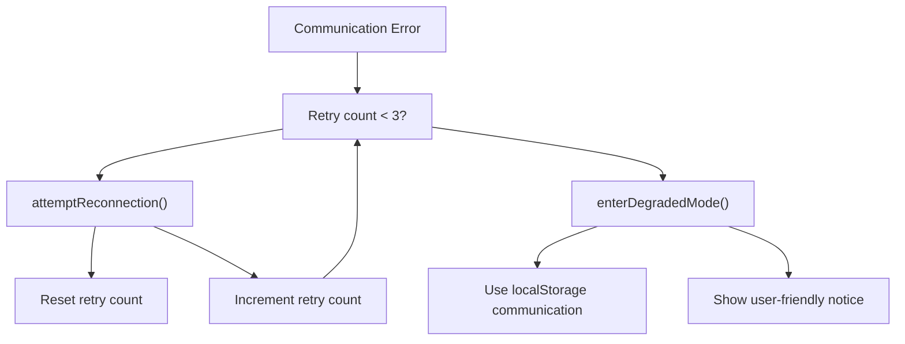
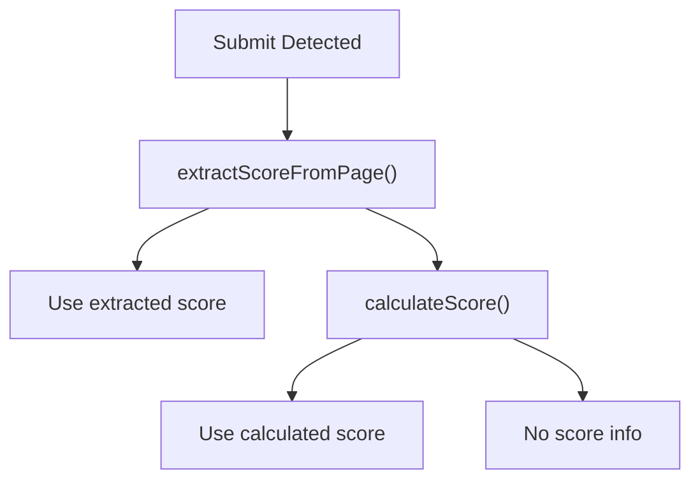

# Session Communication Protocol

> **Relevant source files**
> * [js/app.js](https://github.com/sallowayma-git/IELTS-practice/blob/db0f538c/js/app.js)
> * [js/practice-page-enhancer.js](https://github.com/sallowayma-git/IELTS-practice/blob/db0f538c/js/practice-page-enhancer.js)

This document describes the message-passing system that enables communication between the main IELTS practice application and individual practice pages. The protocol handles session initialization, progress tracking, data collection, and result reporting across browser windows.

For information about the practice page template structure, see [Practice Page Template](/sallowayma-git/IELTS-practice/6.1-practice-page-template). For details on how practice pages are enhanced with additional functionality, see [Practice Enhancement System](/sallowayma-git/IELTS-practice/6.3-practice-enhancement-system).

## Overview and Architecture

The Session Communication Protocol enables bidirectional communication between the main application window and practice session windows using the `window.postMessage` API with localStorage-based fallback mechanisms.

### Communication Flow Diagram



Sources: [js/practice-page-enhancer.js L88-L152](https://github.com/sallowayma-git/IELTS-practice/blob/db0f538c/js/practice-page-enhancer.js#L88-L152)

 [js/app.js L1221-L1284](https://github.com/sallowayma-git/IELTS-practice/blob/db0f538c/js/app.js#L1221-L1284)

### Core Components

| Component | Location | Purpose |
| --- | --- | --- |
| `PracticePageEnhancer` | [js/practice-page-enhancer.js L17-L934](https://github.com/sallowayma-git/IELTS-practice/blob/db0f538c/js/practice-page-enhancer.js#L17-L934) | Client-side communication handler injected into practice pages |
| `ExamSystemApp.setupExamWindowCommunication` | [js/app.js L1221-L1284](https://github.com/sallowayma-git/IELTS-practice/blob/db0f538c/js/app.js#L1221-L1284) | Main application message handler and communication setup |
| `ExamSystemApp.injectDataCollectionScript` | [js/app.js L951-L1038](https://github.com/sallowayma-git/IELTS-practice/blob/db0f538c/js/app.js#L951-L1038) | Script injection and session initialization |

Sources: [js/practice-page-enhancer.js L17-L934](https://github.com/sallowayma-git/IELTS-practice/blob/db0f538c/js/practice-page-enhancer.js#L17-L934)

 [js/app.js L951-L1038](https://github.com/sallowayma-git/IELTS-practice/blob/db0f538c/js/app.js#L951-L1038)

 [js/app.js L1221-L1284](https://github.com/sallowayma-git/IELTS-practice/blob/db0f538c/js/app.js#L1221-L1284)

## Message Protocol Specification

### Message Structure

All messages follow a consistent structure with type identification and data payload:

```yaml
{
    type: "MESSAGE_TYPE",
    data: {
        // Message-specific payload
    },
    timestamp: Date.now(),
    source: "practice_page" | "main_app",
    messageId: "msg_timestamp_randomId"
}
```

Sources: [js/practice-page-enhancer.js L732-L738](https://github.com/sallowayma-git/IELTS-practice/blob/db0f538c/js/practice-page-enhancer.js#L732-L738)

### Core Message Types

#### Session Initialization Messages

| Message Type | Direction | Purpose | Data Fields |
| --- | --- | --- | --- |
| `SESSION_READY` | Practice → Main | Signals practice page is ready | `pageType`, `url`, `timestamp` |
| `INIT_SESSION` | Main → Practice | Initialize session with ID | `sessionId`, `examId`, `parentOrigin` |

#### Progress Tracking Messages

| Message Type | Direction | Purpose | Data Fields |
| --- | --- | --- | --- |
| `PROGRESS_UPDATE` | Practice → Main | Report answering progress | `answeredQuestions`, `totalQuestions`, `elapsedTime` |
| `REQUEST_STATUS` | Main → Practice | Request current status | (none) |

#### Session Management Messages

| Message Type | Direction | Purpose | Data Fields |
| --- | --- | --- | --- |
| `HEARTBEAT` | Main → Practice | Check connection status | `timestamp` |
| `HEARTBEAT_RESPONSE` | Practice → Main | Respond to heartbeat | `timestamp` |
| `RECONNECT_REQUEST` | Main → Practice | Request reconnection | `windowId` |
| `RECONNECT_RESPONSE` | Practice → Main | Confirm reconnection | `status`, `windowId` |

Sources: [js/practice-page-enhancer.js L93-L123](https://github.com/sallowayma-git/IELTS-practice/blob/db0f538c/js/practice-page-enhancer.js#L93-L123)

 [js/practice-page-enhancer.js L645-L663](https://github.com/sallowayma-git/IELTS-practice/blob/db0f538c/js/practice-page-enhancer.js#L645-L663)

### Practice Completion Protocol



The practice completion flow involves intercepting the original `grade` function and extracting comprehensive results:

| Data Field | Source | Description |
| --- | --- | --- |
| `sessionId` | Session initialization | Unique session identifier |
| `startTime`/`endTime` | Enhancer tracking | Session duration timestamps |
| `answers` | Answer monitoring | Complete answer data object |
| `interactions` | Event tracking | User interaction history |
| `scoreInfo` | Page extraction or calculation | Score and accuracy information |

Sources: [js/practice-page-enhancer.js L418-L488](https://github.com/sallowayma-git/IELTS-practice/blob/db0f538c/js/practice-page-enhancer.js#L418-L488)

 [js/practice-page-enhancer.js L492-L522](https://github.com/sallowayma-git/IELTS-practice/blob/db0f538c/js/practice-page-enhancer.js#L492-L522)

## Script Injection and Initialization

### Injection Process Flow



The main application injects the communication script using multiple strategies:

1. **Primary Method**: Fetch and inject the full `practice-page-enhancer.js` script
2. **Fallback Method**: Inject simplified inline communication script
3. **Degraded Mode**: Use localStorage-based communication only

Sources: [js/app.js L951-L1038](https://github.com/sallowayma-git/IELTS-practice/blob/db0f538c/js/app.js#L951-L1038)

 [js/app.js L1043-L1113](https://github.com/sallowayma-git/IELTS-practice/blob/db0f538c/js/app.js#L1043-L1113)

### Cross-Origin Handling

When cross-origin restrictions prevent script injection, the system uses a simplified inline collector:

```yaml
window.practiceDataCollector = {
    sessionId: 'examId_timestamp',
    answers: {},
    setupBasicListeners: function() {
        // Basic answer monitoring
    },
    sendResults: function() {
        // Send via postMessage
    }
}
```

Sources: [js/app.js L1047-L1099](https://github.com/sallowayma-git/IELTS-practice/blob/db0f538c/js/app.js#L1047-L1099)

## Communication Reliability and Fallbacks

### Error Handling Strategy



The `PracticePageEnhancer` implements a multi-tier recovery system:

1. **Automatic Retry**: Up to 3 attempts with exponential backoff
2. **Reconnection**: Attempt to re-establish parent window communication
3. **Degraded Mode**: Switch to localStorage-based communication
4. **User Notification**: Display friendly error messages

Sources: [js/practice-page-enhancer.js L157-L202](https://github.com/sallowayma-git/IELTS-practice/blob/db0f538c/js/practice-page-enhancer.js#L157-L202)

 [js/practice-page-enhancer.js L206-L261](https://github.com/sallowayma-git/IELTS-practice/blob/db0f538c/js/practice-page-enhancer.js#L206-L261)

### localStorage Fallback Mechanism

When `postMessage` communication fails, the system uses localStorage as a backup channel:

| Storage Key Pattern | Purpose | Data Format |
| --- | --- | --- |
| `practice_communication_fallback_${sessionId}` | Message passing | `{type, data, timestamp, source}` |
| `practice_records` | Session data backup | Array of practice records |
| `active_sessions` | Session tracking | Array of active session objects |

The fallback system triggers storage events to notify the main application:

```yaml
window.dispatchEvent(new StorageEvent('storage', {
    key: storageKey,
    newValue: JSON.stringify(fallbackData),
    storageArea: localStorage
}));
```

Sources: [js/practice-page-enhancer.js L266-L308](https://github.com/sallowayma-git/IELTS-practice/blob/db0f538c/js/practice-page-enhancer.js#L266-L308)

### Message Retry and Queuing

The enhancer maintains a retry queue for failed messages with the following parameters:

| Parameter | Default Value | Purpose |
| --- | --- | --- |
| `maxRetries` | 3 | Maximum retry attempts per message |
| `retryDelay` | 2000ms | Base delay between retries |
| `queueProcessor` | 1000ms interval | Retry queue processing frequency |

Sources: [js/practice-page-enhancer.js L825-L898](https://github.com/sallowayma-git/IELTS-practice/blob/db0f538c/js/practice-page-enhancer.js#L825-L898)

## Data Collection and Monitoring

### Answer Tracking

The enhancer monitors user interactions across multiple input types:

| Input Type | Monitoring Method | Data Captured |
| --- | --- | --- |
| `radio` | `change` event | Selected value when checked |
| `checkbox` | `change` event | Value when checked/unchecked |
| `text` | `input`/`change` events | Current text value |
| `textarea` | `input`/`change` events | Current text content |

Each answer change generates an interaction record:

```yaml
{
    type: 'answer_change',
    questionId: 'q1',
    value: 'selected_answer',
    timestamp: Date.now(),
    timeFromStart: elapsedMs
}
```

Sources: [js/practice-page-enhancer.js L355-L414](https://github.com/sallowayma-git/IELTS-practice/blob/db0f538c/js/practice-page-enhancer.js#L355-L414)

### Score Extraction Methods

The system uses multiple strategies to extract practice results:

1. **Page Extraction**: Parse results from DOM elements (`#results`)
2. **Answer Calculation**: Compare user answers against `window.answerKey`
3. **Grade Function Interception**: Capture results from existing evaluation logic



Sources: [js/practice-page-enhancer.js L525-L576](https://github.com/sallowayma-git/IELTS-practice/blob/db0f538c/js/practice-page-enhancer.js#L525-L576)

 [js/practice-page-enhancer.js L581-L626](https://github.com/sallowayma-git/IELTS-practice/blob/db0f538c/js/practice-page-enhancer.js#L581-L626)

## Session Lifecycle Management

### Session States

| State | Trigger | Main App Response |
| --- | --- | --- |
| `initialized` | Script injection complete | Store window reference |
| `ready` | `SESSION_READY` received | Send `INIT_SESSION` |
| `active` | Session data exchange | Monitor progress |
| `completed` | `PRACTICE_COMPLETE` received | Process results, cleanup |
| `interrupted` | Window closed unexpectedly | Cleanup session data |
| `error` | Communication failure | Error logging, fallback mode |

Sources: [js/app.js L1191-L1216](https://github.com/sallowayma-git/IELTS-practice/blob/db0f538c/js/app.js#L1191-L1216)

 [js/practice-page-enhancer.js L39-L64](https://github.com/sallowayma-git/IELTS-practice/blob/db0f538c/js/practice-page-enhancer.js#L39-L64)

### Cleanup and Resource Management

The main application maintains comprehensive session cleanup:

```javascript
cleanupExamSession(examId) {
    // Remove window references
    this.examWindows.delete(examId);
    
    // Remove message handlers
    window.removeEventListener('message', handler);
    
    // Clean active sessions storage
    const sessions = storage.get('active_sessions', []);
    const updated = sessions.filter(s => s.examId !== examId);
    storage.set('active_sessions', updated);
}
```

Sources: [js/app.js L1965-L1983](https://github.com/sallowayma-git/IELTS-practice/blob/db0f538c/js/app.js#L1965-L1983)

The enhancer also implements cleanup for communication resources and error tracking with limits on stored error records and message history.

Sources: [js/practice-page-enhancer.js L161-L176](https://github.com/sallowayma-git/IELTS-practice/blob/db0f538c/js/practice-page-enhancer.js#L161-L176)

 [js/practice-page-enhancer.js L805-L820](https://github.com/sallowayma-git/IELTS-practice/blob/db0f538c/js/practice-page-enhancer.js#L805-L820)