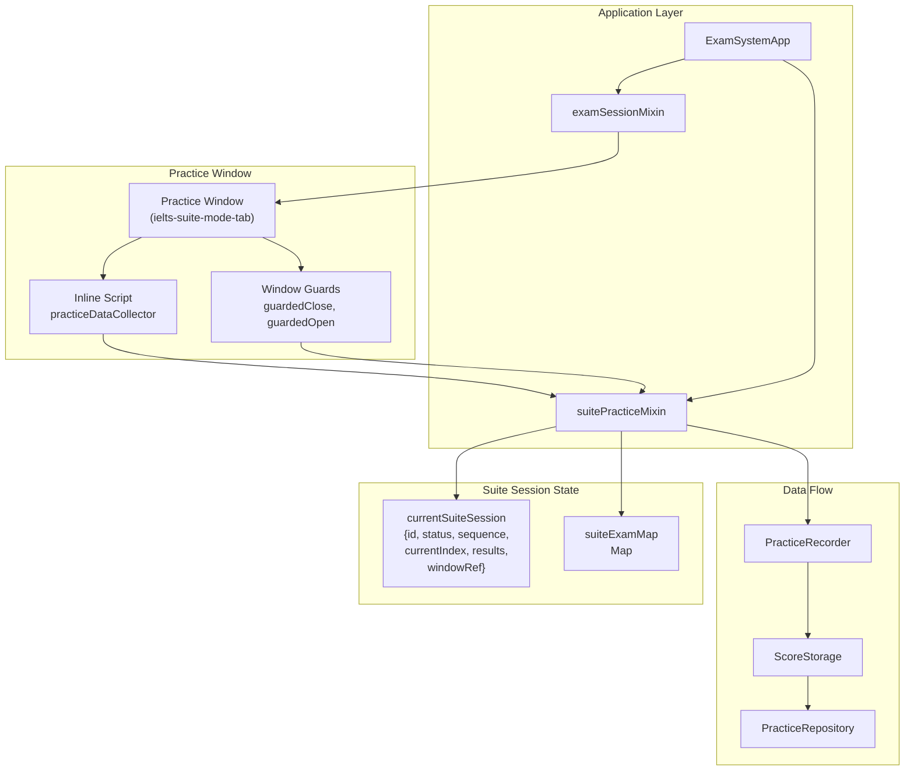

# Suite Practice Mode

> **Relevant source files**
> * [.superdesign/design_iterations/xiaodaidai_dashboard_1.html](https://github.com/sallowayma-git/IELTS-practice/blob/df0c9b8f/.superdesign/design_iterations/xiaodaidai_dashboard_1.html)
> * [assets/data/vocabulary.json](https://github.com/sallowayma-git/IELTS-practice/blob/df0c9b8f/assets/data/vocabulary.json)
> * [developer/tests/ci/run_static_suite.py](https://github.com/sallowayma-git/IELTS-practice/blob/df0c9b8f/developer/tests/ci/run_static_suite.py)
> * [developer/tests/e2e/playwright_index_clickthrough.py](https://github.com/sallowayma-git/IELTS-practice/blob/df0c9b8f/developer/tests/e2e/playwright_index_clickthrough.py)
> * [developer/tests/js/e2e/indexSnapshot.js](https://github.com/sallowayma-git/IELTS-practice/blob/df0c9b8f/developer/tests/js/e2e/indexSnapshot.js)
> * [developer/tests/js/suiteInlineFallback.test.js](https://github.com/sallowayma-git/IELTS-practice/blob/df0c9b8f/developer/tests/js/suiteInlineFallback.test.js)
> * [developer/tests/js/suiteModeFlow.test.js](https://github.com/sallowayma-git/IELTS-practice/blob/df0c9b8f/developer/tests/js/suiteModeFlow.test.js)
> * [js/app/examSessionMixin.js](https://github.com/sallowayma-git/IELTS-practice/blob/df0c9b8f/js/app/examSessionMixin.js)
> * [js/app/lifecycleMixin.js](https://github.com/sallowayma-git/IELTS-practice/blob/df0c9b8f/js/app/lifecycleMixin.js)
> * [js/app/suitePracticeMixin.js](https://github.com/sallowayma-git/IELTS-practice/blob/df0c9b8f/js/app/suitePracticeMixin.js)
> * [js/practice-page-enhancer.js](https://github.com/sallowayma-git/IELTS-practice/blob/df0c9b8f/js/practice-page-enhancer.js)
> * [js/views/overviewView.js](https://github.com/sallowayma-git/IELTS-practice/blob/df0c9b8f/js/views/overviewView.js)

## Purpose and Scope

Suite Practice Mode enables users to complete three reading passages (P1, P2, P3) consecutively in a single session, simulating a real IELTS reading exam. This document covers the suite mode implementation, including session management, window guards, script injection, and result aggregation.

For information about individual practice sessions, see [Practice Recorder & Score Storage](/sallowayma-git/IELTS-practice/5.1-practice-recorder-and-score-storage). For cross-window communication protocols used during practice, see [Cross-Window Communication Protocol](/sallowayma-git/IELTS-practice/5.3-cross-window-communication-protocol).

**Sources:** [js/app/suitePracticeMixin.js L1-L800](https://github.com/sallowayma-git/IELTS-practice/blob/df0c9b8f/js/app/suitePracticeMixin.js#L1-L800)

---

## System Overview

Suite Practice Mode orchestrates a multi-exam session where three reading passages are completed sequentially in a single browser tab. The system automatically transitions between passages, prevents premature window closure, and aggregates results into a unified practice record.

### Key Capabilities

| Capability | Description |
| --- | --- |
| **Automatic Sequencing** | Randomly selects one passage from P1, P2, P3 categories and opens them in order |
| **Window Guards** | Prevents `window.close()` and `window.open(..., '_self')` to maintain session continuity |
| **Tab Reuse** | Navigates within the same browser tab to preserve context |
| **Inline Fallback** | Injects data collection script directly when file:// protocol prevents external script loading |
| **Result Aggregation** | Combines scores, durations, and answers from all three passages into a single record |
| **Session Recovery** | Attempts to reopen closed tabs and continue the session |

**Sources:** [js/app/suitePracticeMixin.js L1-L50](https://github.com/sallowayma-git/IELTS-practice/blob/df0c9b8f/js/app/suitePracticeMixin.js#L1-L50)

 [js/app/examSessionMixin.js L280-L522](https://github.com/sallowayma-git/IELTS-practice/blob/df0c9b8f/js/app/examSessionMixin.js#L280-L522)

---

## Architecture Components



**Component Responsibilities:**

| Component | File | Responsibility |
| --- | --- | --- |
| `suitePracticeMixin` | [js/app/suitePracticeMixin.js](https://github.com/sallowayma-git/IELTS-practice/blob/df0c9b8f/js/app/suitePracticeMixin.js) | Suite session lifecycle, sequencing, result aggregation |
| `examSessionMixin` | [js/app/examSessionMixin.js](https://github.com/sallowayma-git/IELTS-practice/blob/df0c9b8f/js/app/examSessionMixin.js) | Window opening, script injection, message handling |
| `currentSuiteSession` | [js/app/suitePracticeMixin.js L9-L10](https://github.com/sallowayma-git/IELTS-practice/blob/df0c9b8f/js/app/suitePracticeMixin.js#L9-L10) | Active suite session state object |
| `suiteExamMap` | [js/app/suitePracticeMixin.js L10-L11](https://github.com/sallowayma-git/IELTS-practice/blob/df0c9b8f/js/app/suitePracticeMixin.js#L10-L11) | Maps examId to suiteSessionId for routing messages |
| Inline Script | [js/app/examSessionMixin.js L281-L522](https://github.com/sallowayma-git/IELTS-practice/blob/df0c9b8f/js/app/examSessionMixin.js#L281-L522) | Data collection script injected into practice pages |
| Window Guards | [js/app/examSessionMixin.js L345-L388](https://github.com/sallowayma-git/IELTS-practice/blob/df0c9b8f/js/app/examSessionMixin.js#L345-L388) | Prevents window closure during suite practice |

**Sources:** [js/app/suitePracticeMixin.js L1-L100](https://github.com/sallowayma-git/IELTS-practice/blob/df0c9b8f/js/app/suitePracticeMixin.js#L1-L100)

 [js/app/examSessionMixin.js L1-L100](https://github.com/sallowayma-git/IELTS-practice/blob/df0c9b8f/js/app/examSessionMixin.js#L1-L100)

---

## Suite Session Lifecycle

### Initialization Flow

```

```

**Key Functions:**

| Function | Location | Purpose |
| --- | --- | --- |
| `startSuitePractice()` | [js/app/suitePracticeMixin.js L13-L117](https://github.com/sallowayma-git/IELTS-practice/blob/df0c9b8f/js/app/suitePracticeMixin.js#L13-L117) | Entry point for initiating suite practice |
| `initializeSuiteMode()` | [js/app/suitePracticeMixin.js L3-L11](https://github.com/sallowayma-git/IELTS-practice/blob/df0c9b8f/js/app/suitePracticeMixin.js#L3-L11) | Initializes suite mode state structures |
| `_fetchSuiteExamIndex()` | [js/app/suitePracticeMixin.js L317-L333](https://github.com/sallowayma-git/IELTS-practice/blob/df0c9b8f/js/app/suitePracticeMixin.js#L317-L333) | Retrieves exam index from state or storage |
| `_registerSuiteSequence()` | [js/app/suitePracticeMixin.js L339-L347](https://github.com/sallowayma-git/IELTS-practice/blob/df0c9b8f/js/app/suitePracticeMixin.js#L339-L347) | Populates `suiteExamMap` with examId→sessionId mappings |
| `_ensureSuiteWindowGuard()` | [js/app/suitePracticeMixin.js L576-L668](https://github.com/sallowayma-git/IELTS-practice/blob/df0c9b8f/js/app/suitePracticeMixin.js#L576-L668) | Installs window close/open interception |

**Sources:** [js/app/suitePracticeMixin.js L13-L117](https://github.com/sallowayma-git/IELTS-practice/blob/df0c9b8f/js/app/suitePracticeMixin.js#L13-L117)

 [js/app/suitePracticeMixin.js L317-L347](https://github.com/sallowayma-git/IELTS-practice/blob/df0c9b8f/js/app/suitePracticeMixin.js#L317-L347)

 [js/app/suitePracticeMixin.js L576-L668](https://github.com/sallowayma-git/IELTS-practice/blob/df0c9b8f/js/app/suitePracticeMixin.js#L576-L668)

### Session State Object

```

```

**Sources:** [js/app/suitePracticeMixin.js L72-L82](https://github.com/sallowayma-git/IELTS-practice/blob/df0c9b8f/js/app/suitePracticeMixin.js#L72-L82)

### Passage Transition Flow

```

```

**Key Functions:**

| Function | Location | Purpose |
| --- | --- | --- |
| `handleSuitePracticeComplete()` | [js/app/suitePracticeMixin.js L119-L221](https://github.com/sallowayma-git/IELTS-practice/blob/df0c9b8f/js/app/suitePracticeMixin.js#L119-L221) | Handles passage completion and transitions |
| `_normalizeSuiteResult()` | [js/app/suitePracticeMixin.js L512-L543](https://github.com/sallowayma-git/IELTS-practice/blob/df0c9b8f/js/app/suitePracticeMixin.js#L512-L543) | Normalizes practice data for suite context |
| `_reacquireSuiteWindow()` | [js/app/suitePracticeMixin.js L670-L708](https://github.com/sallowayma-git/IELTS-practice/blob/df0c9b8f/js/app/suitePracticeMixin.js#L670-L708) | Attempts to recover closed suite window |
| `_abortSuiteSession()` | [js/app/suitePracticeMixin.js L710-L754](https://github.com/sallowayma-git/IELTS-practice/blob/df0c9b8f/js/app/suitePracticeMixin.js#L710-L754) | Gracefully aborts suite session on error |

**Sources:** [js/app/suitePracticeMixin.js L119-L221](https://github.com/sallowayma-git/IELTS-practice/blob/df0c9b8f/js/app/suitePracticeMixin.js#L119-L221)

 [js/app/suitePracticeMixin.js L512-L543](https://github.com/sallowayma-git/IELTS-practice/blob/df0c9b8f/js/app/suitePracticeMixin.js#L512-L543)

 [js/app/suitePracticeMixin.js L670-L754](https://github.com/sallowayma-git/IELTS-practice/blob/df0c9b8f/js/app/suitePracticeMixin.js#L670-L754)

---

## Window Management and Guards

Suite Practice Mode prevents premature window closure to maintain session continuity. This is achieved through runtime interception of `window.close()` and `window.open(..., '_self')`.

### Guard Installation

```

```

**Guard Implementation:**

```

```

**Guard Teardown:**

```

```

**Sources:** [js/app/examSessionMixin.js L335-L388](https://github.com/sallowayma-git/IELTS-practice/blob/df0c9b8f/js/app/examSessionMixin.js#L335-L388)

 [js/app/suitePracticeMixin.js L576-L668](https://github.com/sallowayma-git/IELTS-practice/blob/df0c9b8f/js/app/suitePracticeMixin.js#L576-L668)

### Close Attempt Tracking

When a guarded close attempt occurs, the practice window sends a `SUITE_CLOSE_ATTEMPT` message to the main application:

```

```

The main application logs these attempts but allows the suite to continue:

```

```

**Sources:** [js/app/examSessionMixin.js L323-L333](https://github.com/sallowayma-git/IELTS-practice/blob/df0c9b8f/js/app/examSessionMixin.js#L323-L333)

 [js/app/examSessionMixin.js L889-L891](https://github.com/sallowayma-git/IELTS-practice/blob/df0c9b8f/js/app/examSessionMixin.js#L889-L891)

---

## Data Collection and Script Injection

Suite Practice Mode uses two script injection strategies depending on the execution environment:

### Strategy 1: External Script Loading

```

```

**Used when:** HTTP/HTTPS protocol allows fetch operations.

**Sources:** [js/app/examSessionMixin.js L206-L255](https://github.com/sallowayma-git/IELTS-practice/blob/df0c9b8f/js/app/examSessionMixin.js#L206-L255)

### Strategy 2: Inline Script Injection (Fallback)

```

```

**Used when:** file:// protocol prevents fetch operations, or external script loading fails.

**Sources:** [js/app/examSessionMixin.js L281-L522](https://github.com/sallowayma-git/IELTS-practice/blob/df0c9b8f/js/app/examSessionMixin.js#L281-L522)

### Suite Mode Initialization in Practice Window

```

```

**Sources:** [js/app/examSessionMixin.js L401-L421](https://github.com/sallowayma-git/IELTS-practice/blob/df0c9b8f/js/app/examSessionMixin.js#L401-L421)

 [js/app/examSessionMixin.js L527-L600](https://github.com/sallowayma-git/IELTS-practice/blob/df0c9b8f/js/app/examSessionMixin.js#L527-L600)

### Navigation Between Passages

When transitioning to the next passage, the main window sends a `SUITE_NAVIGATE` message:

```

```

**Sources:** [js/app/examSessionMixin.js L390-L399](https://github.com/sallowayma-git/IELTS-practice/blob/df0c9b8f/js/app/examSessionMixin.js#L390-L399)

---

## Result Aggregation

After all three passages are completed, Suite Practice Mode aggregates individual results into a unified practice record.

### Aggregation Process

```

```

**Aggregated Record Structure:**

```

```

**Key Functions:**

| Function | Location | Purpose |
| --- | --- | --- |
| `finalizeSuiteRecord()` | [js/app/suitePracticeMixin.js L223-L315](https://github.com/sallowayma-git/IELTS-practice/blob/df0c9b8f/js/app/suitePracticeMixin.js#L223-L315) | Aggregates passage results into suite record |
| `_normalizeSuiteResult()` | [js/app/suitePracticeMixin.js L512-L543](https://github.com/sallowayma-git/IELTS-practice/blob/df0c9b8f/js/app/suitePracticeMixin.js#L512-L543) | Normalizes individual passage data |
| `_saveSuitePracticeRecord()` | [js/app/suitePracticeMixin.js L756-L799](https://github.com/sallowayma-git/IELTS-practice/blob/df0c9b8f/js/app/suitePracticeMixin.js#L756-L799) | Saves aggregated record to storage |
| `_formatSuiteTimeLabel()` | [js/app/suitePracticeMixin.js L545-L552](https://github.com/sallowayma-git/IELTS-practice/blob/df0c9b8f/js/app/suitePracticeMixin.js#L545-L552) | Formats timestamp for suite title |

**Sources:** [js/app/suitePracticeMixin.js L223-L315](https://github.com/sallowayma-git/IELTS-practice/blob/df0c9b8f/js/app/suitePracticeMixin.js#L223-L315)

 [js/app/suitePracticeMixin.js L512-L552](https://github.com/sallowayma-git/IELTS-practice/blob/df0c9b8f/js/app/suitePracticeMixin.js#L512-L552)

 [js/app/suitePracticeMixin.js L756-L799](https://github.com/sallowayma-git/IELTS-practice/blob/df0c9b8f/js/app/suitePracticeMixin.js#L756-L799)

---

## Fallback Mechanisms

Suite Practice Mode includes several fallback mechanisms to handle failures gracefully:

### Window Recovery

```

```

**Window Recovery Implementation:**

```

```

**Sources:** [js/app/suitePracticeMixin.js L670-L708](https://github.com/sallowayma-git/IELTS-practice/blob/df0c9b8f/js/app/suitePracticeMixin.js#L670-L708)

 [js/app/suitePracticeMixin.js L172-L221](https://github.com/sallowayma-git/IELTS-practice/blob/df0c9b8f/js/app/suitePracticeMixin.js#L172-L221)

### Partial Suite Saving

If the suite session fails mid-way, completed passages are saved as individual practice records:

```

```

**Sources:** [js/app/suitePracticeMixin.js L801-L868](https://github.com/sallowayma-git/IELTS-practice/blob/df0c9b8f/js/app/suitePracticeMixin.js#L801-L868)

### Session Abortion

```

```

**Sources:** [js/app/suitePracticeMixin.js L710-L754](https://github.com/sallowayma-git/IELTS-practice/blob/df0c9b8f/js/app/suitePracticeMixin.js#L710-L754)

---

## Testing

Suite Practice Mode is tested through two comprehensive Node.js test files:

### Suite Mode Flow Test

```

```

**Test Coverage:**

| Test Case | Location | Validates |
| --- | --- | --- |
| Suite initialization | [developer/tests/js/suiteModeFlow.test.js L277-L278](https://github.com/sallowayma-git/IELTS-practice/blob/df0c9b8f/developer/tests/js/suiteModeFlow.test.js#L277-L278) | Session object creation |
| First exam opens | [developer/tests/js/suiteModeFlow.test.js L287-L290](https://github.com/sallowayma-git/IELTS-practice/blob/df0c9b8f/developer/tests/js/suiteModeFlow.test.js#L287-L290) | Initial window opening |
| Window guards active | [developer/tests/js/suiteModeFlow.test.js L293-L297](https://github.com/sallowayma-git/IELTS-practice/blob/df0c9b8f/developer/tests/js/suiteModeFlow.test.js#L293-L297) | Close interception works |
| Self-target open blocked | [developer/tests/js/suiteModeFlow.test.js L299-L303](https://github.com/sallowayma-git/IELTS-practice/blob/df0c9b8f/developer/tests/js/suiteModeFlow.test.js#L299-L303) | Self-navigation blocked |
| New tab open allowed | [developer/tests/js/suiteModeFlow.test.js L305-L309](https://github.com/sallowayma-git/IELTS-practice/blob/df0c9b8f/developer/tests/js/suiteModeFlow.test.js#L305-L309) | Regular popups still work |
| Passage transition | [developer/tests/js/suiteModeFlow.test.js L320-L325](https://github.com/sallowayma-git/IELTS-practice/blob/df0c9b8f/developer/tests/js/suiteModeFlow.test.js#L320-L325) | Continues to next passage |
| Window recovery | [developer/tests/js/suiteModeFlow.test.js L332-L340](https://github.com/sallowayma-git/IELTS-practice/blob/df0c9b8f/developer/tests/js/suiteModeFlow.test.js#L332-L340) | Reopens closed window |

**Sources:** [developer/tests/js/suiteModeFlow.test.js L1-L352](https://github.com/sallowayma-git/IELTS-practice/blob/df0c9b8f/developer/tests/js/suiteModeFlow.test.js#L1-L352)

### Inline Fallback Test

```

```

**Test Coverage:**

| Test Case | Location | Validates |
| --- | --- | --- |
| Inline script injection | [developer/tests/js/suiteInlineFallback.test.js L191-L192](https://github.com/sallowayma-git/IELTS-practice/blob/df0c9b8f/developer/tests/js/suiteInlineFallback.test.js#L191-L192) | Script successfully injected |
| Session handshake | [developer/tests/js/suiteInlineFallback.test.js L193-L198](https://github.com/sallowayma-git/IELTS-practice/blob/df0c9b8f/developer/tests/js/suiteInlineFallback.test.js#L193-L198) | INIT_SESSION/SESSION_READY exchange |
| Data collector presence | [developer/tests/js/suiteInlineFallback.test.js L200](https://github.com/sallowayma-git/IELTS-practice/blob/df0c9b8f/developer/tests/js/suiteInlineFallback.test.js#L200-L200) | `practiceDataCollector` object created |
| Close attempt blocked | [developer/tests/js/suiteInlineFallback.test.js L202-L207](https://github.com/sallowayma-git/IELTS-practice/blob/df0c9b8f/developer/tests/js/suiteInlineFallback.test.js#L202-L207) | Window remains open after close() |
| Navigation works | [developer/tests/js/suiteInlineFallback.test.js L209-L211](https://github.com/sallowayma-git/IELTS-practice/blob/df0c9b8f/developer/tests/js/suiteInlineFallback.test.js#L209-L211) | SUITE_NAVIGATE changes location |
| Force close works | [developer/tests/js/suiteInlineFallback.test.js L213-L216](https://github.com/sallowayma-git/IELTS-practice/blob/df0c9b8f/developer/tests/js/suiteInlineFallback.test.js#L213-L216) | SUITE_FORCE_CLOSE calls native close |

**Sources:** [developer/tests/js/suiteInlineFallback.test.js L1-L226](https://github.com/sallowayma-git/IELTS-practice/blob/df0c9b8f/developer/tests/js/suiteInlineFallback.test.js#L1-L226)

### CI Integration

Both tests are executed by the static CI suite:

```

```

**Sources:** [developer/tests/ci/run_static_suite.py L472-L496](https://github.com/sallowayma-git/IELTS-practice/blob/df0c9b8f/developer/tests/ci/run_static_suite.py#L472-L496)

---

## State Transitions

```

```

**State Definitions:**

| State | Condition | Next States |
| --- | --- | --- |
| `initializing` | Suite started, selecting passages | `active`, aborted |
| `active` | At least one passage opened | `active`, `finalizing`, `aborted` |
| `finalizing` | All passages completed, aggregating results | `completed`, `error` |
| `completed` | Record saved successfully | terminal |
| `error` | Record save failed | terminal (with partial save) |
| `aborted` | Session terminated early | terminal (with partial save) |

**Sources:** [js/app/suitePracticeMixin.js L13-L315](https://github.com/sallowayma-git/IELTS-practice/blob/df0c9b8f/js/app/suitePracticeMixin.js#L13-L315)

 [js/app/suitePracticeMixin.js L710-L754](https://github.com/sallowayma-git/IELTS-practice/blob/df0c9b8f/js/app/suitePracticeMixin.js#L710-L754)