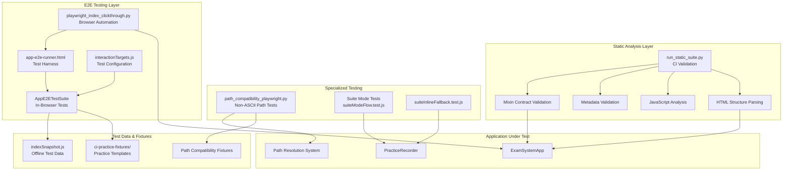
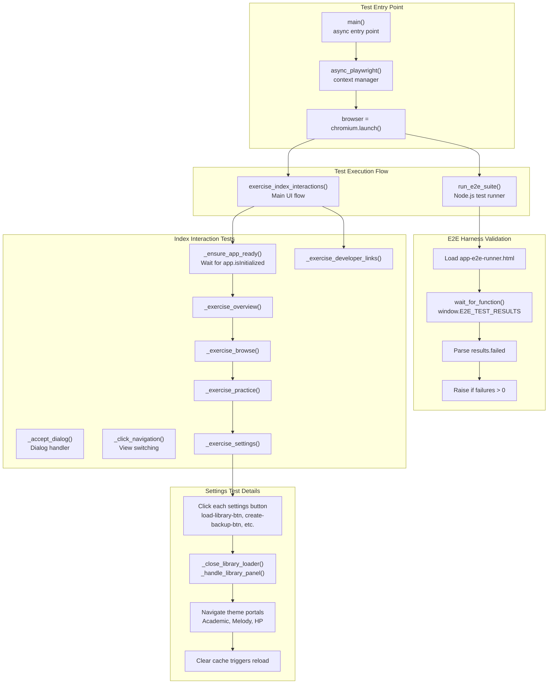
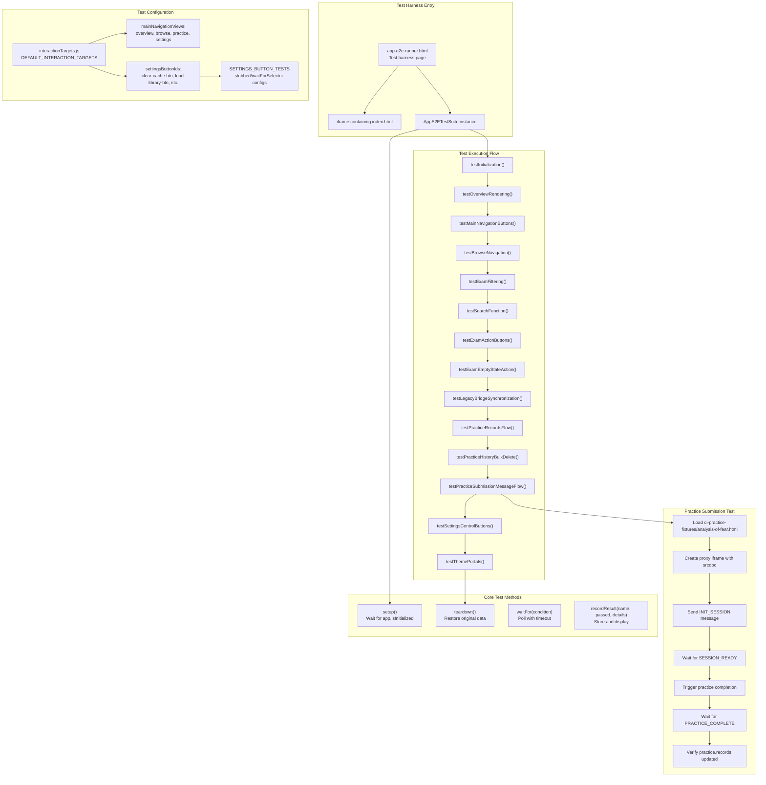
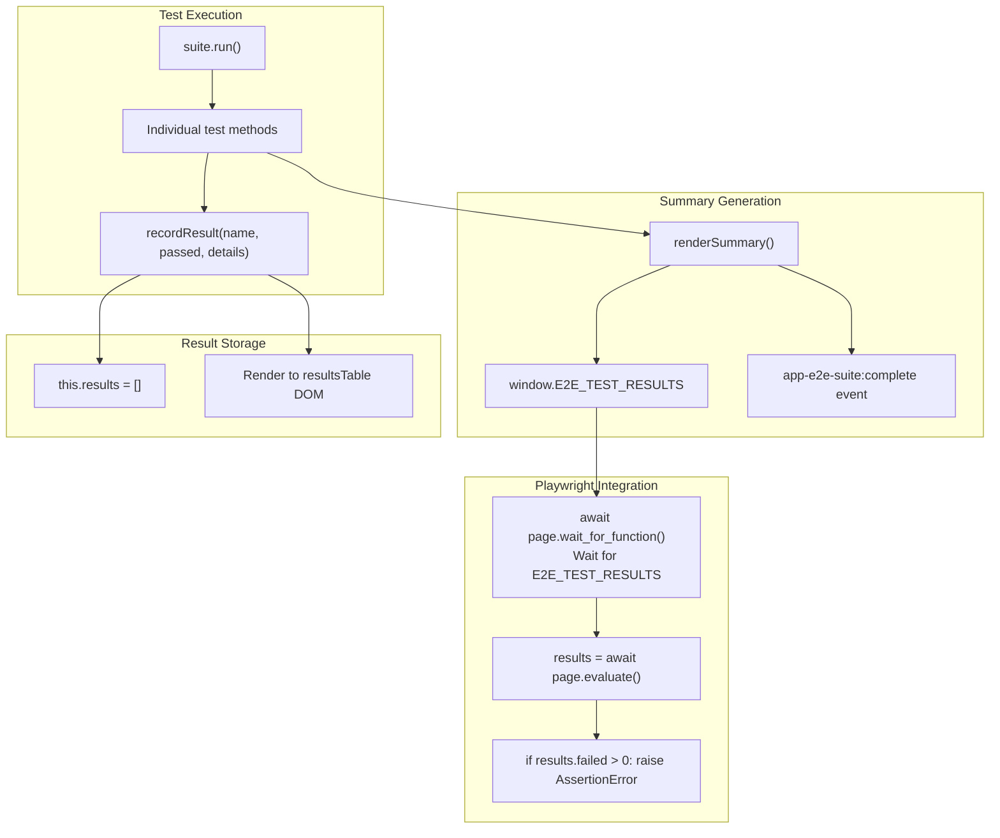
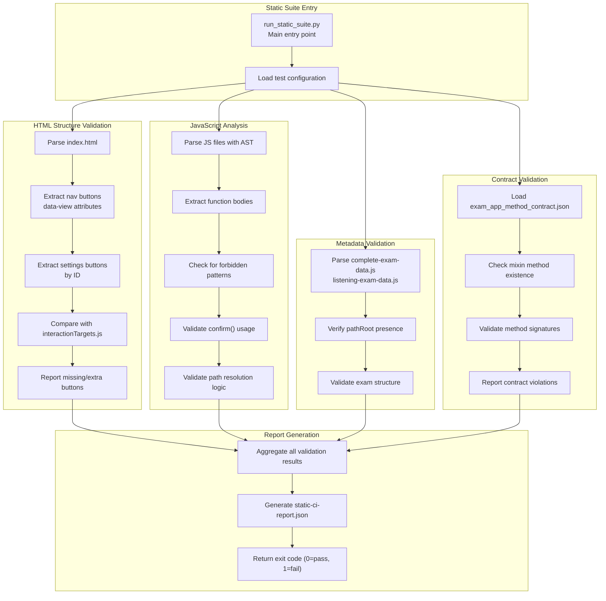
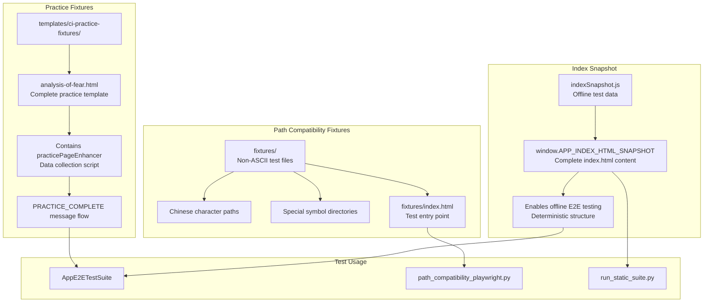

# Testing & Quality Assurance

> **Relevant source files**
> * [developer/docs/10-06 log.md](https://github.com/sallowayma-git/IELTS-practice/blob/df0c9b8f/developer/docs/10-06 log.md)
> * [developer/docs/optimization-task-tracker.md](https://github.com/sallowayma-git/IELTS-practice/blob/df0c9b8f/developer/docs/optimization-task-tracker.md)
> * [developer/tests/e2e/playwright_index_clickthrough.py](https://github.com/sallowayma-git/IELTS-practice/blob/df0c9b8f/developer/tests/e2e/playwright_index_clickthrough.py)
> * [developer/tests/js/e2e/appE2ETest.js](https://github.com/sallowayma-git/IELTS-practice/blob/df0c9b8f/developer/tests/js/e2e/appE2ETest.js)
> * [developer/tests/js/e2e/indexSnapshot.js](https://github.com/sallowayma-git/IELTS-practice/blob/df0c9b8f/developer/tests/js/e2e/indexSnapshot.js)
> * [js/app/examSessionMixin.js](https://github.com/sallowayma-git/IELTS-practice/blob/df0c9b8f/js/app/examSessionMixin.js)
> * [js/app/lifecycleMixin.js](https://github.com/sallowayma-git/IELTS-practice/blob/df0c9b8f/js/app/lifecycleMixin.js)
> * [js/components/practiceHistoryEnhancer.js](https://github.com/sallowayma-git/IELTS-practice/blob/df0c9b8f/js/components/practiceHistoryEnhancer.js)
> * [js/core/goalManager.js](https://github.com/sallowayma-git/IELTS-practice/blob/df0c9b8f/js/core/goalManager.js)
> * [js/utils/dom.js](https://github.com/sallowayma-git/IELTS-practice/blob/df0c9b8f/js/utils/dom.js)
> * [js/views/overviewView.js](https://github.com/sallowayma-git/IELTS-practice/blob/df0c9b8f/js/views/overviewView.js)

## Purpose and Scope

This document covers the comprehensive testing infrastructure for the IELTS Practice System. The testing strategy employs multiple layers: Playwright-based browser automation, in-browser Node.js E2E tests, static analysis for structural validation, and specialized path compatibility tests. This multi-faceted approach ensures functional correctness, structural integrity, and edge case coverage while providing automated regression detection during refactoring.

For information about the components being tested, see [Core Application Architecture](/sallowayma-git/IELTS-practice/3-core-application-architecture). For details about the practice session flows validated by tests, see [Practice Session System](/sallowayma-git/IELTS-practice/5-practice-session-system).

## Testing Architecture Overview

The testing infrastructure implements a comprehensive three-tier validation strategy that combines automated browser testing, static analysis, and specialized edge case validation:

**Testing Infrastructure Architecture**



**Three-Tier Testing Strategy**

| Testing Layer | Primary Tool | Coverage Focus | Execution Environment |
| --- | --- | --- | --- |
| Browser E2E | Playwright Python | Full user flows, visual validation | Real browser (Chromium) |
| In-Browser E2E | Node.js + iframe | Component integration, message flows | Browser context with DOM access |
| Static Analysis | Python + AST parsing | Structural integrity, contracts | CI pipeline (no browser) |
| Path Compatibility | Playwright + HTTP server | Non-ASCII paths, special characters | Local server with test fixtures |

Sources: [developer/docs/optimization-task-tracker.md L13-L14](https://github.com/sallowayma-git/IELTS-practice/blob/df0c9b8f/developer/docs/optimization-task-tracker.md#L13-L14)

 [developer/tests/e2e/playwright_index_clickthrough.py L1-L289](https://github.com/sallowayma-git/IELTS-practice/blob/df0c9b8f/developer/tests/e2e/playwright_index_clickthrough.py#L1-L289)

 [developer/tests/js/e2e/appE2ETest.js L1-L80](https://github.com/sallowayma-git/IELTS-practice/blob/df0c9b8f/developer/tests/js/e2e/appE2ETest.js#L1-L80)

 [developer/tests/ci/run_static_suite.py](https://github.com/sallowayma-git/IELTS-practice/blob/df0c9b8f/developer/tests/ci/run_static_suite.py)

## E2E Testing Infrastructure

The E2E testing system consists of two complementary approaches: Python-based Playwright automation for full user flow testing, and Node.js in-browser tests for component-level integration validation.

### Playwright Browser Automation

**Playwright Test Runner Architecture**



**Playwright Test Coverage**

The `playwright_index_clickthrough.py` script exercises complete user journeys through the application:

| Test Function | Coverage | Key Validations |
| --- | --- | --- |
| `_exercise_overview()` | Overview view interaction | Category browse buttons, random practice buttons, popup handling |
| `_exercise_browse()` | Browse view filtering | Type filter buttons, exam action buttons (start/pdf/generate) |
| `_exercise_practice()` | Practice history operations | Record type filters, bulk delete toggle, export/clear operations |
| `_exercise_settings()` | Settings panel controls | All settings buttons, theme switcher modal, library loader |
| `_exercise_developer_links()` | Developer modal | Developer team modal open/close |

The script handles dynamic UI elements like dialogs and popups through event handlers:

* `page.on("dialog", lambda dialog: asyncio.ensure_future(_accept_dialog(dialog)))` - Auto-accepts browser dialogs
* `page.on("popup", lambda popup: asyncio.ensure_future(popup.close()))` - Auto-closes popups during test execution

**Test Setup and Cleanup**

```javascript
# Clear theme preferences before tests
await context.add_init_script(
    "(() => { try { localStorage.removeItem('preferred_theme_portal'); sessionStorage.removeItem('preferred_theme_skip_session'); } catch (_) {} })();"
)
```

This ensures consistent test environment by removing cached theme selections.

Sources: [developer/tests/e2e/playwright_index_clickthrough.py L1-L289](https://github.com/sallowayma-git/IELTS-practice/blob/df0c9b8f/developer/tests/e2e/playwright_index_clickthrough.py#L1-L289)

 [developer/tests/e2e/playwright_index_clickthrough.py L18-L24](https://github.com/sallowayma-git/IELTS-practice/blob/df0c9b8f/developer/tests/e2e/playwright_index_clickthrough.py#L18-L24)

 [developer/tests/e2e/playwright_index_clickthrough.py L213-L242](https://github.com/sallowayma-git/IELTS-practice/blob/df0c9b8f/developer/tests/e2e/playwright_index_clickthrough.py#L213-L242)

 [developer/tests/e2e/playwright_index_clickthrough.py L269-L285](https://github.com/sallowayma-git/IELTS-practice/blob/df0c9b8f/developer/tests/e2e/playwright_index_clickthrough.py#L269-L285)

### Node.js In-Browser Testing

**AppE2ETestSuite Architecture**



**Test Suite Structure**

The `AppE2ETestSuite` class provides comprehensive in-browser testing with direct DOM and JavaScript access:

```python
class AppE2ETestSuite {
    constructor(frame, { statusEl, statusTextEl, resultsTable }) {
        this.frame = frame;                    // iframe containing app
        this.win = null;                       // iframe.contentWindow
        this.doc = null;                       // iframe.contentWindow.document
        this.results = [];                     // test results array
        this.originalPracticeRecords = null;   // backup for teardown
    }
}
```

**Test Configuration Pattern**

The `SETTINGS_BUTTON_TESTS` object defines test behavior for each settings button:

```javascript
const SETTINGS_BUTTON_TESTS = {
    'load-library-btn': {
        name: '设置 - 加载题库按钮',
        stubbed: ['showLibraryLoaderModal', 'loadLibrary'],
        stubImplementation: () => Promise.resolve('loaded')
    },
    'backup-list-btn': {
        name: '设置 - 查看备份列表按钮',
        expectInvocation: false,
        waitForSelector: '.backup-list-container',
        waitDescription: '备份列表渲染',
        cleanupSelector: '.backup-list-container'
    }
}
```

This configuration-driven approach allows declarative test definitions with either stub expectations or DOM selector waits.

**Practice Submission Message Flow Test**

The `testPracticeSubmissionMessageFlow()` method validates the complete practice recording pipeline:

1. **Fixture Loading**: Loads `templates/ci-practice-fixtures/analysis-of-fear.html` which contains a complete practice exam
2. **Iframe Setup**: Creates an iframe with the fixture content using `srcdoc`
3. **Session Handshake**: Sends `INIT_SESSION` message, waits for `SESSION_READY` confirmation
4. **Submission Trigger**: Simulates exam completion and sends `PRACTICE_COMPLETE` message
5. **Storage Verification**: Validates that practice record appears in `storage.get('practice_records')`
6. **UI Validation**: Checks that history list and statistics update correctly

This test ensures the cross-window communication protocol works correctly and that practice data flows through all layers (message → recorder → storage → UI).

Sources: [developer/tests/js/e2e/appE2ETest.js L1-L80](https://github.com/sallowayma-git/IELTS-practice/blob/df0c9b8f/developer/tests/js/e2e/appE2ETest.js#L1-L80)

 [developer/tests/js/e2e/appE2ETest.js L81-L200](https://github.com/sallowayma-git/IELTS-practice/blob/df0c9b8f/developer/tests/js/e2e/appE2ETest.js#L81-L200)

 [developer/tests/js/e2e/appE2ETest.js L202-L231](https://github.com/sallowayma-git/IELTS-practice/blob/df0c9b8f/developer/tests/js/e2e/appE2ETest.js#L202-L231)

 [developer/tests/js/e2e/appE2ETest.js L1120-L1245](https://github.com/sallowayma-git/IELTS-practice/blob/df0c9b8f/developer/tests/js/e2e/appE2ETest.js#L1120-L1245)

 [developer/docs/optimization-task-tracker.md L145-L152](https://github.com/sallowayma-git/IELTS-practice/blob/df0c9b8f/developer/docs/optimization-task-tracker.md#L145-L152)

### Test Execution and Result Aggregation

**Test Result Flow**



**Test Result Object Structure**

Each test result is stored with detailed information:

```yaml
{
    name: "应用初始化状态",           // Test name
    passed: true,                    // Pass/fail status
    details: {                       // Additional details
        activeView: "overview-view",
        activeNav: "overview",
        appInitialized: true
    }
}
```

The final summary object exposed to Playwright:

```yaml
window.__E2E_TEST_RESULTS__ = {
    total: 15,                       // Total test count
    passed: 14,                      // Passed count
    failed: 1,                       // Failed count
    proxyConfig: {...},              // Test configuration
    results: [...]                   // Full results array
}
```

This structure allows Playwright to programmatically validate test outcomes and fail the CI pipeline if any E2E tests fail.

Sources: [developer/tests/js/e2e/appE2ETest.js L122-L162](https://github.com/sallowayma-git/IELTS-practice/blob/df0c9b8f/developer/tests/js/e2e/appE2ETest.js#L122-L162)

 [developer/tests/js/e2e/appE2ETest.js L233-L258](https://github.com/sallowayma-git/IELTS-practice/blob/df0c9b8f/developer/tests/js/e2e/appE2ETest.js#L233-L258)

 [developer/tests/e2e/playwright_index_clickthrough.py L245-L267](https://github.com/sallowayma-git/IELTS-practice/blob/df0c9b8f/developer/tests/e2e/playwright_index_clickthrough.py#L245-L267)

## Static Analysis & CI Validation

The static analysis suite provides structural validation without requiring a browser, making it ideal for CI pipelines and pre-commit hooks.

**Static Analysis Suite Architecture**



**Static Analysis Checks**

| Check Category | Validation Focus | Example Failures |
| --- | --- | --- |
| **Structure Checks** | HTML element presence and consistency | Missing navigation buttons, incorrect data attributes |
| **JavaScript Checks** | Code pattern validation | Forbidden `confirm()` dialogs, incorrect path construction |
| **Metadata Checks** | Exam data completeness | Missing `pathRoot`, malformed exam objects |
| **Contract Checks** | Mixin method existence | Missing required methods like `openExam()`, `navigateToView()` |

**HTML Structure Parsing Example**

The static suite parses `index.html` to extract button definitions:

```sql
# Extract navigation buttons
nav_buttons = soup.select('nav.main-nav button[data-view]')
found_views = {btn['data-view'] for btn in nav_buttons}

# Extract settings buttons
settings_buttons = soup.select('#settings-view button[id]')
found_button_ids = {btn['id'] for btn in settings_buttons}

# Compare with test configuration
expected_views = set(interaction_targets['mainNavigationViews'])
expected_buttons = set(interaction_targets['settingsButtonIds'])

missing_views = expected_views - found_views
extra_views = found_views - expected_views
```

This ensures that test configuration stays synchronized with actual HTML structure, preventing test coverage gaps.

**JavaScript Pattern Detection**

The suite uses AST parsing to detect anti-patterns:

```css
# Check for forbidden confirm() dialogs
if re.search(r'\bconfirm\s*\(', function_body):
    violations.append({
        'file': file_path,
        'function': function_name,
        'pattern': 'confirm() dialog',
        'recommendation': 'Use modal component instead'
    })
```

This catches usability issues (browser-native dialogs) that should use custom UI components.

**Contract Validation**

The `exam_app_method_contract.json` file defines required methods for each mixin:

```json
{
    "stateMixin": ["getState", "setState", "loadPersistedState"],
    "navigationMixin": ["navigateToView", "showView"],
    "examSessionMixin": ["openExam", "startPracticeSession"]
}
```

The static suite validates that these methods exist in the corresponding mixin files, ensuring architectural contracts are maintained during refactoring.

Sources: [developer/docs/optimization-task-tracker.md L17](https://github.com/sallowayma-git/IELTS-practice/blob/df0c9b8f/developer/docs/optimization-task-tracker.md#L17-L17)

 [developer/tests/ci/run_static_suite.py](https://github.com/sallowayma-git/IELTS-practice/blob/df0c9b8f/developer/tests/ci/run_static_suite.py)

 [developer/docs/optimization-task-tracker.md L224-L244](https://github.com/sallowayma-git/IELTS-practice/blob/df0c9b8f/developer/docs/optimization-task-tracker.md#L224-L244)

 [developer/docs/optimization-task-tracker.md L572-L573](https://github.com/sallowayma-git/IELTS-practice/blob/df0c9b8f/developer/docs/optimization-task-tracker.md#L572-L573)

## Test Fixtures and Data

Test fixtures provide deterministic, reproducible test data and content for both E2E and static tests.

**Test Fixture Architecture**



**Practice Template Structure**

The `analysis-of-fear.html` fixture provides a complete practice exam template:

```typescript
<!-- Practice page with data collection -->
<script src="../../js/practice-page-enhancer.js"></script>

<!-- Exam content -->
<form id="exam-form">
    <!-- Questions and answers -->
</form>

<!-- Data collection integration -->
<script>
    // Listen for INIT_SESSION from parent window
    window.addEventListener('message', function(event) {
        if (event.data.type === 'INIT_SESSION') {
            // Initialize session
            window.postMessage({ type: 'SESSION_READY', data: {...} }, '*');
        }
    });
    
    // On submission, send PRACTICE_COMPLETE
    function submitExam() {
        window.postMessage({ 
            type: 'PRACTICE_COMPLETE', 
            data: { answers: {...}, duration: 300 } 
        }, '*');
    }
</script>
```

This template enables testing the complete practice submission pipeline including cross-window messaging and data collection.

**Index Snapshot for Offline Testing**

The `indexSnapshot.js` file contains a complete copy of `index.html` as a JavaScript string:

```html
window.__APP_INDEX_HTML_SNAPSHOT__ = `<!DOCTYPE html>
<html lang="zh-CN">
<head>
    <base href="../../">
    <!-- Complete index.html content -->
</head>
<body>
    <!-- Full application structure -->
</body>
</html>`;
```

This allows E2E tests to load a known-good version of the application structure without external dependencies, ensuring test stability even as `index.html` evolves.

**Path Compatibility Fixture Structure**

The path compatibility fixtures mirror production directory structures but use challenging file names:

```markdown
fixtures/
├── index.html                          # Test entry point
├── Reading/
│   ├── 剑桥雅思8-Test1/                # Chinese characters
│   │   ├── 阅读P1.html
│   │   └── 阅读P2.html
│   └── Special!@#Characters/           # Special symbols
│       └── test.html
└── Listening/
    └── 剑15-Test3/
        └── 听力.html
```

These fixtures ensure the path resolution system handles non-ASCII characters correctly across different operating systems and browsers.

Sources: [developer/docs/optimization-task-tracker.md L145-L152](https://github.com/sallowayma-git/IELTS-practice/blob/df0c9b8f/developer/docs/optimization-task-tracker.md#L145-L152)

 [developer/tests/js/e2e/indexSnapshot.js L1-L409](https://github.com/sallowayma-git/IELTS-practice/blob/df0c9b8f/developer/tests/js/e2e/indexSnapshot.js#L1-L409)

 [developer/docs/optimization-task-tracker.md L216-L217](https://github.com/sallowayma-git/IELTS-practice/blob/df0c9b8f/developer/docs/optimization-task-tracker.md#L216-L217)

## Development Setup Recommendations

Based on the configuration analysis, the development environment should include:

| Component | Configuration | Purpose |
| --- | --- | --- |
| IDE Support | VS Code + Custom tools | Multi-editor development workflow |
| Documentation | Auto-generation to `/docs/` | Automated documentation pipeline |
| Build Tools | Local `/tools/` directory | Development automation and build scripts |
| Cross-Platform | File exclusion patterns | Support for macOS and Windows development |

This configuration supports a flexible development environment with multiple toolchains while maintaining a clean version control history by excluding generated content and personal configuration files.

Sources: [.gitignore L1-L11](https://github.com/sallowayma-git/IELTS-practice/blob/df0c9b8f/.gitignore#L1-L11)