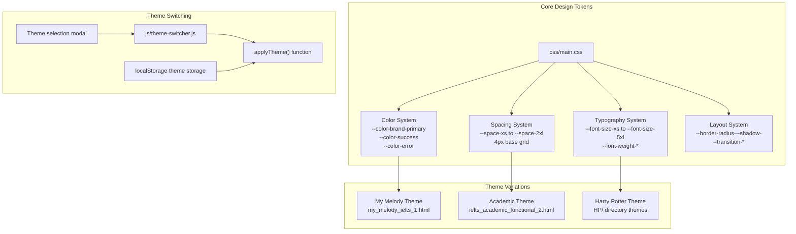
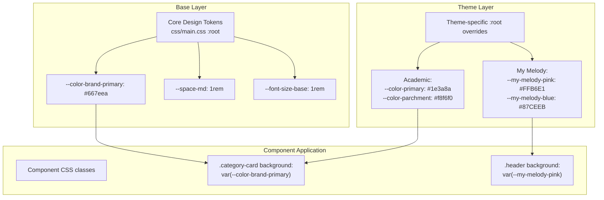
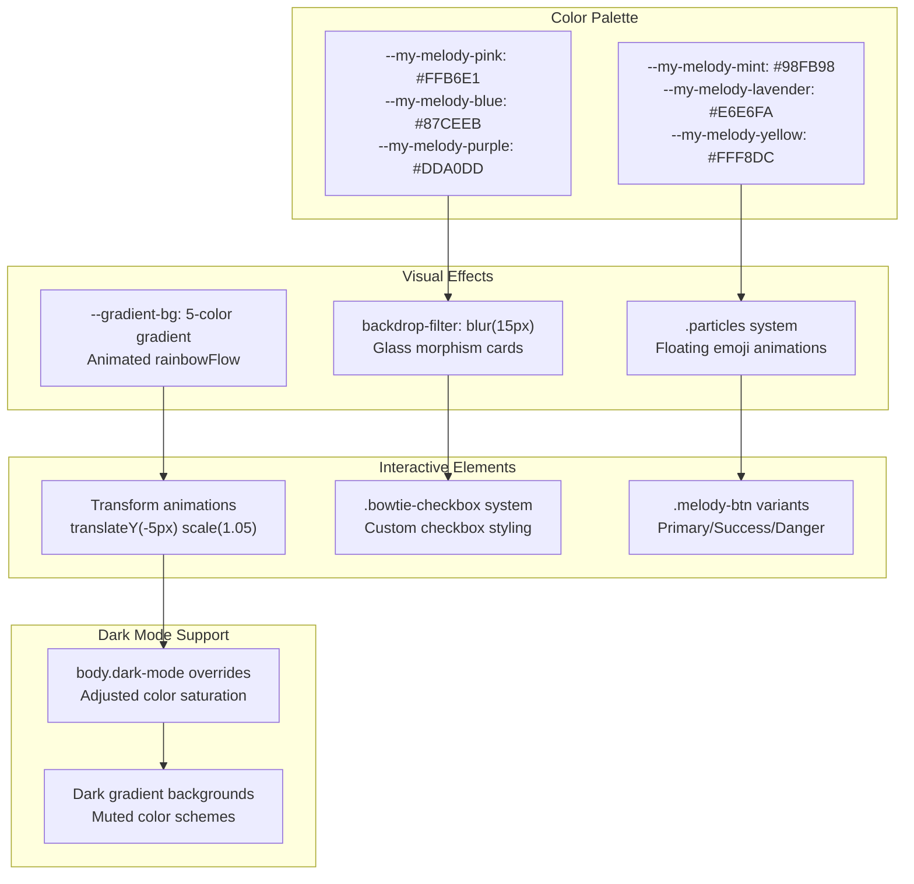
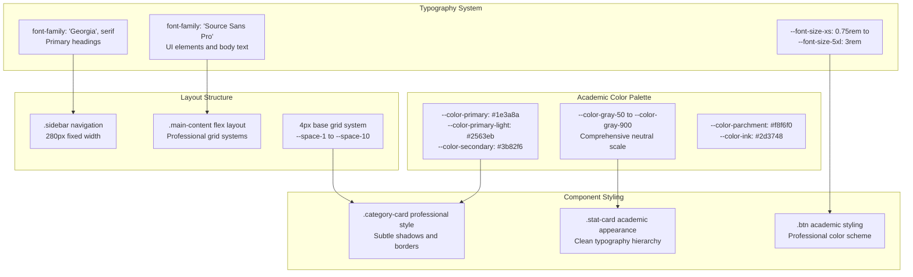
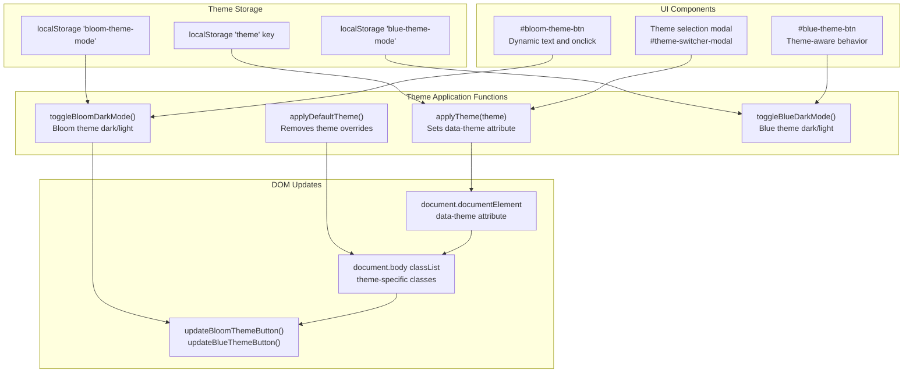
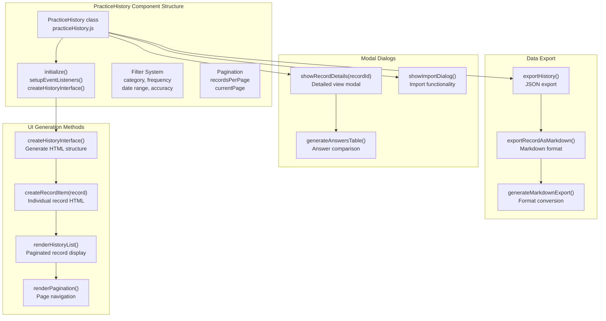
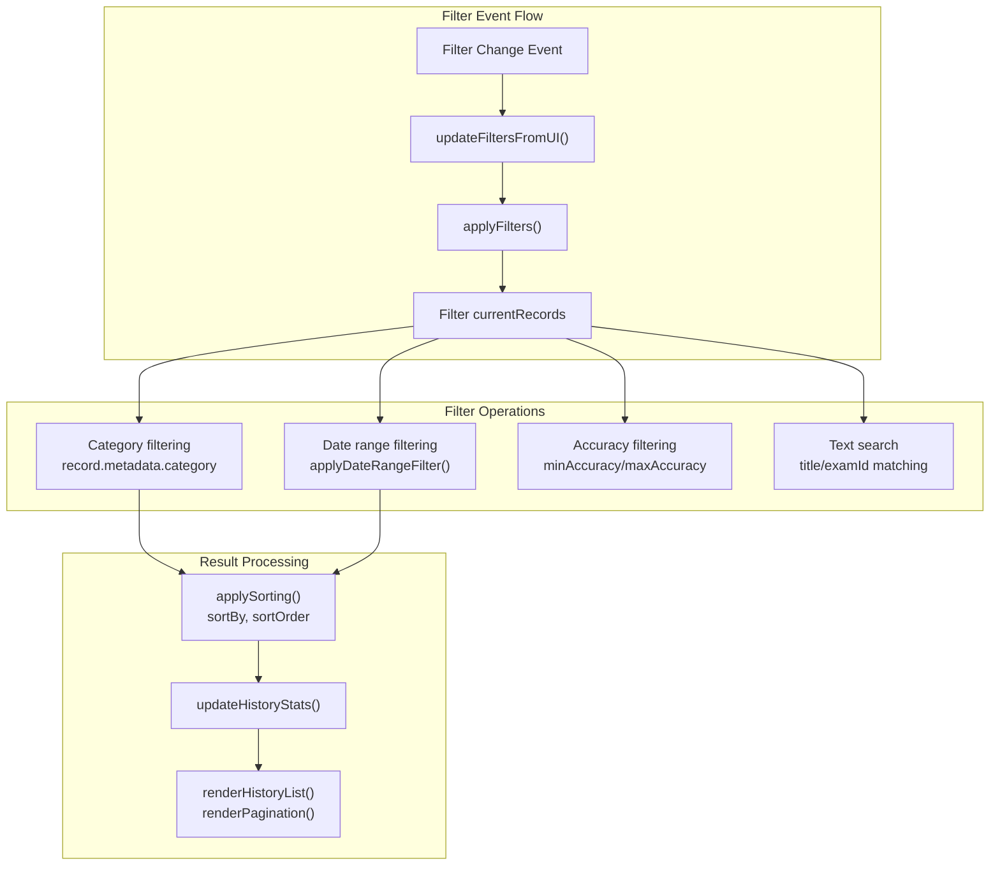
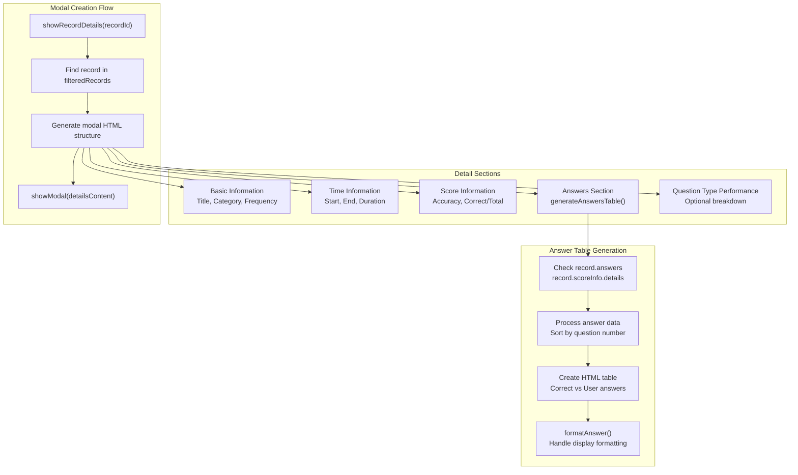
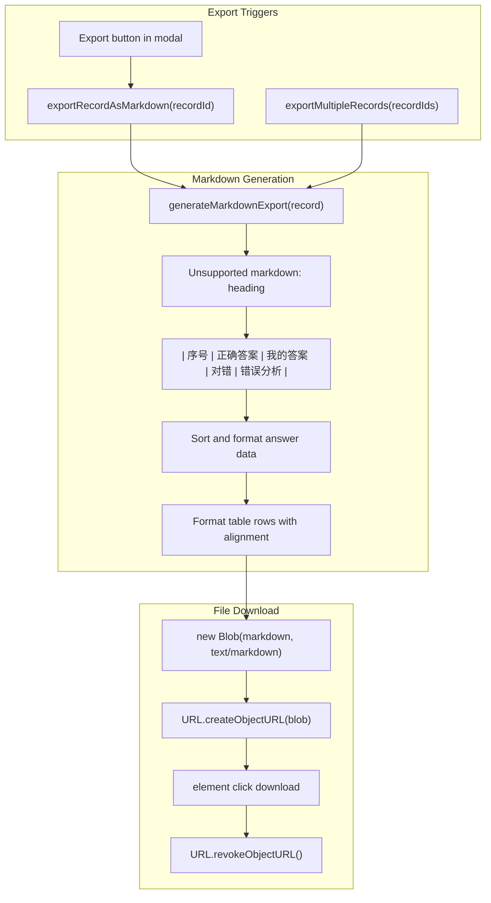

# Theme System & Visual Design

> **Relevant source files**
> * [.superdesign/design_iterations/HarryPoter.html](https://github.com/sallowayma-git/IELTS-practice/blob/df0c9b8f/.superdesign/design_iterations/HarryPoter.html)
> * [.superdesign/design_iterations/ielts_academic_functional_2.html](https://github.com/sallowayma-git/IELTS-practice/blob/df0c9b8f/.superdesign/design_iterations/ielts_academic_functional_2.html)
> * [.superdesign/design_iterations/my_melody_ielts_1.html](https://github.com/sallowayma-git/IELTS-practice/blob/df0c9b8f/.superdesign/design_iterations/my_melody_ielts_1.html)
> * [developer/docs/2025-10-12-hp-view-capture.md](https://github.com/sallowayma-git/IELTS-practice/blob/df0c9b8f/developer/docs/2025-10-12-hp-view-capture.md)
> * [js/components/practiceHistory.js](https://github.com/sallowayma-git/IELTS-practice/blob/df0c9b8f/js/components/practiceHistory.js)
> * [js/components/practiceRecordModal.js](https://github.com/sallowayma-git/IELTS-practice/blob/df0c9b8f/js/components/practiceRecordModal.js)
> * [js/components/settingsPanel.js](https://github.com/sallowayma-git/IELTS-practice/blob/df0c9b8f/js/components/settingsPanel.js)
> * [js/plugins/hp/hp-path.js](https://github.com/sallowayma-git/IELTS-practice/blob/df0c9b8f/js/plugins/hp/hp-path.js)
> * [js/theme-switcher.js](https://github.com/sallowayma-git/IELTS-practice/blob/df0c9b8f/js/theme-switcher.js)
> * [js/utils/themeManager.js](https://github.com/sallowayma-git/IELTS-practice/blob/df0c9b8f/js/utils/themeManager.js)

This document covers the theming architecture, design tokens, and multiple theme variations of the IELTS practice system. The theme system provides a flexible foundation for different visual experiences through CSS custom properties, theme switching logic, and specialized theme implementations including My Melody, Academic, and Harry Potter variations.

For information about the core application architecture, see page 3. For details about the Harry Potter theme's plugin system, see page 8.

## Design Token System Architecture

The theme system is built around a comprehensive design token system using CSS custom properties. The main framework in [css/main.css L1-L1300](https://github.com/sallowayma-git/IELTS-practice/blob/df0c9b8f/css/main.css#L1-L1300)

 establishes the foundational design tokens, while specialized themes extend and override these tokens for specific visual experiences.

**Theme System Architecture**

Sources: [css/main.css L8-L90](https://github.com/sallowayma-git/IELTS-practice/blob/df0c9b8f/css/main.css#L8-L90)

 [.superdesign/design_iterations/my_melody_ielts_1.html L22-L93](https://github.com/sallowayma-git/IELTS-practice/blob/df0c9b8f/.superdesign/design_iterations/my_melody_ielts_1.html#L22-L93)

 [.superdesign/design_iterations/ielts_academic_functional_2.html L15-L100](https://github.com/sallowayma-git/IELTS-practice/blob/df0c9b8f/.superdesign/design_iterations/ielts_academic_functional_2.html#L15-L100)

## CSS Custom Properties and Design Tokens

The system uses a layered approach to design tokens, with a core set defined in `css/main.css` and theme-specific overrides in specialized theme files.

### Core Design Token Categories

| Category | Variables | Purpose | Example Values |
| --- | --- | --- | --- |
| Color System | `--color-brand-primary`, `--color-brand-secondary` | Brand identity and interactive elements | `#667eea`, `#764ba2` |
| Semantic Colors | `--color-success`, `--color-warning`, `--color-error` | Status indication and feedback | `#10b981`, `#f59e0b`, `#ef4444` |
| Spacing System | `--space-xs` through `--space-2xl` | 4px-based consistent spacing | `0.25rem` to `3rem` |
| Typography Scale | `--font-size-xs` through `--font-size-5xl` | Modular text sizing | `0.75rem` to `3rem` |
| Border System | `--border-radius-sm` through `--border-radius-2xl` | Consistent corner rounding | `0.25rem` to `1rem` |
| Shadow System | `--shadow-sm` through `--shadow-xl` | Depth and elevation | Multiple box-shadow values |

### Theme Variable Override System

**Design Token Override Flow**

Sources: [css/main.css L9-L90](https://github.com/sallowayma-git/IELTS-practice/blob/df0c9b8f/css/main.css#L9-L90)

 [.superdesign/design_iterations/my_melody_ielts_1.html L24-L93](https://github.com/sallowayma-git/IELTS-practice/blob/df0c9b8f/.superdesign/design_iterations/my_melody_ielts_1.html#L24-L93)

 [.superdesign/design_iterations/ielts_academic_functional_2.html L16-L100](https://github.com/sallowayma-git/IELTS-practice/blob/df0c9b8f/.superdesign/design_iterations/ielts_academic_functional_2.html#L16-L100)

## Theme Variations and Implementation

The system includes three distinct theme implementations, each with unique design approaches and specialized features.

### My Melody Theme

The My Melody theme in [.superdesign/design_iterations/my_melody_ielts_1.html](https://github.com/sallowayma-git/IELTS-practice/blob/df0c9b8f/.superdesign/design_iterations/my_melody_ielts_1.html)

 features a kawaii-inspired design with animated elements and extensive use of pink/blue/purple color palettes.

**My Melody Theme Characteristics**

### Academic Theme

The Academic theme in [.superdesign/design_iterations/ielts_academic_functional_2.html](https://github.com/sallowayma-git/IELTS-practice/blob/df0c9b8f/.superdesign/design_iterations/ielts_academic_functional_2.html)

 provides a professional, scholarly appearance with serif typography and neutral color schemes.

**Academic Theme Design System**

Sources: [.superdesign/design_iterations/my_melody_ielts_1.html L24-L57](https://github.com/sallowayma-git/IELTS-practice/blob/df0c9b8f/.superdesign/design_iterations/my_melody_ielts_1.html#L24-L57)

 [.superdesign/design_iterations/my_melody_ielts_1.html L594-L932](https://github.com/sallowayma-git/IELTS-practice/blob/df0c9b8f/.superdesign/design_iterations/my_melody_ielts_1.html#L594-L932)

 [.superdesign/design_iterations/ielts_academic_functional_2.html L16-L100](https://github.com/sallowayma-git/IELTS-practice/blob/df0c9b8f/.superdesign/design_iterations/ielts_academic_functional_2.html#L16-L100)

 [.superdesign/design_iterations/ielts_academic_functional_2.html L108-L204](https://github.com/sallowayma-git/IELTS-practice/blob/df0c9b8f/.superdesign/design_iterations/ielts_academic_functional_2.html#L108-L204)

## Theme Switching System

The theme switching functionality is implemented in [js/theme-switcher.js](https://github.com/sallowayma-git/IELTS-practice/blob/df0c9b8f/js/theme-switcher.js)

 and provides dynamic theme changes with persistent storage.

### Theme Switching Architecture

**Theme Switching Flow**

### Theme Modal Implementation

The theme switching modal provides a centralized interface for theme selection with the following key functions:

| Function | Purpose | Implementation |
| --- | --- | --- |
| `showThemeSwitcherModal()` | Display theme selection interface | Adds `.show` class to modal |
| `hideThemeSwitcherModal()` | Close theme selection interface | Removes `.show` class |
| `applyTheme(theme)` | Apply specific theme | Sets `data-theme` attribute and updates storage |
| `applyDefaultTheme()` | Reset to default theme | Removes theme attributes and restores Bloom settings |

### Dark Mode Support

Each theme variation supports its own dark mode implementation:

* **Bloom Theme**: Uses `bloom-dark-mode` class with independent light/dark toggle
* **Blue Theme**: Uses `blue-dark-mode` class with theme-specific dark variations
* **Theme Storage**: Separate localStorage keys maintain dark mode preferences per theme

Sources: [js/theme-switcher.js L2-L37](https://github.com/sallowayma-git/IELTS-practice/blob/df0c9b8f/js/theme-switcher.js#L2-L37)

 [js/theme-switcher.js L54-L135](https://github.com/sallowayma-git/IELTS-practice/blob/df0c9b8f/js/theme-switcher.js#L54-L135)

 [js/theme-switcher.js L137-L182](https://github.com/sallowayma-git/IELTS-practice/blob/df0c9b8f/js/theme-switcher.js#L137-L182)

## Practice History Component UI

The `PracticeHistory` class provides a comprehensive interface for viewing and managing practice session records.

Sources: [js/components/practiceHistory.js L5-L33](https://github.com/sallowayma-git/IELTS-practice/blob/df0c9b8f/js/components/practiceHistory.js#L5-L33)

 [js/components/practiceHistory.js L99-L241](https://github.com/sallowayma-git/IELTS-practice/blob/df0c9b8f/js/components/practiceHistory.js#L99-L241)

### Filter and Search System

The component provides comprehensive filtering capabilities:

| Filter Type | Element ID | Options | Functionality |
| --- | --- | --- | --- |
| Category | `#category-filter` | all, P1, P2, P3 | Filter by exam category |
| Frequency | `#frequency-filter` | all, high, low | Filter by question frequency |
| Status | `#status-filter` | all, completed, interrupted | Filter by completion status |
| Date Range | `#date-range-filter` | all, today, week, month, custom | Time-based filtering |
| Accuracy | `#min-accuracy`, `#max-accuracy` | 0-100% sliders | Accuracy range filtering |
| Search | `#history-search` | Text input | Title/ID search with debounce |

The filter system uses event delegation and debounced input handling:

Sources: [js/components/practiceHistory.js L244-L302](https://github.com/sallowayma-git/IELTS-practice/blob/df0c9b8f/js/components/practiceHistory.js#L244-L302)

 [js/components/practiceHistory.js L355-L411](https://github.com/sallowayma-git/IELTS-practice/blob/df0c9b8f/js/components/practiceHistory.js#L355-L411)

### Record Details Modal System

The component creates detailed modal dialogs for individual practice records:

Sources: [js/components/practiceHistory.js L717-L832](https://github.com/sallowayma-git/IELTS-practice/blob/df0c9b8f/js/components/practiceHistory.js#L717-L832)

 [js/components/practiceHistory.js L836-L931](https://github.com/sallowayma-git/IELTS-practice/blob/df0c9b8f/js/components/practiceHistory.js#L836-L931)

### Markdown Export System

The component supports exporting practice records in Markdown format for external analysis:

Sources: [js/components/practiceHistory.js L1218-L1280](https://github.com/sallowayma-git/IELTS-practice/blob/df0c9b8f/js/components/practiceHistory.js#L1218-L1280)

 [js/components/practiceHistory.js L1285-L1314](https://github.com/sallowayma-git/IELTS-practice/blob/df0c9b8f/js/components/practiceHistory.js#L1285-L1314)

 [js/components/practiceHistory.js L1319-L1355](https://github.com/sallowayma-git/IELTS-practice/blob/df0c9b8f/js/components/practiceHistory.js#L1319-L1355)