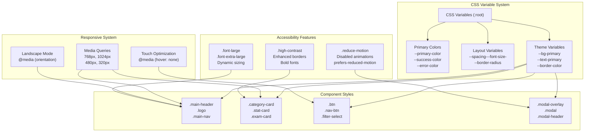
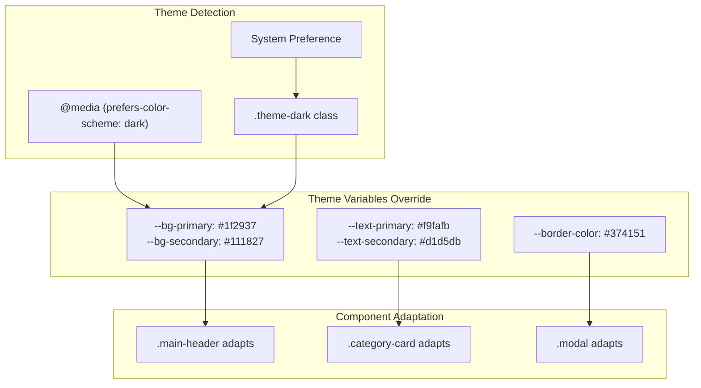
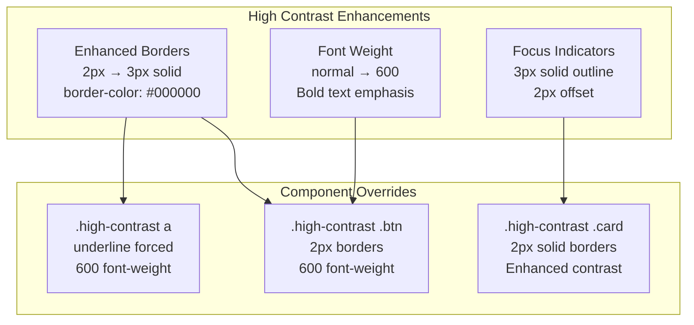
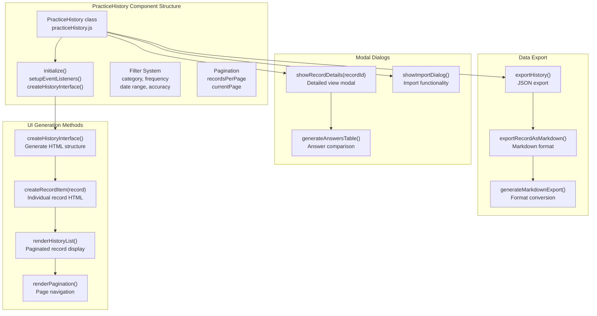
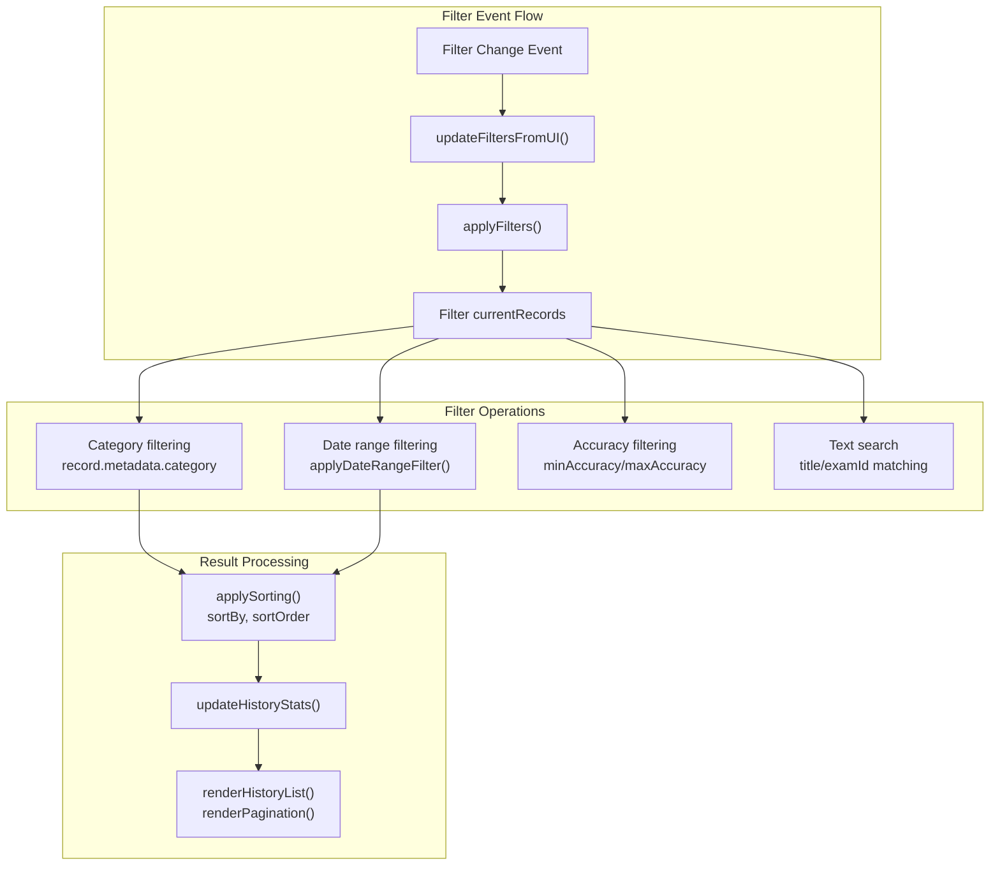
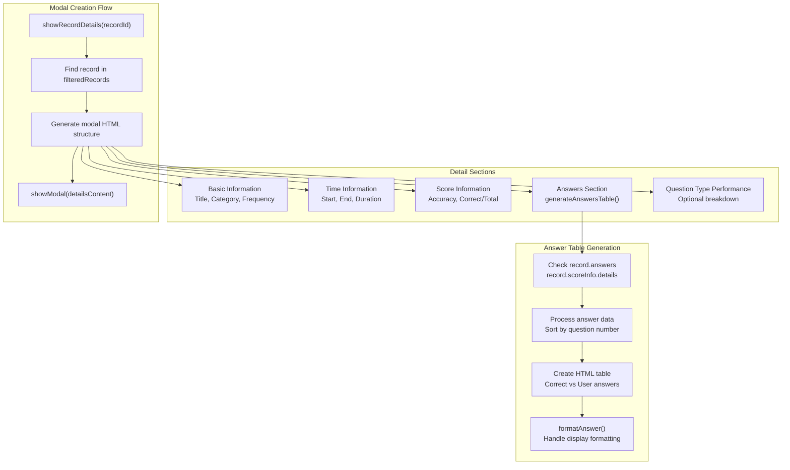
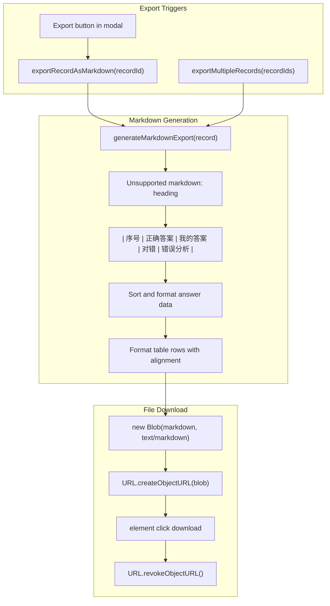

# User Interface & Styling

> **Relevant source files**
> * [css/styles.css](https://github.com/sallowayma-git/IELTS-practice/blob/db0f538c/css/styles.css)
> * [js/components/practiceHistory.js](https://github.com/sallowayma-git/IELTS-practice/blob/db0f538c/js/components/practiceHistory.js)

This document covers the presentation layer of the IELTS Reading Practice System, including the comprehensive CSS framework with theme support, responsive design, accessibility features, and the practice history analytics component. The styling system provides a cohesive visual experience across all views while maintaining accessibility and responsive design principles.

For information about the core application architecture and view management, see [Core Application](/sallowayma-git/IELTS-practice/2-core-application). For details about data persistence and storage mechanisms, see [Data Storage & Integrity](/sallowayma-git/IELTS-practice/2.3-data-storage-and-integrity).

## CSS Architecture Overview

The styling system is built around a comprehensive CSS framework located in [css/styles.css L1-L3136](https://github.com/sallowayma-git/IELTS-practice/blob/db0f538c/css/styles.css#L1-L3136)

 that provides consistent theming, responsive design, and accessibility features throughout the application.



Sources: [css/styles.css L1-L49](https://github.com/sallowayma-git/IELTS-practice/blob/db0f538c/css/styles.css#L1-L49)

 [css/styles.css L374-L637](https://github.com/sallowayma-git/IELTS-practice/blob/db0f538c/css/styles.css#L374-L637)

 [css/styles.css L647-L681](https://github.com/sallowayma-git/IELTS-practice/blob/db0f538c/css/styles.css#L647-L681)

## Theme System and Color Management

The application uses a sophisticated CSS custom properties system for consistent theming and easy customization.

| Category | Variables | Purpose |
| --- | --- | --- |
| Primary Colors | `--primary-color`, `--primary-hover`, `--primary-color-light` | Brand colors and interactive elements |
| Status Colors | `--success-color`, `--warning-color`, `--error-color` | Feedback and state indication |
| Background | `--bg-primary`, `--bg-secondary`, `--bg-tertiary` | Layer hierarchy and depth |
| Text | `--text-primary`, `--text-secondary`, `--text-tertiary` | Content hierarchy |
| Layout | `--spacing-xs` through `--spacing-2xl` | Consistent spacing system |
| Typography | `--font-size-xs` through `--font-size-3xl` | Text size scale |

The system supports automatic dark mode detection and manual theme switching:



Sources: [css/styles.css L2-L49](https://github.com/sallowayma-git/IELTS-practice/blob/db0f538c/css/styles.css#L2-L49)

 [css/styles.css L672-L681](https://github.com/sallowayma-git/IELTS-practice/blob/db0f538c/css/styles.css#L672-L681)

 [css/styles.css L765-L778](https://github.com/sallowayma-git/IELTS-practice/blob/db0f538c/css/styles.css#L765-L778)

## Responsive Design System

The application implements a mobile-first responsive design with multiple breakpoints and adaptive layouts.

### Breakpoint Strategy

| Breakpoint | Range | Target Devices | Key Adaptations |
| --- | --- | --- | --- |
| Desktop | > 1024px | Desktop screens | Full grid layouts, hover states |
| Tablet | 769px - 1024px | Tablets | 2-column grids, touch optimization |
| Mobile | 481px - 768px | Mobile landscape | Single column, larger touch targets |
| Small Mobile | 320px - 480px | Mobile portrait | Compressed spacing, stacked layouts |
| Ultra Small | < 320px | Very small screens | Minimal content, essential features only |

### Responsive Components

```

```

Sources: [css/styles.css L392-L636](https://github.com/sallowayma-git/IELTS-practice/blob/db0f538c/css/styles.css#L392-L636)

 [css/styles.css L376-L391](https://github.com/sallowayma-git/IELTS-practice/blob/db0f538c/css/styles.css#L376-L391)

 [css/styles.css L494-L596](https://github.com/sallowayma-git/IELTS-practice/blob/db0f538c/css/styles.css#L494-L596)

## Accessibility Features

The styling system includes comprehensive accessibility support through multiple mechanisms.

### High Contrast Mode

The `.high-contrast` class provides enhanced visual accessibility:



Sources: [css/styles.css L730-L763](https://github.com/sallowayma-git/IELTS-practice/blob/db0f538c/css/styles.css#L730-L763)

 [css/styles.css L660-L669](https://github.com/sallowayma-git/IELTS-practice/blob/db0f538c/css/styles.css#L660-L669)

### Motion and Animation Control

The system respects user preferences for reduced motion:

* `@media (prefers-reduced-motion: reduce)` automatically disables animations [css/styles.css L647-L658](https://github.com/sallowayma-git/IELTS-practice/blob/db0f538c/css/styles.css#L647-L658)
* `.reduce-motion` class provides manual override [css/styles.css L719-L728](https://github.com/sallowayma-git/IELTS-practice/blob/db0f538c/css/styles.css#L719-L728)
* All transitions and animations can be disabled [css/styles.css L1157-L1166](https://github.com/sallowayma-git/IELTS-practice/blob/db0f538c/css/styles.css#L1157-L1166)

### Font Scaling Support

Multiple font scaling options accommodate different vision needs:

| Class | Base Font Size | Scale Factor | Use Case |
| --- | --- | --- | --- |
| Default | 1rem | 1.0x | Standard viewing |
| `.font-large` | 1.125rem | 1.125x | Improved readability |
| `.font-extra-large` | 1.25rem | 1.25x | Accessibility compliance |

Sources: [css/styles.css L686-L717](https://github.com/sallowayma-git/IELTS-practice/blob/db0f538c/css/styles.css#L686-L717)

## Practice History Component UI

The `PracticeHistory` class provides a comprehensive interface for viewing and managing practice session records.



Sources: [js/components/practiceHistory.js L5-L33](https://github.com/sallowayma-git/IELTS-practice/blob/db0f538c/js/components/practiceHistory.js#L5-L33)

 [js/components/practiceHistory.js L99-L241](https://github.com/sallowayma-git/IELTS-practice/blob/db0f538c/js/components/practiceHistory.js#L99-L241)

### Filter and Search System

The component provides comprehensive filtering capabilities:

| Filter Type | Element ID | Options | Functionality |
| --- | --- | --- | --- |
| Category | `#category-filter` | all, P1, P2, P3 | Filter by exam category |
| Frequency | `#frequency-filter` | all, high, low | Filter by question frequency |
| Status | `#status-filter` | all, completed, interrupted | Filter by completion status |
| Date Range | `#date-range-filter` | all, today, week, month, custom | Time-based filtering |
| Accuracy | `#min-accuracy`, `#max-accuracy` | 0-100% sliders | Accuracy range filtering |
| Search | `#history-search` | Text input | Title/ID search with debounce |

The filter system uses event delegation and debounced input handling:



Sources: [js/components/practiceHistory.js L244-L302](https://github.com/sallowayma-git/IELTS-practice/blob/db0f538c/js/components/practiceHistory.js#L244-L302)

 [js/components/practiceHistory.js L355-L411](https://github.com/sallowayma-git/IELTS-practice/blob/db0f538c/js/components/practiceHistory.js#L355-L411)

### Record Details Modal System

The component creates detailed modal dialogs for individual practice records:



Sources: [js/components/practiceHistory.js L717-L832](https://github.com/sallowayma-git/IELTS-practice/blob/db0f538c/js/components/practiceHistory.js#L717-L832)

 [js/components/practiceHistory.js L836-L931](https://github.com/sallowayma-git/IELTS-practice/blob/db0f538c/js/components/practiceHistory.js#L836-L931)

### Library Loader Modal Refresh (2025-10-12)

- `showLibraryLoaderModal` has been rebuilt on top of the shared DOM builder and event delegation utilities. Buttons, file inputs, and teardown logic are now data-attribute driven, removing the legacy `innerHTML` template and eight direct `addEventListener` bindings while keeping legacy fallbacks for environments without the helper library.【F:js/main.js†L1369-L1569】
- Dedicated styling rules in `css/main.css` provide the gradient header, two-column card layout, and responsive behavior for the loader modal, replacing 40+ inline declarations and aligning the component with the global theming system.【F:css/main.css†L1559-L1772】

### Overview, Browse & Backup UI Modernization (2025-10-13)

- The dashboard fallback renderer now uses `window.DOM.create` to build category cards, exposing `data-overview-action` hooks that reuse the central delegation pipeline and eliminate inline `onclick` strings.【F:js/main.js†L493-L688】
- Browse list empty states are standardized with semantic markup and shared helpers so the experience matches design tokens even when filters yield zero results.【F:js/main.js†L1002-L1095】【F:css/main.css†L480-L548】
- Settings backups render through DOM Builder with delegated restore/close actions, avoiding global callbacks and providing a consistent modal fallback for environments without the settings view container.【F:js/main.js†L2488-L2626】【F:css/main.css†L1099-L1174】

### Markdown Export System

The component supports exporting practice records in Markdown format for external analysis:



Sources: [js/components/practiceHistory.js L1218-L1280](https://github.com/sallowayma-git/IELTS-practice/blob/db0f538c/js/components/practiceHistory.js#L1218-L1280)

 [js/components/practiceHistory.js L1285-L1314](https://github.com/sallowayma-git/IELTS-practice/blob/db0f538c/js/components/practiceHistory.js#L1285-L1314)

 [js/components/practiceHistory.js L1319-L1355](https://github.com/sallowayma-git/IELTS-practice/blob/db0f538c/js/components/practiceHistory.js#L1319-L1355)