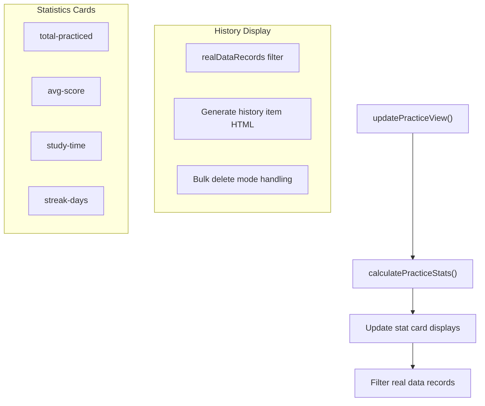

# View Management System

> **Relevant source files**
> * [improved-working-system.html](https://github.com/sallowayma-git/IELTS-practice/blob/db0f538c/improved-working-system.html)

This document covers the view management system in the IELTS Reading Practice application, which orchestrates navigation between different functional areas and manages the display of content within the main application interface. The system handles view switching, state persistence, and content loading for the four primary views: overview, browse, practice records, and settings.

For information about the broader application architecture, see [System Architecture](/sallowayma-git/IELTS-practice/2.1-system-architecture). For details about data storage mechanisms, see [Data Storage & Integrity](/sallowayma-git/IELTS-practice/2.3-data-storage-and-integrity).

## System Purpose and Architecture

The view management system provides a single-page application experience by dynamically showing and hiding content sections while maintaining navigation state and handling view-specific initialization logic.

### View Structure Overview


**Sources:** [improved-working-system.html L565-L570](https://github.com/sallowayma-git/IELTS-practice/blob/db0f538c/improved-working-system.html#L565-L570)

 [improved-working-system.html L1118-L1146](https://github.com/sallowayma-git/IELTS-practice/blob/db0f538c/improved-working-system.html#L1118-L1146)

### View Definition and Registration

The system defines four primary views, each with dedicated HTML containers and associated functionality:

| View ID | Navigation Label | Primary Function | Container Element |
| --- | --- | --- | --- |
| `overview` | 📊 总览 | System dashboard and category overview | `overview-view` |
| `browse` | 📚 题库浏览 | Exam browsing and search | `browse-view` |
| `practice` | 📝 练习记录 | Practice history and statistics | `practice-view` |
| `settings` | ⚙️ 设置 | System configuration and data management | `settings-view` |

**Sources:** [improved-working-system.html L565-L570](https://github.com/sallowayma-git/IELTS-practice/blob/db0f538c/improved-working-system.html#L565-L570)

 [improved-working-system.html L572-L683](https://github.com/sallowayma-git/IELTS-practice/blob/db0f538c/improved-working-system.html#L572-L683)

## Navigation and View Switching

### Core Navigation Function

The `showView()` function serves as the central coordinator for view transitions:


**Sources:** [improved-working-system.html L1118-L1146](https://github.com/sallowayma-git/IELTS-practice/blob/db0f538c/improved-working-system.html#L1118-L1146)

### Navigation Button Management

The navigation system maintains visual state through CSS class manipulation:

```

```

**Sources:** [improved-working-system.html L1125-L1134](https://github.com/sallowayma-git/IELTS-practice/blob/db0f538c/improved-working-system.html#L1125-L1134)

 [improved-working-system.html L565-L570](https://github.com/sallowayma-git/IELTS-practice/blob/db0f538c/improved-working-system.html#L565-L570)

## View-Specific Content Management

### Overview View Content Loading

The overview view displays categorized statistics and quick access buttons:


**Sources:** [improved-working-system.html L2756-L2819](https://github.com/sallowayma-git/IELTS-practice/blob/db0f538c/improved-working-system.html#L2756-L2819)

### Browse View State Management

The browse view integrates with category filtering and search functionality:


**Sources:** [improved-working-system.html L1136-L1142](https://github.com/sallowayma-git/IELTS-practice/blob/db0f538c/improved-working-system.html#L1136-L1142)

 [improved-working-system.html L2468-L2472](https://github.com/sallowayma-git/IELTS-practice/blob/db0f538c/improved-working-system.html#L2468-L2472)

 [improved-working-system.html L2475-L2510](https://github.com/sallowayma-git/IELTS-practice/blob/db0f538c/improved-working-system.html#L2475-L2510)

### Practice View Data Integration

The practice view coordinates with the practice recording system:



**Sources:** [improved-working-system.html L2391-L2487](https://github.com/sallowayma-git/IELTS-practice/blob/db0f538c/improved-working-system.html#L2391-L2487)

 [improved-working-system.html L2306-L2389](https://github.com/sallowayma-git/IELTS-practice/blob/db0f538c/improved-working-system.html#L2306-L2389)

## Integration with External Systems

### Communication with Practice Pages

The view management system coordinates with practice session communication:

```mermaid
sequenceDiagram
  participant View Manager
  participant Practice Page
  participant Practice Recorder

  View Manager->>Practice Page: openExam() launches practice window
  Practice Page->>View Manager: SESSION_READY message
  View Manager->>View Manager: showMessage('练习页面已连接')
  Practice Page->>View Manager: PRACTICE_COMPLETE with data
  View Manager->>Practice Recorder: handlePracticeDataReceived()
  Practice Recorder->>View Manager: Update practice view if active
```



**Sources:** [improved-working-system.html L2838-L2868](https://github.com/sallowayma-git/IELTS-practice/blob/db0f538c/improved-working-system.html#L2838-L2868)

 [improved-working-system.html L2928-L3169](https://github.com/sallowayma-git/IELTS-practice/blob/db0f538c/improved-working-system.html#L2928-L3169)

### State Persistence Integration

The view management system integrates with browser state management:

```

```

**Sources:** [improved-working-system.html L1053-L1058](https://github.com/sallowayma-git/IELTS-practice/blob/db0f538c/improved-working-system.html#L1053-L1058)

 [improved-working-system.html L3203-L3209](https://github.com/sallowayma-git/IELTS-practice/blob/db0f538c/improved-working-system.html#L3203-L3209)

## Error Handling and Fallback Mechanisms

The view management system includes error handling for failed view transitions and missing content:


**Sources:** [improved-working-system.html L712-L765](https://github.com/sallowayma-git/IELTS-practice/blob/db0f538c/improved-working-system.html#L712-L765)

 [improved-working-system.html L1118-L1146](https://github.com/sallowayma-git/IELTS-practice/blob/db0f538c/improved-working-system.html#L1118-L1146)