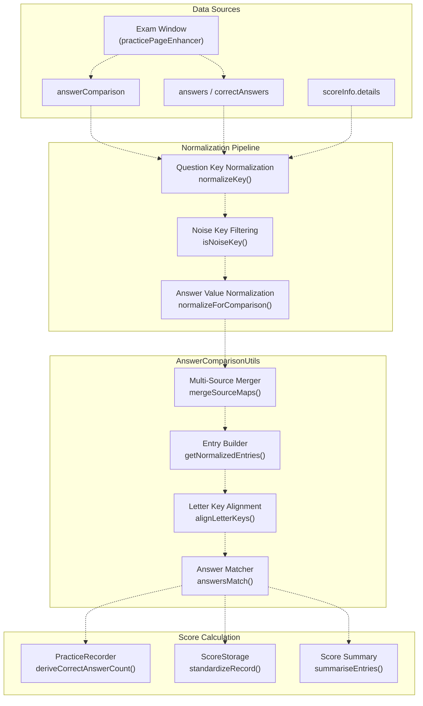
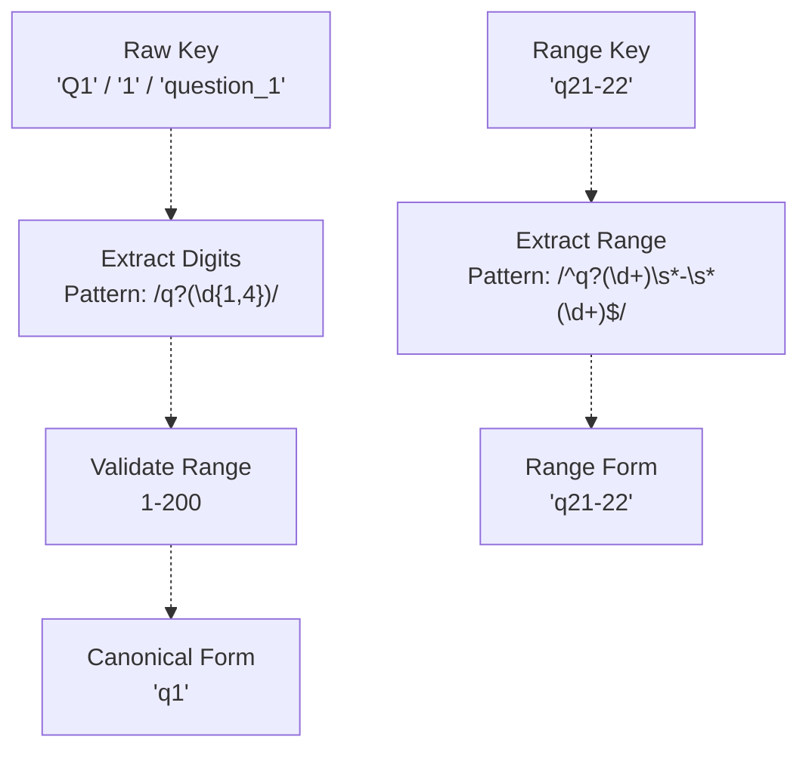
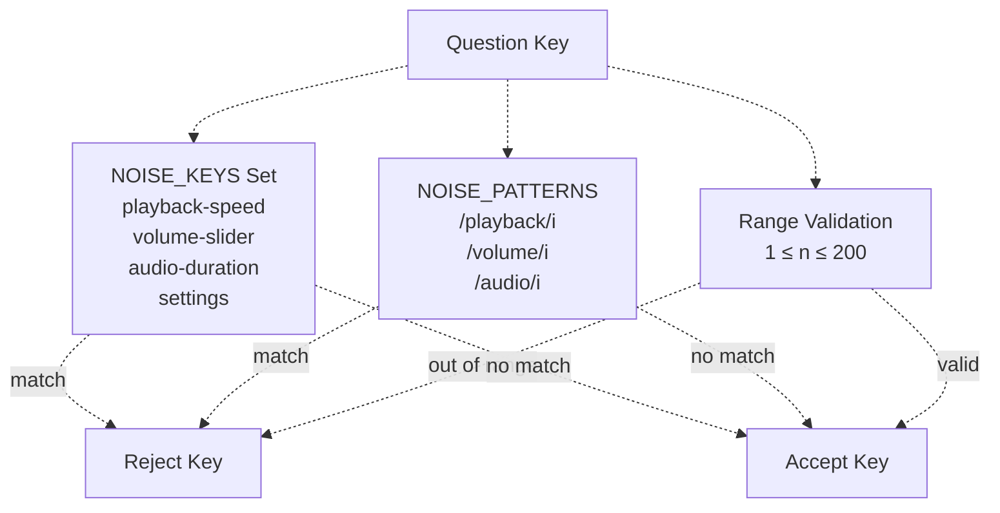
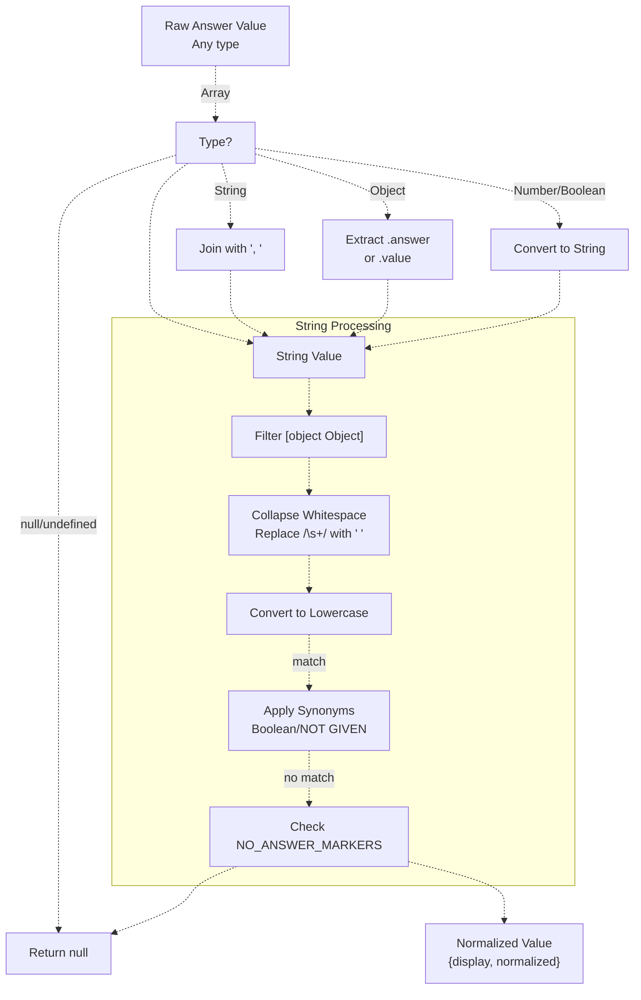
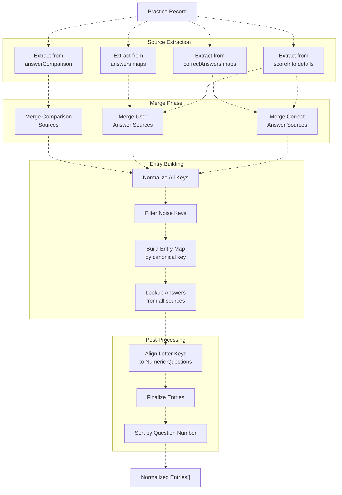
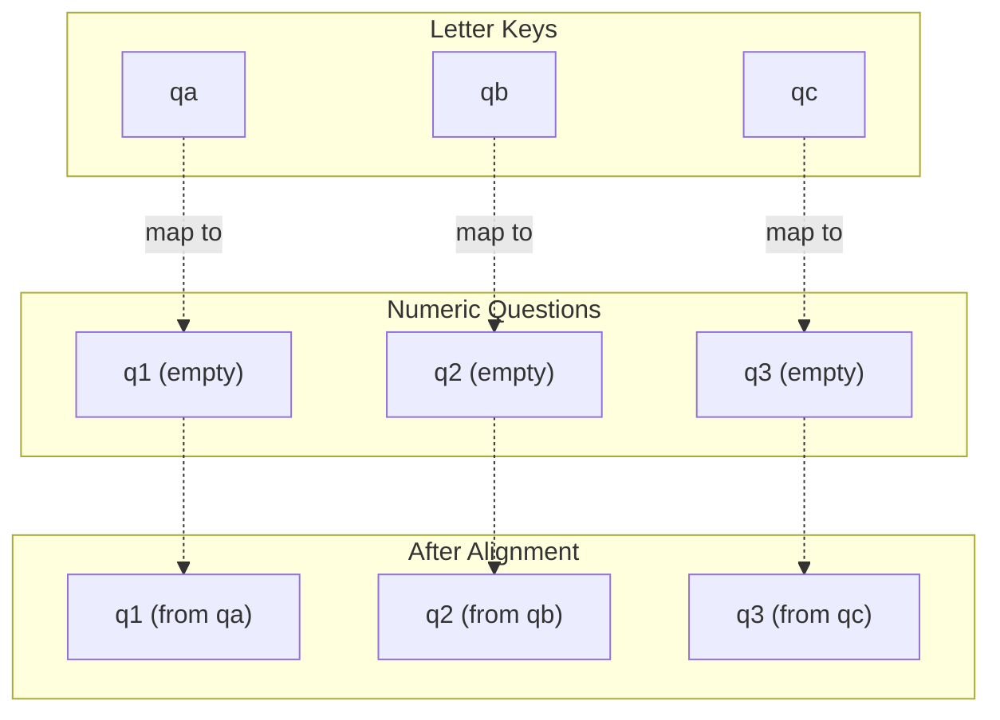
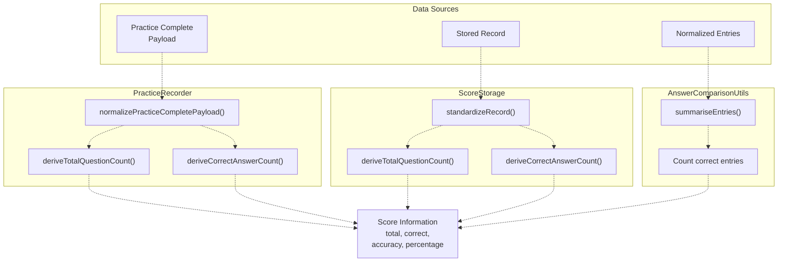
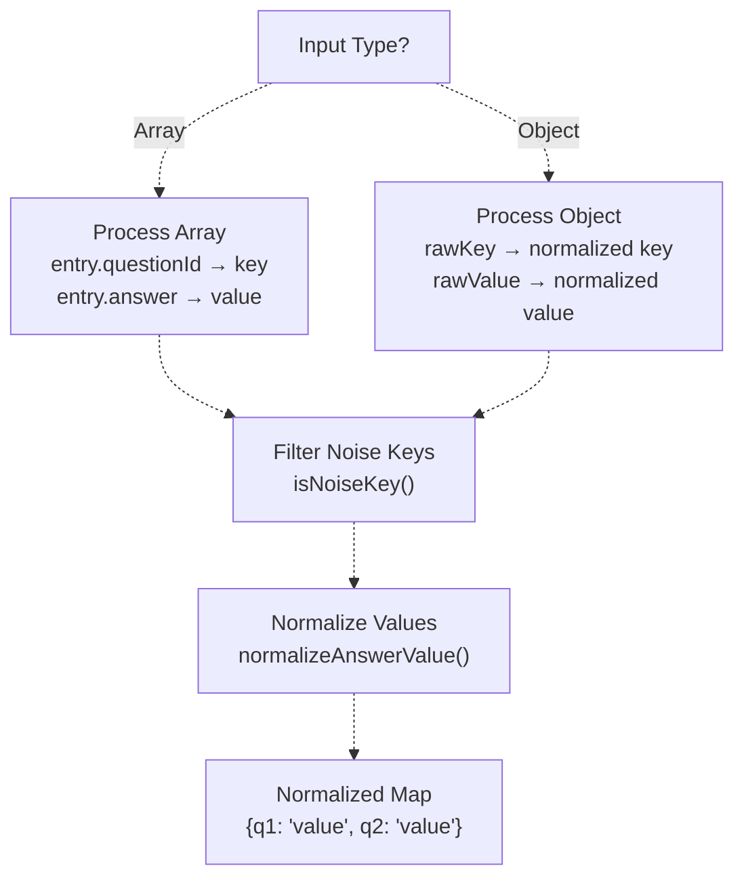
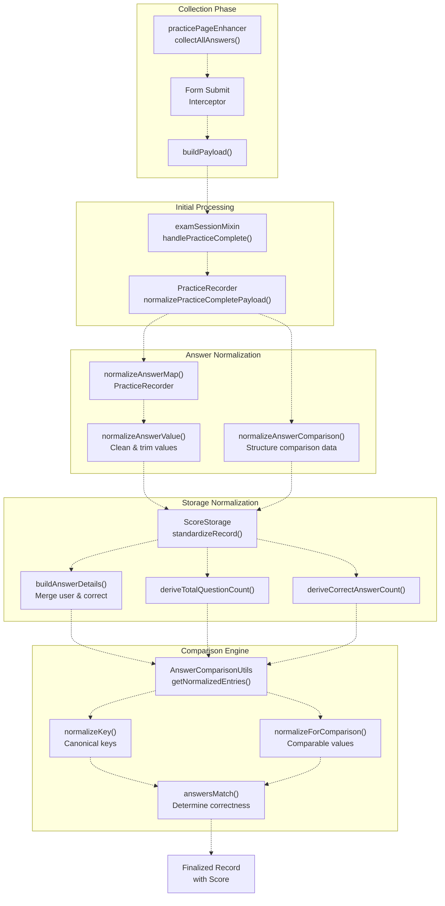

# Answer Normalization & Score Calculation

> **Relevant source files**
> * [js/app/examSessionMixin.js](https://github.com/sallowayma-git/IELTS-practice/blob/92f64eb8/js/app/examSessionMixin.js)
> * [js/app/suitePracticeMixin.js](https://github.com/sallowayma-git/IELTS-practice/blob/92f64eb8/js/app/suitePracticeMixin.js)
> * [js/core/practiceRecorder.js](https://github.com/sallowayma-git/IELTS-practice/blob/92f64eb8/js/core/practiceRecorder.js)
> * [js/core/scoreStorage.js](https://github.com/sallowayma-git/IELTS-practice/blob/92f64eb8/js/core/scoreStorage.js)
> * [js/practice-page-enhancer.js](https://github.com/sallowayma-git/IELTS-practice/blob/92f64eb8/js/practice-page-enhancer.js)
> * [js/services/GlobalStateService.js](https://github.com/sallowayma-git/IELTS-practice/blob/92f64eb8/js/services/GlobalStateService.js)
> * [js/utils/answerComparisonUtils.js](https://github.com/sallowayma-git/IELTS-practice/blob/92f64eb8/js/utils/answerComparisonUtils.js)
> * [js/utils/dataBackupManager.js](https://github.com/sallowayma-git/IELTS-practice/blob/92f64eb8/js/utils/dataBackupManager.js)
> * [js/utils/storage.js](https://github.com/sallowayma-git/IELTS-practice/blob/92f64eb8/js/utils/storage.js)

This document explains the answer normalization pipeline and score calculation mechanisms in the IELTS practice system. It covers how user answers and correct answers are collected from various sources, normalized for consistent comparison, and used to calculate scores.

For information about the complete practice session lifecycle, see [5.1 Practice Session Lifecycle & Management](/sallowayma-git/IELTS-practice/5.1-practice-session-lifecycle-and-management). For details on data collection from exam windows, see [5.2 Practice Page Enhancement & Data Collection](/sallowayma-git/IELTS-practice/5.2-practice-page-enhancement-and-data-collection).

## Purpose and Scope

The answer normalization and score calculation subsystem is responsible for:

* **Normalizing question keys** from various formats (e.g., "Q1", "q1", "1", "question_1") to a canonical form
* **Normalizing answer values** to handle whitespace, case sensitivity, boolean synonyms, and special formats
* **Comparing answers** with correct answers using normalized forms
* **Calculating scores** from multiple data sources with fallback strategies
* **Handling edge cases** such as unanswered questions, invalid keys, and noise data

This system ensures consistent scoring regardless of how answers are collected or stored across different exam formats and data sources.

## Architecture Overview

The answer normalization system is organized around a central comparison utility with multiple normalization stages:



**Sources:** [js/utils/answerComparisonUtils.js L1-L700](https://github.com/sallowayma-git/IELTS-practice/blob/92f64eb8/js/utils/answerComparisonUtils.js#L1-L700)

 [js/core/practiceRecorder.js L1-L800](https://github.com/sallowayma-git/IELTS-practice/blob/92f64eb8/js/core/practiceRecorder.js#L1-L800)

 [js/core/scoreStorage.js L1-L900](https://github.com/sallowayma-git/IELTS-practice/blob/92f64eb8/js/core/scoreStorage.js#L1-L900)

## Question Key Normalization

Question keys arrive in various formats from different data sources. The `normalizeKey()` function in `AnswerComparisonUtils` converts all variants to a canonical form.

### Normalization Rules

| Input Format | Canonical Form | Question Number |
| --- | --- | --- |
| `"Q1"`, `"q1"`, `"1"` | `"q1"` | `1` |
| `"question_1"` | `"q1"` | `1` |
| `"t2_q16"` (resource pages) | `"q16"` | `16` |
| `"q21-22"`, `"21-22"` (ranges) | `"q21-22"` | `21` |
| `"qa"`, `"qb"` (letter keys) | `"qa"`, `"qb"` | `null` |

The normalization process extracts question numbers and converts to lowercase with a "q" prefix:



**Key Implementation:**

The `normalizeKey()` function [js/utils/answerComparisonUtils.js L69-L127](https://github.com/sallowayma-git/IELTS-practice/blob/92f64eb8/js/utils/answerComparisonUtils.js#L69-L127)

 handles multiple key formats:

* **Digit extraction:** Uses regex pattern `/(?:^|[^a-z0-9])q(\d{1,4})/gi` to find question numbers
* **Range detection:** Matches patterns like `q21-22` for multi-part questions
* **Letter keys:** Preserves keys like `qa`, `qb` for later alignment
* **Validation:** Filters keys with question numbers outside 1-200 range

**Sources:** [js/utils/answerComparisonUtils.js L69-L127](https://github.com/sallowayma-git/IELTS-practice/blob/92f64eb8/js/utils/answerComparisonUtils.js#L69-L127)

 [js/practice-page-enhancer.js L456-L497](https://github.com/sallowayma-git/IELTS-practice/blob/92f64eb8/js/practice-page-enhancer.js#L456-L497)

## Noise Key Filtering

Before processing, the system filters out noise keys that don't represent actual questions:



The `isNoiseKey()` function [js/utils/answerComparisonUtils.js L129-L151](https://github.com/sallowayma-git/IELTS-practice/blob/92f64eb8/js/utils/answerComparisonUtils.js#L129-L151)

 checks:

* **Noise keyword set:** Keys like `playback-speed`, `volume-slider`, `audio-duration`
* **Noise patterns:** Regex patterns matching `/playback/i`, `/volume/i`, `/slider/i`
* **Question number range:** Rejects numbers < 1 or > 200

This same filtering logic is replicated in `PracticeRecorder.isNoiseKey()` [js/core/practiceRecorder.js L561-L603](https://github.com/sallowayma-git/IELTS-practice/blob/92f64eb8/js/core/practiceRecorder.js#L561-L603)

 for consistency across the system.

**Sources:** [js/utils/answerComparisonUtils.js L5-L151](https://github.com/sallowayma-git/IELTS-practice/blob/92f64eb8/js/utils/answerComparisonUtils.js#L5-L151)

 [js/core/practiceRecorder.js L561-L603](https://github.com/sallowayma-git/IELTS-practice/blob/92f64eb8/js/core/practiceRecorder.js#L561-L603)

## Answer Value Normalization

Answer values undergo normalization to enable consistent comparison regardless of formatting differences.

### Normalization Pipeline



The `normalizeForComparison()` function [js/utils/answerComparisonUtils.js L153-L206](https://github.com/sallowayma-git/IELTS-practice/blob/92f64eb8/js/utils/answerComparisonUtils.js#L153-L206)

 returns an object with two forms:

* **`display`:** The original text with collapsed whitespace (for UI display)
* **`normalized`:** Lowercase version with synonym mapping (for comparison)

### Special Value Handling

The system recognizes and normalizes special answer values:

**Boolean Synonyms:**

* `true`, `t`, `yes`, `y`, `1` → `"true"`
* `false`, `f`, `no`, `n`, `0` → `"false"`

**NOT GIVEN Synonyms:**

* `ng`, `notgiven`, `not-given` → `"not given"`

**No Answer Markers:**

* `no answer`, `未作答`, `none`, `n/a`, `null`, `undefined`, `no-answer` → `null`

These mappings are defined in [js/utils/answerComparisonUtils.js L44-L60](https://github.com/sallowayma-git/IELTS-practice/blob/92f64eb8/js/utils/answerComparisonUtils.js#L44-L60)

**Sources:** [js/utils/answerComparisonUtils.js L153-L206](https://github.com/sallowayma-git/IELTS-practice/blob/92f64eb8/js/utils/answerComparisonUtils.js#L153-L206)

 [js/core/practiceRecorder.js L483-L532](https://github.com/sallowayma-git/IELTS-practice/blob/92f64eb8/js/core/practiceRecorder.js#L483-L532)

## Answer Comparison Engine

The `AnswerComparisonUtils` module provides the central comparison engine used throughout the system.

### Entry Construction Process

The `getNormalizedEntries()` function [js/utils/answerComparisonUtils.js L377-L524](https://github.com/sallowayma-git/IELTS-practice/blob/92f64eb8/js/utils/answerComparisonUtils.js#L377-L524)

 builds a unified view of all questions and answers from multiple data sources:



**Sources:** [js/utils/answerComparisonUtils.js L377-L524](https://github.com/sallowayma-git/IELTS-practice/blob/92f64eb8/js/utils/answerComparisonUtils.js#L377-L524)

### Multi-Source Merging Strategy

The system merges answers from multiple sources with the following priority:

1. **`answerComparison`** - Most reliable, contains both user and correct answers
2. **Direct answer maps** - `answers` and `correctAnswers` properties
3. **`scoreInfo.details`** - Detailed comparison results
4. **`realData` nested sources** - Backup data with same structure

The `mergeSourceMaps()` function [js/utils/answerComparisonUtils.js L228-L248](https://github.com/sallowayma-git/IELTS-practice/blob/92f64eb8/js/utils/answerComparisonUtils.js#L228-L248)

 combines these sources:

```javascript
// Pseudocode representation of merge logic
const mergedMap = {};
sources.forEach(source => {
    Object.keys(source).forEach(key => {
        if (!mergedMap[key]) {
            mergedMap[key] = source[key];  // First non-null value wins
        }
    });
});
```

**Sources:** [js/utils/answerComparisonUtils.js L228-L248](https://github.com/sallowayma-git/IELTS-practice/blob/92f64eb8/js/utils/answerComparisonUtils.js#L228-L248)

 [js/core/practiceRecorder.js L605-L623](https://github.com/sallowayma-git/IELTS-practice/blob/92f64eb8/js/core/practiceRecorder.js#L605-L623)

### Letter Key Alignment

Some exam formats use letter keys (`qa`, `qb`, `qc`) instead of numeric keys. The `alignLetterKeys()` function [js/utils/answerComparisonUtils.js L293-L351](https://github.com/sallowayma-git/IELTS-practice/blob/92f64eb8/js/utils/answerComparisonUtils.js#L293-L351)

 maps these to corresponding numeric questions:



The alignment algorithm:

1. Identifies all letter keys (e.g., `qa`, `qb`)
2. Finds a contiguous sequence of numeric questions equal in length
3. Maps letter keys to numeric keys in sorted order
4. Removes letter keys after transfer

**Sources:** [js/utils/answerComparisonUtils.js L293-L351](https://github.com/sallowayma-git/IELTS-practice/blob/92f64eb8/js/utils/answerComparisonUtils.js#L293-L351)

### Answer Matching Logic

The `answersMatch()` function [js/utils/answerComparisonUtils.js L208-L226](https://github.com/sallowayma-git/IELTS-practice/blob/92f64eb8/js/utils/answerComparisonUtils.js#L208-L226)

 compares normalized answers:

| User Answer | Correct Answer | Match Result |
| --- | --- | --- |
| `null` | `null` | `null` (both unanswered) |
| `null` | `"answer"` | `false` (unanswered) |
| `"answer"` | `null` | `false` (no correct answer known) |
| `"answer"` | `"answer"` | `true` (normalized match) |
| `"Answer"` | `"answer"` | `true` (case-insensitive) |
| `"answer "` | `"answer"` | `true` (whitespace normalized) |
| `"wrong"` | `"answer"` | `false` (mismatch) |

The function compares the `normalized` property of answer info objects, which contains the lowercase, whitespace-collapsed form.

**Sources:** [js/utils/answerComparisonUtils.js L208-L226](https://github.com/sallowayma-git/IELTS-practice/blob/92f64eb8/js/utils/answerComparisonUtils.js#L208-L226)

## Score Calculation

Score calculation occurs in multiple locations with different fallback strategies.

### Score Calculation Data Flow



**Sources:** [js/core/practiceRecorder.js L1-L800](https://github.com/sallowayma-git/IELTS-practice/blob/92f64eb8/js/core/practiceRecorder.js#L1-L800)

 [js/core/scoreStorage.js L1-L900](https://github.com/sallowayma-git/IELTS-practice/blob/92f64eb8/js/core/scoreStorage.js#L1-L900)

 [js/utils/answerComparisonUtils.js L526-L561](https://github.com/sallowayma-git/IELTS-practice/blob/92f64eb8/js/utils/answerComparisonUtils.js#L526-L561)

### Total Question Count Derivation

The `deriveTotalQuestionCount()` function [js/core/scoreStorage.js L135-L169](https://github.com/sallowayma-git/IELTS-practice/blob/92f64eb8/js/core/scoreStorage.js#L135-L169)

 uses a waterfall strategy:

1. **Explicit count fields:** * `recordData.totalQuestions` * `recordData.questionCount` * `recordData.scoreInfo.total` * `recordData.scoreInfo.totalQuestions` * `recordData.realData.scoreInfo.totalQuestions`
2. **Array length:** * `recordData.answers.length` * `recordData.answerList.length`
3. **Object key count:** * `Object.keys(recordData.answerDetails).length` * `Object.keys(recordData.scoreInfo.details).length`

The first valid numeric value is used. This cascading approach ensures scores can be calculated even with partial data.

**Sources:** [js/core/scoreStorage.js L135-L169](https://github.com/sallowayma-git/IELTS-practice/blob/92f64eb8/js/core/scoreStorage.js#L135-L169)

 [js/core/practiceRecorder.js L1-L800](https://github.com/sallowayma-git/IELTS-practice/blob/92f64eb8/js/core/practiceRecorder.js#L1-L800)

### Correct Answer Count Derivation

The `deriveCorrectAnswerCount()` function [js/core/scoreStorage.js L171-L253](https://github.com/sallowayma-git/IELTS-practice/blob/92f64eb8/js/core/scoreStorage.js#L171-L253)

 follows a similar waterfall:

1. **Numeric score fields:** * `recordData.correctAnswers` * `recordData.correct` * `recordData.score` * `recordData.scoreInfo.correct` * `recordData.realData.scoreInfo.correct`
2. **Boolean flag counting:** * Count `true` values in `recordData.correctAnswers` object * Count `isCorrect: true` entries in details
3. **Answer array counting:** * Count answers with `correct: true` or `isCorrect: true`
4. **Answer details counting:** * Count entries with `isCorrect: true` in `answerDetails` * Count entries with `correct: true` in `scoreInfo.details`

**Sources:** [js/core/scoreStorage.js L171-L253](https://github.com/sallowayma-git/IELTS-practice/blob/92f64eb8/js/core/scoreStorage.js#L171-L253)

 [js/core/practiceRecorder.js L1-L800](https://github.com/sallowayma-git/IELTS-practice/blob/92f64eb8/js/core/practiceRecorder.js#L1-L800)

### Entry Summary Calculation

The `summariseEntries()` function [js/utils/answerComparisonUtils.js L526-L561](https://github.com/sallowayma-git/IELTS-practice/blob/92f64eb8/js/utils/answerComparisonUtils.js#L526-L561)

 provides a different calculation method by analyzing normalized entries:

```javascript
// Pseudocode representation
function summariseEntries(entries) {
    let correct = 0, incorrect = 0, unanswered = 0;
    
    entries.forEach(entry => {
        if (!entry.hasUserAnswer || entry.userAnswer === 'No Answer') {
            unanswered++;
        } else if (entry.isCorrect === true) {
            correct++;
        } else {
            incorrect++;
        }
    });
    
    return {
        total: entries.length,
        correct,
        incorrect,
        unanswered
    };
}
```

This method is used when working with the normalized entry format from `getNormalizedEntries()`.

**Sources:** [js/utils/answerComparisonUtils.js L526-L561](https://github.com/sallowayma-git/IELTS-practice/blob/92f64eb8/js/utils/answerComparisonUtils.js#L526-L561)

## Answer Map Standardization

Both `PracticeRecorder` and `ScoreStorage` implement answer map standardization to convert various answer formats into a consistent key-value structure.

### PracticeRecorder Normalization

The `normalizeAnswerMap()` function [js/core/practiceRecorder.js L534-L559](https://github.com/sallowayma-git/IELTS-practice/blob/92f64eb8/js/core/practiceRecorder.js#L534-L559)

 handles:



Key features:

* **Array handling:** Extracts `questionId` and `answer` properties
* **Object handling:** Converts raw keys to canonical form (adds "q" prefix if needed)
* **Noise filtering:** Removes non-question keys using `isNoiseKey()`
* **Value normalization:** Applies `normalizeAnswerValue()` to clean values

**Sources:** [js/core/practiceRecorder.js L534-L603](https://github.com/sallowayma-git/IELTS-practice/blob/92f64eb8/js/core/practiceRecorder.js#L534-L603)

### ScoreStorage Normalization

ScoreStorage provides similar functionality with additional context in `standardizeRecord()` [js/core/scoreStorage.js L788-L933](https://github.com/sallowayma-git/IELTS-practice/blob/92f64eb8/js/core/scoreStorage.js#L788-L933)

:

* **Handles missing data:** Attempts to reconstruct answer maps from `answerComparison` if primary maps are empty
* **Preserves metadata:** Maintains suite session IDs, frequencies, and other metadata
* **Builds answer details:** Creates `answerDetails` object from answer and correct answer maps

**Sources:** [js/core/scoreStorage.js L788-L933](https://github.com/sallowayma-git/IELTS-practice/blob/92f64eb8/js/core/scoreStorage.js#L788-L933)

## Complete Normalization Pipeline

The complete flow from raw data to normalized comparison:



**Sources:** [js/practice-page-enhancer.js L1-L1000](https://github.com/sallowayma-git/IELTS-practice/blob/92f64eb8/js/practice-page-enhancer.js#L1-L1000)

 [js/app/examSessionMixin.js L1-L800](https://github.com/sallowayma-git/IELTS-practice/blob/92f64eb8/js/app/examSessionMixin.js#L1-L800)

 [js/core/practiceRecorder.js L1-L800](https://github.com/sallowayma-git/IELTS-practice/blob/92f64eb8/js/core/practiceRecorder.js#L1-L800)

 [js/core/scoreStorage.js L1-L933](https://github.com/sallowayma-git/IELTS-practice/blob/92f64eb8/js/core/scoreStorage.js#L1-L933)

 [js/utils/answerComparisonUtils.js L1-L700](https://github.com/sallowayma-git/IELTS-practice/blob/92f64eb8/js/utils/answerComparisonUtils.js#L1-L700)

## Code Entity Reference

Key classes and functions involved in answer normalization and score calculation:

| Entity | Location | Responsibility |
| --- | --- | --- |
| `AnswerComparisonUtils` | [js/utils/answerComparisonUtils.js L1-L700](https://github.com/sallowayma-git/IELTS-practice/blob/92f64eb8/js/utils/answerComparisonUtils.js#L1-L700) | Central comparison engine |
| `normalizeKey()` | [js/utils/answerComparisonUtils.js L69-L127](https://github.com/sallowayma-git/IELTS-practice/blob/92f64eb8/js/utils/answerComparisonUtils.js#L69-L127) | Question key canonicalization |
| `normalizeForComparison()` | [js/utils/answerComparisonUtils.js L153-L206](https://github.com/sallowayma-git/IELTS-practice/blob/92f64eb8/js/utils/answerComparisonUtils.js#L153-L206) | Answer value normalization |
| `getNormalizedEntries()` | [js/utils/answerComparisonUtils.js L377-L524](https://github.com/sallowayma-git/IELTS-practice/blob/92f64eb8/js/utils/answerComparisonUtils.js#L377-L524) | Multi-source entry building |
| `answersMatch()` | [js/utils/answerComparisonUtils.js L208-L226](https://github.com/sallowayma-git/IELTS-practice/blob/92f64eb8/js/utils/answerComparisonUtils.js#L208-L226) | Normalized answer comparison |
| `summariseEntries()` | [js/utils/answerComparisonUtils.js L526-L561](https://github.com/sallowayma-git/IELTS-practice/blob/92f64eb8/js/utils/answerComparisonUtils.js#L526-L561) | Score summary from entries |
| `PracticeRecorder.normalizeAnswerMap()` | [js/core/practiceRecorder.js L534-L559](https://github.com/sallowayma-git/IELTS-practice/blob/92f64eb8/js/core/practiceRecorder.js#L534-L559) | Answer map standardization |
| `PracticeRecorder.normalizeAnswerValue()` | [js/core/practiceRecorder.js L483-L532](https://github.com/sallowayma-git/IELTS-practice/blob/92f64eb8/js/core/practiceRecorder.js#L483-L532) | Individual value normalization |
| `PracticeRecorder.isNoiseKey()` | [js/core/practiceRecorder.js L561-L603](https://github.com/sallowayma-git/IELTS-practice/blob/92f64eb8/js/core/practiceRecorder.js#L561-L603) | Noise key filtering |
| `PracticeRecorder.deriveCorrectAnswerCount()` | [js/core/practiceRecorder.js L754-L800](https://github.com/sallowayma-git/IELTS-practice/blob/92f64eb8/js/core/practiceRecorder.js#L754-L800) | Correct count calculation |
| `ScoreStorage.deriveTotalQuestionCount()` | [js/core/scoreStorage.js L135-L169](https://github.com/sallowayma-git/IELTS-practice/blob/92f64eb8/js/core/scoreStorage.js#L135-L169) | Total question count derivation |
| `ScoreStorage.deriveCorrectAnswerCount()` | [js/core/scoreStorage.js L171-L253](https://github.com/sallowayma-git/IELTS-practice/blob/92f64eb8/js/core/scoreStorage.js#L171-L253) | Correct answer count derivation |
| `ScoreStorage.standardizeRecord()` | [js/core/scoreStorage.js L788-L933](https://github.com/sallowayma-git/IELTS-practice/blob/92f64eb8/js/core/scoreStorage.js#L788-L933) | Record standardization |
| `ScoreStorage.standardizeAnswers()` | [js/core/scoreStorage.js L938-L958](https://github.com/sallowayma-git/IELTS-practice/blob/92f64eb8/js/core/scoreStorage.js#L938-L958) | Answer array normalization |

**Sources:** [js/utils/answerComparisonUtils.js L1-L700](https://github.com/sallowayma-git/IELTS-practice/blob/92f64eb8/js/utils/answerComparisonUtils.js#L1-L700)

 [js/core/practiceRecorder.js L1-L800](https://github.com/sallowayma-git/IELTS-practice/blob/92f64eb8/js/core/practiceRecorder.js#L1-L800)

 [js/core/scoreStorage.js L1-L933](https://github.com/sallowayma-git/IELTS-practice/blob/92f64eb8/js/core/scoreStorage.js#L1-L933)