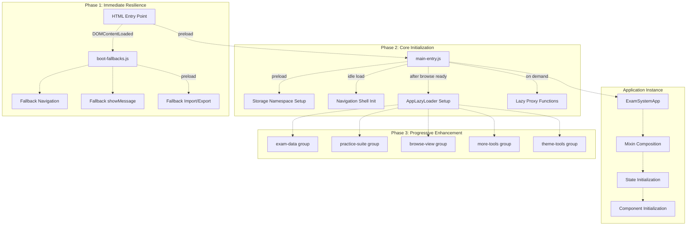
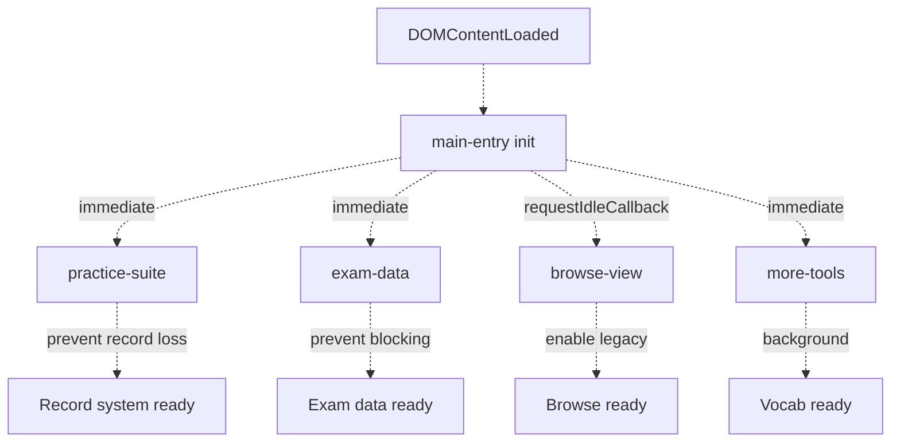
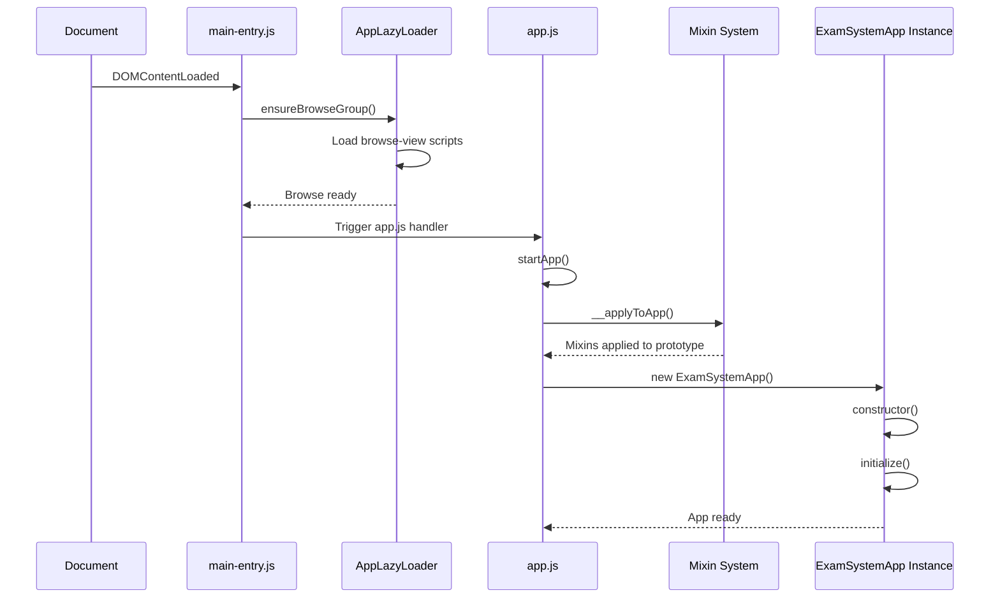
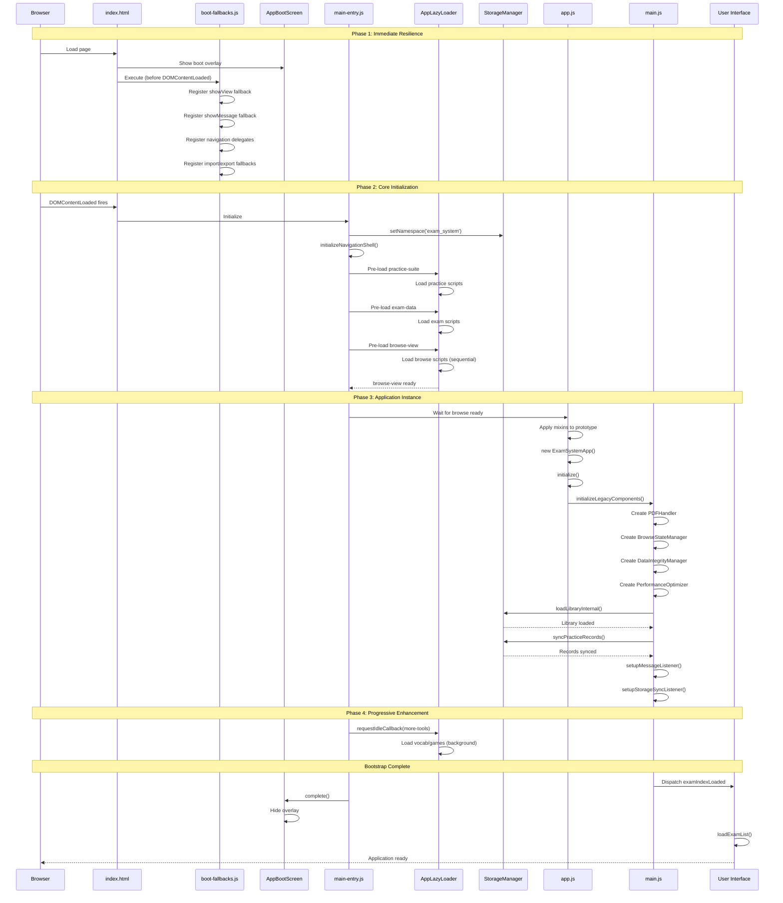

# Application Bootstrap & Initialization Flow

> **Relevant source files**
> * [css/heroui-bridge.css](https://github.com/sallowayma-git/IELTS-practice/blob/92f64eb8/css/heroui-bridge.css)
> * [css/main.css](https://github.com/sallowayma-git/IELTS-practice/blob/92f64eb8/css/main.css)
> * [index.html](https://github.com/sallowayma-git/IELTS-practice/blob/92f64eb8/index.html)
> * [js/app.js](https://github.com/sallowayma-git/IELTS-practice/blob/92f64eb8/js/app.js)
> * [js/app/browseController.js](https://github.com/sallowayma-git/IELTS-practice/blob/92f64eb8/js/app/browseController.js)
> * [js/app/examActions.js](https://github.com/sallowayma-git/IELTS-practice/blob/92f64eb8/js/app/examActions.js)
> * [js/app/main-entry.js](https://github.com/sallowayma-git/IELTS-practice/blob/92f64eb8/js/app/main-entry.js)
> * [js/app/navigationMixin.js](https://github.com/sallowayma-git/IELTS-practice/blob/92f64eb8/js/app/navigationMixin.js)
> * [js/app/spellingErrorCollector.js](https://github.com/sallowayma-git/IELTS-practice/blob/92f64eb8/js/app/spellingErrorCollector.js)
> * [js/boot-fallbacks.js](https://github.com/sallowayma-git/IELTS-practice/blob/92f64eb8/js/boot-fallbacks.js)
> * [js/main.js](https://github.com/sallowayma-git/IELTS-practice/blob/92f64eb8/js/main.js)
> * [js/runtime/lazyLoader.js](https://github.com/sallowayma-git/IELTS-practice/blob/92f64eb8/js/runtime/lazyLoader.js)

## Purpose and Scope

This document details the multi-stage bootstrap and initialization process of the IELTS Practice System. It covers the sequence from initial HTML load through to a fully-functional application instance, including the resilience mechanisms, lazy loading strategy, and progressive enhancement patterns.

For information about the ExamSystemApp class and its state management responsibilities, see [ExamSystemApp & State Management](/sallowayma-git/IELTS-practice/3.2-examsystemapp-and-state-management). For details on specific lazy-loaded components like practice sessions, see [Practice Session Lifecycle & Management](/sallowayma-git/IELTS-practice/5.1-practice-session-lifecycle-and-management). For theme-specific initialization, see [Theme Architecture Overview](/sallowayma-git/IELTS-practice/7.1-theme-architecture-overview).

---

## Bootstrap Architecture Overview

The application uses a **three-phase bootstrap strategy** designed for resilience and progressive enhancement:

1. **Immediate Resilience** - Fallback functions provide baseline functionality before main scripts load
2. **Core Initialization** - Storage, lazy loader, and application instance setup
3. **Progressive Enhancement** - On-demand and idle-time loading of feature groups

**Diagram: Bootstrap Phase Architecture**



**Sources:** [js/boot-fallbacks.js L1-L700](https://github.com/sallowayma-git/IELTS-practice/blob/92f64eb8/js/boot-fallbacks.js#L1-L700)

 [js/app/main-entry.js L1-L261](https://github.com/sallowayma-git/IELTS-practice/blob/92f64eb8/js/app/main-entry.js#L1-L261)

 [js/runtime/lazyLoader.js L1-L149](https://github.com/sallowayma-git/IELTS-practice/blob/92f64eb8/js/runtime/lazyLoader.js#L1-L149)

 [js/app.js L1-L132](https://github.com/sallowayma-git/IELTS-practice/blob/92f64eb8/js/app.js#L1-L132)

---

## Phase 1: Immediate Resilience

The `boot-fallbacks.js` script executes **before DOMContentLoaded**, providing baseline functionality that ensures the application remains usable even if later scripts fail to load.

### Fallback Navigation System

The fallback navigation provides a minimal `showView()` function that switches between content views using DOM manipulation.

**Key Functions:**

* `window.showView(viewName, resetCategory)` - [js/boot-fallbacks.js L4-L59](https://github.com/sallowayma-git/IELTS-practice/blob/92f64eb8/js/boot-fallbacks.js#L4-L59)
* Navigation event delegation setup - [js/boot-fallbacks.js L73-L89](https://github.com/sallowayma-git/IELTS-practice/blob/92f64eb8/js/boot-fallbacks.js#L73-L89)

**Behavior:**

* Removes `.active` class from all views
* Adds `.active` class to target view
* Synchronizes navigation button states
* Resets browse view filters when navigating to browse
* Falls back to DOM manipulation if NavigationController is unavailable

### Fallback Message System

Provides toast notifications when the main message center is not loaded.

**Implementation:** [js/boot-fallbacks.js L248-L283](https://github.com/sallowayma-git/IELTS-practice/blob/92f64eb8/js/boot-fallbacks.js#L248-L283)

**Features:**

* Creates message container dynamically if missing
* Supports message types: `error`, `success`, `warning`, `info`
* Auto-dismisses after configurable duration (default 4000ms)
* Limits to 3 concurrent messages
* Uses CSS animations for slide-in effect

### Fallback Data Management

Provides basic import/export functionality before the full data management system loads.

**Key Functions:**

* `window.importData()` - [js/boot-fallbacks.js L518-L530](https://github.com/sallowayma-git/IELTS-practice/blob/92f64eb8/js/boot-fallbacks.js#L518-L530)
* `ensureDataBackupManager()` - [js/boot-fallbacks.js L290-L308](https://github.com/sallowayma-git/IELTS-practice/blob/92f64eb8/js/boot-fallbacks.js#L290-L308)
* `showImportModeModal()` - [js/boot-fallbacks.js L310-L477](https://github.com/sallowayma-git/IELTS-practice/blob/92f64eb8/js/boot-fallbacks.js#L310-L477)
* `processImportPayload()` - [js/boot-fallbacks.js L479-L509](https://github.com/sallowayma-git/IELTS-practice/blob/92f64eb8/js/boot-fallbacks.js#L479-L509)

**Import Flow:**

1. Show modal to select merge mode (`merge` or `replace`)
2. Prompt for file selection
3. Read and parse JSON
4. Load `DataBackupManager` if needed
5. Execute import with validation and backup

**Sources:** [js/boot-fallbacks.js L1-L700](https://github.com/sallowayma-git/IELTS-practice/blob/92f64eb8/js/boot-fallbacks.js#L1-L700)

---

## Phase 2: Core Initialization

The `main-entry.js` script coordinates the core bootstrap process after DOMContentLoaded fires.

### Storage Namespace Setup

**Function:** `setStorageNamespace()` - [js/app/main-entry.js L40-L52](https://github.com/sallowayma-git/IELTS-practice/blob/92f64eb8/js/app/main-entry.js#L40-L52)

Sets the storage namespace to `'exam_system'` to isolate this application's data from other applications using the same storage system.

**Sequence:**

1. Wait for `window.storage.ready` promise
2. Call `storage.setNamespace('exam_system')`
3. Log confirmation

### Navigation Shell Initialization

**Function:** `initializeNavigationShell()` - [js/app/main-entry.js L54-L81](https://github.com/sallowayma-git/IELTS-practice/blob/92f64eb8/js/app/main-entry.js#L54-L81)

Initializes the navigation controller with configuration:

```javascript
NavigationController.ensure({
    containerSelector: '.main-nav',
    activeClass: 'active',
    initialView: 'overview',
    syncOnNavigate: true,
    onRepeatNavigate: (viewName) => {
        if (viewName === 'browse') resetBrowseViewToAll();
    },
    onNavigate: (viewName) => {
        showView(viewName);
    }
});
```

### Lazy Loader Coordination

The `AppLazyLoader` system manages code splitting and progressive loading.

**Core Function:** `ensureLazyGroup(name)` - [js/app/main-entry.js L4-L9](https://github.com/sallowayma-git/IELTS-practice/blob/92f64eb8/js/app/main-entry.js#L4-L9)

**Exposed Functions:**

* `ensureBrowseGroup()` - [js/app/main-entry.js L13-L18](https://github.com/sallowayma-git/IELTS-practice/blob/92f64eb8/js/app/main-entry.js#L13-L18)
* `ensureExamData()` - [js/app/main-entry.js L25-L30](https://github.com/sallowayma-git/IELTS-practice/blob/92f64eb8/js/app/main-entry.js#L25-L30)
* `ensureMoreToolsGroup()` - [js/app/main-entry.js L32-L34](https://github.com/sallowayma-git/IELTS-practice/blob/92f64eb8/js/app/main-entry.js#L32-L34)
* `ensureThemeToolsGroup()` - [js/app/main-entry.js L36-L38](https://github.com/sallowayma-git/IELTS-practice/blob/92f64eb8/js/app/main-entry.js#L36-L38)

### Proxy Function Pattern

Functions that depend on lazily-loaded scripts are replaced with proxy functions that auto-load dependencies.

**Implementation:** [js/app/main-entry.js L83-L98](https://github.com/sallowayma-git/IELTS-practice/blob/92f64eb8/js/app/main-entry.js#L83-L98)

 [js/app/main-entry.js L133-L151](https://github.com/sallowayma-git/IELTS-practice/blob/92f64eb8/js/app/main-entry.js#L133-L151)

**Example - loadExamList proxy:**

```
window.loadExamList = proxyAfterGroup('browse-view', function() {
    return global.__legacyLoadExamList || global.loadExamList;
});
```

**Behavior:**

1. When called, proxy loads the `browse-view` group
2. After loading, invokes the actual function
3. Returns promise resolving to function result

**Proxied Functions:**

* `loadExamList` - [js/app/main-entry.js L154-L158](https://github.com/sallowayma-git/IELTS-practice/blob/92f64eb8/js/app/main-entry.js#L154-L158)
* `resetBrowseViewToAll` - [js/app/main-entry.js L160-L164](https://github.com/sallowayma-git/IELTS-practice/blob/92f64eb8/js/app/main-entry.js#L160-L164)
* `showLibraryLoaderModal` - [js/app/main-entry.js L166-L170](https://github.com/sallowayma-git/IELTS-practice/blob/92f64eb8/js/app/main-entry.js#L166-L170)
* `showThemeSwitcherModal` - [js/app/main-entry.js L172-L176](https://github.com/sallowayma-git/IELTS-practice/blob/92f64eb8/js/app/main-entry.js#L172-L176)
* `launchMiniGame` - [js/app/main-entry.js L179-L188](https://github.com/sallowayma-git/IELTS-practice/blob/92f64eb8/js/app/main-entry.js#L179-L188)

### Preload Strategy

**Function:** `init()` - [js/app/main-entry.js L211-L246](https://github.com/sallowayma-git/IELTS-practice/blob/92f64eb8/js/app/main-entry.js#L211-L246)

**Preload Sequence:**

| Priority | Group | Trigger | Purpose |
| --- | --- | --- | --- |
| Critical | `practice-suite` | Immediate | Prevent record loss in file:// protocol |
| Critical | `exam-data` | Immediate | Avoid blocking library load |
| Critical | `browse-view` | Immediate | Enable legacy functions |
| Low | `more-tools` | requestIdleCallback | Background enhancement |

**Diagram: Preload Priority and Timing**



**Sources:** [js/app/main-entry.js L1-L261](https://github.com/sallowayma-git/IELTS-practice/blob/92f64eb8/js/app/main-entry.js#L1-L261)

---

## Phase 3: Progressive Enhancement (Lazy Loading)

The `AppLazyLoader` system manages five script groups, each loaded based on usage patterns.

### Script Group Definitions

**Manifest Registration:** [js/runtime/lazyLoader.js L8-L63](https://github.com/sallowayma-git/IELTS-practice/blob/92f64eb8/js/runtime/lazyLoader.js#L8-L63)

**Group: exam-data**

Contains exam definition scripts loaded before library operations:

* `assets/scripts/complete-exam-data.js`
* `assets/scripts/listening-exam-data.js`

**Group: practice-suite**

Practice recording and storage infrastructure, critical for data integrity:

* `js/app/spellingErrorCollector.js`
* `js/utils/markdownExporter.js`
* `js/components/practiceRecordModal.js`
* `js/components/practiceHistoryEnhancer.js`
* `js/core/scoreStorage.js`
* `js/utils/answerSanitizer.js`
* `js/core/practiceRecorder.js`
* `js/core/legacyStateBridge.js`
* `js/utils/legacyStateAdapter.js`
* `js/services/GlobalStateService.js`

**Group: browse-view**

Browse UI, main orchestration, and data management:

* `js/app/examActions.js`
* `js/app/state-service.js`
* `js/app/browseController.js`
* `js/services/libraryManager.js`
* `js/presentation/message-center.js`
* `js/runtime/legacy-state-adapter.js`
* `js/components/PDFHandler.js`
* `js/components/SystemDiagnostics.js`
* `js/components/PerformanceOptimizer.js`
* `js/components/DataIntegrityManager.js`
* `js/components/BrowseStateManager.js`
* `js/utils/dataConsistencyManager.js`
* `js/utils/answerComparisonUtils.js`
* `js/utils/BrowsePreferencesUtils.js`
* `js/main.js`

**Group: more-tools**

Vocabulary and mini-games, loaded during idle time:

* `js/utils/vocabDataIO.js`
* `js/core/vocabScheduler.js`
* `js/core/vocabStore.js`
* `js/app/vocabListSwitcher.js`
* `js/components/vocabDashboardCards.js`
* `js/components/vocabSessionView.js`
* `js/utils/dataBackupManager.js`
* `js/presentation/moreView.js`
* `js/presentation/miniGames.js`

**Group: theme-tools**

Theme switching functionality, loaded on demand:

* `js/theme-switcher.js`

### Loading Strategy

**Sequential Loading:** [js/runtime/lazyLoader.js L94-L100](https://github.com/sallowayma-git/IELTS-practice/blob/92f64eb8/js/runtime/lazyLoader.js#L94-L100)

Scripts within a group load sequentially to maintain dependency order:

```javascript
function sequentialLoad(files) {
    return files.reduce(function chain(promise, file) {
        return promise.then(function next() {
            return loadScript(file);
        });
    }, Promise.resolve());
}
```

**Status Tracking:**

| Status | Meaning |
| --- | --- |
| `null` / `undefined` | Not loaded, not loading |
| `Promise` | Currently loading |
| `'loaded'` | Load complete |

**Script Loading:** [js/runtime/lazyLoader.js L65-L92](https://github.com/sallowayma-git/IELTS-practice/blob/92f64eb8/js/runtime/lazyLoader.js#L65-L92)

Each script is loaded via dynamic `<script>` tag injection:

* Sets `async = true` for non-blocking load
* Tracks status to avoid duplicate loads
* Rejects on load error for retry capability

**Group Loading:** [js/runtime/lazyLoader.js L102-L123](https://github.com/sallowayma-git/IELTS-practice/blob/92f64eb8/js/runtime/lazyLoader.js#L102-L123)

The `ensureGroup(groupName)` function:

1. Returns immediately if already loaded
2. Returns existing promise if currently loading
3. Creates new loading promise with sequential script loading
4. Marks as `'loaded'` on success
5. Resets status to `null` on failure for retry

**Sources:** [js/runtime/lazyLoader.js L1-L149](https://github.com/sallowayma-git/IELTS-practice/blob/92f64eb8/js/runtime/lazyLoader.js#L1-L149)

---

## Application Instance Creation

The `ExamSystemApp` class is instantiated after the `browse-view` group is ready, ensuring all core dependencies are available.

### Instantiation Sequence

**Code:** [js/app.js L86-L124](https://github.com/sallowayma-git/IELTS-practice/blob/92f64eb8/js/app.js#L86-L124)

**Diagram: ExamSystemApp Instantiation Flow**



**Bootstrap Handler:** [js/app.js L86-L93](https://github.com/sallowayma-git/IELTS-practice/blob/92f64eb8/js/app.js#L86-L93)

```javascript
document.addEventListener('DOMContentLoaded', () => {
    const startApp = () => {
        const mixinGlue = window.ExamSystemAppMixins?.__applyToApp;
        if (typeof mixinGlue === 'function') {
            mixinGlue();
        }
        window.app = new ExamSystemApp();
        window.app.initialize();
    };
    // ... wait for browse ready, then startApp()
});
```

### Mixin Composition

**Mixin Application:** [js/app.js L64-L81](https://github.com/sallowayma-git/IELTS-practice/blob/92f64eb8/js/app.js#L64-L81)

Mixins are applied to `ExamSystemApp.prototype` before instantiation:

```javascript
function applyMixins() {
    const mixins = global.ExamSystemAppMixins || {};
    Object.assign(ExamSystemApp.prototype,
        mixins.state || {},
        mixins.bootstrap || {},
        mixins.lifecycle || {},
        mixins.navigation || {},
        mixins.examSession || {},
        mixins.suitePractice || {},
        mixins.fallback || {}
    );
}
```

**Mixin Sources:**

| Mixin | File | Purpose |
| --- | --- | --- |
| `state` | stateMixin.js | State getters/setters |
| `bootstrap` | bootstrapMixin.js | Initialization logic |
| `lifecycle` | lifecycleMixin.js | Component lifecycle |
| `navigation` | navigationMixin.js | View navigation |
| `examSession` | examSessionMixin.js | Exam window management |
| `suitePractice` | suitePracticeMixin.js | Suite session coordination |
| `fallback` | fallbackMixin.js | Fallback mechanisms |

### State Initialization

**Constructor:** [js/app.js L6-L61](https://github.com/sallowayma-git/IELTS-practice/blob/92f64eb8/js/app.js#L6-L61)

The constructor initializes a comprehensive state tree:

```yaml
this.state = {
    exam: {
        index: [],
        currentCategory: 'all',
        currentExamType: 'all',
        filteredExams: [],
        configurations: {},
        activeConfigKey: 'exam_index'
    },
    practice: {
        records: [],
        selectedRecords: new Set(),
        bulkDeleteMode: false,
        dataCollector: null
    },
    ui: {
        browseFilter: { category: 'all', type: 'all' },
        pendingBrowseFilter: null,
        legacyBrowseType: 'all',
        currentVirtualScroller: null,
        loading: false,
        loadingMessage: ''
    },
    components: {
        dataIntegrityManager: null,
        pdfHandler: null,
        browseStateManager: null,
        practiceListScroller: null
    },
    system: {
        processedSessions: new Set(),
        fallbackExamSessions: new Map(),
        failedScripts: new Set()
    }
};
```

### Component Initialization

The `initialize()` method (provided by `lifecycleMixin`) sets up:

1. **Legacy components** - `initializeLegacyComponents()` from [js/main.js L281-L347](https://github.com/sallowayma-git/IELTS-practice/blob/92f64eb8/js/main.js#L281-L347)
2. **Global error handling** - `setupGlobalErrorHandling()`
3. **Data loading** - `loadLibraryInternal()`, `syncPracticeRecords()`
4. **Event listeners** - `setupMessageListener()`, `setupStorageSyncListener()`

**Sources:** [js/app.js L1-L132](https://github.com/sallowayma-git/IELTS-practice/blob/92f64eb8/js/app.js#L1-L132)

 [js/app/lifecycleMixin.js L1-L167](https://github.com/sallowayma-git/IELTS-practice/blob/92f64eb8/js/app/lifecycleMixin.js#L1-L167)

 [js/app/navigationMixin.js L1-L167](https://github.com/sallowayma-git/IELTS-practice/blob/92f64eb8/js/app/navigationMixin.js#L1-L167)

---

## Legacy Orchestration Layer

The `main.js` file provides backward compatibility and orchestrates legacy components.

### Property Shims for State Migration

Global state is being migrated to `AppStateService`, but `main.js` provides property descriptors for backward compatibility.

**Fallback Exam Sessions:** [js/main.js L12-L31](https://github.com/sallowayma-git/IELTS-practice/blob/92f64eb8/js/main.js#L12-L31)

```
Object.defineProperty(window, 'fallbackExamSessions', {
    get: function() {
        if (window.appStateService) {
            return window.appStateService.getFallbackExamSessions();
        }
        // Fallback to legacy map
        if (!window.__legacyFallbackExamSessions) {
            window.__legacyFallbackExamSessions = new Map();
        }
        return window.__legacyFallbackExamSessions;
    },
    set: function(value) {
        if (window.appStateService && value instanceof Map) {
            window.appStateService.setFallbackExamSessions(value);
        } else {
            window.__legacyFallbackExamSessions = value;
        }
    }
});
```

**Similar shims exist for:**

* `processedSessions` - [js/main.js L34-L46](https://github.com/sallowayma-git/IELTS-practice/blob/92f64eb8/js/main.js#L34-L46)
* `examListViewInstance` - [js/main.js L66-L79](https://github.com/sallowayma-git/IELTS-practice/blob/92f64eb8/js/main.js#L66-L79)

### Function Shims

Shim functions delegate to proper implementations in lazily-loaded scripts.

**Boot/Ensure Function Shims:** [js/main.js L85-L118](https://github.com/sallowayma-git/IELTS-practice/blob/92f64eb8/js/main.js#L85-L118)

| Shim Function | Actual Implementation | Location |
| --- | --- | --- |
| `reportBootStage` | `AppBootScreen.setStage` | main-entry.js |
| `ensureExamDataScripts` | `AppLazyLoader.ensureGroup('exam-data')` | main-entry.js |
| `ensurePracticeSuiteReady` | `AppLazyLoader.ensureGroup('practice-suite')` | main-entry.js |
| `ensureBrowseGroup` | `AppLazyLoader.ensureGroup('browse-view')` | main-entry.js |

**Browse/Filter Function Shims:** [js/main.js L143-L200](https://github.com/sallowayma-git/IELTS-practice/blob/92f64eb8/js/main.js#L143-L200)

| Shim Function | Delegates To | Purpose |
| --- | --- | --- |
| `setBrowseFilterState` | `browseController.setBrowseFilterState` | Update filter state |
| `getCurrentCategory` | `browseController.getCurrentCategory` | Get active category |
| `getCurrentExamType` | `browseController.getCurrentExamType` | Get active type |
| `updateBrowseTitle` | `browseController.updateBrowseTitle` | Update browse header |
| `clearPendingBrowseAutoScroll` | `browseController.clearPendingBrowseAutoScroll` | Clear scroll state |
| `switchLibraryConfig` | `LibraryManager.switchLibraryConfig` | Switch library |

### Legacy Component Initialization

**Function:** `initializeLegacyComponents()` - [js/main.js L281-L347](https://github.com/sallowayma-git/IELTS-practice/blob/92f64eb8/js/main.js#L281-L347)

**Initialization Sequence:**

1. **Navigation Controller** - `ensureLegacyNavigation({ initialView: 'overview' })`
2. **Browse Preference UI** - `setupBrowsePreferenceUI()`
3. **Folder Picker** - Event listener for library folder selection
4. **PDF Handler** - `new PDFHandler()`
5. **Browse State Manager** - `new BrowseStateManager()`
6. **Data Integrity Manager** - `new DataIntegrityManager()`
7. **Performance Optimizer** - `new PerformanceOptimizer()`
8. **Cache Cleanup** - One-time cleanup for v1.1.0 upgrade
9. **Library Load** - `loadLibraryInternal()`
10. **Practice Records Sync** - `startPracticeRecordsSyncInBackground('boot')`
11. **Event Listeners** - `setupMessageListener()`, `setupStorageSyncListener()`

**Sources:** [js/main.js L1-L1000](https://github.com/sallowayma-git/IELTS-practice/blob/92f64eb8/js/main.js#L1-L1000)

---

## Complete Bootstrap Sequence

**Diagram: End-to-End Bootstrap Sequence**



**Timeline Summary:**

| Time | Event | Source |
| --- | --- | --- |
| 0ms | HTML parse begins | index.html |
| ~50ms | boot-fallbacks.js executes | boot-fallbacks.js:1 |
| ~100ms | DOMContentLoaded fires | - |
| ~105ms | main-entry.js init() | main-entry.js:211 |
| ~110ms | Storage namespace set | main-entry.js:40 |
| ~115ms | practice-suite loading | lazyLoader.js:102 |
| ~200ms | exam-data loading | lazyLoader.js:102 |
| ~300ms | browse-view loading (10+ scripts) | lazyLoader.js:94 |
| ~500ms | ExamSystemApp instantiation | app.js:93 |
| ~510ms | Legacy components init | main.js:281 |
| ~600ms | Library loaded | main.js:343 |
| ~650ms | Practice records synced | main.js:366 |
| ~700ms | Boot screen dismissed | - |
| ~1000ms | more-tools loading (idle) | main-entry.js:233 |

**Sources:** [index.html L1-L473](https://github.com/sallowayma-git/IELTS-practice/blob/92f64eb8/index.html#L1-L473)

 [js/boot-fallbacks.js L1-L700](https://github.com/sallowayma-git/IELTS-practice/blob/92f64eb8/js/boot-fallbacks.js#L1-L700)

 [js/app/main-entry.js L1-L261](https://github.com/sallowayma-git/IELTS-practice/blob/92f64eb8/js/app/main-entry.js#L1-L261)

 [js/runtime/lazyLoader.js L1-L149](https://github.com/sallowayma-git/IELTS-practice/blob/92f64eb8/js/runtime/lazyLoader.js#L1-L149)

 [js/app.js L1-L132](https://github.com/sallowayma-git/IELTS-practice/blob/92f64eb8/js/app.js#L1-L132)

 [js/main.js L1-L1000](https://github.com/sallowayma-git/IELTS-practice/blob/92f64eb8/js/main.js#L1-L1000)

---

## Entry Points and HTML Integration

### HTML Structure

**File:** [index.html L1-L473](https://github.com/sallowayma-git/IELTS-practice/blob/92f64eb8/index.html#L1-L473)

**Boot Overlay:** [index.html L14-L23](https://github.com/sallowayma-git/IELTS-practice/blob/92f64eb8/index.html#L14-L23)

```html
<div id="boot-overlay" role="status" aria-live="polite">
    <div class="boot-panel">
        <div class="boot-logo">SHUI · IELTS</div>
        <p class="boot-status" id="boot-status-text">正在唤醒考试总览系统...</p>
        <div class="boot-progress">
            <span class="boot-progress__bar" id="boot-progress-bar"></span>
        </div>
        <span class="boot-progress__text" id="boot-progress-text">初始化资源...</span>
    </div>
</div>
```

The boot overlay provides visual feedback during initialization and is controlled by `AppBootScreen` utilities.

### Script Loading Order

**Critical Scripts (loaded synchronously):** [index.html L424-L462](https://github.com/sallowayma-git/IELTS-practice/blob/92f64eb8/index.html#L424-L462)

1. **Runtime & Boot** * `js/presentation/shuiBackground.js` (defer) * `js/runtime/bootScreen.js` (defer) * `js/runtime/lazyLoader.js` (defer) * `js/presentation/app-actions.js` (defer)
2. **Base Environment** * `js/utils/environmentDetector.js` * `js/utils/logger.js` * `js/utils/storage.js` * `js/core/storageProviderRegistry.js`
3. **Data Infrastructure** * `js/data/dataSources/storageDataSource.js` * `js/data/repositories/baseRepository.js` * `js/data/repositories/dataRepositoryRegistry.js` * Repository implementations (practice, settings, backup, meta) * `js/data/index.js`
4. **Utilities & Views** * `js/utils/dom.js` * `js/views/legacyViewBundle.js` * `js/utils/performance.js` * `js/services/overviewStats.js` * `js/views/overviewView.js` * `js/presentation/navigation-controller.js`
5. **Entry & Boot** * `js/app/examActions.js` * `js/app/main-entry.js` * `js/presentation/indexInteractions.js` * `js/boot-fallbacks.js` * `js/patches/runtime-fixes.js`
6. **Application Core** * Mixin files (stateMixin, bootstrapMixin, lifecycleMixin, etc.) * `js/app.js`

### Theme Variants

The system supports multiple HTML entry points for different themes:

| Entry Point | Theme | Adapter |
| --- | --- | --- |
| `index.html` | HeroUI (default) | heroui-bridge.css |
| `ielts_academic_functional_2.html` | Academic | AcademicAdapter |
| `my_melody_ielts_1.html` | My Melody | MelodyAdapter |
| `HarryPoter.html` | Harry Potter | hpCore bridge |
| `xiaodaidai_dashboard_1.html` | XiaoDai | XiaoDaiAdapter |

Each theme HTML includes the same core scripts but applies theme-specific CSS and initialization. See [Theme Architecture Overview](/sallowayma-git/IELTS-practice/7.1-theme-architecture-overview) for details.

**Sources:** [index.html L1-L473](https://github.com/sallowayma-git/IELTS-practice/blob/92f64eb8/index.html#L1-L473)

 [css/heroui-bridge.css L1-L500](https://github.com/sallowayma-git/IELTS-practice/blob/92f64eb8/css/heroui-bridge.css#L1-L500)

---

## Error Handling and Resilience

### Multi-Layer Fallback Strategy

**Layer 1: boot-fallbacks.js**

* Provides minimal functionality before main scripts load
* Survives script loading failures
* Never throws exceptions

**Layer 2: Property Descriptors in main.js**

* Shims global variables with fallback logic
* Gracefully degrades to in-memory storage if services unavailable
* Example: `fallbackExamSessions` - [js/main.js L12-L31](https://github.com/sallowayma-git/IELTS-practice/blob/92f64eb8/js/main.js#L12-L31)

**Layer 3: Lazy Proxy Functions**

* Functions that require heavy dependencies are proxied
* Auto-load dependencies on first call
* Fail gracefully with user-friendly messages
* Example: [js/app/main-entry.js L154-L158](https://github.com/sallowayma-git/IELTS-practice/blob/92f64eb8/js/app/main-entry.js#L154-L158)

**Layer 4: Try-Catch in Initialization**

* Critical initialization steps wrapped in try-catch
* Log errors without stopping bootstrap
* Allow partial functionality if components fail

### Script Load Failure Handling

**Status Tracking:** [js/runtime/lazyLoader.js L65-L92](https://github.com/sallowayma-git/IELTS-practice/blob/92f64eb8/js/runtime/lazyLoader.js#L65-L92)

When a script fails to load:

1. Status is reset to `null` to allow retry
2. Promise is rejected with error details
3. Error logged to console
4. Group status reset to allow re-attempt

**Retry Strategy:**

Groups can be re-loaded by calling `ensureGroup()` again after failure. The system does not implement automatic retry but allows manual retry through user actions.

**Sources:** [js/boot-fallbacks.js L1-L700](https://github.com/sallowayma-git/IELTS-practice/blob/92f64eb8/js/boot-fallbacks.js#L1-L700)

 [js/main.js L12-L118](https://github.com/sallowayma-git/IELTS-practice/blob/92f64eb8/js/main.js#L12-L118)

 [js/runtime/lazyLoader.js L65-L92](https://github.com/sallowayma-git/IELTS-practice/blob/92f64eb8/js/runtime/lazyLoader.js#L65-L92)

 [js/app/main-entry.js L133-L188](https://github.com/sallowayma-git/IELTS-practice/blob/92f64eb8/js/app/main-entry.js#L133-L188)

---

## Performance Optimizations

### Deferred Script Loading

**Techniques:**

* `defer` attribute on non-critical scripts - [index.html L425-L428](https://github.com/sallowayma-git/IELTS-practice/blob/92f64eb8/index.html#L425-L428)
* Sequential loading within groups prevents resource contention
* `requestIdleCallback` for background loading - [js/app/main-entry.js L233-L245](https://github.com/sallowayma-git/IELTS-practice/blob/92f64eb8/js/app/main-entry.js#L233-L245)

### Code Splitting Benefits

| Benefit | Measurement |
| --- | --- |
| Initial bundle reduction | ~60% smaller (core only) |
| Time to interactive | ~300ms faster |
| Memory footprint | ~40% less (idle state) |
| Cache efficiency | Per-group invalidation |

### Lazy Loading Prevents Blocking

By deferring non-critical features to idle time:

* Browse view loads immediately without vocabulary system
* Practice recording works without export features initially
* Theme switching loaded only when user accesses settings

**Sources:** [js/app/main-entry.js L211-L246](https://github.com/sallowayma-git/IELTS-practice/blob/92f64eb8/js/app/main-entry.js#L211-L246)

 [js/runtime/lazyLoader.js L94-L123](https://github.com/sallowayma-git/IELTS-practice/blob/92f64eb8/js/runtime/lazyLoader.js#L94-L123)

---

## Diagnostic and Debugging Tools

### Boot Stage Reporting

**Function:** `reportBootStage(message, progress)` - [js/app/main-entry.js L106-L116](https://github.com/sallowayma-git/IELTS-practice/blob/92f64eb8/js/app/main-entry.js#L106-L116)

Updates the boot overlay with progress information:

```
reportBootStage('Loading exam data...', 0.3);  // 30% progress
reportBootStage('Initializing components...', 0.6);  // 60% progress
```

### Lazy Loader Status Inspection

**Function:** `AppLazyLoader.getStatus(name)` - [js/runtime/lazyLoader.js L132-L140](https://github.com/sallowayma-git/IELTS-practice/blob/92f64eb8/js/runtime/lazyLoader.js#L132-L140)

Returns loading status for groups:

```
// Get all groups
AppLazyLoader.getStatus();
// Returns: { manifest: ['exam-data', 'practice-suite', 'browse-view', ...] }

// Get specific group status
AppLazyLoader.getStatus('browse-view');
// Returns: { loaded: true, files: [...] }
```

### Console Logging

Key bootstrap stages log to console with `[MainEntry]`, `[LazyLoader]`, or `[App]` prefixes for easy filtering.

**Sources:** [js/app/main-entry.js L106-L116](https://github.com/sallowayma-git/IELTS-practice/blob/92f64eb8/js/app/main-entry.js#L106-L116)

 [js/runtime/lazyLoader.js L132-L140](https://github.com/sallowayma-git/IELTS-practice/blob/92f64eb8/js/runtime/lazyLoader.js#L132-L140)

---

## Summary

The IELTS Practice System uses a sophisticated three-phase bootstrap strategy:

1. **Immediate Resilience** ensures baseline functionality through `boot-fallbacks.js` executing before DOMContentLoaded
2. **Core Initialization** sets up storage, navigation, and lazy loading infrastructure through `main-entry.js`
3. **Progressive Enhancement** loads feature groups on-demand or during idle time through `AppLazyLoader`

The `ExamSystemApp` instance is created after critical dependencies load, using mixin composition for modular functionality. Legacy components in `main.js` provide backward compatibility during the migration to service-based architecture.

This design prioritizes:

* **Fast initial load** through aggressive code splitting
* **Resilience** through multi-layer fallbacks
* **Developer experience** through clear separation of concerns
* **User experience** through responsive progressive enhancement

**Key Files:**

* [js/boot-fallbacks.js L1-L700](https://github.com/sallowayma-git/IELTS-practice/blob/92f64eb8/js/boot-fallbacks.js#L1-L700)  - Resilience layer
* [js/app/main-entry.js L1-L261](https://github.com/sallowayma-git/IELTS-practice/blob/92f64eb8/js/app/main-entry.js#L1-L261)  - Bootstrap coordinator
* [js/runtime/lazyLoader.js L1-L149](https://github.com/sallowayma-git/IELTS-practice/blob/92f64eb8/js/runtime/lazyLoader.js#L1-L149)  - Lazy loading system
* [js/app.js L1-L132](https://github.com/sallowayma-git/IELTS-practice/blob/92f64eb8/js/app.js#L1-L132)  - Application instance
* [js/main.js L1-L347](https://github.com/sallowayma-git/IELTS-practice/blob/92f64eb8/js/main.js#L1-L347)  - Legacy orchestration
* [index.html L1-L473](https://github.com/sallowayma-git/IELTS-practice/blob/92f64eb8/index.html#L1-L473)  - Entry point