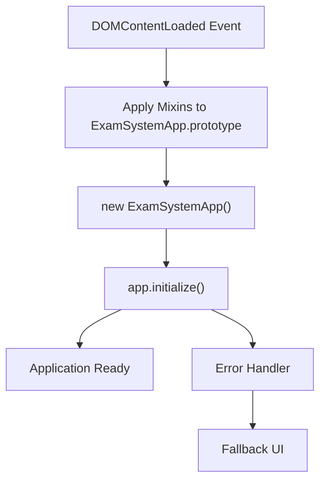
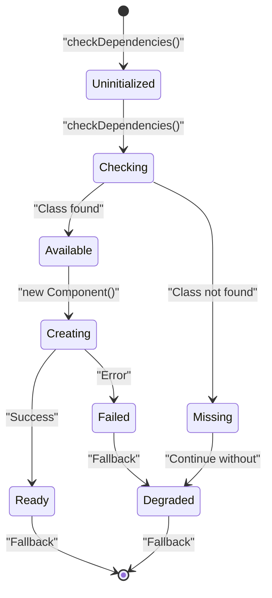
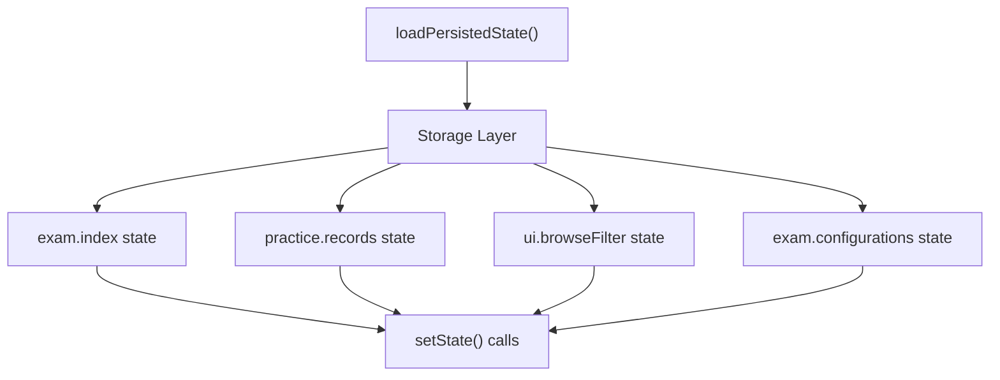
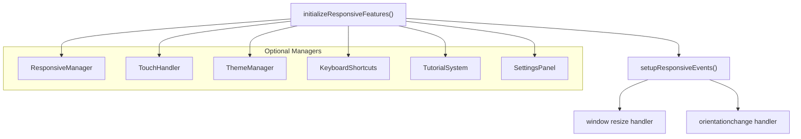
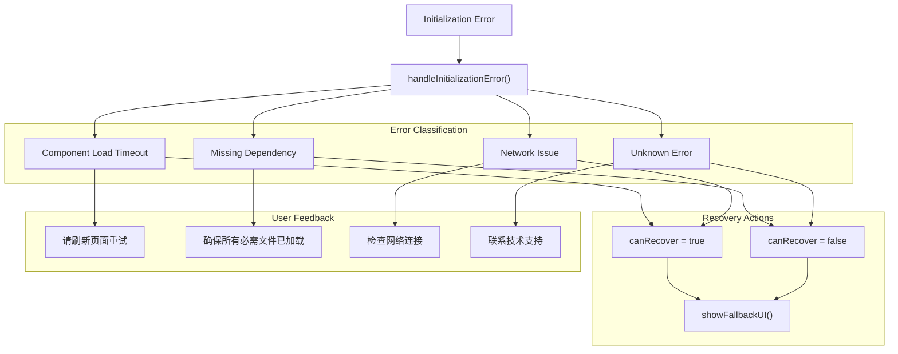
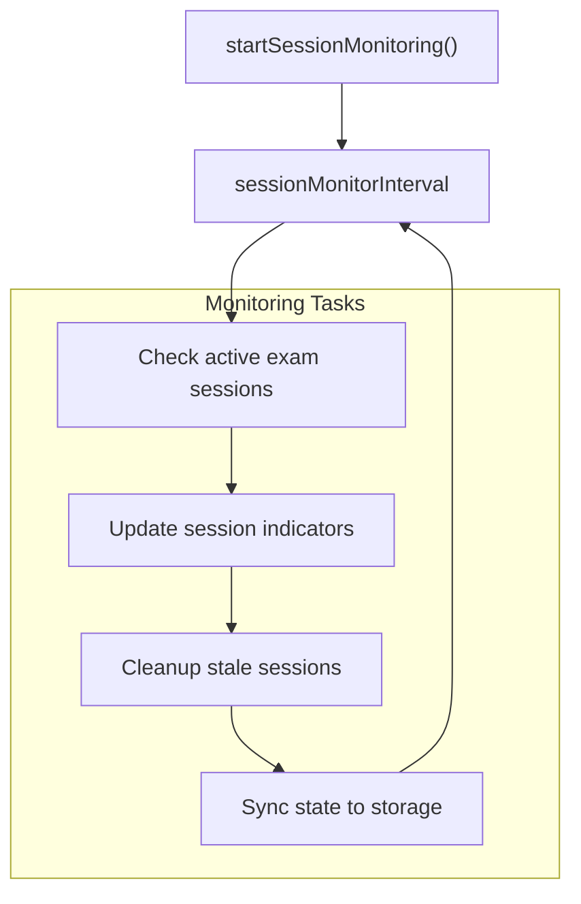
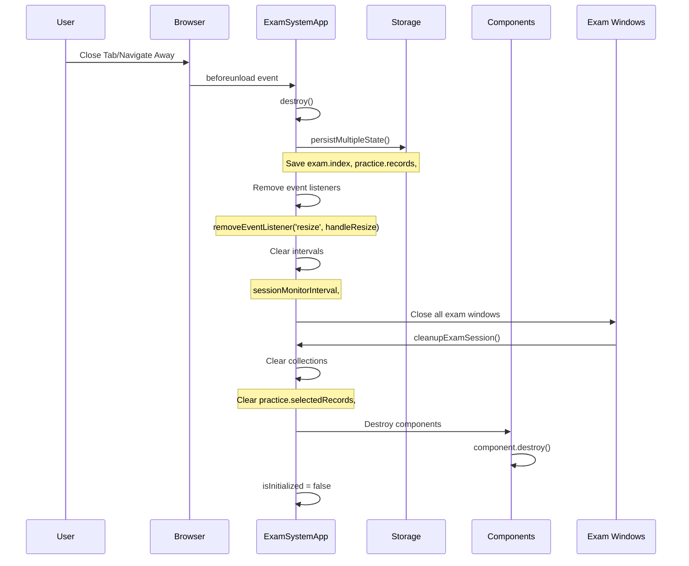

# Application Initialization & Lifecycle

> **Relevant source files**
> * [css/main.css](https://github.com/sallowayma-git/IELTS-practice/blob/68771116/css/main.css)
> * [index.html](https://github.com/sallowayma-git/IELTS-practice/blob/68771116/index.html)
> * [js/app.js](https://github.com/sallowayma-git/IELTS-practice/blob/68771116/js/app.js)
> * [js/app/lifecycleMixin.js](https://github.com/sallowayma-git/IELTS-practice/blob/68771116/js/app/lifecycleMixin.js)
> * [js/main.js](https://github.com/sallowayma-git/IELTS-practice/blob/68771116/js/main.js)

## Purpose and Scope

This document describes the bootstrap process, initialization sequence, lifecycle management, and cleanup procedures for the IELTS Practice System. It covers how the application starts up, initializes its components, manages its runtime lifecycle, and performs cleanup on shutdown.

For information about the state management architecture and the `ExamSystemApp` class structure, see [ExamSystemApp & State Management](/sallowayma-git/IELTS-practice/3.1-examsystemapp-and-state-management). For details on view rendering and navigation logic, see [View Management & Navigation](/sallowayma-git/IELTS-practice/3.3-view-management-and-navigation). For component composition patterns, see [Mixins & Component Architecture](/sallowayma-git/IELTS-practice/3.4-mixins-and-component-architecture).

---

## Bootstrap Entry Points

The application initialization begins at the HTML level and proceeds through several stages before the main application logic executes.

### Script Loading Order

The [index.html](https://github.com/sallowayma-git/IELTS-practice/blob/68771116/index.html)

 file defines a carefully ordered script loading sequence to ensure dependencies are available before they are used:

| Loading Stage | Purpose | Key Files |
| --- | --- | --- |
| **Environment Detection** | Detect runtime environment and setup logging | `js/utils/logger.js`, `js/utils/environmentDetector.js` |
| **Data Sources** | Load exam data | `assets/scripts/complete-exam-data.js`, `assets/scripts/listening-exam-data.js` |
| **Storage Layer** | Initialize storage abstractions | `js/utils/storage.js`, `js/core/storageProviderRegistry.js`, `js/data/repositories/*.js` |
| **Core Components** | Load business logic components | `js/core/scoreStorage.js`, `js/core/practiceRecorder.js`, `js/core/vocabStore.js` |
| **State Management** | Initialize state services | `js/app/state-service.js`, `js/runtime/legacy-state-adapter.js` |
| **Mixins** | Load application behavior mixins | `js/app/stateMixin.js`, `js/app/bootstrapMixin.js`, `js/app/lifecycleMixin.js`, etc. |
| **Main Application** | Bootstrap the application | `js/app.js` |

### DOMContentLoaded Handler

The application starts when the browser fires the `DOMContentLoaded` event. The handler in [js/app.js L86-L112](https://github.com/sallowayma-git/IELTS-practice/blob/68771116/js/app.js#L86-L112)

 performs the following:

1. Applies all mixins to the `ExamSystemApp.prototype` via `ExamSystemAppMixins.__applyToApp()`
2. Creates a new `ExamSystemApp` instance and assigns it to `window.app`
3. Calls `app.initialize()` to begin the initialization sequence
4. Catches and handles any initialization errors gracefully



**Sources:** [js/app.js L86-L112](https://github.com/sallowayma-git/IELTS-practice/blob/68771116/js/app.js#L86-L112)

 [index.html L486-L500](https://github.com/sallowayma-git/IELTS-practice/blob/68771116/index.html#L486-L500)

---

## Initialization Sequence

The primary initialization logic resides in the `initialize()` method provided by `lifecycleMixin`. This method orchestrates a multi-stage initialization process with progress feedback.

### Initialization Flow Diagram

```mermaid
sequenceDiagram
  participant User
  participant DOMContentLoaded
  participant ExamSystemApp
  participant lifecycleMixin.initialize()
  participant Component Registry
  participant Storage Layer
  participant initializeLegacyComponents()
  participant User Interface

  User->>DOMContentLoaded: Load Page
  DOMContentLoaded->>ExamSystemApp: Create Instance
  ExamSystemApp->>lifecycleMixin.initialize(): initialize()
  lifecycleMixin.initialize()->>User Interface: showLoading(true)
  lifecycleMixin.initialize()->>User Interface: updateLoadingMessage("检查系统依赖...")
  lifecycleMixin.initialize()->>lifecycleMixin.initialize(): checkDependencies()
  lifecycleMixin.initialize()->>User Interface: updateLoadingMessage("初始化状态管理...")
  lifecycleMixin.initialize()->>ExamSystemApp: initializeGlobalCompatibility()
  lifecycleMixin.initialize()->>User Interface: updateLoadingMessage("加载持久化状态...")
  lifecycleMixin.initialize()->>Storage Layer: loadPersistedState()
  Storage Layer-->>lifecycleMixin.initialize(): State Data
  lifecycleMixin.initialize()->>User Interface: updateLoadingMessage("初始化响应式功能...")
  lifecycleMixin.initialize()->>lifecycleMixin.initialize(): initializeResponsiveFeatures()
  lifecycleMixin.initialize()->>User Interface: updateLoadingMessage("加载系统组件...")
  lifecycleMixin.initialize()->>Component Registry: initializeComponents()
  Component Registry-->>lifecycleMixin.initialize(): Component Instances
  lifecycleMixin.initialize()->>User Interface: updateLoadingMessage("设置事件监听器...")
  lifecycleMixin.initialize()->>lifecycleMixin.initialize(): setupEventListeners()
  lifecycleMixin.initialize()->>lifecycleMixin.initialize(): setupGlobalErrorHandling()
  lifecycleMixin.initialize()->>User Interface: updateLoadingMessage("初始化遗留组件...")
  lifecycleMixin.initialize()->>initializeLegacyComponents(): initializeLegacyComponents()
  initializeLegacyComponents()-->>lifecycleMixin.initialize(): Legacy Components Ready
  lifecycleMixin.initialize()->>User Interface: updateLoadingMessage("加载初始数据...")
  lifecycleMixin.initialize()->>Storage Layer: loadInitialData()
  Storage Layer-->>lifecycleMixin.initialize(): Exam Index, Practice Records
  lifecycleMixin.initialize()->>User Interface: updateLoadingMessage("设置用户界面...")
  lifecycleMixin.initialize()->>lifecycleMixin.initialize(): setupInitialView()
  lifecycleMixin.initialize()->>lifecycleMixin.initialize(): startSessionMonitoring()
  lifecycleMixin.initialize()->>User Interface: showLoading(false)
  lifecycleMixin.initialize()->>User Interface: showUserMessage("系统初始化完成", "success")
  lifecycleMixin.initialize()-->>User: Application Ready
```

**Sources:** [js/app/lifecycleMixin.js L6-L70](https://github.com/sallowayma-git/IELTS-practice/blob/68771116/js/app/lifecycleMixin.js#L6-L70)

### Initialization Stages

The initialization proceeds through the following stages in [js/app/lifecycleMixin.js L6-L70](https://github.com/sallowayma-git/IELTS-practice/blob/68771116/js/app/lifecycleMixin.js#L6-L70)

:

| Stage | Method | Purpose | Error Handling |
| --- | --- | --- | --- |
| 1. **Dependency Check** | `checkDependencies()` | Verify critical dependencies are loaded | Throws error if missing |
| 2. **State Setup** | `initializeGlobalCompatibility()` | Initialize state management bridges | Continues with degraded functionality |
| 3. **State Loading** | `loadPersistedState()` | Restore state from storage | Uses default state on failure |
| 4. **Responsive Init** | `initializeResponsiveFeatures()` | Setup responsive managers and handlers | Optional, continues without |
| 5. **Component Init** | `initializeComponents()` | Initialize core components | Component-specific error handling |
| 6. **Event Setup** | `setupEventListeners()` | Attach DOM and global event handlers | Critical, throws on failure |
| 7. **Legacy Init** | `initializeLegacyComponents()` | Initialize backward-compatible components | Logs warnings, continues |
| 8. **Data Loading** | `loadInitialData()` | Load exam index and practice records | Uses empty data on failure |
| 9. **View Setup** | `setupInitialView()` | Configure initial view state | Uses default view |
| 10. **Monitoring** | `startSessionMonitoring()` | Start lifecycle monitoring tasks | Optional feature |

**Sources:** [js/app/lifecycleMixin.js L6-L70](https://github.com/sallowayma-git/IELTS-practice/blob/68771116/js/app/lifecycleMixin.js#L6-L70)

---

## Dependency Management

The application checks for required dependencies before proceeding with initialization. Critical dependencies are identified by the `checkDependencies()` method (referenced but implementation likely in `bootstrapMixin`).

### Required Dependencies

Based on component initialization patterns, the following dependencies are required:

```mermaid
flowchart TD

App["ExamSystemApp"]
Storage["window.storage"]
StateService["window.appStateService or AppStateService"]
LegacyAdapter["window.LegacyStateAdapter"]
PDFHandler["window.PDFHandler"]
BrowseManager["window.BrowseStateManager"]
IntegrityMgr["window.DataIntegrityManager"]
PerfOptimizer["window.PerformanceOptimizer"]
PracticeRecorder["window.PracticeRecorder"]
ExamListView["window.LegacyExamListView"]
DashboardView["window.PracticeDashboardView"]
NavController["window.NavigationController"]

App --> Storage
App --> StateService
App --> LegacyAdapter
App --> PDFHandler
App --> BrowseManager
App --> IntegrityMgr
App --> PerfOptimizer
App --> PracticeRecorder
App --> ExamListView
App --> DashboardView
App --> NavController

subgraph subGraph2 ["Legacy Components"]
    ExamListView
    DashboardView
    NavController
end

subgraph subGraph1 ["Optional Components"]
    PDFHandler
    BrowseManager
    IntegrityMgr
    PerfOptimizer
    PracticeRecorder
end

subgraph subGraph0 ["Critical Dependencies"]
    Storage
    StateService
    LegacyAdapter
end
```



**Sources:** [js/main.js L48-L59](https://github.com/sallowayma-git/IELTS-practice/blob/68771116/js/main.js#L48-L59)

 [js/main.js L1102-L1123](https://github.com/sallowayma-git/IELTS-practice/blob/68771116/js/main.js#L1102-L1123)

---

## Component Initialization

Components are initialized in two phases: core application components and legacy components.

### Core Component Initialization

The `initializeComponents()` method (likely in `bootstrapMixin`) creates instances of core components. Based on [js/main.js L1102-L1123](https://github.com/sallowayma-git/IELTS-practice/blob/68771116/js/main.js#L1102-L1123)

 the following components are initialized:

```
// PDFHandler - handles PDF exam resources
if (window.PDFHandler) {
    pdfHandler = new PDFHandler();
}

// BrowseStateManager - manages browse view state
if (window.BrowseStateManager) {
    browseStateManager = new BrowseStateManager();
}

// DataIntegrityManager - validates data consistency
if (window.DataIntegrityManager) {
    window.dataIntegrityManager = new DataIntegrityManager();
}

// PerformanceOptimizer - optimizes application performance
if (window.PerformanceOptimizer) {
    window.performanceOptimizer = new PerformanceOptimizer();
}
```

### Legacy Component Initialization

The `initializeLegacyComponents()` function in [js/main.js L1084-L1150](https://github.com/sallowayma-git/IELTS-practice/blob/68771116/js/main.js#L1084-L1150)

 initializes backward-compatible components:

1. **Navigation Controller** - Sets up legacy navigation via `ensureLegacyNavigation()`
2. **Browse Preference UI** - Initializes browse list preferences via `setupBrowsePreferenceUI()`
3. **Folder Picker** - Attaches file selection handler
4. **Cache Cleanup** - One-time cleanup for v1.1.0 upgrade via `cleanupOldCache()`
5. **Data Loading** - Loads library and syncs practice records
6. **Message Listeners** - Sets up cross-window communication via `setupMessageListener()`
7. **Storage Sync** - Sets up multi-tab sync via `setupStorageSyncListener()`

**Component Lifecycle States:**



**Sources:** [js/main.js L1084-L1150](https://github.com/sallowayma-git/IELTS-practice/blob/68771116/js/main.js#L1084-L1150)

 [js/main.js L1102-L1123](https://github.com/sallowayma-git/IELTS-practice/blob/68771116/js/main.js#L1102-L1123)

---

## State Management Setup

State initialization involves two key steps: setting up global compatibility and loading persisted state.

### Global Compatibility Layer

The `initializeGlobalCompatibility()` method (likely in `stateMixin`) establishes bridges between the modern state management system and legacy global variables. This is implemented via:

* **`stateService`** resolution in [js/main.js L48-L59](https://github.com/sallowayma-git/IELTS-practice/blob/68771116/js/main.js#L48-L59)
* **`legacyStateAdapter`** initialization in [js/main.js L4](https://github.com/sallowayma-git/IELTS-practice/blob/68771116/js/main.js#L4-L4)
* **Global variable sync** functions like `syncGlobalBrowseState()` in [js/main.js L28-L40](https://github.com/sallowayma-git/IELTS-practice/blob/68771116/js/main.js#L28-L40)

### State Loading Process

The `loadPersistedState()` method loads saved state from storage:



The `loadInitialData()` method in [js/app/lifecycleMixin.js L363-L393](https://github.com/sallowayma-git/IELTS-practice/blob/68771116/js/app/lifecycleMixin.js#L363-L393)

 performs state restoration:

1. Loads `exam_index` from storage → `this.setState('exam.index', examIndex)`
2. Loads `practice_records` from storage → `this.setState('practice.records', practiceRecords)`
3. Loads `browse_filter` from storage → `this.setState('ui.browseFilter', browseFilter)`
4. Calls `loadUserStats()` to restore user statistics
5. Updates UI via `updateOverviewStats()`

**Sources:** [js/app/lifecycleMixin.js L363-L393](https://github.com/sallowayma-git/IELTS-practice/blob/68771116/js/app/lifecycleMixin.js#L363-L393)

 [js/main.js L48-L59](https://github.com/sallowayma-git/IELTS-practice/blob/68771116/js/main.js#L48-L59)

 [js/main.js L28-L40](https://github.com/sallowayma-git/IELTS-practice/blob/68771116/js/main.js#L28-L40)

---

## Event System Setup

Event listeners are established during initialization to handle user interactions, system events, and cross-component communication.

### DOM Event Listeners

The `setupEventListeners()` method in [js/app/lifecycleMixin.js L301-L358](https://github.com/sallowayma-git/IELTS-practice/blob/68771116/js/app/lifecycleMixin.js#L301-L358)

 attaches the following handlers:

| Event Target | Event Type | Handler Purpose | Implementation |
| --- | --- | --- | --- |
| `document` | `click` | Navigation button clicks | Delegates to `navigateToView()` |
| `document` | `click` | Back button clicks | Returns to overview |
| `document` | `click` | Category action buttons | Calls `handleCategoryAction()` |
| `document` | `visibilitychange` | Tab visibility changes | Refreshes data when tab becomes visible |
| `document` | `keydown` | Keyboard shortcuts | Ctrl+1/2/3/4 for view navigation |

### Global Error Handlers

The `setupGlobalErrorHandling()` method in [js/app/lifecycleMixin.js L109-L123](https://github.com/sallowayma-git/IELTS-practice/blob/68771116/js/app/lifecycleMixin.js#L109-L123)

 establishes top-level error catchers:

```javascript
// Unhandled Promise rejections
window.addEventListener('unhandledrejection', (event) => {
    this.handleGlobalError(event.reason, 'Promise拒绝');
    event.preventDefault();
});

// JavaScript runtime errors
window.addEventListener('error', (event) => {
    this.handleGlobalError(event.error, 'JavaScript错误');
});
```

The `handleGlobalError()` method in [js/app/lifecycleMixin.js L128-L167](https://github.com/sallowayma-git/IELTS-practice/blob/68771116/js/app/lifecycleMixin.js#L128-L167)

 implements error rate limiting to avoid user notification spam.

### Cross-Window Message Listeners

The `setupMessageListener()` function (in `main.js`, referenced by [js/main.js L1148](https://github.com/sallowayma-git/IELTS-practice/blob/68771116/js/main.js#L1148-L1148)

) handles `postMessage` events from exam windows for practice session completion.

### Storage Sync Listeners

The `setupStorageSyncListener()` function (in `main.js`, referenced by [js/main.js L1149](https://github.com/sallowayma-git/IELTS-practice/blob/68771116/js/main.js#L1149-L1149)

) listens for `storage` events to sync state across browser tabs.

**Sources:** [js/app/lifecycleMixin.js L301-L358](https://github.com/sallowayma-git/IELTS-practice/blob/68771116/js/app/lifecycleMixin.js#L301-L358)

 [js/app/lifecycleMixin.js L109-L123](https://github.com/sallowayma-git/IELTS-practice/blob/68771116/js/app/lifecycleMixin.js#L109-L123)

 [js/app/lifecycleMixin.js L128-L167](https://github.com/sallowayma-git/IELTS-practice/blob/68771116/js/app/lifecycleMixin.js#L128-L167)

 [js/main.js L1148-L1149](https://github.com/sallowayma-git/IELTS-practice/blob/68771116/js/main.js#L1148-L1149)

---

## Responsive Features Initialization

The application initializes responsive UI components to handle different screen sizes, touch interactions, and device orientations.

### Responsive Components

The `initializeResponsiveFeatures()` method in [js/app/lifecycleMixin.js L193-L228](https://github.com/sallowayma-git/IELTS-practice/blob/68771116/js/app/lifecycleMixin.js#L193-L228)

 conditionally initializes:



### Responsive Event Handling

The `setupResponsiveEvents()` method in [js/app/lifecycleMixin.js L233-L257](https://github.com/sallowayma-git/IELTS-practice/blob/68771116/js/app/lifecycleMixin.js#L233-L257)

 implements throttled event handlers:

**Resize Handler:**

* Debounced to 250ms
* Calls `responsiveManager.recalculateLayout()` if available
* Calls `handleResize()` to adjust application layout
* Toggles `.mobile` class on body based on screen size

**Orientation Change Handler:**

* Delayed by 100ms to allow viewport stabilization
* Calls `responsiveManager.recalculateLayout()` if available
* Calls `adjustForOrientation()` to adjust for landscape/portrait

The `adjustForOrientation()` method in [js/app/lifecycleMixin.js L262-L296](https://github.com/sallowayma-git/IELTS-practice/blob/68771116/js/app/lifecycleMixin.js#L262-L296)

 applies mobile landscape optimizations:

* Adds `.mobile-landscape` class when `height < width` and `width <= 768px`
* Adjusts header padding
* Modifies stats grid layout

**Sources:** [js/app/lifecycleMixin.js L193-L228](https://github.com/sallowayma-git/IELTS-practice/blob/68771116/js/app/lifecycleMixin.js#L193-L228)

 [js/app/lifecycleMixin.js L233-L257](https://github.com/sallowayma-git/IELTS-practice/blob/68771116/js/app/lifecycleMixin.js#L233-L257)

 [js/app/lifecycleMixin.js L262-L296](https://github.com/sallowayma-git/IELTS-practice/blob/68771116/js/app/lifecycleMixin.js#L262-L296)

---

## Error Handling and Recovery

The initialization process includes multiple layers of error handling to ensure graceful degradation.

### Initialization Error Handler



The `handleInitializationError()` method in [js/app/lifecycleMixin.js L75-L104](https://github.com/sallowayma-git/IELTS-practice/blob/68771116/js/app/lifecycleMixin.js#L75-L104)

 performs error classification and provides context-appropriate user messages.

### Global Error Tracking

The `handleGlobalError()` method in [js/app/lifecycleMixin.js L128-L167](https://github.com/sallowayma-git/IELTS-practice/blob/68771116/js/app/lifecycleMixin.js#L128-L167)

 implements error rate limiting:

1. Stores errors in `this.globalErrors` array with timestamp and context
2. Limits array to last 50 errors (of last 100 recorded)
3. Counts errors in last 60 seconds
4. Shows warning if > 5 errors in last minute
5. Filters out cross-origin script errors (`"Script error"`)

**Sources:** [js/app/lifecycleMixin.js L75-L104](https://github.com/sallowayma-git/IELTS-practice/blob/68771116/js/app/lifecycleMixin.js#L75-L104)

 [js/app/lifecycleMixin.js L128-L167](https://github.com/sallowayma-git/IELTS-practice/blob/68771116/js/app/lifecycleMixin.js#L128-L167)

---

## Runtime Lifecycle Management

After initialization, the application manages its lifecycle through monitoring tasks, event handlers, and state updates.

### Session Monitoring

The `startSessionMonitoring()` method (referenced in [js/app/lifecycleMixin.js L56](https://github.com/sallowayma-git/IELTS-practice/blob/68771116/js/app/lifecycleMixin.js#L56-L56)

) establishes periodic monitoring tasks:



### Visibility Change Handling

The visibility change listener in [js/app/lifecycleMixin.js L329-L333](https://github.com/sallowayma-git/IELTS-practice/blob/68771116/js/app/lifecycleMixin.js#L329-L333)

 triggers data refresh:

```javascript
document.addEventListener('visibilitychange', () => {
    if (!document.hidden && this.isInitialized) {
        this.refreshData();
    }
});
```

The `refreshData()` method in [js/app/lifecycleMixin.js L537-L544](https://github.com/sallowayma-git/IELTS-practice/blob/68771116/js/app/lifecycleMixin.js#L537-L544)

 reloads data and reactivates the current view.

### Resize and Orientation Handling

Device orientation and viewport size changes are handled via the responsive event system described earlier. The `handleResize()` method in [js/app/lifecycleMixin.js L525-L532](https://github.com/sallowayma-git/IELTS-practice/blob/68771116/js/app/lifecycleMixin.js#L525-L532)

 adjusts the mobile state:

```
handleResize() {
    if (this.isMobile()) {
        document.body.classList.add('mobile');
    } else {
        document.body.classList.remove('mobile');
    }
}
```

**Sources:** [js/app/lifecycleMixin.js L56](https://github.com/sallowayma-git/IELTS-practice/blob/68771116/js/app/lifecycleMixin.js#L56-L56)

 [js/app/lifecycleMixin.js L329-L333](https://github.com/sallowayma-git/IELTS-practice/blob/68771116/js/app/lifecycleMixin.js#L329-L333)

 [js/app/lifecycleMixin.js L537-L544](https://github.com/sallowayma-git/IELTS-practice/blob/68771116/js/app/lifecycleMixin.js#L537-L544)

 [js/app/lifecycleMixin.js L525-L532](https://github.com/sallowayma-git/IELTS-practice/blob/68771116/js/app/lifecycleMixin.js#L525-L532)

---

## Application Cleanup and Destruction

The application performs comprehensive cleanup when the page unloads or the app is destroyed.

### Cleanup Entry Point

The `beforeunload` event handler in [js/app.js L115-L119](https://github.com/sallowayma-git/IELTS-practice/blob/68771116/js/app.js#L115-L119)

 triggers cleanup:

```javascript
window.addEventListener('beforeunload', () => {
    if (window.app) {
        window.app.destroy();
    }
});
```

### Destruction Sequence



### Destruction Implementation

The `destroy()` method in [js/app/lifecycleMixin.js L549-L601](https://github.com/sallowayma-git/IELTS-practice/blob/68771116/js/app/lifecycleMixin.js#L549-L601)

 performs the following cleanup:

| Cleanup Stage | Action | Purpose |
| --- | --- | --- |
| **State Persistence** | `persistMultipleState()` | Save current state to storage |
| **Event Cleanup** | `removeEventListener('resize', ...)` | Remove window event listeners |
| **Timer Cleanup** | Clear intervals | Stop monitoring tasks |
| **Window Cleanup** | Close exam windows | Close all child windows and cleanup sessions |
| **Collection Cleanup** | Clear Sets and Maps | Free memory from collections |
| **Component Cleanup** | Call `component.destroy()` | Destroy all component instances |
| **State Reset** | `isInitialized = false` | Mark app as uninitialized |

**Cleanup Browse State:**

Functions like `flushPendingBrowseScrollPosition()` are also called during cleanup events [js/main.js L631-L632](https://github.com/sallowayma-git/IELTS-practice/blob/68771116/js/main.js#L631-L632)

 to persist browse view scroll positions:

```
window.addEventListener('pagehide', flushPendingBrowseScrollPosition);
window.addEventListener('beforeunload', flushPendingBrowseScrollPosition);
```

**Sources:** [js/app.js L115-L119](https://github.com/sallowayma-git/IELTS-practice/blob/68771116/js/app.js#L115-L119)

 [js/app/lifecycleMixin.js L549-L601](https://github.com/sallowayma-git/IELTS-practice/blob/68771116/js/app/lifecycleMixin.js#L549-L601)

 [js/main.js L631-L632](https://github.com/sallowayma-git/IELTS-practice/blob/68771116/js/main.js#L631-L632)

---

## Summary

The application lifecycle follows a well-defined sequence:

1. **Bootstrap**: Scripts load in dependency order, mixins apply, `ExamSystemApp` instantiates
2. **Initialization**: 10-stage initialization with progress feedback and error handling
3. **Runtime**: Event-driven execution with monitoring, responsive adjustments, and state sync
4. **Cleanup**: Comprehensive destruction with state persistence and resource cleanup

This architecture ensures reliable startup, graceful error handling, responsive runtime behavior, and clean shutdown even when components fail or are unavailable.