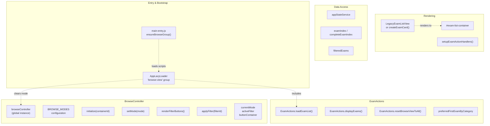
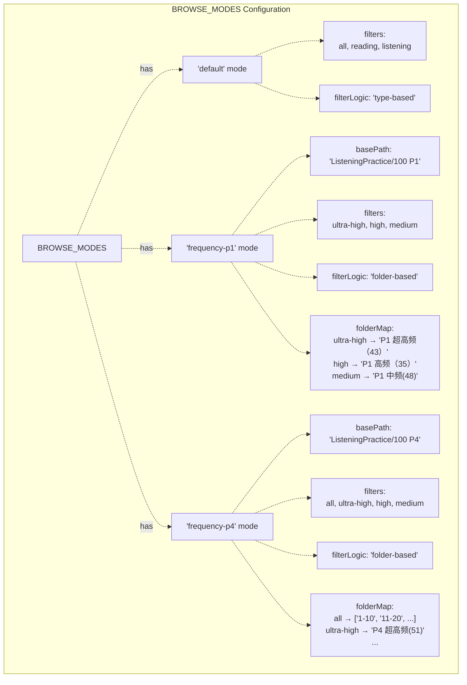
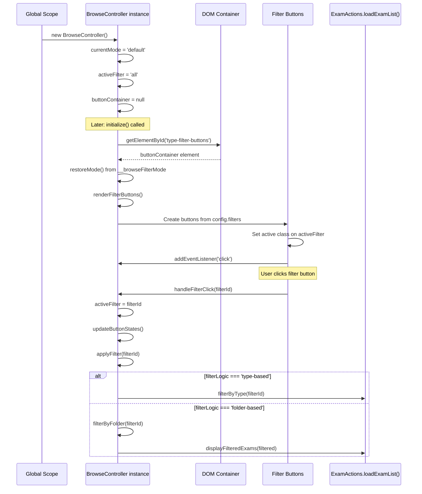
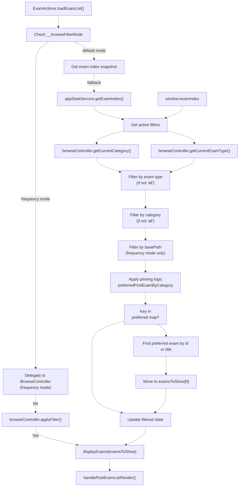
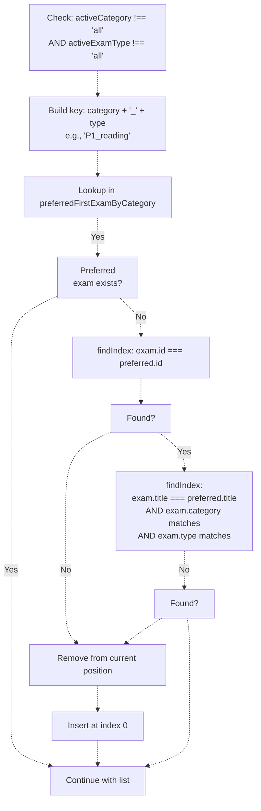
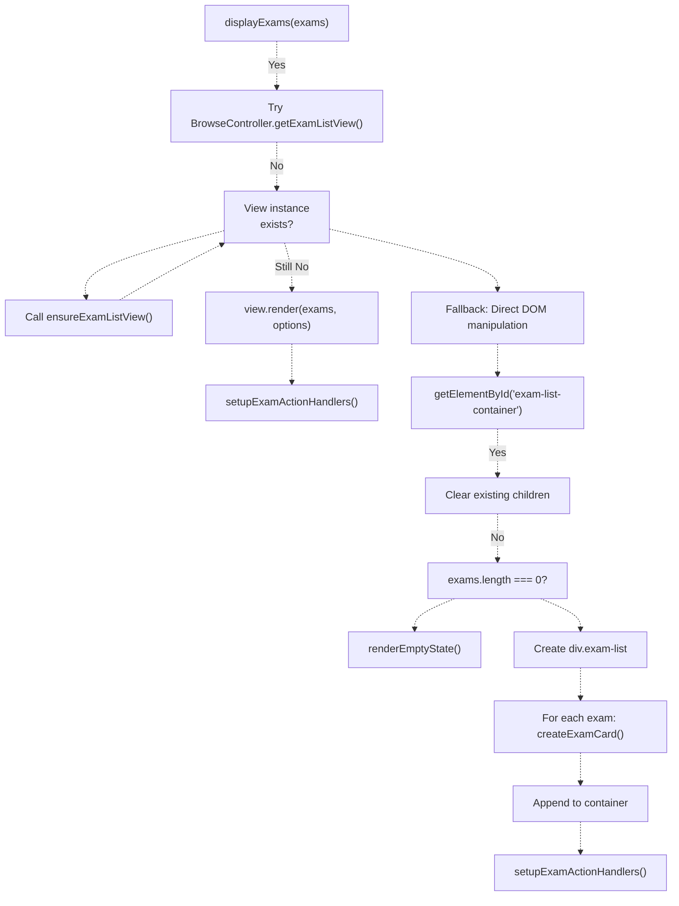
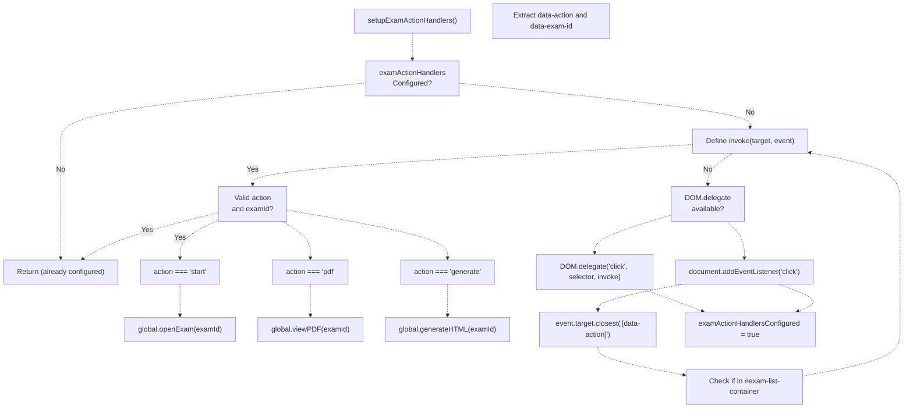
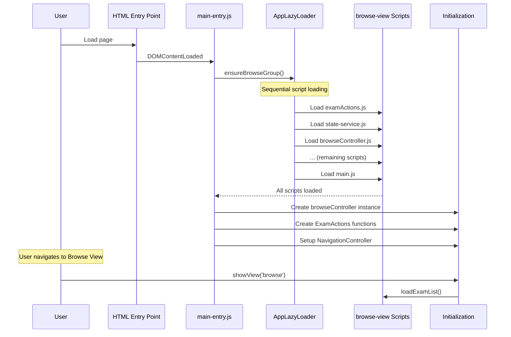
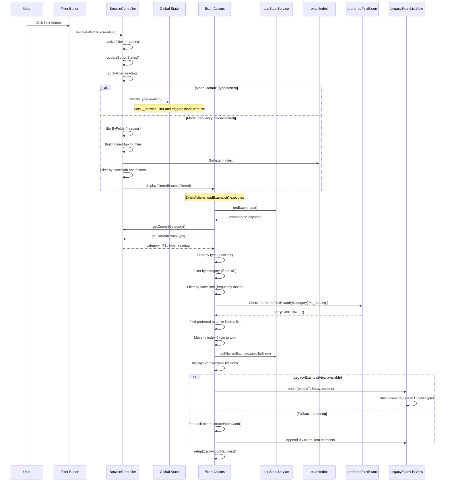
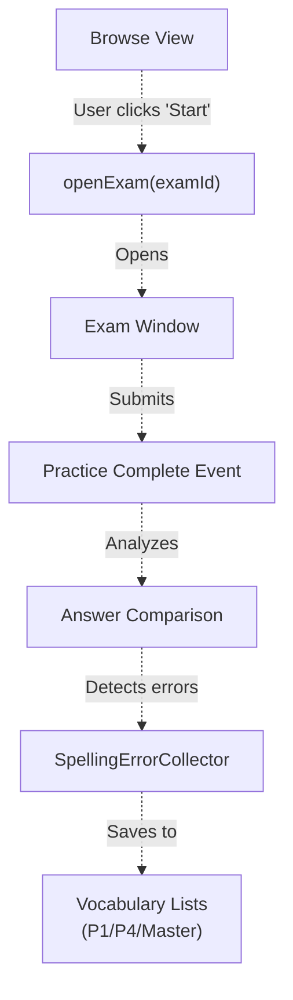

# Browse View & Exam List Management

> **Relevant source files**
> * [js/app/browseController.js](https://github.com/sallowayma-git/IELTS-practice/blob/92f64eb8/js/app/browseController.js)
> * [js/app/examActions.js](https://github.com/sallowayma-git/IELTS-practice/blob/92f64eb8/js/app/examActions.js)
> * [js/app/main-entry.js](https://github.com/sallowayma-git/IELTS-practice/blob/92f64eb8/js/app/main-entry.js)
> * [js/app/navigationMixin.js](https://github.com/sallowayma-git/IELTS-practice/blob/92f64eb8/js/app/navigationMixin.js)
> * [js/app/spellingErrorCollector.js](https://github.com/sallowayma-git/IELTS-practice/blob/92f64eb8/js/app/spellingErrorCollector.js)
> * [js/runtime/lazyLoader.js](https://github.com/sallowayma-git/IELTS-practice/blob/92f64eb8/js/runtime/lazyLoader.js)

## Purpose and Scope

This document explains the Browse View subsystem, which manages exam list presentation, filtering, and user interaction. The system is built around the collaboration between **BrowseController** (filter management and mode switching) and **ExamActions** (list loading and rendering). Key features include:

* **Multiple Filter Modes:** Default (category/type), P1 frequency, P4 frequency
* **Smart Exam Pinning:** Preferred exams automatically placed at top of filtered lists
* **Dynamic Filter UI:** Button generation based on current mode
* **Lazy Loading Integration:** Browse components loaded on-demand

For exam data structure, see [Exam Index & Metadata Structure](/sallowayma-git/IELTS-practice/6.1-exam-index-and-metadata-structure). For practice session initiation, see [Exam Window Management & Resource Resolution](/sallowayma-git/IELTS-practice/5.4-exam-window-management-and-resource-resolution).

---

## Architecture Overview

The Browse View is structured around two primary controllers that collaborate to manage exam browsing:

**BrowseController and ExamActions Collaboration:**



**Sources:** [js/app/browseController.js L1-L480](https://github.com/sallowayma-git/IELTS-practice/blob/92f64eb8/js/app/browseController.js#L1-L480)

 [js/app/examActions.js L1-L495](https://github.com/sallowayma-git/IELTS-practice/blob/92f64eb8/js/app/examActions.js#L1-L495)

 [js/runtime/lazyLoader.js L28-L44](https://github.com/sallowayma-git/IELTS-practice/blob/92f64eb8/js/runtime/lazyLoader.js#L28-L44)

 [js/app/main-entry.js L11-L18](https://github.com/sallowayma-git/IELTS-practice/blob/92f64eb8/js/app/main-entry.js#L11-L18)

---

## BrowseController: Mode and Filter Management

### BROWSE_MODES Configuration

The `BrowseController` operates in three distinct modes, each defined by a configuration object in `BROWSE_MODES`:

**Mode Configuration Structure:**



| Mode | Filter Logic | Base Path | Filters | Purpose |
| --- | --- | --- | --- | --- |
| `default` | `type-based` | None | all, reading, listening | Standard category/type filtering |
| `frequency-p1` | `folder-based` | `ListeningPractice/100 P1` | ultra-high, high, medium | P1 frequency-based browsing |
| `frequency-p4` | `folder-based` | `ListeningPractice/100 P4` | all, ultra-high, high, medium | P4 frequency-based browsing |

**Note:** The P4 mode includes an "all" filter that shows all numbered folders (1-10, 11-20, etc.), while P1 mode has no "all" option.

**Sources:** [js/app/browseController.js L25-L73](https://github.com/sallowayma-git/IELTS-practice/blob/92f64eb8/js/app/browseController.js#L25-L73)

### BrowseController Class Structure

**BrowseController Lifecycle:**



**Key Methods:**

| Method | Purpose | Implementation |
| --- | --- | --- |
| `initialize(containerId)` | Sets up controller with DOM container | [browseController.js L90-L104](https://github.com/sallowayma-git/IELTS-practice/blob/92f64eb8/browseController.js#L90-L104) |
| `setMode(mode)` | Switches between default/frequency modes | [browseController.js L110-L127](https://github.com/sallowayma-git/IELTS-practice/blob/92f64eb8/browseController.js#L110-L127) |
| `renderFilterButtons()` | Generates filter buttons from config | [browseController.js L140-L169](https://github.com/sallowayma-git/IELTS-practice/blob/92f64eb8/browseController.js#L140-L169) |
| `handleFilterClick(filterId)` | Processes user filter selection | [browseController.js L175-L183](https://github.com/sallowayma-git/IELTS-practice/blob/92f64eb8/browseController.js#L175-L183) |
| `applyFilter(filterId)` | Applies selected filter | [browseController.js L208-L218](https://github.com/sallowayma-git/IELTS-practice/blob/92f64eb8/browseController.js#L208-L218) |
| `filterByFolder(filterId)` | Folder-based filtering for frequency modes | [browseController.js L237-L275](https://github.com/sallowayma-git/IELTS-practice/blob/92f64eb8/browseController.js#L237-L275) |

**Sources:** [js/app/browseController.js L79-L347](https://github.com/sallowayma-git/IELTS-practice/blob/92f64eb8/js/app/browseController.js#L79-L347)

### Filter State Integration

The `BrowseController` integrates with the global state management system:

**State Methods in BrowseController:**

```sql
// Set filter state (updates appStateService)
setBrowseFilterState(category, type)

// Get current filter values
getCurrentCategory()      // Returns 'all', 'P1', 'P2', etc.
getCurrentExamType()      // Returns 'all', 'reading', 'listening'

// Update browse title based on mode/filter
updateBrowseTitle()

// Apply unified filter (delegates to ExamActions)
applyBrowseFilter(category, type, options)
```

**State Priority:**

1. `appStateService.getBrowseFilter()` (if available)
2. `window.__browseFilter` (fallback)
3. Default: `{category: 'all', type: 'all'}`

**Sources:** [js/app/browseController.js L357-L454](https://github.com/sallowayma-git/IELTS-practice/blob/92f64eb8/js/app/browseController.js#L357-L454)

---

## ExamActions: List Loading and Rendering

### loadExamList() - Core Filtering Logic

The `ExamActions.loadExamList()` function is the central orchestrator for exam list display:

**loadExamList() Execution Flow:**



**Filtering Steps (lines 40-112):**

1. **Frequency Mode Check** (lines 23-38): If `__browseFilterMode` is set and not 'default', delegates to `BrowseController`
2. **Snapshot Acquisition** (lines 40-48): Gets exam index from `appStateService` or global fallback
3. **Type Filtering** (lines 72-74): If `activeExamType !== 'all'`, filters by `exam.type`
4. **Category Filtering** (lines 75-81): If `activeCategory !== 'all'`, filters by `exam.category`
5. **Path Filtering** (lines 82-87): In frequency mode, filters by `exam.path.includes(basePath)`
6. **Pinning Logic** (lines 89-112): See next section

**Sources:** [js/app/examActions.js L19-L129](https://github.com/sallowayma-git/IELTS-practice/blob/92f64eb8/js/app/examActions.js#L19-L129)

### Exam Pinning System

The `preferredFirstExamByCategory` object defines exams that should appear first when specific category/type combinations are active:

**Pinning Configuration:**

```javascript
const preferredFirstExamByCategory = {
    'P1_reading': { id: 'p1-09', title: 'Listening to the Ocean 海洋探测' },
    'P2_reading': { id: 'p2-high-12', title: 'The fascinating world of attine ants 切叶蚁' },
    'P3_reading': { id: 'p3-high-11', title: 'The Fruit Book 果实之书' },
    'P1_listening': { id: 'listening-p3-01', title: 'Julia and Bob's science project is due' },
    'P3_listening': { id: 'listening-p3-02', title: 'Climate change and allergies' }
};
```

**Pinning Algorithm (lines 89-112):**



**Pinning behavior:**

* Only applies when both category and type are specific (not 'all')
* First attempts to find exam by `preferred.id`
* Falls back to matching by `preferred.title`, category, and type
* Moves matched exam to position 0 in the filtered list

**Sources:** [js/app/examActions.js L6-L12](https://github.com/sallowayma-git/IELTS-practice/blob/92f64eb8/js/app/examActions.js#L6-L12)

 [js/app/examActions.js L90-L112](https://github.com/sallowayma-git/IELTS-practice/blob/92f64eb8/js/app/examActions.js#L90-L112)

### displayExams() - Rendering

The `displayExams()` function handles the actual DOM rendering:

**Rendering Strategy:**



**LegacyExamListView vs. Fallback:**

| Rendering Path | When Used | DOM Generation |
| --- | --- | --- |
| `LegacyExamListView.render()` | When view instance available from BrowseController | Uses `DOMAdapter` or `DOMBuilder` |
| `createExamCard()` fallback | When view not initialized | Direct `document.createElement()` |

**Exam Card Structure (fallback):**

```html
<div class="exam-item" data-exam-id="p1-09">
  <div class="exam-info">
    <h4>Exam Title</h4>
    <div class="exam-meta">P1 | reading</div>
  </div>
  <div class="exam-actions">
    <button data-action="start" data-exam-id="p1-09">开始练习</button>
    <button data-action="pdf" data-exam-id="p1-09">PDF</button>
  </div>
</div>
```

**Sources:** [js/app/examActions.js L179-L237](https://github.com/sallowayma-git/IELTS-practice/blob/92f64eb8/js/app/examActions.js#L179-L237)

 [js/app/examActions.js L269-L324](https://github.com/sallowayma-git/IELTS-practice/blob/92f64eb8/js/app/examActions.js#L269-L324)

---

## Event Handling and User Actions

### setupExamActionHandlers()

The `setupExamActionHandlers()` function installs event delegation for exam action buttons:

**Event Delegation Pattern:**



**Supported Actions:**

| data-action | Target Function | Purpose |
| --- | --- | --- |
| `start` | `global.openExam(examId)` | Opens exam in practice window |
| `pdf` | `global.viewPDF(examId)` | Views exam PDF (if available) |
| `generate` | `global.generateHTML(examId)` | Generates HTML from PDF (legacy) |

**Event Delegation Strategy:**

* Prefers `DOM.delegate()` if available (from DOM utilities)
* Falls back to `document.addEventListener` with `closest()` selector
* Uses idempotency flag to prevent duplicate handlers
* Scoped to `#exam-list-container` to avoid conflicts

**Sources:** [js/app/examActions.js L332-L393](https://github.com/sallowayma-git/IELTS-practice/blob/92f64eb8/js/app/examActions.js#L332-L393)

### Reset Functionality

The `resetBrowseViewToAll()` function clears all filters and returns to default mode:

**Reset Sequence:**

```

```

**Reset Actions:**

1. Clears `__browseFilterMode` to `'default'`
2. Clears `__browsePath` to `null`
3. Calls `browseController.resetToDefault()` if available
4. Sets filter state to `('all', 'all')`
5. Reloads exam list

**Sources:** [js/app/examActions.js L134-L174](https://github.com/sallowayma-git/IELTS-practice/blob/92f64eb8/js/app/examActions.js#L134-L174)

---

## Lazy Loading Integration

### Browse Group Definition

The browse-view components are organized into a lazy-loaded script group:

**browse-view Group Scripts (loaded sequentially):**

```
manifest['browse-view'] = [
    'js/app/examActions.js',              // Exam list loading and rendering
    'js/app/state-service.js',            // State management
    'js/app/browseController.js',         // Filter management
    'js/services/libraryManager.js',      // Library switching
    'js/presentation/message-center.js',  // User notifications
    'js/runtime/legacy-state-adapter.js', // Compatibility layer
    'js/components/PDFHandler.js',        // PDF viewing
    'js/components/SystemDiagnostics.js', // System diagnostics
    'js/components/PerformanceOptimizer.js', // Rendering optimization
    'js/components/DataIntegrityManager.js', // Data export/import
    'js/components/BrowseStateManager.js',   // Browse state persistence
    'js/utils/dataConsistencyManager.js',    // Data validation
    'js/utils/answerComparisonUtils.js',     // Answer comparison
    'js/utils/BrowsePreferencesUtils.js',    // Preference management
    'js/main.js'                             // Legacy main logic
];
```

**Sources:** [js/runtime/lazyLoader.js L28-L45](https://github.com/sallowayma-git/IELTS-practice/blob/92f64eb8/js/runtime/lazyLoader.js#L28-L45)

### Load Sequence

**Bootstrap to Browse View:**



**Load Triggers:**

1. **Pre-load on bootstrap** - `main-entry.js` calls `ensureBrowseGroup()` during initialization
2. **On examIndexLoaded event** - Triggered after exam data loads
3. **Idle time pre-load** - If not already loaded, loads during idle callback

**Sources:** [js/app/main-entry.js L11-L18](https://github.com/sallowayma-git/IELTS-practice/blob/92f64eb8/js/app/main-entry.js#L11-L18)

 [js/app/main-entry.js L190-L204](https://github.com/sallowayma-git/IELTS-practice/blob/92f64eb8/js/app/main-entry.js#L190-L204)

 [js/app/main-entry.js L228-L231](https://github.com/sallowayma-git/IELTS-practice/blob/92f64eb8/js/app/main-entry.js#L228-L231)

### Proxy Functions

Before the browse-view group loads, proxy functions provide lazy-loading behavior:

**Proxy Pattern:**

```javascript
// In main-entry.js
if (typeof global.loadExamList !== 'function') {
    global.loadExamList = proxyAfterGroup('browse-view', function () {
        return global.__legacyLoadExamList || global.loadExamList;
    });
}
```

**Proxied Functions:**

* `loadExamList()` - Loads browse group, then calls actual implementation
* `resetBrowseViewToAll()` - Loads browse group, then resets filters
* `showLibraryLoaderModal()` - Loads browse group, then shows modal

**Sources:** [js/app/main-entry.js L83-L97](https://github.com/sallowayma-git/IELTS-practice/blob/92f64eb8/js/app/main-entry.js#L83-L97)

 [js/app/main-entry.js L154-L176](https://github.com/sallowayma-git/IELTS-practice/blob/92f64eb8/js/app/main-entry.js#L154-L176)

---

## Navigation Integration

### navigationMixin Integration

The browse view is integrated into the navigation system through the `navigationMixin`:

**browseCategory() Method:**

```sql
browseCategory(category, type = null, filterMode = null, path = null) {
    // Record pending filter
    window.__pendingBrowseFilter = { category, type, filterMode, path };
    
    // Request auto-scroll
    if (typeof window.requestBrowseAutoScroll === 'function') {
        window.requestBrowseAutoScroll(category, type);
    }
    
    // Navigate to browse view
    this.navigateToView('browse');
    
    // Immediately apply if browse view already active
    if (typeof window.applyBrowseFilter === 'function' 
        && document.getElementById('browse-view')?.classList.contains('active')) {
        window.applyBrowseFilter(category, type, filterMode, path);
        delete window.__pendingBrowseFilter;
    }
}
```

**Pending Filter Pattern:**

When navigating to browse view from another view (e.g., Overview dashboard):

1. **Request Phase:** * Caller sets `window.__pendingBrowseFilter` with desired filter * Optionally calls `requestBrowseAutoScroll()` for scroll positioning
2. **Navigation Phase:** * `navigateToView('browse')` activates browse view * View activation triggers `onViewActivated('browse')`
3. **Consumption Phase:** * If `__pendingBrowseFilter` exists, applies it via `applyBrowseFilter()` * Clears pending filter after application * If browse view not yet active, filter applied when view becomes active

**Sources:** [js/app/navigationMixin.js L108-L134](https://github.com/sallowayma-git/IELTS-practice/blob/92f64eb8/js/app/navigationMixin.js#L108-L134)

### Repeat Navigation Behavior

The `NavigationController` handles repeated clicks on the browse navigation button:

```javascript
onRepeatNavigate: function onRepeatNavigate(viewName) {
    if (viewName === 'browse' && typeof global.resetBrowseViewToAll === 'function') {
        global.resetBrowseViewToAll();
    }
}
```

**Behavior:** Clicking "Browse" nav button when already on browse view resets all filters to show all exams.

**Sources:** [js/app/main-entry.js L62-L66](https://github.com/sallowayma-git/IELTS-practice/blob/92f64eb8/js/app/main-entry.js#L62-L66)

---

## Complete Data Flow: Filter to Render

**User Selects Filter → Exam List Rendered:**



**Sources:** [js/app/browseController.js L175-L218](https://github.com/sallowayma-git/IELTS-practice/blob/92f64eb8/js/app/browseController.js#L175-L218)

 [js/app/examActions.js L19-L129](https://github.com/sallowayma-git/IELTS-practice/blob/92f64eb8/js/app/examActions.js#L19-L129)

 [js/app/examActions.js L179-L237](https://github.com/sallowayma-git/IELTS-practice/blob/92f64eb8/js/app/examActions.js#L179-L237)

---

## Integration with Spelling Error Collection

The browse view indirectly connects to the spelling error collection system through practice sessions:

**Integration Path:**



**Error Detection Context:**

The `SpellingErrorCollector` uses the `examId` from the browse view to determine which vocabulary list to update:

```
// In spellingErrorCollector.js
detectSource(examId) {
    if (examId.includes('p1') || examId.includes('part1')) return 'p1';
    if (examId.includes('p4') || examId.includes('part4')) return 'p4';
    if (examId.includes('100 p1') || examId.includes('100p1')) return 'p1';
    if (examId.includes('100 p4') || examId.includes('100p4')) return 'p4';
    return 'other';
}
```

When a user practices an exam from the P1 or P4 frequency modes, spelling errors are automatically categorized and saved to the corresponding vocabulary list.

**Sources:** [js/app/spellingErrorCollector.js L120-L151](https://github.com/sallowayma-git/IELTS-practice/blob/92f64eb8/js/app/spellingErrorCollector.js#L120-L151)

 [js/app/examActions.js L346-L349](https://github.com/sallowayma-git/IELTS-practice/blob/92f64eb8/js/app/examActions.js#L346-L349)

---

## Key Data Structures

### BrowseMode Configuration

```
interface BrowseMode {
  id: string;                    // 'default' | 'frequency-p1' | 'frequency-p4'
  filters: FilterConfig[];       // Array of filter button configs
  filterLogic: string;           // 'type-based' | 'folder-based'
  basePath?: string;             // Optional: base path for folder filtering
  folderMap?: {                  // Optional: filter ID to folder names
    [filterId: string]: string[];
  };
}

interface FilterConfig {
  id: string;      // Filter identifier (e.g., 'all', 'ultra-high')
  label: string;   // Display label for button
  type?: string;   // For type-based filters: 'all' | 'reading' | 'listening'
  folder?: string; // For folder-based filters: folder name pattern
}
```

**Example:**

```yaml
'frequency-p1': {
    id: 'frequency-p1',
    basePath: 'ListeningPractice/100 P1',
    filters: [
        { id: 'ultra-high', label: '超高频', folder: 'P1 超高频（43）' },
        { id: 'high', label: '高频', folder: 'P1 高频（35）' },
        { id: 'medium', label: '中频', folder: 'P1 中频(48)' }
    ],
    filterLogic: 'folder-based',
    folderMap: {
        'ultra-high': ['P1 超高频（43）'],
        'high': ['P1 高频（35）'],
        'medium': ['P1 中频(48)']
    }
}
```

**Sources:** [js/app/browseController.js L25-L73](https://github.com/sallowayma-git/IELTS-practice/blob/92f64eb8/js/app/browseController.js#L25-L73)

### Preferred Exam Pinning

```typescript
interface PreferredExam {
  id: string;      // Exam ID for primary lookup
  title: string;   // Exam title for fallback lookup
}

const preferredFirstExamByCategory: {
  [key: string]: PreferredExam;  // Key format: '{category}_{type}'
}
```

**Pinning Keys:**

* `'P1_reading'`, `'P2_reading'`, `'P3_reading'`
* `'P1_listening'`, `'P3_listening'`

**Sources:** [js/app/examActions.js L6-L12](https://github.com/sallowayma-git/IELTS-practice/blob/92f64eb8/js/app/examActions.js#L6-L12)

### BrowseController Instance State

```python
class BrowseController {
  currentMode: string;           // 'default' | 'frequency-p1' | 'frequency-p4'
  activeFilter: string;          // Current active filter ID
  buttonContainer: HTMLElement | null;  // DOM element for filter buttons
  _examListViewInstance: any;    // LegacyExamListView instance (optional)
}
```

**Global Instance:** `window.browseController` - Created at module load time.

**Sources:** [js/app/browseController.js L79-L84](https://github.com/sallowayma-git/IELTS-practice/blob/92f64eb8/js/app/browseController.js#L79-L84)

 [js/app/browseController.js L476](https://github.com/sallowayma-git/IELTS-practice/blob/92f64eb8/js/app/browseController.js#L476-L476)

---

## Performance Considerations

### Sequential Script Loading

The `browse-view` group uses sequential loading to ensure dependencies are available:

```javascript
// In lazyLoader.js
function sequentialLoad(files) {
    return files.reduce(function chain(promise, file) {
        return promise.then(function next() {
            return loadScript(file);
        });
    }, Promise.resolve());
}
```

**Why Sequential:**

* `examActions.js` must load before `main.js` to avoid proxy shims
* `browseController.js` creates global instance used by other scripts
* `state-service.js` provides services consumed by later scripts

**Sources:** [js/runtime/lazyLoader.js L94-L100](https://github.com/sallowayma-git/IELTS-practice/blob/92f64eb8/js/runtime/lazyLoader.js#L94-L100)

### Event Delegation for Action Buttons

Rather than attaching individual click handlers to each exam card, the system uses event delegation:

**Benefits:**

* Single event listener for entire container
* Works with dynamically rendered content
* Lower memory footprint for large exam lists
* No need to re-bind after re-renders

**Implementation:**

```javascript
// Prefers DOM.delegate if available
DOM.delegate('click', '[data-action="start"]', function (event) {
    invoke(this, event);
});

// Fallback: document-level listener with closest() check
document.addEventListener('click', function (event) {
    var target = event.target.closest('[data-action]');
    if (!target || !container.contains(target)) return;
    invoke(target, event);
});
```

**Sources:** [js/app/examActions.js L361-L389](https://github.com/sallowayma-git/IELTS-practice/blob/92f64eb8/js/app/examActions.js#L361-L389)

### Idempotency in Handler Setup

The `examActionHandlersConfigured` flag prevents duplicate event listeners:

```javascript
var examActionHandlersConfigured = false;

function setupExamActionHandlers() {
    if (examActionHandlersConfigured) {
        return;  // Already configured, skip
    }
    // ... setup logic
    examActionHandlersConfigured = true;
}
```

This ensures handlers are only registered once, even if `displayExams()` is called multiple times.

**Sources:** [js/app/examActions.js L330-L335](https://github.com/sallowayma-git/IELTS-practice/blob/92f64eb8/js/app/examActions.js#L330-L335)

---

## Edge Cases and Error Handling

### Missing State Service

If `appStateService` is unavailable, the system falls back to global variables:

```typescript
function getBrowseFilterState() {
    if (stateService) {
        return stateService.getBrowseFilter();
    }
    return {
        category: window.__browseFilter?.category || 'all',
        type: window.__browseFilter?.type || 'all'
    };
}
```

**Sources:** [js/main.js L211-L218](https://github.com/sallowayma-git/IELTS-practice/blob/92f64eb8/js/main.js#L211-L218)

### Invalid Scroll Positions

The system sanitizes scroll positions during persistence:

* **Validation:** `Number.isFinite(numeric) && numeric >= 0`
* **Rounding:** `Math.round(numeric)`
* **Minimum:** `Math.max(0, scrollTop)`

Invalid values are silently discarded.

**Sources:** [js/main.js L446-L461](https://github.com/sallowayma-git/IELTS-practice/blob/92f64eb8/js/main.js#L446-L461)

### Expired Auto-Scroll Requests

Auto-scroll requests expire after 5 seconds:

```javascript
const now = Date.now();
if (now - pendingBrowseAutoScroll.timestamp > 5000) {
    pendingBrowseAutoScroll = null;
    return null;
}
```

This prevents stale scroll requests from interfering with user navigation.

**Sources:** [js/main.js L664-L668](https://github.com/sallowayma-git/IELTS-practice/blob/92f64eb8/js/main.js#L664-L668)

### Element Not Found

If `scrollExamListToEntry()` cannot find the target element after all retries:

1. Returns `false`
2. Caller (`handlePostExamListRender`) falls back to next priority level
3. Ultimately falls back to stored scroll position or top of list

**Sources:** [js/main.js L844-L870](https://github.com/sallowayma-git/IELTS-practice/blob/92f64eb8/js/main.js#L844-L870)

 [js/main.js L896-L936](https://github.com/sallowayma-git/IELTS-practice/blob/92f64eb8/js/main.js#L896-L936)