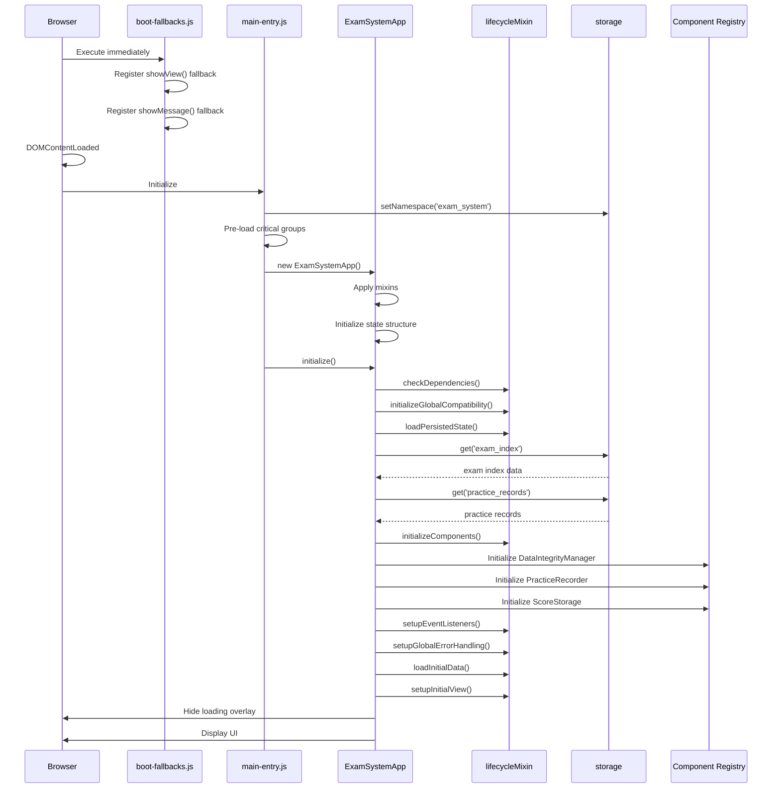
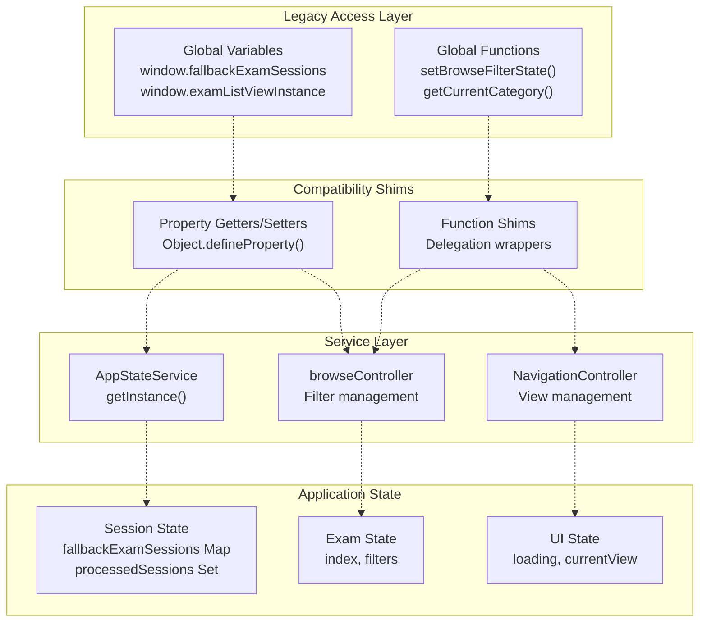

# Core Application Architecture

> **Relevant source files**
> * [css/heroui-bridge.css](https://github.com/sallowayma-git/IELTS-practice/blob/92f64eb8/css/heroui-bridge.css)
> * [css/main.css](https://github.com/sallowayma-git/IELTS-practice/blob/92f64eb8/css/main.css)
> * [index.html](https://github.com/sallowayma-git/IELTS-practice/blob/92f64eb8/index.html)
> * [js/app.js](https://github.com/sallowayma-git/IELTS-practice/blob/92f64eb8/js/app.js)
> * [js/app/lifecycleMixin.js](https://github.com/sallowayma-git/IELTS-practice/blob/92f64eb8/js/app/lifecycleMixin.js)
> * [js/boot-fallbacks.js](https://github.com/sallowayma-git/IELTS-practice/blob/92f64eb8/js/boot-fallbacks.js)
> * [js/components/DataIntegrityManager.js](https://github.com/sallowayma-git/IELTS-practice/blob/92f64eb8/js/components/DataIntegrityManager.js)
> * [js/main.js](https://github.com/sallowayma-git/IELTS-practice/blob/92f64eb8/js/main.js)
> * [js/script.js](https://github.com/sallowayma-git/IELTS-practice/blob/92f64eb8/js/script.js)

## Purpose and Scope

This document describes the core application architecture of the IELTS practice system, focusing on the main application instance, initialization flow, state management approach, and the mixin-based composition pattern used throughout the codebase. It covers the bootstrap sequence from page load to fully initialized application state.

For information about theme-specific entry points and theme adapters, see [Theme System & UI Architecture](/sallowayma-git/IELTS-practice/7-theme-system-and-ui-architecture). For details on data persistence and repositories, see [Data Management System](/sallowayma-git/IELTS-practice/4-data-management-system). For the practice session lifecycle and window management, see [Practice Session System](/sallowayma-git/IELTS-practice/5-practice-session-system).

---

## Core Application Components

The application architecture consists of several key components that work together to provide a robust, extensible system:

| Component | Primary Class/File | Responsibility |
| --- | --- | --- |
| Main Application Instance | `ExamSystemApp` | Orchestrates all subsystems, manages lifecycle |
| Bootstrap Coordinator | `main-entry.js` | Coordinates lazy loading and initialization |
| Resilience Layer | `boot-fallbacks.js` | Provides fallback implementations |
| State Management | `AppStateService` | Centralized state management service |
| Legacy Compatibility | `LegacyStateAdapter` | Bridges global variables to services |
| Navigation Controller | `NavigationController` | Manages view switching and routing |
| Component Registry | `app.components` | Holds references to initialized components |

**Sources:** [js/app.js L1-L132](https://github.com/sallowayma-git/IELTS-practice/blob/92f64eb8/js/app.js#L1-L132)

 [js/main.js L1-L120](https://github.com/sallowayma-git/IELTS-practice/blob/92f64eb8/js/main.js#L1-L120)

 [js/boot-fallbacks.js L1-L100](https://github.com/sallowayma-git/IELTS-practice/blob/92f64eb8/js/boot-fallbacks.js#L1-L100)

---

## ExamSystemApp Class Structure

The `ExamSystemApp` class serves as the main application instance, using a mixin-based architecture for modularity.

### Core State Structure

The application maintains a centralized state object with the following structure:

```yaml
this.state = {
    exam: {
        index: [],
        currentCategory: 'all',
        currentExamType: 'all',
        filteredExams: [],
        configurations: {},
        activeConfigKey: 'exam_index'
    },
    practice: {
        records: [],
        selectedRecords: new Set(),
        bulkDeleteMode: false,
        dataCollector: null
    },
    ui: {
        browseFilter: { category: 'all', type: 'all' },
        pendingBrowseFilter: null,
        legacyBrowseType: 'all',
        currentVirtualScroller: null,
        loading: false,
        loadingMessage: ''
    },
    components: {
        dataIntegrityManager: null,
        pdfHandler: null,
        browseStateManager: null,
        practiceListScroller: null
    },
    system: {
        processedSessions: new Set(),
        fallbackExamSessions: new Map(),
        failedScripts: new Set()
    }
};
```

**Sources:** [js/app.js L6-L62](https://github.com/sallowayma-git/IELTS-practice/blob/92f64eb8/js/app.js#L6-L62)

### Mixin Application

The application applies multiple mixins to the `ExamSystemApp.prototype` during bootstrap:

```
Object.assign(ExamSystemApp.prototype,
    mixins.state || {},
    mixins.bootstrap || {},
    mixins.lifecycle || {},
    mixins.navigation || {},
    mixins.examSession || {},
    mixins.suitePractice || {},
    mixins.fallback || {}
);
```

**Diagram: ExamSystemApp Composition**

```mermaid
flowchart TD

App["ExamSystemApp<br>Main Instance"]
StateMixin["stateMixin<br>State get/set methods"]
BootstrapMixin["bootstrapMixin<br>checkDependencies()"]
LifecycleMixin["lifecycleMixin<br>initialize(), destroy()"]
NavigationMixin["navigationMixin<br>navigateToView()"]
SessionMixin["examSessionMixin<br>openExam(), sessionTracking"]
SuiteMixin["suitePracticeMixin<br>Suite session management"]
FallbackMixin["fallbackMixin<br>Fallback handling"]
ExamState["state.exam<br>index, filters"]
PracticeState["state.practice<br>records, selections"]
UIState["state.ui<br>loading, filters"]
SystemState["state.system<br>sessions, errors"]
DataIntegrity["dataIntegrityManager"]
PracticeRecorder["practiceRecorder"]
ScoreStorage["scoreStorage"]
BrowseController["browseController"]

App -.-> StateMixin
App -.-> BootstrapMixin
App -.-> LifecycleMixin
App -.-> NavigationMixin
App -.-> SessionMixin
App -.-> SuiteMixin
App -.-> FallbackMixin
App -.-> ExamState
App -.-> PracticeState
App -.-> UIState
App -.-> SystemState
App -.-> DataIntegrity
App -.-> PracticeRecorder
App -.-> ScoreStorage
App -.-> BrowseController

subgraph subGraph2 ["Component Registry"]
    DataIntegrity
    PracticeRecorder
    ScoreStorage
    BrowseController
end

subgraph subGraph1 ["Core State"]
    ExamState
    PracticeState
    UIState
    SystemState
end

subgraph subGraph0 ["Mixin Layer"]
    StateMixin
    BootstrapMixin
    LifecycleMixin
    NavigationMixin
    SessionMixin
    SuiteMixin
    FallbackMixin
end
```



**Sources:** [js/app.js L64-L81](https://github.com/sallowayma-git/IELTS-practice/blob/92f64eb8/js/app.js#L64-L81)

 [js/app/lifecycleMixin.js L1-L607](https://github.com/sallowayma-git/IELTS-practice/blob/92f64eb8/js/app/lifecycleMixin.js#L1-L607)

---

## Application Bootstrap Sequence

The application follows a multi-stage bootstrap process designed for resilience and progressive enhancement:

### Stage 1: Immediate Resilience (boot-fallbacks.js)

Executes before `DOMContentLoaded` to provide baseline functionality:

```javascript
// Fallback navigation
if (typeof window.showView !== 'function') {
    window.showView = function (viewName, resetCategory) {
        // Basic view switching without dependencies
    };
}

// Fallback message system
if (typeof window.showMessage !== 'function') {
    window.showMessage = function (message, type, duration) {
        // Basic toast notifications
    };
}
```

**Sources:** [js/boot-fallbacks.js L4-L59](https://github.com/sallowayma-git/IELTS-practice/blob/92f64eb8/js/boot-fallbacks.js#L4-L59)

 [js/boot-fallbacks.js L248-L283](https://github.com/sallowayma-git/IELTS-practice/blob/92f64eb8/js/boot-fallbacks.js#L248-L283)

### Stage 2: Core Initialization (main-entry.js)

The `main-entry.js` file coordinates lazy loading and creates the application instance:

1. Set storage namespace
2. Pre-load critical script groups
3. Instantiate `ExamSystemApp`
4. Trigger `initialize()` method

**Sources:** [js/app/main-entry.js](https://github.com/sallowayma-git/IELTS-practice/blob/92f64eb8/js/app/main-entry.js)

 (referenced but not fully provided)

### Stage 3: Application Initialization (app.js)

The `ExamSystemApp.initialize()` method executes the full initialization sequence:

**Diagram: Initialization Sequence**



**Sources:** [js/app.js L86-L124](https://github.com/sallowayma-git/IELTS-practice/blob/92f64eb8/js/app.js#L86-L124)

 [js/app/lifecycleMixin.js L6-L70](https://github.com/sallowayma-git/IELTS-practice/blob/92f64eb8/js/app/lifecycleMixin.js#L6-L70)

---

## State Management Architecture

The application uses a dual-layer state management approach to maintain backward compatibility while migrating to a service-based architecture.

### AppStateService Layer

The `AppStateService` provides centralized state management:

```python
class AppStateService {
    constructor() {
        this._state = {
            fallbackExamSessions: new Map(),
            processedSessions: new Set(),
            // ... other state
        };
    }
    
    getFallbackExamSessions() { return this._state.fallbackExamSessions; }
    setFallbackExamSessions(value) { this._state.fallbackExamSessions = value; }
    // ... other accessors
}
```

**Sources:** [js/services/appStateService.js](https://github.com/sallowayma-git/IELTS-practice/blob/92f64eb8/js/services/appStateService.js)

 (referenced in main.js)

### Legacy Compatibility Shims

The `main.js` file provides property shims for backward compatibility with global variables:

```javascript
Object.defineProperty(window, 'fallbackExamSessions', {
    get: function () {
        if (window.appStateService) {
            return window.appStateService.getFallbackExamSessions();
        }
        // Fallback to temporary Map
        if (!window.__legacyFallbackExamSessions) {
            window.__legacyFallbackExamSessions = new Map();
        }
        return window.__legacyFallbackExamSessions;
    },
    set: function (value) {
        if (window.appStateService && value instanceof Map) {
            window.appStateService.setFallbackExamSessions(value);
        } else {
            window.__legacyFallbackExamSessions = value;
        }
    },
    configurable: true
});
```

**Sources:** [js/main.js L12-L31](https://github.com/sallowayma-git/IELTS-practice/blob/92f64eb8/js/main.js#L12-L31)

 [js/main.js L34-L46](https://github.com/sallowayma-git/IELTS-practice/blob/92f64eb8/js/main.js#L34-L46)

### Function Shims

Function calls are shimmed to delegate to the appropriate controllers:

```javascript
// Shim for browse filter state
if (typeof window.setBrowseFilterState !== 'function') {
    window.setBrowseFilterState = function (category, type) {
        if (window.browseController && typeof window.browseController.setBrowseFilterState === 'function') {
            window.browseController.setBrowseFilterState(category, type);
        }
    };
}
```

**Sources:** [js/main.js L146-L153](https://github.com/sallowayma-git/IELTS-practice/blob/92f64eb8/js/main.js#L146-L153)

**Diagram: State Management Flow**



**Sources:** [js/main.js L5-L83](https://github.com/sallowayma-git/IELTS-practice/blob/92f64eb8/js/main.js#L5-L83)

 [js/main.js L142-L200](https://github.com/sallowayma-git/IELTS-practice/blob/92f64eb8/js/main.js#L142-L200)

---

## Mixin Composition Pattern

The application uses mixins to separate concerns and enable modular feature composition. Each mixin is defined in its own file and applied to `ExamSystemApp.prototype`.

### Available Mixins

| Mixin File | Key Methods | Responsibility |
| --- | --- | --- |
| `stateMixin.js` | `getState()`, `setState()`, `persistState()` | State access and persistence |
| `bootstrapMixin.js` | `checkDependencies()`, `ensureStorage()` | Dependency validation |
| `lifecycleMixin.js` | `initialize()`, `destroy()`, `setupEventListeners()` | Application lifecycle |
| `navigationMixin.js` | `navigateToView()`, `onViewActivated()` | View management |
| `examSessionMixin.js` | `openExam()`, `trackSession()` | Exam window management |
| `suitePracticeMixin.js` | `startSuiteSession()`, `aggregateResults()` | Suite practice mode |
| `fallbackMixin.js` | `handleMissingDependency()` | Error recovery |

**Sources:** [js/app.js L64-L81](https://github.com/sallowayma-git/IELTS-practice/blob/92f64eb8/js/app.js#L64-L81)

### Lifecycle Mixin Methods

The `lifecycleMixin` provides the core initialization and teardown logic:

```
async initialize() {
    try {
        this.showLoading(true);
        this.updateLoadingMessage('正在检查系统依赖...');
        this.checkDependencies();
        
        this.updateLoadingMessage('正在初始化状态管理...');
        this.initializeGlobalCompatibility();
        
        this.updateLoadingMessage('正在加载持久化状态...');
        await this.loadPersistedState();
        
        this.updateLoadingMessage('正在初始化响应式功能...');
        this.initializeResponsiveFeatures();
        
        this.updateLoadingMessage('正在加载系统组件...');
        await this.initializeComponents();
        
        this.updateLoadingMessage('正在设置事件监听器...');
        this.setupEventListeners();
        
        if (typeof window.initializeLegacyComponents === 'function') {
            await window.initializeLegacyComponents();
        }
        
        await this.loadInitialData();
        this.setupInitialView();
        this.startSessionMonitoring();
        this.setupGlobalErrorHandling();
        
        this.isInitialized = true;
        this.showLoading(false);
        this.showUserMessage('系统初始化完成', 'success');
    } catch (error) {
        this.handleInitializationError(error);
    }
}
```

**Sources:** [js/app/lifecycleMixin.js L6-L70](https://github.com/sallowayma-git/IELTS-practice/blob/92f64eb8/js/app/lifecycleMixin.js#L6-L70)

---

## Component Initialization and Registry

The application maintains a registry of initialized components in `app.components`:

### Component Initialization Flow

```
async initializeComponents() {
    // Data Integrity Manager
    if (window.DataIntegrityManager) {
        this.components.dataIntegrityManager = new DataIntegrityManager();
    }
    
    // Practice Recorder
    if (window.PracticeRecorder) {
        this.components.practiceRecorder = new PracticeRecorder();
    }
    
    // Score Storage
    if (window.ScoreStorage) {
        this.components.scoreStorage = new ScoreStorage();
    }
    
    // Browse Controller
    if (window.BrowseController) {
        this.components.browseController = new BrowseController();
    }
}
```

**Sources:** [js/main.js L281-L320](https://github.com/sallowayma-git/IELTS-practice/blob/92f64eb8/js/main.js#L281-L320)

### Legacy Component Initialization

The `initializeLegacyComponents()` function in `main.js` initializes components that aren't yet fully migrated:

```javascript
async function initializeLegacyComponents() {
    try { showMessage('系统准备就绪', 'success'); } catch (_) { }
    
    try {
        ensureLegacyNavigation({ initialView: 'overview' });
    } catch (error) {
        console.warn('[Navigation] 初始化导航控制器失败:', error);
    }
    
    setupBrowsePreferenceUI();
    
    // Setup UI Listeners
    const folderPicker = document.getElementById('folder-picker');
    if (folderPicker) {
        folderPicker.addEventListener('change', handleFolderSelection);
    }
    
    // Initialize components
    if (window.PDFHandler) {
        pdfHandler = new PDFHandler();
    }
    if (window.BrowseStateManager) {
        browseStateManager = new BrowseStateManager();
    }
    if (window.DataIntegrityManager) {
        window.dataIntegrityManager = new DataIntegrityManager();
    }
    if (window.PerformanceOptimizer) {
        window.performanceOptimizer = new PerformanceOptimizer();
    }
}
```

**Sources:** [js/main.js L281-L347](https://github.com/sallowayma-git/IELTS-practice/blob/92f64eb8/js/main.js#L281-L347)

---

## Global Error Handling

The application implements comprehensive error handling at multiple levels:

### Unhandled Promise Rejections

```javascript
window.addEventListener('unhandledrejection', (event) => {
    console.error('[App] 未处理的Promise拒绝:', event.reason);
    this.handleGlobalError(event.reason, 'Promise拒绝');
    event.preventDefault();
});
```

### JavaScript Errors

```javascript
window.addEventListener('error', (event) => {
    console.error('[App] JavaScript错误:', event.error);
    this.handleGlobalError(event.error, 'JavaScript错误');
});
```

### Error Aggregation and Rate Limiting

```javascript
handleGlobalError(error, context) {
    try {
        if (!this.globalErrors) {
            this.globalErrors = [];
        }
        
        this.globalErrors.push({
            error: normalizedError.message || String(error),
            context: context,
            timestamp: Date.now(),
            stack: normalizedError.stack
        });
        
        // Limit error records
        if (this.globalErrors.length > 100) {
            this.globalErrors = this.globalErrors.slice(-50);
        }
        
        // Rate limiting: check recent errors
        const recentErrors = this.globalErrors.filter(
            e => Date.now() - e.timestamp < 60000
        );
        
        if (recentErrors.length > 5) {
            this.showUserMessage('系统遇到多个错误，建议刷新页面', 'warning');
        }
    } catch (handlingError) {
        console.error('[App] 错误处理失败:', handlingError);
    }
}
```

**Sources:** [js/app/lifecycleMixin.js L109-L167](https://github.com/sallowayma-git/IELTS-practice/blob/92f64eb8/js/app/lifecycleMixin.js#L109-L167)

---

## Event System

The application uses a combination of event delegation and direct event listeners:

### Navigation Event Delegation

```javascript
document.addEventListener('click', (e) => {
    const navBtn = e.target.closest('.nav-btn');
    if (navBtn) {
        const view = navBtn.dataset.view;
        if (view) {
            this.navigateToView(view);
        }
    }
    
    const backBtn = e.target.closest('.btn-back');
    if (backBtn) {
        this.navigateToView('overview');
    }
    
    const actionBtn = e.target.closest('[data-action]');
    if (actionBtn) {
        const action = actionBtn.dataset.action;
        const category = actionBtn.dataset.category;
        this.handleCategoryAction(action, category);
    }
});
```

**Sources:** [js/app/lifecycleMixin.js L301-L326](https://github.com/sallowayma-git/IELTS-practice/blob/92f64eb8/js/app/lifecycleMixin.js#L301-L326)

### Visibility Change Handling

```javascript
document.addEventListener('visibilitychange', () => {
    if (!document.hidden && this.isInitialized) {
        this.refreshData();
    }
});
```

**Sources:** [js/app/lifecycleMixin.js L329-L334](https://github.com/sallowayma-git/IELTS-practice/blob/92f64eb8/js/app/lifecycleMixin.js#L329-L334)

---

## Cleanup and Destruction

The `destroy()` method ensures proper cleanup when the application is closed:

```javascript
destroy() {
    // Persist current state
    this.persistMultipleState({
        'exam.index': 'exam_index',
        'practice.records': 'practice_records',
        'ui.browseFilter': 'browse_filter',
        'exam.currentCategory': 'current_category',
        'exam.currentExamType': 'current_exam_type'
    });
    
    // Clean up event listeners
    window.removeEventListener('resize', this.handleResize);
    
    // Clear intervals
    if (this.sessionMonitorInterval) {
        clearInterval(this.sessionMonitorInterval);
    }
    
    // Close exam windows
    if (this.examWindows) {
        this.examWindows.forEach((windowData, examId) => {
            if (windowData.window && !windowData.window.closed) {
                windowData.window.close();
            }
            this.cleanupExamSession(examId);
        });
    }
    
    // Clear collections
    if (this.state.practice.selectedRecords) {
        this.state.practice.selectedRecords.clear();
    }
    if (this.state.system.processedSessions) {
        this.state.system.processedSessions.clear();
    }
    if (this.state.system.fallbackExamSessions) {
        this.state.system.fallbackExamSessions.clear();
    }
    
    // Destroy components
    Object.values(this.components).forEach(component => {
        if (component && typeof component.destroy === 'function') {
            component.destroy();
        }
    });
    
    this.isInitialized = false;
}
```

**Sources:** [js/app/lifecycleMixin.js L549-L601](https://github.com/sallowayma-git/IELTS-practice/blob/92f64eb8/js/app/lifecycleMixin.js#L549-L601)

---

## Dependency Injection and Service Locator

The application uses a combination of dependency injection and service locator patterns:

### Storage Service Access

```javascript
// Direct access to global storage instance
const examIndex = await storage.get('exam_index', []);

// Service locator pattern for optional dependencies
function getLibraryManager() {
    if (window.LibraryManager && typeof window.LibraryManager.getInstance === 'function') {
        return window.LibraryManager.getInstance();
    }
    return null;
}
```

**Sources:** [js/main.js L121-L140](https://github.com/sallowayma-git/IELTS-practice/blob/92f64eb8/js/main.js#L121-L140)

 [js/app/lifecycleMixin.js L366-L368](https://github.com/sallowayma-git/IELTS-practice/blob/92f64eb8/js/app/lifecycleMixin.js#L366-L368)

### Component Registry Pattern

```javascript
// Register component in app.components
this.components.dataIntegrityManager = new DataIntegrityManager();

// Access component through registry
const manager = this.components.dataIntegrityManager;
if (manager && typeof manager.createBackup === 'function') {
    await manager.createBackup();
}
```

**Sources:** [js/app.js L43-L48](https://github.com/sallowayma-git/IELTS-practice/blob/92f64eb8/js/app.js#L43-L48)

 [js/main.js L308-L310](https://github.com/sallowayma-git/IELTS-practice/blob/92f64eb8/js/main.js#L308-L310)

---

## Responsive and Adaptive Features

The application includes responsive handling for different device sizes and orientations:

### Responsive Manager Initialization

```
initializeResponsiveFeatures() {
    if (window.ResponsiveManager) {
        this.responsiveManager = new ResponsiveManager();
    }
    
    if (window.TouchHandler) {
        this.touchHandler = new TouchHandler();
    }
    
    if (window.ThemeManager) {
        this.themeManager = new ThemeManager();
    }
    
    this.setupResponsiveEvents();
}
```

### Window Resize Handling

```javascript
setupResponsiveEvents() {
    let resizeTimeout;
    window.addEventListener('resize', () => {
        clearTimeout(resizeTimeout);
        resizeTimeout = setTimeout(() => {
            if (this.responsiveManager) {
                this.responsiveManager.recalculateLayout();
            }
            this.handleResize();
        }, 250);
    });
}
```

**Sources:** [js/app/lifecycleMixin.js L193-L257](https://github.com/sallowayma-git/IELTS-practice/blob/92f64eb8/js/app/lifecycleMixin.js#L193-L257)

---

## Summary

The core application architecture is built on these key principles:

1. **Mixin-based Composition**: Separation of concerns through modular mixins
2. **Multi-stage Bootstrap**: Resilience through fallbacks and progressive enhancement
3. **Dual-layer State Management**: Service-based with legacy compatibility
4. **Component Registry**: Centralized component lifecycle management
5. **Event Delegation**: Efficient event handling with minimal listeners
6. **Comprehensive Error Handling**: Multiple layers of error recovery
7. **Responsive Design**: Adaptive UI based on device capabilities

The architecture provides a solid foundation for the practice session system (see [#5](https://github.com/sallowayma-git/IELTS-practice/blob/92f64eb8/#5)

) and data management layer (see [#4](https://github.com/sallowayma-git/IELTS-practice/blob/92f64eb8/#4)

), while maintaining backward compatibility with legacy code through shims and adapters.