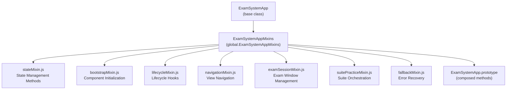
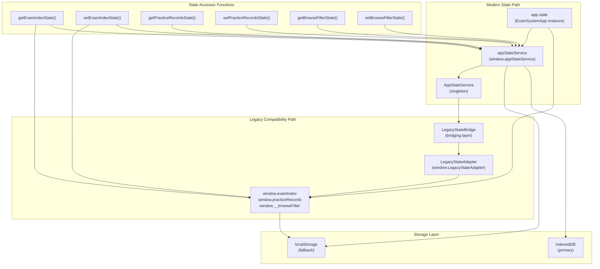
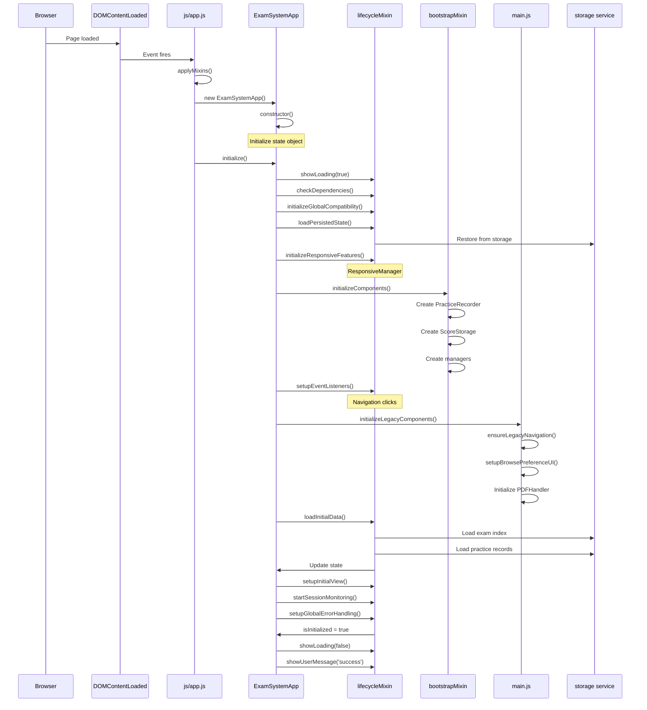
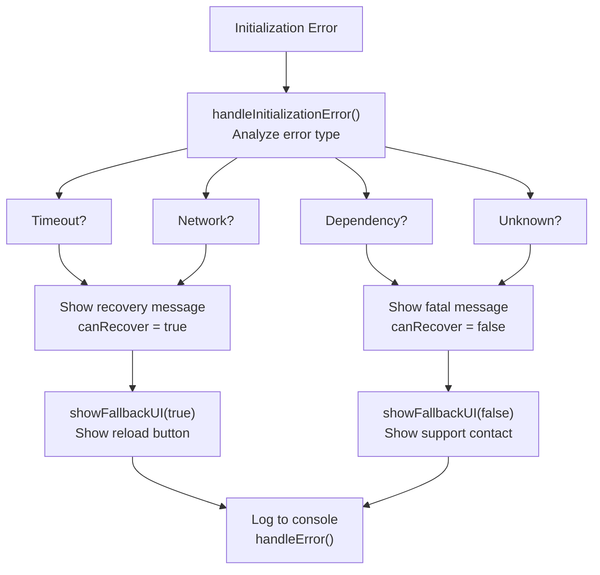

# Core Application Architecture

> **Relevant source files**
> * [css/main.css](https://github.com/sallowayma-git/IELTS-practice/blob/68771116/css/main.css)
> * [index.html](https://github.com/sallowayma-git/IELTS-practice/blob/68771116/index.html)
> * [js/app.js](https://github.com/sallowayma-git/IELTS-practice/blob/68771116/js/app.js)
> * [js/app/lifecycleMixin.js](https://github.com/sallowayma-git/IELTS-practice/blob/68771116/js/app/lifecycleMixin.js)
> * [js/main.js](https://github.com/sallowayma-git/IELTS-practice/blob/68771116/js/main.js)

This document describes the central application orchestration layer, which serves as the backbone of the IELTS practice system. This layer is responsible for initializing the application, managing global state, coordinating between subsystems, and handling navigation between different views.

For detailed information about specific aspects of this architecture:

* State management implementation details: see [ExamSystemApp & State Management](/sallowayma-git/IELTS-practice/3.1-examsystemapp-and-state-management)
* Bootstrap sequence and lifecycle hooks: see [Application Initialization & Lifecycle](/sallowayma-git/IELTS-practice/3.2-application-initialization-and-lifecycle)
* View routing and navigation controller: see [View Management & Navigation](/sallowayma-git/IELTS-practice/3.3-view-management-and-navigation)
* Mixin composition patterns: see [Mixins & Component Architecture](/sallowayma-git/IELTS-practice/3.4-mixins-and-component-architecture)

---

## Overview

The core application architecture consists of two primary components that work together:

1. **`ExamSystemApp` class** - The main application orchestrator defined in [js/app.js L6-L62](https://github.com/sallowayma-git/IELTS-practice/blob/68771116/js/app.js#L6-L62)
2. **`main.js` module** - Legacy bootstrap code and global state accessors defined in [js/main.js L1-L2393](https://github.com/sallowayma-git/IELTS-practice/blob/68771116/js/main.js#L1-L2393)

These components implement a hybrid architecture that maintains backward compatibility with legacy global variables while providing a modern class-based structure with state management. The system uses a mixin pattern to compose functionality from separate modules, enabling modular development and testing.

Sources: [js/app.js L1-L121](https://github.com/sallowayma-git/IELTS-practice/blob/68771116/js/app.js#L1-L121)

 [js/main.js L1-L100](https://github.com/sallowayma-git/IELTS-practice/blob/68771116/js/main.js#L1-L100)

 [index.html L1-L503](https://github.com/sallowayma-git/IELTS-practice/blob/68771116/index.html#L1-L503)

---

## Application Class Structure

The `ExamSystemApp` class serves as the central point of coordination for the entire system. It maintains unified state, manages component lifecycles, and orchestrates interactions between subsystems.

### Class Definition and State Model

The core state structure is defined in the constructor:

```
ExamSystemApp
├── state
│   ├── exam (category, type, index, filtered, configs)
│   ├── practice (records, selectedRecords, bulkDeleteMode)
│   ├── ui (browseFilter, loading, virtualScroller)
│   ├── components (managers, handlers, instances)
│   └── system (processedSessions, fallbackSessions)
├── currentView
├── components
└── isInitialized
```

The `state` object consolidates all application-level data, replacing scattered global variables with a structured model. This design facilitates state synchronization, debugging, and testing.

Sources: [js/app.js L6-L60](https://github.com/sallowayma-git/IELTS-practice/blob/68771116/js/app.js#L6-L60)

### Mixin Composition Pattern

The application uses a mixin pattern to compose functionality from separate modules. Mixins are applied dynamically at runtime:



Each mixin file registers itself by adding methods to `window.ExamSystemAppMixins[mixinName]`. The `applyMixins()` function in [js/app.js L65-L75](https://github.com/sallowayma-git/IELTS-practice/blob/68771116/js/app.js#L65-L75)

 merges all registered mixins into the `ExamSystemApp.prototype`. This pattern allows each concern to be developed independently while maintaining a cohesive API surface.

Sources: [js/app.js L64-L81](https://github.com/sallowayma-git/IELTS-practice/blob/68771116/js/app.js#L64-L81)

 [js/app/lifecycleMixin.js L1-L606](https://github.com/sallowayma-git/IELTS-practice/blob/68771116/js/app/lifecycleMixin.js#L1-L606)

---

## State Management Architecture

The system implements a dual-path state management strategy to support both modern application code and legacy compatibility.

### Dual State Architecture



This architecture allows the application to:

* Use modern state management where available
* Fall back gracefully to global variables when `appStateService` is unavailable
* Maintain backward compatibility with code that expects global variables
* Synchronize between modern and legacy state representations

Sources: [js/main.js L48-L59](https://github.com/sallowayma-git/IELTS-practice/blob/68771116/js/main.js#L48-L59)

 [js/main.js L65-L236](https://github.com/sallowayma-git/IELTS-practice/blob/68771116/js/main.js#L65-L236)

 [js/app.js L12-L56](https://github.com/sallowayma-git/IELTS-practice/blob/68771116/js/app.js#L12-L56)

### State Accessor Functions

The system provides a consistent API for state access through accessor functions in `main.js`:

| Function | Purpose | Lines |
| --- | --- | --- |
| `getExamIndexState()` | Retrieve exam list | [js/main.js L65-L70](https://github.com/sallowayma-git/IELTS-practice/blob/68771116/js/main.js#L65-L70) |
| `setExamIndexState(list)` | Update exam list with sequence numbers | [js/main.js L72-L80](https://github.com/sallowayma-git/IELTS-practice/blob/68771116/js/main.js#L72-L80) |
| `getPracticeRecordsState()` | Retrieve practice records | [js/main.js L82-L87](https://github.com/sallowayma-git/IELTS-practice/blob/68771116/js/main.js#L82-L87) |
| `setPracticeRecordsState(records)` | Update records with enrichment | [js/main.js L104-L116](https://github.com/sallowayma-git/IELTS-practice/blob/68771116/js/main.js#L104-L116) |
| `getBrowseFilterState()` | Retrieve browse filter | [js/main.js L211-L218](https://github.com/sallowayma-git/IELTS-practice/blob/68771116/js/main.js#L211-L218) |
| `setBrowseFilterState(category, type)` | Update filter and persist | [js/main.js L220-L236](https://github.com/sallowayma-git/IELTS-practice/blob/68771116/js/main.js#L220-L236) |

These functions implement a try-first-fallback pattern: they attempt to use `stateService` if available, then fall back to direct global variable access. This ensures the application continues to function even if state management services fail to initialize.

Sources: [js/main.js L65-L298](https://github.com/sallowayma-git/IELTS-practice/blob/68771116/js/main.js#L65-L298)

---

## Initialization and Bootstrap Sequence

The application initialization follows a carefully orchestrated sequence to ensure all dependencies are available before use.

### Bootstrap Flow



This sequence ensures that:

1. Dependencies are checked before use
2. State is restored from persistent storage
3. Components are initialized in dependency order
4. Event listeners are attached after components exist
5. Initial data is loaded and rendered

Sources: [js/app.js L86-L112](https://github.com/sallowayma-git/IELTS-practice/blob/68771116/js/app.js#L86-L112)

 [js/app/lifecycleMixin.js L6-L70](https://github.com/sallowayma-git/IELTS-practice/blob/68771116/js/app/lifecycleMixin.js#L6-L70)

 [js/main.js L1084-L1150](https://github.com/sallowayma-git/IELTS-practice/blob/68771116/js/main.js#L1084-L1150)

### Dependency Resolution

The `stateService` is resolved at module initialization time using a fallback pattern:

```javascript
// From js/main.js:48-59
const stateService = (function resolveStateService() {
    if (window.appStateService && typeof window.appStateService.getExamIndex === 'function') {
        return window.appStateService;
    }
    if (window.AppStateService && typeof window.AppStateService.getInstance === 'function') {
        return window.AppStateService.getInstance({
            legacyAdapter: legacyStateAdapter,
            onBrowseFilterChange: syncGlobalBrowseState
        });
    }
    return null;
})();
```

This IIFE (Immediately Invoked Function Expression) attempts to find an existing `appStateService` instance or creates one if the constructor is available. If neither exists, it returns `null`, causing all state accessors to fall back to global variables.

Sources: [js/main.js L48-L59](https://github.com/sallowayma-git/IELTS-practice/blob/68771116/js/main.js#L48-L59)

---

## Component Lifecycle Management

The application manages component lifecycles through the lifecycle mixin, which provides standardized hooks for initialization, activation, and cleanup.

### Component Registration and Initialization

Components are initialized in [js/app/lifecycleMixin.js L22-L27](https://github.com/sallowayma-git/IELTS-practice/blob/68771116/js/app/lifecycleMixin.js#L22-L27)

 via the `initializeComponents()` method (defined in the bootstrap mixin). The system creates instances and stores them in `this.components`:

```
Component Initialization Order:
1. Core services (storage, state management)
2. Data managers (PracticeRecorder, ScoreStorage)
3. UI managers (ResponsiveManager, ThemeManager)
4. View components (OverviewView, BrowseView, etc.)
5. Utility components (PDFHandler, DataIntegrityManager)
```

Each component is expected to be self-initializing - its constructor should perform all necessary setup. The application stores component instances for later reference and cleanup.

Sources: [js/app/lifecycleMixin.js L3-L70](https://github.com/sallowayma-git/IELTS-practice/blob/68771116/js/app/lifecycleMixin.js#L3-L70)

 [js/main.js L1084-L1150](https://github.com/sallowayma-git/IELTS-practice/blob/68771116/js/main.js#L1084-L1150)

### Error Handling and Recovery

The lifecycle mixin implements comprehensive error handling:



The error handling logic in [js/app/lifecycleMixin.js L75-L104](https://github.com/sallowayma-git/IELTS-practice/blob/68771116/js/app/lifecycleMixin.js#L75-L104)

 analyzes errors to determine if recovery is possible. For recoverable errors (timeouts, network issues), it provides a retry mechanism. For fatal errors (missing dependencies, unknown errors), it directs users to support.

Sources: [js/app/lifecycleMixin.js L75-L167](https://github.com/sallowayma-git/IELTS-practice/blob/68771116/js/app/lifecycleMixin.js#L75-L167)

### Global Error Capture

The application installs global error handlers to catch unhandled exceptions:

```javascript
// Unhandled promise rejections
window.addEventListener('unhandledrejection', (event) => {
    this.handleGlobalError(event.reason, 'Promise拒绝');
    event.preventDefault();
});

// JavaScript errors
window.addEventListener('error', (event) => {
    this.handleGlobalError(event.error, 'JavaScript错误');
});
```

The `handleGlobalError()` method in [js/app/lifecycleMixin.js L128-L167](https://github.com/sallowayma-git/IELTS-practice/blob/68771116/js/app/lifecycleMixin.js#L128-L167)

 maintains an error log and provides user feedback when error frequency exceeds thresholds. This prevents error storms from overwhelming users while still alerting them to persistent issues.

Sources: [js/app/lifecycleMixin.js L109-L167](https://github.com/sallowayma-git/IELTS-practice/blob/68771116/js/app/lifecycleMixin.js#L109-L167)

---

## View Management System

The application implements a single-page application (SPA) architecture with multiple views that are shown/hidden dynamically.

### View Activation Pattern

```

```

Each view corresponds to a `<div class="view">` element in [index.html L30-L199](https://github.com/sallowayma-git/IELTS-practice/blob/68771116/index.html#L30-L199)

 The `navigateToView()` method (defined in the navigation mixin) handles:

1. Hiding the current view by removing the `active` class
2. Showing the target view by adding the `active` class
3. Updating navigation button states
4. Calling the `onViewActivated()` lifecycle hook
5. Persisting the current view to session storage

Sources: [index.html L30-L199](https://github.com/sallowayma-git/IELTS-practice/blob/68771116/index.html#L30-L199)

 [js/app/lifecycleMixin.js L302-L357](https://github.com/sallowayma-git/IELTS-practice/blob/68771116/js/app/lifecycleMixin.js#L302-L357)

### Navigation Event Handling

The application uses event delegation to handle navigation button clicks:

```javascript
// From js/app/lifecycleMixin.js:302-325
document.addEventListener('click', (e) => {
    const navBtn = e.target.closest('.nav-btn');
    if (navBtn) {
        const view = navBtn.dataset.view;
        if (view) {
            this.navigateToView(view);
        }
    }
    // ... other handlers
});
```

This pattern centralizes navigation logic and eliminates the need for inline `onclick` handlers. The navigation mixin (detailed in [View Management & Navigation](/sallowayma-git/IELTS-practice/3.3-view-management-and-navigation)) provides the actual `navigateToView()` implementation.

Sources: [js/app/lifecycleMixin.js L301-L357](https://github.com/sallowayma-git/IELTS-practice/blob/68771116/js/app/lifecycleMixin.js#L301-L357)

---

## Integration with Legacy Code

The core application maintains extensive compatibility with legacy code patterns that predate the class-based architecture.

### Global Function Bridge

Many functions in `main.js` are exposed as global functions to support legacy code:

```python
// Examples from main.js
window.normalizeRecordId = normalizeRecordId;
window.formatExamMetaText = formatExamMetaText;
window.setBrowseTitle = setBrowseTitle;
window.handlePostExamListRender = handlePostExamListRender;
window.requestBrowseAutoScroll = requestBrowseAutoScroll;
window.setupBrowsePreferenceUI = setupBrowsePreferenceUI;
```

These global assignments in [js/main.js L13-L15](https://github.com/sallowayma-git/IELTS-practice/blob/68771116/js/main.js#L13-L15)

 [js/main.js L148-L152](https://github.com/sallowayma-git/IELTS-practice/blob/68771116/js/main.js#L148-L152)

 [js/main.js L554-L556](https://github.com/sallowayma-git/IELTS-practice/blob/68771116/js/main.js#L554-L556)

 and [js/main.js L1014-L1018](https://github.com/sallowayma-git/IELTS-practice/blob/68771116/js/main.js#L1014-L1018)

 allow legacy code to call these functions without refactoring.

Sources: [js/main.js L13-L15](https://github.com/sallowayma-git/IELTS-practice/blob/68771116/js/main.js#L13-L15)

 [js/main.js L148-L152](https://github.com/sallowayma-git/IELTS-practice/blob/68771116/js/main.js#L148-L152)

 [js/main.js L554-L556](https://github.com/sallowayma-git/IELTS-practice/blob/68771116/js/main.js#L554-L556)

 [js/main.js L1014-L1018](https://github.com/sallowayma-git/IELTS-practice/blob/68771116/js/main.js#L1014-L1018)

### Legacy Component Initialization

The `initializeLegacyComponents()` function in [js/main.js L1084-L1150](https://github.com/sallowayma-git/IELTS-practice/blob/68771116/js/main.js#L1084-L1150)

 is called during application initialization to set up components that expect a procedural, non-class-based API:

| Component | Purpose | Factory Function |
| --- | --- | --- |
| `LegacyExamListView` | Render exam list | `ensureExamListView()` |
| `PracticeDashboardView` | Display practice stats | `ensurePracticeDashboardView()` |
| `NavigationController` | Legacy navigation | `ensureLegacyNavigation()` |
| `PDFHandler` | PDF resource handling | Direct instantiation |
| `BrowseStateManager` | Browse filter state | Direct instantiation |
| `DataIntegrityManager` | Data validation | Direct instantiation |
| `PerformanceOptimizer` | Performance fixes | Direct instantiation |

Each factory function checks if an instance already exists before creating a new one, preventing duplicate initialization.

Sources: [js/main.js L1030-L1150](https://github.com/sallowayma-git/IELTS-practice/blob/68771116/js/main.js#L1030-L1150)

---

## Responsive Features and UI Management

The application includes responsive design management through the lifecycle mixin's `initializeResponsiveFeatures()` method.

### Responsive Manager Initialization

```

```

This initialization in [js/app/lifecycleMixin.js L193-L228](https://github.com/sallowayma-git/IELTS-practice/blob/68771116/js/app/lifecycleMixin.js#L193-L228)

 conditionally creates managers based on availability, allowing the application to function even if some responsive features are unavailable.

Sources: [js/app/lifecycleMixin.js L193-L296](https://github.com/sallowayma-git/IELTS-practice/blob/68771116/js/app/lifecycleMixin.js#L193-L296)

### Orientation Handling

The `adjustForOrientation()` method in [js/app/lifecycleMixin.js L262-L296](https://github.com/sallowayma-git/IELTS-practice/blob/68771116/js/app/lifecycleMixin.js#L262-L296)

 detects landscape orientation on mobile devices and adjusts the layout:

* Adds `mobile-landscape` class to body
* Reduces header padding
* Changes stats grid to 4 columns
* Reduces margins for compact display

This ensures the application remains usable in all device orientations.

Sources: [js/app/lifecycleMixin.js L262-L296](https://github.com/sallowayma-git/IELTS-practice/blob/68771116/js/app/lifecycleMixin.js#L262-L296)

---

## Data Persistence and State Synchronization

The application persists state across page reloads using the storage layer and synchronizes state between tabs.

### State Persistence Strategy

```

```

The `persistMultipleState()` method (defined in the state mixin, see [ExamSystemApp & State Management](/sallowayma-git/IELTS-practice/3.1-examsystemapp-and-state-management)) accepts a mapping of state paths to storage keys and persists multiple values atomically.

The `destroy()` method in [js/app/lifecycleMixin.js L549-L601](https://github.com/sallowayma-git/IELTS-practice/blob/68771116/js/app/lifecycleMixin.js#L549-L601)

 persists critical state before cleanup:

```
this.persistMultipleState({
    'exam.index': 'exam_index',
    'practice.records': 'practice_records',
    'ui.browseFilter': 'browse_filter',
    'exam.currentCategory': 'current_category',
    'exam.currentExamType': 'current_exam_type'
});
```

This ensures user state is preserved even if the application crashes or the user force-closes the tab.

Sources: [js/app/lifecycleMixin.js L549-L601](https://github.com/sallowayma-git/IELTS-practice/blob/68771116/js/app/lifecycleMixin.js#L549-L601)

### Storage Event Synchronization

The application listens for storage events to synchronize state across tabs:

```javascript
// From main.js - setupStorageSyncListener()
window.addEventListener('storage', (event) => {
    if (event.key === 'practice_records') {
        syncPracticeRecords();
    } else if (event.key === 'exam_index') {
        loadLibrary();
    }
});
```

This mechanism ensures that when a user practices an exam in one tab, the practice history in other open tabs updates automatically.

Sources: [js/main.js L1148-L1149](https://github.com/sallowayma-git/IELTS-practice/blob/68771116/js/main.js#L1148-L1149)

---

## Session Monitoring and Active Window Tracking

The application tracks open exam windows and monitors their status through periodic polling.

### Session Monitoring Architecture

```

```

The `startSessionMonitoring()` method (defined in the exam session mixin, see [Exam Window Management & Resource Resolution](/sallowayma-git/IELTS-practice/5.5-exam-window-management-and-resource-resolution)) starts a periodic check that:

1. Iterates through `this.examWindows` Map
2. Tests if each window is still open
3. Removes closed windows and cleans up their sessions
4. Updates the UI badge showing active session count

This monitoring runs continuously after initialization with a 2-second interval.

Sources: [js/app/lifecycleMixin.js L56](https://github.com/sallowayma-git/IELTS-practice/blob/68771116/js/app/lifecycleMixin.js#L56-L56)

---

## HTML Entry Point Structure

The main HTML file defines the view structure and loads dependencies in a specific order.

### Script Loading Order

```

```

This loading order ensures:

* Environment detection runs first for logging configuration
* Data structures are available before code that uses them
* Core services are initialized before dependent components
* Mixins are registered before `ExamSystemApp` is instantiated
* Patches are applied before application logic runs

Sources: [index.html L385-L500](https://github.com/sallowayma-git/IELTS-practice/blob/68771116/index.html#L385-L500)

### View Container Structure

The HTML defines five main views as sibling `<div>` elements:

| View ID | Purpose | Initial State |
| --- | --- | --- |
| `overview-view` | Category overview, stats | `class="view active"` |
| `browse-view` | Exam list, filters | `class="view"` |
| `practice-view` | Practice history, records | `class="view"` |
| `settings-view` | System settings, theme | `class="view"` |
| `more-view` | Additional tools (clock, vocab) | `class="view"` |

Only one view has the `active` class at a time. The navigation system toggles this class to show/hide views without page reloads.

Sources: [index.html L30-L199](https://github.com/sallowayma-git/IELTS-practice/blob/68771116/index.html#L30-L199)

---

## Key Design Patterns

### Pattern: Mixin Composition

**Intent**: Allow functionality to be developed in separate modules and composed into the main application class.

**Implementation**: Each mixin file creates an object with methods and assigns it to `window.ExamSystemAppMixins[name]`. The `applyMixins()` function uses `Object.assign()` to copy all methods onto `ExamSystemApp.prototype`.

**Benefits**:

* Separation of concerns (each mixin handles one aspect)
* Testability (mixins can be tested in isolation)
* Maintainability (changes to one concern don't affect others)
* Reusability (mixins could theoretically be applied to other classes)

Sources: [js/app.js L64-L81](https://github.com/sallowayma-git/IELTS-practice/blob/68771116/js/app.js#L64-L81)

### Pattern: Try-First-Fallback

**Intent**: Provide resilience by attempting modern code paths first, then falling back to legacy implementations.

**Implementation**: Functions check if modern services exist and use them, otherwise fall back to global variables or legacy functions.

**Example**:

```javascript
function getExamIndexState() {
    if (stateService) {
        return stateService.getExamIndex();
    }
    return Array.isArray(window.examIndex) ? window.examIndex : [];
}
```

**Benefits**:

* Graceful degradation when services fail to initialize
* Backward compatibility with legacy code
* Progressive enhancement as more services become available

Sources: [js/main.js L65-L236](https://github.com/sallowayma-git/IELTS-practice/blob/68771116/js/main.js#L65-L236)

### Pattern: Global Function Bridge

**Intent**: Expose internal functions to global scope for legacy code compatibility.

**Implementation**: Functions defined in module scope are assigned to `window` properties.

**Trade-offs**:

* Enables legacy code to continue functioning
* Pollutes global namespace
* Makes it harder to track where functions are called
* Prevents tree-shaking and optimization

Sources: [js/main.js L13-L15](https://github.com/sallowayma-git/IELTS-practice/blob/68771116/js/main.js#L13-L15)

 [js/main.js L554-L556](https://github.com/sallowayma-git/IELTS-practice/blob/68771116/js/main.js#L554-L556)

 [js/main.js L1014-L1018](https://github.com/sallowayma-git/IELTS-practice/blob/68771116/js/main.js#L1014-L1018)

### Pattern: Event Delegation

**Intent**: Handle events from multiple elements with a single listener.

**Implementation**: Attach listeners to parent elements and use `closest()` to find the actual target.

**Example**:

```javascript
document.addEventListener('click', (e) => {
    const navBtn = e.target.closest('.nav-btn');
    if (navBtn) {
        // Handle navigation
    }
});
```

**Benefits**:

* Fewer event listeners (better performance)
* Works with dynamically added elements
* Centralized event handling logic

Sources: [js/app/lifecycleMixin.js L302-L325](https://github.com/sallowayma-git/IELTS-practice/blob/68771116/js/app/lifecycleMixin.js#L302-L325)

---

## Performance Considerations

### Lazy Initialization

Components are initialized only when needed. The factory functions in [js/main.js L1030-L1081](https://github.com/sallowayma-git/IELTS-practice/blob/68771116/js/main.js#L1030-L1081)

 check for existing instances before creating new ones:

```javascript
function ensureExamListView() {
    if (!examListViewInstance && window.LegacyExamListView) {
        examListViewInstance = new window.LegacyExamListView({
            domAdapter: window.DOMAdapter,
            containerId: 'exam-list-container'
        });
    }
    return examListViewInstance;
}
```

This pattern defers initialization costs until components are actually used.

### Debounced Event Handlers

Frequent events like `resize` and `scroll` are debounced to prevent excessive processing:

```javascript
// From main.js:576-587
function debounce(fn, wait) {
    let timer = null;
    return function debounced(...args) {
        if (timer) {
            clearTimeout(timer);
        }
        timer = setTimeout(() => {
            timer = null;
            fn.apply(this, args);
        }, wait);
    };
}
```

This ensures handlers only execute after the event stream settles, reducing CPU usage.

Sources: [js/main.js L576-L642](https://github.com/sallowayma-git/IELTS-practice/blob/68771116/js/main.js#L576-L642)

### State Caching

The browse preferences system caches the loaded state in memory:

```javascript
let browsePreferencesCache = null;

function getBrowseViewPreferences() {
    if (!browsePreferencesCache) {
        browsePreferencesCache = loadBrowsePreferencesFromStorage();
    }
    return browsePreferencesCache;
}
```

This reduces repeated localStorage reads, which can be slow. The cache is updated when preferences are saved.

Sources: [js/main.js L304-L408](https://github.com/sallowayma-git/IELTS-practice/blob/68771116/js/main.js#L304-L408)

---

## Summary

The core application architecture provides:

1. **Unified orchestration** through the `ExamSystemApp` class
2. **Modular composition** via the mixin pattern
3. **Dual-path state management** supporting modern and legacy code
4. **Comprehensive lifecycle management** with initialization, activation, and cleanup hooks
5. **Resilient error handling** with recovery strategies
6. **Cross-tab synchronization** through storage events
7. **Performance optimizations** including lazy initialization and debouncing

This architecture enables the system to maintain backward compatibility while gradually migrating to modern patterns, ensuring stability during the transition period.