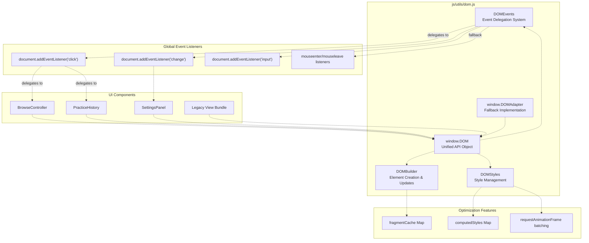
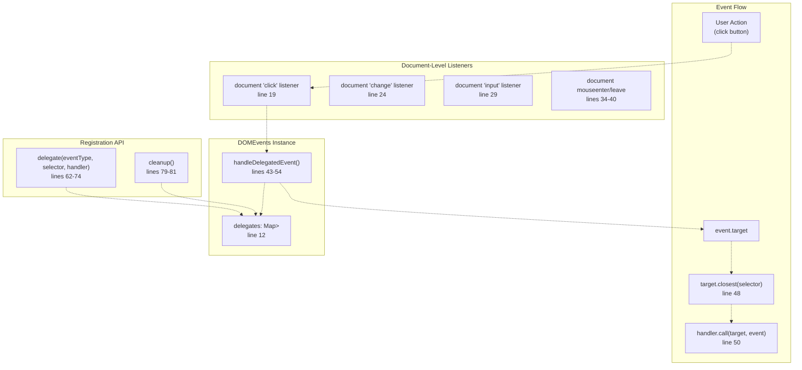
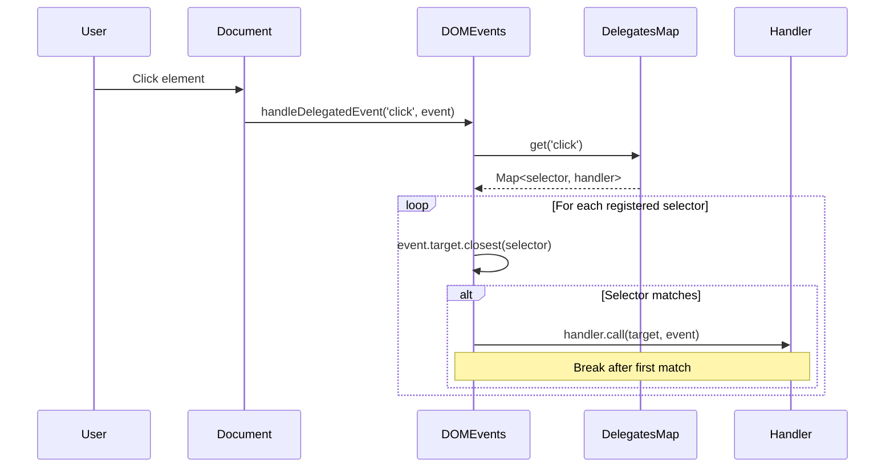
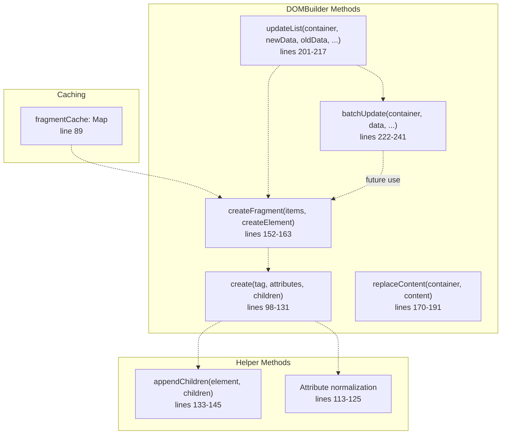
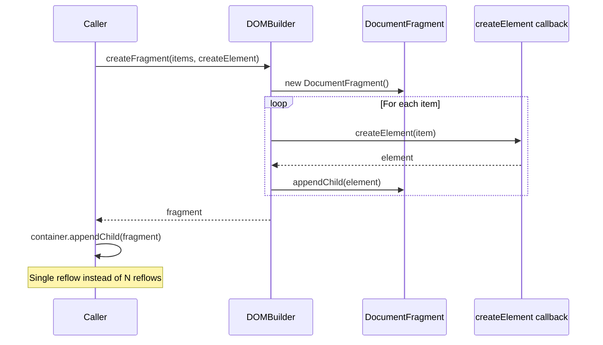
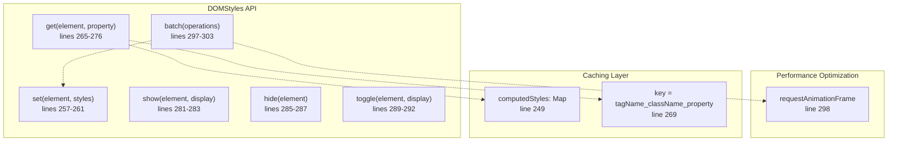
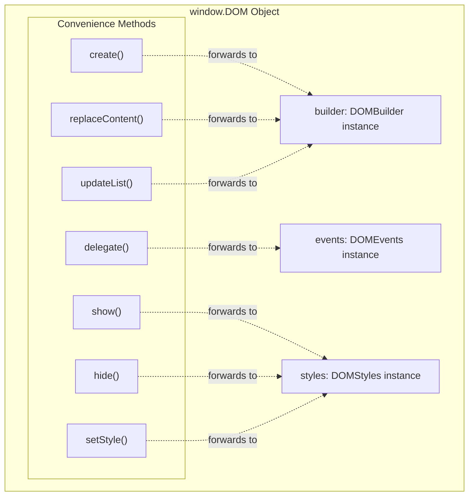
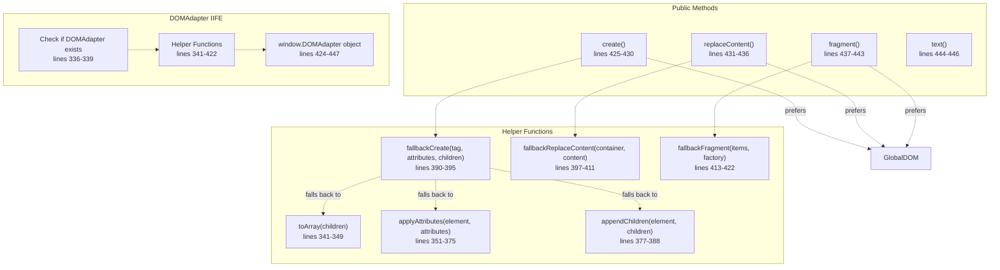
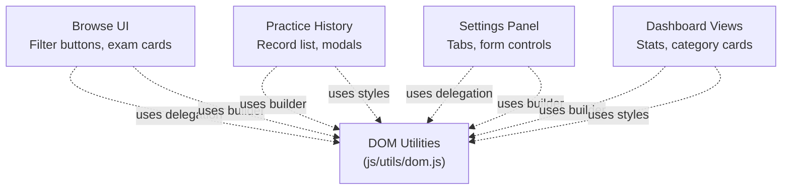

# DOM Utilities & Event Delegation

> **Relevant source files**
> * [js/core/goalManager.js](https://github.com/sallowayma-git/IELTS-practice/blob/92f64eb8/js/core/goalManager.js)
> * [js/utils/dom.js](https://github.com/sallowayma-git/IELTS-practice/blob/92f64eb8/js/utils/dom.js)

## Purpose and Scope

This document describes the DOM utility library (`js/utils/dom.js`) that provides a unified interface for DOM manipulation, event delegation, and style management across the IELTS practice application. The system reduces memory consumption through event delegation, provides efficient DOM creation methods, and includes performance optimizations for batch operations.

For application-level lazy loading and code splitting, see [Lazy Loading & Code Splitting](/sallowayma-git/IELTS-practice/10.1-lazy-loading-and-code-splitting). For rendering optimizations for large lists, see [Virtual Scrolling & Large List Optimization](/sallowayma-git/IELTS-practice/10.2-virtual-scrolling-and-large-list-optimization).

## Architecture Overview

The DOM utility library is organized into three primary classes that work together to provide a comprehensive DOM manipulation API:



**Sources:** [js/utils/dom.js L1-L448](https://github.com/sallowayma-git/IELTS-practice/blob/92f64eb8/js/utils/dom.js#L1-L448)

## Event Delegation System (DOMEvents)

The `DOMEvents` class implements a centralized event delegation system that significantly reduces the number of event listeners in the application. Instead of attaching listeners to individual elements, it uses a single listener at the document level and delegates to registered handlers based on CSS selectors.

### Core Architecture



**Sources:** [js/utils/dom.js L10-L82](https://github.com/sallowayma-git/IELTS-practice/blob/92f64eb8/js/utils/dom.js#L10-L82)

### Implementation Details

The `DOMEvents` class uses a two-level Map structure to organize delegated handlers:

| Level | Type | Key | Value | Purpose |
| --- | --- | --- | --- | --- |
| 1 | `Map` | Event type string | `Map<selector, handler>` | Group by event type |
| 2 | `Map` | CSS selector string | Handler function | Match elements |

**Sources:** [js/utils/dom.js L12](https://github.com/sallowayma-git/IELTS-practice/blob/92f64eb8/js/utils/dom.js#L12-L12)

### Global Setup

Five global event listeners are registered during initialization in `setupGlobalDelegates()`:

1. **click** - General user interactions [js/utils/dom.js L19-L21](https://github.com/sallowayma-git/IELTS-practice/blob/92f64eb8/js/utils/dom.js#L19-L21)
2. **change** - Form input changes [js/utils/dom.js L24-L26](https://github.com/sallowayma-git/IELTS-practice/blob/92f64eb8/js/utils/dom.js#L24-L26)
3. **input** - Real-time input events [js/utils/dom.js L29-L31](https://github.com/sallowayma-git/IELTS-practice/blob/92f64eb8/js/utils/dom.js#L29-L31)
4. **mouseenter** - Mouse hover effects with capture phase [js/utils/dom.js L34-L36](https://github.com/sallowayma-git/IELTS-practice/blob/92f64eb8/js/utils/dom.js#L34-L36)
5. **mouseleave** - Mouse exit effects with capture phase [js/utils/dom.js L38-L40](https://github.com/sallowayma-git/IELTS-practice/blob/92f64eb8/js/utils/dom.js#L38-L40)

The mouse events use capture phase (`true` as third parameter) to ensure they fire during the capture phase rather than bubbling phase, which is necessary for proper delegation of these non-bubbling events.

**Sources:** [js/utils/dom.js L16-L41](https://github.com/sallowayma-git/IELTS-practice/blob/92f64eb8/js/utils/dom.js#L16-L41)

### Event Delegation Flow



**Sources:** [js/utils/dom.js L43-L54](https://github.com/sallowayma-git/IELTS-practice/blob/92f64eb8/js/utils/dom.js#L43-L54)

### Registration API

The `delegate()` method registers event handlers with automatic cleanup support:

```javascript
// Example usage pattern
const cleanup = DOM.events.delegate('click', '.exam-card', function(event) {
    // 'this' refers to the matched element
    const examId = this.dataset.examId;
    // Handle click...
});

// Later, remove the delegation
cleanup.remove();
```

**Sources:** [js/utils/dom.js L62-L74](https://github.com/sallowayma-git/IELTS-practice/blob/92f64eb8/js/utils/dom.js#L62-L74)

### Memory Management

The delegation system includes two cleanup mechanisms:

1. **Individual removal** - Each `delegate()` call returns an object with a `remove()` method
2. **Global cleanup** - The `cleanup()` method clears all registered delegates

**Sources:** [js/utils/dom.js L69-L81](https://github.com/sallowayma-git/IELTS-practice/blob/92f64eb8/js/utils/dom.js#L69-L81)

## DOM Creation System (DOMBuilder)

The `DOMBuilder` class provides efficient methods for creating and manipulating DOM elements without using `innerHTML` for dynamic content, which prevents XSS vulnerabilities and improves performance.

### Core API



**Sources:** [js/utils/dom.js L87-L242](https://github.com/sallowayma-git/IELTS-practice/blob/92f64eb8/js/utils/dom.js#L87-L242)

### Element Creation

The `create()` method supports flexible parameter handling with backward compatibility:

```javascript
// Standard usage
const div = DOM.builder.create('div', { className: 'card' }, ['Hello']);

// Attributes can be null/undefined
const span = DOM.builder.create('span', null, 'Text');

// Backward compatible: second param is child if not plain object
const p = DOM.builder.create('p', 'Text content');
```

**Sources:** [js/utils/dom.js L98-L131](https://github.com/sallowayma-git/IELTS-practice/blob/92f64eb8/js/utils/dom.js#L98-L131)

### Attribute Handling

Special attribute processing occurs for specific keys:

| Attribute | Special Handling | Implementation |
| --- | --- | --- |
| `className` | Set via `element.className` | [line 115](https://github.com/sallowayma-git/IELTS-practice/blob/92f64eb8/line 115) |
| `dataset` | Object spread to `element.dataset` | [lines 116-117](https://github.com/sallowayma-git/IELTS-practice/blob/92f64eb8/lines 116-117) |
| `style` | Object spread to `element.style` | [lines 118-119](https://github.com/sallowayma-git/IELTS-practice/blob/92f64eb8/lines 118-119) |
| `on*` (event handlers) | Logs warning, should use delegation | [lines 120-122](https://github.com/sallowayma-git/IELTS-practice/blob/92f64eb8/lines 120-122) |
| Others | Set via `setAttribute()` | [line 123](https://github.com/sallowayma-git/IELTS-practice/blob/92f64eb8/line 123) |

**Sources:** [js/utils/dom.js L113-L125](https://github.com/sallowayma-git/IELTS-practice/blob/92f64eb8/js/utils/dom.js#L113-L125)

### Fragment Creation for Lists

The `createFragment()` method optimizes batch DOM insertion:



**Sources:** [js/utils/dom.js L152-L163](https://github.com/sallowayma-git/IELTS-practice/blob/92f64eb8/js/utils/dom.js#L152-L163)

### List Update Strategies

The `updateList()` method uses intelligent strategies based on data size:

| Data Size | Strategy | Method | Benefit |
| --- | --- | --- | --- |
| 0 items | Clear content | `replaceContent([], [])` | Cleanup |
| 1-50 items | Synchronous rebuild | `createFragment()` | Simple, fast |
| 50+ items | Batched update | `batchUpdate()` | Non-blocking |

**Sources:** [js/utils/dom.js L201-L217](https://github.com/sallowayma-git/IELTS-practice/blob/92f64eb8/js/utils/dom.js#L201-L217)

### Batched Updates

The `batchUpdate()` method prevents UI blocking for large datasets:

```javascript
// Processes 20 items per frame
batchUpdate(container, data, createElement, batchSize = 20) {
    this.replaceContent(container, []);
    
    let index = 0;
    const processBatch = () => {
        const endIndex = Math.min(index + batchSize, data.length);
        const batch = data.slice(index, endIndex);
        
        const fragment = this.createFragment(batch, createElement);
        container.appendChild(fragment);
        
        index = endIndex;
        if (index < data.length) {
            requestAnimationFrame(processBatch);
        }
    };
    
    requestAnimationFrame(processBatch);
}
```

**Sources:** [js/utils/dom.js L222-L241](https://github.com/sallowayma-git/IELTS-practice/blob/92f64eb8/js/utils/dom.js#L222-L241)

## Style Management System (DOMStyles)

The `DOMStyles` class provides utilities for efficient style manipulation with caching and batching support.

### API Methods



**Sources:** [js/utils/dom.js L247-L304](https://github.com/sallowayma-git/IELTS-practice/blob/92f64eb8/js/utils/dom.js#L247-L304)

### Computed Style Caching

The `get()` method caches computed styles to avoid repeated `getComputedStyle()` calls:

```javascript
// Cache key format: "DIV_exam-card_width"
const key = `${element.tagName}_${element.className}_${property}`;

if (!this.computedStyles.has(key)) {
    const computed = window.getComputedStyle(element);
    this.computedStyles.set(key, computed[property]);
}
```

**Note:** This caching assumes styles don't change after first access. In practice, the cache may need invalidation for dynamic styling scenarios.

**Sources:** [js/utils/dom.js L265-L276](https://github.com/sallowayma-git/IELTS-practice/blob/92f64eb8/js/utils/dom.js#L265-L276)

### Batch Style Operations

The `batch()` method uses `requestAnimationFrame` to group style changes:

```
// Example usage
DOM.styles.batch([
    { element: elem1, styles: { opacity: '0.5' } },
    { element: elem2, styles: { display: 'none' } },
    { element: elem3, styles: { transform: 'translateY(10px)' } }
]);

// All applied in single animation frame
```

**Sources:** [js/utils/dom.js L297-L303](https://github.com/sallowayma-git/IELTS-practice/blob/92f64eb8/js/utils/dom.js#L297-L303)

## Global DOM API

The unified `DOM` object provides convenient access to all utilities:



**Sources:** [js/utils/dom.js L309-L323](https://github.com/sallowayma-git/IELTS-practice/blob/92f64eb8/js/utils/dom.js#L309-L323)

### API Surface

The global object exposes both class instances and convenience methods:

| Property/Method | Type | Description | Forwards To |
| --- | --- | --- | --- |
| `events` | Instance | DOMEvents instance | - |
| `builder` | Instance | DOMBuilder instance | - |
| `styles` | Instance | DOMStyles instance | - |
| `create()` | Method | Create element | `builder.create()` |
| `delegate()` | Method | Register event delegation | `events.delegate()` |
| `show()` | Method | Show element | `styles.show()` |
| `hide()` | Method | Hide element | `styles.hide()` |
| `setStyle()` | Method | Set styles | `styles.set()` |
| `replaceContent()` | Method | Replace content | `builder.replaceContent()` |
| `updateList()` | Method | Update list | `builder.updateList()` |

**Sources:** [js/utils/dom.js L309-L323](https://github.com/sallowayma-git/IELTS-practice/blob/92f64eb8/js/utils/dom.js#L309-L323)

### Backward Compatibility Aliases

For legacy code compatibility, individual constructors are also exposed globally:

```
window.DOMBuilder = DOM.builder;
window.DOMEvents = DOM.events;
window.DOMStyles = DOM.styles;
```

**Sources:** [js/utils/dom.js L329-L331](https://github.com/sallowayma-git/IELTS-practice/blob/92f64eb8/js/utils/dom.js#L329-L331)

## DOMAdapter Fallback System

The `DOMAdapter` provides a simplified fallback implementation for code that loads before the main DOM utilities are available:



**Sources:** [js/utils/dom.js L336-L448](https://github.com/sallowayma-git/IELTS-practice/blob/92f64eb8/js/utils/dom.js#L336-L448)

### Adapter Strategy

Each `DOMAdapter` method checks for the full `DOM` object first:

```sql
create: function(tag, attributes, children) {
    // Prefer full implementation if available
    if (global.DOM && typeof global.DOM.create === 'function') {
        return global.DOM.create(tag, attributes, children);
    }
    // Fall back to simplified implementation
    return fallbackCreate(tag, attributes, children);
}
```

**Sources:** [js/utils/dom.js L425-L430](https://github.com/sallowayma-git/IELTS-practice/blob/92f64eb8/js/utils/dom.js#L425-L430)

### Fallback Implementation Differences

The fallback implementations are simpler but functionally equivalent:

| Feature | Full DOM | DOMAdapter Fallback |
| --- | --- | --- |
| Element creation | Class-based with caching | Function-based |
| Event delegation | Full delegation system | Not included |
| Style management | Caching + batching | Not included |
| Fragment creation | Available | Available |
| Content replacement | Multiple strategies | Simple clear + append |

**Sources:** [js/utils/dom.js L336-L448](https://github.com/sallowayma-git/IELTS-practice/blob/92f64eb8/js/utils/dom.js#L336-L448)

## Usage Patterns in the Codebase

### Event Delegation for Custom Events

Components using custom events must use native `addEventListener` rather than delegation:

```javascript
// From GoalManager.js
initializeProgressTracking() {
    // 监听练习完成事件 - 自定义事件必须使用原生 addEventListener
    document.addEventListener('practiceSessionCompleted', (event) => {
        const detail = event.detail || {};
        const practiceRecord = detail.practiceRecord;
        this.updateProgress(practiceRecord)
            .catch(error => console.error('[GoalManager] 更新进度失败:', error));
    });
}
```

**Rationale:** The `DOMEvents` delegation system only handles standard DOM events (click, change, input, mouseenter, mouseleave). Custom events dispatched via `dispatchEvent()` must be handled with direct listeners.

**Sources:** [js/core/goalManager.js L259-L266](https://github.com/sallowayma-git/IELTS-practice/blob/92f64eb8/js/core/goalManager.js#L259-L266)

### Warning for Direct Event Binding

The `DOMBuilder.create()` method warns against direct event handler binding:

```
if (key.startsWith('on') && typeof value === 'function') {
    console.warn(`[DOMBuilder] Use event delegation instead of direct event binding`);
}
```

This encourages developers to use the delegation system instead of attaching individual listeners.

**Sources:** [js/utils/dom.js L120-L122](https://github.com/sallowayma-git/IELTS-practice/blob/92f64eb8/js/utils/dom.js#L120-L122)

## Performance Characteristics

### Memory Optimization

| Approach | Event Listeners | Memory Usage | Example |
| --- | --- | --- | --- |
| Direct binding | N listeners for N elements | High | 100 cards = 100 listeners |
| Event delegation | 1 listener for all elements | Low | 100 cards = 1 listener |

**Savings:** For a list of 100 exam cards with click handlers, delegation reduces listener count from 100 to 1.

### Rendering Performance

| Operation | Without Batching | With Batching | Improvement |
| --- | --- | --- | --- |
| Insert 100 elements | 100 reflows | 5 reflows (20/batch) | ~95% reduction |
| Fragment usage | N reflows | 1 reflow | ~99% reduction |

**Sources:** [js/utils/dom.js L152-L241](https://github.com/sallowayma-git/IELTS-practice/blob/92f64eb8/js/utils/dom.js#L152-L241)

### Cache Effectiveness

The `DOMStyles` computed style cache prevents redundant `getComputedStyle()` calls:

* **First access:** Computes style via `getComputedStyle()`
* **Subsequent access:** Returns cached value
* **Trade-off:** Cache doesn't invalidate on style changes

**Sources:** [js/utils/dom.js L265-L276](https://github.com/sallowayma-git/IELTS-practice/blob/92f64eb8/js/utils/dom.js#L265-L276)

## Integration Points

The DOM utilities integrate with multiple subsystems:



**Sources:** [js/utils/dom.js L1-L448](https://github.com/sallowayma-git/IELTS-practice/blob/92f64eb8/js/utils/dom.js#L1-L448)