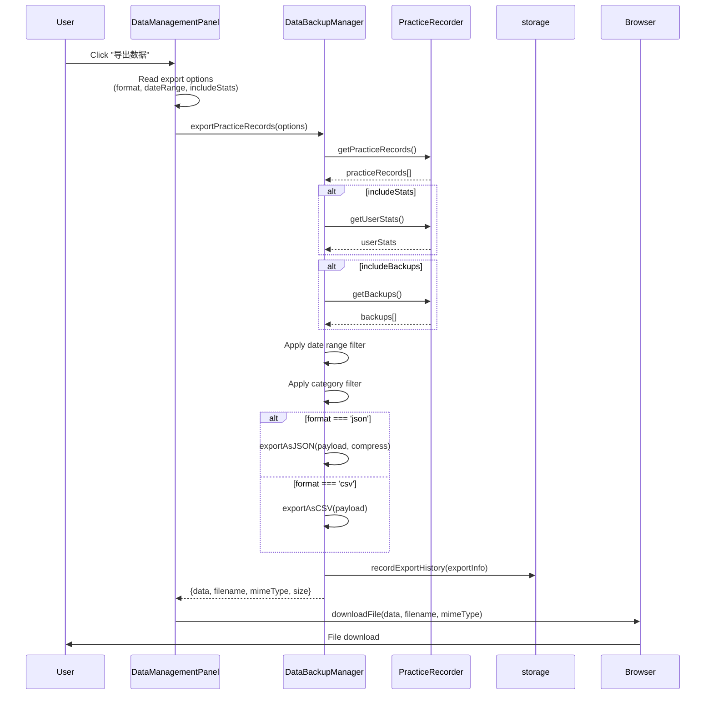
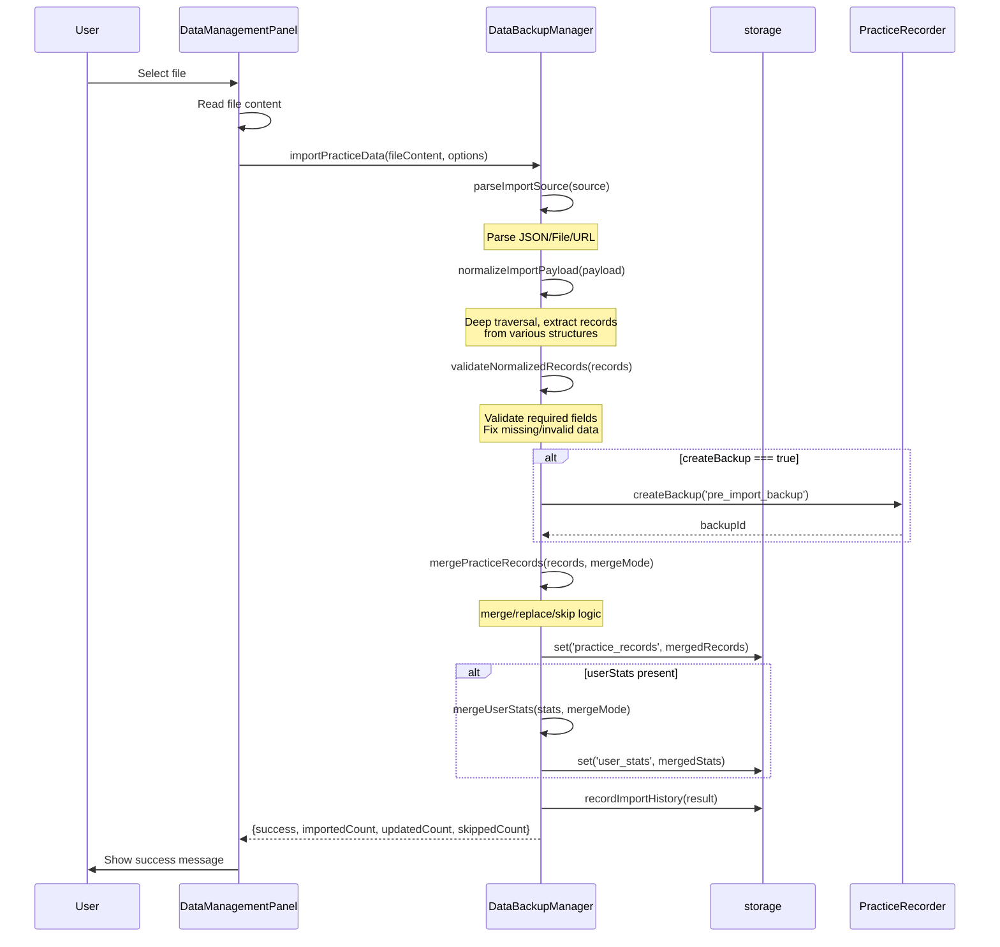
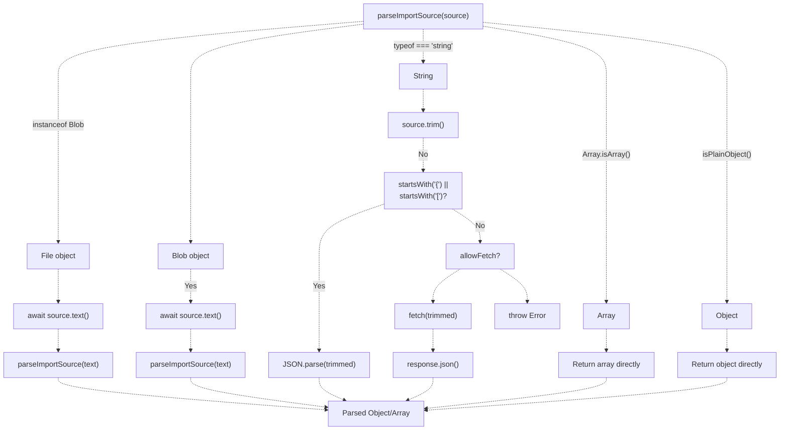
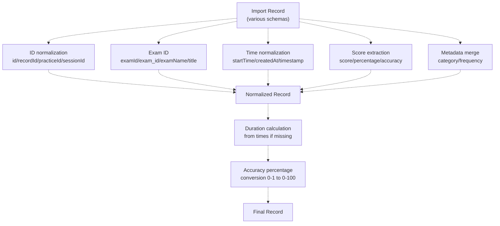
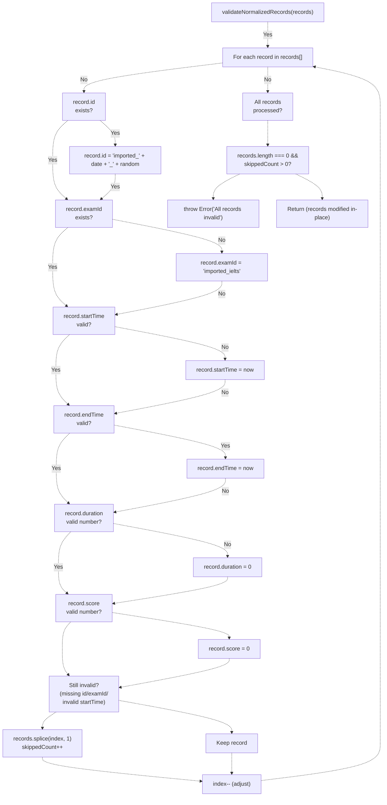
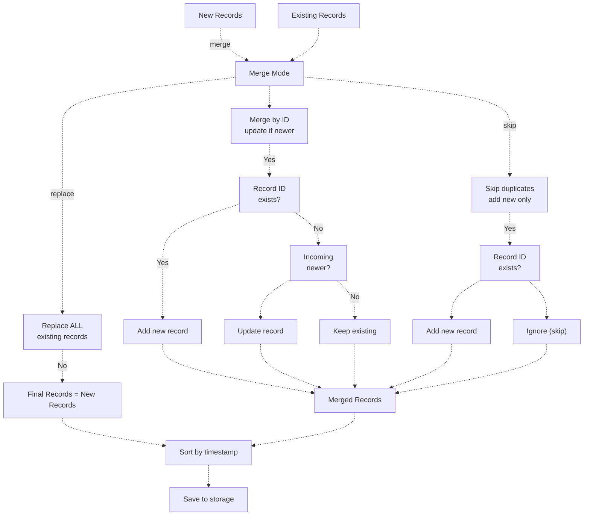
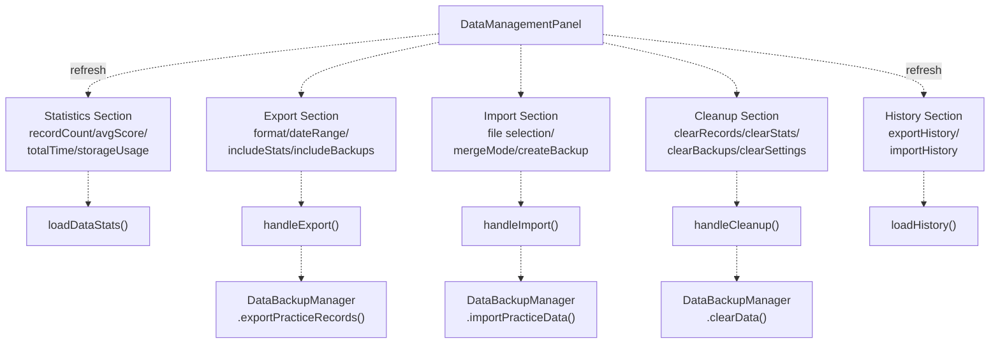
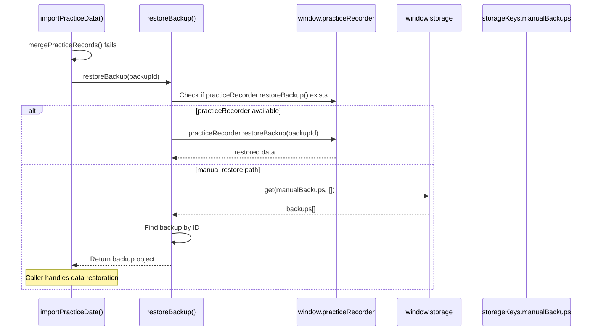
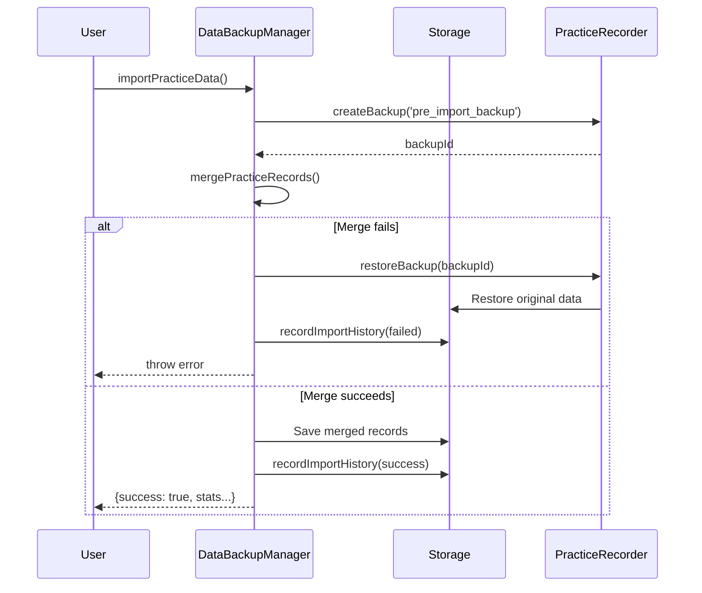

# Data Backup & Import/Export

> **Relevant source files**
> * [.superdesign/design_iterations/xiaodaidai_dashboard_1.html](https://github.com/sallowayma-git/IELTS-practice/blob/92f64eb8/.superdesign/design_iterations/xiaodaidai_dashboard_1.html)
> * [assets/data/vocabulary.json](https://github.com/sallowayma-git/IELTS-practice/blob/92f64eb8/assets/data/vocabulary.json)
> * [js/app/lifecycleMixin.js](https://github.com/sallowayma-git/IELTS-practice/blob/92f64eb8/js/app/lifecycleMixin.js)
> * [js/components/DataIntegrityManager.js](https://github.com/sallowayma-git/IELTS-practice/blob/92f64eb8/js/components/DataIntegrityManager.js)
> * [js/components/dataManagementPanel.js](https://github.com/sallowayma-git/IELTS-practice/blob/92f64eb8/js/components/dataManagementPanel.js)
> * [js/components/settingsPanel.js](https://github.com/sallowayma-git/IELTS-practice/blob/92f64eb8/js/components/settingsPanel.js)
> * [js/core/practiceRecorder.js](https://github.com/sallowayma-git/IELTS-practice/blob/92f64eb8/js/core/practiceRecorder.js)
> * [js/core/scoreStorage.js](https://github.com/sallowayma-git/IELTS-practice/blob/92f64eb8/js/core/scoreStorage.js)
> * [js/script.js](https://github.com/sallowayma-git/IELTS-practice/blob/92f64eb8/js/script.js)
> * [js/utils/dataBackupManager.js](https://github.com/sallowayma-git/IELTS-practice/blob/92f64eb8/js/utils/dataBackupManager.js)
> * [js/utils/helpers.js](https://github.com/sallowayma-git/IELTS-practice/blob/92f64eb8/js/utils/helpers.js)
> * [js/utils/storage.js](https://github.com/sallowayma-git/IELTS-practice/blob/92f64eb8/js/utils/storage.js)
> * [js/utils/themeManager.js](https://github.com/sallowayma-git/IELTS-practice/blob/92f64eb8/js/utils/themeManager.js)

## Purpose and Scope

This document describes the data backup, export, and import subsystem that enables users to manage their practice records and settings data. The system provides both user-facing manual operations (export to JSON/CSV, import from files, manual backups) and automatic backup mechanisms.

For information about automatic data integrity management and consistency checks, see [Data Integrity & Quality Management](/sallowayma-git/IELTS-practice/4.3-data-repositories-and-transactions). For the underlying repository architecture, see [Repository Architecture & Data Layer](/sallowayma-git/IELTS-practice/4.1-storage-architecture-and-multi-backend-system).

---

## System Overview

The data backup and import/export system consists of three main components working together:

```mermaid
flowchart TD

Panel["DataManagementPanel<br>js/components/dataManagementPanel.js"]
ExportBtn["handleExport()"]
ImportBtn["handleImport()"]
CleanupBtn["handleCleanup()"]
DBM["DataBackupManager<br>js/utils/dataBackupManager.js"]
ExportRecords["exportPracticeRecords()"]
ImportData["importPracticeData()"]
ParseSource["parseImportSource()"]
Normalize["normalizeImportPayload()"]
Validate["validateNormalizedRecords()"]
Merge["mergePracticeRecords()"]
WindowStorage["window.storage<br>(storage.js)"]
PracticeRecorder["window.practiceRecorder<br>getPracticeRecords()<br>getUserStats()"]
Keys["'practice_records'<br>'user_stats'<br>'export_history'<br>'import_history'"]
FileInput[""]
FileReader["FileReader API"]
BlobAPI["Blob + URL.createObjectURL()"]
DownloadLink[""]

ExportBtn -.-> ExportRecords
ImportBtn -.-> ImportData
ExportRecords -.-> PracticeRecorder
ExportRecords -.-> WindowStorage
ExportRecords -.-> BlobAPI
FileReader -.-> ImportData
Merge -.-> WindowStorage
DBM -.-> WindowStorage

subgraph IO ["File I/O"]
    FileInput
    FileReader
    BlobAPI
    DownloadLink
    BlobAPI -.-> DownloadLink
    FileInput -.-> FileReader
end

subgraph Storage ["Storage Layer"]
    WindowStorage
    PracticeRecorder
    Keys
    WindowStorage -.-> Keys
end

subgraph Core ["Core Backup Service"]
    DBM
    ExportRecords
    ImportData
    ParseSource
    Normalize
    Validate
    Merge
    ImportData -.-> ParseSource
    ParseSource -.-> Normalize
    Normalize -.-> Validate
    Validate -.-> Merge
end

subgraph UI ["User Interface Layer"]
    Panel
    ExportBtn
    ImportBtn
    CleanupBtn
    Panel -.-> ExportBtn
    Panel -.-> ImportBtn
    Panel -.-> CleanupBtn
end
```

**Key responsibilities:**

* **DataBackupManager** ([js/utils/dataBackupManager.js L5-L1213](https://github.com/sallowayma-git/IELTS-practice/blob/92f64eb8/js/utils/dataBackupManager.js#L5-L1213) ): User-facing export/import operations, format conversion (JSON/CSV), data normalization and validation. Core methods include `exportPracticeRecords()`, `importPracticeData()`, `normalizeImportPayload()`, `validateNormalizedRecords()`, and `mergePracticeRecords()`.
* **DataManagementPanel** ([js/components/dataManagementPanel.js L26-L921](https://github.com/sallowayma-git/IELTS-practice/blob/92f64eb8/js/components/dataManagementPanel.js#L26-L921) ): User interface for all data management operations. Provides UI sections for stats display, export configuration, import file selection, data cleanup, and operation history.

**Sources:** js/utils/dataBackupManager.js:1-30, js/components/dataManagementPanel.js:1-46, js/utils/helpers.js:233-264

---

## DataBackupManager Architecture

### Class Structure

```

```

**Sources:** js/utils/dataBackupManager.js:5-30, js/components/dataManagementPanel.js:26-46

---

## Export Functionality

### Export Process Flow



**Sources:** js/utils/dataBackupManager.js:49-115, js/components/dataManagementPanel.js:439-473

### Export Options

The export system supports multiple options configured by the user:

| Option | Type | Default | Description |
| --- | --- | --- | --- |
| `format` | String | `'json'` | Export format: `'json'` or `'csv'` |
| `includeStats` | Boolean | `true` | Include user statistics |
| `includeBackups` | Boolean | `false` | Include backup data |
| `dateRange` | Object | `null` | Filter by date: `{startDate, endDate}` |
| `categories` | Array | `null` | Filter by categories |
| `compression` | Boolean | `false` | Enable gzip compression (requires pako) |

**Implementation:** [js/utils/dataBackupManager.js L49-L81](https://github.com/sallowayma-git/IELTS-practice/blob/92f64eb8/js/utils/dataBackupManager.js#L49-L81)

### JSON Export Format

The JSON export produces a structured payload with metadata:

```javascript
{
  "exportInfo": {
    "timestamp": "2024-01-15T10:30:00.000Z",
    "version": "1.0.0",
    "format": "json",
    "recordCount": 150,
    "options": { /* export options */ }
  },
  "practiceRecords": [ /* array of practice records */ ],
  "userStats": { /* optional user statistics */ },
  "backups": [ /* optional backup data */ ]
}
```

**Implementation:** [js/utils/dataBackupManager.js L82-L115](https://github.com/sallowayma-git/IELTS-practice/blob/92f64eb8/js/utils/dataBackupManager.js#L82-L115)

### CSV Export Format

The CSV export flattens practice records into a tabular format with headers:

| Column | Source Field | Extraction Logic |
| --- | --- | --- |
| `record_id` | `record.id` | `record?.id ?? ''` |
| `exam_id` | `record.examId` | `record?.examId ?? ''` |
| `title` | `record.title` | `record?.title ?? ''` |
| `status` | `record.status` | `record?.status ?? ''` |
| `score` | `record.score` | `record?.score ?? ''` |
| `accuracy` | `record.accuracy` | `record?.accuracy ?? ''` |
| `duration_seconds` | `record.duration` | `record?.duration ?? ''` |
| `start_time` | `record.startTime` | `record?.startTime ?? ''` |
| `end_time` | `record.endTime` | `record?.endTime ?? ''` |
| `category` | `record.metadata.category` | `metadata.category ?? ''` |
| `frequency` | `record.metadata.frequency` | `metadata.frequency ?? ''` |
| `created_at` | `record.createdAt` | `record?.createdAt ?? ''` |

The CSV generation uses cell escaping: `"${String(cell).replace(/"/g, '""')}"` to handle special characters and newlines properly.

**Implementation:** [js/utils/dataBackupManager.js L130-L175](https://github.com/sallowayma-git/IELTS-practice/blob/92f64eb8/js/utils/dataBackupManager.js#L130-L175)

**Sources:** js/utils/dataBackupManager.js:130-175

---

## Import Functionality

### Import Process Flow



**Sources:** js/utils/dataBackupManager.js:183-269, js/components/dataManagementPanel.js:506-586

### Import Options

The `importPracticeData()` method accepts these options:

| Option | Type | Default | Description | Code Reference |
| --- | --- | --- | --- | --- |
| `mergeMode` | String | `'merge'` | Import merge strategy: `'merge'` (update if newer), `'replace'` (clear existing), or `'skip'` (ignore duplicates) | [js/utils/dataBackupManager.js L186](https://github.com/sallowayma-git/IELTS-practice/blob/92f64eb8/js/utils/dataBackupManager.js#L186-L186) |
| `validateData` | Boolean | `true` | Validate and repair records before import using `validateNormalizedRecords()` | [js/utils/dataBackupManager.js L187](https://github.com/sallowayma-git/IELTS-practice/blob/92f64eb8/js/utils/dataBackupManager.js#L187-L187) |
| `createBackup` | Boolean | `true` | Create pre-import backup via `createPreImportBackup()` before making changes | [js/utils/dataBackupManager.js L188](https://github.com/sallowayma-git/IELTS-practice/blob/92f64eb8/js/utils/dataBackupManager.js#L188-L188) |
| `preserveIds` | Boolean | `true` | Preserve original record IDs from import source, otherwise generate new ones | [js/utils/dataBackupManager.js L189](https://github.com/sallowayma-git/IELTS-practice/blob/92f64eb8/js/utils/dataBackupManager.js#L189-L189) |

**Implementation:** [js/utils/dataBackupManager.js L183-L191](https://github.com/sallowayma-git/IELTS-practice/blob/92f64eb8/js/utils/dataBackupManager.js#L183-L191)

**Sources:** js/utils/dataBackupManager.js:183-191

### Source Parsing

The `parseImportSource()` method ([js/utils/dataBackupManager.js L271-L314](https://github.com/sallowayma-git/IELTS-practice/blob/92f64eb8/js/utils/dataBackupManager.js#L271-L314)

) accepts multiple input types and normalizes them into a consistent JavaScript object:



**Key logic branches:**

* **File/Blob objects** ([js/utils/dataBackupManager.js L276-L281](https://github.com/sallowayma-git/IELTS-practice/blob/92f64eb8/js/utils/dataBackupManager.js#L276-L281) ): Convert to text and recursively parse
* **JSON strings** ([js/utils/dataBackupManager.js L290-L295](https://github.com/sallowayma-git/IELTS-practice/blob/92f64eb8/js/utils/dataBackupManager.js#L290-L295) ): Parse with `JSON.parse()`
* **URL strings** ([js/utils/dataBackupManager.js L298-L306](https://github.com/sallowayma-git/IELTS-practice/blob/92f64eb8/js/utils/dataBackupManager.js#L298-L306) ): Fetch remote file if `allowFetch` is true
* **Plain objects/arrays** ([js/utils/dataBackupManager.js L309-L311](https://github.com/sallowayma-git/IELTS-practice/blob/92f64eb8/js/utils/dataBackupManager.js#L309-L311) ): Return directly

**Sources:** js/utils/dataBackupManager.js:271-314

### Payload Normalization

The normalization process handles various export formats through deep traversal:

#### Common Export Structures Recognized

```yaml
// Direct array
[{record1}, {record2}, ...]

// Top-level key
{ practice_records: [...] }

// Nested under data
{ data: { practice_records: [...] } }

// Nested with wrapper
{ data: { exam_system_practice_records: { data: [...] } } }

// Multiple sources
{
  data: { 
    practice_records: [...],
    exam_system_practice_records: { data: [...] }
  }
}
```

**Implementation:** [js/utils/dataBackupManager.js L316-L433](https://github.com/sallowayma-git/IELTS-practice/blob/92f64eb8/js/utils/dataBackupManager.js#L316-L433)

The normalizer uses heuristics to identify practice records:

1. **Fast-path extraction** ([js/utils/dataBackupManager.js L327-L344](https://github.com/sallowayma-git/IELTS-practice/blob/92f64eb8/js/utils/dataBackupManager.js#L327-L344) ): Tries common structures first
2. **Deep traversal** ([js/utils/dataBackupManager.js L372-L422](https://github.com/sallowayma-git/IELTS-practice/blob/92f64eb8/js/utils/dataBackupManager.js#L372-L422) ): Recursively searches for record arrays
3. **Record detection** ([js/utils/dataBackupManager.js L704-L727](https://github.com/sallowayma-git/IELTS-practice/blob/92f64eb8/js/utils/dataBackupManager.js#L704-L727) ): Identifies records by key patterns: * Identity signals: `id`, `examId`, `exam_id`, `title` * Time signals: `startTime`, `start_time`, `createdAt`, `timestamp` * Status signals: `status`, `realData`, `duration`
4. **Path validation** ([js/utils/dataBackupManager.js L435-L448](https://github.com/sallowayma-git/IELTS-practice/blob/92f64eb8/js/utils/dataBackupManager.js#L435-L448) ): Ensures paths contain practice-related keywords

**Sources:** js/utils/dataBackupManager.js:316-448, js/utils/dataBackupManager.js:688-767

### Record Normalization

Each imported record is normalized to the system's schema:



The normalization logic ([js/utils/dataBackupManager.js L789-L893](https://github.com/sallowayma-git/IELTS-practice/blob/92f64eb8/js/utils/dataBackupManager.js#L789-L893)

):

1. **ID extraction**: Tries multiple field names, generates fallback ID if missing
2. **Date normalization**: Converts various formats (ISO string, Unix timestamp, Date object) to ISO strings
3. **Duration calculation**: Derives from `startTime` and `endTime` if missing, or from `realData.interactions`
4. **Score normalization**: Converts 0-1 range to 0-100 percentages, clamps to valid range
5. **Metadata merging**: Preserves nested `metadata` and `realData` objects

**Sources:** js/utils/dataBackupManager.js:789-893

### Validation and Repair

The `validateNormalizedRecords()` method ([js/utils/dataBackupManager.js L450-L506](https://github.com/sallowayma-git/IELTS-practice/blob/92f64eb8/js/utils/dataBackupManager.js#L450-L506)

) ensures data integrity through repair and validation:



**Repair strategies implemented:**

| Issue | Repair Action | Code Location |
| --- | --- | --- |
| Missing `record.id` | Generate `imported_{date}_{random}` | [js/utils/dataBackupManager.js L461-L463](https://github.com/sallowayma-git/IELTS-practice/blob/92f64eb8/js/utils/dataBackupManager.js#L461-L463) |
| Missing `record.examId` | Set to `'imported_ielts'` | [js/utils/dataBackupManager.js L464-L466](https://github.com/sallowayma-git/IELTS-practice/blob/92f64eb8/js/utils/dataBackupManager.js#L464-L466) |
| Missing/invalid `startTime` | Set to current ISO timestamp | [js/utils/dataBackupManager.js L467-L471](https://github.com/sallowayma-git/IELTS-practice/blob/92f64eb8/js/utils/dataBackupManager.js#L467-L471) |
| Missing/invalid `endTime` | Set to current ISO timestamp | [js/utils/dataBackupManager.js L472-L476](https://github.com/sallowayma-git/IELTS-practice/blob/92f64eb8/js/utils/dataBackupManager.js#L472-L476) |
| Invalid `duration` (NaN) | Set to `0` | [js/utils/dataBackupManager.js L477-L479](https://github.com/sallowayma-git/IELTS-practice/blob/92f64eb8/js/utils/dataBackupManager.js#L477-L479) |
| Invalid `score` (NaN) | Set to `0` | [js/utils/dataBackupManager.js L480-L482](https://github.com/sallowayma-git/IELTS-practice/blob/92f64eb8/js/utils/dataBackupManager.js#L480-L482) |
| Still invalid after repair | Remove from array and log | [js/utils/dataBackupManager.js L485-L495](https://github.com/sallowayma-git/IELTS-practice/blob/92f64eb8/js/utils/dataBackupManager.js#L485-L495) |

**Sources:** js/utils/dataBackupManager.js:450-506

---

## Merge Strategies

### Merge Modes



**Implementation:** [js/utils/dataBackupManager.js L508-L578](https://github.com/sallowayma-git/IELTS-practice/blob/92f64eb8/js/utils/dataBackupManager.js#L508-L578)

### Timestamp Comparison

When merging records with the same ID, the system compares timestamps to determine which is newer:

```
// Timestamp priority (first non-null wins):
1. record.updatedAt
2. record.createdAt
3. record.endTime
4. record.startTime
5. record.timestamp
6. record.date
```

**Implementation:** [js/utils/dataBackupManager.js L946-L971](https://github.com/sallowayma-git/IELTS-practice/blob/92f64eb8/js/utils/dataBackupManager.js#L946-L971)

### Record Merging Details

When updating an existing record with a newer import, nested objects are merged:

```
merged = {
  ...existing,
  ...incoming,
  metadata: { ...existing.metadata, ...incoming.metadata },
  realData: { ...existing.realData, ...incoming.realData }
}
```

The merge also attempts to recalculate missing `duration` from timestamps or `realData.interactions` ([js/utils/dataBackupManager.js L619-L664](https://github.com/sallowayma-git/IELTS-practice/blob/92f64eb8/js/utils/dataBackupManager.js#L619-L664)

).

**Sources:** js/utils/dataBackupManager.js:508-664

---

## User Interface Integration

### DataManagementPanel Component

The `DataManagementPanel` provides a comprehensive UI for all data operations:



**Implementation:** [js/components/dataManagementPanel.js L26-L848](https://github.com/sallowayma-git/IELTS-practice/blob/92f64eb8/js/components/dataManagementPanel.js#L26-L848)

### User Workflow: Export

The export workflow is triggered from the DataManagementPanel UI:

1. User clicks `[data-action="export"]` button → `handleExport()` is called via event delegation ([js/components/dataManagementPanel.js L357-L359](https://github.com/sallowayma-git/IELTS-practice/blob/92f64eb8/js/components/dataManagementPanel.js#L357-L359) )
2. Panel reads export options from form elements: * Format: `document.getElementById('exportFormat').value` (json/csv) * Date range: `exportStartDate` and `exportEndDate` values * Flags: `includeStats`, `includeBackups` checkboxes ([js/components/dataManagementPanel.js L443-L458](https://github.com/sallowayma-git/IELTS-practice/blob/92f64eb8/js/components/dataManagementPanel.js#L443-L458) )
3. Shows progress overlay: `showProgress('准备导出数据...')` ([js/components/dataManagementPanel.js L441](https://github.com/sallowayma-git/IELTS-practice/blob/92f64eb8/js/components/dataManagementPanel.js#L441-L441) )
4. Calls `this.backupManager.exportPracticeRecords(options)` ([js/components/dataManagementPanel.js L460](https://github.com/sallowayma-git/IELTS-practice/blob/92f64eb8/js/components/dataManagementPanel.js#L460-L460) )
5. Downloads file using `downloadFile(exportResult.data, exportResult.filename, exportResult.mimeType)` which creates a Blob and triggers browser download via temporary `<a download>` element ([js/components/dataManagementPanel.js L463](https://github.com/sallowayma-git/IELTS-practice/blob/92f64eb8/js/components/dataManagementPanel.js#L463-L463)  [js/components/dataManagementPanel.js L866-L887](https://github.com/sallowayma-git/IELTS-practice/blob/92f64eb8/js/components/dataManagementPanel.js#L866-L887) )
6. Updates export history display: `loadHistory()` → `loadExportHistory()` ([js/components/dataManagementPanel.js L467](https://github.com/sallowayma-git/IELTS-practice/blob/92f64eb8/js/components/dataManagementPanel.js#L467-L467)  [js/components/dataManagementPanel.js L680-L712](https://github.com/sallowayma-git/IELTS-practice/blob/92f64eb8/js/components/dataManagementPanel.js#L680-L712) )

**Sources:** js/components/dataManagementPanel.js:439-473, js/components/dataManagementPanel.js:866-887, js/components/dataManagementPanel.js:680-712

### User Workflow: Import

The import workflow involves file selection, validation, and data merging:

1. **File Selection**: User clicks `[data-action="selectFile"]` button, which triggers `#importFile` input click ([js/components/dataManagementPanel.js L360-L362](https://github.com/sallowayma-git/IELTS-practice/blob/92f64eb8/js/components/dataManagementPanel.js#L360-L362) )
2. **File Reading**: `handleFileSelect(event)` reads the file: * Gets `file` from `event.target.files[0]` * Calls `readFile(file)` to asynchronously read content as text * Stores parsed content in `this.selectedFileContent` * Enables import button by removing `disabled` attribute ([js/components/dataManagementPanel.js L478-L501](https://github.com/sallowayma-git/IELTS-practice/blob/92f64eb8/js/components/dataManagementPanel.js#L478-L501) )
3. **Configuration**: User selects options from UI: * Import mode: `document.getElementById('importMode').value` (merge/replace/skip) ([js/components/dataManagementPanel.js L192-L196](https://github.com/sallowayma-git/IELTS-practice/blob/92f64eb8/js/components/dataManagementPanel.js#L192-L196) ) * Backup flag: `document.getElementById('createBackupBeforeImport').checked` ([js/components/dataManagementPanel.js L198-L202](https://github.com/sallowayma-git/IELTS-practice/blob/92f64eb8/js/components/dataManagementPanel.js#L198-L202) )
4. **Import Trigger**: User clicks `[data-action="import"]` button → `handleImport()` ([js/components/dataManagementPanel.js L363-L365](https://github.com/sallowayma-git/IELTS-practice/blob/92f64eb8/js/components/dataManagementPanel.js#L363-L365) )
5. **Progress Updates**: Shows sequential progress messages: * `showProgress('读取文件...')` if reading inline * `updateProgress('验证数据格式...')` before validation * `updateProgress('导入数据...')` during merge ([js/components/dataManagementPanel.js L521-L558](https://github.com/sallowayma-git/IELTS-practice/blob/92f64eb8/js/components/dataManagementPanel.js#L521-L558) )
6. **Import Execution**: Calls `this.backupManager.importPracticeData(fileContent, options)` which: * Parses source → normalizes payload → validates records → creates backup → merges records * Returns `{success, importedCount, updatedCount, skippedCount, backupId}` ([js/components/dataManagementPanel.js L560](https://github.com/sallowayma-git/IELTS-practice/blob/92f64eb8/js/components/dataManagementPanel.js#L560-L560) )
7. **Result Display**: Shows success message with statistics: ``` `导入成功！导入 ${result.importedCount || result.recordCount || 0} 条记录，跳过 ${result.skippedCount || 0} 条重复记录。` ``` ([js/components/dataManagementPanel.js L567-L570](https://github.com/sallowayma-git/IELTS-practice/blob/92f64eb8/js/components/dataManagementPanel.js#L567-L570) )
8. **Cleanup**: Refreshes stats, history, and resets file input ([js/components/dataManagementPanel.js L571-L578](https://github.com/sallowayma-git/IELTS-practice/blob/92f64eb8/js/components/dataManagementPanel.js#L571-L578) )

**Sources:** js/components/dataManagementPanel.js:478-586, js/components/dataManagementPanel.js:846-861

---

## Backup Creation and Recovery

### Pre-Import Backup

Before any import operation, the system creates a safety backup via `createPreImportBackup()`:

```mermaid
sequenceDiagram
  participant p1 as importPracticeData()
  participant p2 as createPreImportBackup()
  participant p3 as window.practiceRecorder
  participant p4 as window.storage
  participant p5 as storageKeys.manualBackups

  p1->>p2: createPreImportBackup()
  p2->>p3: Check if practiceRecorder.createBackup() exists
  alt practiceRecorder available
    p2->>p3: practiceRecorder.createBackup('pre_import_backup')
    p3-->>p2: backupId
  else manual backup path
    p2->>p4: get('practice_records', [])
    p4-->>p2: records[]
    p2->>p4: get('user_stats', {})
    p4-->>p2: stats
    p2->>p4: get('exam_index', [])
    p4-->>p2: examIndex
    p2->>p2: Create backup object:<br/>{id, timestamp, data}
    p2->>p4: get(manualBackups, [])
    p4-->>p2: backups[]
    p2->>p2: backups.push(backup)
    p2->>p2: Prune old backups<br/>(keep maxBackupHistory=20)
    p2->>p4: set(manualBackups, backups)
    p4-->>p2: success
    p2-->>p1: backupId
  end
```



**Backup structure:**

```yaml
{
  id: `pre_import_${Date.now()}`,
  timestamp: new Date().toISOString(),
  data: {
    practice_records: [...],
    user_stats: {...},
    exam_index: [...]
  }
}
```

**Implementation:** [js/utils/dataBackupManager.js L1002-L1029](https://github.com/sallowayma-git/IELTS-practice/blob/92f64eb8/js/utils/dataBackupManager.js#L1002-L1029)

### Backup Restoration

If an import fails, the pre-import backup can be restored via `restoreBackup(backupId)`:



**Note**: The manual restore path returns the backup object rather than directly restoring data, allowing the caller to decide how to handle restoration.

**Implementation:** [js/utils/dataBackupManager.js L1031-L1053](https://github.com/sallowayma-git/IELTS-practice/blob/92f64eb8/js/utils/dataBackupManager.js#L1031-L1053)

**Sources:** js/utils/dataBackupManager.js:1002-1053, js/utils/dataBackupManager.js:221-251

---

## Data Format Reference

### Practice Record Schema

The normalized practice record schema used throughout the system:

| Field | Type | Required | Description |
| --- | --- | --- | --- |
| `id` | String | Yes | Unique record identifier |
| `examId` | String | Yes | Exam identifier |
| `title` | String | Yes | Display title |
| `status` | String | No | Record status (default: 'completed') |
| `startTime` | String (ISO) | Yes | Practice start timestamp |
| `endTime` | String (ISO) | No | Practice end timestamp |
| `createdAt` | String (ISO) | No | Record creation timestamp |
| `updatedAt` | String (ISO) | No | Last update timestamp |
| `duration` | Number | No | Duration in seconds |
| `score` | Number | No | Score (0-100) |
| `accuracy` | Number | No | Accuracy percentage (0-100) |
| `totalQuestions` | Number | No | Total questions count |
| `correctAnswers` | Number | No | Correct answers count |
| `percentage` | Number | No | Legacy percentage field |
| `metadata` | Object | No | Additional metadata (category, frequency) |
| `realData` | Object | No | Detailed practice data (interactions, answers) |

**Sources:** js/utils/dataBackupManager.js:789-893

### User Stats Schema

```yaml
{
  totalPractices: 0,
  totalTimeSpent: 0,
  averageScore: 0,
  categoryStats: {},
  questionTypeStats: {},
  streakDays: 0,
  lastPracticeDate: null,
  achievements: [],
  createdAt: "ISO timestamp",
  updatedAt: "ISO timestamp"
}
```

**Sources:** js/data/index.js:4-18

---

## Error Handling and Recovery

### Import Error Recovery

The import process includes comprehensive error recovery:



**Implementation:** [js/utils/dataBackupManager.js L226-L251](https://github.com/sallowayma-git/IELTS-practice/blob/92f64eb8/js/utils/dataBackupManager.js#L226-L251)

### Validation Fallbacks

The validation system attempts to repair invalid records before skipping them:

1. **Generate missing IDs**: `imported_{date}_{random}` ([js/utils/dataBackupManager.js L462](https://github.com/sallowayma-git/IELTS-practice/blob/92f64eb8/js/utils/dataBackupManager.js#L462-L462) )
2. **Set default examId**: `'imported_ielts'` ([js/utils/dataBackupManager.js L465](https://github.com/sallowayma-git/IELTS-practice/blob/92f64eb8/js/utils/dataBackupManager.js#L465-L465) )
3. **Use current timestamp** for invalid dates ([js/utils/dataBackupManager.js L467-L476](https://github.com/sallowayma-git/IELTS-practice/blob/92f64eb8/js/utils/dataBackupManager.js#L467-L476) )
4. **Set numeric defaults** for invalid scores/durations ([js/utils/dataBackupManager.js L477-L482](https://github.com/sallowayma-git/IELTS-practice/blob/92f64eb8/js/utils/dataBackupManager.js#L477-L482) )
5. **Skip only if still invalid** after repair attempts ([js/utils/dataBackupManager.js L485-L495](https://github.com/sallowayma-git/IELTS-practice/blob/92f64eb8/js/utils/dataBackupManager.js#L485-L495) )

**Sources:** js/utils/dataBackupManager.js:450-506, js/utils/dataBackupManager.js:226-251

---

## Performance Considerations

### Large File Handling

The `handleImport()` method includes file size validation to prevent browser freezing:

```
// File size check
if (file.size > 5 * 1024 * 1024) {  // 5MB limit
    this.showMessage('文件过大 (>5MB)，请分批导入或使用小文件测试。');
    return;
}
```

Files larger than 5MB are rejected with a warning message. Users are advised to split large exports or test with smaller files first.

**Implementation:** [js/components/dataManagementPanel.js L517-L520](https://github.com/sallowayma-git/IELTS-practice/blob/92f64eb8/js/components/dataManagementPanel.js#L517-L520)

**Sources:** js/components/dataManagementPanel.js:517-520

### Efficient Processing Strategies

**CSV Export Batch Processing:**
Records are processed in a single pass using array map operations:

```javascript
const rows = records.map(record => {
    const metadata = record?.metadata || {};
    return [record?.id ?? '', record?.examId ?? '', /* ... */];
});
```

The entire CSV is built in memory before download ([js/utils/dataBackupManager.js L147-L167](https://github.com/sallowayma-git/IELTS-practice/blob/92f64eb8/js/utils/dataBackupManager.js#L147-L167)

).

**Import Deep Traversal:**
The `normalizeImportPayload()` uses a `WeakSet` to track visited objects and prevent infinite loops on circular references:

```javascript
const visited = new WeakSet();

const visit = (node, pathSegments = []) => {
    if (visited.has(node)) return;
    visited.add(node);
    // ... traversal logic
};
```

This allows safe traversal of arbitrary JSON structures ([js/utils/dataBackupManager.js L324-L380](https://github.com/sallowayma-git/IELTS-practice/blob/92f64eb8/js/utils/dataBackupManager.js#L324-L380)

).

**Sources:** js/utils/dataBackupManager.js:130-175, js/utils/dataBackupManager.js:324-380

### Storage Optimization

* **Deduplication**: Records with duplicate IDs are automatically merged based on timestamp priority ([js/utils/dataBackupManager.js L666-L686](https://github.com/sallowayma-git/IELTS-practice/blob/92f64eb8/js/utils/dataBackupManager.js#L666-L686) )
* **Backup pruning**: Old backups are automatically deleted when maxBackups limit is reached ([js/components/DataIntegrityManager.js L95-L105](https://github.com/sallowayma-git/IELTS-practice/blob/92f64eb8/js/components/DataIntegrityManager.js#L95-L105) )
* **Quota monitoring**: Automatic fallback to browser download when storage quota exceeded ([js/components/DataIntegrityManager.js L132-L136](https://github.com/sallowayma-git/IELTS-practice/blob/92f64eb8/js/components/DataIntegrityManager.js#L132-L136) )

**Sources:** js/utils/dataBackupManager.js:666-686, js/components/DataIntegrityManager.js:95-136, js/components/dataManagementPanel.js:517-520